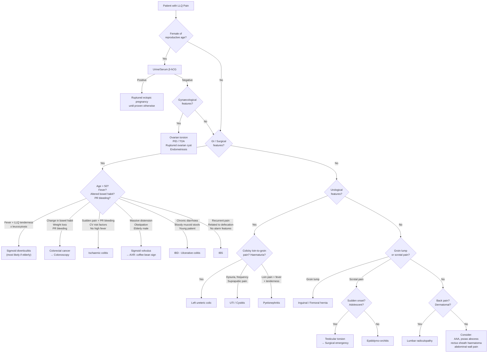

## Differential Diagnosis of LLQ Pain

### Overview: A Systematic Framework

The differential diagnosis of LLQ pain is best approached by thinking **organ-system-by-organ-system**, then refining based on the patient's **age, sex, acuity, and associated features**. The key clinical question at the bedside is always: *"Is this a surgical emergency, or can I afford the luxury of time to investigate?"*

***The lecture slides explicitly list the following as the causes of LLQ pain*** [9]:

- ***Sigmoid diverticulitis***
- ***Cancer of the sigmoid colon***
- ***Torsion of ovarian cyst**** (can be bilateral)
- ***Ruptured ectopic pregnancy**** (can be bilateral)
- ***Ureteric colic**** (can be bilateral)
- ***Inguinal/femoral hernia**** (can be bilateral)
- ***Testicular pathology**** (can be bilateral)

> The asterisked conditions can cause pain on **either** side of the lower abdomen. This is a high-yield exam point — the lecture specifically flags these with an asterisk.

***The lecture slide on formulating a differential diagnosis for lower abdominal pain*** [17] emphasizes constructing a systematic approach that considers both common and must-not-miss causes.

---

### Master Differential Diagnosis Table

The table below organizes the differential by organ system, with the most important distinguishing features and a brief pathophysiological rationale for **why** each condition causes LLQ pain.

| System | Condition | Key Distinguishing Features | Why It Causes LLQ Pain |
|---|---|---|---|
| **GI** | ***Sigmoid diverticulitis*** | ***LLQ pain + fever + leucocytosis*** [1][2]; progressive constant pain; may have palpable LLQ mass; altered bowel habit | Obstruction of diverticular neck by faecolith → bacterial overgrowth → inflammation → pericolic/peritoneal irritation in LLQ |
| | ***Cancer of sigmoid colon*** | Insidious change in bowel habit, PR bleeding, weight loss, iron deficiency anaemia; may present acutely with large bowel obstruction | Annular constricting tumour in sigmoid → partial/complete obstruction → colicky LLQ pain; direct serosal/peritoneal invasion → constant pain |
| | Ischaemic colitis | ***Sudden crampy abdominal pain + rectal bleeding within 24h*** [4]; elderly patient with cardiovascular risk factors; ***leucocytosis but fever unusual*** [4] | Hypoperfusion at watershed zones (Griffiths'/Sudeck's points) → mucosal ischaemia of the left colon → visceral then somatic pain |
| | Sigmoid volvulus | Elderly male, chronic constipation, massive distension, obstipation; "coffee bean" sign on AXR | Torsion of sigmoid around its mesentery → closed-loop obstruction → distension and ischaemia |
| | IBD — Ulcerative colitis (left-sided) | Bloody diarrhoea with mucus, tenesmus; young-to-middle-aged; ***diarrhoea rather than pain is predominant*** [1]; extraintestinal manifestations | Continuous mucosal inflammation from rectum extending proximally → LLQ pain when sigmoid/descending colon involved |
| | IBD — Crohn's disease | ***Fever, prolonged diarrhoea, weight loss, fatigue*** [18]; skip lesions, transmural; may have perianal disease, fistulae | Transmural inflammation of any GI segment — can involve sigmoid/descending colon |
| | IBS | ***Recurrent crampy pain associated with defecation, no alarm features*** [11]; ***increased by stress and meals*** [11] | Visceral hypersensitivity + altered motility in sigmoid → perceived pain in LLQ |
| | Infectious colitis | Acute diarrhoea (bloody or watery), fever, recent travel/antibiotic use; ***diarrhoea rather than pain is predominant*** [1] | Bacterial/protozoal invasion of colonic mucosa → inflammation; *C. difficile* if recent antibiotics |
| | Constipation / Faecal impaction | Elderly or immobile patients, palpable faecal mass in LLQ, history of infrequent bowel movements | Distension of sigmoid colon by retained stool → visceral pain |
| **Urological** | ***Ureteric colic (left)*** | ***Severe colicky loin-to-groin pain***, patient restless/writhing (cf. peritonitis where still); haematuria; ***pain decreased by movement*** [15] | Stone lodged at PUJ, pelvic brim, or VUJ → acute ureteric obstruction → peristaltic spasm against obstruction → referred pain along T11-L2 dermatomes to LLQ/groin |
| | UTI / Cystitis | ***Dysuria, frequency, urgency, suprapubic pain, foul-smelling urine; NO fever or systemic upset*** [19] | Bladder mucosal inflammation → suprapubic/lower abdominal discomfort; can be perceived in LLQ |
| | Pyelonephritis (left) | ***Classical triad: loin pain + tenderness + fever*** [20]; systemic upset (rigors, malaise); costovertebral angle tenderness | Ascending infection → renal parenchymal inflammation → capsular distension → loin pain radiating to LLQ |
| **Gynaecological** | ***Torsion of ovarian cyst*** | ***Sudden onset*** severe unilateral pelvic pain, nausea/vomiting; ovarian mass on USS; can be intermittent (partial torsion/detorsion) | Twisting of ovarian pedicle → venous then arterial compromise → ischaemia → peritoneal irritation |
| | ***Ruptured ectopic pregnancy*** | Amenorrhoea 4-8 weeks, +β-hCG, vaginal bleeding, ***shoulder tip pain*** [15] if haemoperitoneum, haemodynamic instability | Tubal rupture → intraperitoneal haemorrhage → peritoneal irritation in the relevant iliac fossa |
| | PID | Bilateral lower abdominal pain, fever, purulent vaginal discharge, ***cervical motion tenderness***, sexual history | Ascending infection from cervix → salpingitis → peritoneal inflammation in pelvis |
| | Tubo-ovarian abscess | ***Persistent fever despite antibiotics***, pelvic mass, usually follows PID | Walled-off pelvic collection from spread of PID → pressure and inflammation in adnexa |
| | Endometriosis | Cyclical pelvic pain related to menses, dysmenorrhoea, dyspareunia, subfertility | Ectopic endometrial tissue in pelvis → cyclical bleeding and inflammation → adhesions and fibrosis |
| | Ruptured ovarian cyst (non-ectopic) | ***Pain often begins during strenuous physical activity or intercourse*** [18]; sudden then gradually improving | Cyst rupture → peritoneal irritation by cyst fluid ± blood |
| | Mittelschmerz | Mid-cycle pain (day 14), mild, self-limiting, in reproductive-age women | Physiological follicular rupture at ovulation → minor peritoneal irritation |
| **Abdominal Wall** | ***Inguinal hernia*** | Groin lump ± cough impulse; if incarcerated → constant pain, features of IO; ***more common in males*** [7] | Bowel trapped in inguinal canal → distension → ischaemia if strangulated |
| | ***Femoral hernia*** | ***More common in elderly females***; lump below and lateral to pubic tubercle; ***40% present with strangulation*** [21]; often irreducible | Bowel trapped in narrow femoral canal → high strangulation risk due to rigid boundaries |
| **Testicular** | ***Testicular torsion*** | ***Sudden agonizing scrotal pain ± radiation to groin/lower abdomen*** [22]; adolescent male; high-riding testis, absent cremasteric reflex, -ve Prehn's sign | Torsion of spermatic cord → venous then arterial obstruction → testicular ischaemia; referred pain to LLQ via genitofemoral nerve (L1-L2) |
| | Epididymo-orchitis | ***Storage LUTS + unilateral testicular pain + high fever/rigors*** [19]; +ve Prehn's sign (pain relieved by elevation) | Infection of epididymis → inflammation → referred pain to ipsilateral lower abdomen |
| **Vascular** | Ruptured/leaking AAA | ***Classical triad: severe abdominal/back pain + hypotension + pulsatile abdominal mass*** [12]; ***30% misdiagnosed*** [12] | Rupture of infrarenal aorta → retroperitoneal haemorrhage → pain radiating to flank/LLQ depending on rupture site |
| **Musculoskeletal** | Psoas abscess | Hip flexion posture, fever, LLQ/flank pain; TB contact or Crohn's disease history | Abscess within psoas muscle → inflammation irritates the retroperitoneum and iliopsoas fascia |
| | Rectus sheath haematoma | Anticoagulation history, acute abdominal wall pain, +ve Carnett's sign | Inferior epigastric artery rupture → blood in rectus sheath → localized abdominal wall pain that worsens with muscle contraction |
| | ***Lumbar radiculopathy*** | Dermatomal distribution, back pain, neurological deficits; aggravated by Valsalva | Disc herniation/spinal stenosis → nerve root compression at L1-L2 → referred pain to LLQ [13][14] |

---

### Approach to Narrowing the Differential

The following algorithm integrates the key decision points:

---

### Key Differentiating Principles (Explaining "Why")

#### 1. Diverticulitis vs Colorectal Cancer

This is one of the most critical distinctions because both affect the sigmoid, both cause LLQ pain and both cause bowel wall thickening on CT [1]:

| Feature | Diverticulitis | CRC |
|---|---|---|
| ***Pericolonic/mesenteric inflammation (fat stranding)*** | Prominent | Minimal or absent |
| ***Length of involved segment*** | ***> 10 cm*** | Usually < 5 cm |
| ***Pericolonic lymph nodes*** | ***Absent*** (no enlarged nodes) | ***Present*** (enlarged) |
| Diverticula elsewhere | Present | May or may not be present |
| Luminal mass/shouldering | Absent | Present |
| Clinical resolution | Improves with antibiotics | Does not improve |

> ***CRC can only be excluded with colonoscopy after resolution of acute inflammation*** [1]. This is because acute inflammation can make CT findings indistinguishable. Wait at least **6-8 weeks** after an episode of diverticulitis before performing colonoscopy to rule out underlying malignancy, especially in patients > 50 years old or with alarm features.

<Callout title="Exam Trap" type="error">
Never forget: **diverticulitis and colorectal cancer can coexist.** A patient presenting with "typical diverticulitis" still needs a follow-up colonoscopy after resolution, particularly if they are over 50 or have never been screened. Up to 1-2% of patients diagnosed with "diverticulitis" on CT are found to have CRC on subsequent colonoscopy.
</Callout>

#### 2. Diverticulitis vs Appendicitis

In Hong Kong, ***right-sided diverticulitis is more common in the Asian population*** and is ***often confused with acute appendicitis*** [1][2]:

| Feature | Right-sided diverticulitis | Acute appendicitis |
|---|---|---|
| Age | Usually > 40 | Peak 20-30s |
| Pain pattern | RLQ from onset | Periumbilical → migrating to RLQ over 12-24h |
| Anorexia | Less prominent | ***Classical*** (part of MANTRELS score) |
| Imaging | CT: diverticula, fat stranding, no appendicolith | CT: dilated appendix, appendicolith, peri-appendiceal fat stranding |

While this distinction is more relevant to **RLQ** pain, it is worth knowing for LLQ pain in the reverse scenario: a **long redundant sigmoid or pelvic appendix** can present with LLQ pain mimicking left-sided diverticulitis.

#### 3. Diverticulitis vs IBD (Ulcerative Colitis)

| Feature | Diverticulitis | Ulcerative Colitis |
|---|---|---|
| Primary symptom | ***Abdominal pain*** is predominant | ***Diarrhoea*** is predominant [1] |
| Bleeding | Minimal (unless diverticular bleed, which is typically painless) | Bloody mucoid diarrhoea |
| Fever | Common | Less common unless severe/fulminant |
| Distribution | Segmental (sigmoid) | Continuous from rectum proximally |
| Age | Typically > 50 | Typically 20-40 |
| Extraintestinal features | Absent | Present (joints, eyes, skin) |

#### 4. Diverticulitis vs Infectious Colitis

***Diarrhoea rather than abdominal pain is the predominant symptom*** in both infectious colitis and IBD [1]. Key distinguishing features:

- Infectious colitis: travel history, recent antibiotics (*C. difficile*), food exposure, multiple household contacts
- *C. difficile*: classically associated with prior antibiotic use → produces toxins A (enterotoxin) and B (cytotoxin) → watery then bloody diarrhoea
- Stool cultures and *C. difficile* toxin assay are essential

#### 5. Ischaemic Colitis vs Diverticulitis

| Feature | Ischaemic Colitis | Diverticulitis |
|---|---|---|
| ***Rectal bleeding*** | ***Develops within 24 hours*** of pain onset [4] — a hallmark | Uncommon (unless diverticular bleed) |
| ***Fever*** | ***Unusual*** [4] | Common |
| Cardiovascular risk factors | Prominent (AF, heart failure, vasopressors) | Not specifically associated |
| Location | Watershed areas (splenic flexure, rectosigmoid) | Sigmoid (at diverticular sites) |
| AXR | ***Thumbprinting*** [4] | Non-specific or localized ileus |

Why the distinction matters: ischaemic colitis is usually **transient and self-limiting** (managed conservatively with bowel rest and supportive care), whereas complicated diverticulitis may require **drainage or surgery**.

#### 6. Sigmoid Volvulus vs Pseudo-Obstruction (Ogilvie's Syndrome) vs Toxic Megacolon

All three can present with massive colonic distension [5]:

| Feature | Sigmoid Volvulus | Ogilvie's Syndrome | Toxic Megacolon |
|---|---|---|---|
| Mechanism | Mechanical torsion of sigmoid | Functional (absent peristalsis without mechanical obstruction) | Inflammatory (colitis with systemic toxicity) |
| Typical patient | ***Elderly male***, chronic constipation, neuropsychiatric disease | ***Hospitalized patient*** post-surgery or severe illness | ***IBD, *C. difficile*, infectious colitis*** |
| AXR | "Coffee bean" sign, massively dilated sigmoid | Diffuse colonic dilatation, often caecum most dilated | Transverse colon dilatation > 6 cm |
| Bloody diarrhoea | Absent (obstruction) | Absent | ***Most common presentation*** [5] |
| Systemic toxicity | Late (if ischaemia) | Minimal | Prominent (fever, tachycardia, leucocytosis) |

#### 7. The Gynaecological Mimics

In **any female of reproductive age**, the differential must include [1][18]:

| Condition | Key Distinguishing Feature |
|---|---|
| ***Ruptured ectopic pregnancy*** | **+β-hCG**, amenorrhoea, vaginal bleeding, haemodynamic instability → **life-threatening** |
| ***Ovarian torsion*** | Sudden severe unilateral pain, nausea/vomiting, ovarian mass on USS, ***pain during exercise/intercourse*** [18] |
| PID | Bilateral lower abdominal pain, cervical motion tenderness, vaginal discharge, fever |
| ***Tubo-ovarian abscess*** | Persistent fever despite antibiotics [1], pelvic mass, usually a complication of PID [18] |
| Endometriosis | Cyclical pain related to menses, dysmenorrhoea, subfertility |
| Mittelschmerz | Mid-cycle, mild, self-limiting — diagnosis of exclusion |

#### 8. Hernia: Inguinal vs Femoral

| Feature | Inguinal Hernia | Femoral Hernia |
|---|---|---|
| Demographics | ***Male predominance*** [7] | ***70% female, mostly elderly*** [21] |
| Neck location | Above and medial to pubic tubercle | Below and lateral to pubic tubercle |
| Reducibility | Usually reducible | ***Often irreducible*** (narrow neck) [21] |
| Strangulation risk | Lower | ***Up to 40% present with strangulation*** [21] |
| Cough impulse | Usually present | Often absent (incarcerated) |

Why does this matter? A **femoral hernia** must be considered in any elderly female with LLQ pain and signs of bowel obstruction, even without an obvious groin lump — the hernia may be small and easily missed under the inguinal ligament.

#### 9. Testicular Torsion vs Epididymo-Orchitis

| Feature | Testicular Torsion | Epididymo-Orchitis |
|---|---|---|
| Age | ***Bimodal: neonatal + adolescent (12-18y)*** [22] | Young adults (STI) or elderly (UTI organisms) |
| Onset | ***Sudden, agonizing*** [22] | Gradual over hours-days |
| Prehn's sign | ***Negative*** (pain NOT relieved by elevation) [22] | Positive (pain relieved by elevation) |
| Cremasteric reflex | ***Absent*** [22] | Present |
| Testicular lie | ***High-riding, horizontal*** [22] | Normal |
| Systemic features | Nausea/vomiting, ***mild fever*** [22] | ***High fever, rigors*** [19] |
| Urgency | **Surgical emergency** — irreversible damage after 12h [22] | Antibiotics |

Why does testicular pathology cause LLQ pain? The testis is embryologically an intra-abdominal organ that descended into the scrotum. Its sensory innervation (via the genitofemoral nerve, L1-L2) shares dermatomes with the lower abdominal wall — so testicular pain is **referred** to the LLQ/RLQ. Always examine the scrotum in any male presenting with lower abdominal pain!

<Callout title="Clinical Pearl" type="idea">
**"In a young man with lower abdominal pain and an empty scrotum on that side, think testicular torsion."** Conversely, in an adolescent boy with "abdominal pain" who has not had his scrotum examined, you may miss a surgical emergency. The cremasteric reflex test has a sensitivity of ~99% in children for torsion (absent reflex = torsion until proven otherwise).
</Callout>

---

### The "Must-Not-Miss" List (Surgical Emergencies)

These are the conditions that will **kill or cause irreversible harm** if missed:

| Condition | Why It's an Emergency | Time-Sensitivity |
|---|---|---|
| **Ruptured ectopic pregnancy** | Intraperitoneal haemorrhage → hypovolaemic shock → death | Minutes to hours |
| **Testicular torsion** | Testicular ischaemia → irreversible infarction | < 6-12 hours |
| **Strangulated hernia** | Bowel ischaemia → necrosis → perforation → peritonitis | < 6 hours |
| **Sigmoid volvulus with ischaemia** | Closed-loop obstruction → gangrene → perforation | Hours |
| **Ruptured AAA** | Massive haemorrhage → death | Minutes |
| **Perforated diverticulitis (Hinchey III-IV)** | Faecal/purulent peritonitis → septic shock | Hours |
| **Ovarian torsion** | Ovarian infarction → loss of ovary | Hours |

---

### Age and Sex-Based Pattern Recognition

A useful clinical shortcut — while not a substitute for systematic assessment, pattern recognition helps prioritize the differential:

| Patient Profile | Top Differentials |
|---|---|
| **Adolescent male** | Testicular torsion, acute appendicitis (pelvic appendix), Meckel's diverticulitis |
| **Young woman (reproductive age)** | Ectopic pregnancy, ovarian torsion, PID, endometriosis, mittelschmerz |
| **Middle-aged adult** | Ureteric colic, IBD flare, diverticulitis (if > 40), CRC (if > 50) |
| **Elderly male** | Sigmoid diverticulitis, CRC, sigmoid volvulus, ischaemic colitis, AAA |
| **Elderly female** | Sigmoid diverticulitis, CRC, ischaemic colitis, femoral hernia |

---

<Callout title="High Yield Summary">

**Differential Diagnosis of LLQ Pain — Key Exam Points:**

1. ***Lecture-listed causes***: Sigmoid diverticulitis, sigmoid cancer, ovarian torsion*, ruptured ectopic*, ureteric colic*, inguinal/femoral hernia*, testicular pathology* (* = bilateral)
2. **Diverticulitis vs CRC on CT**: diverticulitis has ***pericolonic fat stranding, > 10 cm involvement, absence of enlarged lymph nodes***; CRC shows the opposite. ***CRC can only be excluded with colonoscopy after resolution of acute inflammation*** [1].
3. **Diverticulitis vs IBD/infectious colitis**: ***diarrhoea is the predominant symptom*** in IBD and infectious colitis, while ***abdominal pain is predominant*** in diverticulitis [1].
4. **Ischaemic colitis hallmarks**: ***sudden crampy pain + rectal bleeding within 24h; leucocytosis but fever unusual; thumbprinting on AXR*** [4].
5. ***Right-sided diverticulitis in Asia is often confused with acute appendicitis*** [1][2].
6. **Femoral hernia**: ***70% female, 40% present with strangulation*** — most dangerous hernia [21].
7. **Testicular torsion**: irreversible damage after 12h → surgical emergency; absent cremasteric reflex, high-riding testis [22].
8. **Always check β-hCG** in women of reproductive age — ruptured ectopic is life-threatening.
9. **Sigmoid volvulus ddx**: toxic megacolon (systemic toxicity + bloody diarrhoea) and Ogilvie's syndrome (hospitalized post-op patient, no mechanical obstruction) [5].

</Callout>

---

<ActiveRecallQuiz
  title="Active Recall - Differential Diagnosis of LLQ Pain"
  items={[
    {
      question: "Name 3 CT features that distinguish acute diverticulitis from colorectal cancer on imaging.",
      markscheme: "Diverticulitis: 1) Prominent pericolonic/mesenteric fat stranding, 2) Involved segment greater than 10 cm, 3) Absence of enlarged pericolonic lymph nodes. CRC shows the opposite: shorter segment, lymph node enlargement, luminal mass/shouldering."
    },
    {
      question: "A 72-year-old woman presents with sudden LLQ pain and mild PR bleeding within 12 hours. She is on digoxin for AF. Leucocytosis is present but she is afebrile. What is the most likely diagnosis and why is fever characteristically absent?",
      markscheme: "Ischaemic colitis. The condition is usually non-occlusive (transient low-flow state), affecting watershed areas. The damage is mostly mucosal and mediated by reperfusion injury rather than active bacterial infection, hence leucocytosis from tissue inflammation occurs but high fever is unusual."
    },
    {
      question: "Why must you always check beta-hCG in a woman of reproductive age with LLQ pain, and what is the time-critical diagnosis you are trying to exclude?",
      markscheme: "Ruptured ectopic pregnancy. Tubal rupture causes intraperitoneal haemorrhage leading to hypovolaemic shock and death within minutes-hours if untreated. Beta-hCG will be positive; absence of intrauterine pregnancy on ultrasound in the presence of positive beta-hCG strongly suggests ectopic."
    },
    {
      question: "Explain why testicular pathology can present as lower abdominal pain rather than scrotal pain, with reference to embryology and nerve supply.",
      markscheme: "The testis is embryologically an intra-abdominal organ that descended into the scrotum. Its sensory innervation travels via the genitofemoral nerve (L1-L2), sharing dermatomes with the lower abdominal wall. Therefore testicular pain is referred to the ipsilateral lower quadrant. Always examine the scrotum in males with lower abdominal pain."
    },
    {
      question: "Compare femoral hernia and inguinal hernia in terms of demographics, location of neck relative to the pubic tubercle, and strangulation risk.",
      markscheme: "Femoral hernia: 70% female (wider pelvis), neck below and lateral to pubic tubercle, up to 40% present with strangulation (narrow rigid femoral ring). Inguinal hernia: male predominance, neck above and medial to pubic tubercle, lower strangulation risk, usually reducible with cough impulse."
    },
    {
      question: "How do you distinguish sigmoid volvulus from Ogilvie syndrome and toxic megacolon — all three presenting with colonic distension?",
      markscheme: "Sigmoid volvulus: mechanical torsion, elderly constipated male, coffee-bean sign on AXR. Ogilvie syndrome: functional pseudo-obstruction in hospitalised/post-op patient, diffuse colonic dilatation, no mechanical cause. Toxic megacolon: systemic toxicity (fever, tachycardia, leucocytosis) with colonic dilatation, a/w IBD or C. difficile, bloody diarrhoea is the most common presentation."
    }
  ]}
/>

---

## References

[1] Senior notes: felixlai.md (Diverticular disease — Differential diagnosis, Diagnosis)
[2] Senior notes: maxim.md (Diverticular disease — Pathophysiology, Clinical features, Most common sites)
[4] Senior notes: Ryan Ho GI.pdf (p146 — Ischaemic Colitis, Clinical features, Laboratory features)
[5] Senior notes: felixlai.md (Volvulus — Differential diagnosis: Toxic megacolon, Ogilvie's syndrome)
[7] Senior notes: felixlai.md (Hernia — Risk factors)
[9] Lecture slides: GC 195. Lower and diffuse abdominal pain RLQ problems; pelvic inflammatory disease; peritonitis and abdominal emergencies.pdf (p6 — LLQ causes)
[11] Senior notes: Ryan Ho GI.pdf (p118 — IBS, Clinical features)
[12] Senior notes: Ryan Ho Cardiology.pdf (p222 — AAA, Classical triad, Misdiagnosis rate)
[13] Lecture slides: GC 226. Lumbar Spine Pathology_Part B (2).pdf
[14] Lecture slides: GC 226. Lumbar Spine Pathology_Part C (2).pdf
[15] Senior notes: Ryan Ho GI.pdf (p102); Ryan Ho Fundamentals.pdf (p276 — Pain characterisation, Radiation)
[17] Lecture slides: GC 195. Lower and diffuse abdominal pain RLQ problems; pelvic inflammatory disease; peritonitis and abdominal emergencies.pdf (p13 — Formulating differential diagnosis)
[18] Senior notes: felixlai.md (Acute appendicitis — Differential diagnosis: gynaecological causes)
[19] Senior notes: Ryan Ho Urogenital.pdf (p121 — Approach to Dysuria; p125 — Acute Cystitis)
[20] Senior notes: Ryan Ho Urogenital.pdf (p127 — Acute Pyelonephritis)
[21] Senior notes: Ryan Ho Urogenital.pdf (p225 — Femoral Hernia)
[22] Senior notes: Ryan Ho Urogenital.pdf (p233 — Testicular Torsion)
