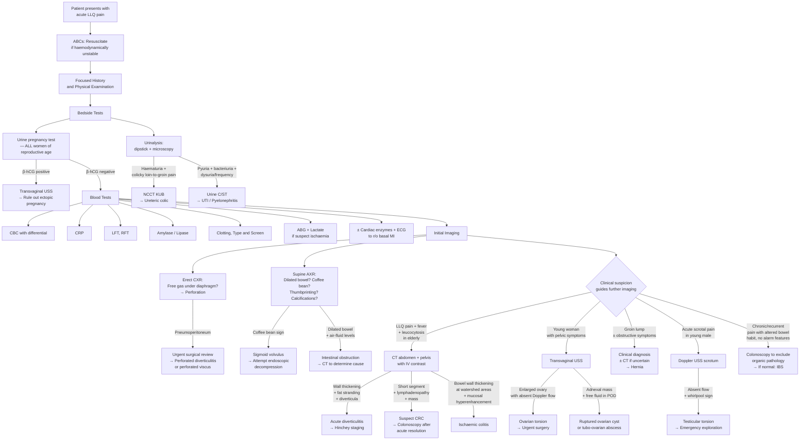

## Diagnostic Criteria, Algorithm and Investigations for LLQ Pain

### Preamble: The Diagnostic Philosophy

LLQ pain is a **symptom**, not a diagnosis. There is no single "diagnostic criterion" for LLQ pain itself — instead, you apply a **systematic investigative framework** to identify the *underlying cause*. The approach follows a logical sequence:

1. **Resuscitate** if haemodynamically unstable (ABCs first)
2. **History and physical examination** to generate a working differential
3. **Bedside tests** (urinalysis, pregnancy test) to immediately rule in/out life-threatening diagnoses
4. **Blood tests** to assess severity and narrow the differential
5. **Imaging** — the choice depends on the clinical scenario
6. **Endoscopy** — only when appropriate and safe (never in the acute phase of suspected perforation)

***The lecture slides lay out the investigation framework as*** [23]:
- ***Bedside tests: urinalysis, pregnancy test***
- ***Blood tests: blood count, renal and liver function, amylase, clotting profile, arterial blood gas, type and screen***
- ***Imaging: erect CXR, erect and supine AXR, USG, CT, contrast studies***
- ***Endoscopy: colonoscopy, upper endoscopy***

---

### 1. Diagnostic Criteria for Key Causes of LLQ Pain

Most causes of LLQ pain are diagnosed by a **combination of clinical features, laboratory findings, and imaging** rather than by a single set of formal criteria. However, several conditions have well-defined diagnostic frameworks:

#### 1.1 Acute Diverticulitis

There is no universally accepted formal "diagnostic criteria" set like the Tokyo criteria for cholecystitis. Instead, the diagnosis relies on a **clinical-radiological approach**:

| Component | Requirement |
|---|---|
| **Clinical** | LLQ pain (progressive, constant) + fever + leucocytosis → clinical triad [1][2] |
| **Imaging confirmation** | ***CT abdomen + pelvis with contrast*** is the gold standard [2][24] |
| **CT findings of acute diverticulitis** [1][24] | 1) Presence of colonic diverticula, 2) ***Localized bowel wall thickening ( > 4 mm)***, 3) ***Increased soft tissue density within pericolonic fat (fat stranding)***, 4) ± Complications (abscess, fistula, perforation) |

**Why CT and not just clinical diagnosis?** Because the clinical triad alone has a positive predictive value of only ~60-70%. CT both confirms the diagnosis and stages the severity (Hinchey classification), which directly guides management [24].

**Distinguishing diverticulitis from CRC on CT** [1]:

| Feature | Diverticulitis | CRC |
|---|---|---|
| Pericolonic fat stranding | ***Prominent*** | Minimal |
| Involved segment length | ***> 10 cm*** | Usually < 5 cm |
| Pericolonic lymph nodes | ***Absent (not enlarged)*** | ***Present (enlarged)*** |
| Diverticula elsewhere | Present | ± |

> ***Colonoscopy: only after resolution of acute episode (risk of perforation during acute inflammation)*** [24]. Purpose: definitive diagnosis (localisation), rule out CRC and IBD, assess complications (stenosis), and therapeutic (endoscopic haemostasis) [24].

***The diverticular disease lecture also mentions that initial workup for uncomplicated diverticulosis (asymptomatic) can include barium enema, colonoscopy, or CT colonography (CTC)*** [25].

#### 1.2 Acute Appendicitis (Relevant to RLQ but Hong Kong Context with Right-Sided Diverticulitis Mimic)

**Modified Alvarado (MANTREL) Score** [26][27]:

| Component | Points |
|---|---|
| **M**igratory RLQ pain | 1 |
| **A**norexia | 1 |
| **N**ausea or vomiting | 1 |
| **T**enderness in RLQ | 2 |
| **R**ebound tenderness in RLQ | 1 |
| **E**levated temperature > 37.5°C | 1 |
| **L**eucocytosis WBC > 10 × 10⁹/L | 1 |
| **Total** | **8** |

| Score | Interpretation |
|---|---|
| ***0-3*** | ***Unlikely → evaluate for other diagnoses*** [26] |
| ***4-6*** | ***Equivocal → consider USG or contrast CT*** [26][27] |
| ***≥ 7*** | ***Strongly suggestive → consider surgery or further imaging*** [26][27] |

> **Why include appendicitis here?** In Hong Kong, ***right-sided diverticulitis is more common in Asians and is often confused with acute appendicitis*** [1]. The Alvarado score was designed for appendicitis, but awareness of this overlap is essential — if CT shows diverticula rather than an inflamed appendix, the diagnosis changes completely.

#### 1.3 Acute Pancreatitis (Epigastric but Can Radiate to LLQ)

**Revised Atlanta Criteria** — requires ***≥ 2 out of 3*** [28][29]:

| Criterion | Detail |
|---|---|
| **Clinical** | Acute onset of persistent, severe epigastric pain often radiating to the back |
| **Biochemical** | Serum amylase or lipase ***≥ 3× upper limit of normal*** |
| **Imaging** | Characteristic findings on USG, CT, or MRI |

> Amylase ***peaks at 6-24 hours*** and normalizes in 3-5 days; lipase has a ***longer half-life (normalizes in 8-14 days)*** and is ***preferred for delayed presentations > 24 hours*** [29][30].

#### 1.4 Acute Cholecystitis (RUQ but Important Comparator)

**Tokyo Guidelines 2013 (TG13)** [31][32]:

| Component | Criteria |
|---|---|
| **A: Local signs** | Murphy's sign; RUQ mass/pain/tenderness |
| **B: Systemic signs** | Fever; ↑CRP; leucocytosis |
| **C: Imaging** | Findings characteristic of acute cholecystitis |
| **Suspected diagnosis** | 1× A + 1× B |
| **Definite diagnosis** | 1× A + 1× B + 1× C |

#### 1.5 Ischaemic Colitis

No formal diagnostic criteria — **clinical + imaging + endoscopic** diagnosis [4]:

| Component | Key Points |
|---|---|
| Clinical | Sudden crampy LLQ pain + rectal bleeding within 24h; elderly with CV risk factors; leucocytosis but ***fever unusual*** |
| Laboratory | ***↑↑WBC, metabolic acidosis, ↑serum lactate, ↑LDH, ↑CPK, ↑amylase*** [4]; stool culture + *C. difficile* toxin to rule out infectious diarrhoea |
| Imaging | AXR: ***thumbprinting, pneumatosis (advanced)*** [4]; CT: bowel wall thickening, pericolonic fat stranding, mucosal hyperenhancement |
| Endoscopy | Colonoscopy (cautious, limited insufflation): oedematous/cyanotic mucosa, submucosal haemorrhage, ulceration in segmental distribution at watershed areas |

#### 1.6 Sigmoid Volvulus

Diagnosis is primarily **clinical + radiological** [5]:

| Component | Key Finding |
|---|---|
| AXR | ***Coffee bean sign*** (massively dilated sigmoid loop from pelvis pointing toward RUQ); absence of rectal gas |
| CT | Whirl sign (twisted mesentery), dilated sigmoid, transition point at site of torsion |
| Contrast enema | Bird's beak / ace-of-spades sign at the site of torsion (rarely needed if CT available) |

#### 1.7 Ureteric Colic

Diagnosis confirmed by imaging [33][34]:

| Component | Key Points |
|---|---|
| Clinical | Severe colicky loin-to-groin pain, haematuria, restless patient |
| Urinalysis | Haematuria (present in ~85%, but ***absence does not exclude stones***) |
| ***NCCT abdomen and pelvis*** | ***Gold standard*** — sensitivity ~97%, specificity ~96%; detects size, location, density of stone and degree of obstruction [33][34] |
| KUB X-ray | ***90% of urinary stones are radio-opaque*** [30]; useful for follow-up but NCCT is standard for acute presentation |

---

### 2. Master Diagnostic Algorithm

The following mermaid diagram integrates the decision-making process from presentation to diagnosis:

---

### 3. Investigation Modalities: Detailed Breakdown

#### 3.1 Bedside Tests

| Investigation | What It Tells You | Why You Do It | Key Findings |
|---|---|---|---|
| ***Urinalysis (dipstick + microscopy)*** [23][30] | Screen for urological causes | Haematuria → stone, tumour, UTI; Pyuria → UTI, pyelonephritis; ***Sterile pyuria*** → inflammation from adjacent diverticulitis [1] | RBCs, WBCs, nitrites, leucocyte esterase, casts, crystals |
| ***Urine pregnancy test*** [23][30] | Rule out ectopic pregnancy | ***Indicated in ALL women of childbearing age*** [26] — most critical bedside test | Positive β-hCG → must locate pregnancy (intrauterine vs ectopic) |

<Callout title="Sterile Pyuria Pitfall" type="error">
***Sterile pyuria*** (WBCs in urine but negative culture) can occur when an inflamed sigmoid diverticulum lies adjacent to the left ureter or bladder — the inflammation causes a reactive pyuria without actual urinary infection [1]. Do not automatically treat with antibiotics for UTI; correlate with clinical picture. Conversely, ***presence of colonic flora on urine culture indicates a colovesical fistula*** [1] — a complication of diverticulitis.
</Callout>

#### 3.2 Blood Tests

| Investigation | What It Tells You | Key Findings and Interpretation |
|---|---|---|
| ***CBC with differential*** [23][30] | Infection, inflammation, chronic bleeding | ***Leucocytosis with left shift (↑bands)*** → infection/inflammation (diverticulitis, appendicitis); ***Markedly ↑↑WBC ( > 16)*** → gangrenous/perforated appendix [26]; ***Anaemia (↓MCV)*** → chronic blood loss (CRC); ***Normal WBC does NOT rule out appendicitis or diverticulitis*** [26] |
| ***CRP*** [23] | Inflammatory marker | Elevated in diverticulitis, IBD, PID; ***CRP > 10 mg/L with WBC > 10 × 10⁹/L gives PPV 61.5% and NPV 88.1% for appendicitis*** [26]; very high CRP in complicated diverticulitis |
| ***LFT*** [23][30] | Hepatobiliary cause; baseline for surgery | Obstructive pattern (↑ALP, ↑GGT, ↑bilirubin) → biliary pathology; ***Mild ↑bilirubin → marker for appendiceal perforation*** [26] |
| ***RFT*** [23][30] | Hydration status; contrast suitability | ***HypoK, hypoCl → prolonged vomiting*** [30]; ***Cr → suitability for contrast CT*** [30]; ↑urea/Cr ratio → dehydration |
| ***Amylase / Lipase*** [23][30] | Rule out pancreatitis | ***Amylase peaks at 6-24h; lipase preferred if > 24h presentation*** [29][30]; ***≥ 3× ULN diagnostic of pancreatitis*** [28][29]; mild elevations can occur in bowel obstruction, perforated ulcer, ischaemic bowel |
| ***Clotting profile + Type and Screen*** [23][30] | Baseline for surgery or procedure | Essential before any surgical intervention or invasive drainage |
| ***ABG + Lactate*** [23][30] | Ischaemia, acid-base status | ***Metabolic acidosis + ↑lactate → intestinal ischaemia*** [30]; ***Metabolic alkalosis → prolonged vomiting*** [30]; lactate is a sensitive marker for bowel ischaemia [5] |
| ***± Cardiac enzymes + ECG*** [30] | Rule out basal MI | Inferior MI can present as epigastric/lower abdominal pain — always consider in elderly with risk factors |
| ***± Glucose*** [30] | Rule out DKA | DKA can present with acute abdominal pain mimicking a surgical abdomen |
| ***Serum calcium + urate*** [33] | Underlying risk factors for stones | Hypercalcaemia → calcium stones; Hyperuricaemia → uric acid stones |

> ***The lecture slides specifically list: blood count, renal and liver function, amylase, clotting profile, arterial blood gas, type and screen*** [23].

#### 3.3 Imaging

***The lecture slides list: erect CXR, erect and supine AXR, USG, CT, contrast studies*** [23].

***The senior notes identify imaging of choice by site of pain*** [24]:

| ***Site of Pain*** | ***Imaging of Choice*** |
|---|---|
| ***RUQ*** | ***USG*** |
| ***LUQ*** | ***CT*** |
| ***RLQ*** | ***CT with IV contrast*** |
| ***LLQ*** | ***CT with IV contrast*** |
| ***Suprapubic*** | ***USG (TAS or TVS)*** |

##### 3.3.1 Erect Chest X-Ray (CXR)

| Finding | Significance | Why |
|---|---|---|
| ***Free gas under diaphragm (pneumoperitoneum)*** [1][30] | Perforated hollow viscus (e.g. perforated diverticulitis Hinchey III-IV, perforated peptic ulcer) | Free air escapes from the perforated bowel into the peritoneal cavity → rises to the highest point (subdiaphragmatic) when patient is erect |
| Pleural effusion | Pancreatitis (left-sided), basal pneumonia | Pancreatitis → diaphragmatic inflammation → reactive effusion; pneumonia can refer pain to abdomen |

##### 3.3.2 Abdominal X-Ray (AXR) — Supine and Erect

| Finding | Diagnosis Suggested | Pathophysiological Basis |
|---|---|---|
| ***Proximal dilatation + distal collapse*** (SB > 3 cm, LB > 6 cm, caecum > 9 cm — "***3-6-9 rule***") [30][35] | Mechanical intestinal obstruction | Bowel dilates proximal to obstruction due to gas + fluid accumulation; distal bowel decompresses |
| ***> 5 air-fluid levels on erect AXR*** [30][35] | ***Diagnostic of intestinal obstruction*** | Fluid levels form at interfaces of gas and liquid within obstructed loops |
| ***Coffee bean sign*** (LLQ to RUQ) [30][35] | ***Sigmoid volvulus*** | Massively dilated sigmoid loop with its convexity pointing towards RUQ; the central crease represents the twisted mesentery |
| ***Thumbprinting*** [4][35] | ***Ischaemic colitis, UC*** | Submucosal haemorrhage and oedema cause scalloped indentations along the colonic wall |
| ***Pneumatosis intestinalis*** [35] | Advanced ischaemia/necrosis | Gas produced by necrotic bowel wall bacteria dissects into the submucosa |
| ***Radio-opaque stones along ureter*** [30] | Ureteric calculus | ***90% of urinary stones are radio-opaque*** [30] (calcium-containing); trace ureter from kidney → tip of transverse process → SIJ → ischial spine → bladder [33] |
| ***Sentinel loop sign*** [29][30] | Localized ileus near inflammation (e.g. pancreatitis) | Focal inflammation causes reflex ileus of the adjacent bowel loop |
| Faecal loading in sigmoid/rectum | Faecal impaction/constipation | Accumulated faecal matter visible as mottled densities |

<Callout title="When AXR is NOT Enough" type="idea">
AXR is a **screening tool**, not a definitive investigation. It has low sensitivity for early diverticulitis, early ischaemia, and cannot stage disease. ***CT abdomen with contrast is the definitive imaging for most causes of acute LLQ pain*** [24]. AXR is most useful for: (1) confirming intestinal obstruction, (2) detecting pneumoperitoneum (if CXR equivocal), and (3) identifying volvulus.
</Callout>

##### 3.3.3 Ultrasound (USG)

| Modality | Indication | Key Findings |
|---|---|---|
| **Transabdominal USS (TAS)** | First-line for suprapubic pain, pelvic pathology; pregnant women; children [24][26] | **Diverticulitis**: bowel wall thickening > 4 mm at maximal tenderness, ***hypoechoic peridiverticular inflammatory reaction, mural/peridiverticular abscess with gas bubbles*** [1]; **Appendicitis**: non-compressible appendix > 6 mm, focal pain on compression, periappendiceal fat ↑echogenicity [26][27] |
| ***Transvaginal USS (TVS)*** | ***First-line for gynaecological causes*** (ectopic pregnancy, ovarian torsion, PID, ovarian cyst) [24] | **Ectopic pregnancy**: empty uterus with adnexal mass ± free fluid in pouch of Douglas; **Ovarian torsion**: enlarged ovary with absent/reduced Doppler flow, "whirlpool sign" of twisted pedicle |
| **Doppler USS scrotum** | Acute scrotal pain → testicular torsion vs epididymo-orchitis | **Torsion**: ***absent/reduced intratesticular blood flow, whirlpool sign, high-riding testis*** [22]; **Epididymo-orchitis**: increased flow (hyperaemia) |
| **Renal USS** | Screen for hydronephrosis in ureteric obstruction | Dilated renal pelvis/calyces; ***cannot reliably detect ureteric stones*** (only proximal and distal ends visualized) [33] |

> USS advantages: no radiation, portable, real-time. Disadvantages: operator-dependent, limited by body habitus and bowel gas, lower sensitivity than CT for deep structures.

##### 3.3.4 CT Abdomen and Pelvis with IV Contrast — The Workhorse

***CT abdomen + pelvis with contrast is the imaging of choice for LLQ pain*** [24].

| Condition | CT Findings | Interpretation |
|---|---|---|
| **Acute diverticulitis** [1][24] | ***Colonic diverticula, localized bowel wall thickening > 4 mm, pericolonic fat stranding, ± abscess (fluid collection with surrounding inflammatory changes, containing air/air-fluid levels/necrotic debris), ± fistula (extraluminal air tracking to adjacent organ), ± free air (perforation)*** | Staging by Hinchey classification guides management; ***CT also distinguishes diverticulitis from CRC*** (see criteria in section 1.1) |
| **Colorectal cancer** | Short segment ( < 5 cm) irregular wall thickening, "apple-core" lesion, shouldering, enlarged pericolonic lymph nodes, ± liver metastases | Requires colonoscopy for tissue diagnosis; CT stages extent (T, N, M) |
| **Ischaemic colitis** [4] | Segmental bowel wall thickening at watershed areas, mucosal hyperenhancement ("target sign"), pericolonic fat stranding, ***thumbprinting, pneumatosis (advanced), portal venous gas (very advanced)*** [35] | Distribution (splenic flexure, rectosigmoid) is key to diagnosis; pneumatosis/portal gas = likely transmural necrosis → surgery |
| **Sigmoid volvulus** | ***Whirl sign*** (twisted mesentery and vessels), dilated sigmoid, transition point, "beak" sign at torsion point | If no signs of ischaemia → attempt endoscopic decompression first |
| **Ureteric calculus** | ***NCCT*** (no contrast needed): hyperdense focus in ureter, proximal hydroureter/hydronephrosis, perinephric stranding, tissue rim sign around stone | Size predicts passage: < 5 mm → 90% spontaneous passage; > 10 mm → rarely passes spontaneously; location (PUJ, pelvic brim, VUJ) determines symptoms [33] |
| **Ruptured AAA** | Loss of aortic wall calcification continuity, retroperitoneal haematoma (high-density collection around aorta), contrast extravasation (active bleeding) | ***Do NOT delay for CT if patient is haemodynamically unstable with suspected ruptured AAA*** → go straight to theatre |
| **Psoas abscess** | Hypodense collection within psoas muscle ± gas, ± adjacent vertebral body destruction (TB) | CT-guided drainage may be both diagnostic and therapeutic [36] |

<Callout title="Contrast Considerations" type="error">
**IV contrast is contraindicated in**: (1) ***Renal insufficiency*** (check creatinine — eGFR < 30 is a relative contraindication; need pre-hydration if eGFR 30-45), (2) ***Contrast allergy*** (premedicate with steroids/antihistamines if history of reaction), (3) ***Pregnancy*** (relative — consider MRI instead). For **ureteric colic**, ***NCCT*** (non-contrast) is standard — contrast is not needed and may obscure small stones [33][34].
</Callout>

##### 3.3.5 Other Imaging Modalities

| Modality | Indication | Key Points |
|---|---|---|
| **CT angiography (CTA)** | Mesenteric ischaemia, AAA assessment | ***Gold standard for mesenteric ischaemia*** — shows arterial occlusion (absent enhancement) or venous thrombosis (filling defects) [35]; allows planning for endovascular intervention |
| **MRI abdomen/pelvis** | Pregnant patients, children (avoids radiation); characterization of pelvic masses | No ionizing radiation; ***higher non-diagnostic rate than CT*** [26]; useful for soft tissue characterization |
| **Barium/water-soluble contrast enema** | ***CT colonography (CTC) or contrast enema for uncomplicated diverticulosis*** [25]; colovesical fistula workup | ***AVOID in acute setting*** (risk of barium peritonitis if perforation); water-soluble contrast safer; shows "bird's beak" sign in volvulus |
| **IV urogram (IVU)** | Largely replaced by CTU; gives functional information | Risk of contrast nephrotoxicity and anaphylaxis; ***no longer standard for acute loin pain evaluation*** [33] |
| **NCCT KUB** | ***Standard investigation for acute loin pain / ureteric colic*** [34] | Allows assessment of level, size, density, and degree of obstruction of calculi [33] |

##### 3.3.6 Special Note on CXR and AXR in Acute Abdomen

Why do we order ***both*** an erect CXR and supine AXR as "first-line" in any acute abdomen [23][30]?

- **Erect CXR**: Most sensitive for detecting ***free gas under the diaphragm*** (as little as 1 mL of free air can be detected under the right hemidiaphragm). It also rules out thoracic causes of abdominal pain (basal pneumonia, pleural effusion).
- **Supine AXR**: Shows bowel gas pattern (dilated loops → obstruction), faecal loading, radio-opaque stones, and specific signs (coffee bean, thumbprinting).
- **Erect AXR**: Air-fluid levels (multiple levels diagnostic of obstruction).

> These are **quick, cheap, readily available** tests that can be done at the bedside or in the ED and may immediately confirm a surgical emergency (perforation, obstruction, volvulus) before waiting for CT.

#### 3.4 Endoscopy

***The lecture mentions colonoscopy and upper endoscopy*** [23].

| Modality | Indication | Important Caveats |
|---|---|---|
| **Colonoscopy** | ***Only AFTER resolution of acute diverticulitis*** (6-8 weeks) to rule out CRC [24]; diagnosis of IBD; evaluation of lower GI bleeding; therapeutic decompression in sigmoid volvulus | ***AVOID in acute abdomen*** — gas insufflation during endoscopy may open a sealed-off perforation [24]; in sigmoid volvulus, flexible sigmoidoscopy can decompress and detort the bowel (use with rectal tube placement) |
| **Upper endoscopy (OGD)** | If upper GI cause suspected (e.g. perforated peptic ulcer with tracking to LLQ — Valentino's sign) | Rarely indicated for primary LLQ pain |
| **Sigmoidoscopy** | Ischaemic colitis (limited insufflation, cautious) | Shows oedematous, haemorrhagic, or ulcerated mucosa at watershed areas; biopsy confirms ischaemic changes |
| **Cystoscopy** | Haematuria evaluation; suspected colovesical fistula | ***Should be done in ALL patients with gross non-glomerular haematuria*** [33]; can visualize fistula opening in bladder |

#### 3.5 Diagnostic Laparoscopy

- Indicated when diagnosis remains uncertain after all investigations, especially in young women (to differentiate gynaecological from GI causes) [24]
- Can be both diagnostic and therapeutic (e.g. appendicectomy, ovarian detorsion, washout of peritonitis)

---

### 4. Condition-Specific Investigation Pathways

#### 4.1 Suspected Acute Diverticulitis

| Step | Investigation | Purpose |
|---|---|---|
| 1 | CBC, CRP, LFT, RFT, amylase | Confirm inflammation, exclude pancreatitis, baseline |
| 2 | ***Urinalysis and culture*** | ***Sterile pyuria*** (adjacent inflammation) vs colonic flora (colovesical fistula) [1] |
| 3 | Urine pregnancy test (if applicable) | Exclude ectopic pregnancy |
| 4 | Erect CXR | Exclude perforation (pneumoperitoneum) |
| 5 | ***CT abdomen + pelvis with IV contrast*** | ***Gold standard***: confirm diagnosis, Hinchey staging, exclude CRC, guide drainage [1][24] |
| 6 | ***Colonoscopy 6-8 weeks later*** | ***Rule out CRC*** (especially if age > 50, first episode, or alarm features) [24] |

#### 4.2 Suspected Sigmoid Volvulus

| Step | Investigation | Purpose |
|---|---|---|
| 1 | CBC, RFT, lactate, ABG | Leucocytosis and lactate elevation suggest ischaemia |
| 2 | ***Supine AXR*** | ***Coffee bean sign*** — often diagnostic |
| 3 | CT abdomen (if AXR inconclusive) | Whirl sign, transition point, rule out ischaemia |
| 4 | ***Sigmoidoscopy*** | ***Therapeutic decompression*** (if no signs of ischaemia/peritonitis) + rectal tube placement |

#### 4.3 Suspected Ischaemic Colitis

| Step | Investigation | Purpose |
|---|---|---|
| 1 | CBC, CRP, lactate, ABG, LDH, CPK | ***↑↑WBC, metabolic acidosis, ↑lactate, ↑LDH, ↑CPK*** [4] |
| 2 | ***Stool culture + C. difficile toxin*** | ***Rule out infectious diarrhoea*** [4] |
| 3 | AXR | Thumbprinting, pneumatosis |
| 4 | ***CT abdomen with contrast*** | Segmental wall thickening at watershed areas, target sign |
| 5 | ***Colonoscopy (cautious, limited insufflation)*** | Confirm mucosal ischaemic changes, biopsy; avoid in suspected transmural necrosis/perforation |

#### 4.4 Suspected Ectopic Pregnancy

| Step | Investigation | Purpose |
|---|---|---|
| 1 | ***Urine β-hCG*** (bedside) | Rapid screen; if positive → proceed |
| 2 | ***Serum quantitative β-hCG*** | Levels guide USS interpretation (discriminatory zone: ~1500-2000 IU/L for TVS) |
| 3 | ***Transvaginal USS (TVS)*** | Locate pregnancy: if no intrauterine pregnancy with β-hCG above discriminatory zone → ectopic until proven otherwise |
| 4 | CBC, T/S, clotting | Baseline for possible emergency surgery |

#### 4.5 Suspected Ureteric Colic

| Step | Investigation | Purpose |
|---|---|---|
| 1 | Urinalysis (dipstick + microscopy) | Haematuria (present in ~85%); ***absence does not exclude stones*** |
| 2 | CBC, RFT, calcium, urate | Baseline; RFT for contrast suitability; calcium/urate for stone aetiology |
| 3 | ***NCCT KUB*** | ***Gold standard***: stone location, size, density, degree of obstruction [33][34] |
| 4 | Renal USS (if NCCT unavailable or pregnant) | Hydronephrosis ± proximal/distal ureteric stone |

---

<Callout title="High Yield Summary">

**Diagnostic Approach to LLQ Pain — Key Exam Points:**

1. ***CT abdomen + pelvis with IV contrast is the imaging of choice for LLQ pain*** [24]. For ureteric colic specifically, use ***NCCT*** (no contrast needed).
2. ***Bedside tests first***: urinalysis + pregnancy test. **Never skip the pregnancy test in a woman of reproductive age.**
3. ***Erect CXR*** for pneumoperitoneum; ***AXR*** for bowel gas pattern (coffee bean sign = volvulus, thumbprinting = ischaemia, air-fluid levels = obstruction).
4. ***Diverticulitis diagnosis***: clinical triad + CT showing wall thickening > 4 mm, fat stranding, diverticula. ***Colonoscopy only after acute resolution*** (6-8 weeks) to rule out CRC [24].
5. ***Sterile pyuria*** in diverticulitis = adjacent inflammation; ***colonic flora in urine culture*** = colovesical fistula [1].
6. ***Alvarado (MANTREL) score*** for appendicitis: ≥ 7 = strongly suggestive; 4-6 = consider imaging; 0-3 = unlikely [26].
7. ***Revised Atlanta criteria*** for pancreatitis: ≥ 2/3 of epigastric pain + amylase/lipase ≥ 3× ULN + imaging findings [28].
8. ***Blood tests panel***: CBC, CRP, LFT, RFT, amylase, clotting, T/S, ± ABG/lactate, ± cardiac enzymes — all serve specific diagnostic purposes.
9. ***Lactate + ABG*** are critical when you suspect ischaemic bowel — metabolic acidosis with raised lactate = tissue hypoperfusion.
10. ***AVOID colonoscopy and barium enema in the acute phase*** of diverticulitis or any suspected perforation — risk of exacerbating the perforation [24].

</Callout>

---

<ActiveRecallQuiz
  title="Active Recall - Diagnostic Criteria, Algorithm and Investigations for LLQ Pain"
  items={[
    {
      question: "What is the imaging of choice for acute LLQ pain and what are the four key CT findings of acute diverticulitis?",
      markscheme: "CT abdomen + pelvis with IV contrast. Key findings: 1) Colonic diverticula, 2) Localized bowel wall thickening greater than 4 mm, 3) Pericolonic fat stranding, 4) Complications such as abscess, fistula, or free air."
    },
    {
      question: "Why should colonoscopy be avoided during an acute episode of diverticulitis? When should it be performed and why?",
      markscheme: "Gas insufflation during colonoscopy may open a sealed-off perforation, worsening peritonitis. Colonoscopy should be performed 6-8 weeks after resolution of the acute episode to rule out underlying colorectal cancer, especially in patients over 50 or with alarm features."
    },
    {
      question: "A patient with LLQ pain has sterile pyuria on urinalysis. What does this suggest and how does it differ from finding colonic flora on urine culture?",
      markscheme: "Sterile pyuria suggests reactive inflammation of the ureter or bladder from an adjacent inflamed sigmoid diverticulum (not true UTI). Colonic flora on urine culture indicates a colovesical fistula — a direct communication between the sigmoid colon and bladder, a complication of diverticulitis."
    },
    {
      question: "List the components of the Modified Alvarado (MANTREL) score and the interpretation of scores 0-3, 4-6, and 7 or above.",
      markscheme: "M - Migratory RLQ pain (1), A - Anorexia (1), N - Nausea/vomiting (1), T - RLQ tenderness (2), R - Rebound tenderness (1), E - Elevated temperature greater than 37.5 degrees C (1), L - Leucocytosis WBC greater than 10 (1). Total 8 points. 0-3: unlikely appendicitis, evaluate other DDx. 4-6: equivocal, consider USG or CT. 7 or more: strongly suggestive, consider surgery or imaging."
    },
    {
      question: "What specific AXR finding is diagnostic for sigmoid volvulus, and what does it represent anatomically?",
      markscheme: "Coffee bean sign: a massively dilated sigmoid loop with its convexity pointing from the pelvis towards the RUQ. The central crease represents the twisted mesentery. The sigmoid loop forms a closed loop obstruction, so gas and secretions accumulate but cannot escape, causing dramatic dilatation."
    },
    {
      question: "State the Revised Atlanta criteria for diagnosing acute pancreatitis and explain why lipase is preferred over amylase in delayed presentations.",
      markscheme: "Requires 2 out of 3: 1) Acute epigastric pain often radiating to back, 2) Serum amylase or lipase at least 3 times upper limit of normal, 3) Characteristic imaging findings on USG, CT, or MRI. Lipase is preferred in delayed presentations (greater than 24 hours) because it has a longer half-life (normalizes in 8-14 days vs 3-5 days for amylase), so it remains elevated when amylase may have already returned to normal."
    }
  ]}
/>

---

## References

[1] Senior notes: felixlai.md (Diverticular disease — Diagnosis, CT features, Urinalysis findings)
[2] Senior notes: maxim.md (Diverticular disease — Clinical triad, CT findings)
[4] Senior notes: Ryan Ho GI.pdf (p146 — Ischaemic Colitis, Laboratory features, AXR findings)
[5] Senior notes: felixlai.md (Volvulus — Diagnosis, Biochemical tests, Lactate)
[22] Senior notes: Ryan Ho Urogenital.pdf (p233 — Testicular Torsion, Doppler USS)
[23] Lecture slides: GC 195. Lower and diffuse abdominal pain RLQ problems; pelvic inflammatory disease; peritonitis and abdominal emergencies.pdf (p12 — Investigations)
[24] Senior notes: maxim.md (Acute abdomen — Imaging by site; Diverticular disease — CT, Colonoscopy, Hinchey)
[25] Lecture slides: Diverticular diseases - Dr. J Tsang.pdf (p6 — Investigations for diverticulosis: Ba enema, colonoscopy, CTC)
[26] Senior notes: Ryan Ho GI.pdf (p150 — Appendicitis workup, Alvarado score, Imaging)
[27] Senior notes: felixlai.md (Acute appendicitis — Alvarado score, CT and USG findings)
[28] Senior notes: felixlai.md (Acute pancreatitis — Diagnostic criteria)
[29] Senior notes: maxim.md (Acute pancreatitis — Revised Atlanta criteria, Amylase vs Lipase)
[30] Senior notes: Ryan Ho GI.pdf (p105); Ryan Ho Fundamentals.pdf (p279 — Investigations for acute abdomen)
[31] Senior notes: felixlai.md (Acute cholecystitis — Tokyo criteria 2013)
[32] Senior notes: Ryan Ho GI.pdf (p248 — TG13 diagnostic criteria for acute cholecystitis)
[33] Senior notes: Ryan Ho Urogenital.pdf (p134 — KUB, NCCT, Cystoscopy, Upper tract imaging)
[34] Senior notes: Ryan Ho Urogenital.pdf (p140 — NCCT for acute loin pain, IVU no longer standard)
[35] Senior notes: Ryan Ho GI.pdf (p136 — AXR findings in IO, 3-6-9 rule, Coffee bean sign, Thumbprinting)
[36] Senior notes: Ryan Ho Diagnostic Radiology.pdf (p81 — CT-guided drainage of pelvic abscess)
