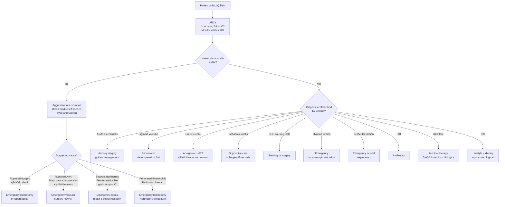

## Management of LLQ Pain

### Philosophy of Management

The management of LLQ pain is **cause-specific** — there is no single treatment algorithm for "LLQ pain" itself. The overarching principles are:

1. **Resuscitate** the patient (ABCs, haemodynamic stabilisation)
2. **Identify and treat surgical emergencies** immediately (ruptured ectopic, testicular torsion, strangulated hernia, perforated diverticulitis, sigmoid volvulus with ischaemia)
3. **Determine the underlying cause** (as per the diagnostic workup in the previous section)
4. **Institute cause-specific treatment** — conservative, medical, interventional, or surgical

---

### Master Management Algorithm

---

### 1. General Supportive Management (Applies to All Causes)

These are the **initial resuscitative measures** that apply regardless of the eventual diagnosis. Think of them as what you do **while** you are working up the cause [37][38].

| Measure | Rationale | Details |
|---|---|---|
| ***NPO (nil per os)*** [37][38] | Limits bowel distension; prepares for potential surgery; rests the bowel in inflammation | All patients with suspected surgical abdomen should be NPO until a plan is established |
| ***IV fluid resuscitation*** [37][38] | Compensates for: external losses (vomiting), internal losses (third-space sequestration), reduced oral intake | Crystalloids: **normal saline (NS)** or **Ringer's lactate / Hartmann's solution**; K⁺ replacement as needed but caution in AKI [37] |
| ***Nasogastric tube (NGT) decompression*** [37][38] | Decompresses dilated proximal bowel (reduces vomiting, aspiration risk); "drip and suck" principle | Placed on free drainage with 4-hourly aspiration; use non-vented (Ryle) or vented (Salem Sump) tube [37] |
| ***Analgesia*** | Pain control is essential and does NOT mask clinical signs when used appropriately | NSAIDs first-line for renal colic [34]; opioids for severe visceral pain; avoid opioids if bowel obstruction suspected (↓motility) |
| ***Broad-spectrum antibiotics*** [37][38] | Cover for bacterial translocation from obstructed/ischaemic/inflamed bowel | Indicated when infection suspected (diverticulitis, perforation, strangulation); prophylactic before any emergency surgery |
| ***Urinary catheter*** | Monitor urine output as a marker of end-organ perfusion | Especially important in haemodynamically unstable patients and those going to theatre |
| ***Blood tests + Type and Screen*** [37] | Baseline for surgery; cross-match blood if haemorrhage suspected | T/S mandatory before any operative intervention |

---

### 2. Condition-Specific Management

#### 2.1 Acute Diverticulitis

This is the **most common** cause of LLQ pain requiring specific management in clinical practice. Management is stratified by the ***Hinchey classification*** [2][24][39].

##### 2.1.1 Uncomplicated Diverticulitis (No Abscess, Perforation, or Fistula)

**A. Outpatient Management** (mild, immunocompetent, tolerating oral intake, no significant comorbidities):

| Component | Details |
|---|---|
| ***Oral antibiotics for 7-10 days*** [39] | ***Amoxicillin-clavulanate*** (single agent) **OR** ***Metronidazole + Cotrimoxazole*** **OR** ***Ciprofloxacin*** **OR** ***Moxifloxacin*** [39] |
| Diet | Clear liquid diet initially → advance to low-residue diet as symptoms improve → long-term high-fibre diet |
| Follow-up | Review in 2-3 days to ensure clinical improvement |

> **Why antibiotics?** The inflamed diverticulum contains trapped bacteria (faecal flora) that drive the infective process. Coverage must include **Gram-negative aerobes** (e.g. *E. coli*) and **anaerobes** (e.g. *Bacteroides*). Metronidazole ("metro" = measure, originally for *Trichomonas*) is the cornerstone anti-anaerobic agent.

<Callout title="Evolving Practice" type="idea">
According to **WSES 2016 guidelines**, antibiotics may not be strictly necessary for immunocompetent patients with uncomplicated diverticulitis and no systemic signs of infection [40]. However, this practice remains controversial and is **not yet standard in Hong Kong** — most local units still prescribe antibiotics routinely.
</Callout>

**B. Inpatient Management** (moderate symptoms, unable to tolerate oral, significant comorbidity, immunocompromised, failed outpatient therapy):

| Component | Details |
|---|---|
| ***NPO + IV fluids*** | Bowel rest; correct dehydration |
| ***IV antibiotics*** [39][40] | ***Piperacillin-tazobactam (tazocin)*** **OR** ***Metronidazole + Cephalosporin (e.g. cefuroxime) or Fluoroquinolone*** [39]; switch to PO after clinical resolution (typically 3-5 days) [40]; total course 10-14 days |
| Analgesia | Paracetamol ± opioids; **avoid NSAIDs** (may worsen diverticulitis/increase perforation risk) |
| Monitoring | Vital signs, abdominal examination, WBC/CRP trends |

##### 2.1.2 Complicated Diverticulitis — Managed by Hinchey Stage

***CT abdomen staging using the Hinchey classification directly guides management*** [2][24]:

| ***Hinchey Stage*** | ***Description*** | ***Mortality*** | ***Management*** |
|---|---|---|---|
| ***I*** | ***Localised pericolic abscess*** | ***0%*** | ***IV antibiotics ± percutaneous drainage if abscess > 4-5 cm*** [24][40] |
| ***II*** | ***Distant abscess (retroperitoneal/pelvic)*** | ***5%*** | ***IV antibiotics + image-guided percutaneous drainage*** [24][40] |
| ***III*** | ***Generalised purulent peritonitis (abscess ruptured, bowel intact)*** | ***25%*** | ***IV antibiotics + surgery: Hartmann's procedure or one-stage resection*** [24] |
| ***IV*** | ***Faecal peritonitis (bowel wall perforation)*** | ***50%*** | ***IV antibiotics + surgery: Hartmann's procedure*** [24] |

**Why the 4-5 cm cut-off for abscess drainage?** [40]
- Abscesses ***< 4-5 cm*** tend to respond to antibiotics alone because the host's immune system can wall off and resorb small collections.
- Abscesses ***≥ 4-5 cm*** have too large a bacterial load for antibiotics to sterilize — they need **source control** via percutaneous drainage (CT-guided insertion of a pigtail catheter into the abscess cavity to evacuate pus).

**Microperforation** (localized pericolic air or small fluid on CT) is ***NOT considered complicated disease*** — it is managed as uncomplicated diverticulitis [40].

##### 2.1.3 Surgical Treatment

***Indications for emergency surgery*** [39]:

- ***Frank (free) perforation*** (Hinchey III-IV)
- ***Failure of medical treatment with IV antibiotics***
- ***Colonic obstruction***
- ***Abscess failing non-operative intervention***

**Surgical Options:**

| Procedure | Description | When Used |
|---|---|---|
| ***Hartmann's procedure*** | Resection of diseased sigmoid → end colostomy + closure of rectal stump (Hartmann's pouch) | ***Emergency surgery for Hinchey III-IV*** [24]; safest option in septic, haemodynamically unstable patient — avoids anastomotic leak risk |
| ***One-stage resection with primary anastomosis*** | Resection of sigmoid + immediate colorectal anastomosis ± proximal diverting ileostomy | Selected Hinchey III patients who are haemodynamically stable, without severe contamination; lower morbidity than Hartmann's if patient is suitable |
| ***Laparoscopic lavage*** | Peritoneal washout without resection | Considered for Hinchey III (purulent peritonitis) in select centres; controversial — some evidence of higher re-intervention rate |

> **Why Hartmann's?** In an emergency with faecal peritonitis, the bowel is oedematous, friable, and contaminated. Creating an anastomosis in this environment carries a very high leak rate (up to 30-50%). Hartmann's procedure avoids this risk by bringing the proximal end out as a colostomy and closing the rectal stump. Reversal of the colostomy can be attempted later (typically 3-6 months) when the patient has recovered.

***Indications for elective surgery (interval sigmoid colectomy with primary anastomosis)*** [39][40]:

- ***Previous complicated diverticulitis*** (Hinchey III-IV that was managed non-operatively initially)
- ***Immunocompromised patients*** (higher risk of perforation and poorer healing)
- ***Inability to exclude malignancy*** on follow-up colonoscopy
- ***Persistent symptoms*** (smouldering diverticulitis)
- ***Fistula formation*** (e.g. colovesical — requires en-bloc resection of fistula tract + sigmoid colectomy + bladder repair)
- ***Stricture causing obstruction***

<Callout title="Important Paradigm Shift" type="error">
***Recurrent episodes of uncomplicated diverticulitis are NO longer an indication for elective surgery*** [39][40]. This was previously thought to increase complication risk, but current evidence shows that ***prior uncomplicated attacks do NOT predict increased incidence or severity of future attacks***. The old "two-strikes-and-you're-out" rule has been abandoned.
</Callout>

##### 2.1.4 Management of Diverticular Bleeding

Diverticular bleeding is distinct from diverticulitis — they rarely coexist [2][24].

| Step | Management |
|---|---|
| 1 | ***Fluid resuscitation and blood transfusion*** [39] |
| 2 | ***50% of diverticular bleeding stops spontaneously*** [24] |
| 3 | ***Colonoscopy to identify bleeding site and achieve haemostasis*** (adrenaline injection, metallic clips, thermal coagulation) [24][39] |
| 4 | If colonoscopy fails → ***mesenteric angiography with super-selective embolisation*** |
| 5 | If angiography fails → ***on-table lavage and colonoscopy*** |
| 6 | ***Indications for laparotomy and subtotal/total colectomy***: haemodynamically unstable despite resuscitation; excessive blood transfusion > 6 units; frequent rebleeding or persistent bleeding [39] |

##### 2.1.5 Long-Term Management of Diverticular Disease

| Measure | Rationale |
|---|---|
| ***High-fibre diet*** [24] | Increases stool bulk → reduces intraluminal pressure → prevents new diverticula and symptoms |
| ***Bulk laxatives (e.g. methylcellulose)*** [24] | Same rationale as above |
| ***Weight reduction*** [24] | Obesity increases diverticular complications |
| ***Antispasmodics if colicky pain*** [24] | Reduce smooth muscle spasm in symptomatic uncomplicated diverticular disease (SUDD) |
| ***Avoid stimulant laxatives*** [24] | May increase intraluminal pressure → worsen disease |
| ***Avoid NSAIDs*** [24] | Increase risk of diverticular complications (bleeding and perforation) |
| ***Colonoscopy 6 weeks after acute episode*** [40] | ***Rule out CRC*** — 2.8% of CT-diagnosed "diverticulitis" cases turn out to be CRC [40] |

---

#### 2.2 Sigmoid Volvulus

| Phase | Management | Details |
|---|---|---|
| **Initial (no peritonitis/ischaemia)** | ***Endoscopic decompression by flexible sigmoidoscopy*** [37][41] | Pass a sigmoidoscope to the site of torsion → gently advance past the twist → dramatic decompression with rush of gas/liquid stool → place a **rectal flatus tube** to maintain decompression |
| **Post-decompression** | ***Interval sigmoid colectomy*** | ***50% recurrence rate*** with endoscopic decompression alone [41]; ***young patients should have sigmoid colectomy*** due to high recurrence [37]; elderly/frail patients may be managed with repeated decompression |
| **Peritonitis / ischaemia / failed decompression** | ***Emergency laparotomy*** | Resection of gangrenous sigmoid ± **Hartmann's procedure** if contamination/instability; primary anastomosis if bowel is viable and patient is stable |

> **Why does volvulus recur?** The underlying predisposition — a long, redundant sigmoid with a narrow mesenteric attachment — is not corrected by decompression alone. Only resection removes the at-risk segment.

---

#### 2.3 Ischaemic Colitis

Management is stratified by severity [4][42]:

##### Low-to-Moderate Risk (Most Patients)

| Component | Details | Rationale |
|---|---|---|
| ***NPO, NGT on suction if ileus*** [42] | Bowel rest | Reduce metabolic demand on ischaemic bowel |
| ***IV fluids*** | Optimise circulating volume | Improve splanchnic perfusion |
| ***Broad-spectrum antibiotics*** [42] | Cover for bacterial translocation | Ischaemic mucosa loses barrier function → risk of secondary infection |
| ***Rectal tube decompression*** [42] | Decompress distended colon | Reduce intraluminal pressure → improve mural perfusion |
| ***Withhold offending agents*** | Stop vasopressors, digoxin, diuretics if possible | These reduce splanchnic blood flow |
| ***± Antithrombotics*** | If clinical indication of occlusive disease | Prevent clot propagation |

##### High Risk / Infarction / Necrosis — Indications for Surgery [42]

***Features suggestive of severe ischaemia or infarction/necrosis*** [42]:

1. ***Ongoing pain out of proportion to physical examination or with peritoneal signs***
2. ***Haemodynamic instability or sepsis, persistent fever***
3. ***Involvement of right colon*** (implies more extensive proximal disease)
4. ***Pneumatosis coli or portalis, or perforation (free gas) on AXR***
5. ***Gangrene on colonoscopy***

**Surgical approach**: Emergency laparotomy → resection of ischaemic segments ± primary anastomosis → second-look procedure at 24-48 hours to reassess viability [42]

> **Why is right colon involvement ominous?** Right-sided ischaemic colitis implies SMA territory involvement (not just IMA watershed zones), suggesting a more proximal and severe vascular insult — often embolic or thrombotic rather than the typical non-occlusive cause.

**Prognosis**: ***Mortality < 5% in non-gangrenous disease but up to 50-75% if gangrene develops*** [42]

---

#### 2.4 Colorectal Cancer Causing LBO

| Scenario | Management |
|---|---|
| **Resectable, no perforation/ischaemia** | ***Endoscopic self-expanding metallic stent (SEMS) as bridge to surgery*** [41] → elective definitive resection 1-2 weeks later; allows bowel preparation → better surgical outcome, lower stoma rate, more time to stage disease |
| **Resectable, stable but stenting not feasible** | Emergency resection: left-sided → Hartmann's procedure or one-stage resection with primary anastomosis ± diverting ileostomy; choice depends on degree of contamination and patient fitness |
| **Unresectable/metastatic** | ***Palliative SEMS*** → avoid surgery and stoma for terminal patients [41] |
| **Perforation or ischaemia** | Emergency laparotomy → resection |

***SEMS contraindications*** [41]:
- ***Perforated or strangulated obstruction***
- ***Persistent coagulopathy***
- ***Distal rectal lesion ≤ 5 cm from anal verge*** (excruciating pain if stent migrates beyond dentate line)

***SEMS outcomes*** [41]: 92% successful deployment; median patency 106 days; complications include 11% migration, 4.5% perforation, 12% re-obstruction

---

#### 2.5 Ureteric Colic (Left)

Management follows a stepwise approach from supportive care to definitive stone removal [34][43]:

##### Acute Management

| Component | Details | Rationale |
|---|---|---|
| ***Analgesia: NSAIDs first-line*** [34] | e.g. diclofenac, ketorolac | NSAIDs inhibit prostaglandin synthesis → reduce ureteric smooth muscle spasm and renal pelvic pressure; more effective than opioids for renal colic |
| ***Opioids (second-line)*** [34] | Hydromorphine, pentazocine, tramadol | For patients who cannot tolerate NSAIDs (renal impairment, peptic ulcer) |
| ***α-blockers*** [34] | Tamsulosin 0.4 mg daily | Reduce recurrent colic; relax ureteric smooth muscle (high density of α₁-receptors in distal ureter) |
| ***Antibiotics if infection*** [34] | Empirical broad-spectrum | Infected obstructed system = urological emergency → decompression needed |

##### Urgent Decompression [34]

***Indications***:
- ***Uncontrolled sepsis***
- ***Progressively worsening renal function***
- ***(Intractable pain)***

| Method | Details | Pros/Cons |
|---|---|---|
| ***Percutaneous nephrostomy (PCN)*** [34] | External drainage of renal pelvis under imaging guidance | Quicker → ***preferred in septic shock***; C/I: bleeding tendency, distorted anatomy, obesity |
| ***JJ ureteric stent*** [34] | Internal drainage from renal pelvis to bladder | More comfortable; C/I: BPH, non-compliant bladder, stone impaction |

##### Conservative vs Definitive Stone Removal

***Chance of spontaneous passage*** [43]:

| Stone Size | Spontaneous Passage Rate |
|---|---|
| ***≤ 4 mm*** | ***95%*** |
| ***4-10 mm*** | Progressively decreasing |
| ***≥ 10 mm*** | ***Unlikely → stone removal definitely indicated*** |

***Medical expulsion therapy (MET)*** [43]:
- ***α-blocker tamsulosin 0.4 mg daily × 4 weeks*** (off-label)
- ***Best for distal ureteric stones > 5 mm*** (highest density of α₁-receptors in distal ureter)
- α-blockers make patients 1.45× more likely to pass ureteric stones

***Definitive stone removal — modalities by site*** (EAU guidelines) [34]:

| Site | Scenario | Modality of Choice |
|---|---|---|
| **Renal** | Asymptomatic | Conservative; chemolysis (urine alkalinisation) for urate stones |
| | < 10 mm | ***ESWL or RIRS*** > PCNL |
| | 10-20 mm (non-lower pole) | ESWL or RIRS or PCNL |
| | > 20 mm | ***PCNL*** > RIRS or ESWL |
| | Lower pole 10-20 mm | RIRS or PCNL > ESWL (if unfavourable factors for ESWL) |
| **Proximal ureter** | — | ESWL or ureteroscopy |
| **Distal ureter** | — | ***Ureteroscopy*** (semi-rigid or flexible) > ESWL |

**Breakdown of modalities:**

- **ESWL** = Extracorporeal Shock Wave Lithotripsy ("litho" = stone, "tripsy" = crushing): focused shock waves fragment the stone from outside the body. Non-invasive but ***C/I in bleeding tendency, active urosepsis, pregnancy*** [43]. Less effective for ***hard stones (cystine, brushite), lower pole stones*** (fragments trapped by gravity), and ***stones > 1000 HU on CT*** [43].

- **RIRS** = Retrograde Intrarenal Surgery: flexible ureteroscope passed retrogradely through the urethra → bladder → ureter → renal pelvis; laser lithotripsy fragments the stone. More invasive than ESWL but higher single-procedure stone-free rate.

- **PCNL** = Percutaneous Nephrolithotomy ("nephro" = kidney, "litho" = stone, "tomy" = cutting): percutaneous tract created from the flank into the renal collecting system; rigid nephroscope fragments and extracts stones. Best for ***large stones > 20 mm*** and staghorn calculi.

- **Ureteroscopy (URS)**: semi-rigid or flexible scope passed retrogradely into the ureter; best for ***distal ureteric stones***.

---

#### 2.6 Gynaecological Emergencies

##### Ruptured Ectopic Pregnancy

| Scenario | Management |
|---|---|
| **Haemodynamically unstable** | ***Emergency laparotomy or laparoscopy*** → salpingectomy (removal of affected tube) |
| **Haemodynamically stable, unruptured** | Options: (1) ***Methotrexate*** (if β-hCG < 5000, mass < 3.5 cm, no fetal cardiac activity, compliant patient); (2) ***Laparoscopic salpingectomy*** (definitive); (3) ***Laparoscopic salpingotomy*** (if contralateral tube damaged — fertility-sparing) |
| **Declining β-hCG, stable** | Expectant management with serial β-hCG monitoring (selected cases) |

> **Why salpingectomy over salpingotomy?** Salpingectomy removes the entire tube → lower risk of persistent trophoblastic tissue and recurrent ectopic in the same tube. Salpingotomy is reserved for women with contralateral tubal damage who want to preserve fertility.

##### Ovarian Torsion

| Management | Details |
|---|---|
| ***Emergency laparoscopic detorsion*** | Untwist the ovarian pedicle → assess viability → if viable, preserve ovary (oophoropexy); if necrotic, perform oophorectomy |
| Timing | Urgent — ovarian salvage rates are highest within 6-12 hours |

##### PID

| Severity | Management |
|---|---|
| **Outpatient (mild)** | Empirical: IM ceftriaxone 500 mg single dose + oral doxycycline 100 mg BD × 14 days ± oral metronidazole 400 mg BD × 14 days (for anaerobic cover) |
| **Inpatient (moderate-severe)** | IV ceftriaxone + doxycycline + metronidazole; switch to oral when afebrile for 24-48h |
| **Tubo-ovarian abscess** | IV antibiotics + ***image-guided percutaneous or surgical drainage*** if > 5 cm or failing antibiotics |
| **All cases** | Contact tracing and treatment of sexual partners; test for STIs |

---

#### 2.7 Hernia (Inguinal / Femoral)

| Presentation | Management |
|---|---|
| **Reducible hernia** | Elective surgical repair — ***laparoscopic (TEP or TAPP) or open mesh repair*** [44] |
| **Incarcerated hernia (not strangulated)** | Attempt gentle manual reduction under sedation/analgesia → if successful, proceed to semi-urgent elective repair; if irreducible → urgent surgery |
| **Strangulated hernia** | ***Emergency surgery*** → assess bowel viability at operation → hernia repair if viable; bowel resection + stoma if non-viable [37][44] |
| **Femoral hernia** | ***Early elective repair recommended*** regardless of symptoms due to ***high strangulation risk (22% at 3 months, 45% at 21 months)*** [44] |

> **Why NOT attempt manual reduction of a strangulated hernia?** If the bowel is already gangrenous, pushing it back into the abdomen risks (1) **peritonitis** from necrotic bowel contents, (2) **reduction en masse** (the hernia sac and contents are reduced together but the constriction persists), and (3) **masking** the clinical picture [44].

***Surgical approaches for femoral hernia*** [44]:
- ***Lockwood's infrainguinal approach***: hernia sac dissected from below the inguinal ligament
- ***Lotheissen's transinguinal approach***: inguinal canal opened as for inguinal hernia repair
- ***McEvedy's high approach***: ***preferred if strangulation*** — allows bowel resection from above

---

#### 2.8 Testicular Torsion

| Component | Management |
|---|---|
| ***Emergency scrotal exploration*** [22] | ***Indicated regardless of duration of torsion*** — even late exploration can salvage some testes |
| ***Bilateral orchidopexy*** | Both testes fixed to the scrotal wall to prevent recurrence (the contralateral testis is at risk — ***Bell-clapper deformity is usually bilateral*** [22]) |
| ***Manual detorsion*** (if emergency OT not immediately available) [22] | Performed under sedation/analgesia; technique: ***"open the book"*** — rotate the affected testis outward (medial to lateral, like opening a book) because most torsions twist inward; confirm success by relief of pain and descent of testis |
| Time-sensitivity | ***Irreversible damage after ~12 hours of ischaemia*** [22]; salvage rate ~100% at < 6h, ~50% at 12h, < 10% at > 24h |

---

#### 2.9 Inflammatory Bowel Disease (Ulcerative Colitis — Left-Sided)

Management follows a **step-up approach** based on disease severity:

| Severity | Treatment |
|---|---|
| **Mild-Moderate (outpatient)** | ***Oral and/or topical (rectal) 5-ASA (mesalazine)*** — first-line for induction and maintenance of remission in UC |
| **Moderate (not responding to 5-ASA)** | Add ***oral corticosteroids*** (prednisolone) for induction; ***thiopurines (azathioprine / 6-MP)*** as steroid-sparing maintenance agents [45] |
| **Severe / Refractory** | ***IV corticosteroids*** (hydrocortisone) for acute severe colitis; if no response in 3-5 days → ***rescue therapy with ciclosporin or infliximab*** |
| **Biologic therapy** | ***Anti-TNFα (infliximab, adalimumab)*** for refractory disease; ***MUST screen for TB (CXR + QuantiFERON-TB Gold) and HBV (HBsAg)*** before starting [45]; TB prophylaxis with isoniazid/rifampicin; HBV prophylaxis with entecavir |
| **Surgery** | ***Total proctocolectomy with IPAA (ileo-pouch anal anastomosis)*** = curative for UC; indicated for: refractory medical therapy, fulminant colitis, toxic megacolon, dysplasia/CRC |

> **Why screen for TB and HBV before biologics?** Anti-TNFα agents suppress cell-mediated immunity → risk of reactivation of latent TB (granuloma breakdown) and HBV (loss of immune surveillance). This is particularly important in **Hong Kong** where both TB and HBV are endemic [45].

---

#### 2.10 IBS

IBS is a functional disorder — management is **reassurance-based, dietary, and pharmacological** [11]:

| Component | Details |
|---|---|
| **Reassurance and education** | Explain that IBS is a real condition, not "in the head", but there is no structural damage |
| **Dietary modification** | Low-FODMAP diet (fermentable oligosaccharides, disaccharides, monosaccharides, and polyols); adequate fibre; avoid trigger foods |
| **IBS-C (constipation-predominant)** | Soluble fibre supplements, osmotic laxatives (PEG), lubiprostone, linaclotide |
| **IBS-D (diarrhoea-predominant)** | Loperamide (antidiarrhoeal); low-dose TCA (amitriptyline — slows transit + central analgesic); ***alosetron (5-HT₃ antagonist)*** [11] |
| **Pain-predominant** | Antispasmodics (hyoscine, mebeverine, peppermint oil); low-dose TCA or SSRI for visceral hypersensitivity |
| **Psychological therapies** | CBT, hypnotherapy — evidence-based for refractory IBS |

---

#### 2.11 Acute Appendicitis (Relevant for Right-Sided Diverticulitis Overlap in HK)

***Management principles*** [27][46]:

| Component | Details |
|---|---|
| ***Resuscitation*** | NPO, IV fluids, analgesics [27] |
| ***Prophylactic IV antibiotics*** | ***Anaerobic coverage: IV ceftriaxone + metronidazole*** [27]; non-complicated: continue until 24h post-op; complicated (abscess/phlegmon): continue 3-7 days post-op [27] |
| ***Laparoscopic appendicectomy*** | ***First-line*** [27] — lower wound infection, post-op pain, and hospital stay compared to open |
| ***Open appendicectomy*** | Indicated if gross sepsis, laparoscopic facilities unavailable, or need for conversion |

***Timing and approach*** [27][46]:

| Scenario | Management |
|---|---|
| ***Present within 72 hours + fit for surgery*** | ***Immediate laparoscopic appendicectomy*** [27] |
| ***Complicated + unstable*** | Consider open surgery [27] |
| ***Present > 72 hours + stable (walled-off mass/abscess)*** | ***Interval surgery (Ochsner-Sherren regimen)***: IV antibiotics (~90% success) ± image-guided drainage of abscess → ***laparoscopic appendicectomy 6-8 weeks later*** → ***colonoscopy if > 40 years old to exclude CA*** [27] |

***Consent risks*** [27]:
- **Immediate**: conversion to open, normal appendix (still removed), malignancy requiring right hemicolectomy ± stoma, injury to surrounding organs, bleeding
- **Early**: wound infection (5-10%), intra-abdominal/pelvic abscess (spiking fever), post-op ileus
- **Late**: incisional hernia, adhesions, recurrent/stump appendicitis

***Conservative management*** (antibiotics-first strategy) [27]:
- Can be considered if uncomplicated (no perforation/abscess) and not fit for surgery
- Recurrence rate: ***30% at 3 months, 40% at 1 year, 50% at 3 years*** [27]
- Supported by: ***CODA trial (2020)***: 10-day antibiotics non-inferior to appendicectomy; 30% chance of appendicectomy in 90 days; increased risk if appendicoliths present [27]

---

### 3. Summary of Surgical Procedures for LLQ Conditions

| Condition | Emergency Surgery | Elective Surgery |
|---|---|---|
| **Diverticulitis** | Hartmann's procedure (Hinchey III-IV) | Sigmoid colectomy with primary anastomosis (interval) |
| **Sigmoid volvulus** | Laparotomy + resection if gangrenous | Sigmoid colectomy (interval after decompression) |
| **Ischaemic colitis** | Resection of gangrenous segments | Rarely needed |
| **CRC with LBO** | Hartmann's or resection ± stoma | Elective resection after stenting |
| **Strangulated hernia** | Hernia repair ± bowel resection | Elective mesh repair |
| **Ruptured ectopic** | Emergency salpingectomy | N/A |
| **Ovarian torsion** | Laparoscopic detorsion / oophorectomy | N/A |
| **Testicular torsion** | Scrotal exploration + bilateral orchidopexy | N/A |

---

<Callout title="High Yield Summary">

**Management of LLQ Pain — Key Exam Points:**

1. ***Initial management for all***: NPO + IV fluids + NGT decompression ("drip and suck") + analgesia + antibiotics if infection suspected + type and screen [37][38]
2. ***Diverticulitis management by Hinchey stage***: I = antibiotics ± drainage; II = antibiotics + drainage; III-IV = surgery (Hartmann's or primary anastomosis) [24]
3. ***Abscess cut-off***: ***< 4-5 cm → antibiotics; ≥ 4-5 cm → percutaneous drainage*** [40]
4. ***Recurrent uncomplicated diverticulitis is NO longer an indication for surgery*** [39][40]
5. ***Colonoscopy 6 weeks after diverticulitis to rule out CRC*** (2.8% positive rate) [40]
6. ***Sigmoid volvulus***: endoscopic decompression first → interval colectomy (50% recurrence rate) [41]
7. ***Ureteric colic***: NSAIDs first-line; MET with tamsulosin for distal stones > 5 mm; ESWL/URS/PCNL for definitive removal [34][43]
8. ***Testicular torsion***: emergency scrotal exploration + bilateral orchidopexy; irreversible damage after ~12h [22]
9. ***Ruptured ectopic***: emergency surgery if unstable; methotrexate if stable + meets criteria [22]
10. ***Before starting biologics for IBD***: MUST screen for TB and HBV (Hong Kong endemic) [45]
11. ***Hartmann's procedure*** = sigmoid resection + end colostomy + closure of rectal stump → safest in septic/unstable patient with faecal peritonitis

</Callout>

---

<ActiveRecallQuiz
  title="Active Recall - Management of LLQ Pain"
  items={[
    {
      question: "Describe the management approach for each Hinchey stage of complicated diverticulitis.",
      markscheme: "Stage I (pericolic abscess): IV antibiotics, percutaneous drainage if abscess greater than 4-5 cm. Stage II (distant/pelvic abscess): IV antibiotics + image-guided percutaneous drainage. Stage III (purulent peritonitis): IV antibiotics + surgery (Hartmann's or one-stage resection). Stage IV (faecal peritonitis): IV antibiotics + Hartmann's procedure."
    },
    {
      question: "Why is Hartmann's procedure preferred over primary anastomosis in emergency surgery for Hinchey III-IV diverticulitis?",
      markscheme: "In the setting of faecal/purulent peritonitis, the bowel is oedematous, friable, and contaminated. Creating an anastomosis carries a very high leak rate (up to 30-50%). Hartmann's avoids this risk by forming an end colostomy and closing the rectal stump. Reversal can be attempted 3-6 months later when the patient has recovered."
    },
    {
      question: "A 35-year-old man presents with acute left loin-to-groin pain. NCCT shows a 7 mm distal ureteric stone. He is haemodynamically stable with no infection. What is the stepwise management?",
      markscheme: "Step 1: Analgesia (NSAIDs first-line, e.g. diclofenac). Step 2: Medical expulsion therapy with tamsulosin 0.4 mg daily for up to 4 weeks (alpha-blocker relaxes distal ureteric smooth muscle). Step 3: If stone fails to pass or complications arise, definitive removal by ureteroscopy (preferred for distal ureteric stones) or ESWL. Adequate hydration but IV fluids not necessary."
    },
    {
      question: "What are the three indications for urgent decompression in ureteric colic, and what are the two methods available?",
      markscheme: "Indications: 1) Uncontrolled sepsis, 2) Progressively worsening renal function, 3) Intractable pain. Methods: 1) JJ ureteric stent (more comfortable, CI in BPH/stone impaction), 2) Percutaneous nephrostomy (PCN - quicker, preferred in septic shock, CI in bleeding tendency/obesity)."
    },
    {
      question: "Why must you screen for TB and HBV before starting anti-TNF-alpha biologics for IBD, and what prophylaxis is required?",
      markscheme: "Anti-TNF-alpha agents suppress cell-mediated immunity, risking reactivation of latent TB (granuloma breakdown) and HBV (loss of immune surveillance). Both are endemic in Hong Kong. Screening: CXR + QuantiFERON-TB Gold for TB; HBsAg for HBV. Prophylaxis: Isoniazid or rifampicin for latent TB; Entecavir for HBV carriers."
    },
    {
      question: "Outline the management of sigmoid volvulus including both the initial and definitive treatment, and explain why definitive treatment is necessary.",
      markscheme: "Initial: Endoscopic decompression by flexible sigmoidoscopy with placement of a rectal flatus tube. Definitive: Interval sigmoid colectomy, especially in young patients. Rationale: Endoscopic decompression has a 50% recurrence rate because the underlying anatomical predisposition (long redundant sigmoid, narrow mesenteric attachment) is not corrected. If peritonitis or ischaemia is present, emergency laparotomy with resection (Hartmann's if unstable)."
    }
  ]}
/>

---

## References

[2] Senior notes: maxim.md (Diverticular disease — Hinchey classification, Diverticular bleeding management)
[4] Senior notes: Ryan Ho GI.pdf (p146 — Ischaemic Colitis management)
[11] Senior notes: Ryan Ho GI.pdf (p118 — IBS management)
[22] Senior notes: Ryan Ho Urogenital.pdf (p233 — Testicular Torsion management, Manual detorsion)
[24] Senior notes: maxim.md (Diverticular disease — Hinchey classification with mortality and treatment; CT for abscess drainage; Colonoscopy after resolution)
[27] Senior notes: maxim.md (Acute appendicitis — Management: antibiotics, laparoscopic appendicectomy, Ochsner-Sherren, consent risks, CODA trial)
[34] Senior notes: Ryan Ho Urogenital.pdf (p140 — Ureteric colic acute management: NSAIDs, alpha-blockers, JJ stent, PCN, EAU guidelines)
[37] Senior notes: felixlai.md (Intestinal obstruction — Supportive management: NPO, IV fluids, NGT, antibiotics)
[38] Senior notes: Ryan Ho GI.pdf (p138 — Supportive management of IO: drip and suck, NPO, NGT, IVF)
[39] Senior notes: felixlai.md (Diverticulitis — Treatment: emergency surgery indications, elective surgery indications, antibiotic regimens, diverticular bleeding management)
[40] Senior notes: Ryan Ho GI.pdf (p158 — Conservative treatment of diverticulitis, abscess size cut-off, interval colectomy indications, WSES 2016)
[41] Senior notes: Ryan Ho GI.pdf (p139 — LBO management: sigmoid volvulus decompression, endoscopic stenting, surgical management)
[42] Senior notes: Ryan Ho GI.pdf (p147 — Ischaemic colitis management: conservative vs surgical, risk factors for poor outcome, features of severe ischaemia)
[43] Senior notes: Ryan Ho Urogenital.pdf (p141 — Conservative Tx and MET, spontaneous passage rates, ESWL, URS)
[44] Senior notes: Ryan Ho Urogenital.pdf (p225 — Femoral hernia: early repair, surgical approaches, strangulation risk)
[45] Senior notes: felixlai.md (IBD — Biologic therapies: TB and HBV screening, contraindications)
[46] Senior notes: Ryan Ho GI.pdf (p152 — Appendicectomy approach, timing, Ochsner-Sherren, unexpected findings)
