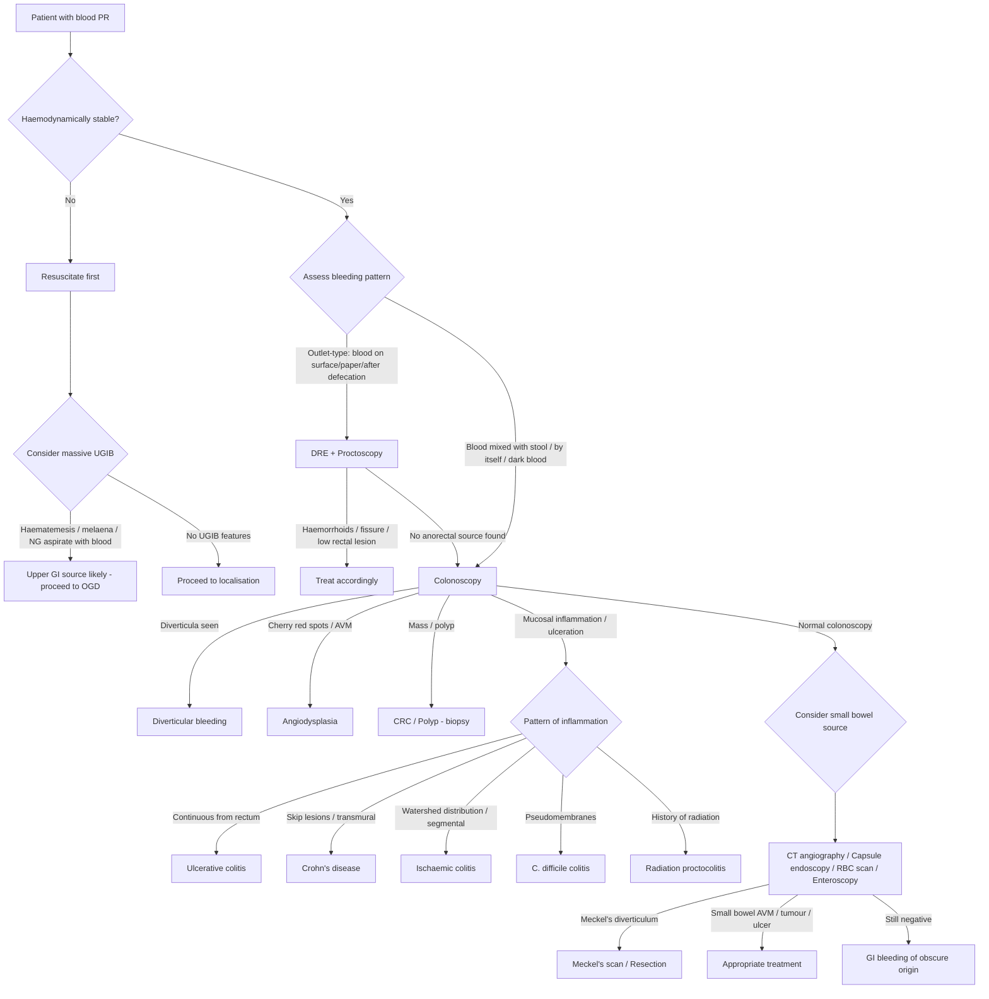

## Differential Diagnosis of Lower GI Bleeding

The differential diagnosis of LGIB is best approached by thinking systematically about **where the blood is coming from** (anatomical source) and **what is making it bleed** (pathological process). Let me walk you through this the way you'd think at the bedside: a patient walks in with blood per rectum — what's on your list, and how do you tell them apart?

### The Critical First Step: Is This Actually LGIB?

Before you dive into colonic causes, remember this:

<Callout title="Do NOT Forget UGIB" type="error">
***Up to 10–15% of patients presenting with haematochezia actually have a massive upper GI source*** [1][2][3]. A briskly bleeding duodenal ulcer or variceal bleed can transit the entire bowel so fast that blood comes out bright red per rectum. **Always consider UGIB in any patient with severe haematochezia, especially if haemodynamically unstable.** An NG tube aspirate showing bile confirms the aspirate has reached the duodenum — if it's bile-stained without blood, UGIB is less likely (but not excluded). If non-bilious, it's non-diagnostic [3].
</Callout>

---

### Master Differential Diagnosis Table

The table below organises every cause you need to know, grouped by anatomical source, with the key distinguishing clinical features and the pathophysiological reason for bleeding [1][2][3][4][5]:

| Anatomical Source | Cause | Approx. % | Key Distinguishing Features | Why It Bleeds (Mechanism) |
|:------------------|:------|:----------|:---------------------------|:--------------------------|
| **Massive UGIB** | Peptic ulcer, variceal bleed | ***< 10%*** | Melaena, haematemesis, coffee ground vomitus; consider in severe haematochezia | Arterial erosion (ulcer) or rupture of high-pressure portosystemic collateral (varix) |
| **Large bowel** | ***Diverticular disease*** | ***17–40%*** | ***Painless, usually profuse haematochezia (not chronic)*** | Rupture of vasa recta draped over diverticulum dome → arterial bleeding |
| | ***Angiodysplasia*** | ***2–30%*** | ***Painless, less severe than diverticular but tends to be intermittent***; elderly; may be associated with ***HHT and aortic stenosis*** | Degenerative AVM; venous bleeding from dilated submucosal vessels lacking smooth muscle |
| | ***Colitis — Inflammatory (IBD)*** | 9–21% (all colitis) | ***Usually bloody diarrhoea***; ***extra-intestinal manifestations: arthritis, episcleritis/uveitis, erythema nodosum*** | Chronic immune-mediated mucosal inflammation → friable, ulcerated mucosa |
| | ***Colitis — Ischaemic*** | | ***CVS risk factors, acute MI, stroke***; sudden cramping pain → bleeding ≤ 24h | Hypoperfusion of watershed areas → mucosal ischaemia → reperfusion injury → sloughing |
| | ***Colitis — Infective*** | | ***Fever, chills, rigors, night sweats, nausea/vomiting, diarrhoea, pain; TOCC, immunosuppression (CMV colitis); previous TB exposure/infection, BCG vaccination status*** | Pathogen invasion → mucosal destruction → bleeding |
| | ***Colitis — Radiation*** | | ***Hx of abdominal irradiation*** | Endothelial damage → telangiectasia → chronic oozing |
| | ***Colorectal carcinoma (CRC)*** | ***7–33%*** | *** > 50y, male, smoker, FHx, Hx of IBD, polyps and colorectal CA***; ***alternating diarrhoea and constipation, pencil-thin stools, tenesmus***; ***loss of appetite, loss of weight, malaise***; ***intractable pain, jaundice/RUQ pain, dyspnoea, bone pain*** | Tumour neovascularisation + overlying mucosal erosion/ulceration |
| | Post-polypectomy bleeding | Variable | History of recent colonoscopy with polypectomy (within 2 weeks) | Iatrogenic — arterial bleeding from polypectomy stalk |
| **Small bowel (~5%)** | ***Meckel's diverticulum*** | | ***Painless, massive altered blood*** (maroon-coloured); most common cause of LGIB in **children**; "Rule of 2s" | Ectopic gastric mucosa secretes acid → peptic ulceration of adjacent ileal mucosa → arterial bleeding |
| | Angiodysplasia | | Similar to colonic — painless, intermittent | Same degenerative AVM mechanism |
| | Small bowel tumours (GIST, lymphoma, carcinoid) | | Constitutional symptoms, possible palpable mass, obstruction | Tumour erosion into vessels or mucosal ulceration |
| | ***NSAID-induced small bowel ulcers*** | | History of chronic NSAID use | NSAID enteropathy (distinct from gastric PUD): direct mucosal toxicity + ↓ prostaglandins → mucosal disruption [3] |
| | Crohn's disease / TB enteritis | | Abdominal pain, diarrhoea, weight loss; TB: endemic exposure | Transmural inflammation → deep ulceration → vessel erosion |
| | ***Aortoenteric fistula*** | | ***Previous aortic graft surgery***; "herald bleed" followed by massive exsanguination | Graft erodes into adjacent duodenum → initially self-tamponades (herald bleed) → then catastrophic rupture |
| **Anorectal (~10%)** | ***Haemorrhoids*** | | ***Blood coating stools or bleeding following defecation***; ***may note perianal prolapsing mass, pruritus (mucus secretion) ± pain (if thrombosed)*** | Engorged vascular cushions → mucosal erosion → arteriolar bleeding |
| | ***Anal fissure*** | | ***Hx of constipation; severe sharp pain upon defecation*** | Tear in anoderm below dentate line (somatic territory) → exposed vessels in fissure base |
| | Rectal varices | | Stigmata of chronic liver disease, portal hypertension | Portosystemic collateral (superior ↔ middle/inferior rectal veins) engorgement and rupture |
| | Rectal/anal ulcers | | Solitary rectal ulcer (straining/prolapse), stercoral ulcer (faecal impaction) | Mucosal ischaemia from prolapse or pressure necrosis from impacted faeces |
| | Dieulafoy's lesion | | Massive bleeding from a tiny mucosal defect; recurrent | Abnormally large submucosal artery fails to taper → erodes through overlying mucosa |

---

### Differentiating by Clinical Pattern — A Practical Framework

The key to narrowing the differential at the bedside is to ask **four pattern-recognition questions** [1][3][4]:

#### 1. What is the relationship of blood to stool?

| Pattern | Most Likely Diagnosis | Reasoning |
|:--------|:---------------------|:----------|
| **Blood mixed with stool** | Proximal colonic source (right colon, transverse colon) — CRC, proximal colitis | Blood enters lumen proximally and is incorporated during stool formation |
| **Blood on surface / separate from stool** | Outlet-type — haemorrhoids, anal fissure, low rectal lesion | Blood added after stool is already formed |
| **Blood by itself (torrential)** | ***Diverticular disease, angiodysplasia, IBD, bleeding CA*** [4] | Brisk bleeding overwhelms stool formation |
| **Blood after defecation** | ***Anorectal*** — haemorrhoids [4] | Straining during defecation → engorgement → mucosal erosion → arterial ooze continues after stool passes |
| **Cyclic manner** | ***GI endometriosis*** [4] | Ectopic endometrial tissue in bowel wall bleeds synchronously with menstrual cycle |
| **Melaena** | ***UGIB*** [4] | Slow bleeding oxidised by gastric acid + bacterial degradation over transit |

#### 2. Is the bleeding painful or painless?

| Painful | Painless |
|:--------|:---------|
| Anal fissure (severe sharp pain on defecation) | ***Diverticular bleeding*** |
| Ischaemic colitis (cramping → then bleeding ≤ 24h) | ***Angiodysplasia*** |
| IBD (diffuse abdominal pain + bloody diarrhoea) | ***Haemorrhoids*** (unless thrombosed) |
| Infective colitis (fever, abdominal pain, diarrhoea) | ***CRC*** (usually painless unless advanced/complicated) |
| Thrombosed external haemorrhoid | ***Meckel's diverticulum*** (painless massive altered blood) [10] |
| Complicated diverticulitis (NB: diverticulitis ≠ diverticular bleeding) | Post-polypectomy bleeding |

This distinction is clinically very useful. The **painless massive bleeders** are diverticular disease, angiodysplasia, and Meckel's diverticulum. The **painful bleeders** involve inflammation or ischaemia.

#### 3. How heavy is the bleeding?

| Mild (usually mixed with stools) | Heavy (usually passes by itself) |
|:---------------------------------|:-------------------------------|
| Anorectal pathologies | ***Diverticular disease*** |
| Carcinoma | ***Angiodysplasia*** |
| Mild colitis | ***Meckel's diverticulum*** |
| | ***Ischaemic colitis*** |
| | ***Rectal varices*** |
| | Aortoenteric fistula |

Sources marked with asterisks in senior notes = ***can present with heavy bleeding*** [1][3].

#### 4. What is the patient's age?

| Age Group | Top Differentials | Reasoning |
|:----------|:-----------------|:----------|
| **Children** | Meckel's diverticulum, intussusception, juvenile polyps, anal fissure | Congenital or age-specific pathologies; Meckel's = most common congenital GI anomaly [10] |
| **Young adults ( < 50)** | Haemorrhoids (most common), IBD, infectious colitis, anal fissure | Inflammatory conditions peak in young adults; haemorrhoids from straining/pregnancy |
| **Elderly ( > 65)** | Diverticular disease, angiodysplasia, CRC, ischaemic colitis | Degenerative vascular and structural changes accumulate with age; CRC incidence rises |

---

### Differential Diagnosis Decision Flowchart

---

### Distinguishing the Four Types of Colitis

This is a common exam question — all four present with **bloody diarrhoea and abdominal pain**, but the clinical context, timing, and associated features differ [2][3]:

| Feature | Inflammatory (IBD) | Ischaemic | Infective | Radiation |
|:--------|:-------------------|:----------|:----------|:----------|
| **Age** | Young adults (UC: 20–40; Crohn: 15–35) | ***Elderly ( > 60y, 90%)*** | Any age | Any age (post-treatment) |
| **Key Hx** | Chronic relapsing course; family history | ***CVS risk factors, recent MI, stroke, recent surgery*** | ***TOCC, immunosuppression, antibiotic use*** | ***Hx of abdominal/pelvic irradiation*** |
| **Pain** | Variable; may be diffuse | ***Sudden cramping, lateral*** | Diffuse, colicky | Rectal discomfort |
| **Bleeding** | Bloody diarrhoea with mucus | Mild–moderate, ≤ 24h after pain onset | Variable — may be bloody diarrhoea | Chronic ooze or intermittent |
| **Fever** | Variable | ***Unusual (but ↑WBC)*** | ***Usually present*** | Unusual |
| **Distribution** | UC: continuous from rectum; Crohn: skip lesions | ***Watershed areas (splenic flexure, rectosigmoid)*** | Diffuse or segmental | Irradiated field |
| **Extra-GI features** | ***Arthritis, uveitis, erythema nodosum, PSC*** | None specific | None specific | None specific |
| **Key investigation** | Colonoscopy + biopsy; faecal calprotectin | CT angiography; colonoscopy (thumbprinting → segmental inflammation) | Stool culture + C. diff toxin | Colonoscopy (telangiectasia in irradiated field) |

<Callout title="Management Implication" type="error">
***IBD should NOT be misdiagnosed as infectious or ischaemic colitis*** since the therapy is fundamentally different — IBD requires immunosuppression, infective colitis requires antimicrobials, and ischaemic colitis is mostly supportive. Misdiagnosis can be dangerous [2].
</Callout>

---

### Diverticular Bleeding vs Angiodysplasia — Head-to-Head Comparison

These are the two most common causes of significant LGIB in the elderly, and exams love to compare them [1][2][3]:

| Feature | Diverticular Bleeding | Angiodysplasia |
|:--------|:---------------------|:---------------|
| **Mechanism** | ***Rupture of vasa recta*** into diverticulum | Degenerative AVM (dilated submucosal vessels lacking smooth muscle) |
| **Type of bleeding** | ***Arterial*** → tends to be more profuse | ***Venous*** → tends to be less profuse |
| **Severity** | Can be **massive** | Usually **moderate**; often occult (IDA, FOBT +ve) |
| **Pattern** | Acute, self-limiting in 80–85%; rebleed 14–38% | ***Intermittent***; self-limiting in 85–90%; rebleed 25–85% |
| **Pain** | ***Painless*** | ***Painless*** |
| **Most common site** | ***Right colon*** (in Asia); sigmoid (in West) | ***Right colon (caecum, ascending colon)*** |
| **Age** | Usually > 60 (60% have diverticulosis by age 60) | Usually > 70 (2/3 at > 70y) |
| **Associations** | Obesity, HTN, NSAIDs, low-fibre diet | ***Aortic stenosis (Heyde syndrome), HHT (Osler-Weber-Rendu), ESRD, vWD*** |
| **Colonoscopy** | Active bleeding from diverticulum / adherent clot | ***Cherry red spots*** |
| **Angiography** | Active contrast extravasation | ***"Mother-in-law phenomenon"*** (early filling, delayed emptying) |
| **Treatment** | Endoscopic (clips, injection) → angiographic embolisation → segmental resection after 2nd bleed | ***Argon plasma coagulation (APC)*** → angiographic embolisation → right hemicolectomy |

---

### Causes Specific to the Paediatric Population

In children, the differential for LGIB is quite different from adults [10]:

| Cause | Key Features | Mechanism |
|:------|:------------|:----------|
| **Anal fissure** | ***Painful*** defecation, outlet-type, Hx of constipation | Tear in anoderm from passage of hard stool |
| **Colonic polyp** (90% juvenile polyps) | ***Painless***, usually single, pedunculated | Torsion/erosion of polyp surface → bleeding |
| ***Meckel's diverticulum*** | ***Painless, large amount, altered blood*** (maroon) | Ectopic gastric mucosa → acid secretion → peptic ulceration of adjacent ileal mucosa |
| **Intussusception** | ***Painful, small amount, mucus*** ("redcurrant jelly" stool) | Telescoping bowel → venous congestion → mucosal ischaemia → bloody mucus |
| **IBD** | Bloody diarrhoea, weight loss, growth failure | Chronic mucosal inflammation |
| **Intestinal duplication cyst** | Variable; may present with obstruction or bleeding | Ectopic gastric mucosa (similar to Meckel's) |
| **Small bowel ischaemia** (e.g. volvulus) | Acute abdomen, bilious vomiting | Vascular compromise → ischaemic necrosis → bloody stool |

<Callout title="Meckel's Diverticulum — Rule of 2s (Must Know!)" type="idea">
***2% of the population, 2% symptomatic, often by age of 2, 2:1 male-to-female ratio, 2 inches in length, found within 2 feet of the ileocaecal valve, 2 types of ectopic tissue: gastric (60%) and pancreatic (6%)*** [10]. It is a ***true congenital diverticulum*** (all layers) at the ***anti-mesenteric aspect*** of the small intestine, from incomplete obliteration of the ***vitelline duct*** (omphalomesenteric duct).
</Callout>

---

### Differential by Presentation Pattern — Quick Reference

This is a rapid-fire clinical decision table for the ward [3][4]:

| Presentation | Think About | Key Discriminating Feature |
|:-------------|:-----------|:--------------------------|
| ***Painless profuse haematochezia*** (acute, not chronic) | **Diverticular bleeding** | Self-limiting; no inflammation; often right-sided in HK |
| ***Painless intermittent haematochezia*** in elderly + anaemia | **Angiodysplasia** | Intermittent; associated with aortic stenosis; cherry red spots on CLN |
| ***Outlet-type bright red blood*** + prolapsing mass | **Haemorrhoids** | Blood on toilet paper / dripping after defecation; perianal pruritus |
| ***Sharp pain on defecation*** + streak of blood | **Anal fissure** | History of constipation; pain inhibits further examination |
| ***Bloody diarrhoea + mucus*** + chronic relapsing course | **IBD** | Extra-intestinal manifestations; young patient |
| ***Sudden cramping pain → bleeding within 24h*** | **Ischaemic colitis** | CVS risk factors; elderly; watershed distribution |
| ***Change in bowel habit + constitutional symptoms*** + bleeding | **CRC** | Pencil-thin stools; tenesmus; family history; > 50y |
| ***Fever + diarrhoea + blood*** + travel/antibiotics | **Infective colitis** | TOCC; C. diff after antibiotics; immunosuppression (CMV) |
| Bleeding + ***history of pelvic radiation*** | **Radiation proctocolitis** | Temporal relationship to radiotherapy |
| ***Massive painless altered blood*** in a child | **Meckel's diverticulum** | Rule of 2s; Meckel's scan |
| ***"Herald bleed"*** then massive exsanguination + previous aortic surgery | **Aortoenteric fistula** | Surgical emergency; previous aortic graft |
| Bleeding + ***signs of chronic liver disease*** | **Rectal varices** | Portal hypertension; portosystemic collateral at rectum |

---

### GI Bleeding of Obscure Origin

When standard "top and tail" endoscopy (OGD + colonoscopy) fails to identify the source, we enter the territory of ***GI bleeding of obscure origin*** [5]:

- **Definition**: Bleeding of unknown origin after negative upper endoscopy and colonoscopy
  - ***Obscure overt***: with visible bleeding symptoms (haematochezia/melaena) [5]
  - ***Obscure occult***: with IDA and FOBT positive but no visible blood [5]
- **Most found in the small bowel eventually** [5]
- Common small bowel sources: angiodysplasia, Meckel's diverticulum, small bowel tumours (GIST, carcinoid, lymphoma), NSAID ulcers, Crohn's disease, Dieulafoy's lesion, aortoenteric fistula
- This category is important because it reminds you that **a negative colonoscopy does not mean there is no significant pathology** — you must pursue small bowel investigation

---

### Causes in the Cirrhotic Patient — A Special Differential

When a patient with known liver disease presents with GI bleeding, the differential is broader than just varices [6]:

| Cause | Notes |
|:------|:------|
| ***Varices (50–90%)***: oesophageal or gastric | Most common — high-pressure portosystemic collaterals; usually bleeding from varices ≤ 3–5 cm of GEJ |
| ***Portal hypertensive gastropathy (PHG)*** | Very common in cirrhotics but bleeding is uncommon; friable "snake-skin" mucosa → diffuse oozing [6] |
| ***Peptic ulcer disease*** | Still common in cirrhotics |
| ***Generalised bleeding tendency*** | Thrombocytopaenia (hypersplenism), ↓ production of clotting factors, ↑ fibrinolysis |
| ***Rectal varices*** | Portosystemic collateral at rectum → LGIB |
| ***Mallory-Weiss tears*** | Especially in alcoholic cirrhosis (repeated retching) |

> The key point: ***variceal bleeding is NOT the only cause of GI bleeding in a cirrhotic patient*** [6]. Always keep an open differential.

---

<Callout title="High Yield Summary">

**Approach to DDx of LGIB**:
1. Always exclude massive UGIB (10–15% of haematochezia is from upper GI)
2. Characterise the bleeding: relationship to stool, severity, colour, pain
3. Consider the patient's age and risk factors

**Most Common Causes by Frequency**: Diverticular disease (17–40%) > Angiodysplasia (2–30%) > Colitis (9–21%) > CRC (7–33%) > Anorectal (~10%) > Small bowel (~5%)

**The Two Big Painless Bleeders**: Diverticular (arterial, more profuse, self-limiting 80–85%) vs Angiodysplasia (venous, less profuse, intermittent, high rebleed)

**Four Types of Colitis**: Inflammatory (IBD — young, relapsing, extra-intestinal features), Ischaemic (elderly, CVS RFs, watershed areas), Infective (fever, TOCC, C. diff), Radiation (Hx of irradiation)

**Red Flags for CRC**: > 50y, FHx, alternating bowel habits, pencil-thin stools, tenesmus, constitutional symptoms, passage of mucus

**Children**: Meckel's (painless massive altered blood), intussusception (painful + redcurrant jelly), juvenile polyps (painless), anal fissure (painful)

**Cirrhotic Patient**: Not just varices — also PHG, PUD, generalised bleeding tendency, rectal varices, Mallory-Weiss

**Obscure GI Bleeding**: Negative top and tail → think small bowel (angiodysplasia, Meckel's, GIST, NSAID ulcers, Crohn's, aortoenteric fistula)

</Callout>

---

<ActiveRecallQuiz
  title="Active Recall - Differential Diagnosis of Lower GI Bleed"
  items={[
    {
      question: "A 72-year-old man presents with painless massive bright red blood per rectum that stops spontaneously. He has hypertension and takes aspirin daily. What is the most likely diagnosis, and what is the underlying bleeding mechanism?",
      markscheme: "Diverticular bleeding. Mechanism: rupture of vasa recta that are draped over the dome of a diverticulum, separated from the lumen by only mucosa. This is arterial bleeding. Aspirin impairs platelet function, worsening the bleed. Self-limiting in 80-85% but rebleed rate 14-38%.",
    },
    {
      question: "How do you distinguish angiodysplasia from diverticular bleeding clinically and on investigation? Name the classic colonoscopic and angiographic findings for angiodysplasia.",
      markscheme: "Angiodysplasia: venous bleeding, less massive, intermittent, higher rebleed rate (25-85%), associated with aortic stenosis (Heyde syndrome), elderly. Diverticular: arterial, more profuse, acute self-limiting episodes. Colonoscopy: cherry red spots. Angiography: mother-in-law phenomenon (early filling, delayed emptying).",
    },
    {
      question: "Name four clinical features that distinguish ischaemic colitis from inflammatory bowel disease in a patient presenting with bloody diarrhoea.",
      markscheme: "Ischaemic colitis: (1) elderly >60y (vs young adults in IBD), (2) CVS risk factors (HTN, AF, IHD, recent MI/surgery), (3) sudden onset cramping pain followed by bleeding within 24h (vs chronic relapsing), (4) fever is unusual despite raised WBC (vs variable fever in IBD), (5) watershed distribution on imaging (splenic flexure, rectosigmoid) vs continuous from rectum (UC) or skip lesions (Crohn's), (6) no extra-intestinal manifestations.",
    },
    {
      question: "A 3-year-old boy presents with painless massive maroon-coloured stool. What is the most likely diagnosis? State the Rule of 2s and explain the mechanism of bleeding.",
      markscheme: "Meckel's diverticulum. Rule of 2s: 2% population, 2% symptomatic, often by age 2, 2:1 M:F, 2 inches long, 2 feet from ileocaecal valve, 2 types of ectopic tissue (gastric 60%, pancreatic 6%). Mechanism: ectopic gastric mucosa secretes acid causing peptic ulceration of adjacent ileal mucosa leading to arterial bleeding.",
    },
    {
      question: "A patient with known liver cirrhosis presents with haematochezia. List at least 5 possible causes of GI bleeding in this patient, not just varices.",
      markscheme: "(1) Oesophageal/gastric varices (50-90%), (2) Portal hypertensive gastropathy, (3) Rectal varices, (4) Peptic ulcer disease, (5) Generalised bleeding tendency (thrombocytopaenia from hypersplenism, decreased clotting factor production), (6) Mallory-Weiss tears (especially in alcoholic cirrhosis). Key point: variceal bleeding is NOT the only cause in cirrhotics.",
    },
  ]}
/>

---

## References

[1] Senior notes: Ryan Ho Fundamentals.pdf (Section 3.3.6 Lower GI Bleeding, p281–285)
[2] Senior notes: felixlai.md (Lower GI bleeding section)
[3] Senior notes: Ryan Ho GI.pdf (Section 3.1.2 Lower GI Bleeding, p107–111)
[4] Senior notes: maxim.md (Section 4.2 LGIB)
[5] Senior notes: maxim.md (Section 3.3 UGIB — definitions of obscure GI bleeding)
[6] Senior notes: Ryan Ho GI.pdf (Variceal Haemorrhage, p324)
[7] Lecture slides: GC 186. Lower and diffuse abdominal painfresh blood in stool.pdf (p38)
[10] Senior notes: maxim.md (Paediatric GI bleed / Meckel diverticulum section)
