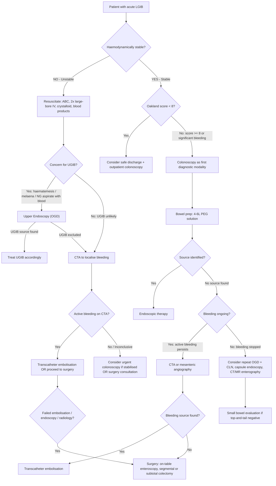

## Diagnostic Approach to Lower GI Bleeding

The diagnostic approach to LGIB follows three overarching principles — think of them as the "3S framework" [3][1]:

1. **Save the patient** — resuscitation and haemodynamic stabilisation
2. **Search for the bleeding** — localisation of the bleeding site
3. **Stop the bleeding** — endoscopic, radiological, or surgical haemostasis

The investigations you choose and the order you pursue them depend entirely on **haemodynamic stability** and **bleeding severity**. Let's build this from first principles.

---

## Bleeding Severity Assessment

Before any investigation, you must assess how bad things are. The lecture slides emphasise a structured bleeding severity assessment [7]:

***History***: ***When did the bleeding start? First episode? Haematochezia? Melaena? Recent endoscopy?*** [7]

***Physical examination (vital signs, cardiopulmonary and abdominal examinations, including DRE)***: ***tachycardia? hypotension? syncope? gross blood on DRE? recurrent/ongoing haematochezia?*** [7]

***Laboratory tests (FBC, serum electrolytes, coagulation tests, type and cross match)***: ***Hb? ↓ Albumin? ↑ INR? ↓ PLT? ↑ creatinine*** [7]

***Co-morbidities***: ***Older age? Need for RBC transfusion?*** [7]

***Concomitant medications***: ***NSAIDs? antiplatelet agents? anticoagulants?*** [7]

<Callout title="Oakland Score" type="idea">
The ***Oakland score*** is mentioned in the BSG 2019 guidelines cited in the lecture slides [7]: if ***Oakland score < 8***, consider safe hospital discharge and outpatient evaluation in haemodynamically stable patients. This score incorporates age, sex, prior LGIB admission, DRE findings, heart rate, SBP, and Hb.
</Callout>

### Haemodynamic Classification of Blood Loss

Understanding *why* we classify by haemodynamic status:

| Class | Blood Loss | Heart Rate | SBP | Clinical Features | What's Happening Physiologically |
|:------|:----------|:-----------|:----|:-----------------|:-------------------------------|
| I | < 15% (~750 mL) | < 100 | Normal | Minimal symptoms | Compensatory vasoconstriction maintains BP |
| II | 15–30% (~750–1500 mL) | 100–120 | Normal or mildly ↓ | Anxiety, ↓ pulse pressure, postural drop | Baroreceptor-mediated ↑ sympathetic tone; cardiac output maintained by ↑ HR |
| III | 30–40% (~1500–2000 mL) | 120–140 | ↓ (SBP < 90) | Confusion, oliguria, pallor | Decompensation begins; CO falls despite maximal sympathetic response |
| IV | > 40% ( > 2000 mL) | > 140 or bradycardic | Profoundly ↓ | Lethargy, anuria, imminent arrest | Cardiovascular collapse; paradoxical bradycardia from vagal response |

> ***75% of LGIB stops spontaneously*** [1][3] — but you still need to prepare for the worst.

---

## Initial Investigations ("Take Blood For")

These are your **first-line laboratory tests** — ordered immediately on presentation alongside resuscitation [1][3][7]:

| Investigation | What You're Looking For | Interpretation / Why |
|:-------------|:----------------------|:-------------------|
| ***CBC (Hb, haematocrit)*** | Severity of blood loss; baseline for serial monitoring | ***Hb usually ↓ after 48 hours*** (because haemodilution takes time — in acute bleeding, you lose whole blood proportionally, so initial Hb may be falsely normal) [3][11]. ↓ MCV suggests chronic bleeding (iron deficiency) vs normal MCV in acute bleeding |
| ***RFT (U&E, creatinine)*** | Hydration status, pre-renal failure, electrolyte imbalance | ***↑ Urea:Creatinine ratio > 100:1*** suggests UGIB (digested blood protein is absorbed and converted to urea in the liver) OR dehydration (pre-renal) [11]. Creatinine also assesses suitability for contrast scans |
| ***LFT*** | Underlying liver disease → coagulopathy, portal hypertension | ↑ bilirubin, ↓ albumin, ↑ NH₃ suggest cirrhosis → think varices, PHG, coagulopathy |
| ***Clotting profile (PT/INR, aPTT)*** | Coagulopathy | ↑ INR on warfarin; liver failure; DIC. ***↓ Body temperature can cause ↓ efficiency of clotting factors*** [1][3] — keep the patient warm |
| ***Type and screen / cross-match*** | Prepare for transfusion | Cross-match 2–4 units packed RBCs at minimum [1][3] |
| ***Lactate + ABG*** | Tissue perfusion, acid-base status | ***Metabolic acidosis + ↑ lactate*** → poor tissue perfusion (shock) or intestinal ischaemia [4][12] |

### Transfusion Thresholds (from Lecture Slides)

***If Hb < 7 g/dL, transfuse: target Hb 7–9 g/dL post-transfusion if no CVD*** [7]

***If Hb ≥ 8 g/dL and CVD present, transfuse: target Hb ≥ 10 g/dL*** [7]

Why the restrictive strategy? Over-transfusion in GI bleeding is associated with ↑ mortality — likely because ↑ intravascular volume → ↑ portal/splanchnic pressure → promotes rebleeding.

---

## Diagnostic Algorithm

The algorithm branches based on **haemodynamic stability** — this is the single most important decision point [3][4][7]:

---

## Investigation Modalities in Detail

### 1. Bedside Investigations

#### Digital Rectal Examination (DRE) + Proctoscopy

- **Always the first step** — before any fancy investigation [1][3]
- ***Proctoscopy, sigmoidoscopy to exclude bleeding from anorectal pathology*** [3]
- DRE findings:
  - Fresh blood on glove → confirms active LGIB
  - Melaena on glove → suggests UGIB or slow proximal colonic bleeding
  - Palpable rectal mass → CRC
  - Anal fissure (usually posterior midline)
  - Haemorrhoids are usually NOT palpable (need proctoscopy to see internal haemorrhoids)
- **Proctoscopy** allows direct visualisation of the anal canal and low rectum — identifies haemorrhoids, low rectal tumours, proctitis
- **Rigid sigmoidoscopy** extends this to the rectosigmoid — useful for radiation proctitis, distal UC, rectal varices

#### Nasogastric (NG) Tube Aspirate

- ***NG tube: bile-stained aspiration → bleeding from upper GI tract excluded*** [3]
- Why: If you get **bile-stained aspirate WITHOUT blood**, it confirms the tube has reached the duodenum and there is no active bleeding proximal to the ligament of Treitz
- **Limitation**: A non-bilious aspirate is non-diagnostic (the tube may not have reached the duodenum) — and post-pyloric bleeding can be missed if the pylorus is closed
- **Indication**: Particularly useful when you suspect UGIB in a patient presenting with haematochezia (e.g. haemodynamically unstable with bright red PR bleeding)

---

### 2. Endoscopy — The Workhorse

#### A. Colonoscopy

***Colonoscopy is the first diagnostic modality for haemodynamically stable patients*** [7]

***Diagnostic yield = 75–90%***, low complication rate [1][3]

**Why colonoscopy first?**
- Allows direct visualisation of the entire colonic mucosa
- Both **diagnostic AND therapeutic** (can treat the lesion in the same session)
- ***Usually also intubate the ileocaecal valve to exclude distal small bowel bleeding*** [3]
- ***Should be performed early*** (to obtain a diagnosis before bleeding stops — many causes are intermittent) [3]

**Bowel preparation**:
- ***Bowel prep: 4–6 L of PEG-based solution*** [7]
- ***↑ Diagnostic yield but does not ↑ morbidity*** [3]
- ***NG tube and antiemetics can be used if needed*** (to facilitate prep in nauseated patients) [7]
- ***NOT feasible in unstable patients*** [3] — don't delay for bowel prep if the patient is actively exsanguinating

**Key colonoscopic findings by aetiology**:

| Cause | Colonoscopic Appearance | Why It Looks Like This |
|:------|:-----------------------|:----------------------|
| Diverticular bleeding | Active bleeding from diverticulum, adherent clot, visible vessel in diverticulum | Arterial bleed from ruptured vasa recta |
| ***Angiodysplasia*** | ***Cherry red spots*** — small, flat, bright red lesions typically in right colon [4] | Dilated submucosal vessels visible through thin mucosa |
| CRC | Exophytic/polypoid mass, may be friable, ulcerated, necrotic, ± circumferential [13] | Tumour neovascularisation with abnormal, fragile surface vessels |
| UC | Continuous erythema, friability, ulceration starting from rectum, loss of vascular pattern, pseudopolyps | Immune-mediated mucosal inflammation with crypt abscesses |
| Crohn's | Patchy "skip" lesions, aphthous ulcers, cobblestoning, strictures | Transmural granulomatous inflammation |
| Ischaemic colitis | Segmental oedema, petechial haemorrhage, ***thumbprinting*** (submucosal oedema/haemorrhage), cyanotic mucosa, ulceration in watershed areas | Mucosal ischaemia → oedema → haemorrhage → necrosis |
| C. difficile colitis | Pseudomembranes (yellow-white adherent plaques) | Toxin-mediated epithelial necrosis with fibrinous exudate |
| Radiation proctitis | Telangiectasias, pale/friable mucosa in irradiated field | Radiation-induced endothelial damage → neovascularisation of fragile vessels |

**Therapeutic modalities at colonoscopy** — ***especially effective in angiodysplasia and diverticular disease*** [3]:

| Modality | Mechanism | Best For |
|:---------|:----------|:---------|
| ***Epinephrine injection (1:10,000)*** | Local vasoconstriction + tamponade; ***not used alone*** [4] | Adjunct to other methods; buys time |
| ***Through-the-scope (TTS) clips / Cap-mounted clips*** | Mechanical compression of bleeding vessel | ***Diverticular bleeding*** [7] |
| ***Endoscopic band ligation (EBL)*** | Strangulates tissue around bleeding point → ischaemic necrosis → haemostasis | ***Diverticular bleeding*** [7] |
| ***Argon plasma coagulation (APC)*** | Non-contact thermal coagulation using ionised argon gas | ***Angiodysplasia, radiation proctitis*** [4][7] |
| Monopolar electrocautery / heat probe | Contact thermal coagulation | Angiodysplasia |
| ***Hemostatic topical agents*** | Haemostatic powder (e.g. TC-325) sprayed onto bleeding site | ***Salvage treatment for delayed post-polypectomy bleeding*** [7] |

<Callout title="Endoscopic Haemostasis Indications">
***Stigmata of recent haemorrhage*** warrant endoscopic treatment: ***active bleeding, non-bleeding visible vessel, adherent clot*** [4]. A clean base (no stigmata) generally does not require endoscopic therapy.
</Callout>

#### B. Upper Endoscopy (OGD)

- ***Generally prefer OGD before colonoscopy*** in some algorithms [3] — especially when UGIB cannot be excluded
- ***Consider upper endoscopy first if not been performed*** (before proceeding to surgery) [7]
- In haemodynamically unstable patients with haematochezia, ***up to 10–15% have UGIB*** [1][3] → OGD may identify the source before you commit to colonic investigation
- ***NG tube aspirate*** can help triage: bile-stained without blood → UGIB less likely → proceed to colonoscopy

#### C. Capsule Endoscopy

- A wireless camera capsule swallowed by the patient that transmits images as it traverses the GI tract
- **Indication**: ***Occult GI bleeding, intermittent bleeding with negative top-and-tail*** (OGD + CLN both negative) [2][4]
  - Also used for: iron deficiency anaemia, follow-up of Crohn's, small bowel tumours, polyposis syndromes [2]
- **Advantages**: Non-invasive; visualises entire small bowel
- **Limitations** [2]:
  - Suboptimal visual clarity due to fluid
  - Possibility of missing lesions
  - Difficult to determine exact site of bleeding
  - Long viewing time of video
  - Slow transit time → incomplete data acquisition
  - ***Inability to take tissue biopsy***
  - ***Inability to perform therapeutics***
- **Contraindications**: ***GI obstruction or strictures*** (capsule retention), implantable pacemakers/defibrillators (relative), swallowing and motility disorders [2]
  - ***Do CT/MR enterography beforehand*** to rule out strictures before capsule endoscopy [4]

#### D. Deep Small Bowel Enteroscopy

- ***Double balloon enteroscopy (DBE)***: scope with 2 inflatable balloons that "pleat" the small bowel over the scope, allowing deep intubation from mouth (antegrade) or anus (retrograde) [4]
- ***Single balloon enteroscopy (SBE)***: similar principle with one balloon
- **Advantage**: Biopsy and therapeutic interventions possible (has accessory channel and tip deflection) [2]
- **Indication**: Small bowel bleeding source suspected after negative capsule endoscopy, or when therapy is needed
- **Limitation**: Requires prolonged sedation → seldom done during active ongoing bleeding [11]

---

### 3. Radiological Investigations

#### A. CT Angiography (CTA)

This is increasingly the **go-to first-line investigation for haemodynamically unstable patients** [7]:

***"We recommend that if a patient is haemodynamically unstable or has a shock index (heart rate/systolic BP) of > 1 after initial resuscitation and/or active bleeding is suspected, CT angiography provides the fastest and least invasive means to localise the site of blood loss before planning endoscopic or radiological therapy"*** — BSG 2019 [7]

***CTA: Sensitivity 85.2% and specificity 92.1%*** in a meta-analysis (García-Blázquez 2013) [7]

***Similar or higher diagnostic yield compared to colonoscopy*** (Lee 2020, Miyakuni 2020) [7]

**How it works**: Multi-phase CT with IV contrast — arterial phase images acquired during peak contrast opacification → active bleeding appears as **contrast extravasation** (a "blush" of contrast within the bowel lumen that was not present on the non-contrast phase)

**Advantages**:
- ***More widely available*** [7]
- ***Non-invasive*** [7]
- ***More precise*** localisation than RBC scan [7]
- Fast — can be done within minutes
- Identifies both the site of bleeding AND potential underlying pathology (mass, diverticula, vascular malformation)
- Does not require bowel preparation
- Can guide subsequent intervention (embolisation or surgery)

**Limitations**:
- Requires **active bleeding at the time of scan** — minimum bleeding rate ~0.3–0.5 mL/min
- IV contrast → risk of contrast-induced nephropathy (check creatinine) and allergic reactions
- Radiation exposure

**Key CTA findings**:

| Finding | Interpretation |
|:--------|:--------------|
| Contrast extravasation into bowel lumen | Active bleeding at that site |
| "Blush" conforming to a diverticulum | Diverticular bleeding |
| Hypervascular lesion in bowel wall | Tumour or AVM |
| Bowel wall thickening + pericolonic stranding | Colitis or diverticulitis |
| Non-tapering vessel (Dieulafoy's) | Aberrant submucosal artery |

#### B. Mesenteric Angiography (Conventional / Digital Subtraction)

***Procedure: selective catheterisation of SMA, IMA and coeliac artery by Seldinger technique*** [3][11]

***Interpretation: positive defined by extravasation of contrast*** [3][11]

***Performance: detects bleeding at 1–1.5 mL/min, diagnostic yield 27–67%*** [11]

**Advantages** [11]:
- ***Generally more specific but less sensitive*** (than RBC scan)
- ***Can be performed intra-operatively*** → inject dye to guide surgery
- ***Typically allows embolisation within the same procedure*** (therapeutic!)
- ***Can diagnose non-bleeding lesions***, e.g. angiodysplasia (early-filling vein = "mother-in-law phenomenon"), small bowel tumours
- ***More available → can be done during weekends***
- ***Can specifically pinpoint bleeding vessel*** (cf RBC scan which only shows region)

**Disadvantages** [11]:
- ***Not sensitive for slow and intermittent bleeding*** (needs > 0.5–1 mL/min active bleeding)
- ***Embolisation carries risk of intestinal ischaemia***
- Invasive (arterial puncture → haematoma, pseudoaneurysm, dissection)
- Nephrotoxic contrast

**Angiographic findings for angiodysplasia** [4]:
- ***"Mother-in-law phenomenon"***: early filling (contrast appears in the vein during the arterial phase because of the AVM shunt), delayed emptying (contrast pools and lingers in the dilated submucosal vessels)

***Transcatheter embolisation within 60 minutes*** is recommended for unstable patients with CTA-confirmed bleeding [7].

#### C. Tc-99m Labelled Red Blood Cell Scan (Nuclear Medicine)

***Clinical indication: GI bleeding*** [9]

***Radiopharmaceutical: 99mTc-pertechnetate*** [9]

***Technique***: Red cells labelled in vitro by UltraTag kit (***labelling efficiency = 98%***) → re-injected IV → labelled RBCs leak into bowel lumen at site of bleeding → detected by gamma camera [9]

***Diagnostic criteria*** [9]:
1. ***Activity conforms to intestinal anatomy***
2. ***Intensity increases with time***
3. ***Activities move (anterograde or retrograde) within the bowels***

***Preferred over angiography to detect GI bleeding*** because [9]:
- ***↑ Sensitivity: minimum bleeding rate 0.1–0.4 mL/min*** (cf angiography ≥ 0.5–1 mL/min)
- ***Delayed images up to 24 hours*** → ***can detect intermittent bleeding***
- ***Less invasive***

**Limitations**:
- ***Non-specific*** [3] — poor anatomical localisation (blood moves intraluminally; bowel is mobile)
- ***Identifies site of blood pooling, not necessarily site of bleeding*** [2]
- Cannot provide therapy
- Takes more time than angiography [11]

**Role in the algorithm**: Best used when bleeding is **intermittent or slow** and CTA/angiography is negative or unavailable. It can confirm that bleeding IS occurring and give a rough region (right colon vs left colon) to guide further investigation or surgery.

#### D. Meckel's Scan

***Clinical indication: children with lower GI bleeding*** [9]

***Radiopharmaceutical: 99mTc-pertechnetate*** [9]

***Principle***: 99mTc-pertechnetate is extracted and secreted by the sodium-iodide symporter (NIS) on gastric mucosal cells → detects ***ectopic gastric mucosa*** in Meckel's diverticulum [9]

***Pre-medication with H2 blocker*** → ***↑ uptake, ↓ release of tracer at gastric mucosa*** → improves sensitivity ( > 80%) [9]

**Positive scan**: A focus of radiotracer uptake in the RLQ that appears at the same time as gastric uptake (both contain gastric mucosa)

#### E. CT/MR Enterography

- Cross-sectional imaging of the small bowel with oral contrast (to distend the lumen) ± IV contrast
- **Indication**: Suspected small bowel pathology (tumour, Crohn's stricture, NSAID ulcers) when capsule endoscopy is contraindicated or inconclusive [4]
- ***Do CT/MR enterography beforehand to rule out strictures*** before capsule endoscopy [4]
- MR enterography preferred in young patients (no radiation) and Crohn's (excellent for assessing transmural disease)

---

### Comparison Table of Localisation Modalities

| Modality | Min. Bleeding Rate | Sensitivity | Specificity | Therapeutic? | Best For |
|:---------|:------------------|:-----------|:-----------|:------------|:---------|
| ***Colonoscopy*** | N/A (visualisation) | ***75–90% diagnostic yield*** | High (direct visualisation + biopsy) | ***Yes*** (clips, APC, EBL, injection) | ***First-line in stable patients*** |
| ***CTA*** | ~0.3–0.5 mL/min | ***85.2%*** | ***92.1%*** | No (but guides embolisation/surgery) | ***First-line in unstable patients*** |
| ***Mesenteric angiography*** | ***0.5–1 mL/min*** | Lower (27–67% yield) | ***More specific*** | ***Yes*** (embolisation) | Active brisk bleeding; when CTA positive → proceed to embolise |
| ***Tc-99m RBC scan*** | ***0.1–0.4 mL/min*** | ***Most sensitive*** | ***Low*** (non-specific) | No | ***Intermittent/slow bleeding*** |
| ***Capsule endoscopy*** | N/A | Moderate (but good for SB) | Moderate | No | ***Occult/obscure bleeding, negative top-and-tail*** |
| ***Meckel's scan*** | N/A | > 80% (for EGM) | High | No | ***Children with LGIB*** |

---

### 4. Surgical Exploration (Last Resort)

***Surgery is required in ~15–20% of patients with acute LGIB*** [3]

***Operative indications*** [3][7]:
- ***For relatively stable patients, persistent bleeding after exhausting endoscopic and radiological interventions*** [7]
- ***For patients who don't respond to initial resuscitation*** [7]
- Haemodynamic instability despite adequate resuscitation [3]
- Massive blood transfusion ( > 6 units) [3]
- Frequent rebleeding [3]
- On anticoagulants/antiplatelets (higher bleeding risk) [3]

***Operative approach*** [7]:
- ***Consider upper endoscopy first if not been performed*** [7]
- ***Palpation of small bowel (tumour, diverticulum)*** [7]
- ***On-table upper endoscopy and colonoscopy*** [7]
- ***On-table enteroscopy (diagnostic yield of 80–92%)*** [7]
- ***Clamping of bowel segments*** (to determine which segment is accumulating blood) [7]
- ***Segmental resection if bleeding source identified → rebleeding rate 0–15%*** [7]
- ***If no source of bleeding identified, and probable colonic cause → subtotal or total colectomy (rebleeding rate of 10–20%)*** [7]

<Callout title="Why Subtotal Colectomy?" type="idea">
If you can't localise the bleeding and the patient is exsanguinating, a **subtotal colectomy with ileostomy** removes the entire colon (the most likely source of massive LGIB). This is a last-resort procedure because it carries significant morbidity, but it is lifesaving when localisation has failed and the patient is bleeding to death. The rebleeding rate is 10–20% (because small bowel sources may still be present).
</Callout>

---

## Approach to Occult / Obscure GI Bleeding

When standard "top and tail" endoscopy (OGD + colonoscopy) are both negative [3]:

1. ***Repeat upper endoscopy or colonoscopy*** → can identify **35% of bleeding lesions** that were missed on the first pass [3]
2. Look for **small bowel sources** by:
   - ***Enteroscopy*** (push or balloon-assisted)
   - ***Angiography*** (may be difficult to interpret → may require intra-op angiography) [3]
   - ***RBC scan*** (non-specific but sensitive for intermittent bleeding) [3]
   - ***Contrast CT scan***
   - ***Small bowel enema*** (enteroclysis): ***low yield (10%), cannot detect vascular lesions*** [3]
3. For children/young patients: ***Meckel's scan*** [11]
4. For older patients: ***Contrast CT abdomen*** → ***exclude ALL solid organ malignancies first*** → then enteroscopy if negative [11]

---

## Summary Algorithm — Investigation Pathway by Clinical Scenario

| Clinical Scenario | First-Line Investigation | Rationale |
|:------------------|:------------------------|:----------|
| ***Haemodynamically unstable, active bleeding*** | ***CTA*** → then transcatheter embolisation or surgery [7] | Fastest, non-invasive localisation; guides intervention |
| ***Haemodynamically stable, significant bleeding*** | ***Colonoscopy*** (with bowel prep) [7] | Diagnostic + therapeutic in one procedure |
| ***Stable, low-risk (Oakland < 8)*** | ***Outpatient colonoscopy*** [7] | Safe discharge; colonoscopy when electively prepared |
| ***Suspect UGIB in haematochezia*** | ***OGD*** (± NG tube aspirate) [3] | 10–15% of haematochezia is UGIB; must exclude |
| ***Negative top-and-tail, ongoing bleeding*** | ***CTA or mesenteric angiography*** [4] | Localise active bleeding for embolisation |
| ***Negative top-and-tail, intermittent bleeding*** | ***Capsule endoscopy, double balloon enteroscopy*** [4] | Visualise small bowel; therapeutic with DBE |
| ***Child with painless massive LGIB*** | ***Meckel's scan*** [9] | Detects ectopic gastric mucosa with > 80% sensitivity |
| ***Failed all localisation, ongoing massive bleeding*** | ***Emergency laparotomy with on-table enteroscopy*** [7] | Last resort; on-table dx yield 80–92% |

---

<Callout title="High Yield Summary">

**Bleeding severity assessment**: History + P/E (vitals, DRE) + Labs (FBC, RFT, LFT, clotting, T&S, lactate/ABG). Oakland score < 8 → safe outpatient evaluation.

**Transfusion targets**: Hb < 7 → transfuse to 7–9 g/dL; if CVD + Hb ≥ 8 → transfuse to ≥ 10 g/dL.

**First investigation depends on stability**:
- Unstable → CTA (BSG 2019: shock index > 1 → CTA first)
- Stable → Colonoscopy (first diagnostic modality, diagnostic yield 75–90%)

**CTA**: Sensitivity 85.2%, specificity 92.1%; fastest non-invasive localisation; needs active bleeding (~0.3–0.5 mL/min).

**Colonoscopy**: Diagnostic + therapeutic; bowel prep ↑ yield but not feasible in unstable patients; intubate ileocaecal valve to exclude distal SB source.

**RBC scan**: Most sensitive (0.1–0.4 mL/min); delayed imaging up to 24h; detects intermittent bleeding; but non-specific localisation.

**Mesenteric angiography**: More specific; allows embolisation; needs active bleeding ≥ 0.5–1 mL/min.

**Surgery (15–20%)**: After exhausting endoscopic + radiological options; segmental resection if localised (rebleed 0–15%); subtotal colectomy if not localised (rebleed 10–20%).

**Obscure GI bleeding**: Repeat top-and-tail (finds 35%); then capsule endoscopy / DBE / Meckel's scan / CT enterography.

**Failure to localise**: 8–12% of cases.

</Callout>

---

<ActiveRecallQuiz
  title="Active Recall - Diagnosis and Investigation of Lower GI Bleed"
  items={[
    {
      question: "According to the BSG 2019 guidelines, what is the recommended first-line investigation for a haemodynamically unstable patient with acute LGIB and a shock index greater than 1? State its sensitivity and specificity.",
      markscheme: "CT angiography (CTA). Sensitivity 85.2%, specificity 92.1% in meta-analysis. It is the fastest, least invasive means to localise bleeding before planning endoscopic or radiological therapy.",
    },
    {
      question: "Compare the minimum bleeding rates detectable by Tc-99m RBC scan, CT angiography, and conventional mesenteric angiography. Which is most sensitive for intermittent bleeding and why?",
      markscheme: "RBC scan: 0.1-0.4 mL/min. CTA: approximately 0.3-0.5 mL/min. Mesenteric angiography: 0.5-1 mL/min. RBC scan is most sensitive for intermittent bleeding because delayed images can be obtained up to 24 hours, capturing episodic extravasation that other modalities miss.",
    },
    {
      question: "A stable patient undergoes colonoscopy for LGIB. Name 4 therapeutic modalities available at colonoscopy and state which modality is best for diverticular bleeding versus angiodysplasia.",
      markscheme: "Modalities: (1) epinephrine injection (adjunct only, not standalone), (2) through-the-scope clips or cap-mounted clips, (3) endoscopic band ligation (EBL), (4) argon plasma coagulation (APC), (5) heat probe/electrocautery. Diverticular bleeding: clips (TTS/cap-mounted) or EBL. Angiodysplasia: APC.",
    },
    {
      question: "What are the three diagnostic criteria for a positive Tc-99m RBC scan in GI bleeding?",
      markscheme: "(1) Activity conforms to intestinal anatomy, (2) Intensity increases with time, (3) Activities move anterograde or retrograde within the bowels.",
    },
    {
      question: "In a patient with acute LGIB requiring emergency surgery, describe the intra-operative approach when the bleeding source has not been localised pre-operatively.",
      markscheme: "Consider upper endoscopy if not yet done. Palpation of small bowel for tumour or diverticulum. On-table upper endoscopy and colonoscopy. On-table enteroscopy (diagnostic yield 80-92%). Clamping of bowel segments to localise. Segmental resection if source identified (rebleed rate 0-15%). If no source found and probable colonic cause, subtotal or total colectomy (rebleed rate 10-20%).",
    },
    {
      question: "Why is initial Hb often falsely normal in acute GI bleeding, and when does it reliably reflect blood loss? What does a raised urea-to-creatinine ratio greater than 100:1 suggest?",
      markscheme: "In acute bleeding, whole blood is lost proportionally (plasma and cells together), so Hb concentration remains unchanged initially. Haemodilution takes approximately 48 hours to set in as interstitial fluid shifts into the intravascular space. Urea:Cr ratio greater than 100:1 suggests UGIB (digested blood protein absorbed and converted to urea in the liver) and/or hypovolaemia causing pre-renal failure.",
    },
  ]}
/>

---

## References

[1] Senior notes: Ryan Ho Fundamentals.pdf (Section 3.3.6 Lower GI Bleeding, p281–285)
[2] Senior notes: felixlai.md (Lower GI bleeding section; Capsule endoscopy section)
[3] Senior notes: Ryan Ho GI.pdf (Section 3.1.2 Lower GI Bleeding, p108–111)
[4] Senior notes: maxim.md (Section 4.2 LGIB; Angiodysplasia section)
[7] Lecture slides: GC 186. Lower and diffuse abdominal painfresh blood in stool.pdf (p6, p33, p35, p38, p40, p48)
[9] Senior notes: Ryan Ho Diagnostic Radiology.pdf (Red Blood Cell Scan p62; Meckel's Scan p63)
[11] Senior notes: Ryan Ho GI.pdf (Mesenteric angiography p48; UGIB investigations p43; Meckel's diverticulum p162)
[12] Senior notes: Ryan Ho GI.pdf (Investigations for acute abdomen, p105)
[13] Senior notes: Ryan Ho GI.pdf (Colonoscopy + Bx for CRC, p166)
