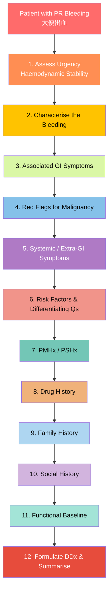

# History Taking: Lower GI Bleed (LGIB)

## Master Framework

---

## 0. Before You Start: Assess Urgency

This is the one complaint where you might need to **resuscitate before you history-take**. A patient passing large-volume bright red blood per rectum can be in hypovolaemic shock. Your first job is a quick "eyeball" assessment. [1][2]

- **Is the patient haemodynamically stable?** (BP, pulse, conscious level, capillary refill)
- **_Very severe_: hypotension, tachycardia, agitation, confusion, drowsiness, coma** [2]
- **_Moderate to severe_: postural hypotension (indicates ≥20% reduction in blood volume)** [2]

> In your OSCE, you won't literally resuscitate the mannequin, but you should **verbalise** that you would assess haemodynamic stability first. This scores marks.

**Cantonese phrasing:**

- "你而家覺得頭暈嗎？企起身會唔會暈？" _(Do you feel dizzy? Dizzy when standing up?)_
- "你隻手腳有冇凍？" _(Are your hands and feet cold?)_

---

## 1. Characterise the Bleeding

This is the **most important** part of your history. The way blood appears tells you roughly _where_ it comes from. [1][2][3]

### Nature of Blood

| Finding                                      | Likely Source                                                                       | Cantonese                |
| :------------------------------------------- | :---------------------------------------------------------------------------------- | :----------------------- |
| **_Blood mixed with faeces_**                | **Proximal to sigmoid (right colon)** — faeces still fluid so blood mixes in [1][2] | 血同大便撈埋一齊         |
| **_Blood on surface of stools / streaking_** | **Left colon / rectum** — faeces already solid [1]                                  | 血喺大便外面             |
| **_Blood on toilet paper only_**             | **Anorectal conditions** — mild, close to anal margin [1][2]                        | 抹嘅時候先見到血         |
| **_Blood after defecation_**                 | **Anus, e.g. haemorrhoids** [2]                                                     | 屙完之後先滴血           |
| **_Blood by itself (torrential)_**           | **Diverticular disease, angiodysplasia, rectal varices** [2]                        | 淨係出血，冇大便         |
| Melena (黑色、臭、稀)                        | Upper GI or right colon [2]                                                         | 大便黑色好似芝麻糊，好臭 |

**Practical phrasing:**

- "你見到嘅血係咩顏色？鮮紅色定暗紅色定黑色？" _(What colour is the blood? Bright red, dark red, or black?)_
- "血係混喺大便入面，定喺大便外面，定抹嘅時候先見到？" _(Is the blood mixed in the stool, on the surface, or only on wiping?)_
- "有冇試過淨係出血冇大便？" _(Have you ever passed blood by itself without stool?)_

<Callout title="Why the relationship of blood to stool matters" type="idea">
  This single question narrows your differential enormously. Blood **mixed
  with** stool = proximal source (cancer, IBD, diverticular disease). Blood
  **separate from** stool = outlet-type (haemorrhoids, fissure). Blood **by
  itself** in large volume = vascular cause (diverticular, angiodysplasia).
  Examiners love this distinction. [1][2]
</Callout>

### Volume and Frequency

- "每次出幾多血？好似幾多？有冇成廁所都係血？" _(How much blood each time? Has the toilet bowl been full of blood?)_
- "出咗幾多次？幾時開始？" _(How many times? When did it start?)_
- "係持續出血定間歇性？" _(Continuous or intermittent?)_

**Why this matters:** **_Diverticular bleeding_** is classically **painless, profuse haematochezia** that stops spontaneously in 80–85% of cases but can be massive. [1][2] **_Angiodysplasia_** tends to be **intermittent and less severe** (venous bleeding). [1][2] **_Colorectal cancer_** tends to be **low-grade, intermittent** and may present with iron-deficiency anaemia rather than frank haematochezia. [4]

### Onset, Timing, Progression

- Acute (recent ± haemodynamic compromise) vs chronic (over days/weeks) [2]
- **_Occult (FOBT +ve or anaemic symptoms) vs overt (blood found in stools)_** [2]
- "之前有冇試過大便出血？上次做過咩檢查？" _(Any previous episodes? What investigations were done?)_

### Severity Assessment — Symptoms of Haemodynamic Compromise

- Pallor, palpitations, dizziness, syncope, shortness of breath, extreme thirst, confusion [1][2]
- "你有冇覺得心跳好快？頭暈？攰？行路會喘？" _(Do you feel your heart racing? Dizzy? Tired? Breathless on walking?)_

---

## 2. Associated GI Symptoms

These questions help you differentiate between the major causes. [1][2][3]

### Bowel Habit Changes

- **_"你大便習慣有冇改變？有冇試過肚屙同便秘輪住嚟？"_** _(Any change in bowel habits? Alternating diarrhoea and constipation?)_
  - **Why:** Alternating diarrhoea and constipation, **_pencil-thin stools (大便好幼)_** and **_tenesmus (裏急後重 — 想屙但屙唔到)_** are classic warning signs of **_colorectal carcinoma_**. [2][3][5]
- "有冇痾黏液？" _(Any mucus in stools?)_
  - **Why:** Mucus + bloody diarrhoea → think **_IBD (particularly UC)_** or **_colorectal cancer_**. [2][3]
- "大便嘅粗幼有冇變？" _(Has the calibre of your stool changed?)_
  - **Why:** **_Change in stool calibre_** is a red flag for obstructing colorectal lesion. [3]

### Abdominal Pain

- "肚有冇痛？邊度痛？" _(Any abdominal pain? Where?)_
  - **_Painful haematochezia_**: ischaemic colitis, infectious colitis, IBD, anal fissure [1][2]
  - **_Painless haematochezia_**: haemorrhoids, diverticular bleeding, angiodysplasia [1][2]
  - **Severe sharp pain on defecation** → anal fissure [2]

### Anorectal Symptoms

- "肛門有冇痛？痕？有冇嘢突出嚟？" _(Any pain/itchiness at the anus? Any lump coming out?)_
  - **_Perianal mass/pain_** → haemorrhoids (especially if thrombosed), perianal abscess [3]
  - Pruritus → haemorrhoids (mucus secretion), threadworms
  - Sense of prolapse → haemorrhoids

### Upper GI Symptoms

- "有冇嘔血？嘔啡色嘢？" _(Any vomiting blood? Coffee-ground vomitus?)_
  - **Why:** **_10–15% of haematochezia is actually from a massive upper GI bleed._** Always consider this, especially if the patient is haemodynamically unstable. [2]

---

## 3. Red Flags for Malignancy

**_These are the questions examiners specifically look for._** [3][5]

- **_Change in bowel habit_** (alternating diarrhoea/constipation) [3][5]
- **_Tenesmus_** [3][5]
- **_Mucus per rectum_** [3][5]
- **_Duration of bleeding_** [5]
- **_Blood mixed with stool_** [5]
- **_Melaena / altered blood / dark red / maroon-coloured_** [5]
- **_Older age (>50)_** [5]
- **_Constitutional symptoms_**: weight loss (體重有冇輕咗?), loss of appetite (冇胃口?), fatigue (成日好攰?) [2][3]
- **_Family history_** of colorectal cancer or polyposis syndromes [3][5]
- **_Symptoms of metastatic spread_**: jaundice (skin/eyes yellow), bone pain, persistent cough/SOB, intractable sacral pain [2]

<Callout title="Red Flag Checklist for PR Bleeding" type="error">
If a patient is **>50 years old** with **any** change in bowel habit, weight loss, blood mixed with stool, or family history of CRC — this is a **two-week-wait referral** for colonoscopy. Students commonly forget to ask about **family history** and **constitutional symptoms**. Don't lose these easy marks. [5]
</Callout>

---

## 4. Differentiating Questions by Aetiology

This is where you earn extra marks — showing the examiner you're thinking about specific diagnoses. [1][2][3]

| Differential                        | Key Differentiating Questions                                                                                      | Why It Matters                                                                                                          |
| :---------------------------------- | :----------------------------------------------------------------------------------------------------------------- | :---------------------------------------------------------------------------------------------------------------------- |
| **_Diverticular disease (憩室病)_** | Painless profuse haematochezia? Self-limiting? Previous episodes? [1][2][3]                                        | Commonest cause of LGIB (17–40%). Painless. Stops spontaneously 80–85%. Right-sided diverticula commoner in Asians. [1] |
| **_Angiodysplasia_**                | Elderly? Hx of aortic stenosis? Hereditary haemorrhagic telangiectasia? CKD? [1][2]                                | Degenerative, venous bleeding, intermittent. Associations: Heyde syndrome (aortic stenosis), Osler-Weber-Rendu. [1][2]  |
| **_Colorectal carcinoma_**          | >50y? Change in bowel habit? Pencil-thin stools? Tenesmus? Weight loss? FHx? Smoker? Previous polyps? [2][3]       | ~10% of PR bleed in >50y. Low-grade, intermittent bleeding. May present as iron-deficiency anaemia. [4]                 |
| **_IBD_**                           | Young patient? Bloody diarrhoea? Mucus? Extra-intestinal features (joint pain, skin rash, eye symptoms)? [2]       | UC more commonly causes bleeding than Crohn's. Ask about extra-intestinal manifestations. [4]                           |
| **_Ischaemic colitis_**             | CVS risk factors? Acute MI? Stroke? AF? Abdominal pain post-prandially? [2]                                        | Classically LIF pain with bloody diarrhoea in elderly with vascular risk factors.                                       |
| **_Infective colitis_**             | Fever? Recent travel (TOCC)? Antibiotics (C. difficile)? Food history? Contacts? Immunosuppression (CMV)? [2][6]   | Must exclude infectious causes before diagnosing IBD.                                                                   |
| **_Haemorrhoids_**                  | Outlet-type bleeding? Blood on wiping/dripping after defecation? Constipation? Pregnancy? Perianal lump? [1][2][3] | Most common cause of LGIB in < 50y. Painless unless thrombosed.                                                         |
| **_Anal fissure_**                  | Severe sharp pain on defecation? Hx of constipation? [2]                                                           | Classic triad: pain, spasm, bleeding on defecation.                                                                     |
| **_Radiation proctocolitis_**       | **_Previous pelvic RT (cervical, prostate, rectal cancer)?_** Timing of symptoms relative to RT? [1][4]            | Acute (< 6 weeks) or delayed ( > 9 months, can be >10 years). [4]                                                       |
| **_Post-polypectomy_**              | **_Recent colonoscopy or polypectomy?_** [1][5]                                                                    | Acute (arterial) or delayed (eschar slough) bleeding. Always ask! [1]                                                   |
| **_Meckel's diverticulum_**         | Young patient? Painless bleeding? [1]                                                                              | Rule of 2s. Important in paediatric/young adult LGIB.                                                                   |
| **_Rectal varices_**                | Known liver disease? Portal hypertension? [4]                                                                      | Portosystemic shunt between superior and inferior rectal veins. Severe bleeding. [4]                                    |
| **_GI endometriosis_**              | **_Cyclical bleeding pattern? Young female?_** [3]                                                                 | Bleeding in a cyclical manner → pathognomonic. [3]                                                                      |

---

## 5. Targeted Systems Review

### Cardiovascular

- AF, IHD, heart failure, aortic stenosis (Heyde syndrome), peripheral vascular disease
- **Why:** CVS risk factors → ischaemic colitis; HF → susceptible to fluid overload during resuscitation; aortic stenosis → angiodysplasia [2]

### Respiratory

- SOB at rest or on exertion
- **Why:** Anaemia symptoms; cardiopulmonary disease → more susceptible to hypoxaemia [2]

### Hepatic

- Jaundice, ascites, encephalopathy, known liver disease
- **Why:** Portal hypertension → rectal varices; coagulopathy worsens any bleeding [1][2]

### Renal

- Known CKD, dialysis
- **Why:** Uraemic platelet dysfunction → bleeding tendency; angiodysplasia association; fluid overload risk with resuscitation [1][2]

### Haematological

- Easy bruising, prolonged bleeding from cuts, heavy periods
- **Why:** Underlying bleeding disorder may be the reason bleeding is disproportionate [7]

---

## 6. Past Medical History

- **_Previous bleeding episodes_** — When? What investigation? What treatment? [5]
- **_Peptic ulcer disease_** — Could this be an upper GI source? [1]
- **_IBD_** — Known diagnosis? On treatment?
- **_Previous colonoscopy / polypectomy_** — When? Findings? [5]
- **_Chronic liver disease_** — Coagulopathy, varices [1]
- **_Heart failure or renal failure_** — Fluid management implications [2]
- **_Hereditary haemorrhagic telangiectasia_** — Angiodysplasia [1]
- **_Connective tissue disorders_** — Ehler-Danlos [7]

## 7. Past Surgical History

- **_Abdominal aortic aneurysm (AAA) repair with graft_** → DDx: **aorto-enteric fistula** (herald bleed → massive exsanguination) [1]
- **_Gastroenteric anastomosis_** → DDx: marginal ulcers [1]
- Previous colorectal surgery → anastomotic bleeding, altered anatomy
- Previous pelvic surgery → adhesions, radiation history

<Callout title="Don't Forget the Aorto-Enteric Fistula" type="error">
  Any patient with a history of **AAA repair** presenting with GI bleeding must
  be considered to have an **aorto-enteric fistula** until proven otherwise.
  This is a life-threatening emergency. Students almost always miss this. A
  "herald bleed" (small initial bleed) can precede catastrophic haemorrhage. [1]
</Callout>

## 8. Drug History & Allergies

**_This is consistently highlighted across all lecture slides and notes._** [1][2][5]

| Drug Class                             | Relevance                                                    | Cantonese                    |
| :------------------------------------- | :----------------------------------------------------------- | :--------------------------- |
| **_NSAIDs_**                           | Peptic ulcers, small bowel ulcers, colitis [2][6]            | 你有冇食止痛藥？             |
| **_Aspirin_**                          | ↑ bleeding risk, peptic ulcers [1]                           | 你有冇食薄血丸或者阿士匹靈？ |
| **_Antiplatelets (clopidogrel)_**      | ↑ bleeding risk [1][2]                                       |                              |
| **_Anticoagulants (warfarin, DOACs)_** | ↑ bleeding risk [1][2][5]                                    |                              |
| **_Iron supplements_**                 | Can cause **black stool** (must distinguish from melena) [1] | 你有冇食鐵丸？               |
| **_Antibiotics_**                      | C. difficile-associated colitis [6]                          | 最近有冇食過抗生素？         |
| **_Traditional Chinese medicine_**     | May contain steroids → GI ulceration [1]                     | 有冇食中藥？                 |
| **_Steroids_**                         | ↑ ulcer risk                                                 |                              |

- **Allergies:** "你有冇對咩藥物敏感？" _(Any drug allergies?)_

## 9. Family History

- **_Colorectal cancer_** — First-degree relative with CRC → significantly elevated risk [3][5]
- **_Familial polyposis syndromes_** (FAP, Lynch syndrome)
- **_IBD_** — Family predisposition
- **_Bleeding disorders_** — Haemophilia, von Willebrand disease [7]

"你屋企人有冇人試過大腸癌或者腸瘜肉？" _(Has anyone in your family had bowel cancer or polyps?)_

## 10. Social History

| Domain                      | Questions                                        | Why It Matters                                         |
| :-------------------------- | :----------------------------------------------- | :----------------------------------------------------- |
| **_Smoking_**               | 你有冇食煙？食咗幾耐？每日幾多支？               | Risk factor for CRC and peptic ulcers [1]              |
| **_Alcohol_**               | 你飲唔飲酒？飲幾多？                             | Chronic liver disease → varices, coagulopathy [1]      |
| **_Diet_**                  | High red/processed meat, low fibre               | CRC risk factors                                       |
| **_Sexual history_**        | If appropriate — MSM, receptive anal intercourse | Proctitis (gonorrhoea, HSV, chlamydia) [6]             |
| **_Travel history (TOCC)_** | 最近有冇去旅行？去邊度？                         | Endemic areas for parasitic infections (amebiasis) [6] |
| **_Occupation_**            | Prolonged sitting/standing                       | Haemorrhoid risk                                       |
| **_Functional baseline_**   | ADLs, mobility, exercise tolerance               | Pre-morbid fitness affects surgical candidacy          |

---

## 11. Red-Flag Findings and Escalation Triggers

These findings should prompt **immediate escalation** to a senior clinician/surgeon:

1. **Haemodynamic instability** — Hypotension (SBP < 90), tachycardia (> 100), confusion, syncope [2]
2. **Massive ongoing haematochezia** — Not settling, requiring transfusion
3. **Suspected aorto-enteric fistula** — History of AAA graft + GI bleed [1]
4. **Signs of peritonism** — Guarding, rebound tenderness → perforation/ischaemic bowel
5. **Massive transfusion requirement** — >6 units pRBC [2]
6. **Anticoagulant use** with uncontrolled bleeding [2]
7. **Suspected upper GI source** — Haematemesis, coffee-ground vomitus, haemodynamic instability disproportionate to PR bleeding [2]

---

## 12. Common Pitfalls in History-Taking

<Callout title="Common Student Mistakes" type="error">

1. **Forgetting to exclude upper GI bleed** — 10–15% of haematochezia is from massive UGIB. Always ask about haematemesis, coffee-ground vomitus, and melena. [2]
2. **Not asking about the relationship of blood to stool** — This is the single most localising question and students routinely skip it.
3. **Ignoring drug history** — NSAIDs, antiplatelets, and anticoagulants are consistently tested. [1][2][5]
4. **Not asking about recent procedures** — Post-polypectomy bleeding is an important and easily missed cause. [1][5]
5. **Forgetting iron supplements** — Black stool from iron ≠ melena. Ask specifically. [1]
6. **Not asking about AAA repair** — Aorto-enteric fistula is rare but lethal and always asked in exams. [1]
7. **Skipping constitutional symptoms and family history** — These are the CRC red flags examiners specifically look for. [5]
8. **Assuming haemorrhoids in a young patient without exclusion of other causes** — Haemorrhoids are common but should be a diagnosis of exclusion in someone with red flags.
9. **Not checking haemodynamic status first** — In an OSCE, verbalise: "Before taking a detailed history, I would assess haemodynamic stability."

</Callout>

---

## 13. High-Yield Exam Interpretation Tips

- **"75% of lower GI bleeding stops spontaneously"** [2] — This is a favourite exam fact. It means that most LGIB is self-limiting, but you still need to find the cause.
- **_Right-sided diverticula are more common in Asians_** (cf. left-sided in Western populations) and have a **higher risk of haemorrhage**. [1] — HKU loves this.
- **Hb does NOT reflect acute blood loss** — It takes ≥24 hours for haemodilution to occur. A normal Hb in the ED does NOT mean the patient hasn't bled significantly. [2]
- **Colour of blood is a rough guide only** — Fresh PR blood (鮮紅色) = distal to splenic flexure; Dark PR blood (暗紅色) = proximal to splenic flexure. [3]
- **_Diverticular bleeding occurs in the absence of diverticulitis_** — A common misconception. Bleeding and inflammation are separate complications. [1]
- **Colonoscopy diagnostic yield = 75–90%** and should be performed early. [2]
- **99mTc-labelled RBC scan** is more sensitive than angiography for GI bleeding (min bleeding rate 0.1–0.4 vs ≥0.5–1 mL/min) and can detect intermittent bleeding with delayed images up to 24h. [8]

---

## 14. Model Reporting Script (SBAR / British Framework)

> **Mr Chan is a 68-year-old gentleman who presented 2 days ago to Queen Mary Hospital with a 3-day history of painless, profuse, bright red per-rectal bleeding. He describes passing large volumes of fresh blood by itself without stool on approximately 6 occasions. He denies any abdominal pain, change in bowel habit, tenesmus, mucus per rectum, or constitutional symptoms such as weight loss or loss of appetite. There is no haematemesis or coffee-ground vomitus. He reports feeling light-headed on standing and has had one syncopal episode.**
>
> **His past medical history is significant for hypertension, hyperlipidaemia, and type 2 diabetes mellitus. He had a right hemicolectomy 5 years ago for a benign adenomatous polyp. He has no history of inflammatory bowel disease, liver disease, or previous GI bleeding.**
>
> **His past surgical history includes the right hemicolectomy as mentioned, and an open appendicectomy in childhood. He has had no aortic surgery.**
>
> **His regular medications include aspirin 80 mg daily, atorvastatin 40 mg daily, metformin 500 mg BD, and amlodipine 5 mg daily. He has no known drug allergies.**
>
> **His family history is notable for a brother diagnosed with colorectal carcinoma at age 72. There is no family history of inflammatory bowel disease or polyposis syndromes.**
>
> **Socially, Mr Chan is a retired bus driver. He is an ex-smoker with a 30 pack-year history, having quit 10 years ago. He drinks alcohol socially, approximately 2 units per week. He is independent in all activities of daily living and has a good exercise tolerance, able to climb 2 flights of stairs without limitation.**
>
> **In summary, Mr Chan is a 68-year-old gentleman with cardiovascular risk factors, on aspirin, presenting with acute, painless, profuse haematochezia with haemodynamic compromise including syncope. The leading differential diagnosis is diverticular bleeding given the painless, profuse nature and his age. However, given his family history of colorectal carcinoma and personal history of adenomatous polyp, malignancy must be excluded. I would like to discuss his resuscitation plan, the need for urgent colonoscopy, and whether we should consider a CT angiogram given his haemodynamic instability.**

---

<ActiveRecallQuiz
  title="Active Recall - History Taking"
  items={[
    {
      question:
        "What is the most common cause of lower GI bleeding, and how does it typically present?",
      markscheme:
        "Diverticular bleeding (17-40%). Presents as painless, profuse haematochezia. Stops spontaneously in 80-85% of cases. Right-sided diverticula are more common in Asians and carry a higher haemorrhage risk.",
    },
    {
      question:
        "How does the relationship of blood to stool help localise the source of lower GI bleeding?",
      markscheme:
        "Blood mixed with stool = proximal to sigmoid colon. Blood on surface of stool / streaking = left colon or rectum. Blood on toilet paper = anorectal source. Blood after defecation = anus (e.g. haemorrhoids). Blood by itself = torrential bleed (diverticular, angiodysplasia, rectal varices).",
    },
    {
      question:
        "What percentage of haematochezia is actually from an upper GI source, and why is this clinically important?",
      markscheme:
        "10-15% of haematochezia is from a massive upper GI bleed. Clinically important because these patients are often haemodynamically unstable and require urgent OGD. Must always exclude UGIB in severe haematochezia.",
    },
    {
      question:
        "Name the red flag features in a patient with PR bleeding that should prompt urgent investigation for colorectal carcinoma.",
      markscheme:
        "Age >50, change in bowel habit, tenesmus, mucus per rectum, blood mixed with stool, pencil-thin stools, constitutional symptoms (weight loss, anorexia, fatigue), family history of CRC, and melaena or altered blood.",
    },
    {
      question:
        "A patient with a history of AAA graft repair presents with GI bleeding. What diagnosis must you consider and why?",
      markscheme:
        "Aorto-enteric fistula. Erosion of graft into duodenum (D3/D4). Life-threatening. May present with a herald bleed (small initial bleed) before catastrophic exsanguination. Requires urgent surgical consultation.",
    },
    {
      question:
        "Why does Hb not reliably reflect the degree of acute blood loss in the ED, and when does it become useful?",
      markscheme:
        "In acute haemorrhage, Hb does not drop until expansion of extracellular volume (haemodilution), which takes at least 24 hours. Therefore, a normal Hb in the ED does NOT exclude significant blood loss. Serial Hb measurements over 24-48 hours are more informative.",
    },
  ]}
/>

---

<Callout title="High Yield Summary">

**Lower GI bleed = bleeding distal to ligament of Treitz.** Most common presentation is haematochezia. 75% stops spontaneously.

**Key history framework:** (1) Assess haemodynamic stability FIRST. (2) Characterise the bleeding — nature, colour, relationship to stool, volume, timing. (3) Associated GI symptoms — bowel habit change, pain, anorectal symptoms. (4) Red flags for CRC — age >50, change in bowel habit, constitutional symptoms, family history. (5) Always exclude UGIB (10–15% of haematochezia). (6) Drug history — NSAIDs, antiplatelets, anticoagulants, iron, antibiotics, TCM. (7) Surgical history — AAA repair (aorto-enteric fistula), recent polypectomy. (8) Comorbidities — liver disease (varices/coagulopathy), CKD (platelet dysfunction), CVS disease (ischaemic colitis), HF/RF (fluid overload risk).

**Top differentials by age:** < 50y = haemorrhoids, IBD, Meckel's. >50y = diverticular disease, angiodysplasia, colorectal carcinoma. All ages = infectious colitis, ischaemic colitis, post-procedure bleeding.

**Three things students always forget:** (1) Asking about relationship of blood to stool. (2) Excluding UGIB. (3) AAA graft history.

</Callout>

---

## References

[1] Senior notes: felixlai.md (Lower GI bleeding, sections on differential diagnosis and history taking)
[2] Senior notes: Ryan Ho GI.pdf (pp. 107–111, Approach to Lower GI Bleeding — History Taking, Causes, Investigations)
[3] Senior notes: maxim.md (Section 4.2 LGIB, DDx table and Section 4.8 Diseases of anal canal)
[4] Senior notes: Ryan Ho Fundamentals.pdf (pp. 281–286, Lower GI Bleeding causes and approach)
[5] Lecture slides: GC 186. Lower and diffuse abdominal painfresh blood in stool.pdf (pp. 3, 4, 19, 38)
[6] Senior notes: felixlai.md (Ulcerative colitis section — differential diagnosis including infectious colitis, radiation colitis, sexual history)
[7] Senior notes: Ryan Ho Haemtology.pdf (p. 114, Approach to Bleeding Disorders — history taking)
[8] Senior notes: Ryan Ho Diagnostic Radiology.pdf (p. 62, Red Blood Cell Scan for GI bleeding)
