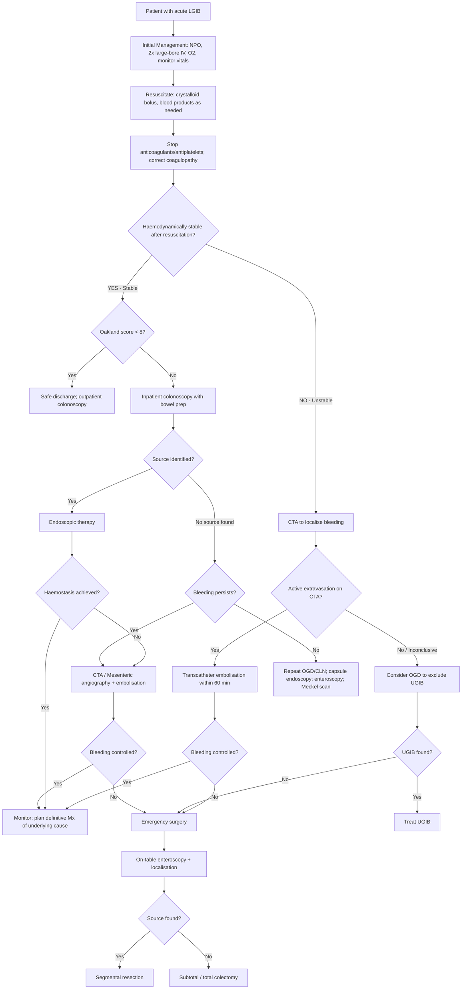

## Management of Lower GI Bleeding

The management of LGIB follows the same "3S" framework introduced in the diagnostic section, but now we flesh out every treatment modality in detail. Think of it as a stepwise escalation ladder: **conservative → endoscopic → interventional radiology → surgery** [1][3][7].

---

## Overarching Management Algorithm

---

## Step 1: Initial Resuscitation and Stabilisation

This is the **"Save the patient"** phase. Every LGIB patient gets this regardless of severity [1][2][3][4]:

### A. Airway, Breathing, Circulation (ABC)

| Component | Action | Rationale |
|:----------|:-------|:----------|
| **A — Airway** | ***Intubate if decompensated (confused) or massive haematemesis*** [3] | Altered consciousness → loss of airway protective reflexes → aspiration risk |
| **B — Breathing** | ***O₂ on nasal cannula*** [3] | ↑ O₂ carrying capacity of remaining blood; compensate for ↓ Hb |
| **C — Circulation** | ***2× large-bore IV cannula (14/16G at antecubital vein)*** [3][14] → ***crystalloid (NS or Hartmann's) full rate*** | Large-bore cannulae allow rapid volume infusion (flow rate ∝ r⁴ by Poiseuille's law — a 14G cannula delivers fluid ~4× faster than an 18G). Crystalloids restore intravascular volume quickly |

### B. NPO and Monitoring

- ***Nil by mouth (NPO)*** — in case endoscopy or surgery is needed [2]
- ***Withhold anticoagulants and antiplatelet drugs*** [2]
  - But ***weigh against thrombotic risk*** of the individual patient before reversing anticoagulation [2]
- ***Close monitoring*** [1][3]:
  - ***Shock chart hourly***
  - ***Vitals: BP/P, RR, body temperature*** (***↓ body temperature can cause ↓ efficiency of clotting factors*** — keep the patient warm) [1][3]
  - ***Foley's catheter: urine output ≥ 0.5 mL/kg/h*** [1][3]
  - ***Cardiac monitor, pulse oximetry*** [1][3]
  - ***± CVP line for PAWP*** (in ICU setting to guide resuscitation without fluid overload) [1][3]
  - **Cardiac monitor** especially important ***to prevent volume overload in patients with congestive heart failure*** during fluid resuscitation/blood transfusion [2]

### C. Volume Resuscitation

***Give rapid fluid challenge: 500 mL (or 1000 mL) of crystalloid solution over 5–10 min*** → ***reassess BP/P every 5 min*** → ***repeat if not responding*** [14]

| Fluid | When to Use | Mechanism |
|:------|:-----------|:----------|
| **Isotonic crystalloid** (NS 0.9% or Hartmann's/Ringer's lactate) | First-line for all patients | Expands intravascular volume; distributes across ECF; cheap, readily available |
| **Colloid** (e.g. gelatin, albumin) | Acceptable alternative | Stays intravascular longer (larger molecules → higher oncotic pressure) but no proven mortality benefit over crystalloid |
| **Packed RBCs** | See transfusion thresholds below | Restores oxygen-carrying capacity |

### D. Blood Transfusion Thresholds

From the BSG 2019 guidelines cited in lecture slides [7]:

***If Hb < 7 g/dL → transfuse: target Hb 7–9 g/dL post-transfusion if no CVD*** [7]

***If Hb ≥ 8 g/dL and CVD present → transfuse: target Hb ≥ 10 g/dL*** [7]

Indications for transfusion [3]:
- Profuse ongoing bleeding
- Persistent haemodynamic instability despite crystalloid resuscitation
- Symptomatic anaemia
- Acute MI / unstable angina with low Hb

<Callout title="Why Restrictive Transfusion?" type="idea">
**Restrictive transfusion strategy** (targeting Hb 7–9 rather than higher) is associated with **↓ mortality** in GI bleeding. Over-transfusion raises intravascular volume and pressure → ↑ splanchnic blood flow → can promote rebleeding, especially from varices and arterial sources. Also avoids transfusion-related complications (TRALI, volume overload, immunosuppression).
</Callout>

### E. Correction of Coagulopathy

| Product | Indication | Mechanism |
|:--------|:----------|:----------|
| ***Fresh frozen plasma (FFP)*** | ***Coagulopathy*** (↑ INR/PT from liver disease, warfarin, DIC) [2] | Contains all clotting factors |
| ***Platelets*** | ***Platelet dysfunction or thrombocytopaenia*** ( < 50 × 10⁹/L in active bleeding) [2] | Direct replacement of platelet mass |
| **Vitamin K (IV)** | Warfarin over-anticoagulation | Cofactor for hepatic synthesis of factors II, VII, IX, X; takes 6–24h to work |
| **Prothrombin complex concentrate (PCC)** | Urgent warfarin reversal | Concentrated factors II, VII, IX, X; acts within minutes (faster than FFP) |
| **Idarucizumab** | Dabigatran reversal | Monoclonal antibody fragment that binds and neutralises dabigatran |
| **Andexanet alfa** | Factor Xa inhibitor reversal (rivaroxaban, apixaban) | Recombinant modified factor Xa decoy that binds anti-Xa drugs |
| **Tranexamic acid** | Adjunct antifibrinolytic | Inhibits plasmin → stabilises clots. Used in some centres as adjunct for LGIB [4] |

---

## Step 2: Endoscopic Therapy (First-Line Definitive Treatment)

Endoscopic therapy is the **cornerstone** of LGIB management once the patient is stabilised. It allows simultaneous diagnosis and treatment [1][3][7].

### Indications for Endoscopic Haemostasis

***Stigmata of recent haemorrhage***: ***active bleeding, non-bleeding visible vessel, adherent clot*** [4]

### Endoscopic Treatment Modalities

The lecture slides and BSG guidelines specify **which modality for which pathology** [7]:

#### A. Injection Therapy

| Agent | Mechanism | Important Caveat |
|:------|:----------|:----------------|
| ***Epinephrine (adrenaline) injection (1:10,000)*** | Local **tamponade effect** (volume of injected fluid compresses the vessel) + **vasoconstriction** (α₁ adrenergic agonism) + **platelet aggregation promotion** | ***Not used alone*** [4] — stops bleeding in 90–95% initially but **often rebleeds within 1 hour** after the adrenaline is absorbed [15]. Must be combined with a second modality |

**4-quadrant submucosal injection** technique: Inject 0.5–1 mL aliquots of 1:10,000 adrenaline around the bleeding point in all four quadrants → creates a tamponade cushion while the vasoconstriction takes effect [2]

#### B. Thermal Therapy

| Modality | Mechanism | Best For | Risk |
|:---------|:----------|:---------|:-----|
| ***Argon plasma coagulation (APC)*** | Non-contact thermal coagulation using ionised argon gas; ***↓ energy depth than heat probe → ↓ risk of perforation*** | ***Angiodysplasia*** [4][7], ***radiation proctitis*** [15] — ideal for thin-walled structures and diffuse superficial oozing | Perforation (rare due to limited depth) |
| Heat probe (bipolar coagulation) | Contact thermal coagulation — literally "melts" the vessel wall shut | Visible vessel in ulcer base | Perforation (deeper energy penetration) |
| Laser coagulation | Photocoagulation | Rarely used now; superseded by APC | Cost, availability |
| Monopolar electrocautery | Contact thermal | Angiodysplasia (alternative to APC) [4] | Perforation |

> Why APC is ideal for angiodysplasia: Angiodysplastic lesions are superficial (submucosal vessels) in thin-walled colon (especially caecum). APC delivers energy to a **controlled, shallow depth** → coagulates the abnormal vessels without burning through the full thickness of the colonic wall.

#### C. Mechanical Therapy

| Modality | Mechanism | Best For |
|:---------|:----------|:---------|
| ***Through-the-scope (TTS) clips*** | Metallic clip deployed through the endoscope channel; physically compresses the bleeding vessel against underlying tissue | ***Diverticular bleeding*** [7]; large visible vessels; post-polypectomy bleeding |
| ***Cap-mounted clips*** | Clip device mounted on the tip of the endoscope; allows en face application | ***Diverticular bleeding*** [7] — can grasp the bleeding diverticulum en bloc |
| ***Endoscopic band ligation (EBL)*** | Rubber band placed around the tissue containing the bleeding vessel → strangulation → ischaemic necrosis → haemostasis | ***Diverticular bleeding*** [7]; analogous to variceal banding |
| ***Over-the-scope clip (OTSC / Ovesco)*** | Large clip that can grasp a wide area of tissue; deployed over the scope tip | Larger defects; ***can even treat GI perforation, leakage, fistula*** [4] |

#### D. Haemostatic Topical Agents

| Agent | Mechanism | Role |
|:------|:----------|:-----|
| ***Haemostatic topical agent (e.g. TC-325 Hemospray)*** | Nanopowder sprayed onto bleeding site → absorbs moisture → creates a mechanical barrier → activates clotting cascade | ***Salvage treatment*** [7] — used when other modalities fail; particularly useful for ***delayed post-polypectomy bleeding*** [7] |

<Callout title="Endoscopic Therapy Summary by Aetiology (from Lecture Slides)">

***Diverticular bleeding: TTS/cap-mounted clip or EBL*** [7]

***Angioectasia (angiodysplasia): APC*** [7]

***Delayed post-polypectomy bleeding: Mechanical therapy (TTS/cap-mounted clip or EBL) or thermal treatment; hemostatic topical agent as salvage treatment*** [7]

</Callout>

### Contraindications to Endoscopy

- ***Suspected perforation*** (gas insufflation → pneumoperitoneum → abdominal compartment syndrome → ↓ venous return and death, plus splinting of diaphragm compromising ventilation) [3][15]
- Unstable cardiac/pulmonary status (anaesthetic risk)
- Unable to achieve adequate bowel preparation (unstable patients — proceed to CTA instead)
- Uncooperative patient without sedation

### Risks of Endoscopy [15]

- **Anaesthetic risk**: respiratory depression, MI, CVA
- **Procedure-related**: aspiration, bleeding (worsening), perforation, failure of haemostasis, incomplete scope

---

## Step 3: Interventional Radiology — Transcatheter Embolisation

When endoscopy fails or is not feasible (e.g. massive bleeding with poor visualisation), interventional radiology is the next step [2][4][7].

### Mesenteric Angiography + Transcatheter Arterial Embolisation (TAE)

**Procedure**: Selective catheterisation of SMA, IMA, and coeliac artery by **Seldinger technique** → identification of active extravasation → super-selective catheterisation of the bleeding vessel → deployment of embolic agents [3][11]

**Embolic agents** [16]:
- ***Gelfoam*** (absorbable gelatin sponge) — temporary occlusion
- ***PVA particles*** (polyvinyl alcohol) — permanent small-vessel occlusion
- ***Coils*** (metallic) — permanent occlusion of named vessels
- ***Glue (cyanoacrylate)*** — for AVMs and emergencies

**From lecture slides**: ***Transcatheter embolisation within 60 minutes*** is recommended for haemodynamically unstable patients with CTA-confirmed bleeding [7]

### Indications for TAE

| Indication | Rationale |
|:-----------|:----------|
| ***Failed endoscopic haemostasis*** | Escalation to next treatment tier |
| Brisk bleeding with CTA-confirmed extravasation | Direct access to bleeding vessel for embolisation |
| Bleeding source identified on angiography (even without prior CTA) | Therapeutic opportunity during diagnostic procedure |
| ***Patient unfit for surgery*** [15] | TAE is less invasive; equally effective as surgery for failed endoscopy with fewer complications [2] |
| ***Recurrent bleeding despite endoscopy*** | Re-endoscopy may not succeed |

### Advantages of TAE

- ***Equally effective compared to surgery in patients who failed therapeutic endoscopy*** with fewer complications [2]
- ***Reduces the need for surgery without increasing overall mortality*** [2]
- Can be performed under local anaesthesia (no GA required)
- Can specifically pinpoint the bleeding vessel [11]
- Can be performed intra-operatively to guide surgery [11]

### Disadvantages / Complications

- ***Embolisation carries risk of intestinal ischaemia*** [11] — the colon has less collateral circulation than the stomach/duodenum; super-selective catheterisation minimises this risk
- Not sensitive for slow/intermittent bleeding (requires active extravasation ≥ 0.5–1 mL/min)
- Nephrotoxic contrast
- Access site complications (haematoma, pseudoaneurysm, dissection)
- Non-target embolisation

### Intra-arterial Vasopressin Infusion (Historical)

- ***Injection of intra-arterial vasopressin*** via the angiography catheter [2]
- MoA: Potent mesenteric vasoconstriction → ↓ blood flow to bleeding site → haemostasis
- Largely superseded by embolisation (vasopressin has systemic side effects — cardiac ischaemia, hypertension, bowel ischaemia — and high rebleeding rate after cessation)
- Rarely used in modern practice

---

## Step 4: Surgical Management (Last Resort)

***Surgery is required in ~15–20% of patients with acute LGIB*** [1][3]

### Indications for Surgery [1][3][7]

***For relatively stable patients, persistent bleeding after exhausting endoscopic and radiological interventions*** [7]

***For patients who don't respond to initial resuscitation*** [7]

Additional indications [1][3]:
- ***Haemodynamic instability despite adequate resuscitation***
- ***Massive blood transfusion ( > 6 units)***
- ***Frequent rebleeding***
- ***On anticoagulants or antiplatelets*** (higher bleeding tendency)
- ***Consider surgery for patients with LGIB due to pathology not amenable to being treated endoscopically or radiologically*** [7]

### Intra-operative Approach [7]

***Consider upper endoscopy first if not been performed*** [7]

The systematic intra-operative assessment [7]:

1. ***Palpation of small bowel (tumour, diverticulum)*** — run the entire length of small bowel between fingers feeling for masses, thickening, or diverticula
2. ***On-table upper endoscopy and colonoscopy*** — the surgeon can observe the bowel both luminally (via endoscope) and serially (via direct observation)
3. ***On-table enteroscopy (diagnostic yield of 80–92%)*** [7] — scope inserted through an enterotomy at the mid-small bowel and advanced in both directions
4. ***Clamping of bowel segments*** — sequential clamping to isolate the segment that is accumulating blood

### Surgical Procedures

| Scenario | Procedure | Outcome |
|:---------|:---------|:--------|
| **Bleeding source localised** | ***Segmental resection*** (resect the affected segment + primary anastomosis) | ***Rebleeding rate 0–15%***, mortality 0–13% [1][3] |
| **Bleeding source NOT localised, probable colonic cause** | ***Subtotal or total colectomy*** (remove entire colon with ileostomy or ileorectal anastomosis) | ***Rebleeding rate 10–20%*** [7]; mortality 0–40% [1] |
| **Blind segmental resection** (without localisation — AVOID) | Segmental resection based on guess | ***Rebleeding rate up to 75%*** [1] — this is why pre-operative localisation is so important |

<Callout title="Never Do a Blind Segmental Resection" type="error">
***Blind segmental resection has a rebleeding rate of up to 75%*** [1]. This is because you may be resecting the wrong segment while the actual bleeding source remains in situ. **Always attempt to localise the bleeding** before committing to segmental resection. If localisation fails and the patient is exsanguinating, a subtotal colectomy (which removes the entire colon) is safer than guessing.
</Callout>

---

## Aetiology-Specific Management

Now let's integrate the above framework with management tailored to each specific cause:

### 1. Diverticular Bleeding

| Step | Treatment | Details |
|:-----|:---------|:--------|
| **Spontaneous resolution** | Observation | ***50% of bleeding stops spontaneously*** [5]; ***80–85% overall*** [1] |
| **Conservative** | ***Lifestyle modification*** | ***High-fibre diet, bulk laxatives (e.g. methylcellulose), weight reduction*** [5]; ***avoid stimulant laxatives and NSAIDs*** [5] |
| **Endoscopic** | ***TTS/cap-mounted clip or EBL*** [7] | ***4-quadrant submucosal injection of adrenaline*** in bleeding diverticular vessel; ***bipolar coagulation*** for visualised non-bleeding vessel [2] |
| **Radiological** | ***Embolisation or infusion of vasopressin*** via angiography [2] | Alternative when colonoscopy fails to identify/treat the source |
| **Surgical** | ***Segmental colectomy*** (with localisation) or ***subtotal colectomy*** (without localisation) | ***Semi-elective resection after 2nd bleeding episode*** [1]; reserved for failed endoscopic/angiographic therapy [2] |

**Localisation of diverticular bleeding** follows a stepwise approach [5]:
***Colonoscopy → angiography → on-table lavage and colonoscopy → subtotal colectomy and ileostomy*** if bleeding source still cannot be identified

### 2. Angiodysplasia

| Step | Treatment | Details |
|:-----|:---------|:--------|
| **Conservative** | ***Bed rest, tranexamic acid*** [4] | Antifibrinolytic stabilises clots; most bleeding is venous and self-limiting |
| **Endoscopic** | ***Argon plasma coagulation (APC)*** [4][7] or ***monopolar electrocautery*** [4] | APC is preferred: non-contact, controlled depth, ideal for thin-walled right colon |
| **Radiological** | ***Mesenteric angiogram for super-selective catheterisation and embolisation*** [4] | When CLN inconclusive or endoscopic therapy fails |
| **Surgical** | ***Resection (right hemicolectomy) with anastomosis*** [4] | Only for selected patients — ***high mortality***. Indications: (1) ***failed endoscopic and angiographic treatment***, (2) ***severe acute life-threatening GIB***, (3) ***multiple angiodysplastic lesions that cannot be managed otherwise*** [4] |

### 3. Haemorrhoids

| Grade | Management | Mechanism |
|:------|:----------|:----------|
| **Grade 1** | Conservative: high-fibre diet, adequate hydration, stool softeners, avoid straining | ↓ intra-abdominal pressure → ↓ venous engorgement |
| **Grade 1–2** | ***Rubber band ligation*** [1] | Strangulates the haemorrhoidal tissue above dentate line → ischaemic necrosis → scarring → fixation |
| **Grade 2–3** | Injection sclerotherapy (5% phenol in almond oil) | Chemical inflammation → fibrosis → shrinkage |
| **Grade 3–4** | ***Haemorrhoidectomy*** (excisional: Milligan-Morgan open or Ferguson closed) [1] | Surgical excision of haemorrhoidal tissue |
| **Thrombosed external** | Incision and evacuation if < 72h; otherwise conservative | Evacuation provides immediate pain relief; after 72h, clot is organising and pain is improving |

### 4. Colorectal Cancer

- **Definitive management**: Surgical resection (type depends on tumour location — right hemicolectomy, left hemicolectomy, anterior resection, abdominoperineal resection)
- Acute LGIB from CRC is rarely massive; usually managed with colonoscopic biopsy → staging → planned surgical resection
- If presenting with obstructing CRC + bleeding → consider endoscopic stenting as bridge to surgery [17]

### 5. Colitis (by Type)

| Type | Management | Key Points |
|:-----|:----------|:-----------|
| **IBD (UC/Crohn's)** | Immunosuppression: 5-ASA, steroids, azathioprine, biologics (anti-TNF, vedolizumab) | Treat the underlying inflammation → bleeding resolves |
| **Ischaemic colitis** | ***Majority resolve with supportive care*** [17]: NPO, IV fluids, broad-spectrum antibiotics, ± rectal tube decompression | Surgery (emergency laparotomy + resection) for ***infarction/necrosis, perforation, peritonitis, haemodynamic instability*** [17] |
| **Infective colitis** | Antibiotics targeted to organism (e.g. metronidazole/vancomycin for C. diff); supportive | Identify the pathogen; stool culture + C. diff toxin |
| **Radiation proctitis** | ***APC*** (endoscopic) is first-line; also formalin application, sucralfate enemas | APC coagulates the telangiectatic vessels in the irradiated mucosa |

### 6. Meckel's Diverticulum

| Scenario | Management |
|:---------|:----------|
| ***Symptomatic*** | ***Resection*** [4][10] |
| Symptomatic, ***narrow base*** | ***Simple diverticulectomy*** (excision at the base + suture closure) [4] |
| Symptomatic, ***broad base / ulceration at margin / mesenteric border*** | ***Segmental bowel resection + primary anastomosis*** [4] |
| Asymptomatic, ***detected on imaging*** | ***Not resect*** [4] |
| Asymptomatic, ***detected during surgery*** | Depends on age: ***Child → resect***; ***Adult < 50y → resect if palpable, length > 2 cm and broad base > 2 cm***; ***Adult > 50y → not resect*** [4] |

### 7. Rectal Varices

| Treatment | Details |
|:----------|:--------|
| ***Injection sclerotherapy (local)*** [1] | Direct injection into the varix → thrombosis |
| ***TIPS (if uncontrolled bleeding)*** [1] | Transjugular intrahepatic portosystemic shunt → decompresses portal system → ↓ variceal pressure |
| Band ligation | Analogous to oesophageal variceal banding |
| Treat underlying portal hypertension | Non-selective β-blockers (propranolol/nadolol) for secondary prophylaxis |

---

## Post-Bleeding Management

After achieving haemostasis, several important steps follow:

### Monitoring for Rebleeding

- ***Close monitoring for rebleeding signs***: ↑ pulse rate, fresh PR bleeding, sudden ↓ Hb [15]
- Keep in-patient care for ≥ 3 days (longer if high-risk features) [15]
- Serial Hb checks (every 6–8 hours initially)

### Secondary Prevention

| Cause | Secondary Prevention |
|:------|:--------------------|
| **Diverticular disease** | High-fibre diet; avoid NSAIDs; ***semi-elective resection after 2nd bleeding episode*** [1] |
| **Angiodysplasia** | No proven pharmacological prophylaxis; consider APC if recurrent; address Heyde syndrome (aortic valve replacement) |
| **Haemorrhoids** | Dietary fibre, hydration, stool softeners, avoid straining |
| **CRC** | Surveillance colonoscopy post-resection; adjuvant chemotherapy if indicated |
| **IBD** | Maintenance immunosuppressive therapy |
| **Drug-related bleeding** | Review and rationalise NSAIDs, antiplatelets, anticoagulants — ***weigh thrombotic risk vs bleeding risk*** |

### When to Restart Antithrombotic Therapy

This is a common clinical dilemma. The general principle:
- **Antiplatelets** (e.g. aspirin for secondary CVD prevention): Restart as soon as haemostasis is achieved (usually within 1–3 days), as the thrombotic risk typically outweighs the rebleeding risk
- **Anticoagulants** (e.g. warfarin, DOACs): Restart when haemostasis is secure and the indication is strong (e.g. mechanical valve, high-risk AF) — usually within 7 days
- Always involve the relevant specialty (cardiology, haematology) in shared decision-making

---

## Summary: Escalation Ladder by Severity

| Severity | Management |
|:---------|:----------|
| **Mild, self-limiting, low-risk (Oakland < 8)** | Outpatient colonoscopy; conservative management |
| **Moderate, stable** | Inpatient colonoscopy with bowel prep → endoscopic therapy |
| **Severe, stable** | Urgent colonoscopy → endoscopic therapy → if fails → CTA/angiography + embolisation |
| **Massive, unstable** | Resuscitate → CTA → transcatheter embolisation within 60 min → if fails → emergency surgery |
| **Exsanguinating, all modalities failed** | Emergency laparotomy → on-table enteroscopy → segmental resection or subtotal colectomy |

---

<Callout title="High Yield Summary">

**Resuscitation**: ABC; 2× large-bore IV; crystalloid bolus; target Hb 7–9 (no CVD) or ≥ 10 (CVD); correct coagulopathy (FFP, platelets, vitamin K); stop anticoagulants; keep patient warm (hypothermia impairs clotting).

**Endoscopic therapy (first-line definitive)**:
- Diverticular bleeding → TTS/cap-mounted clip or EBL
- Angiodysplasia → APC
- Post-polypectomy bleeding → mechanical therapy or thermal; hemostatic topical agent as salvage
- Adrenaline injection is adjunct only — never monotherapy (rebleeds within 1h)

**Transcatheter embolisation**: Within 60 minutes for unstable patients with CTA-confirmed bleeding. Equally effective as surgery for failed endoscopy with fewer complications. Risk: intestinal ischaemia.

**Surgery (15–20%)**:
- After exhausting endoscopic + radiological interventions
- OR for patients not responding to initial resuscitation
- On-table enteroscopy (dx yield 80–92%)
- Segmental resection if localised (rebleed 0–15%)
- Subtotal colectomy if not localised (rebleed 10–20%)
- NEVER do blind segmental resection (rebleed up to 75%)

**Aetiology-specific**:
- Diverticular: spontaneous resolution 50–85%; semi-elective resection after 2nd bleed
- Angiodysplasia: APC first-line; surgery (right hemicolectomy) only after failed endoscopic + angiographic Tx
- Ischaemic colitis: mostly supportive; surgery for necrosis/perforation
- Meckel's: symptomatic → resect; asymptomatic found on imaging → do NOT resect

</Callout>

---

<ActiveRecallQuiz
  title="Active Recall - Management of Lower GI Bleed"
  items={[
    {
      question: "State the BSG-recommended transfusion thresholds for acute LGIB in patients with and without cardiovascular disease. Explain why a restrictive transfusion strategy is preferred.",
      markscheme: "Without CVD: transfuse if Hb less than 7 g/dL, target 7-9 g/dL. With CVD and Hb 8 or above: transfuse to target 10 or above. Restrictive strategy preferred because over-transfusion raises intravascular volume and splanchnic blood flow, promoting rebleeding, and is associated with increased mortality in GI bleeding.",
    },
    {
      question: "According to the lecture slides, what are the recommended endoscopic treatments for diverticular bleeding, angiodysplasia, and delayed post-polypectomy bleeding respectively?",
      markscheme: "Diverticular bleeding: TTS/cap-mounted clip or endoscopic band ligation. Angiodysplasia: argon plasma coagulation (APC). Delayed post-polypectomy bleeding: mechanical therapy (TTS/cap-mounted clip or EBL) or thermal treatment; hemostatic topical agent (e.g. Hemospray) as salvage treatment.",
    },
    {
      question: "Why should adrenaline injection never be used as monotherapy for endoscopic haemostasis? What is the recommended approach?",
      markscheme: "Adrenaline injection stops bleeding in 90-95% initially but often rebleeds within 1 hour after absorption due to loss of tamponade and vasoconstriction effect. It should always be combined with a second modality (thermal cauterisation, mechanical clip, or band ligation) as dual therapy.",
    },
    {
      question: "A patient with acute LGIB fails endoscopic and radiological treatment. Describe the intra-operative approach and compare the rebleeding rates of segmental resection with localisation versus blind segmental resection versus subtotal colectomy.",
      markscheme: "Intra-operative: palpate small bowel, on-table OGD and colonoscopy, on-table enteroscopy (yield 80-92%), clamping of segments. Segmental resection with localisation: rebleed 0-15%. Blind segmental resection: rebleed up to 75% (should be avoided). Subtotal colectomy: rebleed 10-20%.",
    },
    {
      question: "For angiodysplasia causing recurrent LGIB, outline the stepwise management from conservative to surgical, including the specific surgical indications and procedure.",
      markscheme: "Conservative: bed rest, tranexamic acid. Endoscopic: APC or monopolar electrocautery. Radiological: mesenteric angiogram with super-selective embolisation. Surgical (last resort, high mortality): right hemicolectomy with anastomosis. Surgical indications: (1) failed endoscopic and angiographic treatment, (2) severe acute life-threatening GIB, (3) multiple angiodysplastic lesions not manageable otherwise.",
    },
    {
      question: "Under what circumstances would you resect versus not resect an incidentally found Meckel diverticulum?",
      markscheme: "Do NOT resect if detected on imaging and asymptomatic. If found incidentally during surgery: child - resect; adult under 50 - resect if palpable abnormality, length over 2 cm, or broad base over 2 cm; adult over 50 - do not resect. All symptomatic Meckel diverticula should be resected (simple diverticulectomy if narrow base; segmental bowel resection with primary anastomosis if broad base, ulceration at margin, or mesenteric border).",
    },
  ]}
/>

---

## References

[1] Senior notes: Ryan Ho Fundamentals.pdf (Section 3.3.6 Lower GI Bleeding, p281–286)
[2] Senior notes: felixlai.md (Lower GI bleeding — Treatment section)
[3] Senior notes: Ryan Ho GI.pdf (Section 3.1.2 Lower GI Bleeding, p110–111)
[4] Senior notes: maxim.md (LGIB acute management; Angiodysplasia; Meckel diverticulum)
[5] Senior notes: maxim.md (Diverticular disease management)
[7] Lecture slides: GC 186. Lower and diffuse abdominal painfresh blood in stool.pdf (p38, p40)
[10] Senior notes: maxim.md (Meckel diverticulum section)
[11] Senior notes: Ryan Ho GI.pdf (Mesenteric angiography, p48)
[14] Senior notes: Ryan Ho Critical Care.pdf (Management of Hypovolemic Shock, p21)
[15] Senior notes: Ryan Ho GI.pdf (Endoscopic Tx modalities, p45; UGIB management, p43)
[16] Senior notes: Ryan Ho Diagnostic Radiology.pdf (Transcatheter Embolization, p85)
[17] Senior notes: Ryan Ho GI.pdf (Ischaemic colitis management, p147; LBO management, p139)
