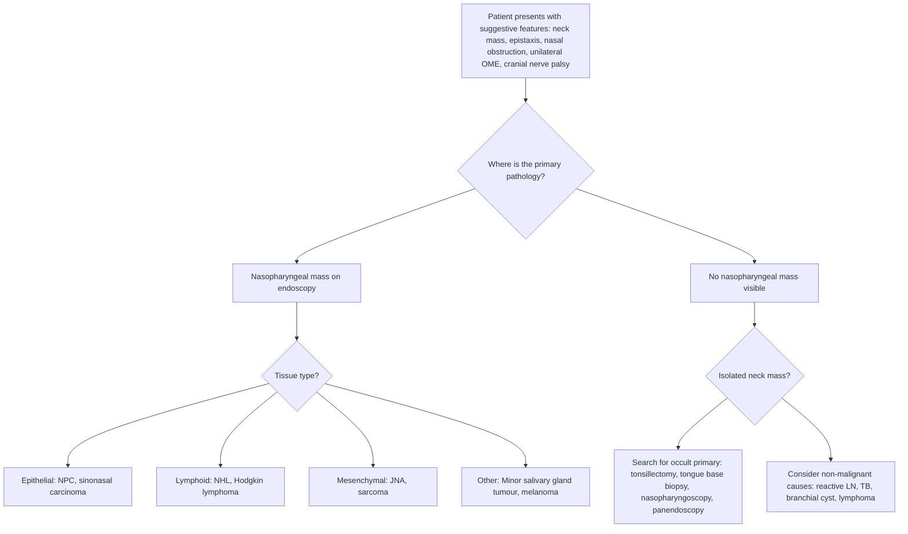

## Differential Diagnosis of Nasopharyngeal Carcinoma

When a patient presents with the clinical features described in the previous section — a combination of nasal symptoms (epistaxis, obstruction), otological symptoms (unilateral middle ear effusion), cranial nerve palsies, and/or a neck mass — you need to think systematically. The differential diagnosis is organized around two overlapping clinical scenarios: **(A) the nasopharyngeal mass itself** and **(B) the presenting symptom** (most commonly a neck mass, since NPC often presents with cervical lymphadenopathy as the first complaint).

The key conceptual framework: NPC can mimic other nasopharyngeal pathology, and conversely, other conditions can mimic NPC. You need to differentiate by tissue of origin, anatomical location, clinical behaviour, and epidemiological context.

---

### Approach to the Differential Diagnosis

---

### A. Differential Diagnosis of a Nasopharyngeal Mass

These are conditions that produce a mass or abnormal tissue in the nasopharynx itself, and therefore must be distinguished from NPC on endoscopy and biopsy.

#### 1. Benign Conditions

| Condition | Key Distinguishing Features | Why it mimics NPC |
|-----------|---------------------------|-------------------|
| **Adenoid hypertrophy** | Common in **children and adolescents**. Lymphoid tissue hypertrophy at the nasopharyngeal roof. Regresses after puberty. Causes bilateral nasal obstruction, mouth breathing, snoring. | Produces a midline nasopharyngeal mass on endoscopy, but the tissue is smooth, symmetric, and lymphoid — not ulcerated or irregular. In adults, persistent or recurrent adenoidal tissue should raise suspicion for lymphoma or NPC |
| **Tornwaldt cyst** (pharyngeal bursa cyst) | Benign cyst arising from a remnant of the notochord in the midline posterior nasopharyngeal wall. Usually incidental finding on MRI. Smooth, well-circumscribed, cystic. | Can appear as a nasopharyngeal mass on imaging, but it is cystic (bright on T2 MRI), midline, and has no solid enhancement. Distinguished by imaging characteristics |
| **Nasopharyngeal retention cyst** | Small benign mucosal cyst from obstructed mucous glands. Very common incidental finding. | Smooth, small, cystic — clinically insignificant but must not be confused with a submucosal NPC |

#### 2. Benign Neoplasms

| Condition | Key Distinguishing Features | Why it mimics NPC |
|-----------|---------------------------|-------------------|
| ***Juvenile nasopharyngeal angiofibroma (JNA)*** [6] | ***Benign but locally aggressive vascular tumour*** of the nasopharynx. Occurs almost exclusively in **adolescent males** (10–25 years). Arises from the sphenopalatine foramen area. Presents with **unilateral nasal obstruction and recurrent profuse epistaxis**. Highly vascular — ***biopsy is contraindicated*** (risk of catastrophic haemorrhage). Diagnosis is clinical + imaging (CT/MRI showing Holman-Miller sign: anterior bowing of the posterior wall of the maxillary sinus). Characteristic intense contrast enhancement on CT/MRI. | Can present with similar nasal and otological symptoms to NPC (epistaxis, nasal obstruction, middle ear effusion from Eustachian tube compression). However, JNA occurs in young males, is highly vascular on imaging, and does NOT produce cranial nerve palsies or cervical lymphadenopathy (it is benign and does not metastasize) |
| **Inverted papilloma** [6] | ***Benign epithelial neoplasm*** of the sinonasal cavity. Arises from the lateral nasal wall (middle meatus typically), but can extend posteriorly into the nasopharynx. Associated with **HPV**. Has a **~10% risk of malignant transformation** to SCC. Unilateral nasal obstruction, epistaxis. | Can present as a unilateral nasal/nasopharyngeal mass with similar symptoms to NPC. Distinguished by its typical lateral nasal wall origin, papillomatous appearance, and the absence of EBV association or cervical lymphadenopathy. Biopsy is definitive |

<Callout title="JNA vs NPC — Critical Distinction" type="error">
Both JNA and NPC can present in the nasopharynx with epistaxis and nasal obstruction. However: JNA = **adolescent male**, **no lymphadenopathy**, **intensely vascular** (do NOT biopsy blindly — catastrophic bleed risk). NPC = **middle-aged adult**, **cervical lymphadenopathy common**, **EBV-associated**, **biopsy is safe and diagnostic**. Always get imaging before biopsy if JNA is suspected.
</Callout>

#### 3. Malignant Neoplasms of the Nasopharynx (Other Than NPC)

| Condition | Key Distinguishing Features | Why it mimics NPC |
|-----------|---------------------------|-------------------|
| ***Non-Hodgkin lymphoma (NHL)*** [6][7] | ***The nasopharynx contains abundant lymphoid tissue (Waldeyer's ring) and is a recognized site for extranodal NHL***. ***Tonsils and tongue base may be the presenting site for a lymphoma*** [7]. Nasopharyngeal lymphoma presents similarly to NPC: nasopharyngeal mass, nasal obstruction, cervical lymphadenopathy. However, lymphoma may cause **diffuse symmetric enlargement** of Waldeyer's ring tissue rather than a unilateral irregular mass. **B symptoms** (fever, night sweats, weight loss > 10%) more prominent. EBV-negative (usually). Diagnosis requires biopsy with **immunohistochemistry and flow cytometry** for subtyping — FNA alone is insufficient. In Hong Kong, **NK/T-cell nasal-type lymphoma** (extranodal NK/T-cell lymphoma) is a specific entity that involves the nasal cavity and nasopharynx, is EBV-associated, and has a destructive midline pattern | Overlapping presentation with NPC: nasopharyngeal mass, cervical lymphadenopathy, B symptoms. Key differentiators: lymphoma tends to be more symmetric, causes diffuse Waldeyer's ring enlargement, EBV status differs by subtype, and histology is lymphoid not epithelial. **Biopsy with adequate tissue for IHC is essential** — ***incisional biopsy or excisional biopsy may be needed since FNA does not provide material for tissue architecture or immunohistochemical analysis*** [8] |
| ***Sinonasal carcinoma*** [6] | Encompasses SCC, adenocarcinoma, sinonasal undifferentiated carcinoma (SNUC), adenoid cystic carcinoma. ***Risk factors include smoking and hard-wood exposure (for adenocarcinoma)*** [6]. Arises from the nasal cavity or paranasal sinuses and can extend posteriorly into the nasopharynx. Presents with ***unilateral obstruction, epistaxis, bleeding, cacosmia, proptosis, diplopia, epiphora, neurological symptoms*** [6]. | Posterior extension of a sinonasal tumour into the nasopharynx can mimic a primary NPC. Distinguished by the primary epicentre being in the nasal cavity/sinuses rather than the fossa of Rosenmüller, different histological subtypes, and different risk factor profile (wood dust, smoking rather than EBV). Imaging (CT/MRI) clarifies the epicentre |
| ***Minor salivary gland tumour*** [7] | ***May present as submucosal masses in the tongue base and soft palate*** [7], and can also arise in the nasopharyngeal mucosa (which contains minor salivary glands). Common malignant types: adenoid cystic carcinoma, mucoepidermoid carcinoma. Adenoid cystic carcinoma is notorious for **perineural invasion** (causes pain, numbness along nerve distribution). | Submucosal nasopharyngeal mass can be mistaken for NPC. However, minor salivary gland tumours have smooth overlying mucosa, are not EBV-associated, and have different histology (glandular, not squamous/undifferentiated). Biopsy is definitive |
| **Malignant melanoma** [6] | Rare. ***Sinonasal melanoma*** is an aggressive tumour. Can arise from melanocytes in the nasal or nasopharyngeal mucosa. Presents with epistaxis, obstruction. May appear pigmented (dark mass) or amelanotic. | Pigmented mucosal lesion is a clue but amelanotic variants can be deceptive. IHC stains (S100, HMB-45, Melan-A) are diagnostic |
| **Olfactory neuroblastoma (esthesioneuroblastoma)** [6] | ***Neural origin tumour*** arising from olfactory neuroepithelium at the cribriform plate. Can extend into nasopharynx. Presents with anosmia, epistaxis, nasal obstruction. | Superior nasal cavity mass extending posteroinferiorly. Distinguished by origin at cribriform plate and neuroendocrine histology |
| **Sarcomas** [6] | ***Mesenchymal malignancy***. Rhabdomyosarcoma is the most common soft tissue sarcoma in children and can arise in the nasopharynx. In adults, consider leiomyosarcoma, fibrosarcoma. | Nasopharyngeal mass in a child → think rhabdomyosarcoma. Biopsy with IHC (desmin, myogenin) is diagnostic |

---

### B. Differential Diagnosis When the Presenting Complaint is a Neck Mass

Since ***the most common initial presenting symptom of NPC is cervical lymphadenopathy*** [2], the differential diagnosis of a neck mass is crucial. The approach is organized by the clinical context.

> ***When a patient presents with a neck mass, a systematic search for the primary malignancy is essential. This includes: right tonsillectomy and frozen section, left tonsillectomy, pharyngoscopy with biopsy of hypopharynx and tongue base, and nasopharyngoscopy and biopsy*** [9].

#### Malignant Causes of Neck Mass

| Condition | Key Distinguishing Features | How to differentiate from NPC |
|-----------|---------------------------|------------------------------|
| ***Metastatic H&N SCC (non-NPC)*** [7] | ***Metastatic H&N cancer is predominantly related to metastatic squamous cell carcinoma arising from the aerodigestive tract*** [7]. Primary sites include oral cavity, oropharynx (HPV-associated), hypopharynx, larynx. Risk factors: ***smoking (primary risk factor), alcohol (synergistic effect), betel nut chewing (oral cavity), HPV (oropharyngeal)*** [4]. Usually presents in **older patients (age > 60)** [7]. Symptoms related to primary site: hoarseness (larynx), dysphagia (hypopharynx), oral ulcer (oral cavity). ***90% of H&N malignancies are SCC (not including nasopharynx and thyroid)*** [4] | NPC is EBV-driven, presents in younger patients (40–60), has non-keratinizing histology, is radiosensitive. Other H&N SCCs are keratinizing, smoking/alcohol-driven, HPV-driven (oropharynx), and primary treatment often includes surgery. Nasopharyngoscopy with biopsy and EBV testing (EBER-ISH, plasma EBV DNA) differentiates |
| ***Oropharyngeal carcinoma*** [7][10] | ***Tonsil is the commonest sub-site*** [10]. ***Histology: SCC or lymphoma/minor salivary gland*** [10]. ***HPV-associated oropharyngeal carcinoma*** in young males with higher lifetime sexual partners [7]. Presents with sore throat, dysphagia, unilateral tonsillar enlargement, referred otalgia. Level II nodal metastasis common. ***FNA can be used for PCR testing — HPV for oropharyngeal SCC, EBV for NPC*** [8] | HPV+ oropharyngeal SCC is p16-positive on IHC, EBV-negative. NPC is EBV-positive, HPV-negative. Different treatment approaches (HPV+ oropharyngeal SCC may qualify for de-intensification) |
| **Thyroid carcinoma** [7] | ***Thyroid nodules confirmed with ultrasound and FNA*** [7]. Presents as anterior neck mass, usually lower neck (Level VI region). Well-differentiated thyroid cancers (papillary, follicular) are common and have excellent prognosis. | Location (anterior/central compartment), thyroid function tests, ultrasound characteristics, and FNA cytology (Bethesda system) distinguish from NPC nodes which are lateral level II |
| ***Lymphoma (Hodgkin and Non-Hodgkin)*** [7] | ***Neck involvement is common in children with Hodgkin lymphoma (80%)*** [7]. ***Presents with fever, night sweats, chills, and diffuse lymphadenopathy*** [7]. Rubbery, non-tender, mobile nodes. May have splenomegaly. Mediastinal lymphadenopathy on CXR (especially Hodgkin). | Lymphoma nodes are typically rubbery and mobile (NPC nodes may be hard and fixed). B symptoms are more prominent in lymphoma. Biopsy (excisional preferred for lymphoma subtyping) with IHC and flow cytometry is essential — FNA is insufficient for lymphoma subtyping [8] |
| **Salivary gland tumour** [7] | ***80% of salivary tumours arise in the parotid gland. Parotid tumours are usually benign (80%). Submandibular gland tumours are usually malignant (50%)*** [7]. Presents as a parotid or submandibular swelling. Facial nerve palsy suggests parotid malignancy. | Location in the salivary gland region (parotid angle, submandibular triangle) is different from typical NPC level II nodes. FNA/core biopsy and imaging distinguish |

#### Benign and Other Causes of Neck Mass

| Condition | Key Features | How to differentiate |
|-----------|-------------|---------------------|
| **Reactive lymphadenopathy** | Common in young patients. Tender, mobile, often bilateral. History of recent URTI. Resolves spontaneously. | Short history, tenderness, resolution over weeks. NPC nodes are painless, firm, progressive |
| **Tuberculous lymphadenitis (scrofula)** | Important differential in Hong Kong (intermediate TB burden). Chronic non-tender cervical lymphadenopathy, often matted. May have systemic symptoms. Posterior triangle (Level V) predilection. Caseous necrosis on FNA/biopsy, AFB positive. | Can mimic NPC nodal disease. FNA showing granulomatous inflammation with caseation, positive AFB/TB PCR distinguishes. Always send FNA for TB culture in HK |
| ***Branchial cleft cyst*** [11] | ***Accounts for 20% of paediatric neck mass*** [11]. ***2nd branchial cleft cyst is most common — presents inferior to angle of mandible and anterior to SCM*** [11]. Usually young patient, presents when cyst becomes infected. Cystic on USS/CT. | Cystic nature on imaging. Young patient. However, cystic metastatic NPC nodes or cystic metastatic HPV+ oropharyngeal SCC can mimic a branchial cyst in an older adult — **any cystic lateral neck mass in a patient > 40 must be presumed malignant until proven otherwise** |
| ***Paraganglioma (Carotid body tumour)*** [7] | ***Neoplasm arising from extra-adrenal chromaffin cells of the parasympathetic paraganglia. Highly vascular and typically benign*** [7]. ***Pulsatile, with bruit. Mobile side-to-side but not up-and-down (Fontaine's sign)*** [7]. Located at the carotid bifurcation. | Pulsatile nature and Fontaine's sign are pathognomonic. Contrast CT/MRA shows intensely enhancing mass at carotid bifurcation ("splaying" of ICA and ECA). Do NOT biopsy (highly vascular) |
| ***Schwannoma*** [7] | ***Neoplastic proliferation of Schwann cells. Commonly arises from the vagus nerve or superior cervical sympathetic chain*** [7]. ***Vagal schwannoma may cause hoarseness; sympathetic chain schwannoma may cause Horner syndrome*** [7]. Slow-growing, well-encapsulated. | Slow growth, specific nerve-related symptoms, well-defined encapsulated mass on MRI (target sign). No EBV association |
| **Lipoma / Benign skin cyst** [7] | ***Soft, ill-defined, slowly enlarging mass*** [7]. Epidermoid cyst, dermoid, pilomatrixoma. | Soft consistency, superficial location, non-fixed |

<Callout title="The 'Cystic Neck Mass' Trap" type="error">
A common clinical pitfall: a cystic lateral neck mass in an adult > 40 years is **NOT** a branchial cleft cyst until proven otherwise. Cystic metastatic nodes from NPC or HPV-positive oropharyngeal SCC are a far more common diagnosis in this age group. Always investigate further with imaging, FNA (for cytology + EBV/HPV PCR), and nasopharyngoscopy.
</Callout>

---

### C. Differential Diagnosis by Presenting Symptom

Sometimes the patient does not present with a neck mass but with one of the other clinical features of NPC. The DDx then shifts:

| Presenting Symptom | DDx (besides NPC) | Rationale |
|--------------------|--------------------|-----------|
| **Unilateral middle ear effusion in an adult** | NPC (must exclude first), nasopharyngeal lymphoma, other nasopharyngeal tumour, idiopathic Eustachian tube dysfunction, radiation fibrosis (post-RT), cleft palate (rare in adults) | Any mass obstructing the Eustachian tube can cause effusion. In endemic areas, NPC is the most important cause to rule out |
| **Unilateral epistaxis + nasal obstruction** | NPC, sinonasal carcinoma, inverted papilloma, JNA (adolescent males), nasal polyps, foreign body, hereditary haemorrhagic telangiectasia. ***Red flags for sinonasal neoplasm: unilateral obstruction, epistaxis, bleeding, cacosmia, proptosis, diplopia, epiphora, neurological symptoms*** [6] | Bilateral symptoms are more likely benign (polyps, rhinitis). ***Unilateral nasal symptoms are a red flag for neoplasm*** [6] |
| **Cranial nerve palsy (especially CN V, VI)** | NPC (skull base invasion), skull base meningioma, chordoma (clivus), nasopharyngeal lymphoma, perineural spread of adenoid cystic carcinoma, cavernous sinus thrombosis, pituitary apoplexy, Tolosa-Hunt syndrome | Skull base imaging (MRI with gadolinium) is essential. NPC is distinguished by nasopharyngeal mass + EBV positivity |
| **Bilateral cervical lymphadenopathy** | NPC (midline tumour → bilateral drainage), lymphoma, TB, sarcoidosis, HIV, metastatic disease from other primaries | NPC is one of the few H&N cancers that commonly causes bilateral cervical nodes because it is a midline structure |

---

### D. The Systematic Search for an Occult Primary

When a patient presents with a metastatic cervical lymph node and no obvious primary tumour on initial examination, a **systematic search protocol** is essential:

***The search for the primary malignancy includes*** [9]:

1. ***Nasopharyngoscopy and biopsy*** — to look for NPC [9]
2. ***Right tonsillectomy and frozen section*** [9] — HPV+ oropharyngeal SCC often presents as a tiny or submucosal tonsillar primary
3. ***Left tonsillectomy*** [9]
4. ***Pharyngoscopy with biopsy of hypopharynx and tongue base*** [9]
5. ***Panendoscopy*** (direct laryngoscopy, bronchoscopy, OGD) [3] — to exclude synchronous primary

Additionally:
- **FNA of the neck node** with cytology, ***EBV PCR (for NPC)*** and ***HPV PCR (for oropharyngeal SCC)*** [8]
- **Plasma EBV DNA** — if elevated, strongly points to NPC as the occult primary
- **PET-CT** — to identify the primary site and detect distant metastases

> **High Yield**: The FNA of a cervical metastatic node can direct you to the primary: **EBV-positive → think NPC**; **HPV/p16-positive → think oropharyngeal SCC**. This avoids unnecessary exploration and guides the endoscopic search.

---

### Summary Table: Key Differentiators

| Feature | NPC | NHL (nasopharyngeal) | JNA | Sinonasal carcinoma | HPV+ oropharyngeal SCC |
|---------|-----|---------------------|-----|--------------------|-----------------------|
| **Age/Sex** | 40–60, M > F | Any age | ***Adolescent male*** | Older adults | Younger males (30–50) |
| **EBV** | Positive (virtually 100% endemic) | Variable (NK/T-cell = EBV+) | Negative | Negative | Negative |
| **HPV** | Negative | Negative | Negative | Negative | ***Positive (HPV 16/18)*** |
| **Biopsy safe?** | Yes | Yes (need adequate tissue for IHC) | ***NO — risk of massive haemorrhage*** | Yes | Yes |
| **Cervical LN** | Very common, bilateral | Common | Absent | Less common | Common (cystic nodes) |
| **Radiosensitive** | ***Very radiosensitive*** | Variable by subtype | Not radiosensitive (surgery) | Moderate | Very radiosensitive |
| **Key investigation** | EBER-ISH, plasma EBV DNA | IHC, flow cytometry | CT/MRI angiography | CT for bone, MRI for soft tissue | p16 IHC, HPV ISH |

---

<Callout title="High Yield Summary — Differential Diagnosis of NPC">

**Nasopharyngeal mass DDx**: NPC (most common malignancy), NHL (especially NK/T-cell lymphoma in HK), JNA (adolescent males — DO NOT biopsy), sinonasal carcinoma extending posteriorly, minor salivary gland tumour, melanoma, rhabdomyosarcoma (children).

**Neck mass DDx**: Metastatic NPC, other metastatic H&N SCC (oropharyngeal HPV+, hypopharyngeal, laryngeal), lymphoma (Hodgkin/NHL), thyroid carcinoma, TB lymphadenitis, branchial cleft cyst (beware in adults > 40 — likely cystic met), paraganglioma, schwannoma.

**Key differentiating tools**: FNA with EBV PCR (NPC) vs HPV PCR (oropharyngeal SCC); EBER-ISH on biopsy; plasma EBV DNA; p16 IHC; imaging characteristics (JNA = intensely vascular, do not biopsy).

**Search for occult primary**: Nasopharyngoscopy + bilateral tonsillectomy + tongue base/hypopharynx biopsy + panendoscopy. FNA of node with EBV/HPV PCR guides the search.

**Red flag**: Any unilateral nasal symptom or adult unilateral middle ear effusion → exclude nasopharyngeal neoplasm.

</Callout>

---

<ActiveRecallQuiz
  title="Active Recall - Differential Diagnosis of NPC"
  items={[
    {
      question: "A 14-year-old male presents with recurrent profuse unilateral epistaxis and nasal obstruction. Nasopharyngoscopy reveals a highly vascular mass. What is the most likely diagnosis and what critical mistake must you avoid?",
      markscheme: "Most likely diagnosis: Juvenile nasopharyngeal angiofibroma (JNA). Critical mistake to avoid: Biopsy of the mass, which risks catastrophic haemorrhage. Diagnosis is clinical plus imaging (CT/MRI showing intense contrast enhancement and Holman-Miller sign). Occurs almost exclusively in adolescent males. Benign but locally aggressive."
    },
    {
      question: "A 55-year-old man presents with a cystic lateral neck mass at level II. His GP suspects a branchial cleft cyst. What is the key concern and how should this be investigated?",
      markscheme: "Key concern: In adults over 40, a cystic lateral neck mass is more likely a cystic metastatic lymph node (from NPC or HPV-positive oropharyngeal SCC) than a branchial cleft cyst. Investigation: FNA of the cyst with cytology and PCR for EBV (NPC) and HPV (oropharyngeal SCC), nasopharyngoscopy to examine the nasopharynx, plasma EBV DNA, and if needed, panendoscopy with bilateral tonsillectomy to find the occult primary."
    },
    {
      question: "What is the systematic protocol for searching for an occult primary when a patient presents with metastatic cervical lymphadenopathy and no obvious primary?",
      markscheme: "Systematic search includes: (1) Nasopharyngoscopy and biopsy, (2) Right tonsillectomy with frozen section, (3) Left tonsillectomy, (4) Pharyngoscopy with biopsy of hypopharynx and tongue base, (5) Panendoscopy (direct laryngoscopy, bronchoscopy, OGD). Also: FNA of neck node with EBV and HPV PCR, plasma EBV DNA, and PET-CT to identify primary and distant metastases."
    },
    {
      question: "How do you differentiate nasopharyngeal lymphoma from NPC on biopsy?",
      markscheme: "NPC is an epithelial malignancy (positive for cytokeratins on IHC, EBER-ISH positive for EBV). Lymphoma is a lymphoid malignancy (positive for lymphoid markers such as CD20 for B-cell or CD3/CD56 for NK/T-cell on IHC, may be EBV-positive in NK/T-cell subtype). FNA alone is insufficient for lymphoma subtyping — need adequate tissue for immunohistochemistry and flow cytometry. Excisional or incisional biopsy may be required for lymphoma."
    },
    {
      question: "Name three conditions other than NPC that can cause unilateral middle ear effusion in an adult and explain why NPC must be excluded first.",
      markscheme: "Other causes: (1) Nasopharyngeal lymphoma obstructing Eustachian tube, (2) Idiopathic Eustachian tube dysfunction, (3) Post-radiation fibrosis of the nasopharynx. NPC must be excluded first because it is common in endemic areas like Hong Kong, presents insidiously, and unilateral OME may be the earliest sign of a curable malignancy. Nasopharyngoscopy is mandatory."
    }
  ]}
/>

## References

[1] Lecture slides: GC 215. Common nasal conditions and nasopharyngeal carcinoma (1).pdf (p47–48)
[2] Senior notes: felixlai.md (felix:357, 364) — Nasopharyngeal cancer (NPC)
[3] Senior notes: felixlai.md (felix:342) — Head and neck cancer overview, panendoscopy
[4] Lecture slides: GC 219. Infections and tumours in pharynx and oral cavity.pdf (p40–41)
[6] Lecture slides: GC 215. Common nasal conditions and nasopharyngeal carcinoma (1).pdf (p41–44)
[7] Senior notes: felixlai.md (felix:299, 369) — Differential diagnosis of neck mass, oropharyngeal carcinoma etiology
[8] Senior notes: felixlai.md (felix:303) — Pathological tests (FNA, biopsy)
[9] Lecture slides: GC 218. I have a swelling in the neck Neck mass.pdf (p9)
[10] Lecture slides: GC 219. Infections and tumours in pharynx and oral cavity.pdf (p36)
[11] Senior notes: felixlai.md (felix:295) — Branchial cleft cyst
