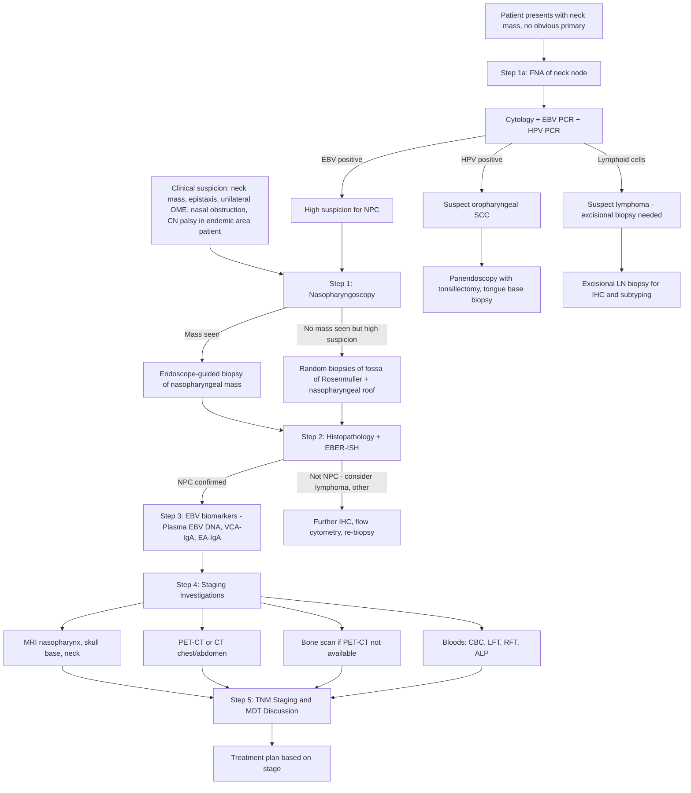

## Diagnosis of Nasopharyngeal Carcinoma

### Diagnostic Principles — Why Is This Approach Used?

NPC diagnosis rests on three pillars: **(1) tissue diagnosis** (histopathological confirmation via endoscope-guided biopsy), **(2) EBV biomarkers** (serology and plasma EBV DNA), and **(3) imaging** (for staging and assessment of disease extent). Let me walk you through each in a logical, clinical order — the way you would actually work up a patient in Hong Kong.

The core concept: **you cannot stage what you haven't diagnosed, and you cannot treat what you haven't staged**. The diagnostic algorithm therefore follows: suspicion → endoscopy with biopsy → confirm histology and EBV status → stage with imaging → plan treatment.

---

### 1. Diagnostic Criteria

There is no single "diagnostic criteria checklist" for NPC like there is for, say, rheumatoid arthritis. Instead, the **definitive diagnosis requires histopathological confirmation** from a biopsy of the primary nasopharyngeal tumour. However, the clinical pathway integrates several elements:

| Component | Requirement | Rationale |
|-----------|-------------|-----------|
| **Histopathological confirmation** | ***Endoscope-guided biopsy of the primary tumour*** [2] | This is the gold standard. Tissue provides WHO classification, differentiation status, and material for EBER in situ hybridization |
| **EBV confirmation** | EBER-ISH positive on tumour tissue (for non-keratinizing NPC in endemic areas) | Virtually 100% of non-keratinizing NPC is EBER-positive. Confirms EBV causation and distinguishes from other nasopharyngeal malignancies |
| **Supporting biomarkers** | ***Plasma EBV DNA*** (quantitative PCR) [2]; ***EBV VCA-IgA and EA-IgA*** serology [2] | Supports diagnosis, aids staging/prognostication, and provides baseline for monitoring |
| **Staging investigations** | MRI nasopharynx/skull base/neck + PET-CT or CT chest/abdomen + bone scan | Determines TNM stage which dictates treatment approach |

<Callout title="Key Principle">
***Definitive diagnosis is made by endoscope-guided biopsy of the primary tumour*** [2]. You must see the tumour with an endoscope and biopsy it. ***Incisional nodal biopsy or nodal dissection should be avoided since it will negatively impact subsequent treatment*** [2] — because NPC is treated primarily with radiation-based therapy, not surgery. Violating the neck surgically can compromise radiation fields, cause scarring that alters lymphatic drainage, and seed tumour cells.
</Callout>

---

### 2. Diagnostic Algorithm

The following algorithm represents the clinical pathway from initial suspicion to definitive staging:

---

### 3. Investigation Modalities — Detailed Breakdown

#### A. Endoscopic Examination

##### ***Nasopharyngoscopy*** [2]

- **What it is**: Flexible fibreoptic nasopharyngoscopy (passed through the nose) or rigid endoscopy. Allows direct visualization of the nasopharynx including the fossa of Rosenmüller, torus tubarius, nasopharyngeal roof, and posterior choanae.
- **Why it is the first investigation**: The nasopharynx is a ***clinically occult site*** [2] — you cannot see it with the naked eye. Indirect mirror examination (posterior rhinoscopy) is possible but suboptimal. Flexible endoscopy is the standard of care.
- **Key findings**:
  - **Exophytic mass** arising from the fossa of Rosenmüller — irregular, friable, may be ulcerated
  - **Submucosal bulge** — NPC can grow submucosally, making the mucosa look deceptively normal with just a bulge
  - **Mucosal irregularity or asymmetry** — even subtle asymmetry of the fossa of Rosenmüller warrants biopsy
  - **Blood or crusting** at the tumour surface
- **Biopsy**: ***Endoscope-guided biopsy of the primary tumour provides definitive diagnosis*** [2]. Multiple biopsies should be taken (at least 3–4 pieces). If no obvious mass is seen but clinical suspicion is high (e.g., EBV DNA positive, cervical metastatic node), **random biopsies** of both fossae of Rosenmüller and the nasopharyngeal roof should be performed.

##### ***Panendoscopy*** [3][12]

- ***Panendoscopy includes direct laryngoscopy, bronchoscopy, and OGD*** [3]
- ***10% risk of synchronous/metachronous tumour due to field cancerization*** [12]
- ***Staging examination is recommended at the initial evaluation of all patients with primary cancers of the upper aerodigestive tract*** [3]
- While field cancerization is more relevant for smoking/alcohol-driven H&N cancers than for EBV-driven NPC, panendoscopy is still part of the standard workup to exclude a second primary

<Callout title="Why not just biopsy the neck node?" type="error">
Students sometimes ask: "If the patient has a big neck node, why not just excise it?" The answer: ***incisional nodal biopsy or nodal dissection should be avoided since it will negatively impact subsequent treatment*** [2]. NPC is treated with radiotherapy ± chemotherapy. Surgical violation of the neck can cause scarring, alter lymphatic drainage patterns, compromise radiation planning, and potentially seed tumour cells into the surgical bed. Instead, do **FNA of the neck node** (for cytology + EBV PCR) and **biopsy the primary** in the nasopharynx.
</Callout>

---

#### B. Laboratory Investigations

##### i. ***EBV DNA Level (Plasma Cell-Free EBV DNA)*** [2]

- **What it is**: Quantitative real-time PCR measuring circulating EBV DNA fragments in plasma. These DNA fragments are released from NPC tumour cells undergoing apoptosis and necrosis.
- **Why it is useful**: This is arguably the most important single biomarker in NPC management. It serves **four roles**:

| Role | Explanation |
|------|-------------|
| **Screening** | Hong Kong studies (Prof Dennis Lo, CUHK) demonstrated that a single plasma EBV DNA test can screen asymptomatic individuals for early-stage NPC. A positive result triggers nasopharyngoscopy and MRI. Significantly shifts stage distribution toward earlier detection |
| ***Diagnostic and staging evaluation for prognosis*** [2] | ***Pre-treatment plasma EBV DNA levels correlate with outcomes*** [2] — higher levels = larger tumour burden = worse stage = worse prognosis |
| ***Treatment response*** [2] | ***Post-treatment plasma EBV DNA levels evaluate treatment response and detection of recurrence*** [2]. After successful treatment, EBV DNA should become undetectable. Persistent or rising levels after treatment indicate residual/recurrent disease |
| **Surveillance** | Serial measurements during follow-up detect relapse earlier than clinical symptoms or imaging |

- **Key findings and interpretation**:
  - **Detectable pre-treatment level** → supports NPC diagnosis and indicates active disease
  - **Level correlates with tumour stage** → higher copy number = higher stage
  - **Undetectable post-treatment** → good response
  - **Detectable/rising post-treatment** → relapse (PET-CT needed to locate recurrence)

> **High Yield**: Plasma EBV DNA is both the most sensitive and most specific circulating biomarker for NPC in endemic populations. It has largely superseded EBV serology for clinical use.

##### ii. ***EBV Serology*** [2]

- ***Sustained rise in IgA to both viral capsid antigen (VCA) and early antigen (EA)*** [2]
  - ***↑ EBV VCA-IgA and ↑ EBV EA-IgA*** [2]
- **Why IgA?** The nasopharynx is a mucosal surface. The dominant immunoglobulin at mucosal surfaces is IgA (secretory immune system). NPC triggers a mucosal immune response → IgA class antibodies against EBV antigens are produced locally and enter the bloodstream.
- ***EBV-specific serological screening has low specificity for NPC*** [2] — because > 90% of the population is EBV-seropositive (IgG), and even VCA-IgA can be transiently elevated during EBV reactivation in healthy individuals. Hence, serology has **high sensitivity but low specificity** for NPC, leading to false positives.
- ***Elevated titre may precede diagnosis of NPC for a period of up to 10 years*** [2] — this long lead time supports the concept of using serology for population screening, but the low specificity is a limitation.
- **Practical role**: Serology is used as a population screening tool (especially VCA-IgA combined with EA-IgA), but plasma EBV DNA is now preferred for its superior specificity.

##### iii. ***CBC with Differentials*** [2]

- **Why**: Baseline haematological assessment. Can reveal anaemia of chronic disease (advanced malignancy), cytopenias if bone marrow infiltrated (rare, advanced M1 disease), or lymphocytosis if considering lymphoma differential.

##### iv. ***Serum ALP Level*** [2]

- ***↑ ALP level in bone metastasis*** [2]
- **Why**: Bone is the most common site of distant metastasis in NPC (~75%). Osteoblastic or mixed bone metastases increase osteoblast activity → elevated alkaline phosphatase (bone isoform). However, ALP is not specific — can be elevated by liver disease, other bone pathology, or even normal growth in adolescents. It serves as a screening blood test to raise suspicion for bone metastasis, prompting further imaging.

##### v. Other Bloods

| Test | Rationale |
|------|-----------|
| **Liver function tests (LFT)** | Baseline for chemotherapy planning; elevated transaminases/GGT may suggest liver metastasis |
| **Renal function tests (RFT)** | Baseline before cisplatin-based chemotherapy (cisplatin is nephrotoxic) |
| **Electrolytes** | Pre-chemotherapy baseline |
| **Lactate dehydrogenase (LDH)** | Non-specific tumour marker; elevated in high tumour burden |

---

#### C. Pathological Tests

##### i. ***Fine Needle Aspiration (FNA)*** [8]

- **When used**: When the patient presents with a ***neck mass*** and the primary site is not yet known, FNA of the cervical lymph node is the initial pathological investigation.
- ***Aspirate is used for cytological analysis, PCR testing for virus*** [8]:
  - ***EBV for nasopharyngeal carcinoma (NPC)*** [8]
  - ***HPV for oropharyngeal squamous cell carcinoma*** [8]
- ***FNA does NOT provide material for tissue architecture or immunohistochemical analysis*** [8] — this is a critical limitation. FNA gives you individual cells (cytology), not tissue blocks. You cannot assess tumour architecture, perform comprehensive IHC panels, or do flow cytometry on FNA alone. This matters particularly when lymphoma is in the differential.
- **Interpretation**:
  - FNA showing **malignant squamous/undifferentiated epithelial cells + EBV PCR positive** → strongly suggests NPC → proceed to nasopharyngoscopy and biopsy of primary
  - FNA showing **lymphoid cells** → suspect lymphoma → ***excisional biopsy needed for subtyping*** [8]

##### ii. ***Endoscope-Guided Biopsy of Primary Tumour*** [2]

- **Gold standard for definitive diagnosis**
- Tissue submitted for:
  - **H&E histopathology**: Determines WHO type (non-keratinizing undifferentiated/differentiated, keratinizing SCC, basaloid SCC)
  - **EBER in situ hybridization (EBER-ISH)**: Detects EBV-encoded small RNAs in tumour cell nuclei. This is the **gold standard** for demonstrating EBV in tumour tissue. Positive nuclear staining confirms EBV association.
  - **Immunohistochemistry (IHC)**: Cytokeratin positivity (AE1/AE3, CK5/6) confirms epithelial origin — distinguishes NPC from lymphoma. p63 often positive. ***For lymphoepithelial carcinoma of salivary glands: histology is exactly like NPC, EBV-related, tumour cells EBER-positive*** [13]
  - **p16 IHC / HPV ISH**: If keratinizing SCC pattern and clinical suspicion of oropharyngeal origin (NPC vs extension from oropharynx)

##### iii. Nodal Biopsy — When It IS Appropriate

- ***Incisional nodal biopsy or nodal dissection should be avoided*** [2] in the setting of suspected NPC
- However, biopsy of a cervical node IS appropriate when:
  - **Lymphoma is suspected** (FNA inconclusive) — ***excisional biopsy is considered when FNA or core needle biopsy is positive for lymphoma where additional tissue is required for subtyping*** [8]
  - The primary site genuinely cannot be identified despite full workup

---

#### D. Imaging Investigations

##### i. ***MRI of Nasopharynx, Skull Base, and Neck*** [2]

- **Why MRI and not CT for the primary?**: MRI provides ***optimal visualization of soft-tissue infiltration of the tumour*** [14]. The nasopharynx is surrounded by critical soft tissue structures (parapharyngeal fat, muscles, cavernous sinus, brain). MRI's superior soft tissue contrast allows precise delineation of:
  - Extent of primary tumour (T staging)
  - Parapharyngeal space invasion
  - Skull base involvement (cortical bone erosion, marrow infiltration)
  - Cavernous sinus invasion
  - Intracranial extension
  - Retropharyngeal and cervical lymph node metastases (N staging)
  - Perineural spread (enhancement along CN V, seen as thickening and enhancement of the nerve on post-gadolinium fat-suppressed T1)

- **Key MRI sequences and findings**:

| Sequence | Finding in NPC |
|----------|----------------|
| **T1-weighted** | Tumour is isointense to slightly hypointense relative to muscle. Loss of normal parapharyngeal fat plane (bright on T1) indicates lateral invasion |
| **T2-weighted** | Tumour is intermediate-to-high signal. Helps delineate tumour from surrounding structures |
| **Post-gadolinium T1 with fat suppression** | Tumour enhances avidly. This is the most important sequence for delineating tumour extent, skull base invasion, cavernous sinus involvement, and perineural spread |
| **DWI (Diffusion-Weighted Imaging)** | Restricted diffusion (bright on DWI, dark on ADC map) in tumour — reflects high cellularity. Useful for distinguishing tumour from post-treatment changes |

- **Assessment of locoregional disease extent** [2] — MRI is essential for accurate T staging

##### ii. ***CT Scan*** [2][12]

- ***Useful to detect bony invasion*** [14] — CT has superior spatial resolution for cortical bone compared to MRI
- ***Detection of cervical lymph node metastasis*** [14]
- ***CT thorax and abdomen to assess for distant metastasis*** [14]
- CT of the nasopharynx/skull base is complementary to MRI (bone windows show cortical erosion at skull base, pterygoid plates, etc.)
- **Contrast-enhanced CT neck**: Shows enhancing primary tumour and lymph nodes. Necrotic nodes (central low-attenuation with rim enhancement) suggest metastatic disease.

##### iii. ***PET-CT Scan*** [2][12]

- ***Uses 18-fluorodeoxyglucose (18F-FDG) as tracer*** [2] (note: the senior notes say "17-FDG" which is a typo — the correct isotope is **18F-FDG**)
- **How it works**: 18F-FDG is a glucose analogue taken up by metabolically active cells. Cancer cells have upregulated glucose transporters (GLUT-1) and hexokinase → trap FDG intracellularly → appear as "hot spots" on PET
- ***Superior ability to detect lymph node and bone metastasis*** [2]
- **Key roles in NPC**:

| Role | Explanation |
|------|-------------|
| **Distant metastasis detection (M staging)** | PET-CT is the most sensitive single investigation for detecting distant metastases (bone, liver, lung, distant nodes). This is its primary role in NPC staging |
| **Nodal assessment** | Can detect metabolically active nodes that appear normal in size on CT/MRI |
| **Identifying occult primary** | When a patient presents with a metastatic cervical node and no visible primary on endoscopy, PET-CT can localize the primary |
| **Treatment response assessment** | Post-treatment PET-CT can distinguish residual active tumour from post-radiation fibrosis/inflammation (though timing is important — usually done ≥ 12 weeks post-treatment to reduce false positives) |
| **Recurrence detection** | Complements plasma EBV DNA for localizing recurrent disease |

- **Interpretation**:
  - **SUVmax** (Standardised Uptake Value) > 2.5 generally suggests malignancy
  - False positives: infection, inflammation, granulomatous disease (TB — important in HK)
  - False negatives: small lesions ( < 1 cm), low-grade tumours (NPC is usually FDG-avid, so this is rarely an issue)

##### iv. ***CXR*** [2]

- ***Evaluate for lung metastasis*** [2]
- **Why**: Simple, quick, cheap. Detects pulmonary metastases (nodules, pleural effusion). However, sensitivity is limited compared to CT chest. Often used as initial screen; if suspicious or if PET-CT is not available, CT chest is performed.

##### v. ***Bone Scan (99mTc-MDP Bone Scintigraphy)*** [2]

- ***Evaluate for bone metastasis*** [2]
- **How it works**: 99mTc-MDP (methylene diphosphonate) is a bone-seeking radiopharmaceutical that accumulates in areas of increased osteoblastic activity. Metastatic bone disease triggers a reparative osteoblastic response → increased tracer uptake → "hot spots"
- **Why used**: Bone is the most common site of distant metastasis in NPC (75%). Bone scan surveys the entire skeleton in one study.
- **Limitations**: Not specific — also picks up fractures, degenerative disease, Paget's disease. Purely lytic metastases (minimal osteoblastic response) may be missed. Largely being replaced by PET-CT which is more sensitive and specific.

##### vi. ***Ultrasound Neck ± FNAC*** [12][15]

- ***Ultrasound neck +/- FNAC*** [12] — used for assessment of cervical lymph nodes
- **Role in NPC**: Can assess size, morphology, and vascularity of cervical lymph nodes. Ultrasound features suggesting malignancy: rounded shape (L/S ratio < 2), loss of fatty hilum, irregular cortical thickening, peripheral/chaotic vascularity, necrosis. Can guide FNA of suspicious or equivocal nodes.

---

### 4. Investigation Summary Table

| Investigation | Purpose | Key Findings in NPC |
|---------------|---------|---------------------|
| ***Nasopharyngoscopy + biopsy*** | Definitive tissue diagnosis | Mass at fossa of Rosenmüller; biopsy → non-keratinizing undifferentiated carcinoma, EBER-ISH positive |
| ***Plasma EBV DNA*** | Diagnosis, staging, prognosis, monitoring | Detectable and quantifiable; correlates with tumour burden; undetectable post-treatment = good response |
| ***EBV VCA-IgA, EA-IgA*** | Screening, supportive diagnosis | Elevated; low specificity; may precede diagnosis by up to 10 years |
| ***CBC, ALP, LFT, RFT*** | Baseline bloods, metastasis screening | ↑ ALP suggests bone mets; ↑ LFT suggests liver mets; baseline for chemotherapy |
| ***FNA of neck node*** | Initial pathological assessment of neck mass | Malignant cells + EBV PCR positive → suspect NPC; guides search for primary |
| ***MRI nasopharynx/skull base/neck*** | T and N staging, soft tissue assessment | Tumour extent, parapharyngeal invasion, skull base erosion, cavernous sinus involvement, retropharyngeal and cervical nodes |
| ***CT*** | Bony invasion assessment, distant metastasis | Skull base bone erosion; CT chest/abdomen for lung/liver mets |
| ***PET-CT*** | M staging, occult primary detection | FDG-avid primary and metastatic sites; superior for bone and distant nodal mets |
| ***CXR*** | Lung metastasis screening | Pulmonary nodules, pleural effusion |
| ***Bone scan*** | Bone metastasis screening | Hot spots at common sites (spine, pelvis, ribs) |
| ***Panendoscopy*** | Exclude synchronous primary | Direct laryngoscopy + bronchoscopy + OGD |

---

### 5. Staging Investigations — Putting It Together

Once NPC is histologically confirmed, the staging workup determines the TNM stage which dictates treatment:

| Stage Component | Investigation | What You're Looking For |
|-----------------|---------------|------------------------|
| **T stage** | MRI nasopharynx and skull base | Primary tumour extent: confined to nasopharynx (T1), parapharyngeal extension (T2), skull base/sinuses (T3), intracranial/CN/orbit (T4) |
| **N stage** | MRI neck + PET-CT | Retropharyngeal nodes, unilateral vs bilateral cervical nodes, size relative to 6 cm, position relative to caudal border of cricoid |
| **M stage** | PET-CT (or CT chest/abdomen + bone scan) | Bone, liver, lung, distant nodal metastases |
| **Biomarker** | Plasma EBV DNA (quantitative) | Tumour burden, prognostic stratification |

> ***Management is based on TNM staging*** [12][16]:
> - ***Early stage (I, II): single modality of treatment*** [16]
> - ***Late stage (III, IV): combined modality of treatment*** [16]
> - ***NPC: chemo-irradiation in late stage*** [16] — this is the key exception to the general H&N cancer rule where surgery is the primary treatment for late-stage oral cavity/thyroid cancers

---

### 6. Screening for NPC

***The rationale for screening*** [2]:
- ***High rate of NPC in specific geographical regions and among certain families*** [2]
- ***High rate of cure for early-stage NPC*** [2] — 5-year overall survival for Stage I NPC is > 90%; for Stage IVB it drops to ~50–60%. Early detection dramatically improves outcomes.

***Two practical ways to screen for EBV*** [2]:
1. ***Immunoglobulin A viral capsid antigen (EBV VCA-IgA)*** [2] — traditional screening method, but limited specificity
2. ***Plasma EBV DNA by PCR*** [2] — newer, more specific approach

**The Hong Kong NPC Screening Study (2017, NEJM — Prof Dennis Lo, CUHK)**:
- Prospective screening of > 20,000 asymptomatic men aged 40–62 using plasma EBV DNA
- Two-time-point approach: initial test → if positive, repeat in 4 weeks → if persistently positive, nasopharyngoscopy + MRI
- Results: detected NPC at significantly earlier stages (71% Stage I/II in screened group vs ~20% in symptom-detected population)
- Landmark study supporting population-based screening in high-risk populations

<Callout title="Screening Algorithm" type="idea">
**Step 1**: Plasma EBV DNA (quantitative PCR) → **Step 2**: If positive, repeat in 4 weeks → **Step 3**: If persistently positive, nasopharyngoscopy + MRI nasopharynx → **Step 4**: Biopsy if mass seen; random biopsy + close surveillance if no mass. This two-time-point approach minimizes false positives from transient EBV reactivation.
</Callout>

---

### 7. Red Flags for Early Referral

***EARLY REFERRAL to ENT surgeons when suspecting malignancy*** [17]:
- ***Persistent 2–4 weeks after conservative/empirical treatment*** [17]
- ***Clinically suspicious: irregular, induration, > 2 cm, associated cervical LN enlargement*** [17]

In the context of NPC specifically:
- Any adult with **unilateral serous otitis media** in an endemic area → scope the nasopharynx
- Any **neck mass** persistent > 2 weeks without obvious infective cause → investigate
- Any **unilateral nasal symptoms** (obstruction, epistaxis) in an adult → exclude neoplasm
- Any **cranial nerve palsy** without clear explanation → image the skull base

---

<Callout title="High Yield Summary — Diagnosis of NPC">

**Definitive diagnosis**: Endoscope-guided biopsy of the nasopharyngeal primary → histopathology (WHO classification) + EBER-ISH (EBV confirmation).

**Do NOT excise/biopsy neck nodes** — NPC is treated with RT/CRT, not surgery. Nodal surgery compromises treatment.

**Key biomarkers**:
- **Plasma EBV DNA** (quantitative PCR) — diagnosis, staging, prognosis, treatment monitoring, recurrence detection. The single most important biomarker.
- **EBV VCA-IgA and EA-IgA** — screening use but low specificity. Titre may precede diagnosis by up to 10 years.
- **ALP** — elevated suggests bone metastasis.

**FNA of neck node**: Cytology + EBV PCR (for NPC) / HPV PCR (for oropharyngeal SCC). Guides search for primary. Does NOT provide tissue architecture.

**Imaging**:
- **MRI** = primary modality for T and N staging (superior soft tissue contrast).
- **PET-CT** = primary modality for M staging (superior for bone and distant metastases).
- **CT** = complementary for bone erosion; CT chest/abdomen if PET-CT unavailable.
- **Bone scan / CXR** = adjuncts if PET-CT unavailable.

**Panendoscopy** = exclude synchronous primary (10% risk from field cancerization).

**Screening**: Plasma EBV DNA (two-time-point approach) in high-risk populations → nasopharyngoscopy + MRI if persistently positive.

</Callout>

---

<ActiveRecallQuiz
  title="Active Recall - Diagnosis of Nasopharyngeal Carcinoma"
  items={[
    {
      question: "What is the definitive diagnostic investigation for NPC and what specific tests are performed on the tissue obtained?",
      markscheme: "Endoscope-guided biopsy of the nasopharyngeal primary tumour. Tests on tissue: (1) H&E histopathology for WHO classification (non-keratinizing undifferentiated/differentiated, keratinizing SCC, basaloid SCC), (2) EBER in situ hybridization to confirm EBV in tumour nuclei (gold standard for EBV detection in tissue), (3) IHC for cytokeratins (confirms epithelial origin, distinguishes from lymphoma)."
    },
    {
      question: "Why should incisional nodal biopsy or nodal dissection be avoided in suspected NPC? What should be done instead?",
      markscheme: "Avoided because NPC is treated with radiotherapy or chemoradiotherapy, not surgery. Surgical violation of the neck compromises subsequent radiation fields, causes scarring that alters lymphatic drainage, and risks tumour seeding. Instead: perform FNA of the neck node for cytology and EBV/HPV PCR, then biopsy the primary tumour in the nasopharynx via endoscopy."
    },
    {
      question: "List four clinical roles of plasma EBV DNA in NPC management.",
      markscheme: "(1) Population screening (two-time-point approach in high-risk groups), (2) Diagnostic support and staging/prognostic evaluation (pre-treatment levels correlate with tumour burden and outcomes), (3) Treatment response monitoring (should become undetectable after successful treatment), (4) Surveillance for recurrence detection (rising levels indicate relapse). It is the most important single biomarker in NPC."
    },
    {
      question: "Why is MRI preferred over CT for local staging of NPC? What is CT better for?",
      markscheme: "MRI is preferred because it provides superior soft tissue contrast, allowing precise delineation of tumour extent in the parapharyngeal space, skull base marrow infiltration, cavernous sinus invasion, perineural spread, and retropharyngeal nodes. CT is better for assessing cortical bone erosion (superior spatial resolution for bone) and is used for CT chest/abdomen for distant metastasis assessment."
    },
    {
      question: "A 50-year-old man undergoes FNA of a level II neck node. Cytology shows undifferentiated malignant cells. EBV PCR is positive. HPV PCR is negative. What is the most likely diagnosis, and what is the next step?",
      markscheme: "Most likely diagnosis: metastatic nasopharyngeal carcinoma (non-keratinizing undifferentiated subtype). EBV-positive FNA from a cervical node in an endemic-area patient is highly suggestive of NPC. Next step: nasopharyngoscopy with endoscope-guided biopsy of the fossa of Rosenmuller (even if the mucosa appears normal, random biopsies should be taken). Also obtain plasma EBV DNA level and arrange MRI nasopharynx/skull base/neck for staging."
    },
    {
      question: "What is the two-time-point plasma EBV DNA screening approach for NPC and why is it designed this way?",
      markscheme: "Step 1: Initial plasma EBV DNA test. Step 2: If positive, repeat in 4 weeks. Step 3: If persistently positive, proceed to nasopharyngoscopy plus MRI. The two-time-point design minimizes false positives because transient EBV reactivation in healthy individuals can cause a single positive result that becomes negative on repeat testing. Only persistent positivity suggests active NPC. This approach was validated in the Hong Kong NPC Screening Study showing significant stage-shifting to earlier detection."
    }
  ]}
/>

## References

[2] Senior notes: felixlai.md (felix:357, 364, 366) — NPC overview, diagnosis, screening
[3] Senior notes: felixlai.md (felix:342, 369) — H&N cancer overview, panendoscopy
[8] Senior notes: felixlai.md (felix:303) — Pathological tests (FNA, biopsy)
[12] Lecture slides: GC 219. Infections and tumours in pharynx and oral cavity.pdf (p42) — Workup and investigation
[13] Lecture slides: GC 217. Facial nerve palsy and salivary gland diseases.pdf (p76) — Lymphoepithelial carcinoma
[14] Senior notes: felixlai.md (felix:371) — Diagnosis of oropharyngeal carcinoma (CT/MRI roles)
[15] Lecture slides: GC 218. I have a swelling in the neck Neck mass.pdf (p7) — Investigations for neck mass
[16] Lecture slides: GC 219. Infections and tumours in pharynx and oral cavity.pdf (p43) — Management framework
[17] Lecture slides: GC 219. Infections and tumours in pharynx and oral cavity.pdf (p48) — Take home message, early referral
