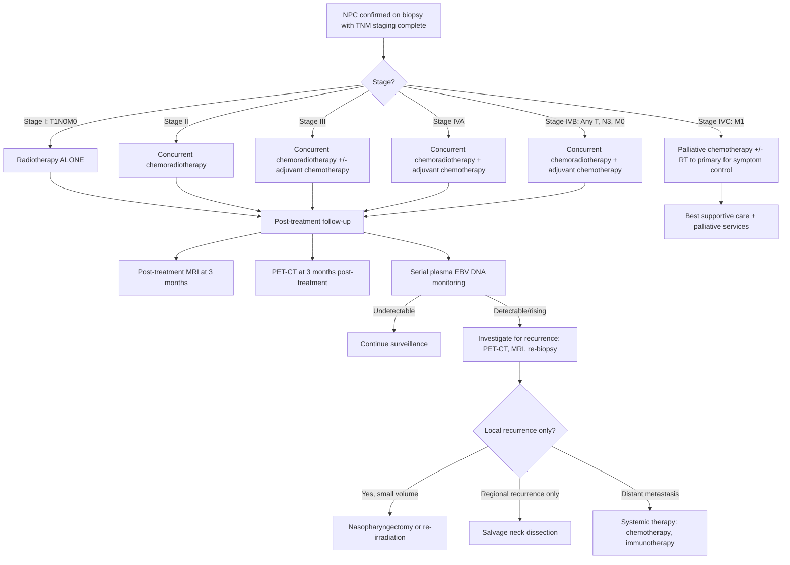

## Management of Nasopharyngeal Carcinoma

### Core Management Principles — Why Is NPC Treated Differently?

Before diving into the treatment algorithm, you need to understand **why NPC is the great exception** among head and neck cancers. For virtually every other H&N cancer (oral cavity, oropharynx, hypopharynx, larynx), **surgery is a first-line option** — either alone for early stage or combined with adjuvant RT ± chemotherapy for late stage. NPC breaks this rule completely.

Three reasons NPC is treated with radiation-based therapy, not surgery:

1. ***Deep anatomical location of the nasopharynx*** [2] — the nasopharynx sits deep in the skull, behind the nasal cavity, surrounded by the skull base superiorly, the carotid sheath and parapharyngeal space laterally, and the prevertebral fascia posteriorly. Surgical access is extremely difficult and would require morbid approaches with unacceptable functional consequences.
2. ***Close proximity to critical neurovascular structures*** [2] — the internal carotid artery, cavernous sinus, and cranial nerves III–VI and IX–XII are all immediately adjacent. Surgical resection with adequate margins would risk devastating neurological deficits.
3. **NPC is exquisitely radiosensitive** — particularly the non-keratinizing undifferentiated subtype (the endemic form in Hong Kong). This means radiation therapy achieves excellent local control rates without the morbidity of surgery.

***The key lecture slide distinction*** [16]:

> ***General rule for H&N cancer:***
> - ***Early stage: radiotherapy or minimally invasive surgery (laser/robotic)*** [16]
> - ***Late stage: surgery with adjuvant treatment*** [16]
>
> ***BUT — two critical exceptions:***
> - ***Oral cavity and thyroid: surgery in early stage*** [16]
> - ***NPC: chemo-irradiation in late stage*** [16]

This means NPC flips the usual paradigm: even in late-stage disease, you do NOT operate. You use chemo-irradiation.

---

### Management Algorithm

---

### Stage-Based Treatment Approach

#### Overview Table

***Management according to stages*** [2]:

| Stage | Approach | Rationale |
|-------|----------|-----------|
| ***Early Stage I*** | ***Radiotherapy ONLY*** [2] | T1N0M0 — small tumour confined to nasopharynx with no nodal or distant disease. RT alone achieves > 90% 5-year overall survival. Adding chemotherapy provides no additional benefit and only adds toxicity |
| ***Intermediate Stage II*** | ***Concurrent chemoradiotherapy*** [2] | Parapharyngeal extension and/or N1 disease. Chemo (cisplatin) radiosensitizes the tumour — adding cisplatin during RT improves local control and overall survival compared to RT alone |
| ***Advanced Stage III*** | ***Concurrent chemoradiotherapy ± adjuvant chemotherapy*** [2] | Bulky nodal disease (N2) or skull base/sinus involvement (T3). Higher tumour burden warrants more aggressive systemic therapy |
| ***Stage IVA*** | ***Concurrent chemoradiotherapy ± adjuvant chemotherapy*** [2] | T4 or large nodes. Intracranial extension, CN involvement, orbit involvement |
| ***Stage IVB*** | ***Concurrent chemoradiotherapy + adjuvant chemotherapy*** [2] | N3 disease (nodes > 6 cm or below cricoid). High risk of distant failure |
| **Stage IVC** | **Palliative systemic therapy** | M1 disease (distant metastases). Cure is unlikely; goal shifts to prolongation of survival and symptom control |

<Callout title="The Big Picture — Treatment Escalation by Stage">
Think of it as a stepwise escalation:
- **Stage I** → RT alone (single modality, low toxicity)
- **Stage II–IVB** → RT + cisplatin concurrently ± additional chemotherapy (combined modality, increasing intensity)
- **Stage IVC** → systemic chemotherapy ± palliative RT (palliation, not cure)

***NPC management is always based on TNM staging*** [16]. ***Early stage = single modality; late stage = combined modality*** [16].
</Callout>

---

### Treatment Modalities in Detail

#### 1. Radiotherapy (RT)

##### ***General Features*** [2]

- ***Remains the mainstay of treatment because NPC is a radiosensitive tumour and its anatomical location limits a surgical approach*** [2]
- ***Bilateral neck irradiation is always included since NPC has a propensity to spread to bilateral regional lymph nodes in the neck*** [2]
- Even in clinically N0 disease, both sides of the neck are irradiated because of the high rate of occult bilateral nodal micrometastases

##### Technique: Intensity-Modulated Radiation Therapy (IMRT)

- IMRT is the **standard of care** for NPC (replaced older 2D and 3D conformal techniques)
- **Why IMRT?** The nasopharynx is surrounded by dose-limiting critical structures: brainstem, spinal cord, temporal lobes, optic chiasm, parotid glands, cochlea, TMJ. IMRT uses computer-optimised modulated radiation beams to **conform the high-dose volume tightly to the tumour** while **sparing surrounding normal structures**
- **Dose**: Typically 70 Gy to the primary tumour and gross nodal disease (given in 33–35 fractions over ~7 weeks), with lower doses (50–60 Gy) to elective nodal regions
- IMRT has significantly reduced the incidence of xerostomia (dry mouth) compared to older techniques because it spares contralateral parotid gland tissue

##### Indications

| Setting | Details |
|---------|---------|
| **Definitive RT alone** | Stage I NPC (T1N0M0). Curative intent. > 90% 5-year OS |
| **Concurrent with chemotherapy** | Stage II–IVB NPC. Cisplatin given concurrently enhances radiosensitivity |
| **Adjuvant RT** | NOT typically applicable in NPC (RT is the primary, not adjuvant modality) |
| **Palliative RT** | Stage IVC — RT to primary for symptom control (e.g., bleeding, obstruction, pain) |
| **Re-irradiation** | For local recurrence — technically challenging due to cumulative normal tissue doses |

##### ***Side Effects of Radiotherapy*** [2]

| Side Effect | Mechanism | Timing |
|-------------|-----------|--------|
| ***Mouth and throat sores (mucositis)*** [2] | Radiation damages rapidly dividing mucosal epithelial cells → ulceration and inflammation | Acute (during and weeks after RT) |
| **Xerostomia** (dry mouth) | Radiation damages salivary gland acinar cells (serous acini are more radiosensitive than mucous) → reduced saliva production | Acute and chronic. IMRT reduces this |
| **Dysphagia / Odynophagia** | Pharyngeal mucosal inflammation and oedema; late fibrosis of pharyngeal constrictors | Acute and chronic |
| **Dermatitis** | Radiation damage to skin in the treatment field | Acute |
| **Sensorineural hearing loss** | Radiation to cochlea (inner ear is within the treatment field) | Chronic (months to years) |
| **Trismus** | Fibrosis of masticator muscles (pterygoids, masseter) and TMJ | Chronic |
| **Hypothyroidism** | Radiation to thyroid gland in the neck fields | Chronic (requires thyroid function monitoring) |
| **Osteoradionecrosis of mandible** | Radiation damages osteocytes and periosteal blood supply → avascular necrosis | Late (months to years). Risk increased by dental extraction post-RT |
| **Temporal lobe necrosis** | Radiation to temporal lobes (adjacent to nasopharynx) → white matter necrosis | Late (years). Potentially devastating. IMRT reduces incidence |
| **Cranial neuropathy** | Radiation-induced fibrosis/damage to cranial nerves | Late |
| **Secondary malignancy** | Radiation-induced DNA damage in normal tissues → second cancer in irradiated field | Very late (decades) |

<Callout title="Pre-RT Dental Assessment" type="idea">
All NPC patients should have a **comprehensive dental assessment and any necessary extractions BEFORE starting RT**. Dental extraction after RT carries a high risk of **osteoradionecrosis** because irradiated bone has compromised vascularity and healing capacity. This is a key clinical practice point.
</Callout>

---

#### 2. Chemotherapy

Chemotherapy in NPC is used in several settings:

| Setting | Timing | Drugs | Rationale |
|---------|--------|-------|-----------|
| **Concurrent** | Given simultaneously with RT | Cisplatin (single agent, weekly or 3-weekly) | Radiosensitization — cisplatin enhances radiation-induced DNA damage by inhibiting DNA repair. This is the backbone of NPC treatment for Stage II+ |
| **Induction (neoadjuvant)** | Given BEFORE concurrent CRT | Gemcitabine + Cisplatin (GP); or Docetaxel + Cisplatin + 5-FU (TPF) | Aims to reduce tumour bulk before RT and eradicate micrometastases early. Recent trials (e.g., JUPITER-02 and CAPTAIN-1st era studies, and the landmark 2019 SunYatSen GP induction trial) show **induction GP + concurrent CRT improves overall survival** compared to concurrent CRT alone in locoregionally advanced NPC |
| **Adjuvant** | Given AFTER completion of concurrent CRT | Cisplatin + 5-FU (PF); or guided by post-treatment plasma EBV DNA | ***Post-radiotherapy plasma EBV DNA is validated as the MOST significant prognostic biomarker to select high-risk patients for adjuvant chemotherapy*** [2]. Patients with detectable post-treatment EBV DNA are at high risk of relapse and may benefit from adjuvant chemotherapy |
| **Palliative** | Stage IVC (distant metastases) or recurrent disease | Cisplatin + Gemcitabine ± immunotherapy; or Carboplatin-based if cisplatin-ineligible | Aim is disease control and palliation, not cure |

##### ***Cisplatin*** [2]

- ***Alkylating agent*** [2] (technically a platinum-based coordination compound, but functionally acts like an alkylating agent)
  - ***Formation of DNA cross-links which inhibits DNA synthesis*** [2]
  - ***Covalently binds to DNA bases and disrupts DNA function*** [2]
  - ***Denatures the double helix*** [2]
- Think of it as a "molecular stapler" — it cross-links the two strands of DNA together so they cannot separate for replication or transcription

**Why cisplatin is ideal for concurrent CRT**: Cisplatin's DNA cross-linking inhibits the tumour cell's ability to repair radiation-induced DNA double-strand breaks. When radiation creates breaks and cisplatin simultaneously prevents repair, the combined cell kill is synergistic — greater than either modality alone.

***Side effects of cisplatin*** [2]:

| Side Effect | Mechanism | Management |
|-------------|-----------|------------|
| ***Nephrotoxicity*** [2] | Cisplatin concentrates in renal tubular cells → direct tubular cell damage → acute tubular necrosis. Also causes renal magnesium wasting | Aggressive IV hydration before and after cisplatin; monitor creatinine; dose-reduce or switch to carboplatin if significant renal impairment |
| ***Ototoxicity*** [2] | Damages outer hair cells of the cochlea (particularly high-frequency hearing) → irreversible sensorineural hearing loss | Baseline and serial audiograms. High-frequency hearing loss is cumulative and dose-dependent. No effective prevention; dose modification if severe |
| ***Nausea and vomiting (76–100%)*** [2] | Cisplatin is the most emetogenic chemotherapy agent. Stimulates 5-HT3 receptors in the chemoreceptor trigger zone and GI tract | Triple antiemetic prophylaxis: 5-HT3 antagonist (ondansetron) + NK1 antagonist (aprepitant) + dexamethasone |
| **Myelosuppression** | Bone marrow suppression → neutropenia, anaemia, thrombocytopenia | Monitor FBC; G-CSF if needed; dose modification |
| **Electrolyte disturbance** | Renal magnesium and potassium wasting | Monitor and replace Mg²⁺ and K⁺ |

##### ***Fluorouracil (5-FU)*** [2]

- ***Antimetabolite*** [2] — "anti" = against, "metabolite" = normal biochemical; 5-FU mimics uracil (a pyrimidine base) and tricks the cell's synthetic machinery
  - ***Pyrimidine analog which interferes with DNA and RNA synthesis*** [2]
  - ***F-dUMP inhibits thymidylate synthetase and thus depletes thymidine triphosphate which is a necessary component of DNA synthesis*** [2] — without thymidine, the cell cannot make new DNA → S-phase arrest → cell death
  - ***F-UMP incorporates into RNA to replace uracil and inhibits cell growth*** [2] — disrupts RNA processing and function

***Side effects of 5-FU*** [2]:

| Side Effect | Mechanism |
|-------------|-----------|
| ***Myelosuppression (pancytopenia)*** [2] | Bone marrow cells are rapidly dividing → susceptible to antimetabolite effects |
| ***Alopecia*** [2] | Hair follicle matrix cells are rapidly dividing → damaged by 5-FU |
| ***Stomatitis*** [2] | Oral mucosal cells turn over rapidly → ulceration |
| ***Diarrhoea*** [2] | GI mucosal cells turn over rapidly → mucosal damage → secretory diarrhoea |
| **Hand-foot syndrome** | 5-FU accumulates in palms and soles → painful erythema and desquamation |
| **DPD deficiency risk** | Dihydropyrimidine dehydrogenase (DPD) metabolizes 5-FU. Patients with DPD deficiency have catastrophic toxicity → can be fatal. DPD testing before 5-FU is now recommended |

##### Gemcitabine

- Nucleoside analogue (deoxycytidine analogue) that inhibits DNA synthesis
- Used in the **GP (Gemcitabine + Cisplatin) induction regimen** — now a preferred induction regimen for locoregionally advanced NPC based on the Sun Yat-Sen University trial (Zhang et al., NEJM 2019)
- Side effects: myelosuppression, flu-like symptoms, transaminase elevation

---

#### 3. Immunotherapy (Immune Checkpoint Inhibitors)

This is a newer but increasingly important modality for NPC, particularly recurrent/metastatic disease.

- **Rationale**: NPC (especially non-keratinizing undifferentiated) has a dense lymphocytic infiltrate and high PD-L1 expression. Tumour cells upregulate PD-L1 to evade immune surveillance → anti-PD-1 antibodies block this interaction → reactivate cytotoxic T cells against tumour
- **Agents**: Pembrolizumab, nivolumab, camrelizumab, toripalimab, tislelizumab
- **Current indications**:
  - **Recurrent/metastatic NPC** after failure of platinum-based chemotherapy — anti-PD-1 monotherapy shows response rates of ~20–30%
  - **First-line metastatic NPC** — **GP + anti-PD-1** (e.g., JUPITER-02 trial: camrelizumab + GP vs GP alone showed improved PFS and OS) is now standard of care for first-line treatment of recurrent/metastatic NPC in many centres
  - **Combined with CRT for locoregionally advanced NPC** — multiple ongoing trials (e.g., RATIONALE-309 with tislelizumab); early results are promising
- **Side effects**: Immune-related adverse events (irAEs) — pneumonitis, hepatitis, colitis, thyroiditis, dermatitis, hypophysitis. These are autoimmune-mediated because checkpoint blockade releases the brakes on the entire immune system, not just anti-tumour immunity

---

#### 4. Surgical Treatment

***General features*** [2]:
- ***NOT used as first-line treatment*** [2]
  - ***Deep anatomical location of the pharynx*** [2]
  - ***Close proximity to critical neurovascular structures*** [2]

##### Indications for Surgery (Salvage Only)

| Indication | Procedure | Details |
|------------|-----------|---------|
| ***Small local recurrence*** [2] | ***Nasopharyngectomy*** [2] | For patients with isolated nasopharyngeal recurrence after primary RT/CRT who are not suitable for re-irradiation or have already been re-irradiated. Endoscopic nasopharyngectomy (endoscopic endonasal approach) is increasingly used for selected cases. Open nasopharyngectomy (e.g., maxillary swing approach) for larger recurrences |
| ***Residual nodal disease following radiotherapy*** [2] | ***Neck dissection*** [2] | ***Neck dissection may be indicated in patients with residual nodal disease following radiotherapy or an isolated neck recurrence*** [2]. This is typically a **planned neck dissection** 8–12 weeks after CRT if PET-CT shows persistent FDG-avid residual nodes, or an **unplanned salvage neck dissection** for isolated nodal recurrence during follow-up |

##### Contraindications to Surgery as Primary Treatment

| Contraindication | Explanation |
|------------------|-------------|
| **Standard primary NPC** (any stage) | RT/CRT is the standard of care; surgery is inferior and more morbid |
| **Bulky or infiltrative recurrence** | Unresectable due to skull base, carotid, or intracranial involvement |
| **Unfit patient** | Poor performance status, significant comorbidities precluding general anaesthesia |

---

### 5. Post-Treatment Follow-Up

***Post-treatment follow-up*** [2]:

##### Documentation of Remission

- ***Post-treatment baseline MRI of skull base and neck*** [2] — establishes the new post-treatment baseline for comparison on future surveillance imaging
- ***PET-CT scan 3 months after treatment completion*** [2] — assesses metabolic response; timing is important (waiting 3 months reduces false positives from post-radiation inflammation)

##### Plasma EBV DNA Monitoring

- ***Post-treatment EBV DNA levels*** [2]
- ***Post-radiotherapy plasma EBV DNA is validated as the MOST significant prognostic biomarker to select high-risk patients for adjuvant chemotherapy*** [2]
- **Interpretation**:
  - **Undetectable post-treatment** → excellent prognosis, continue routine surveillance
  - **Detectable/persistent post-treatment** → high risk of relapse → consider adjuvant chemotherapy and/or intensified surveillance
  - **Rising during follow-up** → likely recurrence → PET-CT + MRI to localise; consider re-biopsy

##### Surveillance Schedule (Typical)

| Time Post-Treatment | Investigations |
|---------------------|----------------|
| **3 months** | Post-treatment MRI + PET-CT + plasma EBV DNA |
| **Every 3–6 months (years 1–2)** | Clinical examination, nasopharyngoscopy, plasma EBV DNA |
| **Every 6–12 months (years 3–5)** | Clinical examination, nasopharyngoscopy, plasma EBV DNA, annual MRI |
| **Annually (beyond 5 years)** | Late effects monitoring (thyroid function, hearing, dental, temporal lobes) |

---

### 6. Management of Recurrent/Metastatic NPC

| Scenario | Treatment Options |
|----------|-------------------|
| **Isolated local recurrence** (nasopharynx) | Re-irradiation (IMRT, stereotactic body RT, brachytherapy) OR nasopharyngectomy (endoscopic or open). Re-irradiation carries significant risk of late toxicity (temporal lobe necrosis, cranial neuropathy, carotid blowout) |
| **Isolated regional recurrence** (neck) | ***Salvage neck dissection*** [2] ± re-irradiation |
| **Distant metastasis** (first-line) | **GP + anti-PD-1** (gemcitabine + cisplatin + camrelizumab/pembrolizumab) — current standard of care per JUPITER-02 and CAPTAIN-1st trials |
| **Distant metastasis** (second-line) | Anti-PD-1 monotherapy; or other chemotherapy doublets (capecitabine + cisplatin); clinical trials |
| **Oligometastatic disease** | Consider local treatment to metastatic sites (surgery, SBRT) + systemic therapy — selected patients may achieve long-term disease control |

---

### 7. Management Principles Summary

***Management framework general principles*** [16][18]:
- ***Tumour clearance with long-term survival benefit*** [18]
- ***Organ and function preservation*** [18]
- ***When surgery is indicated → resection with adequate margins, reconstruction for form and function*** [18]
- ***Rehabilitation always — swallowing, voice, and hearing*** [18]

For NPC specifically:
- Surgery is almost never first-line
- RT is the backbone; chemotherapy (cisplatin) is added as a radiosensitizer for Stage II+
- Immunotherapy is transforming the metastatic/recurrent setting
- Plasma EBV DNA guides adjuvant therapy decisions and surveillance
- Late effects monitoring is critical (thyroid, hearing, dental, temporal lobes, cranial nerves)

---

<Callout title="High Yield Summary — Management of NPC">

**Key exception in H&N cancer**: ***NPC uses chemo-irradiation in late stage*** (NOT surgery). ***Oral cavity and thyroid use surgery in early stage.***

**Stage-based approach**:
- **Stage I** → RT alone (> 90% cure rate)
- **Stage II–IVB** → Concurrent CRT (cisplatin + IMRT) ± induction GP ± adjuvant chemo
- **Stage IVC** → Palliative chemotherapy ± immunotherapy ± palliative RT

**RT**: IMRT is standard. ***Bilateral neck irradiation always*** (bilateral nodal drainage). Side effects: mucositis, xerostomia, ototoxicity, temporal lobe necrosis.

**Chemotherapy**: ***Cisplatin*** (DNA cross-linker; nephrotoxic, ototoxic, highly emetogenic). ***5-FU*** (thymidylate synthetase inhibitor; mucositis, myelosuppression). **Gemcitabine + Cisplatin** = preferred induction regimen.

**Immunotherapy**: Anti-PD-1 (camrelizumab, pembrolizumab) — now standard first-line for metastatic NPC combined with GP.

**Surgery**: ***NOT first-line***. Reserved for salvage: nasopharyngectomy for small local recurrence, neck dissection for residual/recurrent nodal disease.

**Post-treatment**: MRI + PET-CT at 3 months. ***Plasma EBV DNA is the MOST significant prognostic biomarker*** for selecting adjuvant therapy and detecting recurrence.

</Callout>

---

<ActiveRecallQuiz
  title="Active Recall - Management of Nasopharyngeal Carcinoma"
  items={[
    {
      question: "Why is surgery NOT used as first-line treatment for NPC, unlike most other H&N cancers?",
      markscheme: "Three reasons: (1) Deep anatomical location of the nasopharynx with poor surgical access, (2) Close proximity to critical neurovascular structures (ICA, cavernous sinus, CN III-VI, IX-XII), (3) NPC is exquisitely radiosensitive (especially non-keratinizing undifferentiated subtype), so RT/CRT achieves excellent local control without surgical morbidity."
    },
    {
      question: "What is the treatment for Stage I NPC and what is the expected 5-year survival? Why is chemotherapy not added?",
      markscheme: "Stage I NPC (T1N0M0) is treated with radiotherapy alone. 5-year overall survival exceeds 90%. Chemotherapy is not added because the tumour burden is small, RT alone achieves excellent cure rates, and adding chemo only increases toxicity (nephrotoxicity, ototoxicity, myelosuppression) without meaningful survival benefit."
    },
    {
      question: "Explain the mechanism by which concurrent cisplatin enhances the effectiveness of radiotherapy in NPC.",
      markscheme: "Cisplatin covalently cross-links DNA strands, preventing separation for replication/transcription and inhibiting DNA repair mechanisms. When radiation simultaneously creates DNA double-strand breaks, the tumour cell cannot repair these breaks because cisplatin has disabled the repair machinery. This produces synergistic cell kill greater than either modality alone (radiosensitization)."
    },
    {
      question: "A patient with Stage III NPC completes concurrent chemoradiotherapy. Post-treatment plasma EBV DNA at 3 months is still detectable. What does this mean and what should be done?",
      markscheme: "Detectable post-treatment plasma EBV DNA indicates incomplete tumour eradication and high risk of disease relapse. Post-RT plasma EBV DNA is the MOST significant prognostic biomarker. Management: (1) PET-CT and MRI to localise residual/recurrent disease, (2) consider adjuvant chemotherapy (e.g. GP or PF regimen), (3) intensified surveillance with serial EBV DNA monitoring, (4) re-biopsy of nasopharynx if suspicious lesion on imaging."
    },
    {
      question: "What is the current standard first-line systemic therapy for recurrent/metastatic NPC and what is its rationale?",
      markscheme: "Gemcitabine + Cisplatin + anti-PD-1 immunotherapy (e.g. camrelizumab per JUPITER-02 trial). Rationale: NPC has dense lymphocytic infiltrate and high PD-L1 expression. Tumour cells evade immune surveillance via PD-L1/PD-1 checkpoint. Anti-PD-1 reactivates cytotoxic T cells against the tumour, producing synergistic effect with cytotoxic chemotherapy. This combination showed improved PFS and OS compared to GP alone."
    },
    {
      question: "Name three indications for surgery in the management of NPC.",
      markscheme: "(1) Nasopharyngectomy (endoscopic or open) for small isolated local recurrence after primary RT/CRT, (2) Salvage neck dissection for residual nodal disease following RT/CRT (persistent FDG-avid nodes on PET-CT), (3) Salvage neck dissection for isolated regional (nodal) recurrence during follow-up. Surgery is NEVER first-line for primary NPC."
    }
  ]}
/>

## References

[2] Senior notes: felixlai.md (felix:364, 365, 366) — NPC diagnosis, treatment, screening
[16] Lecture slides: GC 219. Infections and tumours in pharynx and oral cavity.pdf (p43) — Management framework
[18] Lecture slides: GC 219. Infections and tumours in pharynx and oral cavity.pdf (p44) — Management framework general principles
