# History Taking: Neck Mass / Thyroid

---

## Master Framework

```mermaid
graph TD
    A["Neck Mass / Thyroid<br>Chief Complaint"] --> B["Presenting Complaint<br>(Lump Characterization)"]
    A --> C["Associated Symptoms"]
    A --> D["Risk Factors & PMHx"]
    A --> E["Systems Review"]
    A --> F["Social & Family History"]

    B --> B1["Onset, Duration, Progression"]
    B --> B2["Location: Midline vs Lateral"]
    B --> B3["Number: Solitary vs Multiple"]
    B --> B4["Pain / Tenderness"]
    B --> B5["Sudden size change"]

    C --> C1["Compressive Sx:<br>Dysphagia, Dyspnoea, Dysphonia"]
    C --> C2["Thyroid Status Sx:<br>Hyper vs Hypothyroid"]
    C --> C3["Constitutional Sx:<br>Fever, Night Sweats, Weight Loss"]
    C --> C4["Symptoms of Metastasis"]

    D --> D1["Prior H&N Irradiation"]
    D --> D2["FHx: MEN2, FAP, Thyroid CA"]
    D --> D3["Autoimmune diseases"]
    D --> D4["Previous Thyroid Disease"]
    D --> D5["Medications"]

    E --> E1["ENT: Ear, Nose, Throat"]
    E --> E2["Cardiovascular: AF, HF"]
    E --> E3["GI: Dysphagia, Bowel Habit"]
    E --> E4["Neurological: Hoarseness"]

    F --> F1["Smoking, Alcohol"]
    F --> F2["Occupation, Radiation Exposure"]
    F --> F3["Functional Baseline"]

    style A fill:#2563eb,color:#fff
    style B fill:#f59e0b,color:#000
    style C fill:#f59e0b,color:#000
    style D fill:#f59e0b,color:#000
    style E fill:#f59e0b,color:#000
    style F fill:#f59e0b,color:#000
```

---

## 1. Focused Presenting Complaint Framework

The golden rule: **characterize the lump first**, then figure out whether the thyroid is the culprit, and then determine if it's benign or malignant. In Hong Kong OSCEs, this is a bread-and-butter station — a surgical sieve approach will serve you well.

### 1.1 Lump Characterization

| Question                                                          | Why It Matters                                                                                                                                                                                                       | Cantonese Phrasing                                                                  |
| :---------------------------------------------------------------- | :------------------------------------------------------------------------------------------------------------------------------------------------------------------------------------------------------------------- | :---------------------------------------------------------------------------------- |
| **When did you first notice the lump? Was it sudden or gradual?** | _Sudden ↑ size suggests **anaplastic carcinoma**, primary lymphoma, haemorrhage into necrotic nodule/cyst, or subacute thyroiditis_ [1][2]. Gradual onset over years = likely benign.                                | 你幾時開始發覺有呢粒嘢？(Néih géi sìh hōi chí faat gok yáuh nī nāp yéh?)            |
| **Has it been growing? How fast?**                                | _Slow but progressive growth (weeks to months) with firm/hard consistency and fixation to surrounding tissues is concerning for malignancy_ [2]. Present for years with minimal change = likely benign neoplasm [3]. | 有冇越嚟越大？大得快唔快？(Yáuh móuh yuht lèih yuht daaih? Daaih dāk faai m̀h faai?) |
| **Is it one lump or multiple?**                                   | **_Solitary or dominant nodule is more likely to be malignant than multiple nodules_** [2]. Multiple nodules suggest MNG.                                                                                            | 係一粒定幾粒？(Haih yāt nāp dihng géi nāp?)                                         |
| **Where exactly is the lump?**                                    | Location is king for the differential. _Midline lower neck → thyroid; midline upper neck → thyroglossal cyst; lateral under SCM → lymph node; supraclavicular → metastasis from below clavicle_ [3][4].              | 喺邊度？正中間定係一邊？(Hái bīn douh? Jing jūng gāan dihng haih yāt bīn?)          |
| **Is it painful?**                                                | **_Pain: bleeding into cyst/necrotic nodule, subacute thyroiditis, or anaplastic carcinoma_** [1][2]. Most thyroid cancers are painless.                                                                             | 痛唔痛？(Tung m̀h tung?)                                                             |
| **Does it move when you swallow?**                                | Mass moving with swallowing = thyroid origin (enclosed in pretracheal fascia). Mass moving with tongue protrusion = thyroglossal cyst [3][5].                                                                        | 吞口水嘅時候有冇郁動？(Tān háu séui ge sìh hauh yáuh móuh yūk duhng?)               |

<Callout title="Location-Based Differential Diagnosis" type="idea">

| Location               | Key Differentials                                                                       |
| :--------------------- | :-------------------------------------------------------------------------------------- |
| **Midline**            | Thyroid nodule (isthmus), thyroglossal cyst, dermoid cyst, submental lymph node [3]     |
| **Anterior triangle**  | Thyroid nodule, branchial cleft cyst, carotid body tumour, submandibular gland mass [3] |
| **Posterior triangle** | Level II–IV lymph nodes, schwannoma, cystic hygroma [3]                                 |
| **Supraclavicular**    | Level V LN (NPC in HK!), metastasis from GI/lung/gynae below clavicle [3][4]            |

</Callout>

### 1.2 Compressive / Invasive Symptoms

These are critical because they indicate local spread or significant mass effect. Ask them systematically — the "3 D's" plus hoarseness:

| Question                                                              | Why It Matters                                                                                                                                                                                   | Cantonese                                                                                         |
| :-------------------------------------------------------------------- | :----------------------------------------------------------------------------------------------------------------------------------------------------------------------------------------------- | :------------------------------------------------------------------------------------------------ |
| **Any difficulty swallowing?** (Dysphagia)                            | **_Compressive symptoms: dyspnoea, dysphagia, dysphonia_** indicate either a large goitre or invasive malignancy [1][2].                                                                         | 吞嘢有冇困難？(Tān yéh yáuh móuh kwàn nàahn?)                                                     |
| **Any difficulty breathing or noisy breathing?** (Dyspnoea / Stridor) | Tracheal compression or retrosternal extension. Stridor = urgent.                                                                                                                                | 呼吸有冇困難？有冇聽到喘鳴聲？(Fū kāp yáuh móuh kwàn nàahn? Yáuh móuh tēng dou chyún mìhng sēng?) |
| **Any voice change or hoarseness?** (Dysphonia)                       | **_Hoarseness suggests recurrent laryngeal nerve (RLN) involvement_** — a red flag for malignant invasion. Can also be seen in large benign goitres but much more worrying for carcinoma [2][3]. | 把聲有冇沙啞或者變咗？(Bá sēng yáuh móuh sā á waahk jé bin jó?)                                   |
| **Any ear pain?** (Otalgia)                                           | Referred otalgia from upper aerodigestive tract malignancy → suggests H&N SCC with cervical node metastasis [3].                                                                                 | 耳仔有冇痛？(Yíh jái yáuh móuh tung?)                                                             |

<Callout title="Don't Forget the 3 D's" type="error">
  Students commonly remember dysphagia but forget to ask about **dyspnoea** and
  **dysphonia**. In an OSCE, missing hoarseness is a significant omission — it
  directly points to RLN palsy and malignancy. ***Pressure symptoms/RLN palsy
  indicates rapid growth rate with invasion*** [2].
</Callout>

---

## 2. Thyroid Functional Status Assessment

This is where many students stumble. You must actively screen for both **hyper-** and **hypothyroidism** — it changes the differential entirely (Graves' vs Hashimoto's vs toxic MNG vs simple goitre).

### 2.1 Hyperthyroid Symptoms (甲亢 gaap kong)

> _"Have you noticed any of the following...?"_

| Symptom                               | Cantonese                                                                                 | Why It Matters                                                                                                         |
| :------------------------------------ | :---------------------------------------------------------------------------------------- | :--------------------------------------------------------------------------------------------------------------------- |
| Weight loss despite good appetite     | 食得多但係瘦咗 (Sihk dāk dō daahn haih sau jó)                                            | **_Hyperthyroid: weight loss despite ↑ appetite, heat intolerance, ↑ sweating, diarrhea, palpitation, tremor_** [1][2] |
| Heat intolerance / sweating           | 怕熱、出汗多 (Paa yiht, chēut hohn dō)                                                    |                                                                                                                        |
| Palpitations                          | 心跳得好快 (Sām tiu dāk hóu faai)                                                         | AF risk in toxic MNG / Graves'                                                                                         |
| Tremor                                | 手震 (Sáu jan)                                                                            |                                                                                                                        |
| Diarrhoea / increased bowel frequency | 肚瀉 / 去廁所多咗 (Tóuh se / heui chi só dō jó)                                           |                                                                                                                        |
| Irritability / anxiety                | 煩躁、容易嬲 (Fàahn chou, yùhng yìh nàu)                                                  |                                                                                                                        |
| Menstrual changes                     | 月經有冇唔正常？(Yuht gīng yáuh móuh m̀h jing sèuhng?)                                     | Oligo/amenorrhoea                                                                                                      |
| Eye symptoms                          | 對眼有冇凸出嚟？有冇重影？(Deui ngáahn yáuh móuh daht chēut lèih? Yáuh móuh chùhng yíng?) | Graves' ophthalmopathy                                                                                                 |

### 2.2 Hypothyroid Symptoms (甲減 gaap gáam)

| Symptom                             | Cantonese                                                      |
| :---------------------------------- | :------------------------------------------------------------- |
| Weight gain with decreased appetite | 肥咗但冇乜胃口 (Fèih jó daahn móuh māt waih háu)               |
| Cold intolerance                    | 怕凍 (Paa dung)                                                |
| Constipation                        | 便秘 (Bihn bei)                                                |
| Fatigue / lethargy                  | 成日好攰 (Sìhng yaht hóu guih)                                 |
| Dry skin / hair loss                | 皮膚乾、甩頭髮 (Pèih fū gōn, lāt tàuh faat)                    |
| Bradycardia                         | 心跳好慢 (Sām tiu hóu maahn)                                   |
| Depression / cognitive slowing      | 情緒低落、反應慢咗 (Chìhng séuih dāi lohk, fáan ying maahn jó) |

> **_Hypothyroid: fatigue, weight gain but ↓ appetite, cold intolerance, constipation, bradycardia_** [1][2]

<Callout title="Thyroid Storm & Myxoedema Coma — Don't Miss the Extremes">
  In the history, specifically ask about **fever + confusion** (thyroid storm)
  or **profound lethargy + hypothermia** (myxoedema coma). These are
  life-threatening emergencies. *Thyroid storm: fever, confusion* [1].
</Callout>

---

## 3. Risk Factors, Exposure History & Past Medical History

This section is crucial because it directly informs your pre-test probability for malignancy.

### 3.1 Risk Factors for Thyroid Malignancy

| Risk Factor                                | Why It Matters                                                                                                                                      | Cantonese                                                                                              |
| :----------------------------------------- | :-------------------------------------------------------------------------------------------------------------------------------------------------- | :----------------------------------------------------------------------------------------------------- |
| **_Female gender_**                        | Thyroid nodules more common in females, but **_male sex increases the likelihood of malignancy_** [2][6]                                            | 性別 (Sing biht)                                                                                       |
| **_Age < 14y or >70y_**                    | _Nodules in 3rd to 6th decade usually benign_ [2]; extremes of age → higher malignancy risk                                                         | 年紀 (Nìhn géi)                                                                                        |
| **_Prior head & neck irradiation_**        | _Radiation thyroiditis and ↑ risk of papillary CA_. Ask about childhood leukaemia treatment, bone marrow transplant, environmental radiation [1][6] | 以前有冇照過電療，特別係頭頸位？(Yíh chìhn yáuh móuh jiu gwó dihn lìuh, dahk biht haih tàuh géng wái?) |
| **_Family history of thyroid CA_**         | _~20% of medullary CA (MEN II), ~5% of papillary CA are familial_ [1][2]                                                                            | 屋企人有冇甲狀腺癌？(Ūk kéi yàhn yáuh móuh gaap johng sin ngàahm?)                                     |
| **_MEN2 syndrome_**                        | MEN2A = MTC + phaeochromocytoma + parathyroid hyperplasia; MEN2B = MTC + phaeochromocytoma + ganglioneuromatosis [6][7]                             | Ask about family members with phaeo or hyperparathyroidism                                             |
| **_FAP (Familial adenomatous polyposis)_** | _Associated with papillary thyroid carcinoma_ [6][7]                                                                                                | 有冇家族性腸瘜肉？(Yáuh móuh gā juhk sing chèuhng sīk yuhk?)                                           |
| **Hashimoto's thyroiditis**                | _Associated with thyroid lymphoma_ [7]                                                                                                              |                                                                                                        |
| **Long-standing MNG**                      | _Long standing MNG can progress to lymphoma_ [1]                                                                                                    |                                                                                                        |
| **_Smoking_**                              | Classical risk factor for H&N cancer (relevant if suspecting metastatic cervical LN) [3]                                                            | 你有冇食煙？(Néih yáuh móuh sihk yīn?)                                                                 |
| **Alcohol**                                | Risk factor for H&N SCC [3]                                                                                                                         | 飲酒多唔多？(Yám jáu dō m̀h dō?)                                                                        |

### 3.2 Past Medical History

| Question                                                           | Why                                                                                            |
| :----------------------------------------------------------------- | :--------------------------------------------------------------------------------------------- |
| Previous thyroid disease (Hx, Dx, Bx, Tx)                          | Prior Graves', previous FNAC results, any surgery [1]                                          |
| History of autoimmune diseases (T1DM, SLE, RA, pernicious anaemia) | **_Hx of autoimmune diseases_** clusters with autoimmune thyroid disease [1]                   |
| History of any cancer                                              | Risk of metastasis to thyroid (renal cell CA is the most common metastatic thyroid cancer [7]) |
| History of H&N cancer, NPC, thymoma                                | Cervical LN may be metastatic [1]                                                              |

### 3.3 Medications & Allergies

| Medication                                    | Relevance                                                             |
| :-------------------------------------------- | :-------------------------------------------------------------------- |
| **Levothyroxine**                             | Prior hypothyroidism / post-thyroidectomy                             |
| **Carbimazole / PTU**                         | Being treated for hyperthyroidism                                     |
| **Amiodarone**                                | Can cause both hyper- and hypothyroidism                              |
| **Lithium**                                   | Can cause goitre and hypothyroidism                                   |
| **Iodine-containing medications/supplements** | Iodine excess/deficiency affects thyroid                              |
| **Slimming pills**                            | **_Factitious thyrotoxicosis_** from exogenous T4 [8]                 |
| Drug allergies                                | Always ask — especially iodine/contrast allergy for future CT imaging |

### 3.4 Family History

- Thyroid cancer (papillary, medullary)
- **_MEN2 syndrome_** — phaeochromocytoma, hyperparathyroidism [6][7]
- FAP [6]
- Any other endocrine tumours
- Autoimmune diseases

### 3.5 Social History & Functional Baseline

| Domain                  | Questions                                                                                               |
| :---------------------- | :------------------------------------------------------------------------------------------------------ |
| **Smoking**             | Pack-years; H&N cancer risk [3]                                                                         |
| **Alcohol**             | Units/week; H&N cancer risk [3]                                                                         |
| **Occupation**          | Radiation exposure?                                                                                     |
| **Dietary**             | Iodine intake (seaweed-heavy diet common in HK), goitrogens (cassava, soy in excess)                    |
| **Functional baseline** | Exercise tolerance, ADLs, occupation — important for surgical fitness assessment                        |
| **ICE**                 | Ideas, Concerns, Expectations — "What are you worried about?" 你最擔心啲咩？(Néih jeui dāam sām dī mē?) |

---

## 4. Constitutional / B Symptoms

Always screen for these — they shift the differential toward lymphoma or aggressive malignancy:

- **Fever** 發燒 (Faat sīu)
- **Night sweats** 夜晚出汗 (Yeh máahn chēut hohn)
- **Unintentional weight loss** 無啦啦瘦咗 (Mòuh lā lā sau jó)

> _Fever, night sweat and weight loss suggests lymphoma_ [3]

---

## 5. Targeted Systems Review

| System             | Questions                                                       | Why                                                                   |
| :----------------- | :-------------------------------------------------------------- | :-------------------------------------------------------------------- |
| **ENT**            | Ear pain, nasal obstruction/epistaxis, oral ulcers, sore throat | NPC is common in HK; cervical LN may be the presenting feature [4][9] |
| **Respiratory**    | Cough, haemoptysis, SOB                                         | Lung mets (follicular CA) or primary lung → supraclavicular LN        |
| **GI**             | Change in bowel habit, per rectal bleeding                      | GI malignancy → supraclavicular (Virchow's) node                      |
| **Cardiovascular** | Palpitations, effort tolerance, ankle swelling                  | AF from thyrotoxicosis, high-output HF [1]                            |
| **MSK**            | Bone pain                                                       | Bone metastasis from follicular thyroid CA                            |
| **Neuro**          | Headache, visual field defects                                  | Pituitary adenoma (secondary hyperthyroidism — rare)                  |

---

## 6. Key Differentiating Questions

These are the "fork in the road" questions that help you narrow from "neck mass" to a specific diagnosis:

| Question                                      | If Yes → Think...                                              | If No → Think...                                                |
| :-------------------------------------------- | :------------------------------------------------------------- | :-------------------------------------------------------------- |
| Does the mass move with swallowing?           | Thyroid origin or thyroglossal cyst                            | Non-thyroid: lymph node, branchial cyst, salivary gland, lipoma |
| Does it move with tongue protrusion?          | **_Thyroglossal cyst_** [5]                                    | Other midline mass                                              |
| Is there rapid enlargement over days?         | Haemorrhage into cyst, subacute thyroiditis, anaplastic CA [1] | Slower process                                                  |
| Is there rapid enlargement over weeks-months? | Malignancy (papillary/follicular/medullary) [2]                | Benign if stable for years                                      |
| Painful with preceding URTI/fever?            | **_Subacute (de Quervain's) thyroiditis_** [10]                | Other cause                                                     |
| Any eye prominence/double vision?             | **_Graves' disease_** [8]                                      | Other cause of thyrotoxicosis                                   |
| Rubbery LN in a young person?                 | Lymphoma [4]                                                   |                                                                 |
| Are you taking any slimming pills?            | Factitious thyrotoxicosis [8]                                  |                                                                 |

---

## 7. Red-Flag Findings & Escalation Triggers

<Callout title="Red Flags in Neck Mass / Thyroid — MUST Recognize" type="error">

These findings should prompt urgent investigation and/or referral:

1. **Rapidly enlarging, hard, fixed mass** — anaplastic carcinoma until proven otherwise [2][7]
2. **Hoarseness / dysphonia** — **_RLN palsy suggesting malignant invasion_** [2]
3. **Stridor** — airway compromise, needs urgent assessment
4. **Fixed cervical lymphadenopathy** — metastatic disease [2]
5. **Age < 14 or >70 with a new nodule** — higher malignancy risk [2]
6. **Male patient with thyroid nodule** — _less common in males but more likely to be malignant_ [2]
7. **Family history of MEN2 or medullary thyroid CA** — screen with calcitonin, genetic testing [7]
8. **History of head & neck irradiation** — significantly ↑ risk of papillary CA [1][6]
9. **Thyroid storm features: fever + confusion + tachycardia** — medical emergency [1]
10. **B symptoms (fever, night sweats, weight loss)** — lymphoma or aggressive malignancy [3]

</Callout>

---

## 8. Common Pitfalls in History-Taking

<Callout title="Common OSCE Mistakes" type="error">

1. **Forgetting to ask about thyroid functional status** — You get a neck lump and only focus on the lump. Always ask hyper/hypothyroid symptoms. This differentiates Graves' from Hashimoto's from simple goitre.
2. **Not asking about medications** — Amiodarone, lithium, and slimming pills are classic OSCE traps.
3. **Ignoring family history** — MEN2 and FAP are high-yield. If you don't ask, you'll miss medullary thyroid CA.
4. **Forgetting NPC in Hong Kong** — A posterior triangle/level V neck mass in a Cantonese-speaking patient should raise NPC suspicion. Always ask about nasal symptoms and unilateral ear symptoms.
5. **Not differentiating acute painful thyroid enlargement** — Haemorrhage into a cyst vs subacute thyroiditis vs anaplastic CA. Ask about preceding URTI, fever, and the rapidity of onset.
6. **Skipping the swallowing/tongue protrusion question** — This is the bedside test that distinguishes thyroid from thyroglossal cyst from non-thyroid masses. Even in history taking, you should ask: "Does the lump move when you swallow?"
7. **Not exploring the drainage basin** — For lateral neck masses, always ask about ENT symptoms, oral cavity symptoms, and breast symptoms (in females) to hunt for a possible primary.

</Callout>

---

## 9. High-Yield Exam-Focused Interpretation Tips

| Clinical Clue                                                                             | Most Likely Diagnosis                      | Exam Pearl                                                                          |
| :---------------------------------------------------------------------------------------- | :----------------------------------------- | :---------------------------------------------------------------------------------- |
| Painless diffuse goitre + bruit + ophthalmopathy + pretibial myxoedema                    | **_Graves' disease_**                      | Ophthalmopathy is ONLY in Graves', not other causes of thyrotoxicosis [8]           |
| Elderly + AF + multinodular goitre                                                        | **_Toxic MNG (Plummer's disease)_**        | _Classically AF + multinodular goitre in elderly_ [10]                              |
| Painful tender goitre + preceding URTI + fluctuating thyroid status                       | **_Subacute (de Quervain's) thyroiditis_** | Self-limiting; do NOT give antithyroid drugs [10]                                   |
| Young adult + painless solitary nodule + cervical LN                                      | **_Papillary thyroid CA_**                 | Most common thyroid CA (85%); spreads via lymphatics to level VI first [7]          |
| Middle-aged + solitary encapsulated nodule + bone/lung mets                               | **_Follicular thyroid CA_**                | Spreads haematogenously (cf. papillary which is lymphatic) [7]                      |
| Elderly + rapidly enlarging hard mass + stridor                                           | **_Anaplastic thyroid CA_**                | Median survival < 6 months; often locally advanced at presentation [7]              |
| Bilateral thyroid nodules + FHx phaeochromocytoma                                         | **_Medullary thyroid CA (MEN2)_**          | Check calcitonin, CEA; screen RET mutation in family [7]                            |
| Young patient + rubbery non-tender LN + B symptoms                                        | **_Lymphoma_**                             | Need excision biopsy (FNAC is USELESS for lymphoma staging) [11]                    |
| Midline upper neck mass + moves with tongue protrusion                                    | **_Thyroglossal duct cyst_**               | Remnant of thyroglossal tract, closely associated with hyoid bone [5]               |
| Left supraclavicular node (Virchow's) + weight loss + GI symptoms                         | **_GI malignancy (metastatic)_**           | Malignancy metastasizes from below the clavicle [3]                                 |
| Lateral neck mass + unilateral hearing loss + bloody nasal discharge in Cantonese patient | **_Nasopharyngeal carcinoma (NPC)_**       | Extremely common in HK; always consider in lateral/posterior triangle masses [4][9] |

---

## 10. Model Reporting Script

> _"Mr Chan is a 55-year-old gentleman with no significant past medical history who presented 3 weeks ago to Queen Mary Hospital with a progressively enlarging left-sided neck mass noticed incidentally by his wife._
>
> _On history of presenting illness, the mass has been growing gradually over the past 6 months and has recently accelerated in growth over the last 3 weeks. It is painless. He denies any dysphagia, dyspnoea, or hoarseness. He has no symptoms of thyrotoxicosis or hypothyroidism — specifically no weight change, tremor, palpitations, heat or cold intolerance, or bowel habit change. He denies any fever, night sweats, or unintentional weight loss. He has no nasal obstruction, epistaxis, or ear symptoms to suggest NPC._
>
> _His past medical history is unremarkable. He has no prior thyroid disease and has never had any head and neck irradiation. He has no history of autoimmune diseases._
>
> _He has had no prior surgeries._
>
> _He takes no regular medications and has no known drug allergies._
>
> _Family history is negative for thyroid cancer, MEN syndromes, or familial adenomatous polyposis._
>
> _Socially, he is a non-smoker and a social drinker. He works as an office clerk and is fully independent in activities of daily living._
>
> _In summary, Mr Chan is a 55-year-old gentleman with a progressively enlarging painless left-sided neck mass of 6 months' duration without compressive symptoms, thyroid dysfunction, constitutional symptoms, or identifiable risk factors for malignancy. The key differentials include a thyroid nodule (benign or malignant), cervical lymphadenopathy, and less likely a salivary gland tumour. I would like to proceed with clinical examination, thyroid function tests, and ultrasound of the neck with consideration for fine-needle aspiration cytology."_

---

## 11. Active Recall Quiz

<ActiveRecallQuiz
  title="Active Recall - History Taking"
  items={[
    {
      question:
        "What are the three compressive symptoms you must ask about in a patient with a neck mass or thyroid swelling?",
      markscheme:
        "Dysphagia, dyspnoea (stridor), and dysphonia (hoarseness) — the 3 Ds. These indicate local mass effect or malignant invasion, particularly RLN involvement for dysphonia.",
    },
    {
      question:
        "A patient presents with a midline neck mass that moves with tongue protrusion. What is the most likely diagnosis and why does this test work?",
      markscheme:
        "Thyroglossal duct cyst. It moves with tongue protrusion because it is a remnant of the thyroglossal tract which is closely associated with the hyoid bone and connected to the foramen cecum at the base of the tongue.",
    },
    {
      question:
        "Name four clinical features that suggest increased risk of malignancy in a thyroid nodule.",
      markscheme:
        "Male sex; age less than 14 or greater than 70; solitary or dominant nodule; firm/hard consistency with fixation; rapid progressive growth; cervical lymphadenopathy (especially level VI); hoarseness/RLN palsy; history of neck irradiation; family history of thyroid CA or MEN2.",
    },
    {
      question:
        "What is the classic triad of MEN2A, and why is it important to ask about in a patient with a thyroid nodule?",
      markscheme:
        "MEN2A: medullary thyroid carcinoma, phaeochromocytoma, and parathyroid hyperplasia. Approximately 20 percent of medullary thyroid cancers are familial due to RET proto-oncogene mutations. Identifying this allows genetic screening of family members and consideration of prophylactic thyroidectomy.",
    },
    {
      question:
        "An elderly patient presents with a rapidly enlarging hard neck mass over 2-3 months with stridor. What is the most likely diagnosis and what is the prognosis?",
      markscheme:
        "Anaplastic thyroid carcinoma. Median survival is less than 6 months. It is often locally advanced with distant metastasis at presentation. Management is palliative with chemoirradiation plus or minus surgical debulking and palliative tracheostomy.",
    },
    {
      question:
        "Why should you always ask about NPC-related symptoms when assessing a neck mass in Hong Kong?",
      markscheme:
        "NPC is endemic in southern China and Hong Kong. It commonly presents with a painless posterior triangle or level V cervical lymph node. Ask about unilateral hearing loss, nasal obstruction, blood-stained nasal discharge, and ear fullness to screen for a primary NPC.",
    },
  ]}
/>

---

## References

[1] Senior notes: Ryan Ho Endocrine.pdf (p17–18, Goitre and Thyroid Nodules, History)
[2] Senior notes: Ryan Ho Fundamentals.pdf (p425–426, Clinical features suggesting ↑ risk of malignancy)
[3] Senior notes: felixlai.md (Section III: Diagnosis — History taking, Mass localization table)
[4] Lecture slides: GC 218. I have a swelling in the neck Neck mass (Notes).pdf (p1–2)
[5] Senior notes: Ryan Ho Fundamentals.pdf (p170, Examination of Thyroid Gland — swallowing and tongue protrusion tests)
[6] Senior notes: felixlai.md (Section III: Etiology — Risk factors, MEN table)
[7] Senior notes: maxim.md (Thyroid cancer overview table, Risk factors)
[8] Senior notes: Ryan Ho Fundamentals.pdf (p421, Thyrotoxicosis — causes, S/S)
[9] Lecture slides: GC 219. Infections and tumours in pharynx and oral cavity.pdf (p8)
[10] Senior notes: Ryan Ho Endocrine.pdf (p31–32, Subacute thyroiditis, Multinodular goitre)
[11] Senior notes: Ryan Ho Haemtology.pdf (p87, Approach to lymphadenopathy — biopsy)

---

<Callout title="High Yield Summary">

**Neck Mass / Thyroid — History Taking in a Nutshell:**

1. **Characterize the lump**: Onset, duration, growth rate, location (midline vs lateral), number, pain, movement with swallowing/tongue protrusion.
2. **Screen for compressive symptoms**: Dysphagia, dyspnoea, dysphonia (3 D's).
3. **Assess thyroid functional status**: Hyper vs hypothyroid symptoms — this determines the differential (Graves' vs Hashimoto's vs toxic MNG vs simple goitre).
4. **Hunt for red flags of malignancy**: Solitary hard fixed nodule, rapid growth, RLN palsy, cervical LN, male sex, extremes of age, prior irradiation, FHx MEN2/FAP.
5. **Constitutional symptoms**: Fever, night sweats, weight loss → lymphoma or aggressive malignancy.
6. **Don't forget Hong Kong-specific differentials**: NPC (posterior triangle LN + nasal/ear symptoms), and the high prevalence of thyroid disease in the local population.
7. **Risk factors**: Irradiation, FHx (MEN2, FAP), autoimmune diseases, smoking/alcohol (for H&N SCC with cervical mets), medications (amiodarone, lithium, slimming pills).
8. **Key bedside distinction**: Moves with swallowing = thyroid; moves with tongue protrusion = thyroglossal cyst; doesn't move with either = non-thyroid mass.

</Callout>
