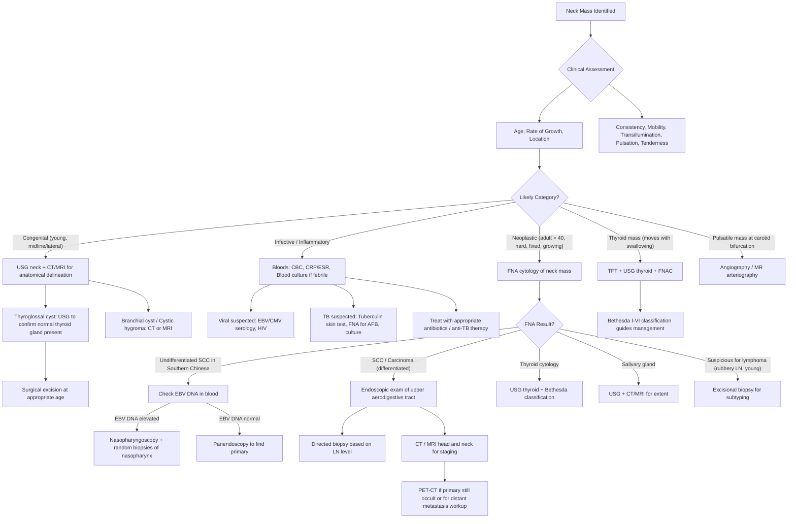

## Diagnostic Criteria, Diagnostic Algorithm, and Investigation Modalities for Neck Mass

### 1. Diagnostic Criteria — General Principles

There is no single set of formal "diagnostic criteria" for a neck mass the way there is for, say, rheumatoid arthritis or diabetes. Instead, the diagnosis of a neck mass is a **stepwise clinical process** that integrates:

1. **Clinical assessment** — age, location, clinical features of the mass
2. **Cytological/pathological assessment** — FNA, core biopsy, or excisional biopsy
3. **Radiological assessment** — imaging to characterise the mass, find a primary tumour (if metastatic), and stage disease

> ***"Diagnosis: age, location & clinical features. Investigation: imaging, FNA, excision. Treatment: nature of pathology."*** [8]

The key concept is that the diagnostic approach varies depending on the clinical suspicion generated by the initial assessment. You do not investigate every neck mass the same way.

---

### 2. Diagnostic Algorithm

The overarching logic:

1. **First**, clinically characterise the mass (age + location + features → generate a differential).
2. **Second**, do FNA — it is the single most important first-line investigation for most neck masses.
3. **Third**, image based on the suspected pathology.
4. **Fourth**, if metastatic LN is suspected, find the primary.
5. **Fifth**, only excise the node as a last resort (or if lymphoma is suspected).

> ***"Fine needle aspiration cytology is useful in the diagnosis of neck swelling. This should be done for most neck masses and the associated morbidity is low."*** [1]

> ***"Endoscopic examination is an essential part of evaluation of patients with neck mass. When a metastatic cervical lymph node was suspected, then endoscopic examination of the upper aerodigestive tract is mandatory."*** [1]

> ***"Computed tomography or magnetic resonance imaging may give additional clues to the diagnosis of the neck mass such as a neurofibroma or salivary gland tumour. In case of metastatic lymph node, the extent of disease may be determined and this helps the planning of surgery. Angiography or magnetic resonance arteriography is useful when carotid body tumour is suspected."*** [1]

---

### 3. Investigation Modalities — Detailed Breakdown

The investigations for a neck mass can be categorised into **bedside/blood tests**, **imaging**, and **pathological tests**. The order matters clinically.

#### 3.1 Bedside and Blood Tests

| Investigation | When to Order | Key Findings / Interpretation |
|---|---|---|
| **CBC with differentials** [2] | All patients | Leukocytosis → infective/inflammatory. Lymphocytosis → viral (EBV mono). Eosinophilia → Kimura's disease, parasitic. Pancytopenia → marrow infiltration (lymphoma, leukaemia). Neutropenia → Kikuchi's disease |
| **Inflammatory markers (ESR, CRP)** [2] | Suspected infection/inflammation | Elevated in systemic infection, TB, inflammatory conditions. Very high ESR can suggest lymphoma or TB |
| **Blood culture** [2] | Febrile patients | Identify bacteraemia if deep neck space infection |
| **Tuberculin skin test / IGRA** [2] | Suspected TB lymphadenitis | Positive TST/IGRA supports TB diagnosis. Note: can be falsely negative in immunosuppressed patients. IGRA (QuantiFERON) more specific (not affected by BCG vaccination) |
| **EBV and CMV serology** [2] | Young patients, suspected viral, or suspected NPC | EBV VCA IgM → acute infection (mono). For NPC: ***sustained rise in IgA to both VCA and EA (↑ EBV VCA-IgA and EBV EA-IgA)*** [4]. EBV-specific serological screening has low specificity for NPC but elevated titre may precede diagnosis by up to 10 years [4] |
| ***Plasma EBV DNA*** [4] | ***Southern Chinese with undifferentiated SCC on FNA*** [1] | ***Detected by PCR. Diagnostic and staging evaluation for prognosis. Pre-treatment levels correlate with outcomes. Post-treatment levels evaluate treatment response and detect recurrence*** [4]. If elevated → nasopharyngoscopy + random biopsies of nasopharynx |
| **HIV serology** [2] | Risk factors present, bilateral parotid cysts, unexplained lymphadenopathy | HIV-associated lymphadenopathy, lymphoepithelial cysts of parotid, increased risk of lymphoma |
| **Autoantibodies (Anti-Ro/SSA, Anti-La/SSB)** [2] | Suspected Sjögren's syndrome causing periparotid/submandibular masses | Positive → supports Sjögren's diagnosis. Bilateral parotid enlargement + dry eyes + dry mouth |
| **Thyroid function test (TFT)** [5][9] | ***Routine for all patients with thyroid mass*** [5] | ***Serum TSH is the most sensitive indicator of thyroid function*** [4]. ↓ TSH → hyperthyroid → consider toxic nodule/MNG → order thyroid scintigraphy. Normal TSH → euthyroid → proceed to USG + FNA. ↑ TSH → hypothyroid → consider Hashimoto's |
| **Serum Ca²⁺ and PO₄³⁻** [4] | Thyroid mass, post-thyroidectomy, suspected medullary thyroid CA | Hypercalcaemia → malignancy or co-existing parathyroid hyperplasia (MEN2). Hypocalcaemia → parathyroid compromise |
| **Serum thyroglobulin** [4] | Differentiated thyroid carcinoma | Baseline tumour marker. Used to monitor recurrence after total thyroidectomy. Anti-thyroglobulin antibodies must be measured simultaneously (can interfere with assay) |
| **Serum calcitonin** [4][5] | Suspected medullary thyroid CA | ***95% of MTC produces calcitonin*** [4]. Levels > 500 pg/mL suggest metastatic disease → order CT TAP + bone scan [5] |
| **Serum CEA** [4] | Medullary thyroid CA | ***80% of MTC produces CEA*** [4]. Used alongside calcitonin for monitoring |
| **Genetic testing (RET mutation)** [4] | All patients with MTC | All MTC patients should be tested for RET mutation. If positive → genetic counselling + family screening for MEN2 |

<Callout title="Routine Thyroid Investigation Set" type="idea">
***Routine for all patients with thyroid nodule: History + Physical exam, TFT, USG thyroid ± FNAC.*** [5] Thyroid scan is ONLY for patients with ↓ TSH (toxic) + nodules. CT is ONLY for retrosternal goitre or locally advanced thyroid cancer. ***PET scan has no diagnostic role at all in routine thyroid nodule work-up.*** [5]
</Callout>

#### 3.2 Imaging Studies

***"Investigations: Fine needle aspiration - cytology. Endoscopic examination: sites of possible primary tumour in the upper aerodigestive tract, biopsy if indicated. Imaging studies: plain x-rays, computed tomography (CT) or magnetic resonance imaging (MRI) or angiography. Positron Emission Tomography (PET)."*** [8]

##### 3.2.1 Ultrasound (USG) of Neck

**Why USG first?** It is non-invasive, radiation-free, widely available, provides real-time assessment, and can guide FNA. It is the **first-line imaging** for almost all neck masses.

**Roles** [2][5][7]:
- ***Confirm origin of mass*** [7] — is it thyroid, salivary gland, lymph node, or something else?
- ***Enlarged neck lymph nodes*** — number, size, level, sonographic features [7]
- ***Stones and dilated ducts*** — sialolithiasis [7]
- **Thyroid-specific**: assess size of goitre, number of nodules, suspicious features, cervical LN (especially deep level VI nodes), retrosternal extension, and guide FNAC [5]

**Sonographic features suspicious for malignancy in thyroid nodules** — Mnemonic: ***"SHIT CME"*** [5]:

| Feature | What it means | Why suspicious |
|---|---|---|
| ***S — Solid nodule*** | No cystic component | Solid nodules have higher malignancy risk than cystic ones |
| ***H — Hypoechoic*** | Darker than surrounding thyroid tissue | Most thyroid carcinomas are hypoechoic because the densely packed malignant cells reflect less ultrasound |
| ***I — Irregular margin*** | Infiltrative, microlobulated borders | Suggests invasion into surrounding tissue (loss of smooth capsule) |
| ***T — Taller than wide*** | AP diameter > transverse diameter | Growth against tissue planes → aggressive behaviour |
| ***C — Chaotic central vascularity*** | Disorganised blood flow within the nodule | Neoangiogenesis — tumours need new blood supply and it is disorganised |
| ***M — Microcalcifications*** | Tiny punctate echogenic foci without acoustic shadowing | Represent psammoma bodies (especially papillary CA) — laminated calcified structures from tumour cell death |
| ***E — Extrathyroidal extension*** | Tumour extends beyond the thyroid capsule | T4 staging, invading strap muscles, trachea, RLN, oesophagus |

> ***Most important features are solid and hypoechoic*** [5]

**Sonographic features of malignant lymph nodes** [4]:
- Large > 2 cm
- Round shape (taller than wide, loss of the normal oblong/kidney-bean shape)
- Heterogeneous, hypoechoic
- Loss of central fatty hilum (normal LN have a bright echogenic hilum from hilar fat)
- Microcalcification within LN
- Intranodal cystic or coagulative necrosis

**Sonographic criteria for FNA of thyroid nodules** (based on ATA/Bethesda guidelines) [4][5]:

| Sonographic Pattern | USG Findings | Risk of Malignancy | Size Cut-off for FNA |
|---|---|---|---|
| **High suspicion** | Solid hypoechoic nodule ± ≥1 suspicious feature (microcalcifications, rim calcification with soft tissue extrusion, taller than wide, irregular margins, extrathyroidal extension) | > 70–90% | ≥ 1 cm |
| **Intermediate suspicion** | Hypoechoic solid nodule WITHOUT microcalcifications, taller than wide, or extrathyroidal extension | 10–20% | ≥ 1 cm |
| **Low suspicion** | Isoechoic or hyperechoic solid nodule, or partially cystic nodule with eccentric solid areas, WITHOUT suspicious features | 5–10% | ≥ 1.5 cm |
| **Very low suspicion** | Partially cystic nodule without suspicious features, spongiform appearance | ≤ 3% | ≥ 2 cm (or observe) |
| **Benign** | Purely cystic nodule | ≤ 1% | No biopsy |

> Note: In practice, all palpable nodules tend to be aspirated regardless of size cut-off [5].

**USG features: High risk vs Low risk of thyroid cancer** [4]:

| Feature | High Risk | Low Risk |
|---|---|---|
| Echogenicity | Hypoechoic | Hyperechoic |
| Calcifications | Microcalcifications | Large coarse calcifications |
| Shape | Taller than wide | Wider than tall |
| Margins/Appearance | Irregular margins, incomplete halo | Spongiform appearance, comet-tail shadowing |
| Vascularity | Central (chaotic) | Peripheral |

##### 3.2.2 Salivary Gland Ultrasound

***Ultrasound is the first-line investigation for salivary gland masses*** [7]:
- ***Confirm origin of mass*** — is it truly from the parotid/submandibular gland or is it a periparotid LN?
- ***Enlarged neck lymph nodes*** — metastatic LN from salivary malignancy
- ***Stones*** — echogenic focus with posterior acoustic shadowing in duct (submandibular > parotid)
- ***Dilated ducts*** — upstream dilatation proximal to an obstructing stone

##### 3.2.3 CT Scan

**When to order CT** [2][5][7]:
- ***Retrosternal goitre*** — cannot be visualised by USG (ultrasound waves do not penetrate bone/sternum), and surgical planning requires knowing extent of retrosternal extension [5]
- ***Locally advanced thyroid cancer*** — delineation of important structures within cervical fascia [5]
- **Characterisation of mass** and its relation to normal anatomical structures of H&N [2]
- ***Bony invasion*** — CT is superior to MRI for cortical bone assessment [9]
- ***Detection of cervical lymph node metastasis*** [9]
- **Staging** — CT thorax and abdomen for distant metastasis [9]
- **Thyroglossal duct cyst** — ***CT neck with contrast (USG cannot delineate relations with hyoid)*** [5]

**For investigation of malignant salivary gland tumour** [7]:
- ***CT scan: bony invasion, cervical LN*** [7]

##### 3.2.4 MRI Scan

**When to order MRI** [2][7][9]:
- ***Outstanding soft tissue differentiation***, lack of ionizing radiation, and relatively infrequent contrast allergy [2]
- Indicated for masses requiring further definition of soft tissues:
  - ***Infiltrative soft tissue masses*** [2]
  - ***Suspicious malignant perineural spread*** [2] — e.g. adenoid cystic carcinoma of salivary gland tracks along nerves
  - ***Potential CNS origin*** [2]
- ***Imaging modality of choice for cancer of the oral cavity and oropharynx*** — provides optimal visualization of soft-tissue infiltration [9]
- ***Accurate delineation of extent of invasion. May be able to see nerve invasion*** [7]

**Key principle**: CT is better for bone; MRI is better for soft tissue and perineural invasion. They are complementary, not interchangeable.

##### 3.2.5 PET-CT Scan

**When to order PET-CT** [2][7][8]:
- ***Identify primary disease*** when primary is occult after panendoscopy and conventional imaging [2]
- ***Detect distant metastatic disease*** [2][7]
- ***Workup for distant metastasis*** of malignant salivary gland tumour [7]
- **NOT** a routine diagnostic tool for thyroid nodules [5]
- Uses ¹⁸F-fluorodeoxyglucose (FDG) — metabolically active malignant cells take up more glucose → "hot" on PET

##### 3.2.6 Angiography / MR Arteriography

- ***Angiography or MR arteriography is useful when carotid body tumour is suspected*** [1]
- Classic finding: **"lyre sign"** — splaying of the internal and external carotid arteries by the tumour at the bifurcation (like the arms of a lyre/harp)
- Also used for pre-operative embolisation of highly vascular tumours (carotid body tumour, paraganglioma)

##### 3.2.7 Thyroid Scintigraphy (Radionuclide Scan)

***Thyroid scan is only ordered in the setting of low TSH (toxic/hyperthyroid) + nodules*** [5] — to determine the functional status of the nodule.

| Finding | Interpretation | Clinical Implication |
|---|---|---|
| ***Hot nodule*** (uptake > surrounding tissue) | Hyperfunctioning, autonomously producing thyroid hormone | ***Rarely malignant*** → does **NOT** require FNA [4] |
| ***Cold nodule*** (uptake < surrounding tissue) | Hypofunctioning, not producing thyroid hormone | ***10–20% risk of malignancy*** → requires FNA if sonographic criteria are met [4] |

Why this logic? A hot nodule is autonomously producing thyroid hormone, meaning the cells are functionally differentiated — functional thyroid cells that are actively making thyroglobulin and iodine-trapping are very unlikely to be malignant. A cold nodule has cells that are NOT functioning normally — this may be because they are undifferentiated (malignant) or simply non-functional (colloid cyst, adenoma).

##### 3.2.8 Other Imaging

- **CXR**: screening for lung metastasis (NPC, thyroid CA) or primary lung carcinoma causing cervical LN metastasis [4]
- **Bone scan**: screening for bone metastasis — particularly for medullary thyroid CA with calcitonin > 500 [5], and NPC (bone is the most common distant metastatic site at 75%) [4]

#### 3.3 Endoscopic Examination

***"Endoscopic examination is an essential part of evaluation of patients with neck mass. When a metastatic cervical lymph node was suspected, then endoscopic examination of the upper aerodigestive tract is mandatory. Depending on the location of the lymph node, the possible sites of the primary tumour should be carefully examined and biopsied when indicated."*** [1]

| Endoscopic Method | When / Why | Key Findings |
|---|---|---|
| **Flexible nasolaryngoscopy** | Office-based. All patients with neck mass + voice change or suspected laryngeal/NPC pathology | Assess vocal cord mobility (RLN palsy), visualise nasopharynx (NPC), laryngeal masses |
| ***Nasopharyngoscopy*** [4] | NPC suspected (Southern Chinese, EBV DNA elevated, level II bilateral LN) | ***Definitive diagnosis is made by endoscope-guided biopsy of primary tumour*** [4]. Random biopsies of nasopharynx if no visible lesion but clinical suspicion high [1] |
| ***Panendoscopy*** | Suspected metastatic SCC from aerodigestive tract | Includes direct laryngoscopy + bronchoscopy + OGD. Examines entire upper aerodigestive tract for primary tumour + synchronous second primaries (field cancerisation from shared risk factors — smoking, alcohol) |
| **Examination under anaesthesia (EUA)** | When office-based scope is insufficient | ***Endoscopic examination and/or even examination under anaesthesia should be carried out*** [1]. Allows thorough examination + biopsy of pharynx, larynx, oral cavity |

> ***"We are seeing an increasing number of patients with carcinoma of tonsil and tongue base presenting with metastatic neck lymph node. Fine needle aspiration (FNA) is done whenever the diagnosis is suspected."*** [1]

**Why panendoscopy?** Patients with one H&N cancer (driven by smoking + alcohol) are at high risk for **synchronous** (within 6 months) or **metachronous** second primaries elsewhere in the aerodigestive tract (the "field cancerisation" concept — the entire aerodigestive mucosa has been exposed to the same carcinogens). Panendoscopy screens for this.

#### 3.4 Pathological Tests

##### 3.4.1 Fine Needle Aspiration (FNA) Cytology

***"Fine needle aspiration cytology is useful in the diagnosis of neck swelling. This should be done for most neck masses and the associated morbidity is low."*** [1]

- **Method**: 21-25G needle, direct palpation or under USG/CT guidance [2]
- **What it provides**:
  - Cytological analysis — morphology of aspirated cells
  - PCR testing for virus: ***EBV for NPC, HPV for oropharyngeal SCC*** [2]
  - Immunocytochemistry (p16 as surrogate for HPV)
- **What it does NOT provide**: ***does NOT provide material for tissue architecture or immunohistochemical analysis*** [2] — this is why FNA alone is insufficient for lymphoma subtyping (you need tissue architecture to classify Hodgkin vs Non-Hodgkin, and specific subtypes)
- **Complications**: pain, bleeding, false negative [5]

**FNA for thyroid nodules — Bethesda Classification** [4][5]:

| Bethesda Class | Diagnostic Category | Cancer Risk | Recommended Management |
|---|---|---|---|
| **I** | Non-diagnostic / Unsatisfactory | 1–4% | Repeat FNA |
| **II** | Benign | 0–3% | Clinical follow-up |
| **III** | Atypia of undetermined significance (AUS) / Follicular lesion of undetermined significance (FLUS) | 5–15% | Repeat FNA (or molecular testing) |
| **IV** | Follicular neoplasm / Suspicious for follicular neoplasm | 15–30% | Surgical lobectomy (diagnostic hemithyroidectomy) |
| **V** | Suspicious for malignancy | 60–75% | Surgical lobectomy ± frozen section → total thyroidectomy |
| **VI** | Malignant | 97–99% | Total thyroidectomy |

Why can't FNA distinguish follicular adenoma from follicular carcinoma? Because the difference between them is **capsular or vascular invasion** — a histological architectural diagnosis that requires seeing the capsule-tumour interface on whole-tissue sections. FNA aspirates individual cells, so you get identical-looking follicular cells from both adenoma and carcinoma. This is why Bethesda IV requires **diagnostic lobectomy** — you need the entire specimen with capsule intact for the pathologist to assess invasion [5].

##### 3.4.2 Core Needle Biopsy

- Provides a tissue core → allows assessment of tissue architecture + immunohistochemistry
- Useful when FNA is non-diagnostic or when lymphoma is suspected (intermediate step before excisional biopsy)
- **Risks**: bleeding, nerve injury, tumour seeding [2]

##### 3.4.3 Excisional / Incisional Biopsy

> ***"Lymph node should be investigated first rather than excised."*** [1]

> ***"Excisional biopsy of the lymph node is only done as a last resort or when the diagnosis of lymphoma is suspected."*** [1]

- ***Discouraged*** as first-line because it can adversely affect subsequent surgical resection by **field contamination** in cases of metastatic carcinoma [2]
- **Indications**:
  - ***Lymphoma suspected*** — excision necessary for fresh tissue for subtyping (flow cytometry, immunohistochemistry on architectural sections) [1]
  - FNA and core biopsy repeatedly non-diagnostic
  - ***Incision nodal biopsy or nodal dissection should be avoided in NPC since it will negatively impact subsequent treatment*** [4]

<Callout title="FNA vs Excisional Biopsy — When to Use Which" type="error">
A common exam mistake is to jump straight to excisional biopsy of a neck node. The correct approach:
1. **FNA first** for almost everything — low morbidity, gives cytological clue.
2. If FNA suggests **metastatic SCC** → find the primary (endoscopy), do NOT excise the node.
3. If FNA suggests **lymphoma** or is repeatedly non-diagnostic → **excisional biopsy** is justified to obtain tissue architecture for subtyping.
4. If FNA shows **undifferentiated SCC in a Southern Chinese patient** → check EBV DNA → nasopharyngoscopy. Do NOT excise the node first.
</Callout>

#### 3.5 Investigation of Malignant Salivary Gland Tumour

This deserves a separate mention because the lecture emphasises a specific stepwise approach [7]:

| Modality | Role |
|---|---|
| ***Bedside USG*** [7] | ***Tumour vs inflammation. Location of tumour. Cervical LN.*** |
| ***CT scan*** [7] | ***Bony invasion. Cervical LN.*** |
| ***MRI*** [7] | ***Accurate delineation of extent of invasion. May be able to see nerve invasion.*** |
| ***PET-CT*** [7] | ***Workup for distant metastasis.*** |
| **FNA / Core biopsy** [2] | Cytology/histology. Can usually discriminate benign from malignant tumours and metastasis but is less specific in exact tumour type. Tissue diagnosis required before definitive treatment whenever possible. |

#### 3.6 Investigation of Thyroglossal Duct Cyst

| Investigation | Purpose |
|---|---|
| ***CT neck with contrast*** [5] | ***USG cannot delineate relations with hyoid*** — CT is needed to show the relationship of the cyst to the hyoid bone and the tract extending to the foramen cecum |
| ***USG ± FNAC*** [5] | ***Confirm presence of normal thyroid gland*** — this is critical because in thyroid ectopia (lingual thyroid), the thyroglossal duct remnant may contain the only functioning thyroid tissue. Removing it without confirming normal thyroid tissue exists elsewhere → iatrogenic hypothyroidism |

---

### 4. Specific Diagnostic Algorithms by Clinical Scenario

#### 4.1 Approach to a Suspected Metastatic Cervical Lymph Node

***"When a metastatic cervical lymph node is suspected, endoscopic examination and/or even examination under anaesthesia should be carried out. Every effort should be spent to locate the primary tumour."*** [1]

***"In southern Chinese, when fine needle aspiration showed undifferentiated squamous cell carcinoma, one of the differential diagnoses is lymph node metastasis from nasopharyngeal carcinoma. EBV DNA in blood should be checked. If it is elevated, endoscopic examination and random biopsies of the nasopharynx are indicated."*** [1]

**Step-by-step**:

1. **FNA of the neck node** → cytology + immunohistochemistry + viral markers (EBV EBER, HPV p16)
2. **Direct the search by LN level** [2]:
   - Level I or II → Oral cavity, oropharynx, NPC
   - Level III or IV → Larynx, hypopharynx, thyroid
   - Level II or V → Nasopharynx
   - Supraclavicular → GIT, lung, gynaecological sources
3. **Blood**: EBV DNA (if Southern Chinese + undifferentiated SCC), TFT (if level VI node)
4. **Endoscopy**: Nasopharyngoscopy, panendoscopy with directed biopsies
5. **Imaging**: CT or MRI head and neck (extent of disease, surgical planning), CT TAP (distant metastasis), PET-CT (occult primary)
6. **Excisional biopsy** — only as last resort, or if lymphoma is suspected

#### 4.2 Approach to a Thyroid Nodule

***Routine for all patients: TFT, thyroid USG, FNAC*** [5]

1. **TFT** → TSH
   - If ↓ TSH → thyroid scintigraphy to identify hot/cold nodule
   - If normal/↑ TSH → proceed to USG + FNA
2. **USG** → characterise nodule (SHIT CME features), assess cervical LN, guide FNA
3. **FNAC** → Bethesda classification (I-VI)
4. **CT** → only if retrosternal goitre or locally advanced CA thyroid [5]
5. **Additional for medullary thyroid CA**: calcitonin, CEA, RET mutation testing, 24h urine metanephrines (to rule out phaeochromocytoma in MEN2), Ca/PTH [5]

<Callout title="Why Not Thyroid Scan for Everyone?">
Thyroid scintigraphy is only useful when you suspect a functioning (toxic) nodule — i.e. when TSH is suppressed. In a euthyroid patient, a thyroid scan adds nothing because you already know the nodule is not autonomously producing hormone. It would be a waste of resources and radiation exposure. The USG + FNA combination is far more informative for cancer risk stratification. [5]
</Callout>

---

### 5. Summary Table of Key Investigations by Condition

| Condition | First-Line | Second-Line | Pathological | Special |
|---|---|---|---|---|
| **Reactive LN** | Clinical + CBC, CRP | USG if persistent | FNA if alarming features | EBV/CMV serology if viral |
| **TB LN** | Tuberculin/IGRA, CXR | USG + FNA for AFB/culture | Excisional biopsy if needed (caseating granuloma) | Anti-TB therapy |
| **Metastatic SCC LN** | ***FNA*** | ***Endoscopy (mandatory)*** | Directed biopsy of primary | ***CT/MRI, PET-CT, EBV DNA*** |
| **NPC** | EBV VCA-IgA, EBV DNA | Nasopharyngoscopy + biopsy | Histology (WHO classification) | MRI nasopharynx/skull base, PET-CT |
| **Lymphoma** | CBC, LDH, β2-microglobulin | CT TAP | ***Excisional biopsy*** (not FNA alone) | Bone marrow biopsy for staging |
| **Thyroid nodule** | ***TFT, USG, FNAC*** | Thyroid scan (if ↓ TSH) | Bethesda classification | CT if retrosternal/locally advanced |
| **Salivary gland mass** | ***USG*** | ***CT (bone), MRI (soft tissue/nerve)*** | FNA/core biopsy | ***PET-CT (distant metastasis)*** |
| **Thyroglossal cyst** | ***CT neck with contrast*** | ***USG to confirm normal thyroid*** | FNAC if solid component | — |
| **Branchial cyst** | USG, CT/MRI | — | FNA (cholesterol crystals in aspirate) | — |
| **Carotid body tumour** | USG (Doppler) | ***Angiography / MR arteriography*** | FNA generally avoided (vascular, risk of bleeding) | Pre-op embolisation |

---

<Callout title="High Yield Summary">

**Investigation triad for neck mass**: ***Imaging + FNA + Excision (only as last resort)*** [8].

**FNA is first-line for most neck masses** — low morbidity, gives cytological clue. It does NOT provide tissue architecture (cannot subtype lymphoma).

**Endoscopy is mandatory when metastatic LN is suspected** — examine the entire upper aerodigestive tract (panendoscopy = direct laryngoscopy + bronchoscopy + OGD).

**Southern Chinese + undifferentiated SCC on FNA → check EBV DNA → if elevated → nasopharyngoscopy + random biopsies of nasopharynx** (r/o NPC).

**Thyroid nodule work-up**: TFT + USG + FNAC (routine). Thyroid scan only if ↓ TSH. CT only if retrosternal goitre or locally advanced CA.

**USG thyroid suspicious features**: SHIT CME (Solid, Hypoechoic, Irregular margin, Taller than wide, Chaotic central vascularity, Microcalcifications, Extrathyroidal extension). Most important = **solid and hypoechoic**.

**Bethesda classification**: I (non-diagnostic → repeat), II (benign → follow-up), III (AUS → repeat FNA), IV (follicular neoplasm → lobectomy), V (suspicious → lobectomy ± total), VI (malignant → total thyroidectomy).

**Hot nodule = rarely cancer (no FNA needed). Cold nodule = 10-20% cancer risk (FNA if sonographic criteria met).**

**Salivary gland mass investigation**: USG first → CT (bone invasion) → MRI (soft tissue/nerve invasion) → PET-CT (distant metastasis).

**Never excise a metastatic LN first** — find the primary. Excisional biopsy only for lymphoma or as last resort.

</Callout>

---

<ActiveRecallQuiz
  title="Active Recall - Diagnosis and Investigations of Neck Mass"
  items={[
    {
      question: "A 50-year-old Southern Chinese man has a hard level II neck node. FNA shows undifferentiated SCC. What is the next step and why?",
      markscheme: "Check plasma EBV DNA by PCR. If elevated, perform nasopharyngoscopy with random biopsies of nasopharynx to diagnose NPC. NPC is endemic in Southern Chinese, often presents with undifferentiated SCC in metastatic cervical LN. EBV DNA level has diagnostic, prognostic and monitoring value."
    },
    {
      question: "What does the mnemonic SHIT CME stand for in thyroid USG, and which two features are most important?",
      markscheme: "S = Solid nodule, H = Hypoechoic, I = Irregular margin, T = Taller than wide, C = Chaotic central vascularity, M = Microcalcifications, E = Extrathyroidal extension. The two most important features are Solid and Hypoechoic."
    },
    {
      question: "Why is excisional biopsy of a cervical lymph node generally avoided as a first-line investigation, and in what situation is it specifically indicated?",
      markscheme: "Excisional biopsy causes field contamination by tumour cell spillage, which adversely affects subsequent definitive surgical resection (e.g. neck dissection). It is specifically indicated when lymphoma is suspected, because FNA cannot provide the tissue architecture and immunohistochemistry needed for lymphoma subtyping. It is also used as a last resort when FNA and core biopsy are non-diagnostic."
    },
    {
      question: "A thyroid nodule FNA is reported as Bethesda IV (follicular neoplasm). What is the recommended management and why can FNA not distinguish follicular adenoma from carcinoma?",
      markscheme: "Management: diagnostic surgical lobectomy (hemithyroidectomy). FNA cannot distinguish adenoma from carcinoma because the distinction requires assessment of capsular or vascular invasion on whole-tissue histological sections, which needs the intact capsule-tumour interface. FNA only aspirates individual cells and cannot assess tissue architecture."
    },
    {
      question: "When should you order a thyroid scintigraphy scan, and what is the significance of a hot vs cold nodule?",
      markscheme: "Order thyroid scan only when TSH is suppressed (low TSH = hyperthyroid/toxic). Hot nodule (uptake greater than surrounding) = hyperfunctioning, rarely malignant, does NOT require FNA. Cold nodule (uptake less than surrounding) = hypofunctioning, 10-20% cancer risk, requires FNA if sonographic criteria are met."
    },
    {
      question: "List the stepwise investigation approach for a suspected malignant salivary gland tumour as taught in the lecture.",
      markscheme: "1) Bedside USG: tumour vs inflammation, location, cervical LN. 2) CT scan: bony invasion, cervical LN. 3) MRI: accurate delineation of extent of invasion, may see nerve invasion. 4) PET-CT: workup for distant metastasis. 5) FNA or core biopsy for cytology/histology before definitive treatment."
    }
  ]}
/>

---

## References

[1] Lecture slides: GC 218. I have a swelling in the neck Neck mass (Notes).pdf
[2] Senior notes: felixlai.md (Neck mass differential diagnosis and investigations section, pp. 200–206)
[4] Senior notes: felixlai.md (NPC diagnosis section; Thyroid cancer diagnosis section)
[5] Senior notes: maxim.md (Thyroid section, 9.1 — investigations, thyroglossal cyst, thyroid cancer)
[7] Lecture slides: GC 217. Facial nerve palsy and salivary gland diseases.pdf
[8] Lecture slides: GC 218. I have a swelling in the neck Neck mass.pdf
[9] Senior notes: felixlai.md (Oropharyngeal cancer diagnosis section)
