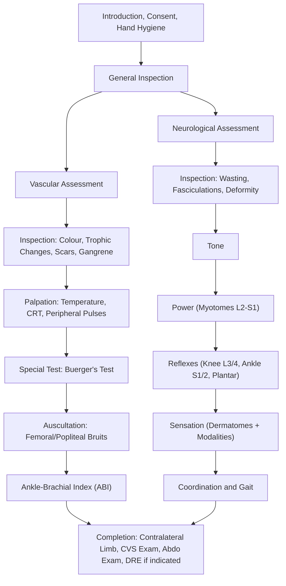

# Neurovascular Examination of the Lower Limb

## Overview and Context

The "neurovascular examination of the lower limb" is a combined assessment of both the **neurological** (motor, sensory, reflexes) and **vascular** (arterial perfusion, venous return) status of the leg. It is one of the most commonly tested OSCE stations at HKUMed because it is performed in virtually every orthopaedic, vascular surgery, and emergency setting — especially after trauma, fractures, joint arthroplasty, and in the context of peripheral arterial disease (PAD) or diabetic complications [1][2][3].

The key principle: **you are assessing whether the limb is viable** — does it have adequate blood supply, and is the nerve supply intact? Failure to detect neurovascular compromise post-operatively (e.g. after total knee arthroplasty) is tantamount to missing the need for urgent intervention [4].

---

## Master Examination Framework

---

## General Approach — The 3Cs + 1H

Before touching the patient:

1. **Introduce yourself**: "Good morning, my name is Dr [Name], I am the doctor looking after you today."
2. **Consent**: "I would like to examine the blood supply and nerves in your legs. Is that okay?" 「我想檢查你雙腳嘅血液循環同神經功能，可以嗎？」
3. **Confirm** identity (name and date of birth).
4. **Hand hygiene**: "I would wash my hands before starting."

**Positioning**: Supine, in a warm room [1][2].
**Exposure**: Both lower limbs from groin to toes — ask the patient to change into shorts or underwear. 「可唔可以除低褲管，露出雙腳由大髀到腳趾？」

<Callout title="Why a warm room?" type="idea">
Cold causes peripheral vasoconstriction that artificially makes the limb feel cool and pulses harder to palpate. Always examine in a warm environment to avoid false positive findings of vascular insufficiency.
</Callout>

---

## Part 1: General Inspection

**Running commentary**: *"I would first like to inspect the patient and the surrounding environment."*

### Bedside

| What to look for | Significance |
|---|---|
| IV drip, anticoagulant infusion | Ongoing treatment for limb ischaemia or DVT |
| O₂ supplementation | Cardiorespiratory comorbidity |
| Pressure stocking / TED stockings | DVT prophylaxis or chronic venous insufficiency |
| Heel protectors / splints | Protecting pressure areas from ischaemic ulceration |
| Urinary catheter | May indicate spinal cord pathology (neurogenic bladder) [3] |
| Smoking/tar stains on fingers | ***Major risk factor for peripheral vascular disease*** [1][2] |

### Patient at First Glance

- **Pain** at rest — ask: "Are you in any pain right now?" 「你而家有冇痛？」 Rest pain suggests critical limb ischaemia (ABI < 0.4) [1].
- **Dyspnoea** — congestive heart failure is associated with poor peripheral perfusion.
- **Body habitus** — cachexia (chronic disease), obesity (metabolic syndrome/DM).
- **Pallor, jaundice, central cyanosis** — systemic indicators.

---

## Part 2: Vascular Assessment

### A. Inspection

**Running commentary**: *"I will now inspect both lower limbs, comparing them side-by-side, looking especially at the pressure areas — the metatarsal heads, between the toes, tips of the toes, and the heel."*

#### Colour of the Limbs

| Colour | Interpretation | Pathophysiology |
|---|---|---|
| ***White/pale*** | ***Advanced ischaemia*** | Insufficient arterial inflow to perfuse capillary bed [1][2] |
| ***Red*** | ***Vasodilatation of microcirculation*** | Impaired vasoregulation in chronically ischaemic tissue [1][2] |
| ***Blue/cyanotic/sunset hue*** | ***Excessive deoxygenation*** | Stagnated deoxygenated blood due to arterial insufficiency [1][2] |
| ***Mottled*** | ***Prolonged acute limb ischaemia*** | Fixed livedo from microvascular thrombosis [2] |
| ***Black*** | ***Gangrene*** | Tissue necrosis from complete ischaemia [1] |

#### Trophic Changes

These reflect **chronic nutritional impairment** of the skin and appendages due to poor arterial supply and/or autonomic neuropathy [1][2]:

- **Hair loss** — especially over dorsum of toes
- **Dry, shiny, atrophic (thinning) of skin** — autonomic neuropathy
- ***Brittle, ridged, hypertrophied (thickened) nails***
- **Pointed toes** / muscle atrophy
- ***Diabetic dermopathy***: atrophic red-brown hyperpigmented papules on shin [2]
- ***Charcot joint***: chronic progressive destructive neuropathic arthropathy due to nerve denervation → joint deformity [5]

#### Scars

Look specifically for [1][2]:
- **Endovascular access scars** over bilateral groins (transfemoral catheterisation for angiography)
- **Femoropopliteal bypass scars**: long longitudinal scar — remember to palpate posteriorly as well
- **Venous grafting scars** along the course of the great saphenous vein (medial leg)
- **CABG scar** (sternotomy + radial/saphenous harvest sites)

#### Ulcers and Gangrene

- Note **location**, **size**, **depth**, **edge** characteristics, **base** (slough, granulation, bone), and **surrounding skin**.
- **Dry gangrene**: hard, black, desiccated, clear demarcation line — chronic ischaemia [1]
- ***Wet gangrene***: soft, moist, swollen, infected — no clear demarcation — ***surgical emergency requiring debridement or amputation*** [1]

#### Amputation

Note any previous amputations (auto-amputation or surgical) — classify the level: toe disarticulation, ray amputation, forefoot (Lisfranc/Chopart), Syme's, BKA, AKA [2].

---

### B. Palpation

<Callout title="Always ask about pain first!" type="error">
Before touching: "Do you have any pain or tenderness anywhere in your legs?" 「你隻腳有冇邊度痛？」 This is a common OSCE pitfall — marks are deducted for not asking before palpation.
</Callout>

#### i. Temperature

**How**: Use the **dorsum of the hands** (more sensitive to temperature) [1]. Run both hands simultaneously from the feet upwards to the shin and thighs. Compare sides.

**Running commentary**: *"I am now using the back of my hands to feel the temperature, comparing both sides simultaneously and working from distal to proximal."*

| Finding | Interpretation |
|---|---|
| Symmetrically warm | Normal |
| Unilaterally cool | Arterial insufficiency on that side |
| Cool with a clear demarcation level | Level of arterial occlusion is approximately at that transition point |

**Pathophysiology**: Arterial blood carries body heat to the periphery. When arterial supply is compromised, the tissues distal to the occlusion become cool.

#### ii. Capillary Refill Time (CRT)

**How**: Press firmly on the **nail bed of the great toe** (or the pulp of the toe) for 5 seconds, then release. Count how many seconds until the blanched area returns to pink [1][2].

**Running commentary**: *"I am pressing on the big toenail for a few seconds and observing the capillary refill time... The refill time is approximately [X] seconds."*

| Finding | Interpretation |
|---|---|
| < 2 seconds | Normal |
| > 2 seconds | Inadequate peripheral perfusion |

**Pathophysiology**: CRT reflects the adequacy of capillary bed perfusion. Prolonged CRT indicates either reduced arterial inflow, vasoconstriction, or increased venous pressure.

#### iii. Peripheral Pulses

**How**: Palpate from **proximal to distal**, comparing bilaterally [1][2]:

1. ***Femoral pulse***: Mid-inguinal point (midway between ASIS and pubic symphysis)
   - "I am now palpating the femoral pulse at the mid-inguinal point." 「我而家會摸你大髀內側嘅脈搏。」
2. ***Popliteal pulse***: With knee slightly flexed (60–90°), compress the distal popliteal fossa against the posterior aspect of the tibia using thumbs of both hands
   - This is the **most difficult pulse to locate** — a common OSCE failure point
3. ***Posterior tibial pulse***: 1/3 of the way down from the medial malleolus towards the heel (posterior and inferior to medial malleolus) [1][2]
4. ***Dorsalis pedis pulse***: Dorsum of foot, 1/3 of the way down from midpoint between two malleoli to the 1st webspace, lateral to the extensor hallucis longus tendon
   - Ask patient to dorsiflex the big toe 「請將大趾腳趾向上指」to identify the EHL tendon, then palpate just lateral to it [2]

**Grading**: Exaggerated (+++), normal (++), reduced (+), absent (-) [2]

**Running commentary**: *"The femoral pulse is strong bilaterally. The popliteal pulse is palpable on the right but absent on the left. Both posterior tibial and dorsalis pedis pulses are absent on the left. This pattern is consistent with a left superficial femoral or popliteal artery occlusion."*

**Why proximal to distal**: If the femoral pulse is absent, checking distally is academic — the occlusion is at the aortoiliac level. If femoral is present but distal pulses are absent, the disease is more distal (femoropopliteal or tibial).

<Callout title="Popliteal Pulse Technique" type="idea">
The most common reason students "can't feel it" is insufficient knee flexion and not pressing deep enough. Have the patient fully relax, bend the knee to about 60-90°, and use both thumbs to compress firmly against the tibia posteriorly. In exams, if you can't feel it, say so honestly — "I am unable to palpate the popliteal pulse, which may suggest popliteal artery disease or may be difficult to palpate due to body habitus."
</Callout>

#### iv. Palpation of Ulcers (if present)

- **Swelling**, **surrounding tissue tenderness** (infection), **bogginess** (abscess), **discharge** [2]

---

### C. Special Vascular Tests

#### Buerger's Test (Elevation-Pallor-Dependent-Rubor)

This is a **high-yield bedside test for critical limb ischaemia** [1][2][6].

**Technique**:
1. Ask the patient to lie as close to the edge of the bed as possible with legs straight.
2. Hold the heel and slowly raise **both lower limbs together** to 30–45° and hold for 30–60 seconds [2].
3. **Look at the heel** — observe for ***elevation pallor*** (the foot turns pale/white).
4. ***Estimate the Buerger's angle*** — the angle at which the foot becomes pale.
5. Then gently abduct the hip and let the legs swing down over the edge of the bed.
6. Observe for ***dependent rubor*** — the foot turns purple-red due to reactive hyperaemia [1].

**Running commentary**: *"I would now like to perform Buerger's test. I am raising both legs together... At approximately 20 degrees, the left foot has turned pale — this is elevation pallor. I will now lower the legs over the edge of the bed... The left foot is now turning a dusky purple-red colour — this is dependent rubor. Buerger's test is positive on the left."*

| Buerger's Angle | Interpretation |
|---|---|
| > 90° (normal foot remains pink) | Normal |
| ***< 20°*** | ***Severe ischaemia*** [1] |
| 20–30° | Moderate ischaemia |

**Pathophysiology**: In a healthy limb, arterial pressure overcomes gravity even at 90° of elevation. In ischaemia, the arterial pressure is insufficient to perfuse the capillary bed when elevated. When the leg is then lowered (dependent), blood pools in maximally vasodilated capillaries (chronic ischaemic vasodilatation) → dependent rubor [1][2].

**Positive result** = critical limb ischaemia, suggesting ABI < 0.4 [2].

---

### D. Auscultation

**How**: Use the **bell** of the stethoscope over the **femoral artery** (mid-inguinal point) and **adductor canal** (Hunter's canal, medial thigh) [2].

**Running commentary**: *"I will now auscultate over the femoral arteries for any bruits."*

| Finding | Interpretation |
|---|---|
| No bruit | Normal (or complete occlusion) |
| ***Bruit present*** | ***Turbulent flow from arterial stenosis*** |

**Pathophysiology**: Stenosis creates a pressure gradient across the narrowing, producing turbulent flow heard as a bruit. Note: a completely occluded vessel may be silent — absence of bruit does not exclude disease.

---

### E. Ankle-Brachial Index (ABI)

This is the key **objective measurement** to confirm and quantify PAD [1][2][6].

**Technique**:
1. Measure **brachial systolic BP** in both arms using a BP cuff and Doppler probe → take the **higher** reading.
2. Measure **ankle systolic BP** bilaterally using a cuff around the calf and Doppler probe at the dorsalis pedis and posterior tibial arteries → take the **higher** reading for each ankle [2].
3. ABI = Ipsilateral ankle systolic BP ÷ Higher arm systolic BP

| ***ABI Value*** | ***Interpretation*** |
|---|---|
| ***> 1.3*** | ***Calcified (non-compressible) artery — esp. DM/ESRD patients. Use toe-brachial index (TBI) instead*** [2][6] |
| ***0.9–1.3*** | ***Normal*** |
| ***0.4–0.9*** | ***Claudication*** |
| ***< 0.4*** | ***Critical limb ischaemia (rest pain, non-healing ulceration, gangrene)*** [1][2] |

**Running commentary**: *"To complete the vascular assessment, I would like to measure the ankle-brachial index using a handheld Doppler probe."*

---

## Part 3: Neurological Assessment

The neurological examination follows the classical framework: **Inspection → Tone → Power → Reflexes → Sensation → Coordination** [3][7].

### A. Inspection

**Running commentary**: *"I will now inspect the lower limbs for any neurological signs."*

- **Asymmetry or deformity**
- **Muscle bulk**: wasting (LMN lesion or disuse) vs hypertrophy (rare)
- ***Abnormal movements***: fasciculations (LMN — denervation causing spontaneous motor unit firing), tremor
- **Foot drop** posture (L4/L5 lesion — common peroneal nerve palsy)
- **Urinary catheter** → may indicate spinal cord pathology (neurogenic bladder) [3]

---

### B. Tone

**How** [3]:
1. Ask the patient to fully relax. 「放鬆，唔好用力。」
2. **Flex and extend** the knee joint — note resistance.
3. **Roll the leg** from side to side at the knee — in UMN lesion, the foot swings less due to increased tone.
4. **Popliteal lift test**: Lift the leg suddenly with both hands under the popliteal fossa — if tone is increased, the heel will kick upward off the bed.
5. ***Ankle clonus***: Flex the knee to 90°, foot relaxed. Apply sudden and sustained dorsiflexion at the ankle.
   - **Normal** = ≤ 3 beats or none
   - ***Positive (sustained clonus)*** = persistent rhythmic oscillations → UMN lesion [3]

**Running commentary**: *"I am now assessing tone by flexing and extending the knee... Tone feels normal/increased/decreased. I will now check for clonus by dorsiflexing the ankle... There are no beats of clonus."*

| Finding | Interpretation | Pathophysiology |
|---|---|---|
| Hypertonia (clasp-knife) | UMN lesion | Loss of descending inhibition on spinal reflex arc [7] |
| Hypotonia | LMN lesion | Loss of tonic gamma motor neuron input to muscle spindle |
| Sustained clonus ( > 3 beats) | UMN lesion | Uninhibited stretch reflex cycling |

---

### C. Power (Myotomes)

**How**: Test each myotome bilaterally, grading on the **MRC scale** (0–5) [3][7]:

| MRC Grade | Description |
|---|---|
| 0 | No contraction |
| 1 | Flicker of contraction |
| 2 | Movement with gravity eliminated |
| 3 | Movement against gravity |
| 4 | Movement against resistance (4-, 4, 4+) |
| 5 | Normal power |

**Key myotomes for the lower limb**:

| Movement | Nerve Root | Instruction to Patient |
|---|---|---|
| Hip flexion | ***L1/L2*** | "Lift your leg up off the bed while I push down." 「將腳抬起，我會向下壓。」 |
| Hip adduction | ***L2/L3*** | "Squeeze your knees together against my hands." 「將雙膝夾埋。」 |
| Knee extension | ***L3/L4*** | "Kick your leg out straight against my hand." 「踢直隻腳。」 |
| Ankle dorsiflexion | ***L4/L5*** | "Pull your foot up towards you." 「將腳板向上翹。」 |
| Great toe extension | ***L5*** | "Point your big toe up to the ceiling." 「將大趾腳趾向上指。」 |
| Ankle plantarflexion | ***S1/S2*** | "Push your foot down like pressing a pedal." 「將腳板向下踩。」 |
| Hip extension | ***L5/S1*** | "Push your heel into the bed." |
| Knee flexion | ***L5/S1*** | "Bend your knee and pull your heel towards your bottom." 「屈曲膝頭。」 |

***Quick screening tests*** (if the patient is ambulant) [3]:
- **Stand on toes** → tests S1 (gastrocnemius/soleus)
- **Stand on heels** → tests L4/L5 (tibialis anterior)
- **Squat and stand** → tests L3/L4 (quadriceps)

**Running commentary**: *"I am now testing the power in each muscle group... Hip flexion is 5/5 bilaterally. Knee extension is 5/5 on the right but 4/5 on the left..."*

<Callout title="Hoover's Sign" type="idea">
If you suspect functional (non-organic) weakness: during testing of hip extension on the "weak" side, feel for involuntary downward pressure of the contralateral heel (which occurs normally during genuine effort). If absent, this suggests functional weakness [3][7].
</Callout>

---

### D. Reflexes

**How**: Use a tendon hammer. Compare sides [3][7].

| Reflex | Root Level | Technique |
|---|---|---|
| ***Knee jerk (patellar)*** | ***L3/L4*** | Strike the patellar tendon with knee slightly flexed (~30°) and supported by your arm |
| ***Ankle jerk (Achilles)*** | ***S1/S2*** | Dorsiflex the foot slightly and strike the Achilles tendon |
| ***Plantar reflex (Babinski)*** | ***L5/S1*** | Stroke the lateral sole from heel to ball of foot using an orange stick, curving medially across the metatarsal heads |

**Grading**: Absent (-), diminished (+), normal (++), brisk (+++), clonus (++++). If absent, try **reinforcement** (Jendrassik manoeuvre — ask patient to interlock fingers and pull apart 「請將雙手扣住互相拉」) [3].

| Finding | Interpretation | Pathophysiology |
|---|---|---|
| Hyperreflexia + upgoing plantar (extensor response) | UMN lesion | Loss of cortical inhibition → exaggerated spinal reflexes |
| Hyporeflexia/areflexia + downgoing plantar | LMN lesion | Disrupted reflex arc at root/nerve level |
| Absent ankle jerk + hyperreflexic knee jerk | B12 deficiency (subacute combined degeneration) | Combined peripheral neuropathy + corticospinal tract damage [8] |

**Running commentary**: *"The knee jerk is brisk bilaterally. The ankle jerk is diminished on the right. The plantar response is downgoing bilaterally."*

---

### E. Sensation

**How**: Test with the patient's eyes closed 「請閉上眼睛」. Always compare sides and work **distal to proximal**. Test in **dermatomal distribution** [3][7]:

| Modality | Tests | Anatomical Pathway |
|---|---|---|
| **Light touch** | Cotton wool | Anterior spinothalamic tract (and posterior columns) |
| ***Pinprick (pain)*** | Neurotip | ***Lateral spinothalamic tract*** |
| ***Vibration sense*** | 128 Hz tuning fork on bony prominences (great toe → medial malleolus → tibial tuberosity → ASIS) | ***Posterior (dorsal) columns*** |
| ***Proprioception (joint position sense)*** | Hold sides of great toe, move up/down, ask patient to identify direction | ***Posterior (dorsal) columns*** |
| **Temperature** (often omitted in OSCE) | Cold tuning fork / alcohol swab | Lateral spinothalamic tract |

**Key dermatomes of the lower limb**:

| Dermatome | Area |
|---|---|
| L1 | Inguinal region |
| L2 | Anterior thigh |
| L3 | Medial knee |
| ***L4*** | ***Medial leg/ankle (medial malleolus)*** |
| ***L5*** | ***Dorsum of foot / 1st webspace*** |
| ***S1*** | ***Lateral foot / sole / little toe*** |
| S2 | Posterior thigh |
| S3–S5 | Perianal (saddle area) |

**Running commentary**: *"I am now testing light touch sensation... Can you feel me touching you? Is it the same on both sides?... I will now test pinprick sensation with a Neurotip... Can you feel this as sharp? 「你覺得尖定鈍？」... I am now testing vibration sense at the great toe with a tuning fork 「你覺唔覺到震動？」"*

**Patterns to recognise**:
- ***Glove-and-stocking distribution*** → peripheral neuropathy (commonly diabetic)
- ***Dermatomal loss*** → nerve root lesion (e.g. L5 in disc herniation)
- ***Sensory level*** → spinal cord lesion
- ***Dissociated sensory loss*** (loss of pain/temperature with preserved proprioception) → anterior cord syndrome / syringomyelia

---

### F. Coordination (if applicable)

- **Heel-shin test**: Ask the patient to run the heel of one foot smoothly down the shin of the opposite leg 「請用腳跟沿住另一隻腳嘅脛骨慢慢滑落去。」
  - Abnormal (ataxic) = overshooting, irregular trajectory → cerebellar lesion (ipsilateral)
- **Gait assessment**: if patient is ambulant, observe walking, heel-to-toe (tandem) gait, and Romberg's test

---

## Part 4: Special Tests Relevant to Neurovascular Examination

### Straight Leg Raise (SLR) — for L5/S1 nerve root irritation

**Technique** [4][9]:
1. Patient supine, leg relaxed.
2. Lift the leg slowly with the knee extended by holding the heel.
3. Stop when the patient reports pain radiating down the leg (usually in a dermatomal distribution).
4. Note the angle at which pain occurs.

**Positive**: Radicular pain (not just hamstring tightness) at < 60°. Pain should reproduce the patient's typical symptoms.

**Lasègue's sign**: Lower the leg by 5°, then dorsiflex the ankle → reproduction of radicular pain [4][9].

**Crossed SLR**: Raising the contralateral (unaffected) leg reproduces pain on the affected side → ***most specific sign*** for nerve root compression [4][9].

**Pathophysiology**: SLR stretches the L5/S1 nerve roots over a herniated disc, reproducing radiculopathy.

---

### Femoral Stretch Test — for L2–L4 nerve root irritation

**Technique** [4][9]:
1. Patient lies prone.
2. One hand on pelvis to detect compensatory movement.
3. Flex the knee as far as possible.

**Positive**: Anterior thigh pain/paraesthesia.

**Pathophysiology**: Stretches the femoral nerve (L2–L4) over a disc protrusion.

---

### Simmond's Test (Thompson Test) — for Achilles tendon rupture

**Technique**: Patient prone or kneeling. Squeeze the calf muscle.
- **Normal**: Plantarflexion occurs.
- **Positive (ruptured)**: No plantarflexion.

This is important in the post-trauma neurovascular check context.

---

## Part 5: Completion Steps

**Running commentary**: *"To complete my examination, I would like to..."*

1. ***Examine the contralateral limb*** for comparison [2]
2. ***Measure the ankle-brachial index*** using a handheld Doppler [1][2]
3. ***Perform a complete cardiovascular examination*** including palpation of all peripheral pulses (upper and lower extremities) and blood pressure measurement [2]
4. ***Examine the abdomen*** to look for AAA (pulsatile expansile mass) or renal artery stenosis [2]
5. ***Perform a neurological examination of the upper limbs*** if spinal cord pathology is suspected
6. ***Perform DRE*** for anal tone, anal reflex and saddle anaesthesia to exclude **cauda equina compression** [4][9]
7. ***Examine the lumbar spine and hip*** to rule out referred pain [4]
8. ***Check urine dipstick*** for glucose (DM screening)

---

## Expected Positive and Negative Findings

### Chronic Limb Ischaemia (PAD)

| Expected Positive | Important Negatives to Document |
|---|---|
| Cool limb with clear demarcation | No acute mottling (i.e. not acute limb ischaemia) |
| Absent/reduced distal pulses | No gangrene or tissue loss (if early disease) |
| Prolonged CRT | No motor weakness (i.e. nerves intact) |
| Trophic changes (hair loss, shiny skin, nail changes) | No rest pain (if intermittent claudication only) |
| Positive Buerger's test | No ulceration |
| Femoral/popliteal bruit | Normal sensation (unless concomitant DM neuropathy) |
| ABI 0.4–0.9 (claudication) or < 0.4 (critical) | |

### Acute Limb Ischaemia — the ***6 Ps***

This is the **red-flag** examination:

| Feature | Finding |
|---|---|
| **Pain** | Severe, sudden onset |
| **Pallor** | White/waxy limb |
| **Pulselessness** | Absent distal pulses |
| **Perishing cold** | Markedly cold limb |
| ***Paraesthesia*** | ***Early nerve dysfunction — numbness/tingling*** [1][6] |
| ***Paralysis*** | ***Late nerve dysfunction — motor loss = LIMB-THREATENING EMERGENCY*** [1][6] |

<Callout title="Red Flag — The 6 Ps of Acute Limb Ischaemia" type="error">
**Paraesthesia and paralysis** indicate nerve ischaemia and represent a **surgical emergency**. Once motor function is lost, the window for revascularisation is approximately **4–6 hours** before irreversible damage. Immediately escalate to the vascular surgical team. Do NOT delay for further investigations.
</Callout>

---

## Red-Flag Findings and Escalation Triggers

| Red-Flag Finding | Action |
|---|---|
| Acute onset 6 Ps (especially paralysis/paraesthesia) | Emergency vascular surgery referral |
| Expanding or pulsatile mass in popliteal fossa | Suspect popliteal aneurysm → urgent vascular imaging |
| ***Wet gangrene*** | ***Surgical emergency — debridement/amputation*** [1] |
| New-onset foot drop post-operatively | Emergency — may indicate compartment syndrome or nerve injury |
| Loss of sensation + motor weakness in a post-fracture limb | Suspect compartment syndrome → measure compartment pressures |
| Saddle anaesthesia + urinary retention + bilateral leg weakness | **Cauda equina syndrome** → emergency MRI + surgical decompression [4][9] |

---

## Differentiating Arterial vs Venous vs Neuropathic Ulcers

| Feature | Arterial | Venous | Neuropathic |
|---|---|---|---|
| **Location** | Pressure areas (toes, heel, metatarsal heads) | Gaiter area (medial malleolus) | Weight-bearing areas (sole) |
| **Pain** | Very painful | Dull ache, relieved by elevation | Painless |
| **Edges** | Punched out | Irregular, sloping | Punched out |
| **Base** | Pale, poor granulation | Granulation tissue | Variable |
| **Surrounding skin** | Pale, trophic changes, hairless | Haemosiderin, lipodermatosclerosis, eczema | Callused, Charcot changes |
| **Pulses** | Absent/reduced | Present | Present (unless co-existing PAD) |

---

## Common OSCE Pitfalls

<Callout title="Common OSCE Pitfalls" type="error">

1. **Forgetting to expose adequately** — you must see from groin to toes on both legs. Don't just roll up the trouser to the knee.
2. **Not asking about pain before palpation** — guaranteed lost marks.
3. **Skipping the popliteal pulse** — many students go straight from femoral to pedal pulses. The popliteal pulse is tested in every exam.
4. **Not comparing sides** — the entire neurovascular exam is a bilateral comparison.
5. **Forgetting Buerger's test** — this is **the** special test for arterial examination and a very common OSCE question.
6. **Not mentioning ABI** as a completion step — even if you don't perform it, you must state that you would.
7. **Testing only one sensory modality** — you need at least pinprick + vibration/proprioception to demonstrate you are testing both spinothalamic and posterior column pathways.
8. **Forgetting the plantar reflex** — this is mandatory in any lower limb neurological exam.
9. **Not mentioning completion steps** — especially cardiovascular examination, abdominal examination for AAA, and neurological exam for the contralateral limb.
10. **Performing the exam in a cold room** without acknowledging this can affect findings.

</Callout>

---

## High-Yield Exam Interpretation Tips

- **"The pulses are palpable but the patient has claudication"** → Do NOT rule out PAD. Normal resting ABI can occur with exercise-induced claudication. Request **exercise treadmill ABI** (a drop of > 0.2 confirms claudication) [1][6].
- **ABI > 1.3** does NOT mean supranormal perfusion — it means the artery is **calcified and non-compressible** (common in DM/ESRD). Use ***toe-brachial index (TBI)*** instead [2][6].
- **Absent ankle jerk + brisk knee jerk** = think B12 deficiency (peripheral neuropathy + myelopathy) [8].
- ***A bruit that disappears may indicate complete occlusion*** — paradoxically worse than a bruit that is present.
- **Dermatomal sensory loss + weakness in a specific myotome** = radiculopathy (nerve root level). **Glove-and-stocking loss** = peripheral neuropathy.

---

## Model Reporting Script

> *"On examination, Mr Chan is an elderly gentleman lying comfortably on the bed. He is not in pain at rest and is not dyspnoeic. I note tar staining on the right hand. There are no IV drips or pressure stockings.*
>
> *Vital signs are stable with a blood pressure of 150/90 and heart rate of 78, regular.*
>
> *On inspection of both lower limbs, I note the left foot appears paler than the right, with dry, shiny skin and loss of hair over the dorsum of the toes bilaterally. The nails appear brittle and thickened. There is a well-demarcated area of dry black eschar over the tip of the left 2nd toe, consistent with dry gangrene. I note a small scar over the right groin suggestive of previous femoral catheterisation. There are no varicosities or venous skin changes.*
>
> *On palpation, the left foot is cooler than the right below the level of the mid-calf. Capillary refill time is approximately 4 seconds on the left and 2 seconds on the right. The femoral pulse is palpable bilaterally. The popliteal pulse is weakly palpable on the left and normal on the right. The posterior tibial and dorsalis pedis pulses are absent on the left and weakly palpable on the right.*
>
> *Buerger's test is positive on the left — the foot becomes pale at approximately 15 degrees of elevation, and there is dependent rubor when the leg is lowered. On the right, Buerger's test is negative.*
>
> *On auscultation, there is a bruit over the left femoral artery. No bruit is heard on the right.*
>
> *Neurological examination of the lower limbs reveals normal tone bilaterally. Power is 5/5 in all myotomes. Reflexes are symmetrical with both knee and ankle jerks present. Plantar response is downgoing bilaterally. Sensation to light touch and pinprick is reduced in a glove-and-stocking distribution up to mid-calf bilaterally, and vibration sense is absent at the great toes, consistent with peripheral neuropathy — likely diabetic in aetiology.*
>
> *In summary, Mr Chan has features of chronic left lower limb ischaemia with dry gangrene of the left 2nd toe, absent distal pulses, a positive Buerger's test, and a left femoral bruit, on a background of bilateral peripheral neuropathy. I would like to measure the ankle-brachial index, perform a cardiovascular examination, examine the abdomen for AAA, and arrange for duplex ultrasound of the lower limb arteries."*

---

<Callout title="High Yield Summary">

**Neurovascular exam of the lower limb = Vascular + Neurological combined assessment.**

**Vascular**: Inspect (colour, trophic changes, scars, ulcers, gangrene) → Palpate (temperature, CRT, pulses: femoral → popliteal → posterior tibial → dorsalis pedis) → Special test (Buerger's) → Auscultate (bruits) → ABI

**Neurological**: Inspect (wasting, fasciculations) → Tone (clonus) → Power (myotomes L2–S1) → Reflexes (knee L3/4, ankle S1/2, plantar) → Sensation (light touch, pinprick, vibration, proprioception in dermatomes)

**Red flags**: 6 Ps of acute limb ischaemia (especially **paraesthesia + paralysis** = emergency), wet gangrene, cauda equina syndrome (saddle anaesthesia + retention + bilateral weakness).

**ABI**: Normal 0.9–1.3 | Claudication 0.4–0.9 | Critical < 0.4 | Calcified > 1.3 (use TBI)

**Always**: Compare both sides, ask about pain before palpation, mention ABI and cardiovascular/abdominal examination as completion steps.

</Callout>

---

<ActiveRecallQuiz
  title="Active Recall - Physical Exam"
  items={[
    {
      question: "What are the 6 Ps of acute limb ischaemia, and which two indicate a surgical emergency?",
      markscheme: "Pain, Pallor, Pulselessness, Perishing cold, Paraesthesia, Paralysis. Paraesthesia and paralysis indicate nerve ischaemia and are limb-threatening emergencies requiring urgent revascularisation within 4-6 hours.",
    },
    {
      question: "How do you perform Buerger's test and what constitutes a positive result?",
      markscheme: "Raise both legs to 30-45 degrees for 30-60 seconds and observe for elevation pallor. Then lower legs over the edge of the bed and observe for dependent rubor. Positive test = pallor on elevation + rubor on dependency, indicating critical limb ischaemia. Buerger's angle less than 20 degrees indicates severe ischaemia.",
    },
    {
      question: "What does an ABI greater than 1.3 signify, and what should you do instead?",
      markscheme: "ABI greater than 1.3 indicates calcified, non-compressible arteries, commonly seen in diabetes mellitus or ESRD. The reading is factitiously elevated and unreliable. Use the toe-brachial index (TBI) instead, as small digital vessels are less commonly calcified.",
    },
    {
      question: "A patient has absent ankle jerks but brisk knee jerks. What condition should you suspect and why?",
      markscheme: "Vitamin B12 deficiency causing subacute combined degeneration of the spinal cord. The absent ankle jerks reflect peripheral neuropathy (LMN), while brisk knee jerks reflect corticospinal tract (UMN) involvement. B12 is needed for methylation of myelin basic protein.",
    },
    {
      question: "Name the key dermatomal landmarks for L4, L5 and S1 in the lower limb.",
      markscheme: "L4 = medial leg and medial malleolus. L5 = dorsum of foot and first webspace. S1 = lateral foot, sole, and little toe.",
    },
    {
      question: "After completing a lower limb neurovascular exam, what are the essential completion steps you must mention?",
      markscheme: "Measure ABI with handheld Doppler, complete cardiovascular examination including all peripheral pulses, abdominal examination for AAA, neurological examination of contralateral limb, and consider DRE for saddle anaesthesia and anal tone if spinal cord pathology is suspected.",
    },
  ]}
/>

---

## References

[1] Senior notes: felixlai.md (Vascular Examination section, pp. 132–138)
[2] Senior notes: Ryan Ho Fundamentals.pdf (Section 2.15 — Examination of Peripheral Vascular System, pp. 176–179)
[3] Senior notes: Ryan Ho Neurology.pdf (Section 5 — Lower Limbs, p. 29; Section 1.1 — Physical Examination, p. 5)
[4] Senior notes: Ryan Ho Fundamentals.pdf (Lumbar Spine Examination — To Complete, p. 148)
[5] Senior notes: Ryan Ho Endocrine.pdf (Diabetic Neuropathic Charcot Arthropathy, p. 99)
[6] Senior notes: Ryan Ho Cardiology.pdf (Section 4.2 — Examination of Peripheral Arterial System, pp. 201–214)
[7] Senior notes: Ryan Ho Neurology.pdf (Section 3.1.1 — Motor Weakness, p. 67; Section C — Neurological Examination of PNS, p. 24)
[8] Senior notes: Ryan Ho Haemtology.pdf (Section G — Legs, p. 9)
[9] Lecture slides: GC 226. Lumbar Spine Pathology_Part B (2).pdf (Physical Examination, p. 2)
