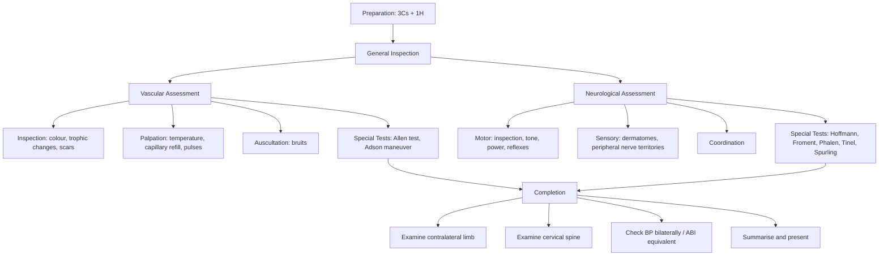

# Neurovascular Examination of the Upper Limb

## Master Examination Framework

---

## 1. Preparation (3Cs + 1H + 3Ps)

This framework is the **gold standard opening** for every HKUMed OSCE [1].

| Step | What to do | Commentary |
|---|---|---|
| **Consent** | "Hello, my name is Dr ___. May I examine your arms today?" 「你好，我係___醫生，我可以檢查你嘅手臂嗎？」 | Always introduce yourself first. |
| **Curtains** | Draw curtains for privacy | Even in an OSCE — do it or say it. |
| **Chaperone** | "Would you like a chaperone?" | Offer, document response. |
| **Hand hygiene** | "I would wash my hands before and after the examination." 「我會先洗手」 | State this explicitly — it is a marks-generating statement. |
| **Exposure** | Expose both arms fully — shirt rolled up above shoulders 「請你除低上衫 / 捲高衫袖」 | You need to compare both sides. |
| **Pain** | "Do you have any pain at the moment?" 「你而家有冇邊度痛？」 | Ask **before** you touch the patient. |
| **Positioning** | Sitting upright at 45–60° or on a chair, facing you | Standard for UL neurological exam [1][2]. |

<Callout title="Don't Skip the Basics" type="error">
The most common OSCE pitfall is jumping straight into nerve testing without introducing yourself, gaining consent, or washing hands. These marks are literally free.
</Callout>

---

## 2. General Inspection

**Why:** You gather a huge amount of information before touching the patient. Examiners watch whether you pause and *look* first [1].

### Around the Bedside
- **Oxygen**, monitors, pulse oximeter
- **IV lines** (which arm? — may indicate the other arm is post-op or has an AV fistula)
- **Splints, slings, casts** — hint at fracture or post-surgical state
- **Assistive devices** — wheelchair, walking frame (suggests generalised neurological deficit)
- **Sputum jar, inhalers** (COPD → Pancoast tumour association)

### On the Patient (From the End of the Bed)
- **General status:** Is the patient comfortable? In pain? Dyspnoeic?
- **Body habitus:** Cachexia (malignancy), obesity
- **Posture:** Hemiplegic posture (flexed UL, extended LL → UMN lesion), wrist drop, claw hand
- **Skin:** Pallor, cyanosis, mottling, tar staining (smoking → PVD/Pancoast)
- **Abnormal movements:** Fasciculations, tremor

**Model Commentary:**
> *"On general inspection, the patient is sitting comfortably at rest. There is no supplemental oxygen or monitoring in use. I can see no splints, slings or IV lines. There is no obvious wasting or deformity of the upper limbs at first glance."*

---

## 3. Vascular Assessment of the Upper Limb

### 3a. Inspection

| What to look for | Normal | Abnormal | Pathophysiology |
|---|---|---|---|
| **Colour** | Pink, symmetrical | Pallor (ischaemia), cyanosis (deoxygenation), mottling (prolonged ischaemia) | Arterial insufficiency → reduced O₂ delivery to tissues |
| ***Trophic changes*** | Normal hair, skin, nails | ***Hair loss, shiny/thin skin, brittle/thickened nails*** | Chronic ischaemia → tissue atrophy due to reduced nutrient supply [3] |
| **Scars** | None | Vascular access scars, bypass grafts, AV fistula | Indicate previous vascular interventions |
| **Ulceration / gangrene** | None | Fingertip ulcers, digital gangrene | Critical ischaemia, emboli (e.g. from subclavian aneurysm), vasculitis |
| **Muscle wasting** | Symmetrical bulk | Thenar / hypothenar / interossei / forearm wasting | LMN lesion, disuse atrophy, T1 radiculopathy, or nerve entrapment |
| ***AV fistula signs*** | N/A | ***Visible distended venous outflow, aneurysmal dilatation*** | ***Arterialized venous flow in haemodialysis access*** [3] |
| **Swelling** | None | Oedema (venous obstruction), lymphoedema | Venous hypertension or lymphatic obstruction |

**Model Commentary:**
> *"On inspection of both upper limbs, I note no colour change, no trophic changes over the digits, no ulceration or gangrene. There are no surgical scars or AV fistulae visible. The muscle bulk appears symmetrical bilaterally."*

### 3b. Palpation

#### Temperature
- **How:** Use the **dorsum** of your hand (more sensitive to temperature) [3]. Run both hands simultaneously up from the patient's fingertips to the forearm and upper arm.
- **Normal:** Warm and symmetrical.
- **Abnormal:** Unilateral coolness → suggests arterial insufficiency on that side. Note the level at which temperature changes — this helps localise the level of arterial occlusion.
- **Why dorsum?** The dorsal hand has thinner skin with more thermoreceptors.

**Cantonese instruction:** 「我而家會用手背感受你手臂嘅溫度」

#### Capillary Refill Time (CRT)
- **How:** Press firmly on the nail bed (or finger pulp) for 5 seconds, then release. Count the time for colour to return.
- **Normal:** < 2 seconds [3].
- **Abnormal:** > 2 seconds → indicates **inadequate perfusion** (arterial insufficiency, hypovolaemia, or peripheral vasoconstriction).
- **Pathophysiology:** Delayed refill reflects reduced arteriolar perfusion pressure and slow microcirculatory flow.

**Model Commentary:**
> *"The capillary refill time is brisk at less than 2 seconds bilaterally."*

#### Peripheral Pulses
Palpate **bilaterally** and compare. Grade as: exaggerated (+++), normal (++), reduced (+), absent (−) [4].

| Pulse | Location | How to find it |
|---|---|---|
| ***Radial*** | ***Distal forearm, lateral (radial) side, near base of thumb*** | Flex patient's wrist slightly; palpate between radial styloid and FCR tendon [3] |
| ***Ulnar*** | ***Distal forearm, medial (ulnar) side*** | Palpate medial to FCU tendon |
| ***Brachial*** | ***Antecubital fossa, immediately medial to biceps tendon*** | Extend the elbow; palpate medial to biceps tendon [3] |
| **Axillary** | Apex of axilla, against humeral head | Press laterally against the humerus |
| **Subclavian** | Behind medial clavicle in supraclavicular fossa | Press downward behind clavicle |
| **Carotid** | Lateral to laryngeal prominence (thyroid cartilage) | Palpate one side at a time [3] |

**Why proximal-to-distal?** Helps localise the level of arterial obstruction — if the brachial is present but radial is absent, the occlusion is between the two.

**Additional assessments:**
- **Rate and rhythm** at the radial pulse (e.g. AF → embolic risk)
- ***Radial-radial delay:*** Palpate both radial pulses simultaneously. A delay or volume difference suggests ***subclavian artery stenosis/occlusion or thoracic aortic dissection*** [5].
- **Radio-femoral delay** (if indicated): Suggests coarctation of aorta [5].

**Cantonese instruction:** 「我而家會摸你嘅脈搏」

**Model Commentary:**
> *"The radial pulse is present bilaterally with a rate of approximately 72 beats per minute and a regular rhythm. There is no radial-radial delay. The ulnar, brachial, and carotid pulses are all palpable and symmetrical."*

### 3c. Auscultation

- **Where:** Over the **subclavian artery** (supraclavicular fossa) and **carotid artery** bilaterally.
- **What to listen for:** Bruits — a harsh, blowing sound during systole indicating turbulent flow.
- **Normal:** No bruit.
- **Abnormal:** Bruit → suggests arterial stenosis (e.g. subclavian stenosis in thoracic outlet syndrome, carotid stenosis).
- **Pathophysiology:** Turbulent flow through a narrowed lumen generates audible vibrations. Note that a very tight stenosis (> 90%) may have no bruit as flow is minimal.

**Model Commentary:**
> *"On auscultation, there are no bruits heard over the carotid or subclavian arteries bilaterally."*

---

## 4. Neurological Assessment of the Upper Limb

This follows the standard HKUMed sequence: **Motor → Sensory → Coordination** [1][2].

### 4a. Motor System

#### i. Inspection

Already partly done in general inspection. Now focus on:

- **Asymmetry or deformity:** Wrist drop (radial nerve), claw hand (ulnar nerve), ape hand (median nerve), hand of benediction (high median nerve lesion)
- ***Muscle bulk:*** Compare thenar eminence, hypothenar eminence, first dorsal interosseous, forearm extensors/flexors bilaterally. ***Wasting*** → LMN lesion, nerve entrapment, or disuse [1][2].
- ***Fasciculations:*** Irregular, non-rhythmical twitching of muscle fibres visible under the skin. ***Indicative of LMN lesion*** (anterior horn cell disease, nerve root compression). Can be provoked by **tapping over the bulk of large muscles** [1][2].

**Model Commentary:**
> *"On closer inspection, there is no visible wasting of the thenar, hypothenar or interosseous muscles. There are no fasciculations. No abnormal posture or deformity is seen."*

#### ii. Pronator Drift Test

- **How:** Ask the patient to hold both arms outstretched with palms facing upward and eyes closed for 10–20 seconds. 「請你伸直雙手，手掌向上，閉上眼」
- **Normal:** Arms remain still.
- **Abnormal:**
  - ***UMN lesion → pronator drift*** (arm gradually pronates and drifts downward) — this is a **sensitive sign** of subtle corticospinal tract dysfunction [1][2].
  - *Cerebellar lesion* → slow upward drift with pronation.
  - *Proprioceptive defect* → random finger wandering ("piano-playing fingers").
- **Pathophysiology:** The corticospinal tract preferentially innervates supinators and extensors in the UL. When damaged, the unopposed pronators/flexors pull the arm down and inward.

#### iii. Tone

- **How:** Ask the patient to relax. Support the forearm and passively flex/extend the **elbow** and **wrist** joints, varying speed and range [1][2]. 「請你放鬆，唔好用力」
- **Normal:** Slight baseline resistance, smooth throughout range.
- **Abnormal:**

| Finding | Feel | Lesion |
|---|---|---|
| ***Hypotonia*** | ***Floppy, reduced resistance*** | ***LMN lesion*** |
| ***Clasp-knife rigidity*** | ***Initial resistance suddenly gives way*** | ***UMN lesion*** (spasticity) |
| ***Lead-pipe rigidity*** | ***Steady increased resistance throughout*** | ***Extrapyramidal lesion*** (e.g. Parkinsonism) |
| ***Cog-wheel rigidity*** | ***Lead-pipe + superimposed ratchety catches*** | ***Extrapyramidal + tremor*** (Parkinsonism) |

- **Pathophysiology:** Spasticity (UMN) = loss of cortical inhibition on the stretch reflex arc → velocity-dependent increase in tone. Rigidity (extrapyramidal) = loss of basal ganglia modulation → velocity-independent increase in tone [1][2].

#### iv. Power (MRC Grading)

Test **each myotome** against resistance. Grade 0–5 [1][2]:

| Grade | Description |
|---|---|
| 0 | No contraction |
| 1 | Flicker of contraction |
| 2 | Movement with gravity eliminated |
| 3 | Movement against gravity |
| 4 | Movement against resistance (4−, 4, 4+) |
| 5 | Normal power |

Test the following movements systematically. The key is to **stabilise the proximal joint** and isolate the movement [1][2]:

| Movement | Myotome | Nerve | How to test | Cantonese instruction |
|---|---|---|---|---|
| Shoulder abduction | **C5** | Axillary | "Push your arms out to the side, don't let me push down" | 「舉高隻手，唔好俾我壓低」 |
| Elbow flexion | **C5/C6** | Musculocutaneous | "Bend your elbow, pull me towards you" | 「屈手踭，拉我過嚟」 |
| Elbow extension | **C7** | Radial | "Push me away, straighten your arm" | 「伸直隻手，推我開」 |
| Wrist extension | **C6/C7** | Radial (ECRL/ECRB) | "Cock your wrist up, don't let me push it down" | 「手腕向上，唔好俾我壓低」 |
| Wrist flexion | **C7/C8** | Median/Ulnar | "Bend your wrist down, don't let me push it up" | 「手腕向下屈」 |
| Finger extension | **C7** | Posterior interosseous (radial) | "Straighten your fingers, don't let me push them down" | 「伸直手指，唔好俾我壓低」 |
| Finger flexion (grip) | **C8** | Median (FDP 2/3), Ulnar (FDP 4/5) | "Squeeze my fingers" | 「揸實我手指」 |
| Finger abduction | **T1** | Ulnar | "Spread your fingers apart, don't let me push them together" | 「打開手指，唔好俾我夾埋」 |
| Thumb abduction | **T1** | Median (APB) | "Point your thumb to the ceiling, don't let me push it down" | 「拇指指向天花板，唔好俾我壓低」 |
| Thumb opposition | **C8/T1** | Median | "Touch your thumb to your little finger, don't let me pull them apart" | 「拇指掂尾指」 |

<Callout title="Pattern Recognition" type="idea">
- ***UMN weakness pattern in UL:*** predominantly extensors weaker than flexors (i.e. finger extension, wrist extension, elbow extension weaker) [6].
- ***LMN weakness:*** focal, in the distribution of a specific root, plexus or peripheral nerve [6].
- ***Myopathic pattern:*** predominantly proximal weakness (shoulder abduction, elbow flexion).
</Callout>

**Model Commentary:**
> *"Power is 5/5 in all myotomes bilaterally — C5 shoulder abduction, C5/6 elbow flexion, C7 elbow extension, C6 wrist extension, C8 finger flexion, and T1 finger abduction."*

#### v. Reflexes

Use a tendon hammer. Compare bilaterally. Grade: 0 (absent), + (reduced), ++ (normal), +++ (brisk), ++++ (clonus) [1][2].

| Reflex | Root | How to test |
|---|---|---|
| **Biceps** | **C5/C6** | Place your thumb on the biceps tendon in the antecubital fossa; tap your thumb with the hammer. Feel the contraction under your thumb. |
| **Supinator (brachioradialis)** | **C5/C6** | Tap the distal radius (brachioradialis tendon) directly. Normal response = elbow flexion in mid-pronation. |
| **Triceps** | **C7** | Support the arm; tap the triceps tendon just above the olecranon. Normal response = elbow extension. |
| **Finger flexion (Hoffman)** | **C8/T1** | Flick the distal phalanx of the middle finger in flexion. Positive = reflex flexion of the thumb → **hyperreflexia / UMN sign** [7][8]. |

**Interpretation:**

| Finding | Significance |
|---|---|
| ***Hyperreflexia*** | ***UMN lesion*** (loss of cortical inhibitory input to spinal reflex arc) |
| ***Hyporeflexia/areflexia*** | ***LMN lesion*** (damage to reflex arc itself — sensory afferent, motor efferent, or anterior horn cell) |
| ***Inverted supinator jerk*** | ***C5/C6 lesion:*** absent brachioradialis reflex (LMN at C5/C6) + finger flexion (UMN effect at C8) [7][8] |

**Cantonese instruction:** 「請你放鬆，我會用個小槌輕輕敲你手臂」

**Model Commentary:**
> *"Reflexes are grade 2+ bilaterally at the biceps, triceps and supinator. Hoffman sign is negative bilaterally."*

### 4b. Sensory System

Test **with the patient's eyes closed**. Always demonstrate the stimulus on the sternum first so the patient knows what to expect [1][2]. 「我而家會測試你嘅感覺，請閉上眼」

| Modality | Pathway | How to test | Dermatomes to test |
|---|---|---|---|
| **Light touch** | Dorsal columns + spinothalamic | Cotton wool or light finger touch | C5 (lateral arm), C6 (lateral forearm/thumb), C7 (middle finger), C8 (medial forearm/little finger), T1 (medial arm), T2 (medial upper arm/axilla) |
| ***Pain/pinprick*** | ***Spinothalamic tract*** | ***Neurotip / broken wooden stick*** — "Does this feel sharp?" 「呢個感覺利唔利？」 | Same dermatomes |
| ***Vibration*** | ***Dorsal columns*** | ***128 Hz tuning fork on bony prominences*** (DIP of index finger → wrist → elbow) | Compare sides; work proximally if distally absent |
| ***Proprioception (joint position sense)*** | ***Dorsal columns*** | ***Hold sides of distal phalanx of index finger; move up/down*** — "Is this up or down?" 「向上定向下？」 | DIP of index finger |

**Why test multiple modalities?** Different pathways are affected by different lesions:
- Spinothalamic (pain/temperature) → affected in syringomyelia (central cord), anterolateral cord lesions
- Dorsal columns (vibration/proprioception) → affected in B12 deficiency, tabes dorsalis, posterior cord compression

**Peripheral nerve sensory territories** (distinct from dermatomes) — key for nerve entrapment [9]:

| Nerve | Territory |
|---|---|
| ***Radial (superficial branch)*** | ***Dorsal aspect of lateral 3½ digits and dorsal hand (1st web space = autonomous zone)*** |
| ***Median*** | ***Palmar aspect of lateral 3½ digits + thenar area*** |
| ***Ulnar*** | ***Palmar and dorsal aspect of medial 1½ digits*** |
| Medial cutaneous nerve of forearm (C8/T1) | Medial forearm |
| Lateral cutaneous nerve of forearm (C5/C6) | Lateral forearm |

<Callout title="Dermatomal vs Peripheral Nerve Pattern" type="idea">
If the sensory deficit follows a dermatomal pattern → think **radiculopathy**. If it follows a peripheral nerve territory → think **entrapment neuropathy**. If it is "glove-and-stocking" → think **peripheral neuropathy** (e.g. DM, alcohol, B12 deficiency).
</Callout>

**Model Commentary:**
> *"Sensation is intact to light touch, pinprick, vibration and proprioception in all dermatomes C5 to T1 bilaterally."*

### 4c. Coordination

- **Finger-nose test:** Ask the patient to alternately touch their nose then your outstretched finger (move your finger to different positions). 「請你用食指輪流掂自己個鼻同埋我隻手指」
  - **Normal:** Smooth, accurate trajectory.
  - **Abnormal:** *Intention tremor* (worsens approaching target), *past-pointing* (dysmetria) → **cerebellar lesion** (ipsilateral).
  - **Why:** The cerebellum coordinates fine motor control. Lesions disrupt the ability to calibrate movement amplitude.

- **Dysdiadochokinesis:** Ask the patient to rapidly pronate/supinate their hand on the other palm (or rapidly tap). 「請你快啲拍手掌」
  - **Abnormal:** Slow, clumsy, irregular rhythm → **cerebellar lesion**.

**Model Commentary:**
> *"Finger-nose testing is accurate bilaterally with no intention tremor or past-pointing. Rapid alternating movements are performed smoothly."*

---

## 5. Special Tests and Named Clinical Signs

### Vascular Special Tests

#### Allen Test

- **Purpose:** Assess adequacy of collateral circulation to the hand (ulnar artery patency) before radial artery cannulation/harvest.
- **How:**
  1. Ask patient to make a tight fist 「揸拳頭」
  2. Occlude both radial and ulnar arteries at the wrist with your thumbs
  3. Ask patient to open the fist — palm should be pale
  4. Release the **ulnar** artery only (keep radial occluded)
  5. Time how quickly the palm and fingers re-colour
- **Normal (negative):** Colour returns within 5–7 seconds → adequate ulnar collateral supply.
- **Positive (abnormal):** Colour does NOT return or is delayed > 10 seconds → inadequate ulnar/palmar arch flow → radial artery cannulation is **contraindicated**.
- **Pathophysiology:** The superficial palmar arch (predominantly from ulnar artery) should provide collateral flow to the entire hand when the radial contribution is removed. Incomplete palmar arch (present in ~20% of people) may lead to digital ischaemia if the radial artery is subsequently harvested or thrombosed.

**Model Commentary:**
> *"I would now perform Allen's test. After occluding both arteries and asking the patient to pump, I release the ulnar artery — the hand re-colours within 5 seconds bilaterally. Allen's test is negative, confirming adequate ulnar collateral flow."*

#### Adson's Maneuver (Thoracic Outlet Syndrome)

- **Purpose:** Evaluate for ***neurovascular compression at the thoracic outlet*** [9].
- **How:**
  1. Palpate the radial pulse
  2. Ask the patient to extend the neck and rotate the head **toward** the affected side
  3. Ask the patient to take a deep breath and hold 「深呼吸然後唔好呼出嚟」
- **Positive:** Diminution or obliteration of the radial pulse ± reproduction of neurological symptoms.
- **Pathophysiology:** This maneuver tenses the anterior scalene muscle and compresses the subclavian artery/brachial plexus between the scalene muscles and the first rib (or cervical rib) [9].
- **Sensitivity/Specificity:** Low specificity — can be positive in normal individuals. Always correlate with symptoms.

#### Roos Test (Elevated Arm Stress Test / EAST)

- **Purpose:** TOS evaluation (more specific than Adson's).
- **How:** Ask the patient to abduct both shoulders to 90°, flex elbows to 90°, and repeatedly open/close fists for 3 minutes.
- **Positive:** Reproduction of symptoms (pain, paraesthesia, heaviness), inability to maintain the position, or pallor of the affected hand.
- **Pathophysiology:** Sustained abduction narrows the costoclavicular and scalene triangle spaces, compressing neurovascular structures.

### Neurological Special Tests

#### Hoffmann Sign

- **Purpose:** Screen for **UMN lesion** (cervical myelopathy) [7][8].
- **How:** Hold the patient's middle finger in extension at MCPJ and PIPJ. Flick the **DIP** of the middle finger in flexion.
- **Positive:** Reflex flexion and adduction of the thumb (± flexion of index finger).
- **Pathophysiology:** Loss of cortical inhibition on the C8/T1 reflex arc → hyperreflexia.
- **Significance:** Equivalent to Babinski sign for the upper limb. Bilateral Hoffmann's is more concerning than unilateral. Combined with other myelopathic signs → strongly suggests cervical myelopathy.

#### Finger Escape Sign

- **Purpose:** Detect ***myelopathic hand*** [7][8].
- **How:** Ask the patient to hold both hands out with all fingers fully extended and adducted. Hold for 30 seconds.
- **Positive:** Small finger (and eventually ring finger) spontaneously abducts and flexes ("escapes").
- **Grading:** Little finger only (1), drifted from start (2), ring finger too (3), middle finger (4).
- **Pathophysiology:** Loss of corticospinal control over intrinsic hand muscles → inability to maintain adducted/extended posture.

#### Ten-Second Test (Grip-and-Release Test)

- **Purpose:** Detect ***cervical myelopathy*** [7][8].
- **How:** Ask the patient to fully extend the elbow and hand, then open and close the fist as fast as possible for 10 seconds. Count the cycles.
- **Normal:** > 20 cycles in 10 seconds.
- **Abnormal:** < 20 cycles, or visible dyssynergy between wrist and finger movements (wrist flexes when fingers extend and vice versa), slowness, clumsiness.
- **Pathophysiology:** Upper motor neuron dysfunction impairs rapid fine motor coordination of intrinsic and extrinsic hand muscles.

#### Inverted Supinator Jerk

- **Purpose:** Localise a ***C5/C6 level lesion*** [7][8].
- **How:** Percuss the distal radius (brachioradialis tendon).
- **Normal:** Elbow flexion in mid-pronation.
- **Positive (inverted):** No elbow flexion + finger flexion instead.
- **Pathophysiology:** **LMN lesion at C5/C6** → abolishes the brachioradialis reflex (no elbow flexion). **UMN effect below the lesion at C8** → finger flexion is hyperreflexic (the stimulus "spreads" to intact but disinhibited lower segments).
- **Significance:** Pathognomonic for cervical spondylotic myelopathy at C5/C6 level.

#### Lhermitte Sign

- **How:** Ask the patient to actively flex the neck 「請你低頭」
- **Positive:** Electric shock-like sensation radiating down the spine and into the limbs.
- **Pathophysiology:** Neck flexion stretches the posterior columns of the spinal cord → mechanically irritates demyelinated or compressed fibres [7][8].
- **Causes:** Cervical myelopathy, MS, B12 deficiency.

#### ***Spurling Test*** (Cervical Radiculopathy)

- **Purpose:** Provoke ***cervical radiculopathy*** [8][10].
- **How:** Extend the patient's neck, laterally flex toward the symptomatic side, and apply axial compression downward on the head.
- **Positive:** Reproduction of radicular pain/paraesthesia into the arm in a dermatomal distribution.
- **Sensitivity:** ~50%. **Specificity:** ~90% — a positive test is highly suggestive.
- **Pathophysiology:** Extension + ipsilateral lateral flexion narrows the ipsilateral neural foramen → compresses the exiting nerve root.
- **Cantonese instruction:** 「請你側頭向右/左邊，我會輕輕向下壓」

#### Shoulder Abduction Test (Bakody Sign)

- **Purpose:** Relieve radicular symptoms [10].
- **How:** Ask the patient to place the hand of the affected arm on top of their head.
- **Positive:** Relief of radicular symptoms (pain/numbness improves).
- **Pathophysiology:** Shoulder abduction reduces traction on the nerve root by shortening the path of the brachial plexus.

#### Phalen's Test and Tinel's Sign (Carpal Tunnel Syndrome)

**Phalen's test** [9]:
- **How:** Ask the patient to hold both wrists in maximal flexion (dorsum of hands pressed together) for 30–60 seconds. 「請你將兩隻手背對背咁擺，屈低手腕」
- **Positive:** Tingling/numbness in the median nerve distribution (lateral 3½ digits).
- **Sensitivity:** ~70%. **Specificity:** ~80%.

**Tinel's sign** [9]:
- **How:** Tap over the carpal tunnel at the wrist (palmar side, between FCR and PL tendons).
- **Positive:** Tingling radiating into the median nerve territory.

**Durkin's compression test** [9]:
- **How:** Apply direct pressure with your thumbs over the carpal tunnel for 30 seconds.
- **Positive:** Reproduction of paraesthesia.
- **Sensitivity/specificity:** Generally regarded as most sensitive of the three.

**Pathophysiology (all three):** Provocation tests increase pressure within the carpal tunnel → further compresses the already compromised median nerve → reproduces ischaemic symptoms.

#### Froment's Sign (Ulnar Nerve Palsy)

- **How:** Ask the patient to hold a piece of paper between the thumb and index finger (key pinch grip). Pull the paper away. 「請你夾住張紙，唔好放手」
- **Normal:** Paper held by thumb adduction (adductor pollicis, ulnar nerve).
- **Positive:** The DIP of the thumb flexes (FPL compensation via median nerve/AIN) to maintain grip, because adductor pollicis is weak [9].
- **Pathophysiology:** Ulnar nerve palsy → adductor pollicis weakness → patient compensates with FPL (median nerve) → visible DIP flexion.

#### Cross-Finger Sign / Pollock's Sign (Ulnar Nerve)

- **Cross-finger sign:** Ask the patient to cross the index over the middle finger → cannot do if 1st volar interosseous/2nd dorsal interosseous are weak (ulnar nerve) [9].
- ***Pollock's sign:*** Ask the patient to flex the DIP of the ring and little fingers → inability indicates FDP 4/5 weakness → lesion at/above the elbow (cubital tunnel), as FDP 4/5 is innervated by the ulnar nerve proximal to the wrist [9].

#### Elbow Flexion Test (Cubital Tunnel Syndrome)

- **How:** Ask the patient to fully flex the elbow and hold for 30–60 seconds.
- **Positive:** Reproduction of tingling/numbness in the ulnar nerve distribution.
- **Pathophysiology:** Elbow flexion stretches the ulnar nerve across the medial epicondyle and reduces the volume of the cubital tunnel → increases pressure on the nerve.
- Also perform **Tinel's sign at the elbow** — tapping behind the medial epicondyle.

---

## 6. Completion of Examination

**Always state these to complete your examination:**

1. **Examine the contralateral limb** — for comparison and to exclude bilateral disease.
2. **Examine the cervical spine** — radiculopathy/myelopathy may be the underlying cause. 「我會檢查頸椎」
3. **Examine the lower limbs** — especially if suspecting myelopathy (look for UMN signs: clonus, hyperreflexia, upgoing plantars, spasticity) [8].
4. **Measure BP in both arms** — a difference > 15 mmHg suggests subclavian stenosis or aortic pathology [5].
5. **Perform an ECG** — if suspecting embolic source (AF).
6. **Check blood glucose** — if peripheral neuropathy suspected (diabetic neuropathy).
7. **Request nerve conduction studies / EMG** — to confirm and localise nerve lesions.
8. **Request imaging** — cervical spine MRI (myelopathy/radiculopathy), CT angiography (vascular), duplex ultrasound (arterial/AV fistula assessment).

---

## 7. Expected Findings: Positive vs Negative

### Key Positive Findings to Document

| Category | Finding | Suggests |
|---|---|---|
| Vascular | Absent radial/ulnar pulse | Arterial occlusion, embolism |
| Vascular | Unilateral coolness, pallor | Limb ischaemia |
| Vascular | Delayed CRT ( > 2s) | Inadequate perfusion |
| Vascular | Radial-radial delay | Subclavian stenosis, aortic dissection |
| Vascular | Bruit over subclavian/carotid | Arterial stenosis |
| Neurological | Wasting (thenar/hypothenar/interossei) | LMN lesion — specific nerve |
| Neurological | Fasciculations | LMN lesion (AHC disease, root compression) |
| Neurological | Pronator drift | UMN lesion |
| Neurological | Hypertonia / hyperreflexia / +ve Hoffmann | UMN lesion / cervical myelopathy |
| Neurological | Hypotonia / hyporeflexia | LMN lesion / radiculopathy |
| Neurological | Dermatomal sensory loss | Radiculopathy at specific level |
| Neurological | Peripheral nerve sensory loss | Entrapment neuropathy |
| Neurological | Positive Spurling test | Cervical radiculopathy |
| Neurological | Positive Phalen/Tinel | Carpal tunnel syndrome |
| Neurological | Positive Froment sign | Ulnar nerve palsy |

### Important Negatives

- No trophic changes (rules out chronic ischaemia)
- All pulses palpable and symmetrical (rules out major arterial disease)
- No claw hand / wrist drop / ape hand deformity (rules out major nerve injury)
- Hoffmann sign negative bilaterally (rules out cervical myelopathy)
- No sensory deficit in any modality
- No coordination deficit

---

## 8. Red-Flag Findings and Escalation

| Red Flag | Concern | Action |
|---|---|---|
| ***Absent pulses + pallor + pain + paraesthesia + paralysis + poikilothermia (6Ps)*** | ***Acute limb ischaemia*** | ***Emergency vascular surgery referral — limb-threatening*** |
| Rapidly progressive bilateral UMN signs (hyperreflexia, Hoffmann, clonus) | Cervical myelopathy with cord compression | Urgent MRI cervical spine, neurosurgery referral |
| Acute-onset unilateral weakness + sensory loss in UMN pattern | Stroke (cerebrovascular event) | FAST protocol, CT brain, stroke team |
| Expanding haematoma at antecubital fossa post-procedure | Brachial artery pseudoaneurysm / haematoma compressing nerve | Urgent vascular review |
| Progressive hand weakness with bilateral wasting | Motor neuron disease, cervical myelopathy, syringomyelia | Urgent neurological workup |
| Cauda equina equivalent in UL: bilateral C8/T1 weakness + bladder dysfunction | Central cord syndrome | Emergency MRI, neurosurgical consultation |

---

## 9. Common OSCE Pitfalls

<Callout title="Classic Mistakes" type="error">
1. **Forgetting to compare sides** — always examine both limbs and compare findings bilaterally.
2. **Not asking about pain before palpation** — you WILL lose marks.
3. **Testing power without stabilising the proximal joint** — e.g. testing wrist extension while the forearm moves freely gives inaccurate results.
4. **Not demonstrating sensory stimuli first** — show the patient what "sharp" feels like on the sternum before testing the limb.
5. **Confusing dermatomes with peripheral nerve territories** — these are different maps. State which one you are testing.
6. **Forgetting vascular assessment** — the question says "neurovascular," not just "neurological." Many students do a beautiful neuro exam and completely skip pulses, temperature and capillary refill.
7. **Not offering to complete the examination** — always mention cervical spine, contralateral limb, lower limbs, and relevant investigations.
8. **Rushing through reflexes** — if you don't get a response, try reinforcement (ask the patient to clench their teeth / pull their interlocked fingers apart — Jendrassik maneuver for LL; clench the teeth for UL).
</Callout>

---

## 10. High-Yield Interpretation Tips

- **"Why does the pattern of weakness matter?"** — UMN lesions cause weakness of extensors > flexors in the UL (because the corticospinal tract preferentially innervates extensors/supinators). LMN lesions cause weakness in the specific territory of the damaged nerve [6].
- **"Why test vibration AND pinprick?"** — These travel in different spinal cord pathways (dorsal columns vs spinothalamic). A dissociated sensory loss (one modality lost, other preserved) localises the lesion precisely (e.g. Brown-Séquard syndrome, syringomyelia).
- **"Why is the inverted supinator jerk so high-yield?"** — It localises the lesion to C5/C6 with a single tap. It simultaneously demonstrates LMN signs at the level of the lesion and UMN signs below — the hallmark of myelopathy [7][8].
- **"Why check pulses in a neuro exam?"** — Vascular disease can mimic or coexist with neurological disease. Rest pain from ischaemia can be confused with neuropathic pain. Additionally, peripheral nerve ischaemia (vasa nervorum) can directly cause neuropathy.

---

## 11. Model Reporting Script

> *"On examination, Mr Chan is a 65-year-old gentleman, sitting comfortably at rest. There are no splints, slings or oxygen in use. Vital signs are stable with a pulse of 76 bpm, regular, and blood pressure is 135/82 in the right arm and 130/80 in the left arm — no significant inter-arm difference.*
>
> *On inspection of both upper limbs, the skin colour is normal with no pallor, cyanosis or mottling. There are no trophic changes, ulceration or gangrene. No surgical scars or AV fistulae are seen. Muscle bulk is symmetrical with no wasting of the thenar, hypothenar or interosseous compartments. There are no fasciculations or abnormal posturing.*
>
> *On palpation, temperature is symmetrical bilaterally. Capillary refill time is less than 2 seconds in all digits. Radial, ulnar, brachial and carotid pulses are present and equal bilaterally with no radial-radial delay. On auscultation, there are no bruits over the carotid or subclavian arteries.*
>
> *Neurologically, there is no pronator drift. Tone is normal throughout. Power is 5/5 in all myotomes from C5 to T1 bilaterally. Reflexes are grade 2+ and symmetrical at the biceps, triceps and supinator. Hoffmann sign is negative bilaterally. Sensation is intact to light touch, pinprick, vibration and proprioception in all dermatomes and peripheral nerve territories. Coordination is intact on finger-nose testing with no dysmetria or dysdiadochokinesis.*
>
> *Special tests: Allen's test is negative bilaterally. Phalen's and Tinel's signs are negative. Spurling test is negative. Froment sign is negative.*
>
> *In summary, Mr Chan has a normal neurovascular examination of both upper limbs with no evidence of arterial insufficiency, nerve entrapment or myelopathy. To complete my assessment, I would examine the cervical spine, the lower limbs, and arrange nerve conduction studies and vascular imaging if clinically indicated."*

---

<Callout title="High Yield Summary">

**Neurovascular exam of the upper limb = Vascular + Neurological in one systematic pass.**

**Vascular:** Inspect (colour, trophic changes, scars) → Palpate (temperature with dorsum of hand, CRT < 2s, pulses: radial, ulnar, brachial, carotid ± subclavian — compare bilaterally, check for radial-radial delay) → Auscultate (carotid/subclavian bruits) → Special tests (Allen test, Adson/Roos for TOS).

**Neurological — Motor:** Inspect (wasting, fasciculations, deformity) → Pronator drift → Tone → Power (C5–T1 myotomes) → Reflexes (biceps C5/6, supinator C5/6, triceps C7, Hoffmann C8/T1).

**Neurological — Sensory:** Light touch, pinprick, vibration, proprioception across C5–T1 dermatomes AND peripheral nerve territories (radial, median, ulnar).

**Neurological — Coordination:** Finger-nose, dysdiadochokinesis.

**Key special tests:** Hoffmann sign, finger escape test, ten-second test, inverted supinator jerk (myelopathy); Spurling (radiculopathy); Phalen/Tinel/Durkin (CTS); Froment/Pollock (ulnar); Allen test (palmar arch); Adson/Roos (TOS).

**Always complete:** Examine contralateral limb, cervical spine, lower limbs. Offer BP both arms, NCS/EMG, imaging.

</Callout>

---

<ActiveRecallQuiz
  title="Active Recall - Physical Exam"
  items={[
    {
      question: "What are the 6 Ps of acute limb ischaemia and why is this an emergency?",
      markscheme: "Pain, Pallor, Pulselessness, Paraesthesia, Paralysis, Poikilothermia. Emergency because prolonged ischaemia (beyond 6 hours) leads to irreversible muscle necrosis, rhabdomyolysis, and limb loss.",
    },
    {
      question: "A patient has absent brachioradialis reflex but brisk finger flexion when you tap the distal radius. What is this sign called, what level is the lesion, and what is the pathophysiology?",
      markscheme: "Inverted supinator jerk. Lesion at C5/C6. LMN damage at C5/C6 abolishes the brachioradialis reflex; UMN effect below the lesion causes hyperreflexia at C8 leading to finger flexion.",
    },
    {
      question: "How do you differentiate between a dermatomal sensory loss and a peripheral nerve territory sensory loss? Give an example of each.",
      markscheme: "Dermatomal loss follows spinal nerve root distribution (e.g. C6 = lateral forearm and thumb, suggesting radiculopathy). Peripheral nerve loss follows the anatomical course of the nerve (e.g. median nerve = palmar lateral 3.5 digits, suggesting carpal tunnel syndrome). Dermatomal and peripheral nerve maps overlap but are NOT identical.",
    },
    {
      question: "What is Froment sign, how do you perform it, and what nerve lesion does it indicate?",
      markscheme: "Ask the patient to hold a piece of paper between thumb and index finger in key-pinch grip. Positive if the thumb DIP flexes (FPL compensation) when you try to pull the paper away. Indicates ulnar nerve palsy causing adductor pollicis weakness.",
    },
    {
      question: "What is the Allen test and when is it clinically important?",
      markscheme: "Occlude both radial and ulnar arteries, have the patient pump the fist to blanch the palm, then release only the ulnar artery. Positive (abnormal) if the hand does not re-colour within 5-10 seconds, indicating inadequate ulnar/palmar arch collateral. Important before radial artery cannulation or radial artery harvest for CABG.",
    },
    {
      question: "Name three signs of cervical myelopathy you can elicit on upper limb examination and explain the underlying pathophysiology.",
      markscheme: "Hoffmann sign (hyperreflexia from loss of cortical inhibition on C8/T1 reflex arc), finger escape sign (loss of corticospinal control over intrinsic hand muscles causing finger abduction/flexion), and ten-second grip-release test with fewer than 20 cycles or dyssynergy (UMN dysfunction impairing rapid fine motor coordination). All reflect upper motor neuron damage from cervical cord compression.",
    },
  ]}
/>

## References

[1] Senior notes: Ryan Ho Fundamentals.pdf (p8 — General Examination, p83 — Examination of Neurological System, p102 — Neurological Examination of Peripheral Nervous System)
[2] Senior notes: Ryan Ho Neurology.pdf (p5 — Physical Examination, p24 — Neurological Examination of Peripheral Nervous System, p67 — Approach to Neurological Deficits)
[3] Senior notes: felixlai.md (p212 — Vascular Examination: palpation, temperature, capillary refill, peripheral pulses; p1353/1374 — Vascular examination of upper and lower extremities)
[4] Senior notes: Ryan Ho Cardiology.pdf (p201–203 — Examination of Peripheral Arterial System)
[5] Senior notes: Ryan Ho Cardiology.pdf (p7 — Arterial Pulses: radial-radial delay, radiofemoral delay)
[6] Senior notes: Ryan Ho Neurology.pdf (p67 — Types of Motor Deficit: UMN vs LMN vs NMJ vs Muscle)
[7] Senior notes: Ryan Ho Fundamentals.pdf (p146 — Special Tests for Cervical Myelopathy)
[8] Senior notes: Ryan Ho Rheumatology.pdf (p25 — Special Tests for Cervical Myelopathy)
[9] Senior notes: maxim.md (p499–502 — Peripheral nerves of UL, radial/ulnar/median nerve palsy, thoracic outlet syndrome, carpal tunnel syndrome)
[10] Lecture slides: GC 227. Cervical Spine Pathology.pdf (p42 — Signs of cervical radiculopathy: Spurling test, shoulder abduction test)
