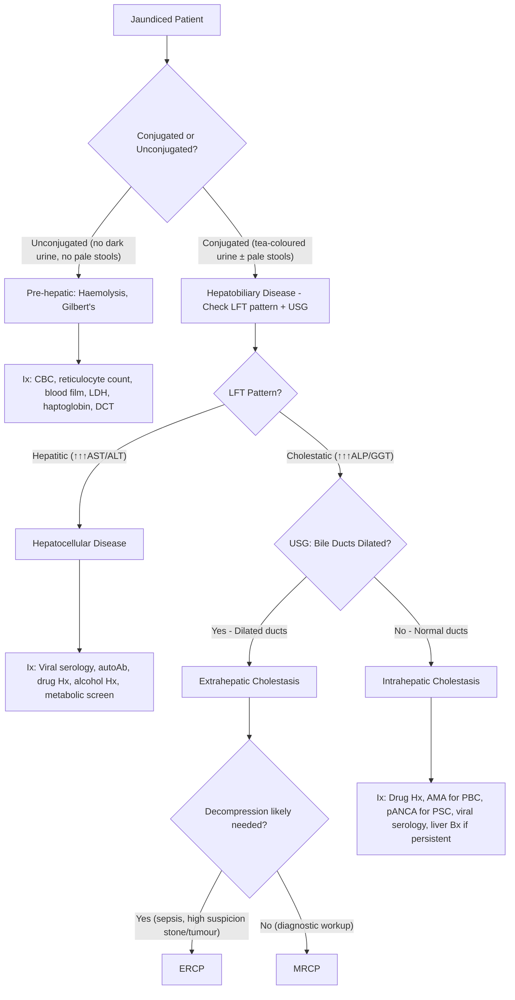

## Differential Diagnosis of Obstructive Jaundice

The differential diagnosis of obstructive jaundice is the bread and butter of hepatobiliary surgery. When a patient walks in with yellow eyes, dark urine, and pale stools, your job is threefold: (1) **confirm it is truly obstructive** (post-hepatic) rather than pre-hepatic or hepatocellular; (2) **determine the level of obstruction**; and (3) **distinguish benign from malignant causes**. Let's build this systematically from first principles.

---

### Step 1: Is it Actually Obstructive Jaundice? — The Three Categories

Before diving into the surgical differential, you must first exclude pre-hepatic and hepatic causes. This is done clinically and biochemically [3][10][11].

| | ***Pre-hepatic*** | ***Hepatic*** | ***Post-hepatic (Obstructive)*** |
|---|---|---|---|
| **Jaundice colour** | ***Lemon yellow*** | ***Yellow*** | ***Greenish*** |
| **Stools** | ***Dark (↑stercobilin)*** — more haem breakdown → more bilirubin → more stercobilin | ***Normal*** | ***Pale / clay-coloured*** — no bilirubin reaches the gut |
| **Urine** | ***Normal*** — unconjugated bilirubin is albumin-bound, not filtered | ***Tea-coloured*** | ***Tea-coloured*** — conjugated bilirubin is water-soluble, filtered by kidneys |
| **Pruritus** | Absent | Variable | ***Present ± scratch marks*** — bile salt deposition in skin |
| **LFT** | ↑Unconjugated bilirubin; AST/ALT, ALP/GGT, albumin all normal | ↑Conjugated bilirubin; ***↑↑↑AST/ALT***; ↑ALP/GGT; ↓albumin if subacute | ↑Conjugated bilirubin; ↑AST/ALT (mild); ***↑↑↑ALP/GGT***; albumin normal |

**Why does the LFT pattern differ?**
- In **hepatocellular** disease, the hepatocytes themselves are damaged → they leak their intracellular enzymes (AST, ALT) into the blood → transaminases are *markedly* elevated
- In **obstructive** disease, the hepatocytes are largely intact but the bile ducts are blocked → ALP (alkaline phosphatase, normally present on the canalicular membrane of hepatocytes and bile duct epithelium) is induced and released into blood because of cholestasis → ***ALP/GGT are disproportionately elevated relative to AST/ALT*** [3][10]
- GGT (gamma-glutamyl transferase) rises alongside ALP in biliary disease and **confirms the ALP is of hepatobiliary origin** (as opposed to bone or placental ALP) [1][10]

***Types of jaundice*** [11]:
- ***Pre-hepatic: Haemolysis (spherocytosis, G6PD deficiency, malaria, sickle cell anaemia)***
- ***Hepatic: hepatitis, cirrhosis, intrahepatic cholestasis, medications, Gilbert's syndrome***
- ***Post-hepatic: obstructive jaundice***

<Callout title="The Classic Obstructive LFT Pattern" type="idea">
***↑Bilirubin (conjugated), ↑↑↑ALP (± GGT) > AST/ALT (only mildly ↑)*** — this "cholestatic pattern" is ***more often seen in CA than in gallstones*** because malignant obstruction tends to be more complete and progressive [3][10].
</Callout>

---

### Step 2: Intrahepatic vs Extrahepatic Cholestasis

Once you've established a cholestatic (obstructive) pattern, the next branch point is **intrahepatic vs extrahepatic**. This distinction is made primarily by **ultrasound** — if the intrahepatic bile ducts are **dilated**, the obstruction is **extrahepatic** (downstream block → upstream dilatation). If the ducts are **not dilated**, the problem is **intrahepatic** (at the level of hepatocytes or small ductules) [10][14].

#### Intrahepatic Cholestasis (No Duct Dilatation)

These are **"medical"** causes — the bile ducts are structurally patent, but bile formation or small-duct flow is impaired:

| Cause | Mechanism |
|---|---|
| ***Hepatocyte dysfunction*** (hepatitis of any cause, end-stage liver disease) | Damaged hepatocytes → ***↓excretion*** of conjugated bilirubin into canaliculi [3] |
| ***Drugs*** (anabolic steroids, OCP, chlorpromazine, arsenic) | Drug-induced cholestasis — interference with bile salt transport proteins on canalicular membrane |
| ***Primary biliary cholangitis (PBC)*** | ***Autoimmune destruction of small intrahepatic ducts*** → progressive cholestasis; characterised by +ve AMA (anti-mitochondrial antibody), middle-aged women [15] |
| ***Primary sclerosing cholangitis (PSC)*** — small duct variant | Inflammation and fibrosis of small ducts; may have normal cholangiography |
| ***No enteric intake (TPN, post-operative)*** | ***↓CCK secretion → ↓gallbladder contraction*** → bile stasis [3] |
| ***Intrahepatic cholestasis of pregnancy*** | ***Associated with ↑oestrogen levels*** → impaired bile salt transport [3] |
| ***Intrahepatic compression of bilateral bile ducts by massive liver SOL*** | Very uncommon — requires bilateral duct compression (e.g., massive HCC) [3] |
| Congenital (Dubin-Johnson syndrome, Rotor syndrome) | Defective canalicular transport of conjugated bilirubin [10] |

> For intrahepatic cholestasis workup: ***clinical Hx for drugs, TPN use and infiltrative diseases → AMA and Ig pattern for PBC → viral hepatitis serology → liver biopsy if persistently > 2× ULN for > 6 months without identifiable cause*** [14]

#### Extrahepatic Cholestasis (Dilated Ducts)

This is the true **"surgical"** obstructive jaundice and forms the core of our differential. Organised by **relationship to the duct wall** [1][2][3]:

---

### Step 3: The Extrahepatic Differential — Intraluminal, Mural, Extramural

This is the framework you must know cold for exams:

```mermaid
flowchart TD
    A["Extrahepatic Obstructive Jaundice"] --> B["Intraluminal"]
    A --> C["Mural"]
    A --> D["Extramural"]
    
    B --> B1["CBD stones (most common overall)"]
    B --> B2["Cholangitis / RPC"]
    B --> B3["Parasites (Ascaris, Clonorchis, Opisthorchis)"]
    B --> B4["Tumour thrombus (rare, HCC)"]
    B --> B5["Haemobilia (very rare)"]
    
    C --> C1["Benign strictures (post-instrumentation, stones, chronic pancreatitis)"]
    C --> C2["PSC"]
    C --> C3["Sphincter of Oddi dysfunction (intermittent)"]
    C --> C4["Cholangiocarcinoma (hilar Klatskin / CBD)"]
    
    D --> D1["CA head of pancreas"]
    D --> D2["CA ampulla of Vater / duodenum"]
    D --> D3["Mirizzi syndrome"]
    D --> D4["Acute / chronic pancreatitis"]
    D --> D5["Porta hepatis LN (CA stomach, GB, HCC, lymphoma)"]
    D --> D6["Choledochal cysts"]
```

---

### Detailed Differential Diagnosis by Category

#### A. Intraluminal Causes

| Cause | Key Features | Why It Causes Obstruction |
|---|---|---|
| ***CBD stones (choledocholithiasis)*** | Most common cause of obstructive jaundice overall. ***Episodic, painful jaundice in younger individuals*** with Hx of gallstone disease [2][3]. Fluctuating jaundice (ball-valve effect). | Stone migrates from GB via cystic duct → impacts at distal CBD/ampulla → mechanical blockage of bile flow |
| ***Cholangitis / RPC*** | ***Charcot's triad*** (fever + jaundice + RUQ pain); ***Reynold's pentad*** adds hypotension + confusion [1][13]. RPC: recurrent episodes, a/w liver flukes in HK/southern China | Intraluminal stones + pus + debris block bile flow; in RPC, primary intrahepatic pigment stones cause recurrent obstruction and infection |
| ***Parasites*** (*Ascaris lumbricoides*, liver flukes — *Clonorchis sinensis*, *Opisthorchis viverrini*) | Travel Hx, endemic area (SE Asia), may see worms on ERCP | Adult worms or ova physically obstruct the bile duct lumen; chronic infection → inflammation → stone formation (pigment stones) |
| ***Tumour thrombus*** (rare, in HCC) | Known CLD/HCC. Very uncommon cause of MBO | HCC extends as a tumour thrombus into the bile duct lumen (analogous to portal vein tumour thrombus) |
| ***Haemobilia*** (very rare) | Post-trauma, post-ERCP, hepatic artery aneurysm. Presents with Quincke's triad: jaundice + biliary colic + GI bleeding | Blood clot within the bile duct lumen obstructs flow |

#### B. Mural Causes

| Cause | Key Features | Why It Causes Obstruction |
|---|---|---|
| ***Benign strictures*** | History of prior ERCP/surgery, chronic pancreatitis, or repeated stone passage → fibrotic narrowing of duct wall | Post-inflammatory fibrosis or surgical injury → circumferential narrowing of the duct from within the wall |
| ***Primary sclerosing cholangitis (PSC)*** | ***Young men (70% male, 25–40 y)***; ***strongly associated with UC*** [8]. Characteristic "beaded" cholangiogram. Intermittent jaundice, pruritus, fatigue | Chronic autoimmune inflammation → ***fibrosis and stricturing of medium and large intra-/extrahepatic ducts*** → progressive narrowing |
| ***Sphincter of Oddi dysfunction*** | ***Intermittent*** symptoms (episodic pain and transient LFT derangement); post-cholecystectomy | Functional spasm or fibrosis of the sphincter of Oddi → intermittent obstruction of bile (and sometimes pancreatic juice) flow |
| ***Cholangiocarcinoma*** (mural) | ***Painless obstructive jaundice***; ***perihilar (Klatskin) tumours ~50%***, distal ~40%. Hilar/distal tumours ***tend to present earlier*** because they obstruct bile flow at a critical point [6][7]. Slow-growing, locally invasive. | Malignant proliferation of bile duct epithelium → ***intrinsic narrowing*** of the duct lumen. Marked ***desmoplastic reaction*** contributes to progressive stenosis |

<Callout title="Intrahepatic Cholangiocarcinoma Does NOT Cause Jaundice Early" type="error">
***Intrahepatic cholangiocarcinoma will NOT cause jaundice*** in early stages because bilirubin can be reabsorbed into blood and re-excreted through unaffected parts of the liver. ***Only extrahepatic (perihilar/distal) cholangiocarcinoma causes jaundice***, especially ***Klatskin tumour*** where blockage of the bifurcation of L and R hepatic ducts causes jaundice in early stage [7].
</Callout>

#### C. Extramural Causes

| Cause | Key Features | Why It Causes Obstruction |
|---|---|---|
| ***CA head of pancreas*** | **Most common malignant cause** of obstructive jaundice. ***Painless progressive obstructive jaundice*** (tumour at head) [4]. ***60% arise in head***. ***Double duct sign*** on CT [5][12]. Courvoisier's sign +ve. Constitutional symptoms. ***New-onset DM***, steatorrhoea. ***Trousseau syndrome*** | Tumour in pancreatic head **extrinsically compresses/encases** the intrapancreatic segment of the CBD from outside |
| ***CA ampulla of Vater*** | Classically a/w ***silvery stools (Thomas's sign)*** — combination of clay (obstructed) and tarry (bleeding from friable ampullary tumour) stools [3][10]. May cause intermittent jaundice (tumour may ulcerate and slough → transient relief) | Tumour at the ampulla obstructs the distal-most CBD/pancreatic duct from outside/at the junction |
| ***CA duodenum*** (periampullary) | Rare. May cause GOO in addition to obstructive jaundice | Duodenal tumour in the periampullary region compresses or invades the distal CBD |
| ***Mirizzi syndrome*** | Painful jaundice (unlike typical MBO); Hx of gallstone disease. Large stone impacted in cystic duct/Hartmann's pouch | ***Extrinsic compression of CHD*** by impacted gallstone + secondary inflammation. Chronic cases may fistulise into CHD [1][7] |
| ***Pancreatitis (acute/chronic)*** | Acute: epigastric pain radiating to back, ↑amylase/lipase. Chronic: calcifications, steatorrhoea | Inflammatory oedema (acute) or fibrosis (chronic) of the pancreatic head → extrinsic compression of intrapancreatic CBD |
| ***Porta hepatis lymphadenopathy*** | Known primary malignancy (***CA stomach, CA gallbladder, HCC, lymphoma***) [3]. Systemic Sx | Enlarged metastatic lymph nodes at the porta hepatis compress the CHD/CBD from outside |
| ***Choledochal cysts*** | Usually diagnosed in childhood ( < 10 y in 60%). RUQ mass + pain, jaundice, fever. Risk of cholangiocarcinoma [7] | Congenital cystic dilatation of bile duct → stasis, inflammation, or compression of adjacent normal duct |

---

### Step 4: Differential by Level of Obstruction

This is a high-yield exam framework — **what's dilated on imaging tells you where the block is**, and the differential changes accordingly [1]:

| Level | What Is Dilated | Differential Diagnosis |
|---|---|---|
| **Hilum** (confluence of R + L hepatic ducts) | Intrahepatic ducts bilaterally; CHD/CBD may be normal calibre | ***Klatskin tumour (perihilar cholangiocarcinoma), CA gallbladder, HCC, Mirizzi syndrome, porta hepatis lymphadenopathy, PSC, RPC*** [1] |
| **Mid-CBD** | Intrahepatic ducts + CHD dilated; CBD dilated above the level of the block | ***Cholangiocarcinoma of CBD, CA head of pancreas, lymphadenopathy*** [1] |
| **Distal CBD** | Entire biliary tree dilated (intrahepatic + CHD + CBD) | ***CBD stones, benign bile duct strictures, periampullary carcinoma (ampulla/duodenum), choledochal cysts, pancreatic cysts, chronic pancreatitis*** [1] |

<Callout title="Exam Tip — Double Duct Sign">
***Double duct sign*** = simultaneous dilatation of **both the CBD and the pancreatic duct** on imaging. This occurs when a mass at their common termination point (head of pancreas or ampulla) obstructs both ducts. It is ***virtually pathognomonic of CA ampulla or CA head of pancreas*** [5][12].
</Callout>

---

### Step 5: The "Stone vs Tumour" Distinction

This is the **clinical crux** of the differential and comes up repeatedly in exams and on ward rounds [2][3]:

| Feature | **Stone (Benign)** | **Tumour (Malignant)** |
|---|---|---|
| Age | Younger | ***Older (> 60 y)*** |
| Onset | Sudden, episodic | ***Gradual, progressive*** |
| Pain | ***Painful*** (biliary colic, RUQ pain) | ***Painless*** (classic); ***dull boring epigastric pain radiating to back*** only in CA body/tail of pancreas (late) |
| Fever | Common (cholangitis) | Uncommon initially |
| Jaundice | Fluctuating (ball-valve) | ***Progressive, deepening*** |
| Constitutional Sx | Minimal | ***LOA, LOW, malaise*** |
| Gallbladder | **Not palpable** (fibrosed from chronic cholecystitis) | ***Palpable, non-tender*** (Courvoisier's sign) |
| LFT | Cholestatic, may fluctuate | ***Cholestatic pattern more pronounced and sustained*** |
| History | Prior biliary colic, known gallstones, ERCP | No prior biliary Hx; new-onset DM may be a clue for CA pancreas |

> ***Steatorrhoea (floating, foul-smelling, difficult to flush)*** can occur in both but is more prominent in malignant obstruction (complete and prolonged) and especially in CA pancreas (which also obstructs the pancreatic duct → exocrine insufficiency) [2].

---

### Step 6: Special Differentials Worth Knowing

#### Post-operative Jaundice [2]

When a patient develops jaundice after surgery, the differential shifts:
- ***Pre-hepatic***: haemolysis (e.g., blood transfusion reaction)
- ***Hepatic***: halogenated anaesthetics (hepatotoxicity), sepsis, intra-/post-operative hypotension → ischaemic hepatitis
- ***Post-hepatic***: biliary injury (surgical damage to bile duct during cholecystectomy — most feared complication)

#### Differential of Epigastric Mass + Jaundice [9][13]

***Per Prof R Poon's lecture*** [9]:
- ***Hepatomegaly (mild) due to biliary obstruction***
- ***Hepatomegaly due to metastasis or HCC***
- ***LN metastasis to coeliac axis and porta hepatis***
- ***CA stomach with metastatic LN in porta hepatis***
- ***Tumour obstructing both duodenum and bile duct → distended stomach + jaundice***

#### Differential of Cholangiocarcinoma Specifically [7]

When cholangiocarcinoma is suspected, the differential includes:
- ***Choledocholithiasis***
- ***Viral hepatitis***
- ***Hepatocellular carcinoma*** (AFP helps distinguish — ***AFP > 400 is diagnostic of HCC*** [3])
- ***Other malignant biliary obstruction***: pancreatic cancer, CA ampulla of Vater
- ***Intrahepatic cholestasis***: PSC, PBC
- ***IgG4-related sclerosing cholangitis*** — important mimic of cholangiocarcinoma; check ***serum IgG4*** [7]

<Callout title="IgG4-Related Sclerosing Cholangitis — The Great Mimic" type="error">
IgG4-related sclerosing cholangitis can mimic cholangiocarcinoma both clinically and radiologically (stricturing of bile ducts, mass lesion). Always check ***serum IgG4*** levels. This is a treatable condition (responds to corticosteroids) — you do NOT want to do a Whipple's for autoimmune disease!
</Callout>

---

### Comprehensive Differential Diagnosis Master Table

| Category | Subcategory | Cause | Distinguishing Features |
|---|---|---|---|
| **Intrahepatic** | Hepatocyte dysfunction | Hepatitis (viral, alcoholic, drug-induced, autoimmune), end-stage liver disease | ↑↑↑AST/ALT, ± fever, Hx of exposure/drugs/alcohol |
| | Drugs | Anabolic steroids, OCP, chlorpromazine, arsenic | Temporal relationship with drug use |
| | Autoimmune | ***PBC*** | Middle-aged female, +ve AMA, pruritus, xanthomata [15] |
| | | ***PSC (small duct)*** | Young male, a/w UC, normal cholangiogram, need Bx |
| | Pregnancy | Intrahepatic cholestasis of pregnancy | 3rd trimester, pruritus, resolves post-delivery |
| | Functional stasis | TPN, post-operative | No enteric intake → ↓CCK → ↓GB contraction |
| | Compression | Massive liver SOL | Very uncommon |
| | Congenital | Dubin-Johnson, Rotor syndrome | Conjugated hyperbilirubinaemia, benign, no treatment needed |
| **Extrahepatic — Intraluminal** | Stones | ***CBD stones*** | Episodic, painful, fluctuating jaundice, younger |
| | Infection | ***Cholangitis, RPC*** | Charcot's triad; RPC in endemic areas |
| | Parasites | ***Ascaris, Clonorchis, Opisthorchis*** | Travel Hx, endemic area |
| | Tumour | ***Tumour thrombus (HCC)*** | Known HCC/CLD |
| | Blood | ***Haemobilia*** | Post-trauma/procedure, Quincke's triad |
| **Extrahepatic — Mural** | Benign | ***Benign strictures*** | Post-ERCP, post-surgery, chronic pancreatitis |
| | | ***PSC (large duct)*** | Young male, UC, "beaded" cholangiogram |
| | | ***Sphincter of Oddi dysfunction*** | Intermittent, post-cholecystectomy |
| | Malignant | ***Cholangiocarcinoma*** | Painless jaundice; perihilar (Klatskin) most common site |
| **Extrahepatic — Extramural** | Malignant | ***CA head of pancreas*** | Painless progressive jaundice, Courvoisier's +, double duct sign, new-onset DM |
| | | ***CA ampulla of Vater*** | Silvery stools (Thomas's sign), intermittent jaundice |
| | | ***CA duodenum*** | Rare, may cause GOO |
| | | ***Porta hepatis LN*** | Known primary malignancy |
| | Benign | ***Mirizzi syndrome*** | Painful jaundice, Hx gallstones, extrinsic CHD compression |
| | | ***Acute/chronic pancreatitis*** | Pain, ↑amylase; chronic: calcifications |
| | | ***Choledochal cysts*** | Young, congenital, RUQ mass |

---

### Approach to the Differential — A Clinical Algorithm

The following mermaid diagram synthesises the clinical approach to narrowing the differential when you see a jaundiced patient [2][3][10][14]:

> ***Key principle***: The USG is the gatekeeper. ***Dilated intrahepatic ducts → extrahepatic cholestasis*** (surgical). ***No dilatation → intrahepatic cholestasis*** (medical) [10][14]. This single finding dictates the entire downstream workup.

---

### Tumour Markers in the Differential — Handle with Care

***Take tumour markers with extreme caution in MBO!*** [3][10]

| Marker | Use | Pitfall |
|---|---|---|
| ***CA 19-9*** | CA pancreas, cholangiocarcinoma (raised in ~80%) | ***CA 19-9 is excreted via bile → invariably ↑ in ANY cholestasis***. Always take CA 19-9 ***after relief of obstruction*** for accurate interpretation. Also requires Lewis blood group antigen to be expressed (5–10% of population are Lewis-negative → CA 19-9 will always be low) [3][10][1] |
| ***CEA*** | Adenocarcinoma (raised in 30–60% of CA pancreas) | ***Highly non-specific*** — elevated in many GI conditions. ***Probably has little role in initial diagnosis***. Take it pre-operatively as baseline for post-operative monitoring [3][10] |
| ***AFP*** | HCC (***> 400 is diagnostic***) | ***Rarely useful as HCC is rarely the cause of MBO*** [3][10]. But important if intrahepatic cholangiocarcinoma is being differentiated from HCC (AFP is usually normal in cholangiocarcinoma) |

<Callout title="CA 19-9 and Cholestasis — A Common Exam Trap" type="error">
Students frequently make the mistake of interpreting an elevated CA 19-9 in a jaundiced patient as evidence of malignancy. ***CA 19-9 is excreted in bile. ANY biliary obstruction will raise CA 19-9 regardless of the cause.*** You MUST relieve the obstruction first, then recheck CA 19-9 for a meaningful result [3][10].
</Callout>

---

### Courvoisier's Law in the Differential Context

We covered this in Part 1 but it bears repeating here as it's a critical differential tool:

> ***"In painless jaundice, if the gallbladder is palpable, it is unlikely to be due to gallstones"*** → points to ***malignant biliary obstruction (periampullary tumour)*** [1][3][10]

***Exceptions*** [3][10]:
1. ***Double stone (CBD + cystic duct)***
2. ***Recurrent pyogenic cholangitis***
3. ***In situ CBD stones (in RPC)***
4. ***Mirizzi syndrome (rare)***
5. ***Pancreatic stone (rare)***

---

<Callout title="High Yield Summary — Differential Diagnosis">

1. **Framework**: First exclude pre-hepatic/hepatic causes → Confirm extrahepatic cholestasis by USG (dilated ducts) → Classify as intraluminal/mural/extramural → Differentiate stone vs tumour.

2. ***Intraluminal***: CBD stones (most common), cholangitis/RPC, parasites, tumour thrombus, haemobilia.

3. ***Mural***: benign strictures, PSC, sphincter of Oddi dysfunction, cholangiocarcinoma.

4. ***Extramural***: CA head of pancreas (most common malignant cause), CA ampulla/duodenum, Mirizzi syndrome, pancreatitis, porta hepatis LN, choledochal cysts.

5. **Level of obstruction** guides the DDx: hilum → Klatskin, HCC, Mirizzi, PSC, RPC; mid-CBD → cholangiocarcinoma, CA pancreas, LN; distal CBD → stones, strictures, periampullary CA.

6. ***CA 19-9 is unreliable in cholestasis*** — always interpret after biliary drainage.

7. ***Thomas's sign (silvery stools)*** = CA ampulla; ***Double duct sign*** = CA head of pancreas or CA ampulla.

8. ***IgG4-related sclerosing cholangitis*** is a treatable mimic of cholangiocarcinoma — always check IgG4.

9. ***Intrahepatic cholangiocarcinoma does NOT cause early jaundice*** — only extrahepatic (perihilar/distal) does.

</Callout>

---

<ActiveRecallQuiz
  title="Active Recall - Differential Diagnosis of Obstructive Jaundice"
  items={[
    {
      question: "Classify the extrahepatic causes of obstructive jaundice into intraluminal, mural, and extramural. Give two malignant and two benign examples across these categories.",
      markscheme: "Intraluminal: CBD stones (benign), tumour thrombus in HCC (malignant), parasites (benign). Mural: cholangiocarcinoma (malignant), benign strictures (benign), PSC (benign). Extramural: CA head of pancreas (malignant), CA ampulla (malignant), Mirizzi syndrome (benign), chronic pancreatitis (benign), porta hepatis LN (malignant)."
    },
    {
      question: "A patient with obstructive jaundice has a markedly elevated CA 19-9 of 500 U/mL. Can you confidently diagnose malignancy? Explain your reasoning.",
      markscheme: "No. CA 19-9 is excreted via bile and is invariably elevated in ANY cholestasis regardless of cause. Must relieve biliary obstruction first and recheck CA 19-9. Also, CA 19-9 is not expressed in Lewis antigen-negative patients (5-10%). Other benign causes of elevated CA 19-9 include chronic pancreatitis, cholangitis, and other GI conditions."
    },
    {
      question: "On USG, you see bilateral intrahepatic duct dilatation but a normal-calibre CBD. Where is the level of obstruction, and what are three differential diagnoses?",
      markscheme: "Level: hilum (confluence of R and L hepatic ducts). DDx: Klatskin tumour (perihilar cholangiocarcinoma), CA gallbladder compressing hilum, HCC, Mirizzi syndrome, porta hepatis lymphadenopathy, PSC, RPC."
    },
    {
      question: "What is Thomas's sign and which condition is it classically associated with? Explain the pathophysiology behind it.",
      markscheme: "Thomas's sign = silvery stools (combination of clay-coloured and tarry stools). Associated with CA ampulla of Vater. Clay component: biliary obstruction prevents bilirubin reaching gut. Tarry component: the friable ampullary tumour bleeds into the GI tract causing melaena. The mixture of pale and dark produces a silvery appearance."
    },
    {
      question: "How do you distinguish intrahepatic from extrahepatic cholestasis on initial workup, and what is the key investigation?",
      markscheme: "USG of the hepatobiliary system is the key first-line investigation. Dilated intrahepatic bile ducts indicate extrahepatic cholestasis (downstream mechanical obstruction causing upstream dilatation). Normal-calibre ducts indicate intrahepatic cholestasis (problem at hepatocyte or small ductule level). This determines whether the patient needs ERCP/MRCP (extrahepatic) or medical workup with AMA, viral serology, drug history, liver biopsy (intrahepatic)."
    },
    {
      question: "Why does intrahepatic cholangiocarcinoma NOT cause early jaundice, while a Klatskin tumour does?",
      markscheme: "Intrahepatic cholangiocarcinoma obstructs only a portion of the intrahepatic biliary tree. Bilirubin can still be excreted by the unaffected liver segments, so jaundice does not develop until the tumour is very large or involves both lobes. A Klatskin tumour (perihilar) sits at the confluence of R and L hepatic ducts, blocking ALL bile drainage from both lobes simultaneously, causing early jaundice even when the tumour is small."
    }
  ]}
/>

---

## References

[1] Senior notes: felixlai.md (Malignant biliary obstruction — causes by level of obstruction, Cholangiocarcinoma risk factors, Mirizzi syndrome)
[2] Senior notes: maxim.md (Obstructive jaundice section 5.3, Choledocholithiasis, Post-operative jaundice DDx)
[3] Senior notes: Ryan Ho GI.pdf (Section 4.1.2 Malignant Biliary Obstruction p194, Causes of Jaundice p191, Approach to Jaundice p192)
[4] Senior notes: maxim.md (Pancreatic carcinoma section)
[5] Senior notes: Ryan Ho GI.pdf (Section 4.8.3 Carcinoma of Pancreas p351)
[6] Senior notes: Ryan Ho GI.pdf (Section 4.3.3 Cholangiocarcinoma p273)
[7] Senior notes: felixlai.md (Cholangiocarcinoma clinical manifestation and differential diagnosis)
[8] Senior notes: Ryan Ho GI.pdf (Section 4.4.3 Primary Sclerosing Cholangitis p289)
[9] Lecture slides: WCS 056 - Painless jaundice and epigastric mass - by Prof R Poon.ppt (1).pdf (p32)
[10] Senior notes: Ryan Ho Fundamentals.pdf (Section 3.3.10 Malignant Biliary Obstruction p297–299, Courvoisier's law, tumour markers caution box)
[11] Lecture slides: Malignant biliary obstruction.pdf (p2 — Types of jaundice)
[12] Senior notes: Ryan Ho Fundamentals.pdf (CT abdomen pancreas protocol findings p299)
[13] Senior notes: Ryan Ho Fundamentals.pdf (RUQ Pain differential p307, Physical examination and D/dx of epigastric mass + jaundice p296)
[14] Senior notes: Ryan Ho Fundamentals.pdf (Evaluation of ↑ALP p307)
[15] Senior notes: Ryan Ho GI.pdf (Section on PBC diagnostic criteria p286)
