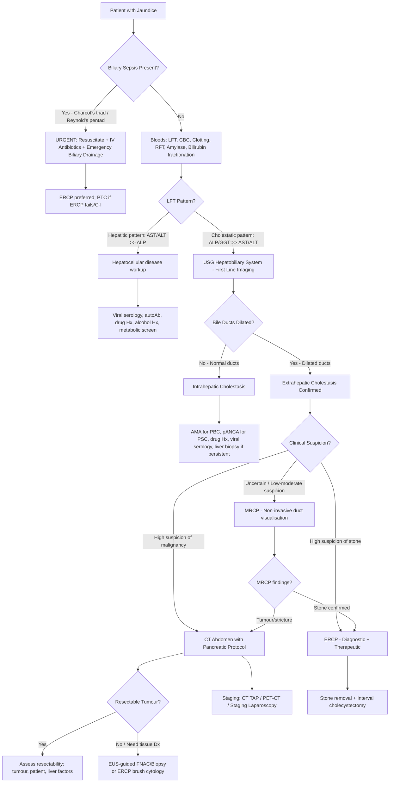

## Diagnostic Criteria for Obstructive Jaundice

There is no single "diagnostic criteria set" for obstructive jaundice the way there is for, say, rheumatoid arthritis. Instead, the diagnosis is established through a **convergence of clinical, biochemical, and imaging findings**. However, specific diagnostic criteria exist for **acute cholangitis** (the most dangerous complication of biliary obstruction), and there are well-defined biochemical and imaging patterns that confirm the diagnosis.

### A. Biochemical Diagnosis — The Cholestatic Pattern

The diagnosis of obstructive jaundice rests on recognising the ***cholestatic (ductal) LFT pattern*** [3][10][13]:

| Parameter | Expected Finding | Why |
|---|---|---|
| ***Conjugated bilirubin*** | ***↑↑*** | Conjugated bilirubin cannot be excreted → regurgitates into blood |
| ***ALP*** | ***↑↑↑*** | ALP is an enzyme located on the canalicular membrane of hepatocytes and bile duct epithelium. Cholestasis induces ALP synthesis and forces it into the blood |
| ***GGT*** | ***↑↑↑*** | Rises alongside ALP in biliary disease; ***confirms hepatobiliary origin of elevated ALP*** (ruling out bone or placental sources) [1][7] |
| AST / ALT | ***Mildly ↑*** | Hepatocytes are not primarily damaged; mild elevation reflects secondary cholestatic injury. ***The classic obstructive picture is ALP/GGT >> AST/ALT*** |
| Albumin | ***Usually normal*** | Hepatic synthetic function is preserved in early-to-moderate obstruction (unlike hepatocellular disease where albumin drops) |

> ***The classical obstructive pattern (↑bilirubin, ↑↑↑ALP/GGT >> mildly ↑AST/ALT) is more often seen in malignancy than in gallstones*** [3][10] — because malignant obstruction tends to be more complete and sustained.

**A key distinction**: ***↑INR may be due to hepatocellular dysfunction (unresponsive to vitamin K) or cholestasis (responsive to IV vitamin K)*** [13]. This is a critical clinical test — if you give parenteral vitamin K and the INR corrects within 24–48 hours, the coagulopathy is from **malabsorption** (obstructive). If it doesn't correct, the liver parenchyma is failing.

### B. Imaging Diagnosis — Dilated Ducts

The imaging hallmark of extrahepatic obstruction is ***dilatation of the biliary tree proximal to the obstruction*** [3][10]:

| Parameter | Normal | Pathological |
|---|---|---|
| ***Intrahepatic ducts*** | ***Not visible on USG ( < 2–3 mm)*** | Visible, dilated (the "parallel channel" or "shotgun" sign — dilated duct running alongside a portal vein branch) [1] |
| ***CBD diameter*** | ≤6–8 mm | ***> 8 mm is pathological*** (some use > 6 mm); post-cholecystectomy can be up to 10–11 mm [1][2][10] |

### C. Diagnostic Criteria for Acute Cholangitis (TG18/TG13 Tokyo Guidelines)

When obstruction is complicated by infection, the diagnosis shifts to **acute cholangitis**. The Tokyo Guidelines provide formal criteria [1]:

**Suspected diagnosis** — requires BOTH of:
1. ***ONE of the following***: fever or shaking chills **OR** laboratory evidence of inflammation (abnormal WBC, ↑CRP)
2. ***ONE of the following***: jaundice **OR** abnormal liver chemistries (↑AST/ALT/ALP/GGT)

**Definite diagnosis** — in addition to meeting suspected criteria, requires BOTH of:
1. ***Biliary dilatation on imaging***
2. ***Evidence of aetiology on imaging*** (e.g., stone, stricture, stent)

**Severity grading**:
- **Grade I (mild)**: does not meet criteria for Grade II or III
- **Grade II (moderate)**: any two of — WBC > 12,000 or < 4,000; fever ≥ 39°C; age ≥ 75 y; bilirubin ≥ 85 µmol/L; albumin < 0.7× LLN
- **Grade III (severe)**: organ dysfunction — cardiovascular (hypotension requiring vasopressors), neurological (altered consciousness), respiratory, renal, hepatic, or haematological (DIC)

<Callout title="Clinical Pearl — Reynold's Pentad">
***Reynold's pentad*** (present in < 10% of cholangitis patients) adds ***hypotension + altered mental status (confusion)*** to ***Charcot's triad (fever + jaundice + RUQ pain)***. This indicates ***suppurative cholangitis*** — a surgical emergency with septic shock progressing to multiorgan failure [1].
</Callout>

---

## Diagnostic Algorithm

The approach is systematic and sequential. Think of it as four progressive goals [3][10]:

***Goals of imaging*** [3][10]:
1. ***Extrahepatic vs intrahepatic cholestasis***
2. ***Level of obstruction***
3. ***Identify exact cause***
4. ***Staging of cancer (if malignant)***

### Overarching Principles of the Algorithm

Before we draw the flowchart, let's understand the **logic** behind it [3][10]:

- ***Management of biliary sepsis is the FIRST priority → it can quickly kill!*** [3][10]
- ***Drainage is NOT ALWAYS URGENT*** — the ***effect on liver function is slow in onset*** → drainage should ideally be done ***after CT abdomen*** if there are no indications for early decompression, to allow ***better tumour assessment*** [3][10]
- ***Endoscopic stenting will affect evaluation of the tumour*** on subsequent imaging → do CT ***before ERCP*** whenever possible [12]
- ***Indications for early drainage*** [3][10]:
  - ***Biliary sepsis or stones*** (stone formation usually indicates a contaminated biliary system)
  - ***Poor liver function due to prolonged cholestasis*** → must be optimised pre-operatively
  - ***Klatskin tumour*** — drainage allows normalisation of liver function, which is ***important for pre-operative ICG testing and post-operative monitoring*** (as hepatectomy is part of management)
- ***Drainage procedures carry significant risks → always balance risk vs benefit*** [3][10]
- ***In HK, delayed drainage is often not realistic as patients need to wait months for OT*** [3]

### The Master Diagnostic Algorithm

---

## Investigation Modalities — Detailed

### 1. Blood Tests (Bedside / Laboratory)

These are your **first investigations** — ordered from the Emergency Department before any imaging [1][3][10]:

#### a. Liver Function Tests (LFT)

| Test | Finding in Obstruction | Interpretation |
|---|---|---|
| ***Bilirubin (total and direct)*** | ***↑ Conjugated (direct) bilirubin*** | Confirms post-hepatic cause; ***↑bilirubin indicates complete obstruction; normal bilirubin may indicate SOL pressing on hepatic sinusoids without complete duct obstruction*** [14] |
| ***ALP*** | ***↑↑↑*** | Canalicular enzyme induced by cholestasis. ***Must confirm hepatic origin with GGT*** and ***heat-stability index (HSI)*** [14] |
| ***GGT*** | ***↑↑↑*** | ***Elevation of GGT confirms the excess ALP is of hepatobiliary origin*** [1][7] |
| AST/ALT | Mildly ↑ | Secondary hepatocyte stress from cholestasis; ***transaminase levels may initially be normal but elevate when chronic biliary obstruction leads to liver dysfunction*** [7] |
| Albumin | Normal (early); ↓ (late/chronic) | Assesses nutritional status and hepatic synthetic reserve |
| ***PT/INR*** | ***↑*** | ***Vitamin K malabsorption → ↓factors II, VII, IX, X***. Key test: give IV vitamin K → if INR corrects = cholestasis; if not = hepatocellular dysfunction [13] |

#### b. Full Blood Count (CBC with Differentials)

| Finding | Significance |
|---|---|
| ***Leukocytosis*** | ***Associated biliary sepsis*** (neutrophil predominance in cholangitis) [1] |
| ***Anaemia*** | Chronic disease, GI blood loss (ampullary tumour), malignancy |
| ***Thrombocytopenia*** | Important to check ***when planning for invasive procedures such as ERCP*** [1]; may indicate hypersplenism if underlying cirrhosis |
| ***Pancytopenia*** | ***Underlying cirrhosis with hypersplenism*** [1] |

#### c. Renal Function Tests (RFT)

- ***Check RFT for suitability of contrast CT*** [3][10] — IV contrast is nephrotoxic; need adequate renal function (eGFR)
- Also monitors for **hepatorenal syndrome** in prolonged obstruction

#### d. Amylase / Lipase

- ***Rule out concomitant biliary pancreatitis*** [3][10] — a CBD stone impacted at the ampulla can obstruct both the bile duct and the pancreatic duct simultaneously

#### e. Clotting Profile

- ***Coagulopathy due to vitamin K malabsorption, DIC, or liver disease*** [3][10]
- Must be corrected before any invasive procedure

#### f. Blood Culture and Sensitivity (Blood C/ST)

- ***For biliary sepsis*** — should be taken before starting antibiotics [3][10]
- Common organisms: ***E. coli, Klebsiella pneumoniae, Enterococcus sp., Enterobacter sp., Bacteroides fragilis*** [1]

#### g. Tumour Markers

<Callout title="Tumour Markers — Handle with Extreme Caution in MBO!" type="error">
***Take tumour markers with extreme caution in MBO!*** [3][10]:
- ***CA 19-9 is excreted via bile → invariably ↑ in ANY cholestasis. Always take CA 19-9 AFTER relief of obstruction*** for accurate interpretation. Also requires Lewis blood group antigen to be expressed (5–10% of population are Lewis-negative → CA 19-9 always low) [3][10]
- ***CEA is highly non-specific and probably has little role in initial diagnosis. Take it pre-operatively*** as a baseline [3][10]
- ***AFP is rarely useful as HCC is rarely the cause of MBO*** [3][10]. However, ***AFP > 400 is diagnostic of HCC*** and helps differentiate intrahepatic cholangiocarcinoma from HCC [7]
- ***Tumour markers are NOT sensitive and NOT specific for periampullary tumours*** — ***absence of elevated markers does NOT exclude malignancy*** [1]
</Callout>

| Marker | Relevance | Pitfall |
|---|---|---|
| ***CA 19-9*** | CA pancreas (raised in ~80%), cholangiocarcinoma | ***Invariably ↑ in cholestasis***; also ↑ in chronic pancreatitis, cholangitis, gastric CA, HCC. Useful for ***serial monitoring after resection*** for recurrence [1][7] |
| ***CEA*** | Adenocarcinoma (raised in 30–60%) | Non-specific; also ↑ in gastritis, PUD, diverticulitis, CRC, lung/breast CA [7] |
| ***AFP*** | HCC ( > 400 diagnostic) | Normal in cholangiocarcinoma (helps differentiate from HCC); rare combined HCC-cholangioCA may have high AFP [7] |

#### h. Additional Blood Tests

| Test | Indication |
|---|---|
| ***HBV and HCV serology*** | Screen for underlying chronic liver disease / HCC [1] |
| ***Serum IgG4*** | ***Evaluate for IgG4-related sclerosing cholangitis*** — a treatable mimic of cholangiocarcinoma [7] |
| ***Serum glucose*** | ***Assess for presence of DM*** — DM is both a risk factor for and a consequence of pancreatic CA; ***new-onset DM in an older adult should prompt screening for pancreatic CA*** [1] |
| Inflammatory markers (ESR, CRP) | Support diagnosis of cholangitis / infection [1] |
| ***Urinalysis*** | ***Bile (conjugated bilirubin) present in urine*** in obstructive jaundice; absent urobilinogen in complete obstruction [1] |

---

### 2. Imaging — The Core of Diagnosis

***Imaging modalities for obstructive jaundice*** (per Prof R Poon's lecture) [16]:
- ***Ultrasonography***
- ***Endoscopic ultrasonography***
- ***Endoscopic retrograde cholangiopancreatography (ERCP)***
- ***Percutaneous transhepatic cholangiography (PTC) and drainage (PTBD)***
- ***Computed tomography (CT)***
- ***Magnetic resonance imaging (MRI) and cholangiopancreatography (MRCP)***
- ***Positron emission tomography (PET)***

#### a. Transabdominal Ultrasound of the Hepatobiliary System (USG HBS) — FIRST LINE

**Why first?** It is non-invasive, inexpensive, widely available, no radiation, no contrast, and answers the single most important question: **are the bile ducts dilated?** [3][10]

***Main aim: look for any dilated biliary system → indicates extrahepatic cholestasis*** [3][10]

| Finding | Significance |
|---|---|
| ***Dilated intrahepatic ducts (> 2–3 mm, visible on USG)*** | Confirms extrahepatic obstruction |
| ***Dilated CBD ( > 6–8 mm)*** | Confirms extrahepatic obstruction; ***CBD > 8 mm is pathological*** [1][2] |
| ***CBD stone*** | ***Visible in only ~1/3 of cases*** due to ***obscuring gas in duodenum*** [2] |
| GB stone/sludge | Source of potential choledocholithiasis |
| ***Thickened GB wall, pericholecystic oedema, stranding*** | Suggests cholecystitis [10] |
| ***Thickened CBD wall*** | Suggests cholangitis [10] |
| ***Enlarged LNs, liver secondaries, ascites*** | Features of malignancy / metastatic disease [10] |
| Palpable GB correlate (distended GB on USG) | Supports Courvoisier's sign |

***Disadvantages***: ***usually unable to visualise the primary tumour and distal biliary system*** — the ***CBD, ampulla, and pancreas are obscured behind the second part of the duodenum (D2)*** by bowel gas [2][3][10]. This is why USG alone is insufficient for malignant causes.

<Callout title="USG Limitation — The Distal CBD Blind Spot" type="idea">
The most common site of pathology (distal CBD stone, CA head of pancreas, CA ampulla) is the hardest to see on USG because the retroperitoneal pancreas and gas-filled duodenum block the ultrasound beam. ***A normal USG does NOT rule out distal obstruction*** — if clinical suspicion is high, proceed to CT or MRCP regardless.
</Callout>

#### b. CT Abdomen with Pancreatic Protocol — KEY FOR MALIGNANT CAUSES

This is your **workhorse investigation** when malignancy is suspected. It serves a dual purpose: **diagnosis and staging** [3][10][12].

***Timing/Role***: ***Can be the initial investigation if suspicious for MBO*** [3][10][12]:
- ***Before USG*** — because a positive USG will need CT for diagnosis/staging anyway
- ***Before ERCP*** — because ***endoscopic stenting will affect evaluation of the tumour*** [12]

***Pancreatic protocol***: thin-sliced triphasic CT specifically designed to visualise pancreatic lesions [12]:
- ***Oral water contrast*** to improve image quality + ↓artefacts
- ***Early arterial phase (~25 seconds)*** → visualises ***aorta/SMA invasion***; ***if mass is enhancing, more likely neuroendocrine tumour*** [12]
- ***Pancreatic phase (~40 seconds)*** → visualises ***parenchymal lesions*** (the pancreas enhances maximally; a hypoenhancing mass stands out) [12]
- ***Delayed (portovenous) phase (~70 seconds)*** → visualises ***liver secondaries*** (metastases are typically hypovascular against the brightly enhancing liver parenchyma) [12]

***Accuracy***: ***~90% overall (67% if tumour ≤ 3 cm)***, but ***only 70% accurate for predicting unresectability*** [3][12]

***Key CT Findings***:

| Finding | Interpretation |
|---|---|
| ***Double duct sign*** | ***Simultaneous dilatation of pancreatic duct + CBD → indicates CA ampulla or CA head of pancreas*** [12] |
| ***Ductal dilatation ( > 6 mm) without stones*** | ***Likely malignant stricture*** [12] |
| ***Hypoenhancing pancreatic mass*** | ***CA pancreas*** — the tumour is hypovascular (poor blood supply) relative to normal pancreatic parenchyma [12] |
| ***Hypovascular liver mass*** | ***Liver secondaries (metastases)*** [12] |
| ***Ascites, peritoneal nodules*** | ***Features of metastatic disease*** [12] |
| Vascular encasement / abutment | Assesses resectability: ***involvement of SMA, hepatic artery, coeliac trunk, SMV, portal vein*** [4] |

#### c. MR Cholangiopancreatography (MRCP) — NON-INVASIVE DUCT VISUALISATION

"MRCP" = **M**agnetic **R**esonance **C**holangio**P**ancreatography — an MRI sequence that uses heavily T2-weighted images to make fluid-filled structures (bile ducts, pancreatic duct) appear bright white, producing a **non-invasive cholangiogram** without contrast injection or endoscopy [1][3][10].

***Role***: ***MRCP is used when intervention is not required*** — i.e., when you want to visualise the biliary anatomy without the risks of ERCP [3][10]. ***MRCP has largely replaced ERCP as a diagnostic tool*** [1].

***Indications***:
- ***Patients without high suspicion of biliary obstruction*** — e.g., mild elevation of bilirubin and ALP with equivocal CT findings [1]
- ***When endoscopic bile duct decompression is not likely to be necessary*** [2]
- Delineate biliary anatomy before surgery (e.g., for Klatskin tumour — defines extent of disease and remaining functional liver)
- ***If ERCP is contraindicated*** (e.g., altered anatomy post-gastrectomy)

***Advantages over ERCP***:
- Non-invasive (no sedation, no endoscopy, no radiation)
- No risk of post-ERCP pancreatitis
- Excellent for delineating the biliary tree anatomy, level and cause of obstruction

***Disadvantages***:
- **Cannot be therapeutic** — cannot place stents, remove stones, or take biopsies
- Contraindicated if patient has MRI-incompatible metallic implants
- Motion artefact in uncooperative patients

#### d. Endoscopic Retrograde Cholangiopancreatography (ERCP) — THE GOLD STANDARD (Diagnostic + Therapeutic)

"ERCP" = **E**ndoscopic (through an endoscope) **R**etrograde (injecting contrast backwards up the bile duct) **C**holangio (bile duct) **P**ancreatography (imaging of the pancreatic duct).

This is the ***gold standard for direct cholangiography*** and has the unique advantage of being ***both diagnostic and therapeutic*** [3][10][12].

***Diagnostic Indications*** [12]:
- ***Obstructive jaundice for workup***
- ***Suspected CBD stone***
- ***Suspected biliary pancreatitis***
- ***Suspected periductal malignancies*** (extrahepatic cholangioCA, CA head of pancreas, CA ampulla)
- ***Suspected sphincter of Oddi dysfunction***
- ***Suspected biliary strictures and RPC***

***Therapeutic Capabilities*** [12]:
- ***Endoscopic sphincterotomy*** (cutting the sphincter of Oddi to widen the opening)
- ***Stent insertion and removal*** (over guidewire — plastic or metallic self-expanding stents)
- ***Dilatation of strictures*** (by balloon)
- ***Retrieval of stones*** (by basket or balloon)
- ***Brush biopsy*** (***sensitivity ~60% only*** — a limitation) [12]
- ***Snare ampullary resection in CA ampulla*** (not curative) [12]

***When to choose ERCP over MRCP?*** When ***endoscopic bile duct decompression is likely to be necessary*** — i.e., high suspicion of stone, biliary sepsis requiring drainage, or need for stenting [2][3][10].

***Complications of ERCP*** (significant — this is why you don't do ERCP purely for diagnosis if MRCP can answer the question):
- ***Post-ERCP pancreatitis*** (most common significant complication, ~3–5%)
- ***Perforation*** (duodenal or bile duct)
- ***Bleeding*** (post-sphincterotomy)
- ***Cholangitis/sepsis*** (if incomplete drainage)
- ***Bacteraemia*** (thus ***antibiotic prophylaxis is required***) [2]

<Callout title="ERCP — Not Just Diagnostic Any More">
In modern practice, ***MRCP has largely replaced ERCP as a purely diagnostic tool*** [1]. ERCP is now reserved primarily for ***therapeutic intervention*** or when ***high clinical suspicion warrants simultaneous diagnosis and treatment*** (e.g., CBD stone with cholangitis). Don't subject a patient to ERCP risks just for diagnosis when MRCP can give you the same information non-invasively.
</Callout>

#### e. Percutaneous Transhepatic Cholangiography (PTC) and Drainage (PTBD)

"PTC" = injecting contrast through the skin and liver into a bile duct; "PTBD" = leaving a drainage catheter in place.

***Aim: relieves biliary obstruction*** [17]

***Technique***: ***Involves puncturing of a duct through skin and liver*** → ***contrast injected into biliary tree → ducts opacified during fluoroscopy → provides imaging guidance for drainage*** [17]

***Requires antibiotic coverage*** [17]

***Indications*** [17]:
- ***Treat obstructive jaundice (benign or malignant)*** — e.g., cholangiocarcinoma
- ***Treat biliary sepsis (cholangitis)***
- ***Treat post-operative bile leaks*** (due to surgical damage to biliary tree)
- ***Pre-operative decompression of biliary system*** — ***improve drainage → better liver function to facilitate post-surgical recovery*** (controversial) [17]

***When PTC/PTBD over ERCP?***
- ***ERCP failure or contraindication*** (e.g., altered anatomy post-gastrectomy, Roux-en-Y, complete duodenal obstruction)
- ***Proximal (hilar) tumours*** — ***ERCP is preferred for distal tumours; PTC is preferred for proximal tumours*** [6] because the endoscope approaches from below and may not adequately opacify ducts above a complete hilar block
- When percutaneous access is needed for ***bilateral drainage*** in Bismuth III/IV tumours

***May involve use of*** [17]:
- ***Plastic/metallic stents***
- ***Balloon dilatation***

***Acute complications (5–10%)*** [17]:
- ***Bleeding into biliary system*** (most common)
- ***Infection: septic shock***
- ***Pancreatitis*** (due to CBD damage — rare)
- ***Puncturing other organs*** (e.g., lungs, kidneys)

***Delayed complications (45–50%)*** [17]:
- ***Biliary sepsis (cholangitis)***
- ***Catheter migration***
- ***Bile leak*** (→ irritation)
- ***Metastatic seeding***
- ***Skin infection***

***Contraindication***: ***biliary sepsis*** is listed as a contraindication for elective cholangiography [18], though emergent PTBD *for* cholangitis is performed when ERCP has failed — the distinction is that you should not inject contrast for diagnostic purposes into an infected biliary system without providing drainage.

#### f. Endoscopic Ultrasound (EUS) — DIAGNOSIS, STAGING, AND BIOPSY

EUS combines endoscopy with a high-frequency ultrasound probe at the tip. Because the transducer sits right next to the pancreas and bile duct (through the duodenal/gastric wall), it gives **exquisite detail** of these structures without the interference of bowel gas [1][3][10].

***Roles*** [1][3][10]:
- ***Diagnosis***: visualise pancreatic masses, bile duct wall thickening, LN involvement
- ***Staging***: ***nodal involvement*** [6], T-staging of periampullary tumours
- ***Tissue diagnosis***: ***EUS-guided FNAC/biopsy*** — preferred over percutaneous USG/CT-guided biopsy for pancreatic masses (***↓risk of tumour seeding*** along the percutaneous tract) [4]

***Specific roles***:
- ***CA head of pancreas***: ***normally cannot be seen with OGD unless it has invaded through the wall of duodenum*** → EUS helps ***acquire histological diagnosis before attempting Whipple operation*** [1]
- ***Cholangiocarcinoma***: ***EUS with brush cytology can be performed but with low sensitivity and specificity***; ***EUS cannot reach the lumen of bile duct in the majority of cases*** → may require ***mother-baby cholangioscopy*** (SpyGlass) for direct visualisation and biopsy [1]
- ***NO role in diagnosing CA ampulla of Vater and CA duodenum*** — these are visible on standard OGD and can be biopsied directly [1]

#### g. PET-CT — STAGING

***Positron emission tomography*** uses FDG (fluorodeoxyglucose) to detect metabolically active tumour deposits [16].

***Role***: primarily for ***staging*** — detecting distant metastases not seen on CT, assessing equivocal lesions, and evaluating treatment response. May change management in up to 15–20% of cases by detecting occult metastases.

Not used for initial diagnosis.

#### h. Staging Laparoscopy

A minimally invasive surgical procedure to directly inspect the peritoneal cavity.

***Role***: detect ***occult peritoneal/liver metastases*** not visible on cross-sectional imaging. Particularly important before committing to a major resection (e.g., Whipple's procedure or hepatectomy for Klatskin tumour) [6].

#### i. Choledochoscopy (Mother-Baby / SpyGlass)

***Role***: direct visualisation of the bile duct lumen via a miniature endoscope passed through the working channel of a duodenoscope (during ERCP). Allows targeted biopsy of intraductal lesions. Used when ERCP brush cytology is non-diagnostic and tissue diagnosis is critical [1].

---

### 3. Tissue Diagnosis — When and How?

This is a nuanced topic. The key principle:

> ***Tissue diagnosis is NOT mandatory if the tumour is potentially resectable*** [4]. A resectable tumour on imaging should be resected regardless of biopsy result (a negative biopsy does not exclude malignancy; a biopsy delay could allow progression to unresectable disease).

***Tissue diagnosis IS required*** when [4]:
- CT ***failed to demonstrate typical features*** of the suspected malignancy
- ***Before chemotherapy*** (oncologists need a pathological diagnosis to select regimen)
- ***Suspected secondary metastasis to pancreas*** (e.g., from RCC, lung, breast — different treatment)
- ***Uncertain diagnosis*** where management would change based on histology (e.g., IgG4-related disease vs cholangiocarcinoma)

***Methods of tissue diagnosis***:
| Method | Preferred For | Notes |
|---|---|---|
| ***EUS-guided FNAC/biopsy*** | Pancreatic masses | ***Preferred over percutaneous approach*** (↓tumour seeding risk) [4] |
| ***ERCP brush cytology/biopsy*** | Bile duct strictures | ***Sensitivity ~60% only*** [12]; can also relieve jaundice by placing temporary stent simultaneously [4] |
| ***CT-guided percutaneous biopsy*** | Deep liver lesions, lymph nodes | Higher risk of tumour seeding along needle tract |
| ***Choledochoscopy (SpyGlass) with targeted biopsy*** | Indeterminate bile duct strictures | Higher sensitivity than brush cytology |
| ***OGD with biopsy*** | CA ampulla, CA duodenum | Direct visualisation and biopsy of luminal lesion |

---

### Summary: Investigation Strategy by Clinical Scenario

| Scenario | First-line Ix | Next Step | Key Points |
|---|---|---|---|
| **Suspected stone disease** (young, painful, fluctuating jaundice) | USG → LFT, CBC, amylase | Low risk: MRCP; High risk/cholangitis: ERCP | USG sees GB stones but misses 2/3 of CBD stones [2] |
| **Suspected MBO** (elderly, painless, progressive jaundice) | ***CT abdomen with pancreatic protocol*** (can skip USG) [3][10][12] | EUS ± FNAC; Staging CT TAP / PET-CT; Staging laparoscopy | ***Do CT before ERCP*** — stenting obscures tumour assessment [12] |
| **Acute cholangitis** | USG (rapid, bedside) + Bloods (CBC, LFT, CRP, Blood C/ST) | ***Emergency ERCP drainage*** (or PTBD if ERCP fails) | ***Management of sepsis is priority #1*** [3][10] |
| **Uncertain cause** (equivocal LFT, mild jaundice) | USG → MRCP | CT if mass identified; ERCP if stone/stricture on MRCP | MRCP is the non-invasive bridge between USG and intervention |
| **Known malignancy — assessing resectability** | Triphasic CT + EUS + PET-CT | Staging laparoscopy pre-operatively | ***Resectability criteria***: vascular encasement, distant mets, bilateral biliary involvement [4][6] |

---

<Callout title="High Yield Summary — Diagnosis">

1. ***Cholestatic LFT pattern***: ↑↑↑ALP/GGT >> AST/ALT; ↑conjugated bilirubin; albumin initially normal. More pronounced in malignancy than in stone disease.

2. ***USG is first-line***: confirms dilated ducts (extrahepatic cholestasis). ***CBD > 8 mm is pathological***. Limitation: cannot see distal CBD/ampulla/pancreas due to bowel gas.

3. ***CT abdomen with pancreatic protocol***: workhorse for MBO diagnosis + staging. Key findings: double duct sign, hypoenhancing pancreatic mass, vascular encasement. ***Do CT before ERCP*** (stenting obscures tumour).

4. ***MRCP***: non-invasive cholangiogram; ***has largely replaced ERCP as a diagnostic tool***. Use when intervention is unlikely.

5. ***ERCP***: gold standard for direct cholangiography; ***both diagnostic and therapeutic***. Reserve for when drainage/stenting is needed. Complications: pancreatitis, perforation, bleeding.

6. ***PTC/PTBD***: alternative when ERCP fails or is contraindicated; preferred for proximal (hilar) tumours. Acute complications (5–10%): bleeding (most common), sepsis.

7. ***EUS-guided FNAC***: preferred method for tissue diagnosis of pancreatic masses (↓tumour seeding vs percutaneous). ***Not useful for CA ampulla or CA duodenum*** (use OGD + biopsy instead).

8. ***Tissue diagnosis is NOT mandatory for potentially resectable tumours.***

9. ***Tumour markers***: CA 19-9 unreliable in cholestasis (take after drainage); CEA non-specific; AFP > 400 = HCC. ***Absence of elevated markers does NOT exclude malignancy.***

10. ***Goals of imaging***: (1) extrahepatic vs intrahepatic, (2) level of obstruction, (3) exact cause, (4) cancer staging.

</Callout>

---

<ActiveRecallQuiz
  title="Active Recall - Diagnosis of Obstructive Jaundice"
  items={[
    {
      question: "What is the first-line imaging investigation for a patient presenting with obstructive jaundice, and what is the single most important finding you are looking for?",
      markscheme: "Transabdominal ultrasound of the hepatobiliary system (USG HBS). The most important finding is dilated intrahepatic bile ducts, which confirms extrahepatic cholestasis and distinguishes it from intrahepatic cholestasis. Also look for CBD diameter (pathological if > 8 mm), CBD stones, GB stones, liver masses, and lymphadenopathy."
    },
    {
      question: "You suspect malignant biliary obstruction in an elderly patient with painless progressive jaundice. Should you order USG first or CT abdomen? Explain the reasoning.",
      markscheme: "CT abdomen with pancreatic protocol can be the initial investigation (even before USG) when MBO is highly suspected, because a positive USG will need CT anyway for diagnosis and staging. Additionally, CT should be done before ERCP because endoscopic stenting will affect evaluation of the tumour on subsequent imaging. The pancreatic protocol (triphasic: arterial, pancreatic, delayed phases) best visualises pancreatic lesions and liver metastases."
    },
    {
      question: "Describe the triphasic CT pancreatic protocol. What does each phase visualise?",
      markscheme: "Oral water contrast for image quality. (1) Early arterial phase (~25s): visualises aorta/SMA invasion; enhancing mass suggests neuroendocrine tumour. (2) Pancreatic phase (~40s): visualises parenchymal lesions; CA pancreas appears as hypoenhancing mass. (3) Delayed portovenous phase (~70s): visualises liver secondaries (hypovascular metastases against enhanced liver parenchyma)."
    },
    {
      question: "When is ERCP preferred over MRCP, and when is MRCP preferred over ERCP?",
      markscheme: "ERCP preferred: when endoscopic decompression is likely needed (high suspicion of stone, biliary sepsis requiring drainage, need for stenting/sphincterotomy). ERCP is both diagnostic and therapeutic. MRCP preferred: when intervention is not required (uncertain diagnosis, low-moderate suspicion, equivocal findings); it is non-invasive with no risk of post-ERCP pancreatitis and has largely replaced ERCP as a purely diagnostic tool."
    },
    {
      question: "A patient with a pancreatic head mass on CT needs tissue diagnosis before chemotherapy. What is the preferred biopsy method and why?",
      markscheme: "EUS-guided FNAC/biopsy is preferred over percutaneous USG/CT-guided biopsy because it has a lower risk of tumour seeding (the needle passes through the GI wall rather than through the peritoneum/skin). The EUS transducer sits adjacent to the pancreas through the duodenal wall, allowing accurate targeting. Tissue diagnosis is NOT mandatory if the tumour is potentially resectable, but IS required before chemotherapy."
    },
    {
      question: "List three indications for early biliary drainage in MBO and explain why drainage is not always urgent.",
      markscheme: "Indications for early drainage: (1) Biliary sepsis or stones (contaminated biliary system needs decompression); (2) Poor liver function due to prolonged cholestasis (needs optimisation pre-operatively); (3) Klatskin tumour (drainage normalises liver function for pre-op ICG testing and post-op monitoring as hepatectomy is needed). Drainage is not always urgent because the effect on liver function is slow in onset - doing CT before drainage allows better tumour assessment, and drainage procedures carry significant risks."
    }
  ]}
/>

---

## References

[1] Senior notes: felixlai.md (Malignant biliary obstruction diagnosis, Acute cholangitis diagnosis, Cholangiocarcinoma diagnosis sections)
[2] Senior notes: maxim.md (Obstructive jaundice section 5.3, Choledocholithiasis investigations, Cholangiocarcinoma investigations)
[3] Senior notes: Ryan Ho GI.pdf (Section 4.1.2 Malignant Biliary Obstruction p194–196, Approach to Jaundice p192–193)
[4] Senior notes: maxim.md (Pancreatic carcinoma investigations section)
[6] Senior notes: maxim.md (Cholangiocarcinoma investigations — cholangiography: ERCP for distal, PTC for proximal; staging)
[7] Senior notes: felixlai.md (Cholangiocarcinoma biochemical tests p548–549)
[10] Senior notes: Ryan Ho Fundamentals.pdf (Section 3.3.10 Malignant Biliary Obstruction p297–299, Courvoisier's law, tumour markers caution)
[12] Senior notes: Ryan Ho Fundamentals.pdf (CT abdomen pancreas protocol p299); Senior notes: Ryan Ho GI.pdf (CT findings p196, ERCP indications p196)
[13] Senior notes: Ryan Ho Fundamentals.pdf (Physical examination p296, Clotting profile interpretation); Senior notes: Ryan Ho GI.pdf (p193)
[14] Senior notes: Ryan Ho Fundamentals.pdf (Evaluation of ↑ALP p307)
[16] Lecture slides: WCS 056 - Painless jaundice and epigastric mass - by Prof R Poon.ppt (1).pdf (p34 — Imaging modalities)
[17] Senior notes: Ryan Ho Diagnostic Radiology.pdf (PTBD p82)
[18] Senior notes: Ryan Ho Diagnostic Radiology.pdf (Cholangiogram p22 — contraindication: biliary sepsis)
