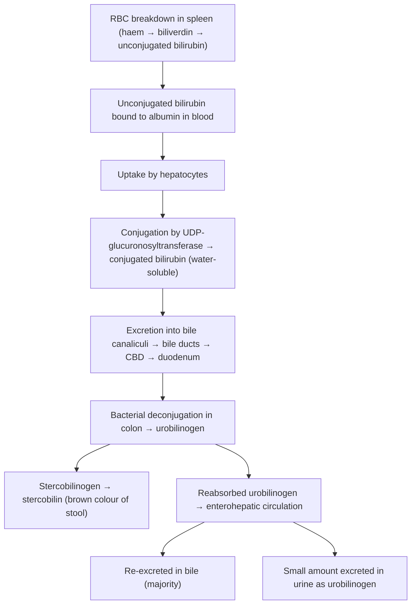

## Definition

Obstructive jaundice — also called **post-hepatic jaundice** or **surgical jaundice** — is the clinical syndrome resulting from impaired drainage of bile from the intrahepatic bile canaliculi through the biliary tree into the duodenum. The obstruction causes conjugated (direct) bilirubin to accumulate in the blood, producing the classic triad of **yellow discolouration of skin and sclerae, pale (clay-coloured) stools, and tea-coloured (dark) urine** [1][2].

Let's break the term down:
- **Obstructive** = a physical or functional blockage preventing normal flow
- **Jaundice** (from French *jaunisse*, meaning "yellowness") = yellow pigmentation of skin and mucous membranes due to elevated bilirubin; clinically detectable when serum bilirubin **≥ 2× ULN (~40–50 µmol/L)** [2][3]

> ***Painless progressive obstructive jaundice** in an elderly patient is malignant biliary obstruction until proven otherwise* [1][3][4].

<Callout title="Key Distinction">
Obstructive jaundice is fundamentally a **conjugated hyperbilirubinaemia** — the liver can conjugate bilirubin just fine, but conjugated bilirubin cannot reach the gut. This distinguishes it from pre-hepatic (unconjugated) and most hepatocellular causes.
</Callout>

---

## Epidemiology and Risk Factors

### Epidemiology (Hong Kong Focus)

| Parameter | Detail |
|---|---|
| **Gallstone-related obstruction** | Most common benign cause worldwide and in HK. Choledocholithiasis accounts for the majority of obstructive jaundice presentations to the Emergency Department. |
| **Pancreatic carcinoma** | ***6th overall for cancer mortality in HK (incidence 9.2/100,000/year)***; median age 65 y, M:F ≈ 1.3:1 [5] |
| **Cholangiocarcinoma** | 3% of all GI malignancies, 5–20% of primary liver malignancies; incidence 1–2/100,000 in the West but higher in SE Asia (parasitic infections); median age 65 y [6] |
| **Recurrent pyogenic cholangitis (RPC)** | Historically prevalent in southern China/HK due to liver flukes (*Clonorchis sinensis*); declining but still encountered [7] |
| **Gallbladder carcinoma** | Very rare in HK, more common in women; extremely poor prognosis (5-year OS < 5%) [7] |

### Risk Factors (by Aetiology)

**For gallstone-related obstruction (benign):**
- Classic "**Fat, Female, Fertile, Forty**" — risk factors for cholesterol gallstones [2]
- Obesity, rapid weight loss, metabolic syndrome, oestrogen (OCP, pregnancy), ileal disease (Crohn's), TPN

**For malignant biliary obstruction:**

| Risk Factor | Mechanism / Notes |
|---|---|
| ***Primary sclerosing cholangitis (PSC)*** | Chronic inflammation → fibrosis/stricturing of bile ducts; lifetime cholangiocarcinoma risk 5–15%; ***strongly associated with ulcerative colitis*** [6][7] |
| ***Cholelithiasis / Hepatolithiasis*** | Chronic intrahepatic stones → biliary stasis → recurrent pyogenic cholangitis → chronic inflammation → malignant transformation [7] |
| ***Parasitic infection*** (*Clonorchis sinensis*, *Opisthorchis viverrini*) | Ingestion of undercooked freshwater fish → adult flukes inhabit biliary tree → chronic inflammation → malignant transformation of ductal epithelium [6][7] |
| ***Fibrocystic liver disease*** (choledochal cysts, Caroli's disease) | Biliary stasis + reflux of pancreatic juice + abnormal bile salt transporters → chronic inflammation → cholangiocarcinoma [7] |
| ***Chronic liver disease*** (HBV, HCV, cirrhosis, alcohol) | 10× risk for intrahepatic cholangiocarcinoma [6] |
| **Smoking** | ***1.5× risk*** for pancreatic CA; most important modifiable risk factor [5] |
| ***Diabetes mellitus, obesity, metabolic syndrome*** | Promote pancreatic and biliary carcinogenesis [5][7] |
| ***Genetic syndromes*** | Lynch syndrome (MMR gene mutations), hereditary pancreatitis (PRSS1, SPINK1), BRCA1/2, Peutz-Jeghers (STK11), FAMMM (CDKN2A) [5][6] |
| ***Familial pancreatic CA*** | ≥1 first-degree relative: 4.6×; ≥2: 6.4×; ≥3: 32× [5] |
| Non-O blood group, male gender, advanced age, African-American race | Epidemiological associations for pancreatic CA [5] |

---

## Anatomy and Function of the Biliary System

Understanding obstructive jaundice is impossible without a firm grasp of biliary anatomy. Think of the biliary tree as a plumbing system that drains bile from liver to gut.

### Intrahepatic Bile Ducts
- Bile produced by hepatocytes drains into **bile canaliculi** → **interlobular (portal) bile ductules** → progressively larger **intrahepatic ducts** → **right and left hepatic ducts**.

### Extrahepatic Bile Ducts
1. **Right hepatic duct (RHD)** + **Left hepatic duct (LHD)** converge at the **hepatic hilum (confluence)** → ***Common hepatic duct (CHD)*** [1][7]
2. **Cystic duct** (from the gallbladder neck/Hartmann's pouch) joins the CHD → ***Common bile duct (CBD)***, typically ~6–8 mm in diameter (≤8 mm is normal; post-cholecystectomy up to 10–11 mm is acceptable)
3. CBD passes behind the first part of the duodenum and through the head of the pancreas
4. CBD joins the **main pancreatic duct (duct of Wirsung)** → ***hepatopancreatic ampulla (ampulla of Vater)*** → opens at the **major duodenal papilla** into the second part of the duodenum
5. The **sphincter of Oddi** is a muscular valve surrounding the ampulla, regulating bile and pancreatic juice flow

### The Gallbladder
- Located in the gallbladder fossa on the undersurface of liver segments IV and V
- Composed of **fundus, body, infundibulum (Hartmann's pouch), and neck** [7]
- Functions: concentrates and stores bile between meals; contracts in response to CCK released post-prandially

### Functional Significance
- Bile is essential for **emulsification and absorption of dietary fats and fat-soluble vitamins (A, D, E, K)**
- Bile also serves as the excretory route for **conjugated bilirubin**, cholesterol, drugs, and toxins
- **Normal barrier mechanisms** of the biliary tree prevent infection: continuous flushing action of bile, bacteriostatic bile salts, biliary mucous IgA, and the sphincter of Oddi as a mechanical anti-reflux barrier [7]

<Callout title="Clinical Pearl — Why the Level of Obstruction Matters" type="idea">
The biliary tree can be divided into three surgical segments for differential diagnosis:
- **Hilum** (confluence): Klatskin tumour, CA gallbladder, HCC, Mirizzi syndrome, porta hepatis lymphadenopathy, PSC, RPC
- **Mid-CBD**: cholangiocarcinoma of CBD, CA head of pancreas, lymphadenopathy
- **Distal CBD**: bile duct strictures, periampullary carcinoma, choledochal cysts, pancreatic cysts, chronic pancreatitis [1]

The level determines which parts of the biliary tree are dilated on imaging — this is your first clue.
</Callout>

---

## Bilirubin Metabolism — First Principles

To understand *why* obstructive jaundice produces the symptoms it does, you need to trace bilirubin from cradle to grave:

### Normal Bilirubin Pathway

### What Happens in Obstruction

When the bile duct is blocked:
1. **Conjugated bilirubin cannot enter the gut** → it regurgitates back into blood → **conjugated hyperbilirubinaemia**
2. Conjugated bilirubin is **water-soluble** → filtered by kidneys → ***tea-coloured urine*** [2][3]
3. **No bilirubin reaches the colon** → no bacterial conversion to stercobilinogen/stercobilin → ***pale/clay-coloured stools*** [1][2]
4. **No urobilinogen formed in the gut** → urinary urobilinogen is **absent** (distinguishes complete obstruction from hepatocellular jaundice, where urinary urobilinogen is actually increased) [7]
5. **Bile salts accumulate in blood** → deposit in skin → stimulate sensory nerve endings → ***generalised pruritus*** [2][3]
6. **No bile salts in gut** → impaired fat emulsification → **fat malabsorption** → **steatorrhoea** (floating, foul-smelling, difficult to flush) and **malabsorption of fat-soluble vitamins (A, D, E, K)** [1]

---

## Etiology (Hong Kong Focus)

### Systematic Classification

***The differential diagnosis of extrahepatic obstruction is organised as intraluminal, mural, and extramural*** [2][3]:

| Location | Benign | Malignant |
|---|---|---|
| **Intraluminal** | ***CBD stones*** (most common overall); ***cholangitis / RPC***; parasites (*Ascaris lumbricoides*, liver flukes — *Clonorchis sinensis*); haemobilia (very rare) | ***Tumour thrombus*** (rare, in HCC) |
| **Mural** | ***Benign strictures*** (post-instrumentation, gallstones, chronic pancreatitis); ***PSC***; ***Sphincter of Oddi dysfunction*** (intermittent) | ***Cholangiocarcinoma*** (hilar / CBD) |
| **Extramural** | ***Mirizzi syndrome***; acute/chronic pancreatitis; choledochal cysts | ***Carcinoma of head of pancreas***; ***Carcinoma of ampulla of Vater or duodenum***; ***Porta hepatis lymphadenopathy*** (from CA stomach, gallbladder, HCC, lymphoma) |

***Intrahepatic causes of cholestasis*** (not strictly "obstructive" but present similarly) [2][3]:
- Hepatocyte dysfunction (hepatitis, end-stage liver disease)
- Drugs (anabolic steroids, OCP, chlorpromazine, arsenic)
- ***Primary biliary cholangitis*** (autoimmune destruction of small ducts)
- No enteric intake / TPN (↓CCK → ↓GB contraction)
- ***Intrahepatic cholestasis of pregnancy*** (associated with ↑oestrogen)
- Massive liver SOL compressing bilateral bile ducts (very uncommon)

### Major Causes — Detailed Pathophysiology

#### 1. Choledocholithiasis (CBD Stones) — Most Common Benign Cause

Gallstones form in the gallbladder (cholesterol stones in the West, pigment stones more common in Asia) and can **migrate through the cystic duct into the CBD**. A stone impacted at the **distal CBD/ampulla** causes mechanical obstruction to bile flow.

- **Pathophysiology**: ↑biliary pressure proximal to stone → bile stasis → conjugated bilirubin regurgitates into blood → jaundice; if bacteria contaminate the stagnant bile → ascending cholangitis
- Usually presents with ***episodic, painful jaundice in younger individuals*** with a history of gallstone disease [2][3]

#### 2. Carcinoma of the Head of the Pancreas — Most Common Malignant Cause

***Ductal adenocarcinoma accounts for ~85–90%*** of pancreatic cancers. ***60% arise in the head*** of the pancreas [4][5].

- **Pathophysiology**: tumour in the pancreatic head encases or compresses the **intrapancreatic portion of the CBD** → progressive, complete obstruction → painless, progressive jaundice
- ***Head tumours present earlier*** (due to jaundice) and have a ***relatively better prognosis*** than body/tail tumours (which present late with pain and metastases) [4][5]
- ***Double duct sign*** on imaging: simultaneous dilatation of both the pancreatic duct and CBD, suggesting a mass at their confluence [4]

#### 3. Cholangiocarcinoma

Tumour of the **ductular epithelium** (cholangiocytes) of intra- or extrahepatic bile ducts. "Cholangio" = bile duct, "carcinoma" = malignant epithelial tumour.

- ***Sites***: intrahepatic ( < 10%), ***perihilar (Klatskin tumour, ~50%)***, distal (~40%) [6]
- ***Perihilar tumours classified by Bismuth-Corlette***: Type I (below confluence), II (reaching confluence), IIIa/b (involve CHD + R/L hepatic duct), IV (multicentric or involve both RHD and LHD) [6]
- **Pathophysiology**: slow-growing but locally invasive tumour causes progressive narrowing → complete obstruction of bile duct → obstructive jaundice
- ***Pathology***: adenocarcinoma (> 90%); sclerosing (majority), papillary, nodular variants; characterised by ***slow growth but early local invasion*** with marked desmoplastic (fibrotic) stromal reaction [6]

#### 4. Periampullary Carcinomas

A group of tumours arising in the region of the ampulla of Vater, including:
- ***Carcinoma of the ampulla of Vater***
- ***Carcinoma of the duodenum*** (periampullary segment)
- Distal cholangiocarcinoma
- Carcinoma of head of pancreas

These all cause distal CBD obstruction and present similarly.

#### 5. Mirizzi Syndrome

- ***A large gallstone impacted in the cystic duct or Hartmann's pouch*** extrinsically compresses the adjacent ***common hepatic duct***, causing obstructive jaundice [7]
- **Pathophysiology**: the cystic duct runs parallel and close to the CHD. A large impacted stone → direct mechanical compression + secondary inflammation → CHD obstruction. Chronic inflammation may cause cholecystobiliary fistula (erosion of the stone into the CBD) [7]
- Classified as **extramural** obstruction despite being a gallstone disease

#### 6. Recurrent Pyogenic Cholangitis (RPC)

- Also called "oriental cholangiohepatitis"; historically common in southern China/HK
- Characterised by **primary intrahepatic (pigment) stones** → recurrent bouts of bacterial cholangitis → progressive biliary stricturing
- Associated with ***Clonorchis sinensis*** infection in endemic areas [6][7]
- Important exception to Courvoisier's law (see below)

#### 7. Primary Sclerosing Cholangitis (PSC)

- Chronic progressive cholestatic disease: ***inflammation, fibrosis, and stricturing of medium and large intra-/extrahepatic bile ducts*** [8]
- ***Characteristically occurs in young men (70% men, 25–40 y)*** [8]
- ***Strongly associated with ulcerative colitis (2/3 of PSC patients have UC)*** [8]
- Characteristic "**beaded**" appearance on cholangiography (alternating strictures and dilatations)
- Risk of cholangiocarcinoma: lifetime risk 5–15%

### Pathology Producing Jaundice and Epigastric Mass

***Per Prof R Poon's lecture*** [9]:
- ***Hepatomegaly secondary to biliary obstruction***
- ***Hepatomegaly due to metastases or HCC***
- ***Lymph node metastases to the coeliac axis or porta hepatis***
- ***Carcinoma of stomach with metastatic lymph node in the porta hepatis***
- ***Distended stomach due to duodenal obstruction by tumour which obstructs the bile duct as well***

---

## Pathophysiology of Obstructive Jaundice — Systemic Consequences

Obstructive jaundice is not just "yellow skin" — it triggers a cascade of pathophysiological disturbances that increase operative risk and must be understood for management.

***Key pathophysiological disturbances due to malignant biliary obstruction (MBO)*** [1][9]:

### 1. Bleeding Tendency
- **Why?** Bile salts are needed in the gut to emulsify fats → absorb ***fat-soluble vitamin K*** → vitamin K is a cofactor for hepatic synthesis of clotting factors **II, VII, IX, X** (and proteins C and S)
- In obstruction: no bile in gut → ***vitamin K malabsorption → deficiency of vitamin K-dependent clotting factors → coagulopathy*** [1]
- ***Impaired clotting factor synthesis*** also occurs in prolonged obstruction as the liver parenchyma suffers from cholestasis-induced damage [1]
- **Clinical relevance**: must correct coagulopathy (give IV/IM vitamin K) before any invasive procedure (ERCP, PTC, surgery)

### 2. Infection / Biliary Sepsis
- **Why?** The liver's Kupffer cells (part of the reticuloendothelial system) normally clear portal-venous endotoxins absorbed from the gut. In obstructive jaundice:
  - ***Endotoxaemia*** occurs because the liver is unable to defend against gut endotoxins [1]
  - ***Impaired reticuloendothelial function*** [1]
  - ***Impaired cell-mediated immunity*** [1]
  - Absent bile salts in gut → bacterial overgrowth → increased translocation
- Patients with MBO are at significantly increased risk of post-operative sepsis

### 3. Poor Wound Healing / Poor Anastomotic Healing
- **Why?** ***Impaired protein synthesis*** by the cholestatic liver → inadequate collagen deposition and tissue repair [1]
- Nutrition is also impaired (fat malabsorption, anorexia from malignancy)

### 4. Renal Impairment (Hepatorenal Syndrome-like)
- Bile salts and bilirubin are directly nephrotoxic
- Endotoxaemia promotes renal vasoconstriction
- Dehydration from anorexia/vomiting
- **Clinical relevance**: adequate hydration and careful monitoring of renal function peri-operatively

### 5. Hepatic Dysfunction
- Prolonged cholestasis → secondary biliary cirrhosis (if chronic)
- Cholestasis impairs hepatocyte function → reduced drug metabolism, reduced synthetic function
- ***Effect on liver function is slow in onset*** [3] — this is why drainage can sometimes wait for proper imaging

---

## Classification

### By Mechanism
1. **Mechanical obstruction** (majority): physical blockage by stone, tumour, stricture
2. **Functional obstruction**: sphincter of Oddi dysfunction (intermittent, no structural lesion)

### By Nature
1. **Benign**: gallstones, benign strictures, chronic pancreatitis, choledochal cysts, PSC, Mirizzi syndrome, parasites
2. **Malignant**: CA head of pancreas, cholangiocarcinoma, CA ampulla of Vater, CA duodenum, CA gallbladder, metastatic lymphadenopathy

### By Level of Obstruction

| Level | Causes |
|---|---|
| **Hilum** | Klatskin tumour, CA gallbladder, HCC, Mirizzi syndrome, porta hepatis lymphadenopathy, PSC, RPC [1] |
| **Mid-CBD** | Cholangiocarcinoma of CBD, CA head of pancreas, lymphadenopathy [1] |
| **Distal CBD** | CBD stones, benign strictures, periampullary carcinoma, choledochal cysts, pancreatic cysts, chronic pancreatitis [1] |

### Bismuth-Corlette Classification (for Perihilar Cholangiocarcinoma) [6]

| Type | Description |
|---|---|
| I | Below the confluence of L/R hepatic ducts |
| II | Reaching the confluence |
| ***IIIa*** | ***Involve CHD and RHD*** |
| ***IIIb*** | ***Involve CHD and LHD*** |
| ***IV*** | ***Involve CHD, RHD and LHD / Multicentric*** |

---

## Clinical Features

### How to Differentiate Stone vs. Tumour at the Bedside

This is the single most important clinical question when you see obstructive jaundice. ***The lecture slides and senior notes emphasise this distinction*** [2][3]:

| Feature | Stone (Benign) | Tumour (Malignant) |
|---|---|---|
| **Age** | ***Younger*** | ***Older (> 60 y)*** |
| **Onset** | ***Episodic, sudden*** | ***Gradual, progressive*** |
| **Pain** | ***RUQ pain / biliary colic (painful jaundice)*** | ***Painless*** (until late — CA pancreas may have ***dull, boring epigastric pain radiating to back***) |
| **Fever** | Common (cholangitis) | Uncommon initially |
| **Jaundice pattern** | Fluctuating (may resolve when stone passes) | ***Progressive, deepening*** |
| **Stool** | May improve intermittently | Persistently pale |
| **Weight loss** | Minimal | ***Significant (constitutional symptoms)*** |
| **Gallbladder** | Usually NOT palpable (Courvoisier's law) | ***Palpable, non-tender*** |
| **History** | Previous biliary colic, known gallstones | New onset, no prior biliary Hx |

### Symptoms (with Pathophysiological Basis)

#### A. Jaundice (Yellow Skin and Sclerae)
- **Mechanism**: Conjugated bilirubin cannot be excreted → regurgitates into blood → deposits in tissues with high elastin content (sclera first, then skin)
- Sclera turns yellow first because bilirubin has high affinity for elastin, which is abundant in scleral tissue
- ***Obstructive jaundice classically has a greenish tinge*** (due to oxidation of bilirubin to biliverdin in prolonged obstruction) as opposed to the "lemon-yellow" of haemolysis [2][3]
- ***Clinically detectable at bilirubin ≥ 2× ULN (~40–50 µmol/L)*** [3]

#### B. Tea-Coloured Urine (Choluria)
- **Mechanism**: Conjugated bilirubin is water-soluble → freely filtered by glomeruli → excreted in urine → dark "tea-coloured" or "Pu-erh tea" (***普洱茶咁深色***) coloured urine [2][3]
- This is one of the **earliest** signs — often precedes visible jaundice
- Important to ask: "Have you recently taken rifampicin, Pyridium, or beetroot?" (these can also darken urine) [2]

#### C. Pale / Clay-Coloured Stools (Acholic Stools)
- **Mechanism**: No conjugated bilirubin reaches the colon → no bacterial deconjugation to stercobilinogen/stercobilin (the pigment that gives stool its brown colour) → ***pale, clay-coloured stools*** [1][2]
- Persistent acholic stools suggest **complete** obstruction (malignant); intermittent suggests **incomplete/ball-valve** obstruction (stone)

#### D. Steatorrhoea
- **Mechanism**: No bile salts in the gut → impaired fat emulsification → fat malabsorption → ***floating, foul-smelling stools that are difficult to flush*** [2]
- Patients may describe "oily" stools

#### E. Pruritus (Itching)
- **Mechanism**: Bile salts (and possibly other pruritogens like lysophosphatidic acid and autotaxin) accumulate in blood → deposit in skin → stimulate cutaneous sensory nerve endings and itch receptors → ***generalised pruritus***, often worse at night
- May present with **scratch marks** (excoriations) on examination
- ***Non-specific and not always reliable*** as a diagnostic feature [3]

#### F. Pain Characteristics
- **Biliary colic** (stone): sudden onset, severe, constant (despite being called "colic"), RUQ or epigastric, lasts 30 min to 6 hours, may radiate to right scapula
- ***Severe epigastric pain radiating to the back*** (CA body/tail of pancreas): ***retroperitoneal infiltration*** of the coeliac plexus [4]
- **Painless jaundice**: the hallmark of malignant biliary obstruction — tumours grow slowly and progressively obstruct without acute inflammatory changes

#### G. Constitutional Symptoms
- ***Loss of appetite (LOA), loss of weight (LOW), malaise*** [2][3]
- Mechanism: tumour-related cytokines (TNF-α, IL-6), cancer cachexia, malabsorption
- ***New-onset diabetes mellitus*** in an elderly patient with jaundice is highly suspicious of pancreatic CA (tumour destroys islets) [4]

#### H. Symptoms of Pancreatic Insufficiency (in Pancreatic CA)
- ***Steatorrhoea, maldigestion, malabsorption, new-onset DM*** — because the tumour may obstruct the pancreatic duct or destroy pancreatic parenchyma [4]

#### I. Metastatic Symptoms (in Malignant Causes)
- ***Bone pain, dyspnoea (lung mets), neck lump (Virchow's node / left supraclavicular LN)*** [3]

### Signs (with Pathophysiological Basis)

#### A. General Inspection
- **Jaundice**: inspect ***mucous membranes of sclera, mouth, palms and soles under natural light*** (protected from sun → minimises photodegradation of bilirubin) [2][3]
- **Cachexia / wasting**: suggests malignancy (cancer cachexia)
- **Scratch marks** (excoriations): from pruritus due to bile salt deposition in skin
- **Pallor**: may suggest anaemia (chronic disease, GI blood loss from ampullary tumour)
- ***Greenish jaundice***: prolonged obstructive jaundice → bilirubin oxidised to biliverdin [2]

#### B. Courvoisier's Sign (Law)

> ***"In painless jaundice, if the gallbladder is palpable, the cause is unlikely to be due to gallstones"*** — this points towards ***malignant biliary obstruction*** [1][2][7].

**Pathophysiological basis** [1][7]:
- **Gallstones** develop **chronically** → repeated bouts of cholecystitis → gallbladder wall becomes **fibrosed and contracted** → it simply **cannot distend** even when the CBD is obstructed
- **Malignant obstruction** develops **acutely** (relative to the gallbladder's history) in a previously normal, compliant gallbladder → back-pressure from CBD obstruction → ***gallbladder distends and becomes palpable***
- On palpation: ***smooth, non-tender, globular mass*** in the RUQ that moves with respiration

<Callout title="Exceptions to Courvoisier's Law" type="error">
Students often forget the exceptions:
1. ***Double impaction (~7%)*** — one stone in the CBD (causing jaundice) + another in the cystic duct (causing mucocele → gallbladder distension even in a fibrotic gallbladder) [7]
2. ***Mirizzi syndrome*** — the essential pathology is extrinsic compression of CHD by a cystic duct/Hartmann's pouch stone, not chronic cholecystitis of the gallbladder wall itself [7]
3. ***Recurrent pyogenic cholangitis (RPC)*** — the primary pathology is in the bile ducts, not the gallbladder → the gallbladder has not undergone chronic cholecystitis → it can still distend [1][7]
</Callout>

#### C. Hepatomegaly
- **Mechanism**: biliary back-pressure → distension of intrahepatic bile ducts → liver swells; or hepatic metastases (nodular, hard, irregular edge); or HCC in the setting of CLD [9]
- ***Hepatomegaly secondary to biliary obstruction*** [9]
- ***Hepatomegaly due to metastases or HCC*** [9]

#### D. Palpable Epigastric Mass
***Per lecture slides*** [9]:
- May represent:
  - ***Hepatomegaly*** (biliary obstruction or metastases)
  - ***Distended gallbladder*** (Courvoisier's sign)
  - ***Lymph node metastases to the coeliac axis or porta hepatis***
  - ***Distended stomach*** due to duodenal obstruction by tumour (gastric outlet obstruction — the same tumour can obstruct both bile duct and duodenum, e.g., CA head of pancreas)

#### E. Signs of Metastatic Disease
- **Virchow's node** (left supraclavicular — also called Troisier's sign): sentinel node for abdominal malignancies (lymphatic drainage via thoracic duct)
- **Sister Mary Joseph nodule**: periumbilical nodule from peritoneal metastases
- **Ascites**: peritoneal carcinomatosis (shifting dullness on percussion)
- **Hepatomegaly with irregular, hard, nodular edge**: liver metastases
- ***Trousseau syndrome*** (in pancreatic CA): hypercoagulable state → ***migratory superficial thrombophlebitis*** [4]
- ***Paraneoplastic pemphigoid*** (rare, pancreatic CA) [4]

#### F. Murphy's Sign
- Positive in **acute cholecystitis** (not classic obstructive jaundice per se, but relevant in differential)
- Inspiratory arrest on palpation of the RUQ — inflamed gallbladder descends with diaphragm and contacts the examining hand → pain → patient catches their breath

#### G. Signs of Chronic Liver Disease
- If obstruction is secondary to underlying CLD (e.g., HCC, cirrhosis): spider naevi, palmar erythema, gynaecomastia, caput medusae, splenomegaly, ascites, etc.

#### H. Bleeding Manifestations
- Petechiae, ecchymoses, prolonged bleeding from venepuncture sites
- **Mechanism**: vitamin K deficiency → ↓factors II, VII, IX, X → coagulopathy [1]

---

## Important History-Taking Framework

***The approach to jaundice in history-taking follows a systematic exclusion*** [2][3]:

### Step 1: Is it truly jaundice?
- Rule out **carotenaemia** (eating lots of carrots/mangoes — yellow skin but NO scleral icterus) and ***drug-induced skin discolouration (rifampicin, quinacrine, TCMs)*** [3]

### Step 2: Conjugated or Unconjugated?
- ***Conjugated***: tea-coloured urine, pale stools, pruritus ± scratch marks
- ***Unconjugated***: **none of the above** (normal urine, normal stools, no pruritus) — think haemolysis or Gilbert's [3]

### Step 3: Medical (Pre-hepatic/Hepatic) vs. Surgical (Post-hepatic)?
- ***Medical: normal-coloured urine and stool*** [2]
  - Pre-hepatic (haemolysis, Gilbert's): palpitations, dizziness
  - Hepatic (hepatitis, CLD, drugs): fever, RUQ pain, N/V
- ***Surgical: tea-coloured urine, pale stools, steatorrhoea*** [2]

### Step 4: If Surgical — Stone or Tumour?
As per the table above — key discriminators are **age, pain, progression, and constitutional symptoms** [2][3].

### Step 5: Specific Questions
- ***Cholangitis***: Charcot's triad (fever + jaundice + RUQ pain); Reynold's pentad (add hypotension + confusion) [3]
- ***CBD stone***: episodic painful jaundice, history of gallstone disease, prior ERCP/surgery [3]
- ***Malignant biliary obstruction***: new onset, painless, progressive jaundice in old individuals; ***CA pancreas: constant, dull, boring epigastric pain radiating to back*** (usually a late feature); constitutional symptoms (LOA, LOW); metastatic symptoms [3]
- ***Post-ERCP jaundice*** [3]

> **Mnemonic for hepatic causes of jaundice**: ***"All Medical Doctors Aren't Very Happy"*** = **A**lcohol, **M**etabolic, **D**rugs, **A**utoimmune, **V**irus, **H**CC [2][3]

---

## Key Pathophysiological Distinctions

| Feature | Obstruction WITHOUT bacteria | Obstruction WITH bacteria |
|---|---|---|
| **Result** | Obstructive jaundice only | ***Acute cholangitis*** (biliary sepsis) |
| **Key point** | ***Biliary bacterial contamination alone does not lead to clinical cholangitis — you need BOTH obstruction AND significant bacterial contamination*** [7] |

This is a critical concept. Many patients with gallstones have bacteria in their bile (bactobilia) but don't develop cholangitis because bile is flowing. It's the **stasis** from obstruction that allows bacterial overgrowth to dangerous levels.

---

## Summary Table: Causes of Jaundice

| | Pre-hepatic | Hepatic | Post-hepatic (Obstructive) |
|---|---|---|---|
| **Jaundice colour** | ***Lemon yellow*** | ***Yellow*** | ***Greenish*** |
| **Stools** | ***Dark (↑stercobilin)*** | ***Normal*** | ***Pale/clay-coloured*** |
| **Urine** | ***Normal*** | ***Tea-coloured*** | ***Tea-coloured*** |
| **Pruritus** | Absent | Variable | ***Present ± scratch marks*** |
| **LFT pattern** | ↑Unconjugated bilirubin; normal AST/ALT, ALP, albumin | ↑Conjugated bilirubin; ***↑↑↑AST/ALT***; ↑ALP/GGT; ↓albumin if subacute | ↑Conjugated bilirubin; ↑AST/ALT (mild); ***↑↑↑ALP/GGT***; normal albumin |
| **Key Ix** | CBC, reticulocytes, blood film, LDH, haptoglobin, Coombs test | Viral serology, autoAb, liver Bx | ***USG → MRCP/ERCP/CT*** |

[2][3]

---

<Callout title="High Yield Summary">

1. **Obstructive jaundice** = conjugated hyperbilirubinaemia from impaired bile drainage → tea-coloured urine, pale stools, pruritus, steatorrhoea, vitamin K-dependent coagulopathy.

2. ***Painless progressive obstructive jaundice in the elderly = malignant biliary obstruction until proven otherwise.***

3. **Courvoisier's sign**: painless jaundice + palpable gallbladder → unlikely stones → think periampullary tumour. Exceptions: double impaction, Mirizzi syndrome, RPC.

4. **Key differential: Stone vs Tumour** — stones are episodic, painful, fluctuating in younger patients; tumours are progressive, painless, with constitutional symptoms in older patients.

5. ***Pathophysiological disturbances of MBO***: (a) bleeding tendency (vitamin K malabsorption + impaired clotting factor synthesis), (b) biliary sepsis (endotoxaemia, impaired RES and cell-mediated immunity), (c) poor wound/anastomotic healing (impaired protein synthesis), (d) renal impairment.

6. **LFT pattern**: ↑↑↑ALP/GGT > AST/ALT (cholestatic pattern); ↑conjugated bilirubin.

7. ***Most common benign cause***: choledocholithiasis. ***Most common malignant cause***: CA head of pancreas.

8. ***Cholangiocarcinoma***: perihilar (Klatskin) most common site; classify by Bismuth-Corlette.

9. **Biliary anatomy**: RHD + LHD → CHD + cystic duct → CBD + pancreatic duct → ampulla of Vater → D2.

10. **Mnemonic for hepatic jaundice causes**: "All Medical Doctors Aren't Very Happy" — Alcohol, Metabolic, Drugs, Autoimmune, Virus, HCC.

</Callout>

---

<ActiveRecallQuiz
  title="Active Recall - Obstructive Jaundice (Definition, Etiology, Clinical Features)"
  items={[
    {
      question: "A 72-year-old man presents with painless progressive jaundice, pale stools, and a palpable non-tender gallbladder. What is the most likely category of diagnosis, and what is the pathophysiological basis for the palpable gallbladder (Courvoisier's sign)?",
      markscheme: "Most likely malignant biliary obstruction (e.g., CA head of pancreas). Courvoisier's sign: gallbladder is palpable because it was previously normal and compliant (no chronic cholecystitis/fibrosis), so it can distend from back-pressure of distal CBD obstruction. In gallstone disease, repeated cholecystitis fibroses the gallbladder wall, preventing distension."
    },
    {
      question: "Explain why obstructive jaundice causes both tea-coloured urine AND pale stools, tracing the pathophysiology from the site of obstruction.",
      markscheme: "Obstruction prevents conjugated bilirubin from entering the gut. (1) Conjugated bilirubin (water-soluble) regurgitates into blood and is filtered by kidneys into urine -> tea-coloured urine. (2) No bilirubin in colon -> no bacterial conversion to stercobilinogen/stercobilin -> pale/clay-coloured stools."
    },
    {
      question: "Name three systemic pathophysiological disturbances caused by malignant biliary obstruction that increase operative risk, and explain the mechanism of each.",
      markscheme: "(1) Bleeding tendency: no bile salts in gut -> fat-soluble vitamin K malabsorption -> deficiency of clotting factors II, VII, IX, X. (2) Biliary sepsis risk: endotoxaemia from impaired hepatic Kupffer cell function + impaired RES + impaired cell-mediated immunity. (3) Poor wound/anastomotic healing: impaired hepatic protein synthesis due to cholestatic liver damage."
    },
    {
      question: "List three exceptions to Courvoisier's law and briefly explain why the gallbladder can be palpable in each despite being associated with gallstones or benign pathology.",
      markscheme: "(1) Double impaction: stone in CBD causes jaundice + stone in cystic duct causes mucocele allowing distension even in fibrotic GB. (2) Mirizzi syndrome: pathology is extrinsic compression of CHD by cystic duct stone, not chronic cholecystitis -> GB wall not necessarily fibrosed. (3) RPC: primary pathology in bile ducts, not GB -> GB has not undergone chronic cholecystitis -> can still distend."
    },
    {
      question: "Classify the causes of extrahepatic obstructive jaundice into intraluminal, mural, and extramural, giving two examples of each.",
      markscheme: "Intraluminal: CBD stones, parasites (Ascaris, liver flukes), cholangitis/RPC. Mural: cholangiocarcinoma, benign strictures (post-instrumentation, chronic pancreatitis), PSC. Extramural: CA head of pancreas, Mirizzi syndrome, porta hepatis lymphadenopathy, CA ampulla of Vater."
    },
    {
      question: "What is the Bismuth-Corlette classification? Describe Types I through IV for perihilar cholangiocarcinoma.",
      markscheme: "Classification of perihilar (Klatskin) cholangiocarcinoma by extent of biliary involvement. Type I: below confluence of L/R hepatic ducts. Type II: reaching the confluence. Type IIIa: involves CHD + RHD. Type IIIb: involves CHD + LHD. Type IV: involves CHD + RHD + LHD, or multicentric."
    }
  ]}
/>

---

## References

[1] Senior notes: felixlai.md (Malignant biliary obstruction, Acute cholangitis, Cholangiocarcinoma sections)
[2] Senior notes: maxim.md (Obstructive jaundice section 5.3, Choledocholithiasis, Cholangiocarcinoma, Courvoisier's Law)
[3] Senior notes: Ryan Ho GI.pdf (Section 4.1.2 Malignant Biliary Obstruction, Section B Causes of Jaundice, Section C Approach to Jaundice p191–195)
[4] Senior notes: maxim.md (Pancreatic carcinoma section)
[5] Senior notes: Ryan Ho GI.pdf (Section 4.8.3 Carcinoma of Pancreas p351)
[6] Senior notes: Ryan Ho GI.pdf (Section 4.3.3 Cholangiocarcinoma p273)
[7] Senior notes: felixlai.md (Mirizzi syndrome, RPC, Cholangiocarcinoma risk factors, Gallbladder anatomy sections)
[8] Senior notes: Ryan Ho GI.pdf (Section 4.4.3 Primary Sclerosing Cholangitis p289)
[9] Lecture slides: WCS 056 - Painless jaundice and epigastric mass - by Prof R Poon.ppt (1).pdf (p3, p32)
