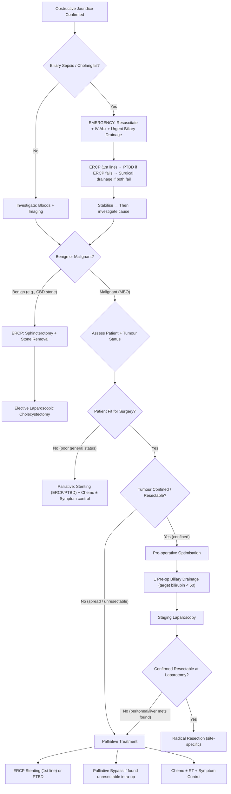

## Management Principles — The Big Picture

The management of obstructive jaundice is driven by **two parallel questions** that must be answered simultaneously [1][3][10]:

1. **What is the patient's general status?** (Can they tolerate surgery?)
2. **What is the tumour/disease status?** (Is it benign or malignant? If malignant, is it resectable?)

***The four management priorities, in order*** [19]:
1. ***Establish diagnosis***
2. ***Delineate level and cause of obstruction***
3. ***Treat suppurative cholangitis*** (if present — this kills first)
4. ***Definitive treatment***

This seemingly simple list drives every decision. Let me walk you through the logic.

---

## The Master Management Algorithm

---

## Part 1: Emergency Management — Biliary Sepsis

***Management of biliary sepsis is the FIRST priority → it can quickly kill!*** [3][10]

### Acute Cholangitis Management (RAD — must know!) [20]

The mnemonic ***RAD*** captures the three pillars:
- **R** = ***Resuscitation***
- **A** = ***Antibiotics***
- **D** = ***Drainage***

#### R — Resuscitation
- ***Recognise signs of shock***: hypotension, oliguria, altered mental status, cold and clammy skin, metabolic acidosis [1]
- IV fluid resuscitation to maintain organ perfusion and prevent multiorgan failure
- ***Continuous monitoring of vitals*** to detect failure of conservative treatment: ↑temperature/pulse, ↓BP/consciousness/urine output, increased abdominal tenderness [1]

#### A — Antibiotics
- ***Empirical antibiotics*** started immediately after blood cultures are drawn [20]:
  - ***Augmentin (amoxicillin-clavulanate)*** — covers Gram-negatives + anaerobes
  - ***OR Unasyn (ampicillin-sulbactam)***
  - ***OR Cefuroxime (Zinacef) + Metronidazole (Flagyl)*** [1][3]
- ***70–80% of patients should respond to initial antibiotic therapy within ≤24 hours*** [3]
- Target organisms: ***E. coli, Klebsiella pneumoniae, Enterococcus sp., Enterobacter sp., Bacteroides fragilis*** [1]; add ***Pseudomonas*** cover if stent is present [20]

#### D — Drainage (The Most Important Intervention)

***Urgent biliary drainage is the single most important intervention in acute cholangitis*** [3]. Why? Because ***if biliary drainage is not relieved, antibiotics cannot be excreted into the biliary tract and therefore cannot eradicate the infection*** [3] — the infected bile remains a sealed abscess.

***Timing*** [3]:
- **Mild/moderate cholangitis**: drainage ***within 24–48 hours***
- **Severe cholangitis** (organ dysfunction) or **no response to antibiotics**: drainage ***within 24 hours***

***Choice of drainage procedure*** [1][3][20][21]:

> ***First-line: ERCP*** → ***Second-line: Percutaneous (PTBD)*** → ***Third-line: Surgical drainage***

This is the ***QMH practice***: ERCP → PTBD → ECBD (exploration of CBD) [1].

| Modality | Details |
|---|---|
| ***ERCP (1st line)*** | ***Associated with significantly ↓mortality/morbidity (4.7–10% vs 10–50% with surgery)*** and ***90–95% rate of successful stone removal*** [3]. Sphincterotomy + stone extraction or stent placement. |
| ***PTBD (2nd line)*** | If ERCP fails or is contraindicated. Requires dilated biliary system. More invasive than ERCP [1]. |
| ***Surgical drainage (3rd line)*** | Open/laparoscopic exploration of CBD ± T-tube drainage. Only if ERCP and PTBD both fail [1]. |

***Relative contraindications for ERCP*** [1][21]:
- ***Altered GI anatomy***: ***Billroth II gastrectomy, Roux-en-Y*** anastomosis (the duodenoscope cannot reach the papilla in the normal way)
- Structural upper GI abnormalities (oesophageal diverticulum, stricture, gastric volvulus, GOO) [1]
- Unstable cardiopulmonary disease
- Known or suspected perforation

***ERCP complications*** [21]:
- ***Perforation***
- ***Bleeding from papillotomy (sphincterotomy)***
- ***Pancreatitis*** (most common significant complication, ~3–5%)

<Callout title="Key Principle — Definitive Treatment Deferred">
***Definitive treatment should be deferred until cholangitis has been treated and the proper diagnosis is established*** [1]. Do NOT rush a patient with active cholangitis to the operating theatre for a Whipple procedure. Stabilise first, drain, investigate, then plan definitive surgery.
</Callout>

---

## Part 2: Management of Benign Causes (CBD Stones)

### Stone Removal

***ERCP with sphincterotomy + CBD stone removal*** is the standard of care [2]:
- **Sphincterotomy**: electrocautery incision of the sphincter of Oddi to widen the papillary opening
- **Methods of stone removal** [2]:
  - ***Wire baskets*** (Dormia basket)
  - ***Stone extraction balloon***
  - ***Mechanical lithotripsy*** (for large stones that cannot be extracted whole)

### Surgical Exploration of CBD
***Indicated if ERCP is contraindicated*** (e.g., altered anatomy) [2]:
- **Approaches**:
  - ***Transcystic (1st line)***: catheter via cystic duct → cholangiogram → balloon extraction
  - ***Choledochotomy (2nd line)***: incise CBD → remove stones → choledochoscopy to confirm clearance
  - ***Percutaneous choledochoscopy***
- **Advantage**: can be performed as ***one-stage surgery together with laparoscopic cholecystectomy*** [2]
- After exploration: ***T-tube may be inserted*** for subsequent cholangiogram and bile drainage, but T-tubes are shown to ***increase complications*** (infection, bile leak, tube dislodgement) → ***primary closure preferred if existing biliary stent*** [2]

### Interval Cholecystectomy
- ***Elective laparoscopic cholecystectomy*** after stone clearance — still ***~5% risk of recurrent biliary events*** (residual/dropped stones, primary RPC stones) [2]
- Recommended within 2–6 weeks of ERCP stone clearance

---

## Part 3: Management of Malignant Biliary Obstruction (MBO)

This is the most complex and clinically important section. The decision tree hinges on two assessments [1]:

### A. Assessment of Patient Status (General Fitness)

***Assessment of patient status (good/bad)*** [1]:
- Age and concomitant medical illness
- Hidden medical illness: ***CXR, ECG, spirometry***
- Nutrition: ***LFT (albumin)***
- Fluid and electrolytes: ***RFT***
- Coagulopathy: ***CBC, clotting profile***

### B. Assessment of Tumour Status (Confined/Spread)

***Assessment of tumour status (confined/spread)*** [1]:

**Clinical signs of inoperability** [1]:
- ***Irregular surface hepatomegaly*** (liver metastases)
- ***Troisier's sign (Virchow's node)*** — left supraclavicular LN
- ***Blumer's shelf*** — peritoneal metastasis palpable on DRE
- ***Sister Mary Joseph nodules*** — periumbilical metastatic nodule
- ***Ascites*** — peritoneal metastasis

**Radiological signs of inoperability** [1]:
- ***LN metastasis*** (retropancreatic, paracoeliac, paraaortic)
- ***Distant metastasis*** (lung, peritoneum, liver)
- ***Arterial involvement***: ***SMA, coeliac axis*** (encasement > 180° is absolute contraindication) [4]
- ***Venous involvement***: ***SMV, portal vein***
  - ***Portal vein involvement is NOT an absolute contraindication*** [1] — venous resection with reconstruction is appropriate to improve resectability and achieve R0 resection (absence of microscopic residual tumour). ***QMH may consider resection of portal vein*** depending on the extent of involvement [1]
  - However, ***unreconstructible SMV/portal vein involvement*** (no suitable vessel proximal and distal for interposition graft) IS an absolute contraindication [4]

**Unresectability criteria** (for cholangiocarcinoma) [6][22]:
- ***Invasion of major vessels*** (main PV, main hepatic artery, coeliac trunk, SMA, SMV)
- ***Extensive involvement of biliary tree*** (bilaterally > 2° radicles)
- ***LN metastasis*** beyond regional nodes (retropancreatic, paracoeliac, paraaortic)
- ***Distal organ metastasis*** (lung, peritoneum)
- ***Inadequate liver remnant*** if hepatectomy is required [22]

### Decision Logic

***The flowchart from lecture*** [1]:

| Patient Status | Tumour Status | Action |
|---|---|---|
| ***Bad*** | Any | ***PTBD or endoprosthesis (palliative)*** |
| ***Good*** | ***Spread*** | ***PTBD or endoprosthesis (palliative)*** |
| ***Good*** | ***Confined*** | ***Laparotomy*** → if confirmed confined at surgery → ***radical resection (best)***; if spread found → ***bypass*** |

> ***No promise of resection until laparotomy findings document absence of spread*** [1]. Look for peritoneal nodules after laparotomy before resection → send for ***frozen section*** to rule out malignancy if suspicious [1].

---

### C. Pre-operative Optimisation

#### Why is MBO High-Risk for Surgery?

***Reasons why MBO is high risk for operation and measures to reduce complications*** [1]:

| Problem | Mechanism | Intervention |
|---|---|---|
| ***Cancer cachexia → Malnutrition*** | Tumour cytokines, anorexia, fat malabsorption | ***Nutritional support*** (enteral preferred) |
| ***Liver derangement → Bleeding tendency*** | Vitamin K malabsorption + impaired synthesis | ***IV Vitamin K + FFP during surgery*** |
| ***Superimposed biliary infection*** | Stagnant bile → bacterial overgrowth | ***Antibiotic cover*** |
| Renal impairment | Bilirubin nephrotoxicity, endotoxaemia | Adequate hydration, monitor RFT |

#### Pre-operative Biliary Drainage

This is a nuanced and frequently examined topic [1][22]:

***Target level: Serum bilirubin < 50 µmol/L*** (or ***< 20 µmol/L if concomitant partial hepatectomy is needed***) [22]

***Theoretically***: ***Do NOT need to drain if no sepsis + early surgery can be offered within 1–2 weeks*** [1]
- Pre-operative biliary drainage ***increases risk of serious complications*** even in expert hands
- But surgical-related complications are comparable even without drainage

***Practically (QMH)***: ***Drain ALL patients*** since QMH cannot offer early surgery [1]
- ***Whipple operation has to wait 6–8 weeks*** → the chance of biliary sepsis is very high without drainage while waiting [1]

***Advantages of pre-operative drainage*** [1]:
- Minimise risk of developing cholangitis
- Relieve jaundice and pruritus, prevent complications of cholestasis
- ***Allow time for neoadjuvant therapy in locally advanced CA head of pancreas***

***Disadvantages*** [1]:
- Increase number of interventions and costs
- Increase risk of procedure-related complications (cholangitis, pancreatitis, bleeding, perforation, blocked stent)
- ***Biliary stenting interferes with tumour evaluation on CT*** [22]
- Risk of ***needle tract seeding if PTBD*** is used [22]

***Indications for pre-operative drainage*** [3][10][22]:
- ***Biliary sepsis***
- ***Poor liver function*** especially if prolonged obstruction or ***partial hepatectomy needed***
- ***Klatskin tumour*** — drainage allows normalisation of liver function for ***pre-op ICG testing and post-op monitoring*** [3][10]
- Need for evaluation of biliary anatomy

<Callout title="Pre-op Drainage — Theory vs HK Reality" type="idea">
In theory, if you could operate within 1–2 weeks, you wouldn't need to drain. But ***in HK, delayed drainage is often not realistic as patients need to wait months for OT*** [3]. So the practical answer at QMH is: drain everyone with MBO who is a surgical candidate, because the wait is too long to leave them obstructed.
</Callout>

---

### D. Definitive Surgery — Site-Specific Resections

***Surgical treatment is the only potentially curative treatment*** [1]. Unfortunately, ***only 15–20% of patients are surgical candidates*** due to late presentation [1].

***Surgical treatment is directed at the underlying pathology*** [1]:

| Pathology | Operation | Key Details |
|---|---|---|
| ***Periampullary carcinoma (CA head of pancreas, CA ampulla, distal cholangioCA)*** | ***Whipple operation (pancreaticoduodenectomy)*** | ***PPPD (pylorus-preserving pancreaticoduodenectomy) can be considered*** provided R0 resection achievable — shorter operative time, less blood loss, improved post-op nutrition, lower dumping/marginal ulcer/bile reflux gastritis [1] |
| ***CA gallbladder*** | ***Radical cholecystectomy*** | Removal of tumour + ***part of liver (segments 4b and 5)*** + draining LNs [1]. T1a = simple cholecystectomy; T1b/T2 = extended cholecystectomy [1] |
| ***Klatskin tumour (perihilar cholangioCA)*** | ***Major hepatectomy + Caudate lobectomy*** + extrahepatic bile duct resection + portal LN dissection + reconstruction (Roux-en-Y hepaticojejunostomy) [1][6] | Extent depends on Bismuth-Corlette type |
| ***Intrahepatic cholangioCA*** | ***Partial hepatectomy + portal LN dissection*** [6] | |
| ***Distal cholangioCA*** | ***Pancreaticoduodenectomy (Whipple)*** [22] | Similar to CA head of pancreas |
| ***RPC*** | ***Hepatobiliary resection + biliary-enteric anastomosis (hepaticojejunostomy)*** | Resect areas of recurrent infection, biliary stasis, hepatic atrophy [1][23] |

#### The Whipple Operation — What Gets Removed?

"Whipple" = pancreaticoduodenectomy (named after Allen Whipple). It removes:
- Head of pancreas
- Duodenum (D1–D4)
- Distal stomach (classic) or preserves pylorus (PPPD)
- Gallbladder
- Distal CBD
- Regional lymph nodes

Then reconstructs with three anastomoses:
1. **Pancreaticojejunostomy** (or pancreaticogastrostomy) — reconnects pancreatic remnant to jejunum
2. **Hepaticojejunostomy** — reconnects bile duct to jejunum
3. **Gastrojejunostomy** (or duodenojejunostomy in PPPD) — reconnects stomach to jejunum

#### Adjuvant Chemotherapy

***Adjuvant chemotherapy is indicated for ALL resected CA pancreas*** [4]:
- ***Start within 12 weeks post-op*** [4]
- ***FOLFIRINOX*** (folinic acid, 5-FU, irinotecan, oxaliplatin) — current first-line adjuvant [3][4]
- ***Gemcitabine + capecitabine × 6 months*** — alternative regimen [4]

For cholangiocarcinoma: ***adjuvant chemotherapy has survival advantage*** [7]:
- ***Gemcitabine, capecitabine, leucovorin-modulated fluorouracil (5-FU)*** [7]

---

### E. Palliative Management

For the majority of patients (80–85%) who are **not surgical candidates**, palliation is the goal. The ***three main indications for palliation*** [1]:

#### 1. Relief of Obstructive Jaundice — Stenting

***ERCP with endoprosthesis (endoscopic stenting) is ALWAYS first-line*** regardless of level of obstruction, especially for periampullary carcinoma [1], except when:
- ***Contraindications for ERCP*** (altered anatomy, structural upper GI abnormalities) [1]
- ***Multiple stenting required or difficulty reaching intrahepatic bile ducts*** [1]

##### ERCP Stenting vs PTBD

***ERCP with endoprosthesis is preferred over PTBD*** [1] because:
- PTBD is technically more difficult
- ***Bleeding is common with PTBD*** due to puncture of hepatic artery or portal vein before reaching the bile duct (portal triad) [1]
- If PTBD bleeding occurs [1]:
  - Stabilise and resuscitate
  - ***Clamp the PTBD catheter***
  - Perform cholangiogram by injecting contrast into PTBD to delineate whether catheter is in hepatic artery or portal vein
  - ***Remove catheter slowly*** to control bleeding — do ***NOT*** remove immediately (converts to free haemoperitoneum)

However, for ***hilar obstruction***: ***PTBD has a higher success rate for palliation of jaundice + ↓early cholangitis*** but ERCP offers initial internal drainage → ***ERCP is usually attempted first*** [22]

##### Stent Type: Metallic vs Plastic

| Feature | ***Plastic Stent*** | ***Metallic Stent (SEMS)*** |
|---|---|---|
| Cost | Cheap | Expensive |
| Patency | ***Shorter (~2–5 months)*** → requires ***frequent exchanges*** [22] | ***Longer (≥270 days)*** [22] |
| Removability | Easily exchanged | ***Cannot be removed*** |
| Preference | If diagnosis uncertain, or as temporary bridge to surgery | ***Preferred if confirmed inoperable*** — more durable [1] |
| Covered vs uncovered | — | ***Uncovered preferred*** (no difference in patency, ↓risk of occlusion of branches of biliary system) [22] |

***Complications of biliary stenting*** [1][22]:
- ***Stent occlusion*** (most common): ***sludge*** (most common cause), ***tumour ingrowth, tumour overgrowth*** [22]
- ***Stent migration***
- ***Cholangitis / cholecystitis***

##### Unilateral vs Bilateral Stenting (for Klatskin Tumour)

For Bismuth Type II–IV tumours [22]:
- ***Only 25–30% of liver needs to be drained to relieve jaundice*** → unilateral drainage is theoretically sufficient
- However, ***bilateral stents offer complete drainage with ↓risk of biliary sepsis*** → ***usually still preferred***

##### Palliative Bypass Surgery

***Performed only when the tumour is found unresectable intra-operatively*** (during what was planned as a curative laparotomy) [3][4]:

***Double bypass*** (if jaundice + GOO) [3]:
- ***Biliary bypass***: ***hepaticojejunostomy (HJ)*** — anastomosis of jejunum to CHD; or ***choledochojejunostomy (CJ)*** — anastomosis of jejunum to CBD
  - ***Choledochoduodenostomy is NOT advised*** because of proximity of the duodenum to the tumour [1]
- ***Gastric bypass***: ***gastrojejunostomy (GJ)*** — for gastric outlet obstruction
- ***Jejunojejunostomy (JJ)*** — as part of Roux-en-Y reconstruction
- Also: ***obtain transduodenal trucut biopsy ± celiac plexus block*** during the same operation [4]

***Triple bypass***: HJ/CJ + GJ + JJ [3]

If found unresectable on imaging (never goes to OT) [4]:
- ***ERCP stenting (SEMS preferred): biliary stent ± duodenal stent***
- ***PTBD if unfit for ERCP***
- ***Systemic chemotherapy*** after obtaining tissue diagnosis (EUS-guided biopsy)

#### 2. Pain Control

- ***Narcotics (opioids)*** — e.g., morphine, as per WHO analgesic ladder [1]
- ***Celiac plexus block (celiac plexus neurolysis)***: ***endoscopic USG-guided or CT-guided*** injection of alcohol/phenol into the celiac plexus [1] — interrupts pain transmission from the retroperitoneal tumour via the splanchnic nerves. Very effective for the classic ***dull, boring epigastric pain radiating to the back***
- Short-course radiotherapy for pain

#### 3. Management of Duodenal Obstruction / Gastric Outlet Obstruction (GOO)

- ***Endoscopic duodenal wall stenting*** (SEMS) — first-line in non-operative patients
- ***PEG (percutaneous endoscopic gastrostomy) placement*** for decompression in patients unfit for stenting [1]
- ***Gastrojejunostomy*** — surgical bypass (if patient goes to OT for planned resection and is found unresectable) [1]

#### 4. Chemotherapy and Radiotherapy (Palliative Intent)

***For CA pancreas*** [1][3]:
- ***First-line: FOLFIRINOX*** (folinic acid, 5-FU, irinotecan, oxaliplatin)
- ***Gemcitabine monotherapy*** (if unfit for FOLFIRINOX)
- ***Gemcitabine*** results in ***symptomatic improvement, improved pain control, performance status and weight gain*** in unresectable pancreatic cancer [1]
- ***Neoadjuvant chemoradiotherapy***: to ***downstage patients with borderline resectable disease*** [1]

***For cholangiocarcinoma*** [7][22]:
- ***Intrahepatic***: prefer ***5-FU-based chemoirradiation***; local options include ***RFA, TACE, intra-arterial embolization, radioembolization*** [22]
- ***Extrahepatic***: prefer ***fluoropyrimidine-based chemoirradiation***; local options include ***photodynamic therapy*** [7][22]
- ***Photodynamic therapy (PDT)***: ***IV porphyrin photosensitiser → endoscopic application of specific-wavelength light to tumour bed*** [7]

#### 5. Management of Pancreatic Insufficiency

- ***Exocrine insufficiency***: pancreatic enzyme replacement therapy (PERT — e.g., Creon)
- ***Endocrine insufficiency***: oral hypoglycaemics (OHA) or insulin for new-onset diabetes [4]

---

## Part 4: Management of Specific Benign Conditions

### RPC (Recurrent Pyogenic Cholangitis)

***Acute management*** [20][23]:
- Resuscitation + antibiotics + biliary drainage (ERCP difficult for intrahepatic stones → ***PTBD or T-tube drainage or hepaticocutaneojejunostomy (HCJ)*** preferred) [20]

***Long-term management*** [23]:
- ***Regular ductal clearance***: USG surveillance, ERCP for stone retrieval / stricture dilatation
- ***Hepatobiliary resection + biliary-enteric anastomosis (hepaticojejunostomy)***: ***resect areas of recurrent infection, biliary stasis, and hepatic atrophy*** [1]
  - ***Indication***: atrophic liver segment, failed non-operative treatment, suspected cholangioCA [20]
  - Hepaticojejunostomy is frequently required; ***standard biliary drainage procedures (choledochoduodenostomy or choledochojejunostomy) are contraindicated*** since residual strictured segments may not drain adequately [1]
  - May include ***cutaneous stoma*** for future percutaneous choledochoscopy access [23]
- ***Surveillance for cholangioCA***: clinical deterioration, unexplained ↑cholestasis measures; consider routine cytology brushing during ERCP [23]

### PSC (Primary Sclerosing Cholangitis)

- **Dominant strictures**: ERCP balloon dilatation ± short-term stenting
- **Cholangitis episodes**: antibiotics + drainage
- **Medical therapy**: ursodeoxycholic acid (UDCA) — evidence debated; may improve biochemistry but uncertain effect on disease progression
- **Liver transplantation**: definitive treatment for end-stage PSC

---

## Summary: Management by Scenario

| Scenario | First-line | Surgical Option | Key Points |
|---|---|---|---|
| ***Acute cholangitis*** | RAD: Resuscitate + Abx + ERCP drainage | PTBD → Surgical if both fail | ***Drainage is the most important intervention*** |
| ***CBD stone (no sepsis)*** | ERCP sphincterotomy + stone removal | Surgical CBD exploration if ERCP fails | Elective cholecystectomy after clearance |
| ***Resectable MBO*** | Pre-op drainage (bilirubin < 50) → Staging laparoscopy → Radical resection | Whipple / hepatectomy / radical cholecystectomy (site-specific) | ***Adjuvant chemo for ALL resected CA pancreas*** |
| ***Unresectable MBO (found on imaging)*** | ERCP stenting (SEMS) + tissue Dx + chemo | — | Palliative intent only |
| ***Unresectable MBO (found intra-op)*** | — | ***Double/triple bypass*** + celiac plexus block + biopsy | Take biopsy during the same operation |
| ***RPC*** | Acute: Abx + PTBD/ERCP; Long-term: ductal clearance | Hepatobiliary resection + hepaticojejunostomy | Surveillance for cholangioCA (10% develop it) |
| ***Pain (CA pancreas)*** | Opioids → celiac plexus block | — | ***EUS-guided or CT-guided celiac plexus neurolysis*** |
| ***GOO*** | Endoscopic duodenal stent | Gastrojejunostomy | PEG for decompression if unfit |

---

<Callout title="High Yield Summary — Management">

1. ***RAD for acute cholangitis***: Resuscitate, Antibiotics (Augmentin or Cefuroxime + Flagyl), Drainage (ERCP 1st line → PTBD → surgical). ***70–80% respond to antibiotics within 24h; 15% need emergency drainage.***

2. ***ERCP with endoprosthesis is ALWAYS 1st line for palliative stenting*** — except altered anatomy or need for multiple intrahepatic stents → then PTBD.

3. ***Metallic stent preferred if confirmed inoperable*** (longer patency ≥270 days vs 2–5 months for plastic).

4. ***Pre-operative biliary drainage***: target bilirubin < 50 µmol/L. Theoretically not needed if surgery within 1–2 weeks, but ***practically at QMH drain ALL patients*** (6–8 week surgical wait).

5. ***Radical resection is the only curative option***: Whipple (periampullary), radical cholecystectomy (CA GB), major hepatectomy + caudate lobectomy (Klatskin), partial hepatectomy (intrahepatic cholangioCA).

6. ***Only 15–20% of MBO patients are surgical candidates*** due to late presentation.

7. ***Adjuvant chemo for ALL resected CA pancreas***: FOLFIRINOX or gemcitabine + capecitabine, start within 12 weeks.

8. ***Portal vein involvement is NOT an absolute contraindication*** to surgery — venous resection/reconstruction can achieve R0.

9. ***Palliative triple bypass*** (HJ + GJ + JJ) if found unresectable intra-operatively with jaundice + GOO.

10. ***Celiac plexus block*** for intractable pain in CA pancreas (EUS or CT-guided).

</Callout>

---

<ActiveRecallQuiz
  title="Active Recall - Management of Obstructive Jaundice"
  items={[
    {
      question: "A patient presents with Charcot's triad. Outline the immediate management using the RAD approach, including the choice of antibiotics and drainage modality.",
      markscheme: "R - Resuscitation: IV fluids, monitor vitals, recognise shock. A - Antibiotics: empirical Augmentin OR Cefuroxime + Metronidazole (cover GNR + anaerobes), take blood cultures first. D - Drainage: ERCP is 1st line (90-95% success for stone removal, significantly lower mortality vs surgery). If ERCP fails: PTBD. If both fail: surgical exploration of CBD with T-tube. Timing: within 24-48h for mild/moderate, within 24h for severe or non-responders. Key principle: antibiotics alone cannot eradicate infection without drainage because they cannot be excreted into the obstructed biliary tract."
    },
    {
      question: "Why is pre-operative biliary drainage controversial, and what is the practical approach at QMH?",
      markscheme: "Controversy: Drainage increases risk of procedure-related complications (cholangitis, pancreatitis, bleeding, stent blockage) and biliary stenting interferes with tumour evaluation on CT. Theoretically, drainage is not needed if no sepsis and surgery can be done within 1-2 weeks. However, at QMH, Whipple operations require 6-8 week wait, so practically ALL patients are drained (high risk of biliary sepsis during the wait). Target bilirubin: < 50 umol/L (or < 20 if hepatectomy needed)."
    },
    {
      question: "A 70-year-old with confirmed inoperable CA head of pancreas develops jaundice and GOO. What palliative interventions would you offer?",
      markscheme: "For jaundice: ERCP with SEMS (metallic stent preferred as confirmed inoperable - longer patency >= 270 days). For GOO: endoscopic duodenal SEMS, or PEG for decompression if unfit. For pain: opioids per WHO ladder, celiac plexus block (EUS or CT-guided). For pancreatic insufficiency: PERT (enzyme replacement) and OHA/insulin for DM. Systemic: palliative chemotherapy (FOLFIRINOX or gemcitabine) after EUS-guided tissue diagnosis."
    },
    {
      question: "List the absolute contraindications to radical resection for CA head of pancreas.",
      markscheme: "Absolute contraindications: (1) SMA or coeliac trunk encasement > 180 degrees; (2) Unreconstructible SMV/portal vein involvement (no suitable vessel for graft); (3) Distant metastasis (liver, peritoneum, lung); (4) Distant LN metastasis (beyond regional nodes). Note: portal vein involvement alone is NOT absolute C/I - venous resection with reconstruction is possible."
    },
    {
      question: "What are the site-specific curative operations for the following: CA head of pancreas, Klatskin tumour, and CA gallbladder T2?",
      markscheme: "CA head of pancreas: Whipple operation (pancreaticoduodenectomy) or PPPD (pylorus-preserving variant) + adjuvant chemo (FOLFIRINOX). Klatskin tumour: major hepatectomy + caudate lobectomy + extrahepatic bile duct resection + portal LN dissection + Roux-en-Y hepaticojejunostomy reconstruction (extent depends on Bismuth-Corlette type). CA gallbladder T2: extended cholecystectomy = removal of gallbladder + liver segments 4b and 5 + regional LN dissection."
    },
    {
      question: "Compare ERCP stenting and PTBD for palliative relief of obstructive jaundice. When would you choose each?",
      markscheme: "ERCP preferred as 1st line: less invasive, internal drainage (no external catheter), lower bleeding risk. PTBD preferred when: (1) ERCP fails or contraindicated (altered anatomy, GOO); (2) Multiple intrahepatic stenting required; (3) Proximal hilar obstruction (PTBD has higher success rate for hilar tumours). PTBD disadvantages: external drainage (fluid/electrolyte loss), bleeding risk from hepatic artery/portal vein puncture, catheter migration, metastatic seeding, skin infection."
    }
  ]}
/>

---

## References

[1] Senior notes: felixlai.md (MBO treatment sections p503–506, Acute cholangitis treatment p522, RPC treatment p527, Cholangiocarcinoma treatment p551, CA gallbladder treatment p569–570, CA pancreas treatment p596–597)
[2] Senior notes: maxim.md (Choledocholithiasis management section)
[3] Senior notes: Ryan Ho GI.pdf (Section 4.1.2 Approach to evaluation and management p195, Acute cholangitis Mx p256, CA pancreas management p356)
[4] Senior notes: maxim.md (Pancreatic carcinoma resectability criteria, curative and palliative treatment sections)
[6] Senior notes: maxim.md (Cholangiocarcinoma management — unresectability criteria, surgical approach)
[7] Senior notes: felixlai.md (Cholangiocarcinoma palliation and chemotherapy p551)
[10] Senior notes: Ryan Ho Fundamentals.pdf (Section 3.3.10 Approach to evaluation and management p298)
[17] Senior notes: Ryan Ho Diagnostic Radiology.pdf (PTBD p82)
[19] Lecture slides: Malignant biliary obstruction.pdf (p15 — Management priorities)
[20] Senior notes: maxim.md (Acute cholangitis acute management RAD, RPC management)
[21] Lecture slides: GC 200. RUQ pain, jaundice and fever Cholecytitis and cholangitis Imaging of GI system.pdf (p14 — ERCP first line, complications, relative contraindications)
[22] Senior notes: Ryan Ho GI.pdf (Section 4.3.3 Cholangiocarcinoma pre-op drainage p277, palliation of obstructive jaundice p278, unresectability criteria p276, surgical resection p277)
[23] Senior notes: Ryan Ho GI.pdf (RPC management p258)
