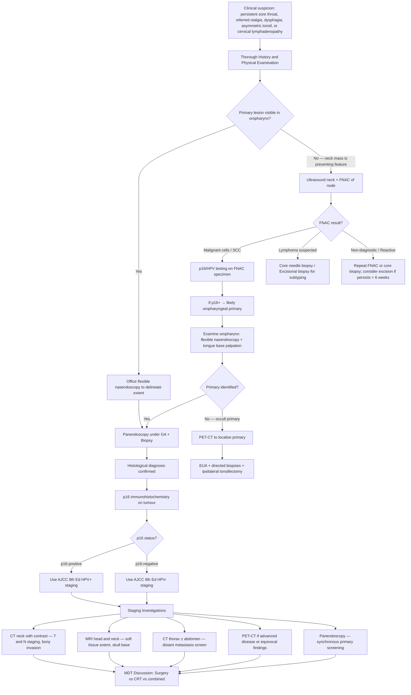

## Diagnostic Criteria, Algorithm and Investigations for Oropharyngeal Carcinoma

### 1. Diagnostic Criteria — How Do We Confirm Oropharyngeal Carcinoma?

Unlike some conditions with formal diagnostic criteria (e.g., Duke's criteria for infective endocarditis), oropharyngeal carcinoma is diagnosed through a combination of **clinical assessment + tissue biopsy (histopathological confirmation) + staging investigations**. There is no single blood test or score that clinches the diagnosis. The diagnosis is fundamentally **histological** — you must obtain tissue.

The key elements required for a complete diagnosis are:

| Component | What It Answers | How It Is Obtained |
|:---|:---|:---|
| **1. Histological confirmation** | Is it cancer? What type? | ***Panendoscopy + biopsy*** [4] or ***tonsillectomy / EUA + Bx*** [4] |
| **2. HPV/p16 status** | Is it HPV-positive or HPV-negative? (Determines staging system and prognosis) | p16 immunohistochemistry on biopsy specimen; ± HPV PCR/ISH |
| **3. T staging (tumour extent)** | How large is the primary? Does it invade adjacent structures? | Clinical examination + ***CT/MRI*** [2][4] |
| **4. N staging (nodal status)** | Are there lymph node metastases? | Clinical examination + ***ultrasound neck ± FNAC*** [2][4] + CT/MRI + PET-CT |
| **5. M staging (distant metastasis)** | Has it spread to distant sites? | CT thorax/abdomen, ***PET scan if necessary*** [4] |
| **6. Synchronous primary screening** | Is there a second primary tumour elsewhere in the aerodigestive tract? | ***Panendoscopy*** (***10% risk of synchronous/metachronous tumour due to field cancerisation***) [4] |

<Callout title="Core Principle: Tissue Is the Issue">
You cannot treat oropharyngeal carcinoma without histological confirmation. Every suspicious oropharyngeal lesion — mass, ulcer, asymmetric tonsil — must be biopsied. Clinical appearance alone can be misleading (lymphoma and minor salivary gland tumours can look similar). Furthermore, p16/HPV status is mandatory because it determines the staging system and treatment intensity.
</Callout>

---

### 2. Diagnostic Algorithm

The following algorithm represents the standard clinical approach when you encounter a patient with suspected oropharyngeal carcinoma — whether they present with an oropharyngeal lesion directly or with a cervical neck mass.

---

### 3. Investigation Modalities — Detailed Breakdown

#### 3.1 History and Physical Examination

These are the first and most important "investigations." The lecture slides emphasise a structured approach:

**History** (***from lecture slides*** [3][4]):
- ***Sore throat*** — duration, unilateral vs bilateral, progressive?
- ***Referred otalgia*** — ipsilateral ear pain with normal otoscopy is a red flag
- ***Dysphagia, odynophagia*** — to solids, liquids, or both?
- ***Muffled speech*** — "hot-potato" voice suggests tongue base involvement
- ***Risk factors: smoking, alcohol, oral sex (HPV related)*** [3]
- Constitutional symptoms — weight loss, appetite
- Timeline — weeks to months of symptoms (acute onset → think infection, not cancer)

**Physical Examination** (***from lecture slides*** [3]):
- ***Mass / ulcer*** — inspect the oropharynx: open the mouth, depress the tongue, use a headlight
- ***Trismus*** — ask the patient to open their mouth maximally; inter-incisal distance < 35 mm is trismus. Indicates pterygoid invasion = advanced disease
- ***Asymmetrical tonsil*** — compare left and right; any unilateral enlargement or surface irregularity is suspicious
- ***50% cervical LN*** [3] — systematic palpation of all cervical nodal levels (I–V, plus suboccipital and parotid regions); note size, consistency (firm/hard = suspicious), fixation, tenderness
- **Bimanual palpation of tongue base** — the tongue base is difficult to see but can be palpated bimanually (one finger in the mouth, one finger externally submandibularly) to assess for deep tumour extent
- **Flexible nasendoscopy** — performed in clinic; allows visualisation of the nasopharynx (rule out NPC), oropharynx, hypopharynx, and larynx (vocal cord mobility); essential for complete assessment
- **Cranial nerve examination** — especially CN V3 (sensation), VII (facial symmetry), IX (gag reflex, palatal movement), X (vocal cord — hoarseness), XI (shoulder shrug), XII (tongue protrusion and deviation)

> **Why cranial nerves?** Oropharyngeal tumours can invade the parapharyngeal space, which contains the carotid sheath and cranial nerves IX–XII. Advanced disease with skull base erosion can affect any of these.

---

#### 3.2 Panendoscopy + Biopsy — The Definitive Diagnostic Procedure

***Panendoscopy + biopsy*** [4] is the cornerstone investigation. Let's break down what this involves and why each component matters.

**What is panendoscopy?**

"Pan-" (Greek: all) + "endo-" (within) + "-scopy" (looking) = looking at everything inside. It is a comprehensive endoscopic examination of the entire upper aerodigestive tract performed under general anaesthesia.

***Panendoscopy includes direct laryngoscopy, bronchoscopy and OGD*** [2]:

| Component | What It Examines | Why It Is Done |
|:---|:---|:---|
| **Direct laryngoscopy** | Oropharynx, hypopharynx, larynx (including vocal cord mobility) | Assess primary tumour extent; examine for hypopharyngeal or laryngeal extension; evaluate airway |
| **Bronchoscopy** | Tracheobronchial tree | Screen for synchronous lung/bronchial primary (especially in smokers) |
| ***OGD (oesophagogastroduodenoscopy)*** | Oesophagus, stomach | ***Patients who develop tumour in the oral cavity and the oropharynx are more likely to develop a second primary tumour in the upper oesophagus*** [2] |

**Biopsy during panendoscopy:**

- ***Incisional biopsy should be performed in all cases*** [2] — take representative tissue from the lesion edge (include both tumour and normal tissue at the margin)
- If the primary is in the tonsil, ***tonsillectomy or EUA + Bx*** [4] can be performed — tonsillectomy provides the entire specimen for assessment and is particularly useful when:
  - The tonsillar primary is occult (not visible on surface) but suspected based on p16-positive neck node
  - Need to assess depth of invasion accurately
- ***Assess tumour extent and look for synchronous tumour*** [2]

<Callout title="Why Panendoscopy Is Mandatory" type="idea">
***10% risk of synchronous/metachronous tumour (field cancerisation)*** [4]. This means for every 10 patients with oropharyngeal SCC, 1 will have ANOTHER primary tumour somewhere else in the aerodigestive tract. If you skip panendoscopy, you may miss a second cancer in the oesophagus, larynx, or bronchus — and the patient's prognosis will be dramatically worse because you're treating only one of two cancers.
</Callout>

---

#### 3.3 Pathological Tests on Biopsy/FNA Specimens

Once tissue is obtained, the following pathological assessments are performed:

##### a) Histopathology

- **H&E staining** — confirms the diagnosis: SCC (keratinising vs non-keratinising), lymphoma, salivary gland tumour, etc.
- **Tumour grading** — well-differentiated (G1), moderately differentiated (G2), poorly differentiated (G3)
  - HPV-positive oropharyngeal SCC is characteristically **non-keratinising** and **basaloid** in appearance — it may look "poorly differentiated" on H&E but this does NOT carry the same poor prognostic connotation as poorly differentiated HPV-negative SCC

##### b) p16 Immunohistochemistry (IHC) — Surrogate Marker for HPV

- **What it detects**: p16^INK4a protein overexpression
- **Why it works**: In HPV-positive tumours, the E7 oncoprotein inactivates Rb → loss of Rb-mediated negative feedback on p16 → p16 accumulates (paradoxical overexpression). p16 is therefore a **surrogate marker** for transcriptionally active HPV infection.
- **Positive result**: ≥ 70% of tumour cells show strong, diffuse nuclear AND cytoplasmic staining
- **Clinical significance**: p16-positive → use the AJCC 8th Edition HPV-positive staging system; implies better prognosis and potential for treatment de-intensification
- **Limitations**: p16 can rarely be overexpressed without HPV (e.g., in some HPV-negative tumours with CDKN2A alterations) — if clinical doubt exists, confirmatory HPV-specific testing (DNA ISH or RNA ISH) can be performed

##### c) HPV-Specific Testing (When Needed)

- **HPV DNA PCR** — detects HPV DNA; highly sensitive but does not confirm transcriptional activity (could detect latent virus)
- **HPV DNA in-situ hybridisation (ISH)** — localises HPV DNA within tumour cells on tissue section
- **HPV E6/E7 mRNA ISH** — gold standard; confirms transcriptionally active HPV (the virus is actually driving the tumour)
- In routine clinical practice, **p16 IHC alone is sufficient** for oropharyngeal SCC per AJCC/CAP guidelines. Confirmatory HPV testing is reserved for discordant cases.

##### d) FNA of Cervical Lymph Nodes

***USG-guided FNAC*** [2][4]:
- ***USG has limited use in oropharyngeal cancer but is a useful adjunct for FNAC to ensure accurate aspiration of a deeply seated lymph node swelling*** [2]
- ***Aspirate is used for cytological analysis, PCR testing for virus*** [6]:
  - ***HPV for oropharyngeal squamous cell carcinoma*** [6]
  - ***EBV for nasopharyngeal carcinoma (NPC)*** [6]
- ***Does NOT provide material for tissue architecture or immunohistochemical analysis*** [6] — this is why if lymphoma is suspected, you need a core needle or excisional biopsy

> **Clinical scenario**: A patient presents with a Level II neck mass but no visible primary. You perform USG-FNAC → cytology shows malignant squamous cells, p16 is positive on cell block → this tells you the primary is almost certainly in the oropharynx (tonsil or tongue base). You then proceed to examination under anaesthesia with directed biopsies and ipsilateral tonsillectomy to find the occult primary.

---

#### 3.4 Imaging Investigations

The purpose of imaging in oropharyngeal carcinoma is threefold:
1. **Delineate the extent of the primary tumour** (T staging)
2. **Assess cervical lymph node status** (N staging)
3. **Screen for distant metastasis and synchronous primaries** (M staging)

##### a) Ultrasound (USG) of the Neck

***Ultrasound neck +/- FNAC*** [4]

| Aspect | Details |
|:---|:---|
| **Role** | Primarily for assessment of cervical lymph nodes, NOT for the primary tumour (primary is deep in the oropharynx, beyond ultrasound's reach) |
| **What it detects** | Lymph node size, shape, echogenicity, presence of necrosis/cystic change, loss of fatty hilum |
| **Key advantage** | Real-time guidance for FNAC of suspicious nodes; no radiation; inexpensive |
| **Limitations** | ***USG has limited use in oropharyngeal cancer*** [2] — cannot assess the primary tumour depth, cannot evaluate retropharyngeal nodes or parapharyngeal space invasion |
| **Suspicious LN features on USG** | Rounded shape (loss of normal oval "kidney-bean" shape), loss of echogenic fatty hilum, heterogeneous echotexture, cystic change (particularly in HPV+ disease), peripheral vascularity on Doppler |

##### b) CT Scan (Computed Tomography)

***CT*** [2][4] — the workhorse of head and neck cancer staging.

| Aspect | Details |
|:---|:---|
| **Protocol** | Contrast-enhanced CT of the neck (axial + coronal + sagittal reformats); CT thorax ± abdomen for distant metastasis |
| **Primary tumour** | ***Useful to detect bony invasion*** [2] — CT is **superior to MRI** for demonstrating cortical bone destruction (e.g., mandibular invasion in T4a disease) [7] |
| **Regional LN** | ***Detection of cervical lymph node metastasis*** [2] — features of pathological nodes include: size > 1.0 cm in minimal axial diameter, rounded shape, heterogeneous enhancement, loss of normal fatty hilum, central necrosis [7] |
| **Distant metastasis** | ***CT thorax and abdomen to assess for distant metastasis*** [2] — screens for lung metastases (most common distant site), liver metastases, mediastinal lymphadenopathy |
| **Advantages** | Fast acquisition, wide availability, excellent spatial resolution, superior for bone assessment, can image the entire chest/abdomen in one session |
| **Limitations** | Radiation exposure; less detailed soft tissue contrast compared to MRI; dental amalgam artefact can degrade oral cavity/oropharyngeal images |

**Key CT findings in oropharyngeal carcinoma:**
- **Primary**: Enhancing mass in the tonsil/tongue base/soft palate with obliteration of normal tissue planes; invasion through pharyngeal constrictor into parapharyngeal fat (loss of the normal fat plane = invasion)
- **Mandible invasion**: Cortical erosion or destruction of the ascending ramus (T4a)
- **Pathological nodes**: Central necrosis (ring-enhancing node), cystic degeneration (HPV+ characteristic), extranodal extension (irregular nodal margin, infiltration into surrounding fat)

##### c) MRI Scan (Magnetic Resonance Imaging)

***MRI*** [2][4] — ***the imaging modality of choice for cancer of the oral cavity and oropharynx*** [2].

| Aspect | Details |
|:---|:---|
| **Protocol** | T1-weighted, T2-weighted, post-gadolinium T1 with fat suppression; DWI (diffusion-weighted imaging) increasingly used |
| **Primary tumour** | ***Provides optimal visualisation of soft-tissue infiltration of the tumour*** [2] — superior to CT for delineating tumour margins against surrounding muscle (e.g., extent of tongue base invasion, spread to intrinsic/extrinsic tongue muscles) |
| **Bone marrow invasion** | MRI is **superior to CT** for detecting bone marrow invasion of the mandible [7] — CT only sees cortical destruction, but MRI can detect marrow replacement before the cortex is breached |
| **Perineural spread** | MRI is the modality of choice for detecting perineural tumour spread (e.g., along CN V3 toward foramen ovale, or along CN XII in the hypoglossal canal) — seen as nerve thickening/enhancement |
| **Skull base** | MRI is superior for evaluating skull base erosion and intracranial extension |
| **Regional LN** | ***Detection of cervical lymph node metastasis*** [2] — similar criteria to CT but with better soft tissue contrast |
| **Advantages** | No radiation; superior soft tissue contrast; best for T staging in oropharynx; detects marrow invasion and perineural spread |
| **Limitations** | Longer acquisition time, motion artefact (swallowing), less available than CT, contraindicated with certain metallic implants, more expensive |

**Key MRI findings:**
- **T1-weighted**: Tumour appears isointense to slightly hypointense relative to muscle; replacement of normal high-signal parapharyngeal fat = evidence of lateral invasion
- **T2-weighted**: Tumour appears hyperintense; useful for delineating tumour extent against surrounding muscle
- **Post-gadolinium T1 fat-sat**: Tumour enhances; perineural spread seen as nerve enhancement and thickening
- **DWI**: Tumour shows restricted diffusion (high cellularity) — useful for distinguishing tumour from post-treatment changes

<Callout title="CT vs MRI — When to Use Which?" type="idea">

| Question | Best Modality | Why |
|:---|:---|:---|
| Cortical bone invasion of mandible? | CT | CT has superior spatial resolution for cortical bone |
| Bone marrow invasion? | MRI | MRI detects marrow replacement before cortex is destroyed |
| Soft tissue extent of primary? | MRI | Superior soft tissue contrast — ***imaging modality of choice for oropharynx*** |
| Perineural spread? | MRI | Can see nerve enhancement/thickening on post-contrast sequences |
| Cervical lymph nodes? | Either; CT often first-line | Both detect size/necrosis; CT is faster and more widely available |
| Distant metastases? | CT thorax/abdomen | Fast, comprehensive, readily available |
| Skull base erosion? | MRI | Superior for detecting intracranial extension |

**In practice**: Most patients get BOTH CT (for bone and distant metastasis) and MRI (for soft tissue T staging). They are complementary, not competing.
</Callout>

##### d) PET-CT Scan (Positron Emission Tomography – Computed Tomography)

***PET scan if necessary*** [4]

| Aspect | Details |
|:---|:---|
| **Tracer** | 18F-FDG (fluorodeoxyglucose) — a glucose analogue; cancer cells are metabolically hyperactive and take up more FDG → "hot spots" |
| **Roles** | (1) Detect occult primary when neck node is positive but no primary found on examination/CT/MRI; (2) ***Identify primary disease or detect distant metastatic disease*** [6]; (3) Detect synchronous primaries in the aerodigestive tract; (4) Post-treatment surveillance — distinguish recurrence from post-treatment fibrosis |
| **Advantages** | ***PET scan is superior to both CT and MRI for detecting regional nodal metastasis as well as distant metastasis and second primary tumours*** [7]; functional imaging (metabolic activity, not just anatomy) |
| **Limitations** | False positives from inflammation/infection; poor spatial resolution for small tumours ( < 8–10 mm); not useful immediately post-treatment (inflammation confounds); expensive; limited availability |
| **When to use** | Advanced disease (Stage III/IV) — screens for distant metastases that would change management from curative to palliative; occult primary workup; equivocal findings on CT/MRI |

> **PET-CT vs Panendoscopy for synchronous tumour detection**: ***Panendoscopy may identify synchronous primaries that are too small to be identified with PET scan*** [7], but ***PET scan may identify lower aerodigestive tract tumours not seen with panendoscopy*** [7]. They are complementary — both should be done in appropriate patients.

##### e) CXR (Chest X-Ray)

***CXR*** [4]

- Simple, fast, first-line screening for lung metastases or synchronous lung primary
- Limited sensitivity compared to CT thorax — small pulmonary nodules may be missed
- In current practice, CT thorax is preferred for staging, but CXR remains part of the initial workup per lecture slides [4]

---

#### 3.5 Blood Tests and Biomarkers

While there is no diagnostic blood test for oropharyngeal carcinoma, baseline bloods are important for:

| Test | Purpose |
|:---|:---|
| **FBC** | Baseline for treatment planning (anaemia from chronic disease/bleeding; leucocyte count for fitness for chemotherapy) |
| **Renal function (Cr, eGFR)** | Required before contrast CT; cisplatin is nephrotoxic — need baseline before chemotherapy |
| **Liver function (LFT)** | Baseline for chemotherapy; screen for liver metastasis (elevated ALP, GGT) |
| **Thyroid function (TFT)** | Baseline before radiotherapy — radiation to the neck can cause hypothyroidism |
| **Nutritional markers (albumin, pre-albumin)** | Many patients are malnourished from dysphagia; low albumin predicts poor surgical outcomes |
| **EBV DNA (plasma)** | To exclude NPC as the primary (relevant in Hong Kong) |
| **Coagulation (PT/APTT)** | Pre-operative assessment |

---

#### 3.6 Pre-Treatment Assessment — Multidisciplinary

Before treatment, the following additional assessments are critical:

- **Dental assessment**: All patients planned for radiotherapy to the oropharynx must have a dental evaluation. Teeth in the radiation field that are carious or periodontally compromised should be extracted BEFORE radiotherapy begins. Why? Radiotherapy causes hyposalivation (xerostomia) and reduces blood supply to the mandible → post-radiation extraction carries a high risk of osteoradionecrosis (ORN).
- **Speech and swallowing assessment**: Baseline evaluation by speech pathologist — needed to plan rehabilitation and compare post-treatment function
- **Nutritional assessment**: Dietitian input; many patients will need a nasogastric tube or prophylactic PEG/RIG for enteral feeding during treatment
- **Audiometry**: If cisplatin chemotherapy is planned (ototoxic)
- **Airway assessment**: ***ALWAYS protect the airway for all H&N cancer*** [2] — if there is risk of airway compromise, secure the airway first

---

### 4. Interpretation Framework — Putting It All Together

When all investigations are complete, you should be able to answer:

| Question | Investigation That Answers It |
|:---|:---|
| What is the histological diagnosis? | Biopsy (H&E staining) |
| Is it HPV-positive or HPV-negative? | p16 IHC ± HPV DNA/RNA ISH |
| What is the T stage? | Clinical examination + MRI (primary modality) + CT (bony invasion) |
| What is the N stage? | Clinical examination + USG ± FNAC + CT/MRI + PET-CT |
| What is the M stage? | CT thorax/abdomen + PET-CT |
| Is there a synchronous primary? | Panendoscopy + PET-CT |
| Is the patient fit for treatment? | Blood tests, nutritional assessment, dental evaluation, airway assessment |

The completed staging is then presented at the **Head and Neck Multidisciplinary Team (MDT) meeting** where surgeons, oncologists, radiologists, pathologists, and allied health professionals collectively decide the optimal treatment plan.

---

<Callout title="High Yield Summary">

**Diagnosis of oropharyngeal carcinoma requires histological confirmation — always biopsy.**

**Workup per lecture slides** [4]:
1. ***History*** and ***Physical Examination*** (including flexible nasendoscopy)
2. ***Panendoscopy + biopsy*** — confirms histology; ***10% risk of synchronous/metachronous tumour***
3. ***Tonsillectomy or EUA + Bx*** — especially for occult tonsillar primary
4. ***Ultrasound neck +/- FNAC*** — FNA for cytology + p16/HPV testing on neck nodes
5. ***CXR*** — initial screen
6. ***CT / MRI*** — CT for bone and distant metastasis; ***MRI is the imaging modality of choice for oropharynx*** (soft tissue)
7. ***PET scan if necessary*** — for advanced disease, occult primary, distant metastasis

**p16 IHC** is the standard surrogate marker for HPV status. Positive = ≥ 70% diffuse nuclear + cytoplasmic staining → use AJCC 8th Ed HPV-positive staging.

**CT vs MRI**: CT better for cortical bone invasion; MRI better for soft tissue extent, marrow invasion, perineural spread. In practice, get BOTH.

**FNA of nodes**: Useful for cytology + HPV PCR; does NOT provide tissue architecture (cannot subtype lymphoma).

**Panendoscopy = direct laryngoscopy + bronchoscopy + OGD**: Mandatory for synchronous primary screening.

</Callout>

---

<ActiveRecallQuiz
  title="Active Recall - Diagnosis and Investigations of Oropharyngeal Carcinoma"
  items={[
    {
      question: "List the components of panendoscopy and explain why each is performed in the workup of oropharyngeal carcinoma.",
      markscheme: "Direct laryngoscopy (assess primary tumour extent, hypopharynx, larynx, vocal cords), bronchoscopy (screen for synchronous bronchial/lung primary — especially in smokers), and OGD (screen for synchronous oesophageal primary — oral cavity and oropharyngeal tumour patients have higher risk of upper oesophageal second primary). All done because of 10% risk of synchronous/metachronous tumour from field cancerisation."
    },
    {
      question: "What is the surrogate immunohistochemical marker for HPV-positive oropharyngeal SCC, and explain the molecular reason why it is overexpressed in HPV-driven tumours.",
      markscheme: "p16 INK4a. In HPV-positive tumours, E7 oncoprotein inactivates Rb. Normally, Rb suppresses p16 transcription via negative feedback. When Rb is inactivated, this feedback is lost, and p16 accumulates (paradoxical overexpression). Positive defined as 70% or more of tumour cells showing diffuse nuclear and cytoplasmic staining."
    },
    {
      question: "When is MRI preferred over CT in the assessment of oropharyngeal carcinoma, and when is CT preferred?",
      markscheme: "MRI preferred for: soft tissue extent of primary tumour (imaging modality of choice for oropharynx), bone marrow invasion of mandible, perineural tumour spread, skull base erosion. CT preferred for: cortical bone destruction, faster acquisition, distant metastasis screening (CT thorax/abdomen), and when MRI is contraindicated."
    },
    {
      question: "A patient has a p16-positive Level II cystic neck node on FNAC but no visible oropharyngeal primary on flexible nasendoscopy. What is your next step?",
      markscheme: "Proceed to PET-CT to attempt to localise the occult primary. Then perform EUA with directed biopsies of likely sub-sites (tongue base, tonsil, nasopharynx) plus ipsilateral tonsillectomy. Tonsillectomy of the ipsilateral tonsil identifies an occult tonsillar primary in up to 30% of cases."
    },
    {
      question: "Why must all patients planned for oropharyngeal radiotherapy undergo dental assessment before treatment?",
      markscheme: "Radiotherapy causes hyposalivation (xerostomia) and reduced blood supply to the mandible. Carious or periodontally compromised teeth in the radiation field must be extracted before RT begins, because post-radiation tooth extraction carries a high risk of osteoradionecrosis (ORN) due to impaired healing in irradiated bone."
    },
    {
      question: "State two limitations of FNA in the diagnostic workup of an oropharyngeal mass or cervical node.",
      markscheme: "1. FNA does NOT provide material for tissue architecture or immunohistochemical analysis — cannot subtype lymphoma (which requires assessment of tissue architecture, immunophenotyping). 2. FNA may be non-diagnostic if the sample is hypocellular or poorly representative. For suspected lymphoma, core needle biopsy or excisional biopsy is required."
    }
  ]}
/>

## References

[2] Senior notes: felixlai.md (CA Oropharynx — Diagnosis section, field cancerisation, patterns of metastasis)
[3] Lecture slides: GC 219. Infections and tumours in pharynx and oral cavity.pdf (p37 — History and Examination)
[4] Lecture slides: GC 219. Infections and tumours in pharynx and oral cavity.pdf (p42 — Workup and Investigation)
[6] Senior notes: felixlai.md (Pathological tests — FNA, biopsy, HPV/EBV PCR)
[7] Senior notes: felixlai.md (H&N cancer — Radiological tests: CT, MRI, panendoscopy, PET scan)
