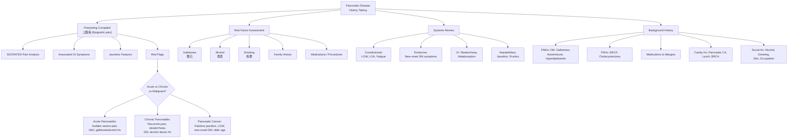

# History Taking: Pancreatic Disease

## Master Framework

---

## Overview & Approach

"Pancreatic disease" is a broad chief complaint that encompasses three major clinical entities you must distinguish:

1. **Acute pancreatitis** – reversible pancreatic parenchymal damage from acute inflammation [1][2]
2. **Chronic pancreatitis** – irreversible destruction of exocrine parenchyma with fibrosis and late endocrine destruction [3]
3. **Pancreatic cancer** – predominantly ductal adenocarcinoma (85% of malignant neoplasms), with 70% in the head of pancreas [4]

Your job in the history is to (a) identify which entity you're dealing with, (b) grade severity and complications, and (c) formulate a management plan. Let's work through this systematically.

---

## 1. Presenting Complaint Framework

### 1.1 Pain Analysis (SOCRATES)

This is the single most important part of the history. Pancreatic pain has a characteristic signature, but each disease has its own nuance.

| SOCRATES                 | Questions & Phrasing                                                                                    | Why This Matters                                                                                                                                                                       |
| ------------------------ | ------------------------------------------------------------------------------------------------------- | -------------------------------------------------------------------------------------------------------------------------------------------------------------------------------------- |
| **Site**                 | "Where exactly is the pain?" / 「痛喺邊度？」(tung hai bin dou?)                                        | Pancreatic pain is classically **_epigastric_** (上腹痛) but may be felt in RUQ or LUQ [1][5]. Head lesions → RUQ; tail lesions → LUQ.                                                 |
| **Onset**                | "When did it start? Was it sudden or gradual?" / 「幾時開始痛？突然定慢慢嚟？」                         | **_Rapid onset_** → gallstone pancreatitis; **_less abrupt_** → alcoholic pancreatitis [1]. **_Insidious_** → chronic pancreatitis or malignancy [3][4].                               |
| **Character**            | "Can you describe the pain? Is it sharp, dull, boring?" / 「痛嘅感覺係點？」                            | Acute pancreatitis: **_severe, constant, boring_**. Chronic pancreatitis: dull ache worsening after meals. CA pancreas: **_constant, dull, boring_** (often a late feature) [5].       |
| **Radiation**            | "Does the pain go anywhere else, like your back?" / 「有冇痛到去後背？」(yau mo tung dou heui hau bui?) | **_Radiation to the back_** is the hallmark of pancreatic pathology — the pancreas is retroperitoneal, so inflammation/mass irritates the coeliac plexus [1][3][5].                    |
| **Associated symptoms**  | "Any nausea, vomiting, jaundice?" / 「有冇作嘔作悶、嘔吐、眼黃？」                                      | **_Nausea and frequent vomiting_** are prominent in acute pancreatitis [1]. Jaundice suggests CBD obstruction by gallstone or head of pancreas mass [4][5].                            |
| **Timing / Duration**    | "How long has it lasted? Hours, days, weeks?" / 「痛咗幾耐？」                                          | Acute pancreatitis: **_persists several hours to days_** [1]. Chronic pancreatitis: **_worsens 15-30min after eating, lasts hours-days_** [3].                                         |
| **Exacerbating factors** | "Does anything make it worse? Eating, lying down, movement?"                                            | Acute: **_↑ by movement_**. Chronic: **_worsens post-prandially_**. Both: ↑ by lying flat [1][3].                                                                                      |
| **Severity / Relieving** | "What helps? Does sitting forward help?" / 「坐前傾有冇好啲？」                                         | **_Sitting up or leaning forward_** classically relieves pancreatic pain (↓ retroperitoneal stretch) [1][3]. This is a key differentiating feature from peptic ulcer or biliary colic. |

<Callout title="Classic Pancreatic Pain Triad" type="idea">
  Severe epigastric pain + radiation to back + relief by sitting forward = think
  pancreas until proven otherwise. This pattern is seen across acute
  pancreatitis, chronic pancreatitis, and pancreatic cancer [1][3][5].
</Callout>

### 1.2 Associated Symptoms to Explore

| Symptom                                          | How to Ask                                                                                                                 | Relevance                                                                                                                                                                              |
| ------------------------------------------------ | -------------------------------------------------------------------------------------------------------------------------- | -------------------------------------------------------------------------------------------------------------------------------------------------------------------------------------- |
| **Jaundice** (黃疸)                              | "Have you noticed your eyes or skin turning yellow?" / 「有冇覺得眼白或者皮膚變黃？」                                      | **_Painless progressive jaundice in an older patient_** = CA head of pancreas until proven otherwise [5]. Painful jaundice = gallstone pancreatitis or cholangitis.                    |
| **Dark urine / Pale stools** (茶色尿 / 淺色大便) | "Has your urine become dark like tea? Are your stools pale or clay-coloured?" / 「小便有冇變深色？大便有冇變淺色？」       | Conjugated hyperbilirubinaemia → **_obstructive jaundice_** [5].                                                                                                                       |
| **Pruritus** (痕癢)                              | "Have you been itching all over?" / 「有冇周身痕？」                                                                       | Bile salt deposition in skin from cholestasis. Scratch marks on examination.                                                                                                           |
| **Weight loss** (體重下降)                       | "Have you lost weight without trying?" / 「有冇無啦啦瘦咗？」                                                              | **_Constitutional weight loss_** is a red flag for malignancy [4]. In chronic pancreatitis, weight loss is 2° to anorexia, food avoidance (post-prandial pain), and malabsorption [3]. |
| **Steatorrhoea** (脂肪便)                        | "Are your stools oily, bulky, or difficult to flush?" / 「大便有冇特別油膩、浮喺水面、難沖走？」                           | **_Exocrine insufficiency_** — only clinically significant when >90% of exocrine mass lost [3]. Key feature of advanced chronic pancreatitis.                                          |
| **New-onset diabetes symptoms**                  | "Have you been more thirsty, urinating more, or had blurred vision recently?" / 「近來有冇特別口渴、去多咗廁所、視野矇？」 | **_New-onset DM can be an early manifestation of occult pancreatic cancer_** [4]. In chronic pancreatitis, DM usually occurs late [3].                                                 |
| **Dyspnoea**                                     | "Any shortness of breath?"                                                                                                 | Acute pancreatitis may cause **_diaphragmatic inflammation, pleural effusions, or ARDS_** [1].                                                                                         |
| **Fever** (發燒)                                 | "Have you had a fever?" / 「有冇發燒？」                                                                                   | **_High fever is not common in uncomplicated acute pancreatitis_** — suggests infected necrosis, cholangitis, or abscess [2][5].                                                       |

---

## 2. Differentiating the Three Major Entities

This is where the history becomes a diagnostic tool. Ask these targeted questions:

### 2.1 Acute vs Chronic Pancreatitis vs Pancreatic Cancer

| Feature               | Acute Pancreatitis           | Chronic Pancreatitis                                                           | Pancreatic Cancer                                  |
| --------------------- | ---------------------------- | ------------------------------------------------------------------------------ | -------------------------------------------------- |
| **Onset**             | **_Sudden, severe_** [1]     | Insidious, recurrent over months-years [3]                                     | Insidious, progressive [4]                         |
| **Pain pattern**      | Constant, severe, hours-days | **_Worsens 15-30min after eating_**, 50% as discrete bouts, 35% relentless [3] | **_Constant, dull, boring_**, often late [5]       |
| **Jaundice**          | Only if gallstone-related    | Uncommon unless pseudocyst compresses CBD                                      | **_Painless, progressive_** (head of pancreas) [5] |
| **Weight loss**       | Acute, not prominent         | Chronic, multifactorial [3]                                                    | **_Prominent, progressive_** [4]                   |
| **Steatorrhoea**      | No                           | **_Yes, late_** [3]                                                            | Uncommon unless duct obstructed                    |
| **New-onset DM**      | No (or transient)            | **_Late (30%), more common in calcifying disease (70%)_** [3]                  | **_Can be early manifestation_** [4]               |
| **Alcohol history**   | Often binge or chronic [2]   | **_Prolonged abuse (45% of cases)_** [3]                                       | Less direct association                            |
| **Gallstone history** | **_Most common cause_** [2]  | **_NOT a major cause of chronic pancreatitis_** (important distinction!) [3]   | Not a direct cause                                 |
| **Age**               | Any                          | Typically younger (alcoholics)                                                 | **_Older age_** [4]                                |

<Callout title="Key Distinction" type="error">
  A very common student mistake: assuming gallstones cause chronic pancreatitis
  because they cause acute pancreatitis. **Gallstones are the most important
  cause of acute pancreatitis but seldom the main cause of chronic
  pancreatitis** [3]. Alcohol abuse is the dominant aetiology of chronic
  pancreatitis.
</Callout>

### 2.2 Key Differentiating Questions

**"Was there a specific trigger before the pain started?"**

- Unusually large meal or alcohol binge → acute pancreatitis [1][2]
- Recent ERCP → **_post-ERCP pancreatitis_** (one of the top 4 causes alongside gallstones, alcohol, and idiopathic) [2]

**"Have you had similar episodes before?"**

- Recurrent bouts → chronic pancreatitis with acute exacerbations [3]
- First episode with gallstone history → gallstone pancreatitis

**"Has anyone told you that you have gallstones?"** / 「有冇人話你有膽石？」

- **_Gallstone pancreatitis_** is the single most common cause of acute pancreatitis [2]

**"Do you need painkillers regularly for this pain?"**

- Chronic opioid use required in ~1/5 of chronic pancreatitis patients [3] — suggests severity

**"Have you noticed any lumps, or has your belly been getting bigger?"**

- Palpable mass, ascites → advanced malignancy or pseudocyst

---

## 3. Risk Factor Assessment

### 3.1 Causes of Acute Pancreatitis: **_I GET SMASHED_** [2]

| Letter | Cause                                                             | How to Ask                                                                                      |
| ------ | ----------------------------------------------------------------- | ----------------------------------------------------------------------------------------------- |
| **I**  | **_Idiopathic_**                                                  | Diagnosis of exclusion                                                                          |
| **G**  | **_Gallstones_**                                                  | "Do you have a history of gallstones or gallbladder problems?" / 「有冇膽石？」                 |
| **E**  | **_Ethanol (Alcohol)_**                                           | "How much alcohol do you drink? How often?" / 「你飲幾多酒？幾密飲？」                          |
| **T**  | **_Trauma_**                                                      | "Any recent abdominal injury or surgery?"                                                       |
| **S**  | **_Steroids_**                                                    | "Are you taking any steroid medications?"                                                       |
| **M**  | **_Mumps / infections_**                                          | "Have you been exposed to mumps recently?" / 「近排有冇接觸過生腮腺炎嘅人？」 [1]               |
| **A**  | **_Autoimmune_**                                                  | "Do you have any autoimmune conditions like lupus or Sjögren's?" / 「有冇紅斑狼瘡或者乾燥症？」 |
| **S**  | **_Scorpion stings_** (and hypertriglyceridaemia, hypercalcaemia) | "Have you ever been told you have high cholesterol or calcium levels?"                          |
| **H**  | **_Hyperlipidaemia / Hypothermia / Hypercalcaemia_**              | As above                                                                                        |
| **E**  | **_ERCP_**                                                        | "Have you had any camera tests for your bile ducts recently?" / 「近排有冇做過膽管鏡檢查？」    |
| **D**  | **_Drugs_**                                                       | "What medications are you taking?" — Think azathioprine, valproic acid, thiazides, oestrogens   |

### 3.2 Risk Factors for Pancreatic Cancer [4]

Ask systematically about:

**Non-modifiable:**

- **_Advanced age, male sex_** [4]
- Blood group (non-O = higher risk, though not routinely asked clinically)
- **_Family history_**: chronic pancreatitis, familial pancreatic cancer, **_Lynch syndrome (HNPCC), BRCA1/2, Peutz-Jeghers syndrome, FAMMM_** [4]

**Modifiable:**

- **_Smoking_** — the most important modifiable risk factor [4]
- **_Heavy alcohol use_** [4]
- **_Chronic pancreatitis_** — a known precursor to pancreatic cancer [4]
- **_Diabetes mellitus_** — especially **_new-onset DM_** which can be a paraneoplastic phenomenon [4]
- **_Obesity, physical inactivity_** [4]
- **_Dietary factors_**: high fat/protein, low fibre [4]
- **_Pancreatic cysts_**: especially **_intraductal papillary mucinous neoplasm (IPMN)_** — the most common neoplastic pancreatic cyst with high risk of malignant degeneration [4]

<Callout title="New-Onset DM and Pancreatic Cancer" type="idea">
***New-onset diabetes mellitus in an older patient (>50y) without typical T2DM risk factors (obesity, family history) should raise suspicion for occult pancreatic cancer*** [4][6]. In vitro studies suggest CA pancreas may induce paraneoplastic β-cell dysfunction via exosome-mediated adrenomedullin secretion, and 57% of new-onset DM secondary to CA pancreas resolved after Whipple's operation [6].
</Callout>

---

## 4. Targeted Systems Review

### 4.1 Gastrointestinal

- **Appetite**: 「食慾點？」(sik yuk dim?) — LOA is a constitutional red flag
- **Bowel habit changes**: constipation, diarrhoea, steatorrhoea
- **Nausea/vomiting**: 「有冇作嘔或嘔吐？」
- **Haematemesis/melaena**: r/o concurrent PUD, variceal bleeding (if portal vein involvement)
- **Dysphagia/odynophagia**: r/o oesophageal pathology

### 4.2 Hepatobiliary

- **Jaundice triad**: dark urine, pale stools, pruritus
- **RUQ pain**: biliary colic pattern (episodic, constant, non-colicky, in RUQ/epigastrium ± radiation to back/scapula, a/w diaphoresis, N&V, NOT worsened by movement) [7]
- **Previous biliary interventions**: cholecystectomy, ERCP, stenting

### 4.3 Constitutional

- **Fever**: infection, cholangitis, infected necrosis
- **Weight loss**: quantify — "How much weight have you lost and over what time period?" / 「瘦咗幾多？幾耐？」
- **Fatigue/malaise**: 「有冇覺得特別攰？」
- **Night sweats**: r/o lymphoma (pancreatic lymphoma is a differential of pancreatic mass [6])

### 4.4 Endocrine

- **Polyuria, polydipsia, polyphagia**: new-onset DM symptoms
- **Hypoglycaemic symptoms**: chronic pancreatitis destroys α-cells too → **_↑↑ risk of hypoglycaemia_** [3]

### 4.5 Respiratory

- **Dyspnoea**: diaphragmatic inflammation, pleural effusions, ARDS in severe acute pancreatitis [1]

### 4.6 Vascular/Haematological

- **DVT/PE symptoms**: **_Trousseau syndrome_** — migratory thrombophlebitis as a paraneoplastic phenomenon in pancreatic cancer (due to tumour-elaborated pro-coagulants) [6]
- **Leg swelling, chest pain, SOB**

### 4.7 Dermatological

- **Subcutaneous nodules**: **_panniculitis (subcutaneous fat necrosis)_** — rare paraneoplastic feature due to systemic spillage of pancreatic lipase [6]

---

## 5. Background History

### 5.1 Past Medical History (既往病史)

- **Gallstone disease** / previous cholecystitis / biliary colic
- **Previous pancreatitis** (number of episodes, severity, aetiology)
- **Diabetes mellitus** — when diagnosed, how controlled, new-onset vs long-standing
- **Hyperlipidaemia / Hypertriglyceridaemia** (>11 mmol/L can cause pancreatitis)
- **Hypercalcaemia** (hyperparathyroidism)
- **Autoimmune conditions**: SLE, Sjögren's, PBC, IgG4-related disease [1][3]
- **Chronic kidney disease** (toxic-metabolic cause of chronic pancreatitis) [3]
- **Hereditary conditions**: cystic fibrosis, hereditary pancreatitis

### 5.2 Past Surgical History (手術史)

- Previous cholecystectomy
- **_Previous ERCP_** — post-ERCP pancreatitis is one of the top 4 causes [2]
- Previous pancreatic surgery
- Any abdominal surgery

### 5.3 Medications & Allergies (藥物及過敏史)

- **Current medications**: **_steroids, azathioprine, valproic acid, thiazides, oestrogens, mesalamine_** — all known drug causes of pancreatitis
- **NSAIDs**: r/o PUD as alternative diagnosis
- **Anticoagulants**: relevant for bleeding risk and procedures
- **Allergies**: document drug allergies, contrast allergy (important for CT/ERCP planning)

### 5.4 Family History (家族史)

- **_Pancreatic cancer_**: first-degree relatives
- **_Hereditary syndromes_**: Lynch syndrome (HNPCC), BRCA1/2, Peutz-Jeghers, FAMMM [4]
- **_Chronic pancreatitis_**: hereditary pancreatitis (cationic trypsinogen mutation) [3]
- **GI malignancy**: gastric, colorectal
- **Gallstone disease**
- **Diabetes mellitus**

### 5.5 Social History (社會史)

**Alcohol** — This is arguably the most critical social history question for pancreatic disease.

- "Tell me about your drinking habits." / 「你飲酒嘅習慣係點？」
- Quantify: type, amount, frequency, duration
- CAGE questionnaire if appropriate
- **_Only 5-10% of alcoholics develop chronic pancreatitis_** [3], but alcohol is the leading cause
- Binge drinking → acute pancreatitis; chronic heavy use → chronic pancreatitis [2][3]

**Smoking**

- Pack-years: "How many cigarettes per day and for how many years?" / 「一日食幾多支煙？食咗幾多年？」
- **_Smoking is a modifiable risk factor for both chronic pancreatitis and pancreatic cancer_** [3][4]
- **_Cessation of smoking can ↓ progression and ↓ risk of developing CA pancreas_** [3]

**Diet**

- High fat/protein, low fibre → ↑ risk of pancreatic cancer [4]
- Fatty food triggers for biliary symptoms

**Occupation & functional baseline**

- Functional status: ADLs, exercise tolerance — important for surgical fitness assessment
- Occupational exposure (rare but screen for industrial chemicals)

---

## 6. Red-Flag Findings & Escalation Triggers

| Red Flag                                                                          | What It Suggests                                                                          | Action                                               |
| --------------------------------------------------------------------------------- | ----------------------------------------------------------------------------------------- | ---------------------------------------------------- |
| **_Painless progressive jaundice_** in elderly                                    | CA head of pancreas [5]                                                                   | Urgent CT pancreas protocol                          |
| **_New-onset DM in >50y_** without typical risk factors                           | Occult pancreatic cancer [4][6]                                                           | Imaging workup                                       |
| **_Severe epigastric pain + haemodynamic instability_**                           | Severe acute pancreatitis / necrotizing pancreatitis                                      | ICU admission, aggressive fluid resuscitation        |
| **_High fever in acute pancreatitis_**                                            | Infected pancreatic necrosis or cholangitis [2][5]                                        | Blood cultures, urgent imaging, consider antibiotics |
| **_Grey Turner's sign / Cullen's sign_** (on exam)                                | Retroperitoneal or periumbilical haemorrhage — LATE sign of severe acute pancreatitis [1] | Indicates severe disease; ICU care                   |
| **_Reynold's pentad_** (jaundice, fever, RUQ pain, hypotension, confusion)        | Ascending cholangitis with sepsis [5]                                                     | Emergency ERCP + broad-spectrum antibiotics          |
| **_Migratory thrombophlebitis_** (Trousseau)                                      | Paraneoplastic — CA pancreas [6]                                                          | Staging workup                                       |
| **_Rapid weight loss + LOA + palpable gallbladder_** (Courvoisier's sign on exam) | Malignant distal CBD obstruction [5]                                                      | Urgent CT + consider ERCP/PTBD                       |
| **_Dyspnoea in acute pancreatitis_**                                              | ARDS / pleural effusion [1]                                                               | ABG, CXR, possible ICU transfer                      |

<Callout title="Escalation Rule" type="error">
Any patient with acute pancreatitis and signs of organ failure (respiratory, renal, cardiovascular) within the first 48 hours should be escalated to HDU/ICU. ***Early deaths (< 1 week) in acute pancreatitis account for ~1/3 of all deaths and are due to multi-organ failure*** [2]. Risk stratification is critical.
</Callout>

---

## 7. Common Pitfalls in History-Taking

<Callout title="Don't Fall Into These Traps" type="error">

1. **Assuming gallstones cause chronic pancreatitis.** They cause acute pancreatitis. Chronic pancreatitis is predominantly caused by **_alcohol abuse (45%)_** [3].

2. **Forgetting post-ERCP pancreatitis.** Always ask about recent procedures. **_Post-ERCP pancreatitis is one of the top 4 causes_** [2].

3. **Not asking about new-onset diabetes.** **_New-onset DM can be the earliest clue to pancreatic cancer_** [4][6]. Students often focus only on pain and jaundice.

4. **Missing the "painless jaundice" pattern.** CA head of pancreas often presents **_without pain_** initially — the epigastric pain radiating to back is often a late feature [5][6]. If you only screen for painful presentations, you'll miss early cancers.

5. **Not quantifying alcohol properly.** Vague answers like "social drinking" are inadequate. Push for specific quantities, frequencies, and duration.

6. **Forgetting to ask about family history of hereditary syndromes.** **_BRCA1/2, Lynch syndrome, Peutz-Jeghers, FAMMM_** all increase pancreatic cancer risk [4].

7. **Overlooking medications as a cause.** Drug-induced pancreatitis is real and reversible — steroids, azathioprine, valproic acid, thiazides [2].

8. **Not differentiating between exocrine and endocrine insufficiency** in chronic pancreatitis. Steatorrhoea = exocrine; DM = endocrine. Both occur late [3].

</Callout>

---

## 8. High-Yield Exam-Focused Interpretation Tips

### Why Each Key Question Matters

| Question                                          | Clinical Reasoning                                                                                                                                           |
| ------------------------------------------------- | ------------------------------------------------------------------------------------------------------------------------------------------------------------ |
| "Does the pain radiate to your back?"             | Retroperitoneal location of pancreas → coeliac plexus irritation. This distinguishes pancreatic from most other causes of epigastric pain [1][3].            |
| "Does sitting forward help?"                      | **_Pathognomonic_** for pancreatic pain — reduces tension on the retroperitoneum [1]. Not seen in PUD, biliary colic, or MI.                                 |
| "Are your stools oily or difficult to flush?"     | **_Steatorrhoea = >90% exocrine mass loss_** [3]. This tells you the disease is advanced.                                                                    |
| "Have you been diagnosed with diabetes recently?" | **_New-onset DM = possible paraneoplastic phenomenon of CA pancreas_** [4][6]. This is a high-yield OSCE question.                                           |
| "Is the jaundice painless?"                       | **_Painless progressive jaundice + old age = malignant biliary obstruction_** (Courvoisier's law) [5]. Painful jaundice = gallstone disease.                 |
| "How much alcohol do you drink?"                  | **_Only 5-10% of alcoholics develop chronic pancreatitis_** [3], but it remains the leading cause. The quantity and duration matter for risk stratification. |
| "Have you had an ERCP recently?"                  | **_Post-ERCP pancreatitis_** is an iatrogenic cause that students commonly forget [2].                                                                       |
| "Any blood clots in your legs?"                   | **_Trousseau syndrome_** — migratory thrombophlebitis is a classic paraneoplastic feature of CA pancreas [6].                                                |

### The "Double Duct Sign" — Why It Matters

- **_Dilatation of both the pancreatic duct and common bile duct_** on imaging indicates obstruction at the ampulla or head of pancreas [4][6]
- Present in **_62-77% of CA head of pancreas_** [6]
- Also seen in CA ampulla (~50%) [6]
- If you hear about this on imaging during an OSCE, your differential should be: CA head of pancreas > CA ampulla > chronic pancreatitis with stricture

### CA 19-9 — Interpretation Pearls

- **_Sensitivity 70-92%, Specificity 68-92%_** but limited utility in small cancers [6]
- **_NOT a screening test_** — can be elevated in benign conditions (cholestasis, pancreatitis)
- **_Pre-operative CA 19-9 ≥130 U/mL_** is predictive of radiographically occult unresectable disease [6]
- Serial monitoring Q1-3 months is useful for post-operative follow-up [6]

---

## 9. Diagnostic Approach Summary

For your OSCE, remember this stepwise approach:

**Acute pancreatitis diagnosis requires \***2 out of 3**\* [1][2]:**

1. Characteristic abdominal pain
2. Serum amylase/lipase >3× upper limit of normal
3. Characteristic findings on imaging (CT/USG)

**Chronic pancreatitis** — clinical triad (pain + exocrine insufficiency + endocrine insufficiency) is suggestive but **_usually only seen very late_** [3]. Amylase/lipase are **_usually normal_** due to burnout [3]. Diagnosis is primarily radiological (calcifications, ductal changes).

**Pancreatic cancer** — CT abdomen with **_pancreatic protocol_** is the key investigation [5][6]:

- Oral water contrast + early arterial phase (25s) + pancreatic phase (40s) + delayed phase (70s) [5]
- EUS-guided FNAC/biopsy if needed, preferred over percutaneous biopsy (less seeding risk) [4]
- **_Tissue biopsy NOT required if suspicion is high and tumour is resectable_** — proceed directly to staging and resection [4]

---

## 10. Model Reporting Script

> "Mr Chan is a 68-year-old gentleman who presented 2 weeks ago to Queen Mary Hospital with progressive painless jaundice, 6 kg unintentional weight loss over the past 3 months, and a 2-month history of new-onset diabetes mellitus.
>
> His jaundice has been progressive over 10 days with associated tea-coloured urine, pale stools, and generalised pruritus. He describes a vague, dull, boring epigastric pain radiating to the back for the past 6 weeks, which is constant and worsened by lying flat but partially relieved by sitting forward. He has had associated loss of appetite and early satiety but no nausea, vomiting, or fever. He reports no GI bleeding or change in bowel habits, though he has noticed his stools are occasionally difficult to flush.
>
> His past medical history includes hypertension managed with amlodipine, and he was diagnosed with type 2 diabetes 2 months ago with no prior history of impaired glucose tolerance or obesity. He has no history of gallstone disease, pancreatitis, or autoimmune conditions. His past surgical history is unremarkable — no previous ERCP or abdominal operations.
>
> His current medications are amlodipine 5 mg daily and metformin 500 mg BD. He has no known drug allergies.
>
> His family history is significant for a paternal uncle who died of pancreatic cancer at age 72. There is no family history of hereditary cancer syndromes, chronic pancreatitis, or inflammatory bowel disease.
>
> Socially, Mr Chan is a retired civil servant. He has a 40 pack-year smoking history and quit 5 years ago. He drinks alcohol socially — approximately 2-3 standard drinks per week — and denies any heavy or binge drinking. He lives independently with his wife and is fully functional at baseline.
>
> In summary, this is a 68-year-old gentleman with progressive painless obstructive jaundice, significant constitutional weight loss, new-onset diabetes, and a background of heavy smoking history. The clinical picture is highly suspicious for malignant biliary obstruction, most likely carcinoma of the head of pancreas. I would like to proceed with blood tests including liver function, amylase/lipase, CA 19-9, and an urgent CT abdomen with pancreas protocol for diagnosis and staging."

---

## 11. Active Recall

<ActiveRecallQuiz
  title="Active Recall - History Taking"
  items={[
    {
      question: "What are the 2 most common causes of acute pancreatitis?",
      markscheme:
        "Gallstones and alcohol. Together with idiopathic and post-ERCP, they account for 90% of cases.",
    },
    {
      question:
        "Why is the distinction important that gallstones rarely cause chronic pancreatitis?",
      markscheme:
        "Gallstones are the most common cause of acute pancreatitis but seldom the main cause of chronic pancreatitis, which is predominantly caused by alcohol abuse (45%). This distinction is a common exam pitfall.",
    },
    {
      question:
        "How can new-onset diabetes mellitus be an early clue to pancreatic cancer?",
      markscheme:
        "CA pancreas may cause paraneoplastic beta-cell dysfunction via exosome-mediated adrenomedullin secretion. New-onset DM in an older patient without typical T2DM risk factors should prompt imaging to exclude occult pancreatic cancer.",
    },
    {
      question: "What are the diagnostic criteria for acute pancreatitis?",
      markscheme:
        "Requires 2 out of 3: (1) characteristic abdominal pain, (2) serum amylase or lipase more than 3 times the upper limit of normal, (3) characteristic findings on cross-sectional imaging.",
    },
    {
      question: "What is the significance of the double duct sign on CT?",
      markscheme:
        "Simultaneous dilatation of the pancreatic duct and common bile duct indicates obstruction at the ampulla or head of pancreas. Present in 62-77% of carcinoma of the head of pancreas. Differential includes CA ampulla and chronic pancreatitis.",
    },
    {
      question:
        "When is tissue biopsy NOT required in suspected pancreatic cancer?",
      markscheme:
        "When suspicion of CA pancreas is high on imaging and the tumour appears resectable, proceed directly to staging and surgical resection. Biopsy is indicated when diagnosis is doubtful, patient is unfit for surgery, disease is unresectable, neoadjuvant therapy is planned, or chronic or autoimmune pancreatitis must be excluded.",
    },
  ]}
/>

---

## References

[1] Senior notes: felixlai.md (Pancreatic cancer and Acute pancreatitis sections, pp. 578-580)
[2] Lecture slides: Acute pancreatitis.pdf
[3] Senior notes: Ryan Ho GI.pdf (Chronic Pancreatitis, pp. 347-349)
[4] Senior notes: felixlai.md (Pancreatic cancer, pp. 833-852)
[5] Senior notes: Ryan Ho Fundamentals.pdf (Approach to Jaundice, pp. 295-299; Approach to Acute Abdomen, pp. 269-275)
[6] Senior notes: Ryan Ho GI.pdf (Pancreatic cancer, pp. 352-353)
[7] Senior notes: Ryan Ho Fundamentals.pdf (Approach to Dyspepsia, p. 263)
[8] Lecture slides: Malignant biliary obstruction.pdf
[9] Lecture slides: GC 200. RUQ pain, jaundice and fever Cholecytitis and cholangitis Imaging of GI system.pdf
[10] Senior notes: maxim.md (Chronic pancreatitis management, p. 311)

---

<Callout title="High Yield Summary">

**Acute pancreatitis**: Sudden severe epigastric pain radiating to back, N&V, relieved by sitting forward. Top causes = gallstones + alcohol + idiopathic + post-ERCP. Diagnosis = 2/3 criteria (pain, lipase >3× ULN, imaging). Severity stratification is key — 20% have severe disease with ~40% mortality.

**Chronic pancreatitis**: Recurrent/chronic epigastric pain worsening after meals, steatorrhoea, and late-onset DM. Alcohol abuse is the dominant cause (NOT gallstones). Amylase/lipase often normal (burnout). Diagnosis is radiological. Cessation of alcohol and smoking is paramount.

**Pancreatic cancer**: Painless progressive jaundice in the elderly = CA head of pancreas until proven otherwise. New-onset DM may be the earliest clue. Smoking is the top modifiable risk factor. CT with pancreas protocol is the key investigation. Double duct sign is highly suggestive. Tissue biopsy is NOT needed if resectable on imaging — proceed to surgery. Prognosis is dismal (53% present with metastatic disease; median survival 6 months for liver metastases).

**Always ask**: alcohol history (quantified), smoking history, gallstone history, ERCP history, family history of hereditary cancer syndromes, new-onset diabetes, and medication history.

</Callout>
