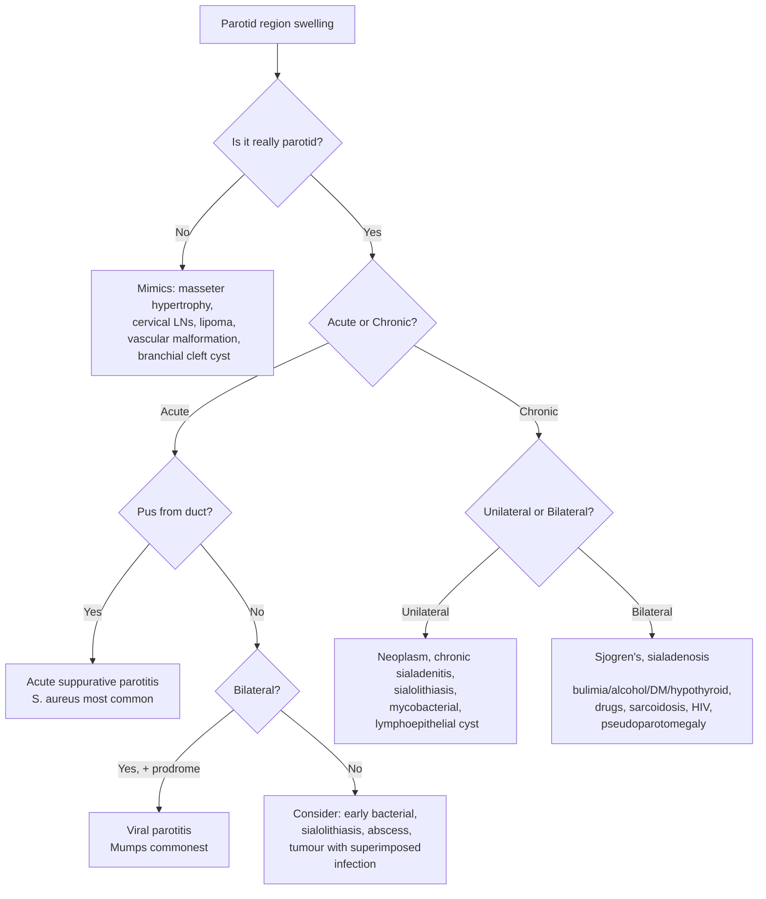

## Differential Diagnosis of Parotitis

When a patient presents with a swelling in the parotid region, the first clinical question — before you even think about which type of parotitis — is: ***"Is it really a parotid swelling?"*** [5]. Many structures in and around the parotid region can mimic parotid pathology. Then, once you've confirmed it's genuinely parotid, you need to differentiate between infectious, inflammatory, obstructive, autoimmune, and neoplastic causes.

The approach to differential diagnosis is best understood by working through the anatomy systematically and then considering the clinical context (acute vs. chronic, unilateral vs. bilateral, painful vs. painless, with or without pus).

---

### Step 1: Is It Really a Parotid Swelling?

This is the first question on physical examination [5]. Several conditions can masquerade as a parotid mass:

| Mimic | Why It Can Be Confused | How to Distinguish |
|---|---|---|
| ***Masseter hypertrophy*** | The masseter muscle lies deep to the parotid gland. Hypertrophy (from bruxism or habitual clenching) causes bilateral swelling over the angle of the mandible that mimics parotid enlargement [4][5] | Ask about bruxism/clenching. The swelling is **hard** and most prominent when the patient clenches their teeth. It moves with jaw clenching. No pus from Stensen's duct. CT shows enlarged masseter without parotid abnormality |
| ***Enlarged cervical lymph nodes*** | Upper deep cervical or periparotid lymph nodes can present as a swelling near the angle of the mandible [5] | Typically more discrete, mobile, and located more in the neck (Level I–II). Multiple nodes may be palpable. Look for a source of infection or malignancy in the drainage territory (scalp, ear, face, oral cavity) |
| ***Lipoma*** | Superficial lipomas in the parotid region can mimic a parotid mass [5] | Soft, non-tender, mobile, well-defined. No pus from duct. Imaging shows characteristic fat signal |
| ***Vascular malformations*** | Haemangiomas or venous malformations in the parotid region [5] | May be compressible, bluish discolouration, may enlarge with Valsalva. MRI is diagnostic |
| ***Oral cavity mass with direct extension to submandibular space*** | A floor-of-mouth or sublingual mass can extend posteriorly and mimic submandibular or even parotid pathology [5] | ***Intraoral examination*** is mandatory [5] — will reveal the primary mucosal lesion |
| **First branchial cleft cyst** | Type I and II first branchial cleft cysts pass through or near the parotid gland in close proximity to the facial nerve [6] | Typically presents in childhood/young adulthood as recurrent parotid swelling ± infection. May have a sinus tract near the ear. Imaging shows a cystic lesion within or adjacent to the parotid |
| **Pre-auricular lymphadenopathy** | Superficial pre-auricular nodes drain the temporal scalp, eyelids, and conjunctiva | More superficial, discrete, mobile. Look for conjunctivitis, periorbital infection, or scalp pathology |

<Callout title="The Palpation Principle" type="idea">

***On palpation, confirm the lesion is not arising from the skin*** [7]. Also, ***it is difficult to ascertain a mass is truly a parotid tumour*** clinically [7] — you often need imaging (ultrasound ± CT/MRI) to confirm the lesion's origin. ***Palpate the ducts for stones and express pus*** [7] — this simple manoeuvre is the most important bedside test for parotitis.
</Callout>

---

### Step 2: History — Infection vs. Neoplasm vs. Autoimmune

***Differentiate between infection and neoplasm*** [8]:
- ***Pain — After a meal? Acute onset?*** [8] — Meal-related pain suggests **obstructive** pathology (sialolithiasis causing post-prandial swelling). Acute onset pain suggests **infection**. Chronic dull pain or painless mass suggests **neoplasm** or **autoimmune**
- ***Swelling — Persistent or intermittent?*** [8] — Intermittent swelling (waxing and waning, worse with meals) is classic for **sialolithiasis**. Persistent and progressive swelling suggests **neoplasm**. Recurrent episodes suggest **chronic sialadenitis** or **recurrent parotitis of childhood**
- ***Presence of symptoms of acute infection — fever, tenderness, pus*** [8] — If present → infectious parotitis

---

### Step 3: Systematic Differential Diagnosis

The differential diagnosis of parotid swelling can be organized by mechanism:

---

#### A. Infectious Causes (Acute)

| Differential | Key Features | Distinguishing Points |
|---|---|---|
| ***Acute suppurative parotitis*** | ***Dehydrated, infirm, elderly*** [1]. Sudden onset tender swelling. ***Pus from duct opening***. ***S. aureus*** most common [1] | Unilateral, high fever, purulent discharge from Stensen's duct. Often post-operative. Polymicrobial [2] |
| ***Viral parotitis (mumps = commonest)*** | ***Commonest viral cause — mumps*** [3]. Also ***Coxsackie virus, CMV, Influenza*** [3] | Bilateral (70%), prodromal period, NO pus from duct, self-limiting 5–10 days. ***Diagnosis by clinical and serology*** [3] |
| ***Acute bacterial sialadenitis (non-calculous)*** | Identical presentation to suppurative parotitis but without demonstrable stone [9]. ***Typically affects older adults, malnourished or post-operative patients***. ***Commonly caused by S. aureus*** but also S. viridans, S. pneumoniae, H. influenzae, and Bacteroides [9] | ***Sudden onset of very firm and tender swelling*** of the gland. ***Fever and chills with fairly marked systemic toxicity***. ***Purulent discharge from the affected duct orifice*** [9] |

#### B. Obstructive Causes

| Differential | Key Features | Distinguishing Points |
|---|---|---|
| **Sialolithiasis** | Recurrent, meal-related swelling and pain of the parotid (or more commonly submandibular) gland. Waxing and waning symptoms [9] | Pain is **aggravated by eating or anticipation of eating** (salivary stimulation increases flow against obstruction → ductal distension → pain). Stone may be palpable along the duct. Imaging (X-ray, US, CT) shows calcified stone. If secondary infection develops → becomes suppurative sialadenitis |
| **Ductal stricture / mucous plug** | Similar meal-related obstructive symptoms but no calculus on imaging | Usually post-inflammatory. Sialography or sialendoscopy may demonstrate stricture |

> **Why does eating worsen obstructive parotid pain?** When you eat (or even think about food), parasympathetic stimulation via CN IX drives salivary secretion. If the duct is blocked by a stone, the increased secretory pressure has nowhere to go → the gland and duct distend → pain. This "mealtime syndrome" is pathognomonic for obstructive salivary disease.

#### C. Chronic Inflammatory / Autoimmune Causes

| Differential | Key Features | Distinguishing Points |
|---|---|---|
| ***Chronic sialadenitis*** | ***Mild pain, worsens after meal***. ***Recurrent parotid or submandibular swelling after meal*** [10]. Low-grade chronic infection → progressive glandular destruction [9] | History of recurrent episodes. Gland may feel firm and fibrotic. Reduced salivary flow. ***Can be caused by autoimmune disease (Sjögren syndrome)*** [10] |
| ***Sjögren's syndrome*** | ***Chronic inflammatory disorder*** with diminished lacrimal and salivary secretions → ***dry eyes and mouth (sicca complex)*** [9]. ***Gradual bilateral swelling of parotid or submandibular glands*** [9] | Bilateral and painless. Associated xerostomia and keratoconjunctivitis sicca. Positive anti-Ro (SSA) / anti-La (SSB) antibodies. Schirmer test positive. Lip biopsy shows focal lymphocytic sialadenitis (focus score ≥ 1). ***Autoimmune sialadenitis causes parenchymal destruction and dilation of intraglandular ducts*** [9] |
| ***Sarcoidosis*** | ***Bilateral painless parotid enlargement due to granulomatous infiltration*** [9] | Non-caseating granulomas on biopsy. Elevated serum ACE. May have pulmonary sarcoidosis. Heerfordt syndrome = uveoparotid fever (parotid enlargement + anterior uveitis + facial nerve palsy + fever). CXR may show bilateral hilar lymphadenopathy |
| **IgG4-related disease** | Bilateral painless parotid/submandibular enlargement | Elevated serum IgG4. Storiform fibrosis and IgG4+ plasma cells on biopsy. May have associated autoimmune pancreatitis, retroperitoneal fibrosis. Previously called Mikulicz disease or Kuttner's tumour (when affecting submandibular gland) |

#### D. Neoplastic Causes

| Differential | Key Features | Distinguishing Points |
|---|---|---|
| **Benign salivary gland tumour** (pleomorphic adenoma, Warthin tumour) | Slow-growing, painless, unilateral parotid mass. Mobile, firm, well-defined [9] | No facial nerve involvement. Pleomorphic adenoma is the most common parotid tumour overall. Warthin tumour is the second most common and is strongly associated with smoking; may be bilateral |
| **Malignant salivary gland tumour** (mucoepidermoid carcinoma, adenoid cystic carcinoma, etc.) | Progressive, may be painful. ***Facial weakness*** is ***high suspicion of malignant involvement of parotid gland*** [11]. May have skin fixation, cervical lymphadenopathy | ***Parotid tumour must be distinguished from Bell's palsy*** [11]. Perineural invasion (especially adenoid cystic carcinoma) causes pain and CN VII palsy. FNA or core biopsy needed for tissue diagnosis |
| ***Metastasis from other tumours*** | History of previous skin cancer (SCC, melanoma) of the scalp/face [11] | Parotid gland contains intraglandular lymph nodes — metastatic deposits from cutaneous malignancy of the scalp, ear, or face can present as a parotid mass |
| ***Lymphoma*** | May present as a parotid mass (intraglandular lymph nodes) | Consider in patients with Sjögren's syndrome (40-fold increased risk of non-Hodgkin lymphoma). Also tonsils and tongue base may be presenting site for lymphoma [12] |

<Callout title="Facial Nerve Palsy + Parotid Mass = Malignancy Until Proven Otherwise" type="error">

***Facial weakness*** in the context of a parotid mass is a red flag for malignancy [11]. Benign tumours (even large ones) virtually never cause facial nerve palsy because they displace rather than invade the nerve. Malignant tumours invade perineurally. This distinction is critical — ***parotid tumour must be distinguished from Bell's palsy*** [5][11].
</Callout>

#### E. Bilateral Parotid Enlargement — Non-Infectious DDx

***Causes of bilateral parotid enlargement*** [4]:

| Cause | Mechanism | Key Distinguishing Feature |
|---|---|---|
| ***Pseudoparotomegaly, e.g. masseter hypertrophy*** | Not true parotid — masseter muscle bulk | Hardens on clenching |
| ***Bulimia nervosa*** | Repeated vomiting → chronic gustatory stimulation → sialadenosis (acinar hypertrophy) | Young female, dental erosion, Russell's sign (knuckle calluses), metabolic alkalosis |
| ***Alcoholic cirrhosis*** | Fatty infiltration + autonomic neuropathy → sialadenosis | Stigmata of chronic liver disease (spider naevi, palmar erythema, jaundice) |
| ***DM*** | Fatty infiltration of glands | Known diabetic or features of undiagnosed DM |
| ***Hypothyroidism*** | Mucopolysaccharide deposition | Myxoedema features, raised TSH |
| ***Drugs, e.g. phenytoin*** | Drug-induced sialadenosis | Drug history |
| **Sjögren's syndrome** | Autoimmune lymphocytic infiltration | Sicca symptoms + serology |
| **HIV** | Benign lymphoepithelial cysts / DILS | Risk factors, HIV test, bilateral cystic lesions on imaging |
| **Sarcoidosis** | Granulomatous infiltration | Bilateral hilar lymphadenopathy, elevated ACE, non-caseating granulomas |

#### F. Other Differentials

| Differential | Key Features |
|---|---|
| ***Salivary cysts*** (mucocele, ranula, lymphoepithelial cyst) | Cystic lesion on imaging. Lymphoepithelial cysts are characteristic of HIV [11] |
| ***Chronic sclerosing sialadenitis (Kuttner's tumour)*** | Hard, tumour-like enlargement of submandibular gland (rarely parotid). Now recognized as part of IgG4-related disease spectrum [11] |
| ***Regional lymphadenopathy*** | Reactive or malignant cervical lymph nodes adjacent to the parotid [11] |
| **Recurrent parotitis of childhood** | Recurrent episodes of acute unilateral parotitis in children (age 3–6). Aetiology unclear — likely related to ductal ectasia, sialectasis, and reduced local immunity. Self-limiting by puberty |
| **Radiation sialadenitis** | Post-radiotherapy to H&N region. Acute phase: painful swelling within days. Chronic phase: progressive xerostomia due to acinar atrophy |

---

### Approach to Clinical Differentiation — Key Discriminating Features

| Feature | Suppurative Parotitis | Viral Parotitis | Sialolithiasis | Neoplasm | Autoimmune / Systemic |
|---|---|---|---|---|---|
| **Onset** | Acute (hours–days) | Acute with prodrome | Episodic | Gradual (weeks–months) | Gradual |
| **Laterality** | Usually unilateral | Often bilateral | Unilateral | Usually unilateral | Usually bilateral |
| **Pain** | Severe, constant | Moderate, diffuse | Meal-related (colicky) | Painless (unless malignant) | Mild or painless |
| **Pus from duct** | **Yes** | **No** | ± (if secondary infection) | No | No |
| **Fever** | High | Low-grade | ± | No (unless superinfected) | No |
| **Facial nerve palsy** | Rare (abscess) | No | No | Yes = malignancy | Rare (sarcoidosis) |
| **Key investigation** | Gram stain/culture of pus | Serology | Imaging (US, CT) | FNA/core biopsy + imaging | Serology (SSA/SSB, IgG4), lip biopsy |

---

<Callout title="High Yield Summary">

1. **First question**: ***Is it really a parotid swelling?*** — rule out masseter hypertrophy, cervical LNs, lipoma, vascular malformation, branchial cleft cyst
2. **History discriminators**: Acute onset + fever + pus → **infection**. Meal-related intermittent swelling → **sialolithiasis**. Persistent progressive painless mass → **neoplasm**. Bilateral painless → **systemic/autoimmune/metabolic**
3. ***Palpate the ducts for stones and express pus*** — the most important bedside manoeuvre
4. **Bilateral parotid enlargement DDx**: pseudoparotomegaly (masseter hypertrophy), bulimia, alcoholic cirrhosis, DM, hypothyroidism, drugs (phenytoin), Sjögren's, sarcoidosis, HIV
5. **Facial nerve palsy + parotid mass = malignancy until proven otherwise** — benign tumours do not cause CN VII palsy
6. **Neoplasm DDx**: primary benign (pleomorphic adenoma, Warthin), primary malignant (mucoepidermoid, adenoid cystic), metastatic (from scalp/face SCC or melanoma), lymphoma
7. ***Chronic sialadenitis***: mild pain, worsens after meal, recurrent swelling — can be caused by Sjögren's or sialolithiasis
</Callout>

---

<ActiveRecallQuiz
  title="Active Recall - Differential Diagnosis of Parotitis"
  items={[
    {
      question: "A patient presents with a swelling over the angle of the mandible that becomes harder when they clench their teeth. What is the most likely diagnosis, and why can it mimic parotid pathology?",
      markscheme: "Masseter hypertrophy (pseudoparotomegaly). It mimics parotid swelling because the masseter muscle lies deep to the parotid gland in the same region. Becomes prominent on clenching because the muscle is contracting. No pus from Stensen's duct, no features of infection or neoplasm."
    },
    {
      question: "A 45-year-old woman presents with recurrent bilateral painless parotid swelling, dry eyes, and dry mouth. Her anti-Ro and anti-La antibodies are positive. What is the diagnosis, and what is the underlying pathological mechanism causing parotid enlargement?",
      markscheme: "Sjogren's syndrome. Autoimmune lymphocytic infiltration of the parotid glands causes parenchymal destruction and dilation of intraglandular ducts, leading to progressive bilateral glandular enlargement. The sicca complex (dry eyes = keratoconjunctivitis sicca, dry mouth = xerostomia) results from destruction of lacrimal and salivary gland acini."
    },
    {
      question: "What clinical feature distinguishes a malignant parotid tumour from a benign one on examination? Why?",
      markscheme: "Facial nerve palsy (CN VII weakness). The facial nerve runs through the parotid gland. Malignant tumours invade perineurally (especially adenoid cystic carcinoma), damaging the nerve. Benign tumours displace rather than invade the nerve, so they virtually never cause facial palsy. Facial weakness with a parotid mass = malignancy until proven otherwise."
    },
    {
      question: "A patient presents with episodic unilateral parotid swelling and pain that worsens during meals and resolves between meals. What is the most likely diagnosis, and explain the pathophysiology of the meal-related symptoms.",
      markscheme: "Sialolithiasis (salivary stone obstructing the duct). During meals, parasympathetic stimulation via CN IX increases salivary secretion. If the duct is obstructed by a stone, increased secretory pressure has nowhere to go, causing ductal and glandular distension and pain. Symptoms resolve between meals as secretion decreases and some saliva leaks around the stone."
    },
    {
      question: "Name 3 key history questions that help differentiate between an infectious and neoplastic cause of parotid swelling.",
      markscheme: "1. Pain character - acute onset pain suggests infection; painless or chronic dull ache suggests neoplasm. 2. Swelling pattern - intermittent/meal-related suggests obstruction; persistent and progressive suggests neoplasm. 3. Symptoms of acute infection - fever, tenderness, purulent discharge from duct suggest infection, absent in neoplasm."
    },
    {
      question: "List 4 non-infectious causes of bilateral parotid enlargement and the mechanism for each.",
      markscheme: "Any 4 of: (1) Bulimia nervosa - repeated vomiting causes chronic gustatory stimulation leading to sialadenosis (non-inflammatory acinar hypertrophy). (2) Alcoholic cirrhosis - fatty infiltration and autonomic neuropathy causing sialadenosis. (3) DM - fatty infiltration of glands. (4) Hypothyroidism - mucopolysaccharide deposition. (5) Drugs e.g. phenytoin - drug-induced sialadenosis. (6) Sjogren's - autoimmune lymphocytic infiltration. (7) Sarcoidosis - non-caseating granulomatous infiltration. (8) HIV - benign lymphoepithelial cysts/DILS."
    }
  ]}
/>

---

## References

[1] Lecture slides: GC 217. Facial nerve palsy and salivary gland diseases.pdf, p50
[2] Senior notes: felixlai.md, sections 321–323
[3] Lecture slides: GC 217. Facial nerve palsy and salivary gland diseases.pdf, p51
[4] Lecture slides: GC 217. Facial nerve palsy and salivary gland diseases.pdf, p58
[5] Lecture slides: GC 217. Facial nerve palsy and salivary gland diseases.pdf, p38
[6] Senior notes: felixlai.md, section 295
[7] Lecture slides: GC 217. Facial nerve palsy and salivary gland diseases.pdf, p41
[8] Lecture slides: GC 217. Facial nerve palsy and salivary gland diseases.pdf, p37
[9] Senior notes: felixlai.md, section 327
[10] Lecture slides: GC 217. Facial nerve palsy and salivary gland diseases.pdf, p53
[11] Senior notes: felixlai.md, section 336
[12] Senior notes: felixlai.md, section 369
