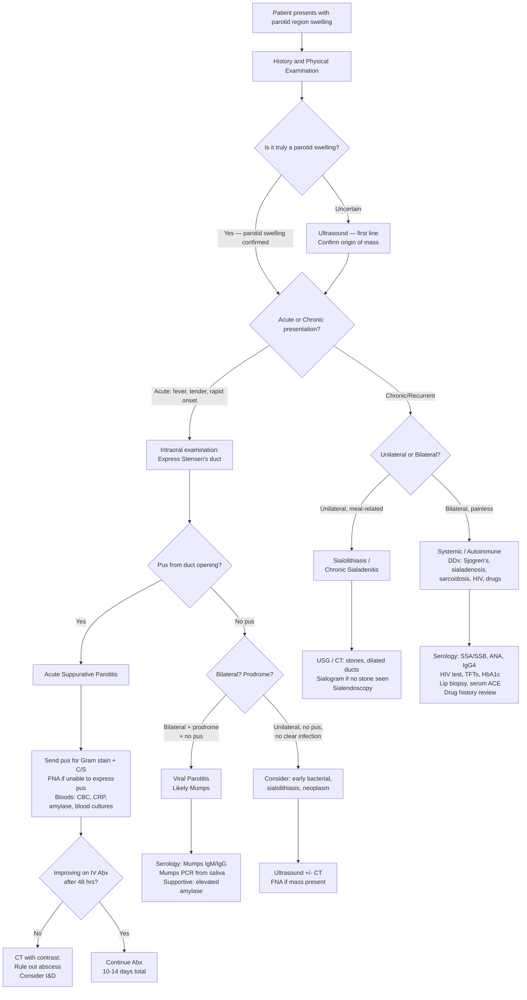

## Diagnostic Criteria, Algorithm, and Investigations for Parotitis

### Diagnostic Criteria

Parotitis — unlike conditions such as rheumatic fever or SLE — does not have formal "diagnostic criteria" with a points-based scoring system. Instead, the diagnosis is made through a **combination of clinical features, physical examination findings, and targeted investigations**. The approach is fundamentally clinical, with investigations used to:

1. **Confirm the diagnosis** (is it really parotitis?)
2. **Identify the aetiology** (bacterial vs. viral vs. autoimmune vs. obstructive vs. neoplastic)
3. **Guide management** (identify the organism, detect complications like abscess)

That said, here are the key diagnostic pillars for each major type:

#### Acute Suppurative Parotitis — Clinical Diagnostic Pillars

| Pillar | Detail |
|---|---|
| **Clinical context** | ***Dehydrated, infirm, elderly*** or post-operative patient [1] |
| **Clinical features** | Acute onset of unilateral ***tender swelling*** in the parotid region + fever + systemic toxicity [2] |
| **Pathognomonic sign** | ***Pus from duct opening*** — purulent material expressed from the orifice of Stensen's duct (opposite upper 2nd molar) on bimanual massage of the gland [1][2] |
| **Microbiological confirmation** | Gram stain and culture of expressed pus or FNA aspirate — ***S. aureus*** is the most common organism [1][2] |
| **Supportive biochemistry** | ***Elevated serum amylase in the absence of pancreatitis*** supports parotid gland involvement [2] |

> The diagnosis of acute suppurative parotitis is essentially **clinical** — a sick patient with a tender parotid swelling and pus expressible from Stensen's duct. You don't need imaging to make the diagnosis, but you do need cultures to guide antibiotic therapy and imaging if you suspect abscess or stone.

#### Viral Parotitis (Mumps) — Clinical Diagnostic Pillars

| Pillar | Detail |
|---|---|
| **Clinical features** | Prodromal period (fever, malaise, headache, myalgia) → bilateral parotid swelling lasting 5–10 days. **No purulent discharge** from Stensen's duct [2][3] |
| **Confirmation** | ***Diagnosis by clinical and serology*** [3] — mumps-specific IgM (acute infection) or 4-fold rise in paired IgG titres. Mumps virus PCR from saliva/urine/CSF in selected cases |
| **Epidemiological context** | Unvaccinated individual, or recent outbreak exposure. In Hong Kong, check MMR vaccination history |

#### Chronic Sialadenitis — Diagnostic Approach

| Pillar | Detail |
|---|---|
| **Clinical features** | ***Mild pain, worsens after meal. Recurrent parotid or submandibular swelling after meal*** [10] |
| **Investigations** | ***USG/sialogram — rule out stones/other masses*** [13]. Rule out Sjögren's syndrome (serology: anti-Ro/SSA, anti-La/SSB; Schirmer test; lip biopsy) [10][13] |

---

### Diagnostic Algorithm

The following algorithm walks through the clinical reasoning process from presentation to aetiological diagnosis:

<Callout title="The Algorithm in Plain English">

1. **First**: Confirm it's truly parotid (history + examination ± ultrasound)
2. **Second**: Is it acute or chronic?
3. **If acute**: Look for pus from Stensen's duct → if yes, it's suppurative parotitis → send cultures, start antibiotics → if no response at 48 hours, CT to rule out abscess
4. **If acute but no pus and bilateral with prodrome**: Think viral → serology
5. **If chronic/recurrent and unilateral**: Think stone or chronic sialadenitis → imaging
6. **If chronic/recurrent and bilateral**: Think systemic/autoimmune → targeted serology and investigations
</Callout>

---

### Investigation Modalities

#### 1. Bedside / Clinical Examination

##### A. Intraoral Inspection

***Intraoral inspection*** is the first and most important "investigation" [14]:

| What to Look For | Significance |
|---|---|
| ***Parotid duct opening*** (opposite upper 2nd molar) | Inspect for erythema, oedema of the papilla, purulent discharge [14] |
| ***Submandibular duct opening*** (sublingual caruncle, floor of mouth near frenulum) | If submandibular gland disease is suspected [14] |
| ***Floor of mouth swelling*** | May indicate submandibular stone, ranula, or floor of mouth tumour [14] |
| ***Tumour in floor of mouth/oral cavity*** | Oral cavity malignancy can obstruct ducts or mimic salivary pathology [14] |
| ***Pus in the salivary duct openings*** | **Pathognomonic for suppurative sialadenitis** — if pus is expressible, collect it for Gram stain and culture [1][14] |

##### B. Bimanual Palpation

***Palpation*** [7]:
- ***Confirm the lesion is not arising from the skin*** (lipoma, sebaceous cyst) [7]
- ***Palpate the ducts for stones*** — run your finger along the course of Stensen's duct (over the masseter) or Wharton's duct (floor of mouth) to feel for a palpable calculus [7]
- ***Express pus*** — apply external pressure over the gland and watch the duct opening intraorally for purulent discharge [7]
- Note that ***it is difficult to ascertain a mass is a parotid tumour*** on palpation alone — imaging is usually needed [7]

##### C. Facial Nerve Examination

- Assess all 5 branches of CN VII (temporal, zygomatic, buccal, marginal mandibular, cervical)
- **Raise eyebrows** (temporal), **close eyes tightly** (zygomatic), **puff cheeks/smile** (buccal), **show lower teeth/depress lower lip** (marginal mandibular), **tense platysma** (cervical)
- **Why?** Facial nerve palsy in the context of parotid pathology is a red flag for malignancy or severe abscess [11]. Document specific branch involvement if present

---

#### 2. Blood Investigations

| Investigation | Expected Finding in Parotitis | Interpretation / Rationale |
|---|---|---|
| **Full blood count (CBC)** | Leukocytosis with neutrophilia (bacterial); lymphocytosis or normal WBC (viral) | Neutrophilia = bacterial infection driving neutrophil release from bone marrow. Lymphocytosis is characteristic of viral infections (mumps, EBV, CMV) |
| **CRP / ESR** | Elevated | Non-specific markers of inflammation. CRP rises within 6–12 hours of infection onset (synthesized by hepatocytes in response to IL-6). Useful for monitoring treatment response |
| ***Serum amylase*** | ***Elevated*** | ***Elevated serum amylase in the absence of pancreatitis supports the clinical suspicion of parotid gland involvement*** [2]. The parotid gland is the main source of salivary amylase (isoamylase S-type). If needed, **amylase isoenzyme** fractionation can confirm salivary (not pancreatic) origin |
| **Blood cultures** | May be positive in bacteraemic patients | Essential in systemically unwell patients (fever, rigors, sepsis). Identifies haematogenous spread and guides targeted antibiotic therapy |
| **Serology** | Mumps IgM positive (acute infection); 4-fold rise in paired IgG; EBV VCA-IgM (if EBV suspected); CMV IgM | ***Diagnosis by clinical and serology*** for viral parotitis [3]. IgM appears early (within days of symptom onset) and indicates acute infection. IgG rises later and persists (indicates past exposure or convalescence) |
| **Viral PCR** | Mumps RNA in saliva, throat swab, or urine | More sensitive and rapid than serology in the acute phase. Useful for public health notification and outbreak investigation |
| **Renal function, electrolytes** | May show dehydration (elevated urea, creatinine, Na+) | Dehydration is both a cause and a consequence of parotitis. Guides IV fluid resuscitation |
| **HbA1c / fasting glucose** | May reveal undiagnosed DM | DM predisposes to parotitis (sialadenosis + immunosuppression) and bilateral parotid enlargement |
| **TFTs** | Hypothyroidism | Hypothyroidism causes bilateral parotid enlargement (mucopolysaccharide deposition) |
| **Autoimmune serology** (if chronic/bilateral) | Anti-Ro/SSA, Anti-La/SSB, ANA, RF, IgG4, serum ACE | Anti-Ro/SSB positive in Sjögren's. Elevated IgG4 in IgG4-related disease. Elevated ACE in sarcoidosis |
| **HIV test** | Positive | Consider in bilateral parotid enlargement, especially with lymphoepithelial cysts on imaging |

> **Why check amylase isoenzymes?** Total serum amylase is elevated in both pancreatitis and parotitis. The **S-type** (salivary) isoamylase comes from the parotid gland, while the **P-type** (pancreatic) isoamylase comes from the pancreas. In parotitis, S-type is elevated with normal P-type. In pancreatitis, it's the reverse. Lipase is elevated only in pancreatitis (not in parotitis), so a **normal lipase with elevated amylase** strongly favours parotitis over pancreatitis.

---

#### 3. Microbiological Investigations

| Investigation | Method and Key Points | Interpretation |
|---|---|---|
| ***Gram stain and culture of expressed pus*** | ***Purulent drainage from Stensen's duct should be collected for Gram stain and culture*** [2]. Collect at the duct orifice using a sterile swab or aspirate as pus is being expressed | Gram-positive cocci in clusters → *S. aureus*. Gram-positive cocci in chains → streptococci. Mixed flora with Gram-negative rods → polymicrobial with anaerobes. Culture + sensitivity guides antibiotic therapy |
| ***Fine needle aspiration (FNA) of the parotid gland*** | ***FNA of swollen parotid gland extra-orally is the best method to identify causative organisms*** [2]. Performed under ultrasound guidance if needed | Provides material for Gram stain, culture (aerobic + anaerobic), and AFB stain/culture (if TB suspected). Also provides cytology to exclude neoplasm |
| **Oral cavity culture caveat** | ***Culture obtained from oral cavity should be interpreted with caution since the results may represent contamination by oral flora*** [2] | The oral cavity is non-sterile — commensal organisms will always grow. Only duct-expressed pus or direct FNA aspirate gives reliable results |

<Callout title="FNA — Dual Purpose" type="idea">
FNA of the parotid gland serves two purposes: (1) **Microbiological** — identifying the causative organism in suppurative parotitis, and (2) **Cytological** — distinguishing benign from malignant pathology if a neoplasm is suspected. ***FNA can usually discriminate benign tumours from malignant tumours and metastasis but is less specific in the exact type of tumour*** [11]. Always send aspirate for both microbiology AND cytology when the diagnosis is uncertain.
</Callout>

---

#### 4. Imaging Investigations

##### A. Ultrasound (First-Line)

***Ultrasound is the first-line investigation*** for salivary gland pathology [15]:

| Capability | Detail |
|---|---|
| ***Confirm origin of mass*** | Is the swelling arising from the parotid gland, submandibular gland, lymph node, or other structure? This is the key first question [15] |
| ***Stones*** | Sialoliths appear as **hyperechoic foci with posterior acoustic shadowing**. US has > 90% sensitivity for stones > 2mm [15] |
| ***Dilated ducts*** | Upstream ductal dilatation proximal to an obstruction confirms obstructive pathology [15] |
| ***Enlarged neck lymph nodes*** | Reactive vs. suspicious lymphadenopathy can be assessed (shape, hilum, vascularity, cortical thickness) [15] |
| **Abscess detection** | Hypoechoic or anechoic collection within the gland with posterior acoustic enhancement suggests abscess formation |
| **Guidance for FNA** | Real-time US guidance improves accuracy and safety of FNA/core biopsy |
| **Differentiate solid vs. cystic** | Solid mass → neoplasm or inflammatory mass. Cystic → benign cyst, lymphoepithelial cyst (HIV), abscess |

**Why ultrasound first?**
- Non-invasive, no radiation, inexpensive, widely available, excellent for superficial structures like salivary glands
- Can be performed at the bedside in a sick post-operative patient
- Allows simultaneous FNA under guidance
- **Limitation**: cannot adequately visualize deep lobe of parotid (obscured by the mandible) or parapharyngeal extension — this is where CT/MRI is needed

##### B. CT Scan / CT Sialogram

***CT scan/CT sialogram*** [16]:

| Capability | Detail |
|---|---|
| ***Delineate deep lobe vs. superficial lobe tumour*** | CT can image beyond the mandible to visualize the deep lobe and its relationship to the parapharyngeal space — something ultrasound cannot do [16] |
| ***Differentiate salivary gland swelling vs. other pathologies*** | Clearly shows whether the mass arises from the parotid, parapharyngeal space, masticator space, or is a cervical lymph node [16] |
| ***Enlarged lymph nodes*** | Cervical lymphadenopathy assessment for staging or reactive adenopathy [16] |
| **Abscess detection** | CT with IV contrast is the investigation of choice when abscess is suspected (rim-enhancing collection within or adjacent to the gland). **This is the key investigation when there is no clinical improvement after 48 hours of IV antibiotics** [2] |
| **Sialolithiasis** | CT is the most sensitive imaging modality for detecting salivary calculi (calcium-dense stones are readily visible) — sensitivity > 95% |
| **CT sialogram** | Contrast injected retrogradely into the duct → outlines the ductal anatomy, strictures, filling defects (stones), sialectasis (punctate/globular dilatation in Sjögren's). Less commonly used now (replaced by MR sialography and sialendoscopy) |
| **Bone involvement** | Can detect osteomyelitis of adjacent facial bones (a complication of severe parotitis) [2] |

**When to get a CT?**
- Suspected abscess (no response to 48 hours of IV antibiotics)
- Suspected deep lobe pathology or parapharyngeal extension
- Pre-operative planning for parotid surgery
- Suspected malignancy (staging)
- ***MRI/CT parotid and USG FNA — if parotid lesion is suspected*** [17]

##### C. MRI

| Capability | Detail |
|---|---|
| **Superior soft tissue contrast** | MRI provides the best soft tissue delineation of the parotid gland, facial nerve, and surrounding structures |
| **Deep lobe and parapharyngeal space** | Excellent for assessing deep lobe tumours and their relationship to the parapharyngeal space |
| **Perineural spread** | MRI is the modality of choice for detecting **perineural invasion** (especially along CN VII) in malignant parotid tumours — shows thickening and enhancement of the nerve |
| **Differentiate benign from malignant** | Benign tumours: well-defined, homogeneous. Malignant tumours: ill-defined margins, heterogeneous signal, invasion of adjacent structures |
| ***MRI/CT parotid and USG FNA — if parotid lesion is suspected*** [17] | Used when a parotid mass raises concern for neoplasm |
| **MR sialography** | Non-invasive alternative to conventional sialography. Uses heavily T2-weighted sequences (the saliva in the ducts acts as natural contrast). Shows ductal anatomy, strictures, stones, sialectasis |

**When to get an MRI?**
- Suspected parotid tumour (especially for surgical planning — relationship to facial nerve)
- Suspected perineural spread of malignancy
- Suspected intracranial extension
- Chronic/recurrent parotitis where Sjögren's or structural abnormality is suspected (MR sialography)

##### D. Sialography (Conventional)

***USG/sialogram — rule out stones/other masses*** in chronic sialadenitis [13]:

- Contrast medium (usually water-soluble) is injected retrogradely into Stensen's or Wharton's duct via a cannula, then X-rays are taken
- Shows: filling defects (stones), strictures, ductal dilatation, sialectasis (classic "cherry blossom" or "snowstorm" appearance in Sjögren's — punctate sialectasis), ductal anatomy
- **Contraindicated** in acute infection (risk of exacerbating infection and causing bacteraemia)
- Increasingly replaced by MR sialography and sialendoscopy

##### E. Sialendoscopy

- Minimally invasive endoscopic technique — a tiny endoscope (0.8–1.6 mm) is inserted into the salivary duct
- Allows **direct visualization** of the ductal lumen
- Both **diagnostic** (see stones, strictures, mucous plugs) and **therapeutic** (basket extraction of stones, balloon dilatation of strictures, irrigation)
- Particularly useful for **sialolithiasis** and **recurrent chronic sialadenitis**
- Advantage over sialography: no radiation, therapeutic capability

---

#### 5. Histopathological / Cytological Investigations

| Investigation | Indication | Key Points |
|---|---|---|
| ***FNA cytology*** | Any parotid mass where neoplasm is suspected [11] | ***FNA can usually discriminate benign tumours from malignant tumours and metastasis but is less specific in the exact type of tumour*** [11]. Quick, safe, can be done under US guidance. Send for cytology + microbiology |
| ***Core needle biopsy*** | When FNA is non-diagnostic or more tissue architecture is needed (e.g., lymphoma subtyping) | ***Core needle biopsy has risks of bleeding, nerve injury, and tumour seeding*** [11]. Provides tissue architecture and allows immunohistochemistry |
| **Lip biopsy** (minor salivary gland biopsy) | Suspected Sjögren's syndrome | Harvests minor salivary glands from the inner lower lip. Positive if focus score ≥ 1 (≥ 1 focus of ≥ 50 lymphocytes per 4 mm² of glandular tissue). This is a key diagnostic criterion for Sjögren's |
| **Incisional/excisional biopsy** | Generally **avoided** for parotid masses (risk of facial nerve damage, tumour seeding, field contamination) | Open biopsy of the parotid is discouraged — definitive surgical excision (superficial parotidectomy) is preferred as both diagnostic and therapeutic for suspected tumours. Exception: when FNA/core biopsy suggests lymphoma and further tissue is needed for subtyping [11] |

<Callout title="Never Do an Incisional Biopsy of a Parotid Mass" type="error">
Open biopsy of a parotid mass is strongly discouraged because: (1) the facial nerve is at risk, (2) tumour seeding along the biopsy tract can occur, and (3) it makes subsequent definitive surgery more difficult due to scarring and field contamination. The standard approach is FNA (or core biopsy) for tissue diagnosis, followed by formal parotidectomy if indicated [11].
</Callout>

---

#### 6. Special Investigations for Specific Aetiologies

| Aetiology | Specific Investigation | Key Finding |
|---|---|---|
| **Mumps** | Serology (Mumps IgM, paired IgG); PCR (saliva/urine) | IgM positive in acute infection; PCR confirms active viral shedding |
| **Sjögren's syndrome** | Anti-Ro/SSA, Anti-La/SSB, ANA, RF; Schirmer test; lip biopsy; MR sialography | Anti-Ro positive in ~70%, Anti-La in ~40%. Schirmer test < 5mm/5min = dry eyes. Lip biopsy focus score ≥ 1. MR sialogram shows punctate/globular sialectasis |
| **Sarcoidosis** | Serum ACE; CXR (bilateral hilar lymphadenopathy); tissue biopsy (non-caseating granulomas); serum calcium | ACE elevated in ~60%. Biopsy is diagnostic (non-caseating granulomas without AFB) |
| **TB parotitis** | AFB smear/culture; GeneXpert MTB/RIF; tissue biopsy (caseating granulomas); tuberculin skin test/IGRA | Especially relevant in Hong Kong (intermediate TB prevalence). Caseating granulomas distinguish from sarcoidosis |
| **HIV** | HIV antibody/antigen test (4th generation combo); CD4 count; viral load | Consider in bilateral painless parotid enlargement, especially with cystic lesions on imaging (lymphoepithelial cysts) |
| **IgG4-related disease** | Serum IgG4; tissue biopsy (storiform fibrosis, obliterative phlebitis, IgG4+ plasma cells > 10/HPF) | Elevated serum IgG4 (though sensitivity is only ~60–70%). Biopsy is the gold standard |
| **Sialolithiasis** | CT (gold standard for stone detection); US; sialography; sialendoscopy | CT: hyperdense calculus within duct/gland. US: hyperechoic focus with acoustic shadow + dilated duct upstream |

---

### Summary Table: Key Investigations by Clinical Scenario

| Clinical Scenario | First-Line | Second-Line | Microbiological | Specific |
|---|---|---|---|---|
| **Acute suppurative parotitis** | Clinical examination (express pus) + bloods (CBC, CRP, amylase) | CT with contrast (if abscess suspected / no response to Abx at 48 hrs) | Gram stain + C/S of expressed pus; FNA if no pus expressible; blood cultures | — |
| **Viral parotitis** | Clinical diagnosis | — | — | Mumps serology (IgM/IgG); Mumps PCR |
| **Sialolithiasis** | ***Ultrasound — first line*** [15] | CT (most sensitive for stones); sialography/sialendoscopy | — | — |
| **Chronic sialadenitis** | ***USG/sialogram*** [13] | MR sialography; sialendoscopy | — | ***Rule out Sjögren's syndrome*** [13] |
| **Suspected neoplasm** | ***Ultrasound — first line*** + ***FNA*** [15][17] | MRI (best for surgical planning, perineural spread); CT [16][17] | — | ***FNA cytology or core needle biopsy*** [11] |
| **Bilateral painless enlargement** | Bloods (TFTs, HbA1c, LFTs, autoimmune serology, HIV test) + US | MRI if structural abnormality suspected | — | Lip biopsy (Sjögren's); serum ACE (sarcoidosis); serum IgG4 |

---

<Callout title="High Yield Summary">

1. **Diagnosis of acute suppurative parotitis is clinical**: sick patient + unilateral tender parotid swelling + pus from Stensen's duct + elevated amylase (with normal lipase)
2. ***Ultrasound is the first-line investigation*** for any salivary gland pathology — confirms origin, detects stones, dilated ducts, lymph nodes, and can guide FNA
3. ***FNA of the swollen parotid gland extra-orally is the best method to identify causative organisms*** in suppurative parotitis
4. ***Elevated serum amylase in the absence of pancreatitis*** supports parotid involvement — check lipase to exclude pancreatitis
5. **CT with contrast** is indicated when abscess is suspected (no improvement after 48 hours of IV antibiotics) or to assess deep lobe/parapharyngeal extension
6. **MRI** is the gold standard for parotid tumour assessment (facial nerve relationship, perineural spread)
7. ***Viral parotitis is diagnosed by clinical presentation and serology*** — no pus from duct, often bilateral, self-limiting
8. ***Culture from oral cavity should be interpreted with caution*** — contamination by oral flora is inevitable; duct-expressed pus or FNA aspirate is more reliable
9. ***Never do an open incisional biopsy of a parotid mass*** — use FNA or core biopsy, then proceed to formal parotidectomy if needed
10. For **chronic/bilateral** parotid enlargement, investigate for Sjögren's (SSA/SSB, lip biopsy), sarcoidosis (ACE, CXR), DM, hypothyroidism, HIV, IgG4-RD, and drug history
</Callout>

---

<ActiveRecallQuiz
  title="Active Recall - Diagnosis and Investigations of Parotitis"
  items={[
    {
      question: "What is the first-line imaging investigation for salivary gland pathology, and name 4 things it can assess?",
      markscheme: "Ultrasound is the first-line investigation. It can assess: (1) Confirm origin of mass (parotid vs lymph node vs other), (2) Stones (hyperechoic with acoustic shadow), (3) Dilated ducts (upstream dilatation from obstruction), (4) Enlarged neck lymph nodes. Can also assess abscess (hypoechoic collection), differentiate solid vs cystic lesions, and guide FNA."
    },
    {
      question: "A patient with acute parotitis is not improving after 48 hours of IV antibiotics. What investigation should be performed and what are you looking for?",
      markscheme: "CT with IV contrast of the parotid region. Looking for abscess formation (rim-enhancing fluid collection within or adjacent to the gland). If abscess is confirmed, incision and drainage is indicated. CT also assesses for parapharyngeal extension and can detect stones if obstructive cause is suspected."
    },
    {
      question: "Serum amylase is elevated in a patient with parotid swelling. How do you confirm the amylase is of salivary origin rather than pancreatic?",
      markscheme: "Two approaches: (1) Check serum lipase — lipase is elevated in pancreatitis but NORMAL in parotitis. Normal lipase with elevated amylase strongly favours salivary source. (2) Amylase isoenzyme fractionation — S-type (salivary) isoamylase will be elevated while P-type (pancreatic) is normal."
    },
    {
      question: "What is the best method to identify the causative organism in acute suppurative parotitis? What caveat exists about oral cavity cultures?",
      markscheme: "Fine needle aspiration (FNA) of the swollen parotid gland extra-orally is the best method. Alternatively, purulent drainage expressed from Stensen's duct can be sent for Gram stain and culture. Caveat: cultures obtained from the oral cavity should be interpreted with caution because results may represent contamination by normal oral flora rather than the true pathogen."
    },
    {
      question: "Why is incisional biopsy of a parotid mass strongly discouraged? What is the preferred approach for tissue diagnosis?",
      markscheme: "Incisional biopsy is discouraged because: (1) risk of facial nerve injury (CN VII runs through the gland), (2) risk of tumour seeding along the biopsy tract, (3) scarring and field contamination makes subsequent definitive surgery more difficult. Preferred approach: FNA cytology (or core needle biopsy if FNA non-diagnostic), followed by formal parotidectomy as both diagnostic and therapeutic procedure."
    },
    {
      question: "Name the specific investigations you would order to work up bilateral painless parotid enlargement in a 40-year-old woman with dry eyes and dry mouth.",
      markscheme: "Suspected Sjogren's syndrome workup: (1) Autoimmune serology: anti-Ro/SSA, anti-La/SSB, ANA, RF. (2) Schirmer test (less than 5mm in 5 minutes = positive for dry eyes). (3) Minor salivary gland biopsy (lip biopsy) — focus score of 1 or more is diagnostic. (4) Ultrasound of parotid glands. (5) MR sialography — shows punctate or globular sialectasis. Also consider: CBC, ESR, serum immunoglobulins, and exclude other causes (TFTs, HbA1c, HIV test, serum IgG4)."
    }
  ]}
/>

---

## References

[1] Lecture slides: GC 217. Facial nerve palsy and salivary gland diseases.pdf, p50
[2] Senior notes: felixlai.md, sections 321–323
[3] Lecture slides: GC 217. Facial nerve palsy and salivary gland diseases.pdf, p51
[7] Lecture slides: GC 217. Facial nerve palsy and salivary gland diseases.pdf, p41
[10] Lecture slides: GC 217. Facial nerve palsy and salivary gland diseases.pdf, p53
[11] Senior notes: felixlai.md, section 336
[13] Lecture slides: GC 217. Facial nerve palsy and salivary gland diseases.pdf, p54
[14] Lecture slides: GC 217. Facial nerve palsy and salivary gland diseases.pdf, p40
[15] Lecture slides: GC 217. Facial nerve palsy and salivary gland diseases.pdf, p43
[16] Lecture slides: GC 217. Facial nerve palsy and salivary gland diseases.pdf, p46
[17] Lecture slides: GC 217. Facial nerve palsy and salivary gland diseases.pdf, p11
