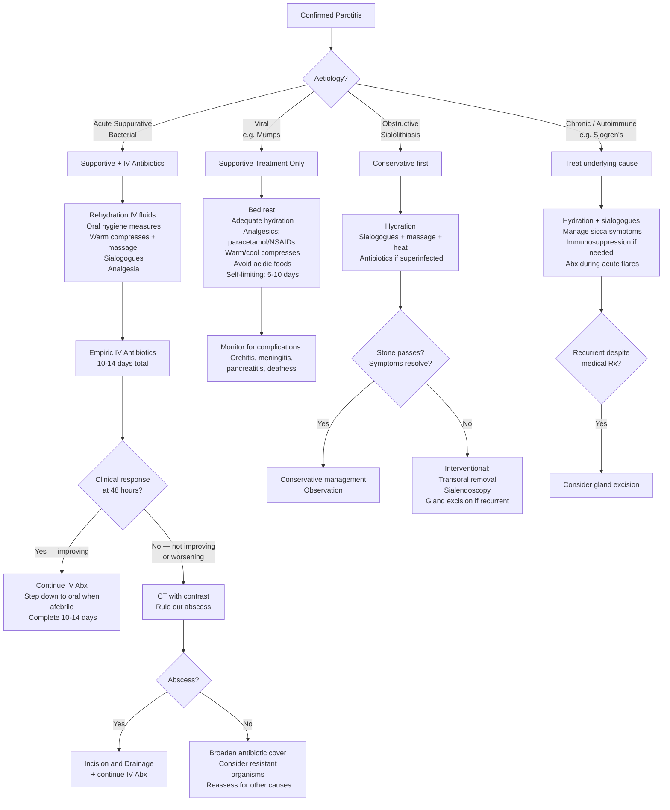

## Management of Parotitis

### Principles of Management

The management of parotitis depends entirely on the **aetiology**. The overarching principles are:

1. **Treat the cause** (antibiotics for bacterial, supportive for viral, remove stones for obstructive, immunosuppression for autoimmune)
2. **Reverse predisposing factors** (rehydrate, improve oral hygiene, stop offending drugs)
3. **Manage complications** (drain abscesses, secure airway if threatened, address sepsis)
4. **Prevent recurrence** (address underlying risk factors, consider gland excision for recurrent disease)

Think of it as a stepwise approach: **supportive measures first → medical treatment → surgical treatment if medical fails**.

---

### Management Algorithm

---

### A. Supportive Measures (All Types of Parotitis)

These are the **foundation** of management regardless of aetiology. The rationale for each is rooted in the pathophysiology:

| Measure | Rationale / Mechanism |
|---|---|
| ***Rehydration*** (IV fluids in acute setting) [1] | Dehydration is the single most important predisposing factor. Rehydration restores salivary flow, which re-establishes the mechanical flushing action that clears bacteria from the ductal system. In post-operative patients, ensure adequate IV fluid replacement and encourage oral intake as early as possible |
| ***Oral hygiene*** | Poor oral hygiene increases the bacterial load in the oral cavity — the source of retrograde infection. Chlorhexidine mouthwashes reduce oral bacterial colonization. Regular tooth brushing and oral care (especially in intubated/ICU patients) |
| ***Warm compresses + massage*** [18] | External warm compresses promote vasodilation → improved blood flow to the gland → enhanced immune cell delivery and oedema resorption. Gentle massage of the gland (from posterior to anterior, towards the duct) promotes forward drainage of stagnant, infected secretions through Stensen's duct |
| ***Sialogogues*** [18] | Sialogogues ("sialon" = saliva, "agogos" = leading/promoting) are agents that stimulate salivary flow. Examples: sour candy, lemon drops, vitamin C tablets, pilocarpine (muscarinic agonist). By increasing salivary flow, they flush bacteria and debris out through the duct — essentially restoring the gland's own defence mechanism. **Pilocarpine** (5 mg TDS) is a parasympathomimetic that directly stimulates M3 muscarinic receptors on salivary acinar cells |
| **Analgesia** | Paracetamol and/or NSAIDs for pain control. NSAIDs (e.g., ibuprofen) also provide anti-inflammatory benefit. Avoid aspirin in children with viral parotitis (risk of Reye syndrome) |
| ***Heat application*** [18] | Local warmth promotes vasodilation and helps liquify inspissated secretions within the duct, facilitating drainage |
| **Discontinue offending drugs** | If anticholinergics (atropine, glycopyrrolate, antihistamines, tricyclics) are contributing to xerostomia, consider alternatives where clinically possible. Similarly review diuretics that may be contributing to dehydration |

<Callout title="The Mnemonic for Conservative Parotitis Management: SHAMS">

- **S** — Sialogogues (lemon drops, pilocarpine)
- **H** — Hydration (IV fluids + oral fluids)
- **A** — Antibiotics (if bacterial)
- **M** — Massage (gland massage to promote drainage)
- **S** — Stop offending drugs (anticholinergics) + warm compresses (Steam/heat)
</Callout>

---

### B. Medical Treatment — Acute Suppurative Parotitis

#### Antibiotic Therapy

***Antibiotics*** are the cornerstone of treatment for bacterial suppurative parotitis. The choice reflects the expected microbiology: ***S. aureus*** is the most common organism [1], with polymicrobial infection (including oral streptococci and anaerobes) being frequent [2].

***Total duration = 10–14 days*** [2]

##### Empiric Regimens

**1. Immunocompetent host** [2]:

| Component | Drug Options | Rationale |
|---|---|---|
| **Anti-staphylococcal agent** | ***Nafcillin*** OR ***1st generation cephalosporin*** (e.g., cefazolin IV → cephalexin PO) | Nafcillin ("naf-" = nafcillin is a penicillinase-resistant penicillin) — specifically targets *S. aureus* including penicillinase-producing strains. 1st gen cephalosporins (cefazolin) also have excellent Gram-positive cover including MSSA |
| **PLUS anaerobic cover** | ***Clindamycin*** OR ***Metronidazole*** | The infection is often polymicrobial with oral anaerobes (Bacteroides, Fusobacterium, Prevotella, Peptostreptococcus). Clindamycin covers both Gram-positive cocci AND anaerobes (dual purpose — can sometimes be used as monotherapy). Metronidazole ("metro-" = metrum/womb, but think of it as the quintessential anaerobe killer) covers only anaerobes — must be combined with anti-staphylococcal agent |

> **Practical tip**: In Hong Kong, a common empiric regimen is **IV Augmentin (amoxicillin-clavulanate)** which covers *S. aureus* (MSSA), streptococci, AND anaerobes in a single agent. This is a reasonable empiric choice for community-acquired suppurative parotitis in immunocompetent patients. If MRSA prevalence is high or the patient is hospital-acquired, broader cover is needed.

**2. Immunocompromised host** [2]:

| Component | Drug Options | Rationale |
|---|---|---|
| **MRSA cover** | ***Vancomycin*** OR ***Linezolid*** | Immunocompromised patients are at higher risk for MRSA and resistant organisms. Vancomycin ("vanco-" = "vanquish") is the gold standard for MRSA. Linezolid is an alternative (oxazolidinone — inhibits ribosomal 50S subunit) with excellent tissue penetration and oral bioavailability |
| **PLUS broad Gram-negative + anaerobic cover** | ***Cefepime*** OR ***Imipenem*** OR ***Meropenem*** OR ***Piperacillin-tazobactam*** | Immunocompromised patients are at risk for Gram-negative organisms (Pseudomonas, Enterobacteriaceae) in addition to Gram-positives and anaerobes. These agents provide broad-spectrum cover: Cefepime (4th gen cephalosporin — anti-Pseudomonal); Carbapenems (imipenem/meropenem — broadest spectrum); Pip-tazo (anti-Pseudomonal penicillin + β-lactamase inhibitor). All also cover anaerobes |

<Callout title="Why Broader Cover in Immunocompromised?" type="idea">
In immunocompetent patients, the immune system helps contain infection and the flora is predictable (S. aureus + oral flora). In immunocompromised patients (HIV, chemotherapy, transplant, uncontrolled DM), the immune system cannot restrict bacterial proliferation, so more virulent and resistant organisms (MRSA, Pseudomonas, Enterobacteriaceae) can establish infection. You need antibiotics that cover the worst-case scenario because you cannot rely on the immune system to do its share of the work.
</Callout>

##### Antibiotic Step-Down

- **Start IV** → when the patient is afebrile for 24–48 hours, improving clinically, and tolerating oral intake, **step down to oral antibiotics** to complete the total 10–14 day course
- Oral step-down options:
  - Immunocompetent: Oral cephalexin + metronidazole, OR oral amoxicillin-clavulanate (Augmentin), OR oral clindamycin
  - Immunocompromised: Guided by culture and sensitivity results

##### Adjusting Antibiotics Based on Culture Results

- Once Gram stain and culture/sensitivity results return (from expressed pus or FNA), **narrow the antibiotic spectrum** to target the identified organism(s)
- This is the principle of **antibiotic stewardship** — start broad empirically, narrow once you know the enemy

---

### C. Surgical Treatment

#### 1. Incision and Drainage (I&D) of Parotid Abscess

***Incision and drainage (I&D) is indicated when there is no clinical response after 48 hours of treatment with empiric intravenous antibiotics*** [2]

| Aspect | Detail |
|---|---|
| **Indication** | Failure to improve after 48 hours of appropriate IV antibiotics, OR clinical/imaging evidence of discrete abscess formation (fluctuance on exam; rim-enhancing collection on CT with contrast) [2] |
| **Pre-operative imaging** | CT with IV contrast to confirm abscess, delineate its location (superficial vs. deep lobe), and plan the surgical approach |
| **Surgical approach** | Modified Blair incision (pre-auricular extending to submandibular) — the same incision used for parotidectomy. The dissection must be performed carefully with **identification and preservation of the facial nerve (CN VII)**, as the nerve runs through the gland. Pus is drained, loculations are broken down, and the cavity is irrigated. A drain is typically left in situ |
| **Key risk** | **Facial nerve injury** — the facial nerve divides the parotid into superficial and deep lobes and branches within the gland. Incision into the parotid without identifying the nerve can cause permanent facial palsy. This is why abscess drainage should be performed by an experienced surgeon (ideally ENT or maxillofacial) |
| **Alternative for small/superficial abscess** | US-guided needle aspiration — less invasive, can be repeated, avoids the risk of facial nerve injury from formal I&D. Appropriate for small, well-defined, superficial collections |
| **Post-operative care** | Continue IV antibiotics, send pus for culture, wound care, monitor for facial nerve function |

> **Why 48 hours as the threshold?** Most acute bacterial parotitis will begin to show clinical improvement (reduced fever, decreased swelling and tenderness) within 24–48 hours of appropriate IV antibiotics. If there is no improvement by 48 hours, this suggests either: (1) an undrained abscess that antibiotics cannot penetrate (antibiotics don't work well against walled-off pus collections — you need source control), (2) resistant organisms, or (3) an alternative/missed diagnosis.

#### 2. Management of Obstructive Parotitis (Sialolithiasis)

The management of sialolithiasis follows a stepwise approach from conservative to increasingly interventional [18][19]:

***Sialolithiasis treatment*** [19]:

| Step | Treatment | Indication / Detail |
|---|---|---|
| **Step 1: Conservative** | ***Conservative — small stones to pass by themselves*** [19]. Hydration, sialogogues (lemon drops), massage, warm compresses | Small stones ( < 5 mm), mobile stones near the duct orifice. The rationale is to increase salivary flow to "flush" the stone out naturally. Many small stones will pass spontaneously |
| **Step 2: Transoral removal** | ***Transoral removal/excision*** [19] | For stones palpable in the distal portion of Stensen's or Wharton's duct (near the duct opening). Under local anaesthesia, an incision is made directly over the stone through the oral mucosa, the stone is removed, and the duct is marsupialised to prevent stenosis |
| **Step 3: Sialendoscopy** | ***Sialendoscopy and removal*** [19] | For stones that are not accessible transorally but are within the ductal system. A miniature endoscope (0.8–1.6 mm) is introduced into the duct orifice. The stone is visualised and removed using a basket/forceps, or fragmented with intracorporeal lithotripsy (laser). Both diagnostic and therapeutic. Minimally invasive with gland preservation |
| **Step 4: Gland excision** | ***Excision of the gland*** [19] | ***Indications: proximal stone — inaccessible by scope or transoral excision; recurrent stones; multiple stones*** [19]. For the submandibular gland: submandibular gland excision (via transcervical approach). For the parotid gland: superficial parotidectomy (requires identification and preservation of CN VII). Gland excision is the definitive treatment when conservative and minimally invasive methods fail |

***Sialadenitis treatment*** (general principles for any sialadenitis) [18]:
- ***Hydration***
- ***Sialogogues, massage, heat, antibiotics during acute attacks***
- ***Remove stones*** [18]
  - ***Exploration of submandibular duct***
  - ***Sialendoscopy***
- ***Excision of the gland*** (for recurrent chronic sialadenitis) [18]

---

### D. Management of Viral Parotitis (Mumps)

Viral parotitis is **self-limiting** — there is no specific antiviral therapy for mumps. Management is entirely ***supportive*** [3]:

| Measure | Detail |
|---|---|
| **Bed rest** | Reduces energy expenditure during acute viraemia |
| **Adequate hydration** | Oral fluids primarily; IV fluids if unable to drink (severe trismus/dysphagia) |
| **Analgesics** | Paracetamol and/or NSAIDs. **Avoid aspirin in children** (risk of Reye syndrome — acute hepatic encephalopathy associated with aspirin use during viral illness) |
| **Warm or cool compresses** | Symptomatic relief of pain and swelling |
| **Avoid acidic/sour foods** | These stimulate salivary flow, which increases pain in the inflamed gland (distension against oedematous parenchyma) |
| **Isolation** | Mumps is a **notifiable disease** in Hong Kong. The patient is infectious from ~2 days before parotid swelling to ~5 days after onset. Standard and droplet precautions. Exclude from school/work for 5 days after parotid onset |
| **Monitor for complications** | Orchitis (testicular pain/swelling — 15–30% of post-pubertal males), meningitis (headache, neck stiffness, photophobia), pancreatitis (epigastric pain, vomiting, raised amylase/lipase), sensorineural hearing loss (usually unilateral), encephalitis (rare but serious) |

> ***Avoid ampicillin*** in EBV infectious mononucleosis (which can also cause parotid enlargement) — it causes a characteristic ***rubelliform rash*** in ~90% of patients with EBV who receive ampicillin/amoxicillin [20]. This is not a true allergy but an immune-mediated reaction. Always consider EBV when prescribing antibiotics for sore throat with bilateral parotid/cervical swelling.

<Callout title="Mumps Vaccination — Prevention Is Better Than Cure">
The MMR vaccine (live attenuated) is the best prevention. In Hong Kong, it is given at age 1 and age 6 (Primary 1). Two doses provide ~88% efficacy against mumps. Outbreaks still occur in under-vaccinated populations. Post-exposure prophylaxis with MMR vaccine is not reliably effective but may be offered to unvaccinated contacts.
</Callout>

---

### E. Management of Deep Neck Space Infections (Complication of Parotitis)

If parotitis extends to cause a **parapharyngeal abscess** or other **deep neck space infection**, the management principles are [21]:

- ***Secure airway*** — deep neck infections can rapidly compromise the airway through pharyngeal/laryngeal oedema [21]
- ***Surgical drainage*** — deep neck abscesses require formal surgical drainage (transcervical approach); antibiotics alone are insufficient for walled-off collections [21]
- ***IV antibiotics*** — broad-spectrum empiric cover (similar to immunocompromised regimen: vancomycin + piperacillin-tazobactam or carbapenem) pending cultures [21]
- ***Dental consultation*** — if an odontogenic source is suspected [21]

---

### F. Management of Chronic / Autoimmune Parotitis

#### Sjögren's Syndrome
- **Symptomatic**: Artificial tears (for keratoconjunctivitis sicca), saliva substitutes, sialogogues (pilocarpine 5 mg TDS or cevimeline)
- **Systemic treatment**: Hydroxychloroquine for arthralgias and fatigue; rituximab for severe systemic disease; mycophenolate or azathioprine for major organ involvement
- **Monitor** for lymphoma (40-fold increased risk of non-Hodgkin B-cell lymphoma) — any rapidly enlarging parotid mass in a Sjögren's patient warrants urgent FNA/biopsy

#### Sarcoidosis
- Mild disease: observation (may resolve spontaneously)
- Moderate-severe: systemic corticosteroids (prednisolone); steroid-sparing agents (methotrexate, azathioprine) for refractory disease

#### Recurrent Parotitis of Childhood
- Conservative: hydration, sialogogues, massage during acute episodes, short-course antibiotics if superinfected
- Usually self-limiting — resolves by puberty
- Sialendoscopy with ductal irrigation (steroid lavage) can reduce frequency of recurrences
- Parotidectomy very rarely needed (reserved for truly refractory cases)

---

### G. Prevention

| Strategy | Detail |
|---|---|
| **Perioperative hydration** | Adequate IV fluid resuscitation in surgical patients is the single most important preventive measure for post-operative parotitis. Encourage early oral intake |
| **Oral hygiene in hospitalised patients** | Regular mouth care (tooth brushing, chlorhexidine mouth rinses) — especially in ICU/intubated patients |
| **Minimise anticholinergics** | Use alternative drugs where possible; if anticholinergics are essential, ensure the patient is well-hydrated |
| **MMR vaccination** | For mumps prevention — two doses (age 1 and age 6 in HK) |
| **Sialendoscopy / stone removal** | In patients with recurrent obstructive parotitis, definitive stone management prevents recurrent infection |

---

### Summary Table: Management by Aetiology

| Aetiology | Supportive | Medical | Surgical | Duration / Notes |
|---|---|---|---|---|
| **Acute suppurative** | ***Rehydration, IV antibiotics*** [1], oral hygiene, warm compress, massage, sialogogues, analgesia | Empiric IV Abx → step down to PO. Immunocompetent: nafcillin/cephalosporin + clindamycin/metronidazole. Immunocompromised: vancomycin/linezolid + cefepime/carbapenem/pip-tazo [2] | ***I&D if no response after 48 hrs of IV Abx*** [2] | ***10–14 days total*** [2] |
| **Viral (mumps)** | Bed rest, hydration, analgesics (avoid aspirin in children), warm/cool compresses | None (self-limiting) | Not indicated | 5–10 days; isolation; notify CHP |
| **Sialolithiasis** | Hydration, sialogogues, massage, heat [18] | Abx if superinfected [18] | Conservative → transoral removal → sialendoscopy → gland excision [19] | Stepwise approach |
| **Chronic sialadenitis** | Hydration, sialogogues, massage, heat [18] | Abx during acute flares [18] | Remove stones; sialendoscopy; gland excision for recurrent disease [18] | Treat underlying cause (Sjögren's, etc.) |
| **Parotid abscess** | As for suppurative | Continue IV Abx | ***I&D*** (formal or US-guided aspiration) [2] | Surgical drainage is essential |
| **Deep neck abscess** | ***Secure airway*** [21] | ***IV antibiotics*** [21] | ***Surgical drainage*** [21] | Multidisciplinary (ENT + anaesthesia) |

---

### Contraindications and Cautions

| Treatment | Contraindication / Caution |
|---|---|
| **Sialography** (for chronic sialadenitis workup) | **Contraindicated in acute infection** — retrograde injection of contrast during active infection can exacerbate the infection and cause bacteraemia |
| **Aspirin** (as analgesia) | **Contraindicated in children with viral parotitis** — risk of Reye syndrome |
| ***Ampicillin/amoxicillin*** | ***Avoid in EBV infectious mononucleosis*** — causes characteristic ***rubelliform rash*** [20]. If unsure whether the parotitis is mumps vs. EBV, avoid these drugs until EBV is excluded |
| **Incisional/open biopsy of parotid** | Strongly discouraged — risk of facial nerve injury, tumour seeding, field contamination. Use FNA or core biopsy instead [11] |
| **Pilocarpine (sialogogue)** | Caution in patients with uncontrolled asthma (parasympathomimetic → bronchoconstriction), narrow-angle glaucoma (pupillary constriction may precipitate angle closure in susceptible individuals), or bradycardia |
| **Parotidectomy** | Requires experienced surgeon (ENT/maxillofacial). Risk of CN VII injury (temporary ~20%, permanent ~3–5%), Frey syndrome (gustatory sweating — post-surgical aberrant reinnervation of auriculotemporal nerve to sweat glands), haemorrhage, salivary fistula, first bite syndrome |

<Callout title="Frey Syndrome — A Unique Surgical Complication">
After parotidectomy, the severed parasympathetic secretomotor fibres (intended for the parotid gland) can aberrantly regenerate and innervate the **sweat glands** of the overlying skin. This results in **gustatory sweating** — the patient sweats over the parotid region during eating. It occurs in up to 30–60% of patients after parotidectomy. Treatment: topical antiperspirant, botulinum toxin injection, interposition graft (e.g., AlloDerm or superficial musculoaponeurotic system flap) at the time of surgery.
</Callout>

---

<Callout title="High Yield Summary">

1. **Acute suppurative parotitis**: ***Rehydration + IV antibiotics*** [1]. Duration ***10–14 days*** [2]. Immunocompetent: anti-staphylococcal + anaerobic cover. Immunocompromised: MRSA cover + broad Gram-negative/anaerobic cover
2. ***I&D is indicated when no clinical response after 48 hours of IV antibiotics*** [2] — always get CT first to confirm abscess
3. **Viral parotitis (mumps)**: supportive only — bed rest, hydration, analgesia. Self-limiting 5–10 days. No antiviral needed. Notifiable disease
4. **Sialolithiasis**: stepwise — ***conservative (small stones pass) → transoral removal → sialendoscopy → gland excision*** [19] if proximal/recurrent/multiple stones
5. **Chronic sialadenitis**: ***hydration, sialogogues, massage, heat, antibiotics during acute attacks, remove stones, gland excision*** if recurrent [18]
6. **Deep neck abscess**: ***secure airway → surgical drainage → IV antibiotics*** [21]
7. **Prevention of post-operative parotitis**: adequate perioperative hydration + oral hygiene — this is the single most effective preventive strategy
8. **Key contraindications**: no sialography in acute infection; no aspirin in children with viral illness; avoid ampicillin in EBV
9. **Frey syndrome**: gustatory sweating post-parotidectomy due to aberrant parasympathetic reinnervation of skin sweat glands
</Callout>

---

<ActiveRecallQuiz
  title="Active Recall - Management of Parotitis"
  items={[
    {
      question: "What is the empiric antibiotic regimen for acute suppurative parotitis in an immunocompetent host? What is the total duration of treatment?",
      markscheme: "Anti-staphylococcal agent: Nafcillin OR 1st generation cephalosporin (e.g. cefazolin), PLUS anaerobic cover: Clindamycin OR Metronidazole. Total duration: 10-14 days. Start IV, step down to oral when afebrile and improving."
    },
    {
      question: "A post-operative patient with acute suppurative parotitis is not improving after 48 hours of IV antibiotics. What is the next step and why?",
      markscheme: "CT with IV contrast to look for parotid abscess (rim-enhancing fluid collection). If abscess confirmed, incision and drainage (I and D) is required because antibiotics cannot adequately penetrate walled-off pus collections — source control is needed. Alternative for small superficial collection: US-guided needle aspiration."
    },
    {
      question: "List the stepwise management of sialolithiasis from least to most invasive.",
      markscheme: "Step 1: Conservative — hydration, sialogogues, massage, warm compresses (small stones may pass spontaneously). Step 2: Transoral removal/excision (for palpable distal duct stones). Step 3: Sialendoscopy and removal (minimally invasive endoscopic approach for intraductal stones). Step 4: Excision of the gland (for proximal inaccessible stones, recurrent stones, or multiple stones)."
    },
    {
      question: "Why is ampicillin contraindicated in a patient with suspected EBV infectious mononucleosis who presents with parotid swelling?",
      markscheme: "Ampicillin or amoxicillin in EBV infectious mononucleosis causes a characteristic rubelliform (maculopapular) rash in approximately 90% of patients. This is not a true drug allergy but an immune-mediated reaction (likely related to transient immune dysregulation with polyclonal B-cell activation). If unsure whether parotitis is mumps vs EBV, avoid ampicillin until EBV is excluded."
    },
    {
      question: "What are the 4 key supportive measures in managing parotitis and the pathophysiological rationale for each?",
      markscheme: "(1) Rehydration — restores salivary flow and mechanical flushing of duct. (2) Sialogogues (lemon drops, pilocarpine) — stimulate salivary secretion to flush bacteria from duct. (3) Warm compresses and massage — vasodilation improves blood flow and immune response; massage promotes antegrade drainage of pus/secretions through duct. (4) Oral hygiene (chlorhexidine rinse) — reduces bacterial load in oral cavity, the source of retrograde duct colonization."
    },
    {
      question: "What is Frey syndrome and why does it occur after parotidectomy?",
      markscheme: "Frey syndrome is gustatory sweating — sweating over the parotid region during eating. It occurs because severed parasympathetic secretomotor nerve fibres (from auriculotemporal nerve, originally innervating parotid acinar cells) aberrantly regenerate and reinnervate the sweat glands of the overlying skin. When the patient eats, parasympathetic stimulation intended for salivation instead activates sweat glands. Occurs in 30-60% of patients post-parotidectomy."
    }
  ]}
/>

---

## References

[1] Lecture slides: GC 217. Facial nerve palsy and salivary gland diseases.pdf, p50
[2] Senior notes: felixlai.md, section 323
[3] Lecture slides: GC 217. Facial nerve palsy and salivary gland diseases.pdf, p51
[11] Senior notes: felixlai.md, section 336
[18] Lecture slides: GC 217. Facial nerve palsy and salivary gland diseases.pdf, p55
[19] Lecture slides: GC 217. Facial nerve palsy and salivary gland diseases.pdf, p57
[20] Lecture slides: GC 219. Infections and tumours in pharynx and oral cavity.pdf, p15
[21] Lecture slides: GC 219. Infections and tumours in pharynx and oral cavity.pdf, p22
