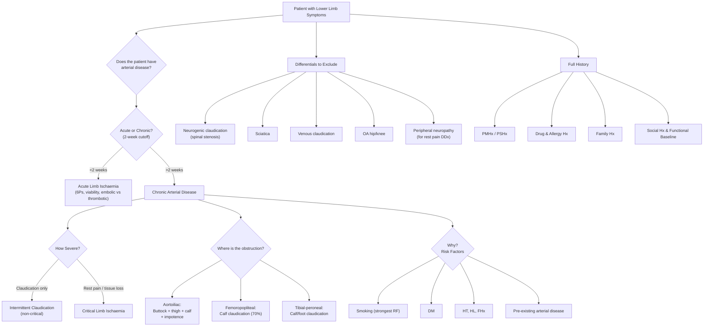

# History Taking: Peripheral Arterial Disease

---

## Master Framework Overview

---

## Clinical Approach to PAD — The Five Key Questions

Before diving into individual questions, keep this framework in your head. Prof Cheng's lecture and the senior notes all converge on the same five-box approach [1][2][3]:

1. **_Does the patient have arterial disease?_** — claudication, rest pain, tissue loss
2. **_Acute or chronic?_** — 2 weeks as the cutoff
3. **_How severe?_** — claudication distance → rest pain → tissue loss (gangrene/ulcer)
4. **_Where is the obstruction?_** — aortoiliac, femoropopliteal, tibioperoneal
5. **_Why?_** — risk factors

This is your mental scaffold for the entire history station.

---

## 1. Presenting Complaint — Symptom Analysis

### A. Intermittent Claudication (間歇性跛行 gaan3 kit3 sing3 bo2 hang4)

> _"Can you tell me about the pain in your leg?"_
> 「你隻腳邊度痛？行路嘅時候有冇嘢？」

**Intermittent claudication** is defined as **_a reproducible discomfort of a defined group of muscles that is induced by exercise and relieved by rest_** [2]. It indicates non-critical chronic limb ischaemia.

| Question                           | Practical Phrasing                                                                                           | Why It Matters                                                                                                                                                                     |
| ---------------------------------- | ------------------------------------------------------------------------------------------------------------ | ---------------------------------------------------------------------------------------------------------------------------------------------------------------------------------- |
| **Site** 部位                      | "Where exactly do you feel the pain — buttock, thigh, calf, or foot?" 「痛喺邊度？屁股、大髀、小腿定腳板？」 | **_The obstruction is one joint above the claudicating muscle_** [2]. Buttock + thigh = aortoiliac; calf = femoropopliteal (**_commonest, 70%_** [2]); calf/foot = tibial-peroneal |
| **Onset**                          | "When did this first start? More or less than 2 weeks ago?"                                                  | **_>2 weeks = chronic arterial disease_** [2]. < 2 weeks = acute limb ischaemia — completely different pathway                                                                     |
| **Character**                      | "What does the pain feel like — cramping, aching, burning?"                                                  | **_Usually a cramping, aching muscular pain_** [2]. Burning/tingling suggests neuropathy instead                                                                                   |
| **Claudication distance** 跛行距離 | "How far can you walk before you have to stop? On flat ground or uphill?" 「你行到幾遠要停？平路定斜路？」   | **_The claudication distance is reproducible_** — this is the hallmark [1][3]. A variable distance points toward neurogenic claudication                                           |
| **Relief**                         | "What do you do when the pain comes? How long until it goes?" 「停低幾耐先好返？」                           | **_'Shop window to shop window': relieved by ≤10 min of standing still_** [2]. Cf. neurogenic claudication relieved by bending forward ("park bench to park bench")                |
| **Progression**                    | "Is the distance getting shorter? Has the area of pain spread?"                                              | Decreasing claudication distance or development of rest pain = disease progression toward critical limb ischaemia [2]                                                              |
| **Exacerbating factors**           | "Is it worse going uphill or on flat ground?"                                                                | Uphill worsens it (increased O₂ demand). If going _downstairs_ is worse, think spinal stenosis [2]                                                                                 |

<Callout title="The 'Shop Window' Test" type="idea">
  A classic OSCE clarifier: vascular claudication is relieved simply by
  **standing still** (as if looking in a shop window). Neurogenic claudication
  requires **sitting down or bending forward** (as if sitting on a park bench).
  Ask specifically: "Do you need to sit down, or can you just stand and wait?"
</Callout>

### B. Rest Pain (靜息痛 zing6 sik1 tung3)

> _"Do you get pain even when you're not walking — for example, at night in bed?"_
> 「你瞓覺嘅時候隻腳痛唔痛？」

**_Rest pain is NOT a severe form of claudication — it is a different entity_** [1][2]. It indicates **_critical limb ischaemia_**.

| Question              | Practical Phrasing                                                                          | Why It Matters                                                                                                                  |
| --------------------- | ------------------------------------------------------------------------------------------- | ------------------------------------------------------------------------------------------------------------------------------- |
| **Quality**           | "Describe the pain — is it continuous aching?"                                              | **_Continuous, severe aching pain_** in the toes/forefoot [2]. Cf. claudication which is muscular and exercise-related          |
| **Region**            | "Is it in the toes or the ball of the foot?"                                                | **_Affects the most distal, least perfused areas — toes and forefoot_** [1][2]. NOT in the calf (that's claudication territory) |
| **Severity**          | "Does it wake you from sleep? Do you need strong painkillers?" 「有冇痛到瞓唔到？」         | **_Wakes patient from sleep; requires opioid analgesics_** [2]. This is a red flag for critical ischaemia                       |
| **Timing**            | "Is it worse at night when lying flat?"                                                     | **_Worse when lying flat/raising limb_** (gravity no longer assists perfusion) [1][2]                                           |
| **Relieving factors** | "What do you do to make it better — hang your leg over the bed?" 「你會唔會將腳吊落床邊？」 | **_Relieved by putting limb in dependent position_** — classic for ischaemic rest pain [1][2][3]. Patients may sleep in a chair |

<Callout title="Rest Pain vs Peripheral Neuropathy" type="error">
  Students commonly confuse ischaemic rest pain with diabetic peripheral
  neuropathy. Key differences: - **Neuropathy**: bilateral, glove-and-stocking,
  burning/tingling, NOT relieved by dependency [2] - **Ischaemic rest pain**:
  usually unilateral (or worse on one side), aching, forefoot/toes, **relieved
  by dependency** [2] Always ask about the positional component!
</Callout>

### C. Tissue Loss (組織壞死 zou2 zik1 waai6 sei2)

> "Have you noticed any wounds on your feet that aren't healing? Any black discolouration of the toes?"
> 「你隻腳有冇傷口唔埋口？腳趾有冇變黑？」

| Question                                                     | Why It Matters                                                                                                                                                                                                                         |
| ------------------------------------------------------------ | -------------------------------------------------------------------------------------------------------------------------------------------------------------------------------------------------------------------------------------- |
| Ulcer: site, size, duration, discharge, any prior treatment? | **_Tissue loss = absolute indication for intervention_** [1]. Non-healing ulcers in an arterial distribution (pressure areas: heel, metatarsal heads, tips of toes, between toes [2]) suggest critical ischaemia                       |
| Gangrene: dry vs wet? Any smell, swelling, pus?              | **_Wet gangrene_** (soft, moist, infected, no clear demarcation) is a **_surgical emergency requiring debridement or amputation_** [3]. Dry gangrene (hard, shrunken, clear demarcation) can sometimes be allowed to auto-amputate [3] |

---

## 2. Acute vs Chronic — The 2-Week Cutoff

If the onset is **< 2 weeks**, you must pivot to acute limb ischaemia (急性肢體缺血 gap1 sing3 zi1 tai2 kyut3 hyut3):

| Question                    | Practical Phrasing                                                                                               | Why It Matters                                                                                        |
| --------------------------- | ---------------------------------------------------------------------------------------------------------------- | ----------------------------------------------------------------------------------------------------- |
| **Onset speed**             | "Did it come on over seconds, minutes, hours, or days?"                                                          | **_Embolic: hyperacute (sec/min). Thrombotic: subacute (hours/days)_** [2][3][4]                      |
| **Background claudication** | "Before this episode, did you already have leg pain when walking?"                                               | **_Presence of prior claudication → thrombosis (acute-on-chronic). Absence → embolism_** [3][4]       |
| **AF / recent MI**          | "Do you have an irregular heartbeat? Have you had a recent heart attack?" 「你有冇心房顫動？最近有冇心臟病發？」 | **_AF is the commonest source of emboli (70% of cardiac emboli)_** [2]. Recent MI → LV mural thrombus |
| **6Ps assessment**          | Pain, Pallor, Pulselessness, Perishing cold, Paraesthesia, Paralysis                                             | **_Paraesthesia and paralysis are late signs indicating muscle infarction and poor prognosis_** [4]   |
| **Both legs or one?**       | "Is it both legs or just one?"                                                                                   | Bilateral acute ischaemia suggests a "saddle" embolus at the aortic bifurcation [2]                   |

---

## 3. Localisation — Where Is the Obstruction?

**_The obstruction is one joint above the claudicating muscle_** [2]:

| Level of Occlusion                     | Claudication Site               | Special Features                                                                                                    |
| -------------------------------------- | ------------------------------- | ------------------------------------------------------------------------------------------------------------------- |
| **_Aortoiliac_**                       | Bilateral buttock, thigh, calf  | **_Leriche syndrome triad: buttock claudication + absent/diminished femoral pulses + erectile dysfunction_** [1][2] |
| **_Iliac_**                            | Unilateral buttock, thigh, calf | —                                                                                                                   |
| **_Femoropopliteal_** (commonest, 70%) | Unilateral calf                 | **_Superficial femoral artery most commonly affected_** [1][2][4]                                                   |
| **_Tibial-peroneal_** (distal)         | Calf/foot; mainly tissue loss   | Common in DM; may have minimal claudication but present with tissue loss [1]                                        |

> "Do you have any problems with erections?"
> 「你有冇勃起困難？」

This question matters because **_impotence is part of Leriche syndrome_** and localises disease to the aortoiliac segment [1][2]. Students often forget to ask this.

---

## 4. Risk Factors (Why?)

### Cardiovascular Risk Factors

| Risk Factor                  | Question                                                                                                        | Why It Matters                                                                                                                                                                                                                           |
| ---------------------------- | --------------------------------------------------------------------------------------------------------------- | ---------------------------------------------------------------------------------------------------------------------------------------------------------------------------------------------------------------------------------------- |
| **_Smoking_** (最強危險因素) | "Do you smoke? How many per day and for how long? Have you ever quit?" 「你有冇食煙？食咗幾多年？幾多支一日？」 | **_Strongest risk factor; 3–6× risk for IC_** [2]. Cessation is the single most impactful intervention                                                                                                                                   |
| **_Diabetes mellitus_**      | "Do you have diabetes? How is your sugar control? What's your latest HbA1c?" 「你有冇糖尿病？糖化血紅素幾多？」 | **_2× increased risk; 26% increased risk of PAD for every 1% increase in HbA1c_** [2]. DM patients should be screened for PAD by ABI every 5 years [2]. DM also causes neuropathy and calcified arteries (ABI falsely elevated >1.3) [3] |
| **Hypertension**             | "Do you have high blood pressure?" 「你有冇高血壓？」                                                           | Major modifiable RF                                                                                                                                                                                                                      |
| **Hyperlipidaemia**          | "Do you have high cholesterol?" 「你有冇高膽固醇？」                                                            | Major modifiable RF [1][3]                                                                                                                                                                                                               |

### Pre-existing Arterial Disease

| Question                                                                        | Why It Matters                                                                                                                         |
| ------------------------------------------------------------------------------- | -------------------------------------------------------------------------------------------------------------------------------------- |
| "Have you ever had a heart attack, angina, or heart surgery?"                   | **_Atherosclerosis is a systemic disease_** [1]. Co-existing coronary artery disease is the leading cause of death in PAD patients [1] |
| "Have you ever had a stroke or mini-stroke (TIA)?" 「你有冇試過中風？」         | Carotid and cerebrovascular disease coexist                                                                                            |
| "Has anyone checked the pulse in your neck (carotid) or mentioned an aneurysm?" | AAA and carotid disease are associated                                                                                                 |

---

## 5. Past Medical History (過往病史 gwo3 wong5 beng6 si2)

- **Atrial fibrillation** — embolic source [3][4]
- **Recent MI** — LV mural thrombus risk [4]
- **Stroke / TIA** — systemic atherosclerosis [2]
- **Thrombophilic state** — may drive thrombosis-in-situ [3]
- **CKD** — both a RF for accelerated atherosclerosis and relevant for contrast exposure during angiography
- **DM, HT, HL** — as above [1][3]

---

## 6. Past Surgical History (過往手術史)

| Question                                                                                                      | Why It Matters                                                                                                                              |
| ------------------------------------------------------------------------------------------------------------- | ------------------------------------------------------------------------------------------------------------------------------------------- |
| "Have you had any operations on your legs or blood vessels before — bypass surgery, stenting, or amputation?" | **_History of revascularisation_** (bypass, angioplasty, stenting) is critical — graft failure is a common cause of recurrent ischaemia [3] |
| "Have you had any heart surgery or catheter procedures?"                                                      | Relevant for AF ablation, valve surgery, or instrumentation complications                                                                   |
| Saphenous vein condition: "Have you had varicose vein surgery or coronary bypass using leg veins?"            | **_The great saphenous vein is the preferred conduit for infrainguinal bypass_** [4]. Prior harvesting means it's unavailable               |

---

## 7. Drug History & Allergies (藥物史及敏感史)

| Medication                                     | Why It Matters                                                                                                                         |
| ---------------------------------------------- | -------------------------------------------------------------------------------------------------------------------------------------- |
| **Aspirin / Clopidogrel**                      | Antiplatelet therapy is standard in PAD [3]                                                                                            |
| **Statins**                                    | For lipid control and plaque stabilisation                                                                                             |
| **Antihypertensives** (esp. beta-blockers)     | Beta-blockers were historically thought to worsen claudication — this is mostly a myth, but examiners may ask                          |
| **Anticoagulants**: Warfarin / NOACs / Heparin | Relevant if AF present or prior thrombotic events [3]                                                                                  |
| **Cilostazol**                                 | Phosphodiesterase inhibitor used for claudication                                                                                      |
| **_Contrast allergy_**                         | **_Essential to ask — patient may need CT angiography or DSA_** [2][4]. Pre-medication with steroids/antihistamines needed if allergic |
| **Metformin**                                  | Must be held before contrast (risk of lactic acidosis with iodinated contrast in CKD)                                                  |

> "Are you allergic to anything — medicines, iodine, or contrast dye?"
> 「你有冇對任何藥物敏感？有冇試過打顯影劑？」

---

## 8. Family History (家族史 gaa1 zuk6 si2)

| Question                                                                                                 | Why It Matters                                                     |
| -------------------------------------------------------------------------------------------------------- | ------------------------------------------------------------------ |
| "Does anyone in your family have heart disease, stroke, or problems with blood circulation in the legs?" | **_Family history of vascular disease_** is a recognised RF [1][2] |
| "Did anyone in your family develop heart problems before age 55 (men) or 65 (women)?"                    | Premature CHD in first-degree relatives increases ASCVD risk [5]   |
| "Does anyone in your family have high cholesterol at a young age?"                                       | Screen for familial hyperlipidaemia [5]                            |

---

## 9. Social History (社會史 se5 wui2 si2) & Functional Baseline

| Domain              | Questions                                                                                            | Why It Matters                                                                                                                                  |
| ------------------- | ---------------------------------------------------------------------------------------------------- | ----------------------------------------------------------------------------------------------------------------------------------------------- |
| **Smoking** 食煙    | Pack-years, current/ex, interest in quitting                                                         | **_Strongest modifiable RF; 3–6× risk_** [2]. Cessation improves claudication distance and reduces CV mortality                                 |
| **Alcohol**         | Units per week                                                                                       | Heavy alcohol use is a CVD RF and affects compliance                                                                                            |
| **Occupation** 職業 | "What do you do for work? Does the leg pain affect your ability to work?"                            | Functional impact; a labourer with claudication at 50m has a very different quality of life than a desk worker                                  |
| **ADL & Mobility**  | "Can you climb stairs? Do you use a walking stick or wheelchair?" 「你可唔可以行樓梯？有冇用拐杖？」 | **_Functional outcomes directly affect management decisions_** [3] — whether to intervene or manage conservatively depends on impact on QoL [2] |
| **Home situation**  | "Do you live alone? Who can help you at home?"                                                       | Relevant for post-op recovery and wound care                                                                                                    |
| **Trauma**          | "Have you had any recent injury to the leg?"                                                         | Trauma can cause arterial injury mimicking PAD [3]                                                                                              |

---

## 10. Targeted Systems Review

| System                   | Questions                                                                                | Relevance                                                      |
| ------------------------ | ---------------------------------------------------------------------------------------- | -------------------------------------------------------------- |
| **Cardiovascular**       | Chest pain, palpitations, orthopnoea, PND, ankle swelling                                | Co-existing IHD/HF — **_atherosclerosis is systemic_** [1]     |
| **Neurological**         | Numbness, tingling (glove-and-stocking?), weakness, back pain, bladder/bowel dysfunction | Distinguish peripheral neuropathy and spinal stenosis from PAD |
| **GU / Sexual function** | Erectile dysfunction                                                                     | **_Leriche syndrome_** [2]                                     |
| **GI**                   | Post-prandial abdominal pain, weight loss                                                | Mesenteric ischaemia (systemic atherosclerosis)                |
| **Renal**                | Known CKD?                                                                               | Renal artery stenosis; contrast nephropathy risk               |

---

## 11. Differentiating Questions — Key DDx

### Vascular vs Neurogenic Claudication

| Feature               | **_Vascular Claudication_**          | **_Neurogenic Claudication_**                      |
| --------------------- | ------------------------------------ | -------------------------------------------------- |
| Cause                 | Chronic arterial insufficiency       | Spinal stenosis → lumbosacral root ischaemia [2]   |
| Distance              | **_Constant claudication distance_** | **_Variable claudication distance_** [2][4]        |
| Relief                | Standing still (shop window)         | **_Bending forward / sitting_** (park bench) [2]   |
| Going downstairs      | Easier                               | **_Worse_** (spine extension) [2]                  |
| Back pain             | Absent                               | Often present                                      |
| Neurological symptoms | Absent                               | **_Paraesthesia, numbness, weakness present_** [2] |

### Other DDx of Leg Pain on Exertion

| Condition                                     | Distinguishing Features                                                               |
| --------------------------------------------- | ------------------------------------------------------------------------------------- |
| **Sciatica**                                  | **_Back pain with radiation, not relieved by resting_** [4]                           |
| **Venous claudication**                       | **_Worse on standing/walking, relieved by raising leg_** [2] (opposite of arterial)   |
| **Hip/knee OA**                               | Pain present from first step, joint-line tenderness, stiffness after rest             |
| **Peripheral neuropathy** (for rest pain DDx) | **_Bilateral, glove-and-stocking, burning/tingling, NOT relieved by dependency_** [2] |

---

## 12. Red-Flag Findings & Escalation Triggers

| Red Flag                                                  | Implication                                  | Action                                                                  |
| --------------------------------------------------------- | -------------------------------------------- | ----------------------------------------------------------------------- |
| **_Rest pain requiring opioids / waking from sleep_**     | Critical limb ischaemia                      | Urgent vascular referral                                                |
| **_Tissue loss: non-healing ulcer or gangrene_**          | Critical limb ischaemia                      | **_Absolute indication for intervention_** [1]                          |
| **_Wet gangrene (swollen, infected, no demarcation)_**    | Surgical emergency                           | **_Emergency debridement or amputation_** [3]                           |
| **_6Ps with paraesthesia/paralysis_**                     | Immediately threatened limb (Rutherford IIb) | **_Emergency revascularisation_** [2][4]                                |
| **_Acute onset < 2 weeks with complete occlusion signs_** | Acute limb ischaemia                         | Do NOT delay — limb viability at stake                                  |
| **_Fixed mottling (>12h)_**                               | Irreversible ischaemia                       | Revascularisation may cause reperfusion injury; consider amputation [4] |

<Callout title="Don't Amputate Before Revascularising!" type="error">
  ***A common pitfall highlighted by Prof Cheng: performing toe amputation
  before revascularisation*** [1]. The wound won't heal if blood supply isn't
  restored first. Always assess and optimise arterial inflow before any surgical
  debridement of ischaemic tissue.
</Callout>

---

## 13. Common Pitfalls in History-Taking

Based on the lecture slides' explicit "Common Pitfalls" section [1]:

1. **_Mis-diagnosis of claudication_** — Failing to distinguish vascular from neurogenic claudication or OA. Always ask about distance reproducibility and relief posture.
2. **_Toe amputation before revascularization_** — As above.
3. **_Delay recognition of acute ischaemia_** — If onset < 2 weeks and 6Ps present, this is an emergency. Don't send the patient home.
4. **_Beware of "leg pain"_** — Not all leg pain is arterial. Consider spinal, venous, musculoskeletal, and neuropathic causes [1].
5. **_"Treating the angiogram"_** — **_Intervention for asymptomatic disease is not indicated_** [1]. The decision to treat is based on symptoms and clinical severity, not imaging alone.
6. **Forgetting to ask about erectile dysfunction** — Misses Leriche syndrome.
7. **Forgetting contrast allergy** — Critical before angiography [2].
8. **Not asking about saphenous vein condition** — If vein has been harvested for CABG, it cannot be used for infrainguinal bypass [4].

---

## 14. High-Yield Exam Interpretation Tips

| Tip                                                                                                                 | Explanation                                                                                                                           |
| ------------------------------------------------------------------------------------------------------------------- | ------------------------------------------------------------------------------------------------------------------------------------- |
| **_ABI 0.4–0.9 = claudication; < 0.4 = critical limb ischaemia_** [3]                                               | Know these thresholds cold. ABI >1.3 = calcified/non-compressible artery (common in DM) → use toe-brachial pressure index instead [3] |
| **_Obstruction is one joint above the symptom_** [2]                                                                | This is the single most tested localisation principle                                                                                 |
| **_70% of chronic PAD affects the SFA_** [2]                                                                        | Hence calf claudication is the commonest presentation                                                                                 |
| **_Embolic ALI: sharp cut-off, few collaterals. Thrombotic: irregular cut-off, well-developed collaterals_** [3][4] | Classic angiography question — embolic = acute process with no time for collateral formation                                          |
| **_Rest pain is in the forefoot/toes, NOT the calf_** [1][2]                                                        | Calf pain = claudication. Forefoot pain at rest = critical ischaemia. Different pathophysiology                                       |
| **_Smoking is the strongest RF (3–6× risk)_** [2]                                                                   | Always quantify in pack-years                                                                                                         |

---

## 15. Model Reporting Script

> "Mr Chan is a 68-year-old gentleman, a retired construction worker and current smoker of 40 pack-years, who presented to Queen Mary Hospital with a 6-month history of progressive left calf pain on exertion.
>
> Regarding his presenting complaint, he describes a cramping pain in the left calf that comes on reproducibly after walking approximately 200 metres on flat ground. The pain is relieved within 5 minutes of standing still. Over the past 2 months, his claudication distance has decreased to approximately 100 metres. He now also reports left forefoot pain at night that wakes him from sleep and is relieved by hanging his foot over the edge of the bed, consistent with rest pain. He denies any ulceration or discolouration of the toes. There is no erectile dysfunction. He denies any back pain, numbness, or weakness.
>
> His past medical history is significant for type 2 diabetes mellitus diagnosed 15 years ago, currently on metformin and gliclazide, with a latest HbA1c of 8.2%. He also has hypertension on amlodipine and hyperlipidaemia on atorvastatin. He has a history of an NSTEMI 3 years ago managed with PCI and stenting to the LAD. He denies any history of atrial fibrillation or stroke.
>
> Past surgical history includes the aforementioned PCI and an appendicectomy in his 20s. He has not had any previous lower limb vascular procedures, varicose vein surgery, or CABG.
>
> His current medications include aspirin 80 mg daily, atorvastatin 40 mg daily, metformin 500 mg BD, gliclazide 80 mg daily, and amlodipine 5 mg daily. He has no known drug allergies and specifically denies contrast allergy.
>
> Family history is significant for his father who died of a myocardial infarction at age 60. No family history of connective tissue disease or premature vascular disease.
>
> Socially, he smokes 20 cigarettes per day and has done so for 40 years. He drinks alcohol socially, approximately 5 units per week. He lives with his wife in a flat with a lift. He is independent in activities of daily living but reports that his leg pain is significantly limiting his mobility and quality of life — he can no longer walk to the market or play with his grandchildren.
>
> In summary, Mr Chan is a 68-year-old gentleman with multiple cardiovascular risk factors presenting with progressive left calf claudication now complicated by rest pain, suggesting progression to critical limb ischaemia of the left lower limb, most likely due to femoropopliteal atherosclerotic disease. I would like to proceed with a bedside Doppler assessment and ABI measurement, followed by duplex ultrasound and consideration for CT angiography to plan revascularisation."

---

<Callout title="High Yield Summary">

**The 5-question framework for PAD history:**

1. **Does the patient have arterial disease?** — Claudication (muscular, exercise-induced, reproducible distance, relieved by standing still) vs rest pain (forefoot/toes, nocturnal, relieved by dependency) vs tissue loss
2. **Acute or chronic?** — 2-week cutoff. Acute: think embolic (AF, MI) vs thrombotic (prior claudication)
3. **How severe?** — Claudication distance → rest pain → tissue loss/gangrene. ABI < 0.4 = critical ischaemia
4. **Where?** — Obstruction is one joint above the claudicating muscle. SFA is commonest (70%). Leriche = aortoiliac
5. **Why?** — Smoking (strongest, 3–6×), DM (2×), HT, HL, FHx, pre-existing CAD/stroke

**Must-not-forget questions:** Erectile dysfunction (Leriche), contrast allergy (angiography), saphenous vein status (bypass conduit), and functional impact on QoL.

**Key differentials:** Neurogenic claudication (variable distance, relieved by flexion), sciatica (back pain, not relieved by rest), venous claudication (relieved by elevation), OA (pain from first step).

**Red flags for escalation:** Rest pain, tissue loss, wet gangrene, 6Ps with paralysis/paraesthesia.

</Callout>

---

<ActiveRecallQuiz
  title="Active Recall - History Taking"
  items={[
    {
      question:
        "What are the five key questions in the clinical approach to peripheral arterial disease?",
      markscheme:
        "(1) Does the patient have arterial disease? (2) Acute or chronic? (3) How severe? (4) Where is the obstruction? (5) Why? (risk factors)",
    },
    {
      question:
        "How do you differentiate vascular claudication from neurogenic claudication?",
      markscheme:
        "Vascular: constant claudication distance, relieved by standing still (shop window to shop window). Neurogenic: variable claudication distance, relieved by bending forward/sitting (park bench to park bench), going downstairs worse than upstairs, may have paraesthesia/numbness/weakness.",
    },
    {
      question:
        "What is Leriche syndrome and what three features make up its triad?",
      markscheme:
        "Aortoiliac occlusive disease characterised by: (1) buttock claudication, (2) absent or diminished femoral pulses, (3) erectile dysfunction.",
    },
    {
      question:
        "Why is rest pain NOT simply a severe form of intermittent claudication?",
      markscheme:
        "Different pathophysiology: claudication = exercise-induced muscle ischaemia (calf/thigh). Rest pain = basal metabolic needs not met causing ischaemia of skin and subcutaneous tissues at rest (toes/forefoot). Rest pain indicates critical limb ischaemia.",
    },
    {
      question:
        "In acute limb ischaemia, how do you differentiate an embolic from a thrombotic cause on history?",
      markscheme:
        "Embolic: hyperacute onset (sec/min), no prior claudication, identifiable source (AF, MI), contralateral pulses present. Thrombotic: subacute onset (hours/days), background claudication history, contralateral pulses often absent, well-developed collaterals on angiography.",
    },
    {
      question:
        "Name three common pitfalls in the management of arterial disease highlighted in the lecture.",
      markscheme:
        "Any three of: (1) Mis-diagnosis of claudication, (2) Toe amputation before revascularisation, (3) Delay recognition of acute ischaemia, (4) Beware of non-arterial causes of leg pain, (5) Treating the angiogram (intervening for asymptomatic disease).",
    },
  ]}
/>

---

## References

[1] Lecture slides: WCS 002 - Toe gangrene and leg ulcer - by Prof SWK Cheng.pdf (pp. 1–3, 7–8, 28)
[2] Senior notes: Ryan Ho Cardiology.pdf (pp. 199, 201, 205–210)
[3] Senior notes: felixlai.md (sections on PAD history taking, ABI, gangrene, pp. 920–933)
[4] Senior notes: maxim.md (section 7.2 Peripheral vascular disease, acute limb ischaemia)
[5] Senior notes: Ryan Ho Endocrine.pdf (p. 125, ASCVD risk factors and screening)
