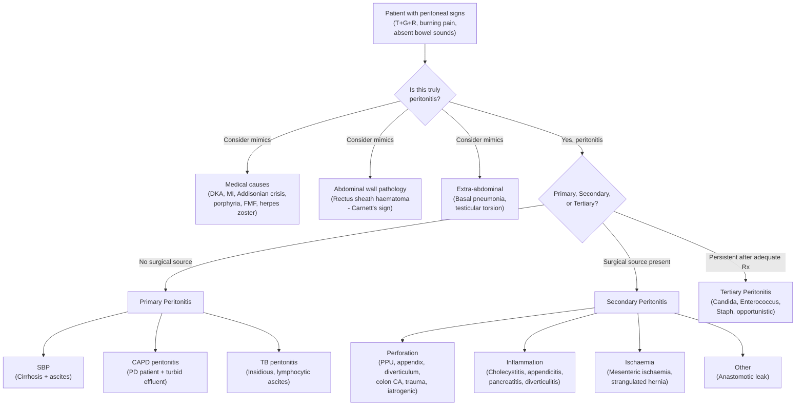

## Differential Diagnosis of Peritonitis

### Why Is the Differential Diagnosis of Peritonitis Important?

Peritonitis is not a single disease — it is a **clinical syndrome** (inflammation of the peritoneum) that can be caused by dozens of different conditions. When a patient presents with peritoneal signs (***tenderness, guarding, rebound***) [1], your job is twofold:

1. **Confirm peritonitis** — could the peritoneal signs be mimicked by something else (e.g., abdominal wall pathology, retroperitoneal disease, medical causes)?
2. **Identify the underlying cause** — because management differs dramatically (e.g., SBP = antibiotics alone vs. perforated viscus = emergency surgery).

The DDx is best approached systematically by thinking about **what can irritate the peritoneum** from first principles: (a) things that perforate/leak into the peritoneal cavity, (b) organs that inflame and involve the adjacent peritoneum, (c) primary peritoneal disease, and (d) "mimics" — conditions that look like peritonitis but aren't.

---

### Framework for Differential Diagnosis

I'll organize this in two layers:

**Layer 1 — Differentiating BETWEEN the causes of peritonitis** (i.e., once you know the peritoneum is inflamed, what's the aetiology?)

**Layer 2 — Differentiating peritonitis FROM its mimics** (i.e., conditions that present similarly but the peritoneum is not the primary problem)

---

### Layer 1: Causes of Peritonitis — Differential by Type

This is essentially the aetiological differential: "What caused the peritonitis?"

#### A. Primary Peritonitis

| Condition | Key Differentiating Features |
|---|---|
| ***Spontaneous bacterial peritonitis (SBP)*** | History of ***liver cirrhosis and ascites*** [1][2]. Fever, abdominal pain, altered mental status. Ascitic fluid PMN ≥ 250 cells/mm³, **monomicrobial** culture. **No** free gas on imaging. ***Risk factors: ascites, malnutrition, immunosuppression, CLD, CKD, splenectomy, intra-abdominal malignancy*** [1]. |
| ***Tuberculous peritonitis*** | ***Presentation may be non-specific: low-grade fever, weight loss, insidious onset of abdominal pain*** [1]. ***Peritoneal signs not florid*** [1]. Ascitic fluid is **lymphocyte-predominant** (not neutrophil-predominant like SBP), high protein ( > 2.5 g/dL), elevated ADA. ***AFB smear often negative; culture takes 4–6 weeks (could be falsely negative)*** [1]. ***Diagnosis often made by laparoscopy and biopsy of peritoneum*** [1]. HK context: intermediate TB burden, consider in immigrants/immunosuppressed. |
| ***CAPD-associated peritonitis*** | Patient on **peritoneal dialysis** with **turbid PD effluent**, abdominal pain ± fever [2]. PD fluid WBC ≥ 100/mm³ with > 50% PMN. Look for **exit-site infection** (erythema, discharge at catheter site). Organisms: coagulase-negative Staph (from skin), *S. aureus*, Gram-negatives [2]. |

<Callout title="SBP vs. Secondary Peritonitis in a Cirrhotic Patient — Critical Distinction" type="error">
Both can present identically in a cirrhotic patient with ascites. If you culture **multiple** organisms from the ascitic fluid, or if Runyon's criteria are met (protein > 1 g/dL, glucose < 50 mg/dL, LDH > ULN for serum [2]), think **secondary peritonitis** — this patient needs surgery, not just antibiotics. Missing a perforation in a cirrhotic is a classic fatal error.
</Callout>

#### B. Secondary Peritonitis — The Main Differentials

***Accounts for most peritonitis*** [1]. The differential here is essentially: **which organ has perforated, become ischaemic, or is severely inflamed?**

##### By Mechanism: Perforation

| Condition | Key Differentiating Features |
|---|---|
| **Perforated peptic ulcer (PPU)** | Sudden-onset severe epigastric pain → rapidly becomes diffuse. History of dyspepsia, NSAID/steroid use, *H. pylori*. ***Board-like rigidity*** (chemical peritonitis from gastric acid). **Free gas under diaphragm on erect CXR** is the classic finding. ***Chemical peritonitis preceded by bacterial peritonitis*** [1] — gastric acid initially sterile, secondary infection follows in 6–12 hours. |
| **Perforated appendicitis** | Initial periumbilical pain → migrating to RIF (the classic visceral → somatic shift). Fever, anorexia, nausea. McBurney's point tenderness, Rovsing's sign, psoas sign [5]. If perforation occurs → generalised peritonitis with diffuse tenderness and guarding. Peak age 20s–30s [2]. ***Grade 5: Perforated with diffuse peritonitis*** [2]. |
| **Perforated diverticulitis** | LIF pain (or RIF in ***Asian population with right-sided diverticular disease*** [2]). History of altered bowel habit, older age (mean 63 years [2]). CT: bowel wall thickening, pericolonic fat stranding ± free gas/fluid. ***Hinchey III = generalised purulent peritonitis; Hinchey IV = generalised faecal peritonitis*** [2][6]. |
| **Perforated colorectal cancer** | May present acutely with peritonitis. History of weight loss, altered bowel habit, PR bleeding, iron-deficiency anaemia. CT: mass lesion with perforation. ***Similar features to diverticulitis on imaging — CRC can only be excluded with colonoscopy after resolution of acute inflammation*** [2]. |
| ***Perforations of GI tract: spontaneous, trauma, iatrogenic*** | Post-colonoscopy perforation (iatrogenic), blunt/penetrating abdominal trauma, spontaneous perforation of stercoral ulcer in severe constipation [1]. |
| **Boerhaave syndrome** | Perforation of oesophagus (usually distal) after forceful vomiting. Severe chest/epigastric pain, subcutaneous emphysema, Hamman's sign (mediastinal crunch). Leads to mediastinitis ± peritonitis if perforation is below diaphragm. |

##### By Mechanism: Severe Inflammation

| Condition | Key Differentiating Features |
|---|---|
| ***Cholecystitis*** | RUQ pain, fever, Murphy's sign (+ve). Inflammatory process may remain localised or spread to involve the peritoneum (localised peritonitis → diffuse if perforated). USG: thickened GB wall, pericholecystic fluid, gallstones [1]. |
| ***Cholangitis*** | Charcot's triad: fever + jaundice + RUQ pain. Reynold's pentad adds hypotension + confusion (sepsis). Biliary obstruction → ascending infection. |
| ***Pancreatitis*** | Epigastric pain radiating to back, relieved by leaning forward. Markedly elevated serum amylase/lipase ( > 3× ULN). ***Could be preceded by chemical peritonitis*** [1] — pancreatic enzymes leak into the peritoneal cavity causing chemical irritation. Grey-Turner (flank ecchymosis) and Cullen (periumbilical ecchymosis) signs in severe haemorrhagic pancreatitis [5]. |
| ***Diverticulitis (uncomplicated)*** | LIF pain/tenderness, low-grade fever, altered bowel habit. ***Severe inflammation of abdominal organ*** causing localised peritoneal irritation without free perforation [1]. |
| ***Appendicitis (uncomplicated)*** | RIF pain, low-grade fever, anorexia. Localised peritonitis in RIF before perforation occurs [1]. |

##### By Mechanism: Ischaemia

| Condition | Key Differentiating Features |
|---|---|
| ***Ischaemic bowel (acute mesenteric ischaemia)*** | "Pain out of proportion to examination" in the early stages (visceral pain with minimal signs). Later → bowel infarction → full peritonitis with guarding, rigidity. Risk factors: AF (embolic), atherosclerosis, low-flow states. Markedly elevated lactate and metabolic acidosis. ***Ischaemia of abdominal organ e.g. bowel*** [1]. |
| **Strangulated / incarcerated hernia** | Irreducible, tender lump at hernia site (inguinal, femoral, incisional). Bowel within the hernia becomes ischaemic → gangrene → perforation → peritonitis. Features of intestinal obstruction (vomiting, distension, constipation) may coexist. |

##### By Mechanism: Other

| Condition | Key Differentiating Features |
|---|---|
| ***Anastomotic leakage*** | Post-operative patient (typically day 3–7 after bowel surgery). Sudden deterioration with fever, tachycardia, abdominal pain, peritoneal signs. Peritoneal fluid may be ***faeculent or bile-stained*** [1][3]. |

---

### Layer 2: Conditions That Mimic Peritonitis ("Pseudo-peritonitis")

These are critical because they can present with abdominal pain and even some degree of abdominal tenderness/guarding, but the peritoneum itself is NOT the primary site of pathology. Operating on these patients is either unnecessary or harmful.

#### Retroperitoneal Conditions

Retroperitoneal organs are NOT covered by peritoneum [3], so inflammation of these structures does not directly cause classical peritoneal signs — but the pain may be severe and can be confusing:

| Condition | How to Differentiate |
|---|---|
| **Ruptured AAA** | Sudden severe abdominal/back pain, hypotension, pulsatile abdominal mass. May mimic peritonitis with abdominal tenderness. CT angiography diagnostic. Ecchymosis signs (Grey-Turner, Cullen) overlap with severe pancreatitis [5]. |
| **Acute pancreatitis** | Retroperitoneal organ → signs may be less classical initially. Raised amylase/lipase ( > 3× ULN). Pain radiating to back. No free gas on CXR (distinguishes from PPU). |
| **Perinephric abscess / pyelonephritis** | Flank pain, fever, costovertebral angle tenderness. Pyuria and bacteriuria on urinalysis. CT: perinephric collection. |
| **Ureteric colic** | Severe colicky loin-to-groin pain. Restless patient (writhing, cannot stay still — opposite to peritonitis where patients lie still). Haematuria on dipstick. CT KUB diagnostic. |

#### Gynaecological Conditions (Critical DDx in Women of Reproductive Age)

These are extremely important — several of these present almost identically to appendicitis or pelvic peritonitis:

| Condition | How to Differentiate |
|---|---|
| ***Ruptured ectopic pregnancy*** | **Life-threatening**. Amenorrhoea + positive β-hCG + acute lower abdominal pain + haemodynamic instability. Free fluid on FAST USG. Always do a **pregnancy test** in any woman of reproductive age with acute abdominal pain [2]. |
| ***Pelvic inflammatory disease (PID)*** | Bilateral lower abdominal pain, fever, purulent vaginal discharge. Pain worsens during/shortly after menses or with coitus. **Cervical motion tenderness** ("chandelier sign") on bimanual examination [2]. |
| ***Tubo-ovarian abscess*** | Complication of PID. Inflammatory mass in adnexa. High fever, toxic. Can rupture → generalised peritonitis [2]. |
| ***Ruptured ovarian cyst*** | Sudden onset of unilateral lower abdominal pain, often during exercise or intercourse. May cause haemoperitoneum. Diagnosis: USG showing free fluid + collapsed cyst [2]. |
| ***Ovarian / fallopian tube torsion*** | Sudden severe unilateral pelvic pain, nausea/vomiting. Whirlpool sign on Doppler USG. Adnexal mass with absent blood flow [2]. |
| **Endometriosis / Endometrioma** | Cyclical pelvic pain, dysmenorrhoea, dyspareunia. Endometrioma rupture can cause chemical peritonitis (chocolate-coloured fluid). |

<Callout title="Golden Rule" type="error">
***Always do a pregnancy test (urine or serum β-hCG) in ANY woman of reproductive age presenting with acute abdominal pain.*** A ruptured ectopic pregnancy can kill within hours. This is the single most important "don't miss" diagnosis.
</Callout>

#### Medical Causes ("Non-Surgical Abdomen" Mimicking Peritonitis)

These are conditions where laparotomy is **not** indicated — operating on these patients causes harm:

| Condition | Why It Mimics Peritonitis | How to Differentiate |
|---|---|---|
| **Diabetic ketoacidosis (DKA)** | Severe abdominal pain (mechanism: gastric dilatation, mesenteric ischaemia from dehydration, metabolic irritation of peritoneum). Can cause guarding and even board-like rigidity. | Hyperglycaemia, ketonaemia, metabolic acidosis with high anion gap. History of type 1 DM or missed insulin. Kussmaul breathing, fruity breath. ABG diagnostic [4]. |
| **Acute MI (especially inferior)** | Inferior MI can refer pain to the epigastrium via diaphragmatic irritation (shared innervation T7–T9). | ECG, troponin. Risk factors for IHD. No peritoneal signs on careful examination. |
| **Addisonian crisis** | Severe abdominal pain, hypotension, vomiting. | Hyperkalaemia, hyponatraemia, hypoglycaemia. History of steroid use/withdrawal. Low random cortisol. |
| **Herpes zoster (shingles)** | Dermatome distribution of pain may precede the rash by days → can mimic peritonitis of the corresponding abdominal quadrant. | Unilateral, dermatomal. Vesicular rash eventually appears. |
| **Acute porphyria** | Severe colicky abdominal pain, neuropsychiatric symptoms, dark urine. | Urine porphobilinogen elevated. Young woman. |
| ***Hypercalcaemia*** | Abdominal pain, constipation, confusion ("bones, stones, groans, moans"). | Serum calcium elevated. PTH, malignancy workup. |
| **Sickle cell crisis** | Vaso-occlusive crisis can cause severe abdominal pain mimicking an acute abdomen. | Known sickle cell disease. Blood film, Hb electrophoresis. |
| **Familial Mediterranean Fever (FMF)** | Recurrent episodes of sterile peritonitis with fever, serositis. | Mediterranean ethnicity. Self-limiting episodes. Responds to colchicine. MEFV gene mutation. |

<Callout title="The 'Medical Abdomen' Trap" type="error">
DKA is the classic exam trap. A young patient with Type 1 DM presents with severe abdominal pain, vomiting, and abdominal rigidity — the surgical team is called for a "peritonitis." But checking a blood glucose and ABG reveals the diagnosis. Always check glucose and ABG in any patient with unexplained peritonitis. ***Fever, leucocytosis, acidosis, sepsis of unexplained cause*** in the elderly [1] could also be a medical abdomen — but equally could be masked surgical pathology, so maintain high suspicion.
</Callout>

#### Abdominal Wall Pathology

| Condition | How to Differentiate |
|---|---|
| **Rectus sheath haematoma** | Localized abdominal wall pain and mass. **Carnett's sign positive** (tenderness increases when patient tenses abdominal wall by lifting head — opposite to intra-abdominal pathology where tenderness decreases with tensing because the tensed muscle "protects" the viscera). History of anticoagulation, trauma, or vigorous coughing. CT diagnostic. |

#### Extra-abdominal Conditions

| Condition | How to Differentiate |
|---|---|
| **Lower lobe pneumonia / basal pleurisy** | Diaphragmatic irritation → referred upper abdominal pain. Cough, dyspnoea, pleuritic chest pain. CXR shows consolidation. |
| **Testicular torsion** | Acute scrotal pain may be referred to the lower abdomen. Always examine the scrotum in a young male with lower abdominal pain. |

---

### Systematic Approach — Decision Diagram

---

### Key Clinical Clues to Narrow the Differential

| Clinical Clue | Points Towards |
|---|---|
| **Free gas under diaphragm on erect CXR** | Perforated hollow viscus (PPU, perforated bowel) → **proceed to laparotomy** [3] |
| ***Bile-stained peritoneal fluid*** | Biliary perforation / GB injury [1][3] |
| ***Faeculent peritoneal fluid*** | Perforated colon [1][3] |
| ***↑ Amylase in peritoneal fluid*** | Pancreatitis or perforated duodenum/small bowel [1][3] |
| ***↑ Creatinine in peritoneal fluid*** | Bladder / urinary tract injury [1] |
| **Monomicrobial culture from ascitic fluid** | SBP (primary peritonitis) [1][2] |
| **Polymicrobial culture from ascitic fluid** | Secondary peritonitis (perforation/breach) [1][2] |
| **Lymphocyte-predominant ascitic fluid + high ADA** | TB peritonitis [1] |
| **Turbid PD effluent** in a PD patient | CAPD peritonitis [2] |
| **Positive β-hCG** | Ruptured ectopic pregnancy |
| **Cervical motion tenderness** | PID |
| **High anion gap metabolic acidosis + hyperglycaemia** | DKA (medical mimic) |
| **Pain out of proportion to examination** | Mesenteric ischaemia (early) |
| **Dermatomal pain pattern** | Herpes zoster |

---

### Special Consideration: Differentiating Diverticulitis from CRC

This is specifically highlighted in the senior notes [2] and worth emphasising:

- ***Similar clinical features and bowel wall thickening on abdominal CT scan*** [2]
- ***Features suggestive of acute diverticulitis*** include: ***presence of pericolonic and mesenteric inflammation, involvement of > 10 cm of colon, and absence of enlarged pericolonic lymph nodes on CT*** [2]
- ***CRC can only be excluded with colonoscopy after resolution of acute inflammation*** [2] — you should NEVER do a colonoscopy during the acute episode (risk of perforation)
- In Asian populations, ***right-sided diverticulitis is significantly more common*** and is ***OFTEN confused with acute appendicitis*** [2]

---

### Special Consideration: DDx of RIF Pain (Appendicitis vs. Everything Else)

Since appendicitis progressing to peritonitis is so common, and RIF pain has a broad differential [2]:

**GI**: Acute appendicitis, ***right-sided diverticulitis (more common in Asians)***, Meckel's diverticulitis, acute ileitis (*Yersinia, Campylobacter, Salmonella*), Crohn's disease, caecal carcinoma, mesenteric adenitis

**O&G**: ***Ruptured ectopic pregnancy, PID, tubo-ovarian abscess, ruptured ovarian cyst, ovarian/fallopian tube torsion, endometriosis*** [2]

**Urological**: Ureteric colic, UTI/pyelonephritis

**Other**: Strangulated inguinal/femoral hernia, psoas abscess

<Callout title="High Yield Summary — Differential Diagnosis of Peritonitis">

**Layer 1 — Causes of peritonitis (what's the aetiology?):**
- **Primary**: SBP (cirrhosis), CAPD peritonitis (PD patient), TB peritonitis (insidious, laparoscopic biopsy)
- **Secondary (most common)**: Perforation (PPU, appendix, diverticular, CRC, trauma), Inflammation (cholecystitis, appendicitis, pancreatitis, diverticulitis), Ischaemia (mesenteric ischaemia, strangulated hernia), Anastomotic leak
- **Tertiary**: Persistent despite adequate Rx — opportunistic organisms

**Layer 2 — Mimics of peritonitis:**
- **Medical**: DKA (classic trap!), inferior MI, Addisonian crisis, porphyria, herpes zoster, hypercalcaemia, sickle cell, FMF
- **Retroperitoneal**: Ruptured AAA, pancreatitis, perinephric abscess, ureteric colic
- **Gynaecological** (always pregnancy test!): Ruptured ectopic, PID, TOA, ovarian cyst rupture, torsion
- **Abdominal wall**: Rectus sheath haematoma (Carnett's sign)
- **Extra-abdominal**: Basal pneumonia, testicular torsion

**Key distinguishing clues**: Free gas = perforation → laparotomy. Bile-stained/faeculent fluid = perforated GI tract. Monomicrobial = primary. Polymicrobial = secondary. Lymphocytic + high ADA = TB. Turbid PD effluent = CAPD peritonitis. Positive β-hCG = ectopic. High AG metabolic acidosis = DKA.

</Callout>

---

<ActiveRecallQuiz
  title="Active Recall - Differential Diagnosis of Peritonitis"
  items={[
    {
      question: "A cirrhotic patient with ascites develops fever and abdominal pain. Ascitic fluid culture grows 3 different organisms. Is this SBP or secondary peritonitis, and why does the distinction matter?",
      markscheme: "This is secondary peritonitis, not SBP. SBP is monomicrobial; polymicrobial culture suggests a breach in the GI tract (e.g. perforation). The distinction matters because SBP is treated with antibiotics alone (3rd-gen cephalosporin), whereas secondary peritonitis requires surgical intervention. Runyon's criteria can further support secondary peritonitis: protein > 1 g/dL, glucose < 50 mg/dL, LDH > ULN for serum."
    },
    {
      question: "Name 3 medical (non-surgical) conditions that can mimic peritonitis and explain why DKA is the classic trap.",
      markscheme: "DKA, acute inferior MI, Addisonian crisis (also: porphyria, herpes zoster, hypercalcaemia, sickle cell crisis, FMF). DKA mimics peritonitis because severe metabolic derangement causes gastric dilatation, mesenteric ischaemia from dehydration, and metabolic irritation of the peritoneum, producing genuine abdominal tenderness and even board-like rigidity. Performing a laparotomy on a DKA patient is harmful; checking glucose and ABG reveals the diagnosis."
    },
    {
      question: "A 28-year-old woman presents with acute RIF pain, fever, and localised peritonitis. List 4 important differential diagnoses and state the single most important bedside test you must not forget.",
      markscheme: "DDx: Acute appendicitis, ruptured ectopic pregnancy, PID/tubo-ovarian abscess, ruptured ovarian cyst, right-sided diverticulitis (more common in Asians), ovarian torsion, ureteric colic. The single most important test is a urine pregnancy test (beta-hCG) to exclude ruptured ectopic pregnancy, which is life-threatening."
    },
    {
      question: "How do you differentiate TB peritonitis from SBP based on clinical presentation and peritoneal fluid analysis?",
      markscheme: "TB peritonitis: insidious onset, low-grade fever, weight loss, peritoneal signs not florid. Ascitic fluid is LYMPHOCYTE-predominant (vs. neutrophil-predominant in SBP), high protein > 2.5 g/dL, elevated ADA > 39 U/L. AFB smear often negative, culture takes 4-6 weeks and may be falsely negative. Diagnosis often requires laparoscopy and peritoneal biopsy showing caseating granulomata. SBP: acute onset, neutrophil-predominant ascites (PMN >= 250), usually in context of decompensated cirrhosis."
    },
    {
      question: "What peritoneal fluid findings indicate a perforated GI tract rather than primary peritonitis?",
      markscheme: "Bile-stained fluid (biliary perforation), faeculent fluid (colonic perforation), raised amylase (duodenal/small bowel perforation or pancreatitis), raised creatinine above serum level (bladder perforation). Also: polymicrobial culture, and Runyon's criteria positive (protein > 1 g/dL, glucose < 50 mg/dL, LDH > ULN)."
    }
  ]}
/>

## References

[1] Lecture slides: GC 195. Lower and diffuse abdominal pain RLQ problems; pelvic inflammatory disease; peritonitis and abdominal emergencies.pdf (p34–43)
[2] Senior notes: felixlai.md (Peritonitis section p738–743; Acute appendicitis DDx p728–729; Diverticulitis DDx p641; CAPD peritonitis p866; SBP p449–450)
[3] Senior notes: maxim.md (Section 2.5 Peritonitis; Acute abdomen DDx p44–46; Appendicitis p179; Diverticulitis p194)
[4] Senior notes: maxim.md (Acute abdomen DDx — medical causes: DKA, hypercalcaemia, herpes zoster, porphyria, p44)
[5] Senior notes: felixlai.md (Ruptured AAA DDx p910–911)
[6] Senior notes: felixlai.md (Hinchey classification p637)
