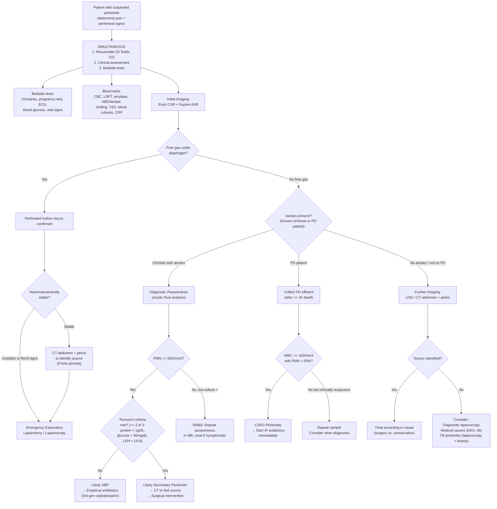

## Diagnostic Criteria

The diagnosis of peritonitis is fundamentally **clinical** — you see a sick patient with peritoneal signs and you act. However, to classify the *type* of peritonitis (primary vs. secondary) and guide the correct treatment pathway (antibiotics alone vs. surgery), you need specific diagnostic criteria for each subtype. Let me walk through each one and explain the logic behind every threshold.

---

### 1. Spontaneous Bacterial Peritonitis (SBP)

Diagnosis requires **ALL** of the following [2]:

| Criterion | Threshold | Rationale |
|---|---|---|
| Ascitic fluid PMN count | **≥ 250 cells/mm³** | PMNs (neutrophils) are the first-responders to bacterial infection. A count ≥ 250 is the validated cut-off that balances sensitivity and specificity for SBP. Why neutrophils specifically? Because they are recruited to the peritoneal cavity within hours of bacterial invasion, whereas lymphocytes predominate in TB or malignancy. |
| Peritoneal fluid culture | **Positive** | Confirms infection and identifies the organism. **Monomicrobial** — typically Gram-negative enterics (*E. coli*, *Klebsiella*) or Gram-positive cocci (*Streptococcus*, *Staphylococcus*) [1][2]. Culture must be inoculated into **blood culture bottles at the bedside** (not just sent in a plain pot) to improve yield — SBP has low bacterial density in ascitic fluid. |
| Secondary causes excluded | Must rule out surgically treatable source | If you miss a perforation and treat as SBP with antibiotics alone, the patient will die. Runyon's criteria (see below) help distinguish. |

#### Important Variants of SBP [2]

| Variant | PMN Count | Culture | Significance |
|---|---|---|---|
| **Classic SBP** | ≥ 250/mm³ | Positive | Treat with antibiotics |
| **Culture-negative neutrocytic ascites (CNNA)** | ≥ 250/mm³ | **Negative** | Almost certainly early SBP — **treat as SBP** anyway. Culture is negative because bacterial density is low. |
| **Non-neutrocytic bacterascites (NNBA)** | < 250/mm³ | **Positive** | May resolve spontaneously or progress to SBP. Repeat paracentesis in 48h. Treat only if symptomatic. |

<Callout title="Why is PMN ≥ 250 the threshold for SBP, not ≥ 500?">
The lecture slides state ***neutrophil count > 500/μL*** as a general peritoneal fluid marker for peritonitis [1]. However, for SBP specifically, the threshold is **PMN ≥ 250/mm³** [2] — this lower threshold was established because cirrhotic patients are immunosuppressed and mount a weaker inflammatory response. Waiting for PMN > 500 would miss early SBP and delay life-saving antibiotics. The PMN ≥ 250 cut-off has ~93% sensitivity.
</Callout>

---

### 2. CAPD-Associated Peritonitis

Diagnosis requires **at least 2 of 3** criteria [2]:

| Criterion | Threshold | Rationale |
|---|---|---|
| Clinical features | ***Abdominal pain or cloudy effluent*** ± fever | The turbidity of PD effluent is due to increased WBCs — this is often the **first sign** noticed by the patient before pain develops. ***Absence of fever does not exclude peritonitis since the infection can be localised or low-grade*** [2]. |
| PD fluid cell count | ***WBC ≥ 100 cells/mm³*** with ***PMN > 50%*** after **dwell time ≥ 2 hours** | Note this is LOWER than SBP threshold (100 vs. 250). ***The cutoff is lower because dextrose in PD solutions provides an excellent growth medium for bacteria*** — rapid proliferation means even a "low" count indicates significant infection [2]. The 2-hour dwell-time requirement standardises the count (shorter dwells may dilute cells). |
| PD effluent culture | **Positive** | Gram stain is positive in only ~40% of cases, so a negative Gram stain does NOT exclude infection. Effluent must be cultured (aerobic, anaerobic, AFB, fungal). |

<Callout title="Clinical Pearl" type="idea">
In CAPD peritonitis, ***do not wait for laboratory confirmation or culture result — start antibiotics as early as possible if the diagnosis is clinically certain, since delayed treatment carries a worse outcome*** [2]. This is because dextrose-containing PD fluid accelerates bacterial growth, and the peritoneal membrane becomes progressively damaged with ongoing infection, leading to fibrosis and eventual PD failure.
</Callout>

---

### 3. Secondary Bacterial Peritonitis (Distinguishing from SBP in a Cirrhotic Patient)

This uses **Runyon's criteria** — at least **2 of 3** in the ascitic fluid [2]:

| Criterion | Threshold | Why This Distinguishes Secondary from Primary |
|---|---|---|
| Total protein | **> 1 g/dL (10 g/L)** | In SBP, ascitic fluid protein is low (poor opsonic activity — this is WHY they get SBP in the first place). In secondary peritonitis, the perforation allows protein-rich intestinal/serum contents to flood the peritoneal cavity → high protein. |
| Glucose | **< 50 mg/dL (2.8 mmol/L)** | ***Neutrophils consume large amounts of glucose*** [2]. Secondary peritonitis has a much higher neutrophil and bacterial burden than SBP → more glucose consumed → lower glucose. In SBP, the ascitic fluid neutrophil count is lower (by comparison) and glucose remains relatively preserved. |
| LDH | **> Upper limit of normal for serum** | LDH is released from dying cells. In secondary peritonitis, there is massive tissue destruction (from perforation, ischaemia) → ***↑↑↑ LDH*** [2]. In SBP, LDH is only mildly elevated. |

**Additional clues for secondary peritonitis** (not part of Runyon's criteria but highly useful):
- **Polymicrobial** culture (vs. monomicrobial in SBP) [1][2]
- ***Amylase level ↑*** — suggests pancreatitis or gut perforation (***every segment of gut except gallbladder leaks amylase into fluid when it perforates*** [2])
- ***Bilirubin level ↑*** — suggests ***perforation of gallbladder into peritoneum*** (measured if fluid is ***dark orange or brown*** [2])

### Summary Comparison Table: SBP vs. Secondary Peritonitis Ascitic Fluid

| Parameter | SBP | Secondary Peritonitis |
|---|---|---|
| Organisms | ***Monomicrobial*** | ***Polymicrobial*** |
| PMN count | ≥ 250/mm³ | Often much higher |
| Protein | ***↓ (Low)*** — reflects poor opsonic activity [2] | ***↑ (High)*** — protein-rich GI contents leak in |
| Glucose | ***↑ (Relatively preserved)*** — fewer neutrophils consuming it [2] | ***↓ (Low < 50 mg/dL)*** — massive neutrophil/bacterial consumption |
| LDH | ***↑ (Mildly elevated)*** [2] | ***↑↑↑ (Markedly elevated)*** — tissue destruction [2] |
| Amylase | Normal | ***↑↑↑*** if gut perforation or pancreatitis [1][2] |
| Bilirubin | Normal | ***↑*** if GB perforation [2] |

<Callout title="Exam Pearl: The Logic Behind SBP vs. Secondary" type="error">
Think of it this way: SBP = bacteria are "tourists" that translocated into a fluid with poor defences. There aren't many of them, they don't destroy tissue, and the fluid hasn't been contaminated by GI contents → monomicrobial, low protein, preserved glucose, mildly raised LDH. Secondary peritonitis = a pipe has burst — GI contents (protein, bacteria, amylase, bile) flood the peritoneal cavity, massive neutrophil recruitment consumes glucose, tissue dies releasing LDH → polymicrobial, high protein, low glucose, very high LDH.
</Callout>

---

## Investigation Modalities

Investigations for peritonitis serve three purposes: (1) **confirm peritonitis**, (2) **identify the cause**, and (3) **assess severity/guide resuscitation**. I'll organise these by modality.

### A. Bedside Tests

| Investigation | Key Findings | Rationale / Interpretation |
|---|---|---|
| ***Urinalysis*** | Sterile pyuria (in diverticulitis/appendicitis adjacent to ureter), haematuria (ureteric colic), nitrites/leucocytes (UTI) | Sterile pyuria can occur from peritoneal inflammation irritating the adjacent ureter — don't be fooled into diagnosing UTI [1]. |
| ***Pregnancy test (urine β-hCG)*** | Positive → ruptured ectopic pregnancy | ***Must be done in ANY woman of reproductive age*** with acute abdominal pain [1][3]. A positive test completely changes your differential and management. |
| ***ECG*** | ST changes, arrhythmias | ***Rule out acute MI*** [3] — especially inferior MI which can mimic upper abdominal peritonitis via diaphragmatic irritation. Also check for AF (risk factor for mesenteric ischaemia). |

### B. Blood Tests

***Blood tests: CBC, LRFT, amylase, ABG, clotting, T&S*** [3]

| Investigation | Key Findings | Rationale / Why Order It |
|---|---|---|
| ***CBC with differentials*** | **Leukocytosis** (raised WCC with neutrophilia) [2] | The systemic inflammatory response to peritoneal infection drives bone marrow neutrophil release. In the elderly, ***leucocytosis*** may be the only clue to peritonitis when peritoneal signs are mild [1]. A **left shift** (bandaemia — immature neutrophils) suggests severe/acute infection. Leucopaenia is ominous (marrow exhaustion in overwhelming sepsis). |
| ***LFT*** | Deranged bilirubin, ALT, AST, ALP, GGT | ***Sepsis can lead to deranged liver function*** [2] — "septic liver" (cholestatic pattern from intrahepatic bile duct dysfunction due to endotoxins). Also baseline assessment in cirrhotic patients. Raised bilirubin + ALP may point to cholangitis as the cause. |
| ***RFT (renal function)*** | Raised urea and creatinine | ***Hypovolaemia leads to acute kidney injury*** [2] — pre-renal AKI from third-space losses. Also baseline for patients on nephrotoxic antibiotics (aminoglycosides). Raised urea out of proportion to creatinine suggests upper GI bleeding (urea from digested blood). |
| ***Serum amylase / lipase*** | Elevated ( > 3× ULN in pancreatitis) [2] | Pancreatitis as the cause of peritonitis. Also mildly raised in bowel ischaemia, perforated ulcer, and small bowel obstruction. **Lipase is more specific** than amylase for pancreatic pathology. |
| ***Serum protein / albumin*** | Hypoalbuminaemia | Massive protein loss into the peritoneal cavity (third-spacing). Also baseline for SAAG calculation in ascitic patients. |
| ***ABG with lactate*** | Metabolic acidosis, raised lactate | Raised lactate indicates tissue hypoperfusion (shock) or **bowel ischaemia** — a lactate > 2 mmol/L in the context of abdominal pain is a red flag for mesenteric ischaemia. Metabolic acidosis also seen in DKA (the medical mimic) [3]. |
| ***Clotting profile (PT, APTT)*** | Prolonged PT/APTT | ***Obtain baseline before endoscopic and surgical procedures*** [2]. Cirrhotic patients have impaired synthetic function → coagulopathy. DIC can develop in severe sepsis. |
| ***Type and screen*** | Blood group and antibody screen | ***Obtain baseline before endoscopic and surgical procedures*** [2]. In case emergency surgery is needed, blood must be available for transfusion. |
| ***CRP*** | Elevated | Non-specific inflammatory marker. Useful for monitoring treatment response. A CRP that fails to fall after treatment suggests uncontrolled source (abscess, ongoing leak). |
| ***Blood glucose*** | Hyperglycaemia (DKA, stress response) or hypoglycaemia (sepsis, liver failure) | Excludes DKA as a mimic. In CAPD peritonitis, ***infection will induce hyperglycaemia*** [2]. |
| ***Blood cultures*** | Organism identification | Must be taken **before** starting antibiotics. Aerobic + anaerobic bottles. Positive in ~30–50% of SBP. |

### C. Peritoneal Fluid Analysis

This is the **cornerstone investigation** for primary peritonitis (SBP and CAPD). For secondary peritonitis, peritoneal fluid is often obtained intra-operatively rather than pre-operatively.

***Ascitic fluid analysis by paracentesis*** [2]

***Peritoneal fluid analysis*** [1]:

| Component | What to Look For | Interpretation |
|---|---|---|
| ***Character*** | ***Serous, blood-stained, purulent, bile-stained, faeculent*** [1] | Serous = SBP or early infection. Purulent = established bacterial peritonitis. ***Bile-stained = perforated GB or biliary injury***. ***Faeculent = perforated bowel***. Blood-stained = trauma, malignancy, haemorrhagic pancreatitis. ***↑ Amylase / bile-stained / faeculent indicates perforated GI tract*** [3]. |
| ***Cell count and differentials*** | ***Neutrophil count > 500/μL*** [1]; PMN ≥ 250/mm³ for SBP [2]; WBC ≥ 100/mm³ with PMN > 50% for CAPD [2] | ***PMN ≥ 250 cells/mm³ should be started on empirical therapy while awaiting culture results*** [2]. Lymphocyte predominance → TB peritonitis or malignancy. |
| ***Gram stain*** | Bacterial morphology | Quick but **low sensitivity** (~25% in SBP because bacterial density is low). Useful if positive (e.g., Gram-positive cocci in chains → Streptococcus). |
| ***Cultures*** | ***Aerobic, anaerobic, AFB, fungal*** [1] | Definitive identification. Inoculate into blood culture bottles at bedside. Monomicrobial = SBP; polymicrobial = secondary peritonitis. ***AFB culture takes 4–6 weeks and could be falsely negative*** [1]. |
| ***Albumin level*** | Calculate SAAG | ***Serum-ascites albumin gradient (SAAG) = serum albumin − ascitic albumin*** (***difference but NOT ratio*** [2]). ***SAAG > 1.1 g/dL = portal hypertension*** → SBP likely. ***SAAG < 1.1 g/dL = NO portal hypertension*** → think TB, malignancy, nephrotic syndrome [2]. |
| ***Protein level*** | High vs. low | ***↑ Protein in secondary bacterial peritonitis; ↓ Protein in SBP*** [2]. Low protein in SBP reflects ***low opsonin activity (molecules that facilitate phagocytosis by macrophages) and patients are more prone to SBP*** [2]. |
| ***Glucose*** | High vs. low | ***↑ Glucose in SBP; ↓ Glucose ( < 50 mg/dL) in secondary peritonitis*** [2]. Why? ***Neutrophils consume large amounts of glucose*** — secondary peritonitis has far more neutrophils → more consumption [2]. |
| ***LDH*** | Mildly vs. markedly elevated | ***↑ LDH in SBP; ↑↑↑ LDH in secondary peritonitis*** [2]. Reflects degree of tissue destruction. |
| ***Amylase*** | Elevated | ***↑ Amylase suggests pancreatitis or gut perforation — every segment of gut except gallbladder leaks amylase into fluid when it perforates*** [2]. |
| ***Bilirubin*** | Elevated | ***↑ Bilirubin suggests perforation of gallbladder into peritoneum — measured if the ascitic fluid is dark orange or brown*** [2]. |
| ***Creatinine*** | Higher than serum | Ascitic creatinine > serum creatinine → bladder perforation / urinary leak [1]. |
| ***ADA (Adenosine deaminase)*** | Elevated ( > 39 U/L) | ***↑ ADA level in tuberculosis infection*** [2]. ADA is a ***purine-degrading enzyme necessary for maturation and differentiation of lymphoid cells*** [2] — elevated because TB triggers a vigorous lymphocytic response. |
| ***Cytology*** | Malignant cells | ***Positive in < 10% of malignant ascites*** (poor sensitivity, ***in contrast with pleural fluid cytology with 70% chance of detection in malignant pleural effusion***) [2]. |

### D. Imaging

***Imaging: ECG, Erect CXR, erect/supine AXR, USG, CT A+P*** [3]

| Modality | Key Findings | Rationale / When to Use |
|---|---|---|
| ***Erect CXR*** | **Free gas (pneumoperitoneum) under the diaphragm** | The single most important initial imaging investigation in suspected perforated viscus. Free gas = hollow viscus perforation (PPU, perforated bowel). ***Look for free gas under diaphragm*** [2]. Also detects basal pneumonia (mimic), pleural effusion (reactive). As little as 1 mL of free gas can be detected on erect CXR. **Must be erect for ≥ 10 minutes** before shooting to allow gas to rise. |
| ***Erect and supine AXR*** | ***Dilated bowels in intestinal obstruction*** [2]; air-fluid levels; radio-opaque calculi; loss of psoas shadow (retroperitoneal pathology) | Supine AXR shows bowel gas pattern and distribution. Erect AXR shows **air-fluid levels**. Dilated small bowel ( > 3 cm) or large bowel ( > 6 cm, caecum > 9 cm) suggests obstruction. Free gas may also be seen on supine AXR as Rigler's sign (gas on both sides of bowel wall). |
| ***USG abdomen*** | Free fluid (Morison's pouch), gallstones, thickened GB wall, appendiceal diameter > 6 mm, adnexal pathology, abscess | ***Evaluation of acute cholecystitis, appendicitis and gynaecological infections*** [2]. **First-line for RUQ pain** (biliary) and **suprapubic pain** (gynae/urological) [3]. FAST scan in trauma to detect haemoperitoneum. Can detect as little as 200 mL of free fluid in Morison's pouch. |
| ***CT abdomen + pelvis (with IV contrast)*** | Free gas, free fluid, bowel wall thickening, fat stranding, abscess collections, mesenteric vessel occlusion, appendiceal inflammation | **Gold standard** for secondary peritonitis — identifies the source. CT is particularly useful for diverticulitis (***CT scan helps to confirm diagnosis and assess severity*** [1]), appendicitis, and detecting intra-abdominal abscesses. Can guide **percutaneous drainage**. CT angiography for mesenteric ischaemia. CT with IV contrast is **first-line for RLQ and LLQ pain** [3]. |
| ***Colonoscopy*** | Mucosal pathology, stricture, tumour, colitis | ***Look for bowel ischaemia*** [2]. Used **after** resolution of acute inflammation to exclude CRC or IBD. ***AVOID endoscopy for acute abdomen — sealed-off perforation may open by gas insufflation during endoscopy*** [3]. |
| **Diagnostic laparoscopy** | Direct visualisation of peritoneal cavity | Used when diagnosis remains uncertain despite imaging. ***Diagnosis of TB peritonitis is often made by laparoscopy and biopsy of peritoneum*** [1]. Also therapeutic — can perform lavage, take biopsies, and even definitive surgery (appendicectomy, PPU repair). |

<Callout title="When NOT to Image — Go Straight to Theatre" type="error">
***Proceed to exploratory laparotomy if free gas / florid peritoneal signs*** [3]. If a patient has generalised peritonitis with haemodynamic instability, spending hours on CT delays definitive treatment. The surgical dictum: "If the clinical picture says operate, operate. CT is for when you're not sure."
</Callout>

---

## Diagnostic Algorithm

The clinical approach follows a logical sequence: **resuscitate → clinical assessment → bedside tests → blood tests → imaging → peritoneal fluid analysis → decide: operate or treat medically**.

### Step-by-Step Walkthrough

**Step 1 — Resuscitate and Assess Simultaneously**

You never wait for investigation results before starting resuscitation. A patient with peritonitis is losing fluid into the peritoneal cavity (third-spacing) and may be septic. ***IV fluid replacement, nasogastric tube, urinary catheter, oxygen*** [1] should be started immediately while you take the history, examine, and order tests.

**Step 2 — Bedside Tests**

- ***Urinalysis*** — excludes UTI, detects haematuria (ureteric colic), sterile pyuria (peri-ureteric inflammation) [1]
- ***Pregnancy test*** — mandatory in reproductive-age women [1]
- ***ECG*** — excludes inferior MI [3]
- **Blood glucose** — excludes DKA

**Step 3 — Blood Tests**

***Blood count, renal and liver function, amylase, clotting profile, arterial blood gas, type and screen*** [1][3]. Blood cultures before antibiotics. The ABG with lactate is critical — a raised lactate > 2 mmol/L suggests tissue hypoperfusion or bowel ischaemia.

**Step 4 — Initial Imaging (Erect CXR + AXR)**

***Erect CXR*** is the first imaging — looking for free gas. If present, you have a perforated viscus and may proceed directly to surgery. ***Erect and supine AXR*** — look for dilated bowels (obstruction), air-fluid levels, calculi.

**Step 5 — Decision Point: Free Gas?**

If **free gas + florid peritoneal signs** → ***proceed to exploratory laparotomy*** [3]. Do NOT delay with further imaging in an unstable patient.

If **no free gas** but peritoneal signs present → further investigation needed to identify the source.

**Step 6 — Further Imaging / Fluid Analysis**

- **Cirrhotic with ascites**: Diagnostic **paracentesis** → ascitic fluid analysis (cell count, culture, protein, glucose, LDH, albumin for SAAG, ± amylase/bilirubin/ADA/cytology) [2]
- **PD patient**: Collect **PD effluent** for cell count + culture [2]
- **All others**: ***USG abdomen*** for RUQ/pelvic pathology; ***CT abdomen + pelvis with contrast*** for most other scenarios [1][2][3]
- If diagnosis remains elusive: **diagnostic laparoscopy** [1]

**Step 7 — Classify and Treat**

Based on the above, classify as primary (SBP/CAPD/TB) vs. secondary (surgical source) vs. tertiary (persistent/opportunistic) and institute appropriate management.

---

### Investigation Selection by Site of Pain

This is a practical guide from the clinical approach [3]:

| ***Site of Pain*** | ***Imaging of Choice*** |
|---|---|
| **RUQ** | ***USG*** (biliary pathology — cholecystitis, choledocholithiasis) |
| **LUQ** | ***CT*** (splenic pathology, pancreatitis) |
| **RLQ** | ***CT with IV contrast*** (appendicitis, right-sided diverticulitis, Crohn's) |
| **LLQ** | ***CT with IV contrast*** (left-sided diverticulitis, sigmoid pathology) |
| **Suprapubic** | ***USG (TAS or TVS)*** (gynaecological, bladder pathology) |
| **Diffuse** | ***Erect CXR first***, then ***CT abdomen + pelvis*** if no free gas [3] |

---

### Special Investigation Scenarios

#### TB Peritonitis

***Peritoneal fluid: AFB smear often negative, culture would take 4–6 weeks (could be falsely negative)*** [1]. This makes diagnosis challenging. Key investigations:
- Ascitic fluid: **Lymphocyte-predominant**, high protein ( > 2.5 g/dL), ***↑ ADA level*** [2], low SAAG ( < 1.1 g/dL)
- ***Diagnosis often made by laparoscopy and biopsy of peritoneum*** [1] — looking for caseating granulomata and "millet seed" tubercles studding the peritoneal surface
- Interferon-gamma release assay (IGRA) / Mantoux can support but not confirm peritoneal TB
- PCR for *M. tuberculosis* DNA in ascitic fluid — increasing role

#### Diverticulitis-Related Peritonitis

***CT scan helps to confirm diagnosis and assess the severity*** [1]. CT findings include:
- Colonic diverticula, localised bowel wall thickening ( > 4 mm), pericolonic fat stranding
- Abscess (fluid collection with air/debris), free gas (perforation), fistula tracks
- ***Hinchey classification*** applied based on CT findings to guide management [6]

---

<Callout title="High Yield Summary — Diagnostics">

**Diagnostic Criteria:**
- **SBP**: PMN ≥ 250/mm³ + positive culture + secondary causes excluded. SAAG > 1.1 = portal hypertension → SBP likely. Monomicrobial.
- **CAPD peritonitis**: Clinical features (pain/cloudy effluent) + WBC ≥ 100/mm³ with PMN > 50% (dwell ≥ 2h) + positive culture. Lower threshold than SBP due to dextrose-enhanced bacterial growth.
- **Secondary peritonitis (Runyon's)**: ≥ 2 of: protein > 1 g/dL, glucose < 50 mg/dL, LDH > ULN. Polymicrobial. Needs surgery.

**Key Investigations:**
- Bedside: Urinalysis, pregnancy test, ECG, glucose
- Bloods: CBC, LRFT, amylase, ABG/lactate, clotting, T&S, blood cultures
- Imaging: Erect CXR (free gas!) + AXR → USG or CT A+P
- Peritoneal fluid: Character, cell count, Gram stain, cultures (aerobic/anaerobic/AFB/fungal), albumin (SAAG), protein, glucose, LDH, amylase, bilirubin, creatinine, ADA, cytology

**Decision Rule**: Free gas on erect CXR + florid peritoneal signs → exploratory laparotomy (do NOT delay with further imaging).

**SBP vs. Secondary**: SBP = monomicrobial, low protein, preserved glucose, mildly raised LDH. Secondary = polymicrobial, high protein, low glucose, very high LDH.

</Callout>

---

<ActiveRecallQuiz
  title="Active Recall - Diagnosis and Investigations of Peritonitis"
  items={[
    {
      question: "State the diagnostic criteria for SBP and explain why the PMN threshold is 250/mm3 rather than 500/mm3.",
      markscheme: "SBP requires ALL of: (1) Ascitic fluid PMN >= 250 cells/mm3, (2) Positive peritoneal fluid culture, (3) Secondary causes excluded. The threshold is lower at 250 (not 500) because cirrhotic patients are immunosuppressed and mount a weaker inflammatory response; waiting for 500 would miss early SBP and delay life-saving antibiotics. The 250 cut-off has ~93% sensitivity."
    },
    {
      question: "Why is the WBC threshold for CAPD peritonitis (100/mm3) lower than for SBP (250/mm3)?",
      markscheme: "PD fluid contains dextrose which provides an excellent growth medium for bacteria, leading to rapid bacterial proliferation. Even a lower WBC count indicates significant infection in this environment. Without antibiotic therapy, bacteria multiply quickly in the dextrose-rich PD fluid, so a lower threshold ensures early detection."
    },
    {
      question: "A cirrhotic patient with ascites develops peritonitis. Ascitic fluid shows: protein 1.5 g/dL, glucose 30 mg/dL, LDH above ULN, polymicrobial culture. Is this SBP or secondary peritonitis? Justify using Runyon's criteria.",
      markscheme: "This is secondary peritonitis. Runyon's criteria met (all 3 of 3, need >= 2): protein > 1 g/dL (1.5), glucose < 50 mg/dL (30), LDH > ULN. Additionally polymicrobial culture confirms secondary peritonitis. This patient needs CT to identify source and likely surgical intervention, not just antibiotics."
    },
    {
      question: "What does a SAAG > 1.1 g/dL indicate and how is it calculated? What does SAAG < 1.1 indicate?",
      markscheme: "SAAG = Serum albumin minus ascitic fluid albumin (difference, NOT ratio). SAAG > 1.1 g/dL indicates portal hypertension (cirrhosis, heart failure, Budd-Chiari) and thus SBP is a likely cause of peritonitis. SAAG < 1.1 indicates no portal hypertension - think TB peritonitis, malignancy, nephrotic syndrome, pancreatic ascites."
    },
    {
      question: "When should you proceed directly to exploratory laparotomy without further imaging in suspected peritonitis?",
      markscheme: "When there is free gas under the diaphragm on erect CXR AND/OR florid peritoneal signs (diffuse tenderness, guarding, rigidity, rebound) with haemodynamic instability. Do not delay with CT or other imaging in an unstable patient with clear signs of perforated viscus and generalised peritonitis."
    },
    {
      question: "List 3 ascitic fluid findings that specifically point to a perforated GI tract rather than SBP.",
      markscheme: "(1) Raised amylase - every segment of gut except gallbladder leaks amylase when perforated; also pancreatitis. (2) Bile-stained fluid - suggests gallbladder/biliary perforation. (3) Faeculent fluid - perforated bowel (colonic). Also: raised bilirubin (dark orange/brown fluid = GB perforation), polymicrobial culture, Runyon's criteria positive (high protein, low glucose, high LDH)."
    }
  ]}
/>

## References

[1] Lecture slides: GC 195. Lower and diffuse abdominal pain RLQ problems; pelvic inflammatory disease; peritonitis and abdominal emergencies.pdf (p12, p19, p34–43)
[2] Senior notes: felixlai.md (Peritonitis diagnosis section p740–742; Ascitic fluid analysis p740–741, p448–449; SBP diagnosis and variants p449–450; CAPD peritonitis diagnostic criteria p866–867; Case study p743)
[3] Senior notes: maxim.md (Section 2.5 Peritonitis p46; Acute abdomen investigations p45; Imaging by site of pain p45)
[6] Senior notes: felixlai.md (Hinchey classification p637)
