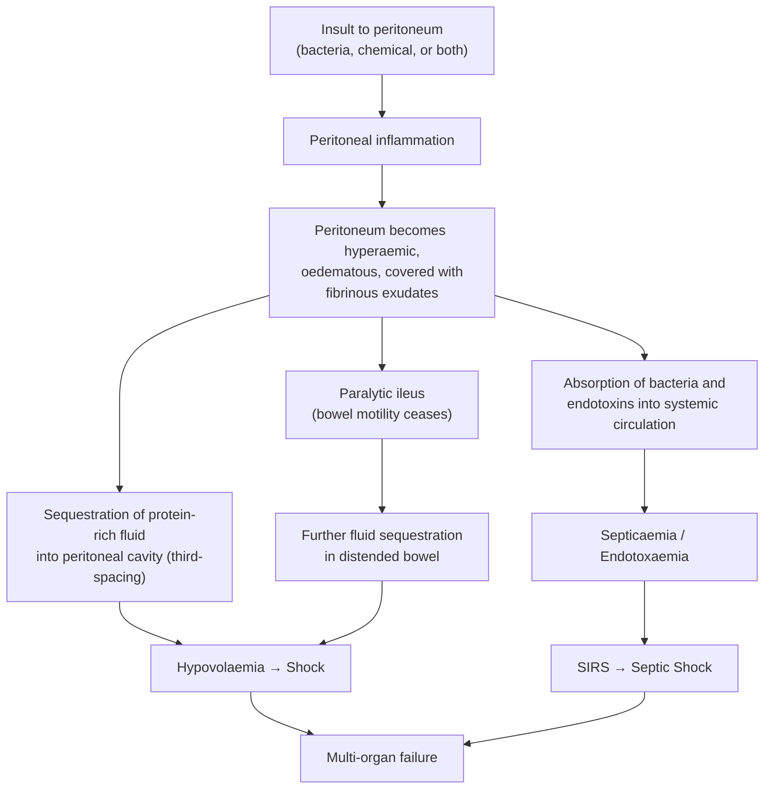
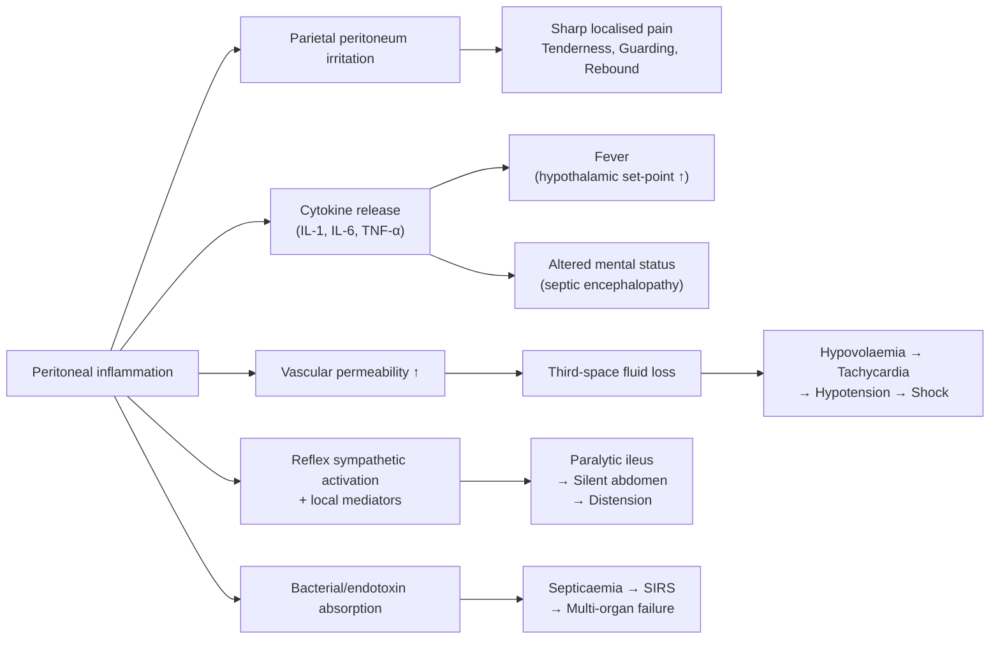

## Definition

***Peritonitis*** refers to **inflammation of the peritoneum** — the serous membrane lining the abdominal cavity and covering the abdominal viscera [1][2][3]. The word itself breaks down from Greek: *"peri"* = around, *"tonaion"* = stretched (referring to the membrane), *"-itis"* = inflammation. So literally: inflammation of the membrane stretched around the abdominal contents.

It is ***one of the commonest surgical emergencies*** [1][2] and can rapidly become life-threatening. When the peritoneum is inflamed, it becomes ***oedematous, hyperaemic, and covered with fibrinous exudates*** [1][2]. This triggers a cascade of ***sequestration of large amounts of protein-rich fluid*** into the peritoneal cavity (third-spacing), leading to ***septicaemia, endotoxaemia, hypovolaemia and shock*** [1][2]. Left unchecked, this progresses to multi-organ failure and death.

<Callout title="Why is peritonitis so dangerous?">
The peritoneum has an enormous surface area (~1.7 m², roughly equal to skin surface area). When inflamed, massive fluid shifts occur across this membrane into the peritoneal cavity ("third-space losses"). Simultaneously, bacteria and endotoxins are absorbed through the highly vascular peritoneal surface into the systemic circulation. This combination of hypovolaemia + sepsis is what kills patients.
</Callout>

---

## Epidemiology and Risk Factors

### Epidemiology

- Peritonitis is a leading cause of emergency surgical admissions worldwide.
- **Spontaneous bacterial peritonitis (SBP)** affects approximately 10–30% of hospitalized patients with cirrhotic ascites — highly relevant in Hong Kong given the prevalence of hepatitis B-related cirrhosis.
- **CAPD-associated peritonitis** is the leading cause of technique failure in peritoneal dialysis patients. Hong Kong has one of the highest rates of peritoneal dialysis utilization globally (>70% of dialysis patients are on PD), making this a particularly high-yield topic locally.
- Secondary peritonitis from perforated peptic ulcer (PPU), perforated appendicitis, and perforated diverticular disease constitutes the bulk of emergency surgical peritonitis cases.
- ***In the elderly***, peritonitis is particularly dangerous because they are ***poor historians, may be confused or have dementia***, ***history may be inaccurate (rely on care-provider)***, and ***peritoneal signs may be mild*** [1]. This demands a ***high index of suspicion*** in any elderly patient with ***abdominal pain, abdominal distension, fever, leucocytosis, acidosis, or sepsis of unexplained cause*** [1].

### Risk Factors

The following are established risk factors for developing peritonitis [1][2]:

| Risk Factor | Mechanism |
|---|---|
| ***Ascites*** | Stagnant ascitic fluid provides an excellent culture medium; impaired peritoneal immune defences |
| ***Chronic liver disease / cirrhosis*** | Portal hypertension → ascites; impaired reticuloendothelial system (Kupffer cell dysfunction); decreased complement in ascitic fluid; bacterial translocation from gut |
| ***Malnutrition*** | Impaired immune function (reduced immunoglobulin, complement, and cell-mediated immunity) |
| ***Intra-abdominal malignancy*** | Tumour necrosis creates a nidus for infection; obstruction may lead to perforation; immunosuppression from cancer itself or chemotherapy |
| ***Chronic renal disease*** | Uraemic immunosuppression; PD catheter as a portal of entry |
| ***Immunosuppression*** | Steroids, chemotherapy, HIV — all reduce the ability to contain peritoneal infection |
| ***Splenectomy*** | Loss of splenic filtration function → susceptibility to encapsulated organisms (e.g., *Streptococcus pneumoniae*) |

<Callout title="Hong Kong Context" type="idea">
In HK, the particularly relevant causes of peritonitis include: (1) SBP in hepatitis B cirrhosis patients, (2) CAPD peritonitis given the high PD utilization, (3) perforated peptic ulcer (H. pylori + NSAID use in the aging population), and (4) perforated appendicitis / diverticulitis. TB peritonitis also remains relevant given Hong Kong's intermediate TB burden.
</Callout>

---

## Anatomy and Function of the Peritoneum

Understanding peritoneal anatomy is essential to understanding patterns of fluid collection, infection spread, and surgical approach.

### Structure

The peritoneum is a continuous serous membrane consisting of:
- **Parietal peritoneum**: Lines the inner surface of the abdominal and pelvic walls. Innervated by **somatic nerves** (intercostal nerves T7–T12, subcostal, iliohypogastric, ilioinguinal) → produces **sharp, well-localised pain** when inflamed.
- **Visceral peritoneum**: Covers the abdominal viscera. Innervated by **autonomic (visceral) nerves** → produces **dull, poorly-localised, midline pain** when inflamed.

This dual innervation explains a classic clinical pattern: early visceral peritoneal irritation (e.g., early appendicitis) causes vague periumbilical pain, but once the parietal peritoneum is involved, pain becomes sharp and localised to the right iliac fossa.

### Key Peritoneal Spaces

Knowing peritoneal spaces helps you predict where fluid/pus collects:

- ***Morison's pouch (hepatorenal recess)***: The most dependent part of the peritoneal cavity in a supine patient. This is where you look for free fluid on **FAST ultrasound** [3].
- **Right and left subphrenic spaces**: Subdiaphragmatic abscesses collect here (e.g., post-splenectomy, perforated peptic ulcer).
- **Right and left paracolic gutters**: The right paracolic gutter communicates directly with the pelvis and the right subphrenic space — this is why a perforated appendix can cause a right subphrenic abscess (pus tracks up the right paracolic gutter).
- **Left infra-mesocolic and right infra-mesocolic spaces**: Divided by the root of the small bowel mesentery.
- **Pelvis (pouch of Douglas / rectovesical pouch)**: The most dependent part when the patient is upright. Digital rectal examination can detect pelvic peritonitis as tenderness or a boggy mass here.

### Retroperitoneal Organs (NOT covered by peritoneum — important for differential)

These structures, when inflamed, do **not** cause classical peritoneal signs initially [3]:
- ***Kidneys, adrenals, ureters***
- ***Aorta / IVC***
- ***Duodenum (D2, D3), ascending and descending colon***
- ***Pancreas (except the tail)***

<Callout title="Clinical Pearl" type="idea">
A ruptured AAA or acute pancreatitis can mimic peritonitis but may lack classical peritoneal signs initially because these are retroperitoneal structures. However, if pancreatic enzymes or blood leaks into the peritoneal cavity, secondary peritoneal irritation occurs.
</Callout>

### Function of the Peritoneum

1. **Friction reduction**: Mesothelial cells secrete a thin layer of serous fluid (~50–100 mL) that lubricates visceral surfaces.
2. **Immune defence**: Contains macrophages, lymphocytes, and mast cells; the omentum ("policeman of the abdomen") migrates to sites of inflammation to wall off infection.
3. **Fluid and solute exchange**: The large surface area (~1.7 m²) allows significant absorption — this is why peritoneal dialysis works, but also why toxins/bacteria are rapidly absorbed systemically.
4. **Support and compartmentalization**: Mesenteries and ligaments suspend organs and create compartments that can temporarily localise infection.

---

## Etiology

### Classification-Based Approach to Etiology

***Peritonitis is classified in different ways*** [1][2]:
- ***Localized vs. generalized (diffuse)*** — based on extent
- ***Bacterial vs. chemical*** — based on etiology
- ***Primary vs. secondary vs. tertiary*** — based on source

This last classification is the most clinically useful and exam-relevant:

### 1. Primary Peritonitis

> **Definition**: ***Ascitic fluid infection without a surgically treatable intra-abdominal source of infection*** [1][2][3]

The infection reaches the peritoneum via **haematogenous spread**, **lymphatic spread**, or **transmural migration (bacterial translocation)** from the gut — there is NO perforation or breach in the GI tract.

***Usually monomicrobial*** [1][2]

#### a) Spontaneous Bacterial Peritonitis (SBP)

- **Who gets it**: Patients with ***cirrhosis and ascites*** (especially decompensated liver disease) [2][3]
- **Pathophysiology**: 
  - Portal hypertension → intestinal mucosal oedema → impaired mucosal barrier → **bacterial translocation** (bacteria cross from gut lumen into mesenteric lymph nodes and portal blood)
  - Cirrhosis → decreased hepatic reticuloendothelial function (Kupffer cells cannot clear bacteria) → bacteraemia
  - Low complement and low opsonic activity in ascitic fluid (ascitic fluid protein < 1 g/dL has poor opsonic capacity) → bacteria proliferate unchecked in ascites
- **Organisms**: ***Strep. pneumoniae, Group A Streptococcus, Enteric organisms*** (especially ***E. coli, Klebsiella pneumoniae***) [1][2]
- Typically **Gram-negative enteric organisms** predominate, followed by **Gram-positive cocci**

#### b) Tuberculous Peritonitis

- ***Considered rare in developed countries*** but relevant in Hong Kong (intermediate TB burden) [1]
- ***Presentation may be non-specific***: ***low-grade fever, weight loss*** [1]
- ***Insidious onset of abdominal pain; peritoneal signs not florid*** [1]
- ***Peritoneal fluid: AFB smear often negative; culture takes 4–6 weeks (could be falsely negative)*** [1]
- ***Diagnosis is often made by laparoscopy and biopsy of peritoneum*** — showing caseating granulomata [1]
- Pathophysiology: Haematogenous spread from pulmonary or extrapulmonary TB; can also result from direct spread from infected mesenteric lymph nodes or fallopian tubes
- The ascitic fluid typically has high protein ( > 2.5 g/dL), high lymphocyte count (lymphocyte-predominant), and elevated adenosine deaminase (ADA > 39 U/L)

#### c) CAPD-Associated Peritonitis

- ***Primary peritonitis presenting with fever, abdominal pain and turbid PD fluid*** [2]
- Organisms [1][2]:
  - ***Gram +ve: Staphylococcus sp. (particularly coagulase-negative Staphylococci — from skin flora around catheter exit site), S. aureus***
  - ***Gram -ve: E. coli, Campylobacter, Pseudomonas aeruginosa***
  - ***Mycobacterium tuberculosis***
  - ***Fungal species***
- Risk factors for CAPD peritonitis [2]:
  - Catheter-associated infection (exit-site and tunnel infections)
  - Lack of sanitary conditions / unhygienic home environment
  - Poor dexterity (e.g., diabetic retinopathy → poor hand-eye coordination during exchanges)
  - Underlying GI pathology
  - Recent invasive procedures (colonoscopy, cystoscopy)
  - Nasal carriage of *S. aureus*
  - Constipation (increased bacterial translocation)
  - Smoking

<Callout title="Exam Pearl" type="error">
SBP is MONOmicrobial. If you culture MULTIPLE organisms from the ascitic fluid of a cirrhotic patient, think secondary peritonitis (bowel perforation) rather than SBP — this changes management completely (surgery vs. antibiotics alone).
</Callout>

### 2. Secondary Peritonitis

> **Definition**: ***Ascitic fluid infection with a surgically treatable intra-abdominal source of infection*** [1][2][3]

This ***accounts for most peritonitis*** cases [1]. The peritoneal cavity is contaminated by GI contents, bile, urine, or pancreatic juice through a breach in a hollow viscus or direct spread from an infected organ.

***Could be localised (e.g., intra-abdominal abscess) or diffuse*** [1]

***Could be preceded by chemical peritonitis (e.g., gastric juice, bile, pancreatic juice, urine & blood)*** — chemical irritation then becomes secondarily infected [1][2]

#### Causes (by mechanism)

| Mechanism | Examples |
|---|---|
| ***Severe inflammation of abdominal organ*** | ***Diverticulitis, cholecystitis, appendicitis*** [1] |
| ***Perforation of GI tract (spontaneous, trauma, iatrogenic)*** | PPU, perforated appendix, perforated diverticular disease, perforated colon cancer, Boerhaave syndrome, traumatic bowel injury, colonoscopic perforation [1] |
| ***Anastomotic leakage*** | Post-operative leak from bowel anastomosis [1] |
| ***Ischaemia of abdominal organ*** | Mesenteric ischaemia → bowel gangrene → perforation [1] |
| Incarcerated / strangulated hernia | Bowel within hernia becomes ischaemic → gangrene → perforation |

#### Microbiology

***Polymicrobial*** (mixed aerobic + anaerobic flora reflecting GI tract contents) [1][2]:
- ***Gram-negative: E. coli, Enterobacter, Proteus, Pseudomonas*** [1]
- ***Gram-positive: Streptococci, Enterococci*** [1]
- ***Anaerobes: Bacteroides*** [1]

The microbiological profile depends on the **level** of GI tract perforation:
- **Stomach/duodenum**: Low bacterial load (acid environment); chemical peritonitis predominates initially. Organisms: Streptococci, Lactobacilli, Candida
- **Small bowel**: Intermediate bacterial load. Organisms: Gram-negatives + some anaerobes
- ***Perforation of small bowel*** is specifically highlighted as having the polymicrobial profile listed above [1]
- **Colon**: Highest bacterial load (10¹¹ organisms/mL). Heavily polymicrobial including abundant anaerobes (Bacteroides fragilis)

<Callout title="Chemical → Bacterial Peritonitis Timeline">
When gastric juice (pH ~1-2) leaks into the peritoneum from a PPU, the initial insult is CHEMICAL — causing intense inflammation but initially sterile. Within 6-12 hours, bacteria colonise the peritoneal fluid and it becomes secondary bacterial peritonitis. This is why early surgery for PPU (within 6 hours) has better outcomes.
</Callout>

### 3. Tertiary Peritonitis

> **Definition**: ***Persistent peritonitis after adequate initial therapy*** [3] — i.e., peritonitis that persists or recurs > 48 hours after apparently adequate surgical source control and antibiotic therapy.

- Caused by ***opportunistic infections*** with normally non-pathogenic gut flora [2][3]:
  - ***Staphylococcus*** infection
  - ***Enterococcus*** infection
  - ***Candida*** infection
  - Other: coagulase-negative Staphylococci, Enterobacter, Pseudomonas
- Associated with ***prolonged use of antibiotics*** in persistent intra-abdominal infection [2] → selects for resistant/opportunistic organisms
- Typically occurs in ICU patients, immunocompromised hosts, or those with ongoing source of contamination
- Carries the **worst prognosis** of all three types (mortality 30–60%)

---

## Pathophysiology

Understanding the pathophysiology of peritonitis is crucial because it explains every clinical feature and guides treatment:

### Sequence of Events

### Detailed Pathophysiology

1. **Initial insult**: Bacteria, chemical irritants (gastric acid, bile, pancreatic enzymes), or both contact the peritoneal mesothelium.

2. **Inflammatory response**: Mesothelial cells release cytokines (IL-1, IL-6, TNF-α) and chemokines → recruitment of neutrophils and macrophages → peritoneal hyperaemia and oedema.

3. **Fibrinous exudate formation**: Increased vascular permeability leads to exudation of protein-rich fluid containing fibrinogen. Fibrinogen is converted to fibrin, creating fibrinous adhesions. These serve a dual purpose:
   - **Beneficial**: Wall off infection (localised peritonitis / abscess formation — the omentum contributes as the "abdominal policeman")
   - **Detrimental**: Can cause bowel obstruction (adhesions), trap bacteria in pockets inaccessible to antibiotics

4. **Third-space fluid losses**: The inflamed peritoneal surface (1.7 m²) leaks massive amounts of protein-rich fluid into the peritoneal cavity → **intravascular volume depletion** → **hypovolaemia** → tachycardia → hypotension → shock.

5. **Paralytic ileus**: Peritoneal inflammation → reflex inhibition of intestinal motility via:
   - Sympathetic overactivation (splanchnic nerves)
   - Local inflammatory mediators (prostaglandins, nitric oxide)
   - Direct irritation of bowel serosa
   → Bowel distension → further fluid sequestration within the bowel lumen (yet more third-spacing)

6. **Systemic absorption**: The peritoneum's vast surface area rapidly absorbs bacteria and endotoxins → **bacteraemia / endotoxaemia** → systemic inflammatory response syndrome (SIRS) → sepsis → septic shock → multi-organ dysfunction.

7. **Metabolic consequences**: 
   - Massive protein loss (albumin leaks into peritoneal cavity) → hypoalbuminaemia
   - Metabolic acidosis (tissue hypoperfusion + lactate production)
   - Respiratory compromise (diaphragmatic splinting from pain + abdominal distension pushing diaphragm up → basal atelectasis)

---

## Classification

### Summary Table of Classification Systems

| Classification Axis | Types | Key Feature |
|---|---|---|
| **By source** | ***Primary / Secondary / Tertiary*** | Whether there is a surgically treatable source [1][2][3] |
| **By extent** | ***Localised vs. Generalized (Diffuse)*** | Localised = contained (e.g., abscess); Generalized = widespread peritoneal contamination [1][2] |
| **By etiology** | ***Bacterial vs. Chemical*** | Chemical (e.g., gastric acid, bile, pancreatic juice) often precedes bacterial infection [1][2] |

### Hinchey Classification (for Diverticulitis-Related Peritonitis)

This is specifically geared towards choosing the surgical approach for complicated diverticulitis [4]:

| Stage | Description | Relevance to Peritonitis |
|---|---|---|
| I | Pericolic / mesenteric abscess | Localised, contained |
| II | Walled-off pelvic abscess | Localised, but larger |
| III | ***Generalised purulent peritonitis*** | Free pus in peritoneal cavity |
| IV | ***Generalised faecal peritonitis*** | Free faecal contamination — worst prognosis |

---

## Clinical Features

The clinical features of peritonitis are a direct reflection of the underlying pathophysiology. I'll separate them into **symptoms** (what the patient tells you) and **signs** (what you find on examination), with the pathophysiological basis explained inline.

### Symptoms

| Symptom | Pathophysiological Basis |
|---|---|
| ***Abdominal pain — the hallmark of peritonitis*** [2] | Inflammation of the parietal peritoneum (somatic innervation → sharp, well-localised pain). ***Diffuse, continuous, and burning in nature*** [2]. ***Initially localised (to the primary pathology, e.g., RIF in appendicitis) and later spreading*** as peritonitis generalises [1]. ***Exacerbated by movement and coughing*** because any movement stretches or jarrs the inflamed parietal peritoneum [1][2]. Patients characteristically **lie still** (unlike colicky pain where patients writhe around). |
| ***Fever*** | ***Fever is the most common clinical manifestation*** [2]. Cytokines (IL-1, IL-6, TNF-α) released from the inflamed peritoneum act on the hypothalamic thermoregulatory centre → ↑ temperature set-point. |
| ***Hypothermia*** (in advanced disease) | ***Mildly hypothermic in patients with advanced disease*** [2]. Indicates **decompensated sepsis** — the body can no longer mount a febrile response (immune exhaustion, cardiovascular collapse). This is an ominous sign. |
| ***Altered mental status*** | ***Development of delirium, confusion and cognitive slowing*** [2]. ***Caused by infection*** (septic encephalopathy — cytokines cross the blood-brain barrier, alter neurotransmission) ***and hepatic decompensation*** (in cirrhotic patients — ammonia accumulation) [2]. |
| Nausea and vomiting | Peritoneal irritation → vagal afferent stimulation → vomiting centre in medulla. Also due to paralytic ileus (retrograde accumulation of GI contents). |
| Anorexia | Systemic inflammatory cytokines suppress appetite centres in the hypothalamus. |
| ***Diarrhoea*** | ***Alteration in gut flora with overgrowth of one organism, usually E. coli*** [2]. Also, pelvic peritonitis can irritate the rectum directly, causing tenesmus and frequent small-volume stools. |
| Inability to pass flatus | Paralytic ileus → functional obstruction → no passage of gas. |
| Abdominal distension | Patient notices their abdomen becoming progressively swollen — due to ileus (gas and fluid accumulation in bowel) and peritoneal fluid accumulation. |

### Signs

#### General / Systemic Signs

| Sign | Pathophysiological Basis |
|---|---|
| ***Fever / Hypothermia*** | As above — cytokine-mediated vs. septic decompensation [1] |
| ***Tachycardia*** | Compensatory response to hypovolaemia (third-space losses) and pain. Also a feature of SIRS/sepsis (catecholamine surge). [1] |
| ***Tachypnoea*** | (1) Metabolic acidosis → respiratory compensation (Kussmaul breathing); (2) Abdominal distension pushing diaphragm up → reduced tidal volume → compensatory ↑ RR; (3) Pain-related splinting of respiration; (4) SIRS criterion. [1] |
| ***Hypotension*** | Hypovolaemia from third-space fluid losses + sepsis-induced vasodilation (nitric oxide-mediated) + myocardial depression from septic cardiomyopathy. [2] |
| ***Septic shock*** | The end-stage haemodynamic consequence: distributive shock (vasodilation) superimposed on hypovolaemic shock. [1] |
| ***Altered mental status / confusion*** | Reduced cerebral perfusion (shock) + septic encephalopathy + hepatic encephalopathy in cirrhotics. [1][2] |
| Dehydration signs | Dry mucous membranes, sunken eyes, reduced skin turgor, oliguria — all reflecting third-space losses. |

#### Abdominal Signs

| Sign | Pathophysiological Basis |
|---|---|
| ***Tenderness*** | Inflammation of parietal peritoneum → somatic nerve stimulation → pain on palpation. Initially localised to the site of primary pathology; becomes diffuse as peritonitis generalises. [1] |
| ***Rebound tenderness*** (Blumberg's sign) | When you release pressure after deep palpation, the inflamed peritoneum springs back and is stimulated → sharp pain. This is a *peritoneal sign* indicating parietal peritoneal irritation. [1] |
| ***Guarding*** | Involuntary contraction of the abdominal wall muscles overlying the inflamed peritoneum — a protective reflex mediated by the spinal reflex arc (peritoneal irritation → afferent signal via intercostal nerves → spinal cord → efferent motor response → muscle contraction). [1] |
| ***Board-like rigidity*** | The extreme form of guarding seen in diffuse peritonitis — the entire abdominal wall is rigid and "hard as a board" due to generalised involuntary muscle spasm. Classic for a perforated viscus with generalised peritonitis. [2] |
| ***Abdominal distension*** | Paralytic ileus → gas and fluid accumulate in dilated bowel loops. Also, free fluid/pus in the peritoneal cavity. [2] |
| ***Shifting dullness*** | Large volume of free peritoneal fluid (ascites/pus/blood) shifts with gravity when the patient changes position → dullness shifts. [2] |
| ***Absence of bowel sounds (paralytic ileus)*** | Peritoneal inflammation causes reflex inhibition of bowel motility — sympathetic overactivation inhibits peristalsis; local inflammatory mediators (prostaglandins, NO) paralyse smooth muscle. A "silent abdomen" on auscultation is ominous. [1][2] |
| Percussion tenderness | Tapping the abdomen jars the inflamed peritoneum → pain. A gentler way to elicit peritoneal irritation than deep palpation. |
| Digital rectal examination — tenderness | Pelvic peritonitis causes tenderness on palpation of the pouch of Douglas / rectovesical pouch via DRE. May feel a boggy, tender mass if a pelvic abscess is present. |

<Callout title="The Classic Peritoneal Triad: T + G + R" type="idea">
***Tenderness + Guarding + Rebound*** — these are the classic "peritoneal signs" [3]. When all three are present (especially if diffuse), you are dealing with peritonitis until proven otherwise. In the presence of these signs + free gas on erect CXR, proceed to ***exploratory laparotomy*** [3].
</Callout>

#### Special Considerations

***Peritonitis in the elderly*** deserves special mention [1]:
- ***Poor historian — may be confused or have dementia***
- ***History may be inaccurate → rely on care-provider***
- ***Peritoneal signs may be mild*** — elderly patients have thinner abdominal musculature (less guarding), reduced inflammatory response, and may be on analgesics/steroids that mask signs
- Need a ***high index of suspicion***: any elderly patient with ***abdominal pain, abdominal distension, fever, leucocytosis, acidosis, or sepsis of unexplained cause*** should be investigated for peritonitis [1]

<Callout title="Exam Trap: Absence of Peritoneal Signs ≠ Absence of Peritonitis" type="error">
Several groups may NOT show classical peritoneal signs despite having peritonitis: (1) Elderly/demented patients, (2) Immunosuppressed patients (steroids suppress inflammation), (3) Patients with ascites (fluid cushion prevents direct peritoneal contact), (4) Patients on strong analgesics. Always correlate with blood tests (leucocytosis, raised CRP/lactate) and imaging.
</Callout>

### Symptoms and Signs of the Primary Pathology

***Peritonitis clinical features include symptoms and signs of the primary pathology*** [1]. This means you will also see features specific to whatever caused the peritonitis:
- **PPU**: Sudden-onset epigastric pain, preceding dyspepsia, NSAID/steroid use
- **Appendicitis**: Migratory RIF pain, anorexia, Rovsing's/psoas/obturator signs
- **Diverticulitis**: LIF pain (or RIF in Asian right-sided diverticular disease), altered bowel habit
- **Cholecystitis**: RUQ pain, Murphy's sign, jaundice
- **Pancreatitis**: Epigastric pain radiating to back, raised amylase/lipase
- **SBP**: History of liver disease, jaundice, ascites, encephalopathy
- **CAPD peritonitis**: **Turbid PD fluid**, catheter exit-site erythema/discharge

---

## Peritoneal Fluid Analysis

***Peritoneal fluid analysis*** is critical for distinguishing the type and cause of peritonitis [1][2]:

| Parameter | What It Tells You |
|---|---|
| ***Character: serous, blood-stained, purulent, bile-stained, faeculent*** | Serous = SBP or early; Blood-stained = trauma/malignancy/pancreatitis; Purulent = established bacterial peritonitis; ***Bile-stained = perforated GB or biliary injury***; ***Faeculent = perforated bowel*** [1] |
| ***Cell counts: Neutrophil count > 500/μL*** | Indicative of bacterial peritonitis. SBP diagnosed at PMN ≥ 250 cells/mm³ [1][2] |
| ***Low glucose, high protein, high LDH compared to serum*** | Suggests secondary peritonitis (bacteria consume glucose; damaged cells release LDH and protein). Runyon's criteria. [1] |
| ***Gram stain*** | Rapid identification of organism morphology. Positive in ~25% of SBP (low sensitivity). |
| ***Cultures: aerobic, anaerobic, AFB, fungal*** | Definitive identification. Inoculate ascitic fluid into blood culture bottles at bedside to improve yield. [1] |
| ***Amylase*** | ***↑ Amylase in peritoneal fluid*** → perforated gut (duodenal/small bowel) or pancreatitis [1][3] |
| ***Creatinine*** | ↑ Creatinine in peritoneal fluid (higher than serum) → urinary tract injury / bladder perforation [1] |

***↑ Amylase / bile-stained / faeculent peritoneal fluid indicates perforated GI tract*** [3]

---

## Summary: Connecting Pathophysiology to Clinical Features

<Callout title="High Yield Summary">

**Definition**: Peritonitis = inflammation of the peritoneum; a surgical emergency.

**Classification**: 
- ***Primary***: No surgical source (SBP, CAPD, TB peritonitis) — monomicrobial
- ***Secondary***: Surgical source present (perforation, ischaemia, inflammation) — polymicrobial — accounts for most cases
- ***Tertiary***: Persistent despite adequate therapy — opportunistic organisms (Candida, Enterococcus, Staph)

**Also classified by**: Localised vs. diffuse; Bacterial vs. chemical

**Risk factors**: Ascites, CLD, malnutrition, malignancy, CKD, immunosuppression, splenectomy

**Pathophysiology cascade**: Peritoneal insult → hyperaemia + oedema + fibrinous exudates → third-space loss (hypovolaemia) + bacterial absorption (septicaemia) → shock + MOF

**Key clinical features**:
- **Symptoms**: Burning abdominal pain (worse with movement/cough), fever (hypothermia in advanced disease), altered mental status, nausea/vomiting, diarrhoea
- **Signs**: ***Tenderness + Guarding + Rebound (T+G+R)*** = peritoneal signs; board-like rigidity; absent bowel sounds; tachycardia, hypotension, tachypnoea
- **Elderly**: Mild peritoneal signs — high index of suspicion needed

**Peritoneal fluid analysis**: Character, cell count (PMN > 500), glucose/protein/LDH, Gram stain, cultures (aerobic/anaerobic/AFB/fungal), amylase, creatinine

**If free gas on erect CXR + florid peritoneal signs → exploratory laparotomy**

</Callout>

---

<ActiveRecallQuiz
  title="Active Recall - Peritonitis (Definition, Epidemiology, Anatomy, Etiology, Pathophysiology, Classification, Clinical Features)"
  items={[
    {
      question: "What are the three classifications of peritonitis by source, and what distinguishes each?",
      markscheme: "Primary = no surgically treatable intra-abdominal source (e.g. SBP, CAPD, TB); Secondary = surgically treatable source present (e.g. perforation, ischaemia, inflammation) - accounts for most cases; Tertiary = persistent peritonitis after adequate initial therapy - opportunistic organisms (Candida, Enterococcus, Staph)."
    },
    {
      question: "Why does peritonitis cause hypovolaemia and shock? Explain the pathophysiological cascade.",
      markscheme: "Inflamed peritoneum (surface area ~1.7 m2) becomes hyperaemic, oedematous, covered with fibrinous exudates. Massive protein-rich fluid sequestered into peritoneal cavity (third-spacing). Intravascular volume depleted. Also paralytic ileus causes further fluid sequestration in dilated bowel. Combined with sepsis-induced vasodilation leads to hypovolaemic + distributive shock."
    },
    {
      question: "What is the classic peritoneal triad on examination, and what is the pathophysiological basis of guarding?",
      markscheme: "Tenderness + Guarding + Rebound (T+G+R). Guarding = involuntary contraction of abdominal wall muscles via spinal reflex arc: inflamed parietal peritoneum stimulates somatic afferents (intercostal nerves) to spinal cord, which sends efferent motor signals causing overlying muscle contraction as a protective reflex."
    },
    {
      question: "SBP is monomicrobial while secondary peritonitis is polymicrobial. Name the common organisms for each and explain why this distinction matters clinically.",
      markscheme: "SBP: monomicrobial - E. coli, Klebsiella, Streptococcus pneumoniae, Group A Strep. Secondary: polymicrobial - Gram-neg (E. coli, Enterobacter, Proteus, Pseudomonas), Gram-pos (Streptococci, Enterococci), Anaerobes (Bacteroides). If multiple organisms cultured from ascitic fluid in a cirrhotic patient, suspect secondary peritonitis (bowel perforation) rather than SBP - changes management from antibiotics alone to surgery."
    },
    {
      question: "Why are elderly patients with peritonitis particularly dangerous? List the clinical pitfalls.",
      markscheme: "Poor historians, may be confused or demented. History may be inaccurate, need to rely on care-providers. Peritoneal signs may be mild (thinner abdominal muscles, reduced inflammatory response, may be on steroids/analgesics). Need high index of suspicion: look for abdominal pain, distension, fever, leucocytosis, acidosis, unexplained sepsis. Delayed diagnosis leads to higher morbidity and mortality."
    },
    {
      question: "In peritoneal fluid analysis, what does bile-stained fluid, raised amylase, and raised creatinine each indicate?",
      markscheme: "Bile-stained = biliary perforation or gallbladder injury. Raised amylase = perforated duodenum/small bowel or pancreatitis. Raised creatinine (higher than serum) = bladder perforation or urinary tract injury."
    }
  ]}
/>

## References

[1] Lecture slides: GC 195. Lower and diffuse abdominal pain RLQ problems; pelvic inflammatory disease; peritonitis and abdominal emergencies.pdf (p34–43)
[2] Senior notes: felixlai.md (Peritonitis section, p738–743; CAPD peritonitis section, p866)
[3] Senior notes: maxim.md (Section 2.5 Peritonitis)
[4] Senior notes: felixlai.md (Hinchey classification, diverticular disease section, p637)
