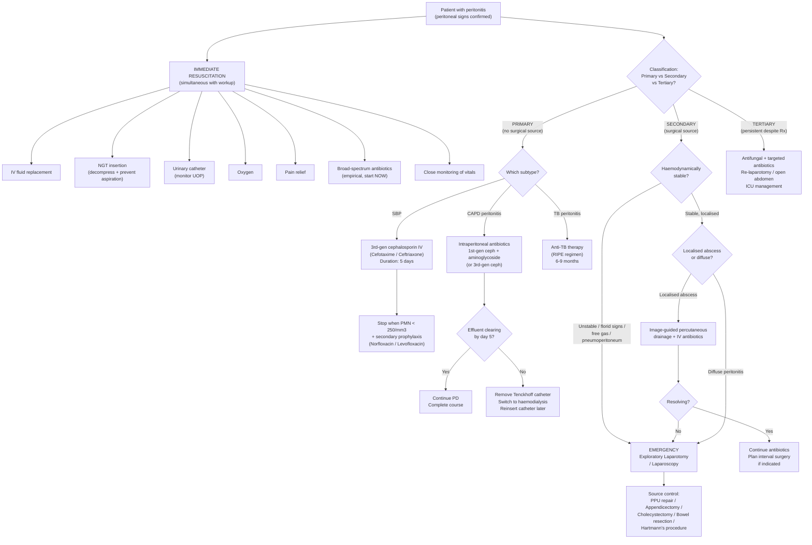

## Management Overview

The management of peritonitis is fundamentally dictated by one question: **is there a surgically treatable source?** If yes (secondary peritonitis), surgery is the definitive treatment. If no (primary peritonitis), the treatment is medical. Everything else — resuscitation, antibiotics, supportive care — is built around this central decision.

Think of it as three simultaneous streams happening in parallel:

1. **Resuscitate** the patient (they are losing fluid and becoming septic)
2. **Treat the infection** (antibiotics)
3. **Eliminate the source** (surgery if secondary; antibiotics alone if primary)

---

## Management Algorithm

---

## Immediate Resuscitation (All Types of Peritonitis)

Before you even know the cause, start resuscitation. The patient is dying from two things simultaneously: **hypovolaemia** (third-space losses) and **sepsis** (bacterial/endotoxin absorption). Both must be addressed urgently.

### Supportive Measures

These are directly from the lecture slides for ***acute secondary bacterial peritonitis — treatment*** [1]:

| Measure | Rationale |
|---|---|
| ***IV fluid replacement*** | The inflamed peritoneum (1.7 m² surface area) leaks protein-rich fluid into the peritoneal cavity → intravascular depletion. Crystalloids (normal saline, Hartmann's solution) are first-line. Colloids (albumin) may be needed in cirrhotic patients with SBP to prevent hepatorenal syndrome. Target: adequate urine output ( > 0.5 mL/kg/hr), normalisation of lactate, MAP > 65 mmHg. [1] |
| ***Nasogastric tube (NGT)*** | Peritonitis causes paralytic ileus → gastric and intestinal contents accumulate → risk of vomiting and aspiration, especially during induction of anaesthesia. The NGT decompresses the stomach ("drip and suck") [1][2]. Placed on free drainage with 4-hourly aspiration. |
| ***Urinary catheter*** | Accurate measurement of urine output is essential for monitoring fluid resuscitation and detecting early AKI. Target UOP > 0.5 mL/kg/hr [1]. |
| ***Oxygen*** | Peritonitis patients are hypoxic from multiple mechanisms: (1) abdominal distension pushing the diaphragm up → basal atelectasis, (2) tachypnoea from metabolic acidosis, (3) sepsis-related acute lung injury. Supplemental O₂ maintains tissue oxygenation [1]. |
| ***Pain relief*** | Adequate analgesia is essential and humane. IV opioids (morphine, fentanyl) are appropriate. ***Pain relief*** should not be withheld for fear of "masking signs" — this is an outdated concept. However, reassess after analgesia: if peritoneal signs persist despite good pain relief, they are real [1]. |
| ***Broad-spectrum antibiotics*** | Started empirically before culture results are available. The choice depends on whether peritonitis is primary or secondary (see below). ***Do not wait for laboratory confirmation or culture result since delayed treatment carries a worse outcome*** [2]. |
| ***Close monitoring for change of condition*** | Serial vital signs (HR, BP, RR, temp, SpO₂), urine output, abdominal examination. Look for signs of deterioration: rising HR, falling BP, worsening tenderness, increasing distension [1]. |

<Callout title="The 'Drip and Suck' Principle">
"Drip" = IV fluids to replace the third-space losses. "Suck" = NGT to decompress the stomach and prevent aspiration. This combination is the foundation of supportive care in any patient with peritonitis or intestinal obstruction. It buys time while you work out the definitive plan.
</Callout>

---

## Treatment by Type of Peritonitis

### 1. Primary Peritonitis — Medical Management

Primary peritonitis has **no surgical source** — there is nothing to cut out. Treatment is antibiotics ± addressing the underlying predisposition.

#### A. Spontaneous Bacterial Peritonitis (SBP)

**Indications for antibiotic therapy** (any of the following) [2]:
- ***Fever > 37.8°C***
- ***Abdominal pain or tenderness***
- ***Altered mental status***
- ***Ascitic fluid PMN count ≥ 250 cells/mm³***

**Empirical Antibiotic Choice:**

***3rd generation cephalosporin should be used*** [2]:
- ***Cefotaxime*** 2 g IV Q8h **OR**
- ***Ceftriaxone*** 2 g IV daily

Why 3rd-gen cephalosporins? "Ceph" = cephalosporin (β-lactam antibiotic that inhibits cell wall synthesis). The "3rd generation" designation means it has expanded Gram-negative coverage (especially *E. coli*, *Klebsiella*) while retaining some Gram-positive activity. These are the predominant organisms in SBP. They also have good peritoneal penetration.

**Duration**: ***5 days*** — treatment can be ***stopped when PMN < 250 cells/mm³*** [2]. A repeat paracentesis at 48 hours is recommended to confirm response (expect ≥ 25% decrease in PMN count).

**Adjunctive therapy — IV Albumin:**
- IV albumin (1.5 g/kg on day 1, then 1 g/kg on day 3) is given alongside antibiotics in SBP patients with **renal impairment** (creatinine > 88 μmol/L or BUN > 10.7 mmol/L) or **bilirubin > 68 μmol/L** to prevent hepatorenal syndrome.
- Why? Albumin expands intravascular volume and prevents the renal vasoconstriction that occurs during SBP due to splanchnic arterial vasodilation and cytokine-mediated renal injury. Reduces mortality from ~30% to ~10%.

**Prevention of Recurrence (Secondary Prophylaxis):**

***Fluoroquinolones*** for ***lifelong selective intestinal decontamination*** (unless patient receives ***liver transplant with normalisation of liver function***) [2]:
- ***Norfloxacin*** 400 mg PO daily **OR**
- ***Levofloxacin*** 250 mg PO daily

Why fluoroquinolones work for prophylaxis [2]:
- ***Incomplete absorption by gut leading to high concentration*** in the intestinal lumen
- ***High activity against Gram-negative bacilli*** (the organisms causing SBP)
- ***Low bacterial resistance***
- ***Fewer side effects***

The mechanism is "selective intestinal decontamination" — the fluoroquinolone stays in the gut lumen at high concentrations, killing the Gram-negative bacteria that would otherwise translocate across the gut wall to cause SBP, while preserving anaerobic flora (which actually prevents colonisation by pathogenic organisms).

**Primary Prophylaxis** (preventing first episode of SBP):
- Indicated in cirrhotic patients with ascitic fluid protein < 1.5 g/dL (low opsonic activity → high risk)
- Same agents: Norfloxacin or Levofloxacin
- Also indicated short-term (7 days) in any cirrhotic patient with acute GI bleeding (high risk of SBP during variceal bleed)

#### B. CAPD-Associated Peritonitis

***As early as possible if the diagnosis of peritonitis is certain clinically*** — ***do not wait for laboratory confirmation or culture result since delayed treatment carries a worse outcome*** [2].

**Empirical Antibiotic Regimen (Intraperitoneal — IP):**

***1st generation cephalosporin + aminoglycoside*** [2]:
- **Gram-positive cover**: ***1st generation cephalosporin (cefazolin)*** — covers Staphylococcal species (the most common cause from skin flora around the catheter)
- **Gram-negative cover**: ***Aminoglycoside*** (e.g., gentamicin) **OR** ***3rd or 4th generation cephalosporin (ceftazidime / cefepime)***

**General rules** [2]:
- ***Use less broad-spectrum drugs*** — start narrow and escalate if needed
- ***Avoid vancomycin*** as initial treatment — ***to minimise emergence of resistant strains*** (VRE — vancomycin-resistant enterococci). Reserve vancomycin for MRSA or when 1st-gen cephalosporin fails.

Why IP (intraperitoneal) route? Because the infection is IN the peritoneal cavity. IP antibiotics achieve much higher local concentrations than IV antibiotics. The drug is dissolved in the PD fluid and instilled directly into the peritoneum during a regular exchange.

**Modification** [2]:
- ***Replacing aminoglycoside with 3rd generation cephalosporin is advocated to preserve residual renal function and avoid ototoxicity*** — aminoglycosides are nephrotoxic and ototoxic; PD patients often have some residual renal function that is important to preserve.

**Continuation of PD:**
- ***Continuous peritoneal dialysis should be continued unless peritonitis is refractory to treatment*** [2]. Stopping PD would mean the patient loses their dialysis modality and needs temporary haemodialysis.

**Adjust According to Culture:**
- ***Adjust antibiotic therapy according to culture result and sensitivity*** [2] once results are available (usually 48–72 hours).

**Success Rate:**
- ***Success rate > 90%*** [2]
- ***Lower success rate for Gram-negative organisms*** [2]
- ***Much lower success rate for fungal peritonitis*** [2]

**Indications for Tenckhoff Catheter Removal** [2]:

| Indication | Rationale |
|---|---|
| ***Refractory peritonitis with failure of effluent to clear up after 5 days of antimicrobial treatment*** | Persistent infection despite adequate antibiotics means the catheter itself is acting as a nidus (biofilm on catheter surface harbours bacteria inaccessible to antibiotics). Switch to temporary haemodialysis. |
| ***Peritonitis due to hydrophilic Gram-negative rods (e.g., Pseudomonas sp.)*** | These organisms form tenacious biofilms on catheters. ***Antimicrobial therapy is usually not sufficient and PD catheter removal is required to ensure complete eradication of infection*** [2]. |
| ***Fungal infection (e.g., yeast / Candida)*** | Fungal peritonitis has very poor response to antifungals alone when the catheter remains in situ — biofilm formation is a major issue. Remove catheter + systemic antifungal (fluconazole or echinocandin). |

**Post-removal plan** [2]:
- ***Tenckhoff catheter should be removed and reinserted for peritoneal dialysis few weeks later after total subsidence of peritonitis signs and symptoms***
- Patient maintained on ***haemodialysis*** in the interim

<Callout title="Blood Glucose Control in CAPD Peritonitis" type="idea">
***Infection will induce hyperglycaemia*** (stress response → counter-regulatory hormones → insulin resistance). However, ***nausea and anorexia of peritonitis will lead to malnutrition and hence hypoglycaemia in patients receiving hypoglycaemic agents or insulin*** [2]. This dual risk means blood glucose must be monitored closely and hypoglycaemic medications adjusted.
</Callout>

#### C. Tuberculous Peritonitis

- Standard anti-TB therapy: **RIPE regimen** (Rifampicin, Isoniazid, Pyrazinamide, Ethambutol) for 2 months intensive phase, followed by Rifampicin + Isoniazid for 4–7 months continuation phase (total 6–9 months)
- Consider adding pyridoxine (vitamin B6) to prevent isoniazid-induced peripheral neuropathy
- Surgery is NOT indicated unless complications arise (e.g., bowel obstruction from TB strictures, perforation)
- Response to treatment is monitored clinically (resolution of symptoms, weight gain) and by serial ascitic fluid analysis

---

### 2. Secondary Peritonitis — Surgical Management

***Accounts for most peritonitis*** [1]. The fundamental principle is **source control** — you must eliminate the source of contamination. Antibiotics alone are insufficient because bacteria will continue to pour into the peritoneal cavity from the uncontrolled source.

***Surgical correction of underlying pathology — laparotomy if surgically treatable source of infection is documented*** [2]

#### Indications for Emergency / Urgent Surgery

From the lecture slides on ***indications for urgent surgery*** [7]:

- ***Incarcerated, strangulated hernia***
- ***Suspected or proven strangulation***
- ***Peritonitis***
- ***Pneumoperitoneum***
- ***Pneumatosis cystoides intestinalis*** (gas within bowel wall — indicates transmural ischaemia/necrosis)
- ***Close-loop obstruction***
- ***Volvulus with peritoneal signs***

The overarching rule: ***proceed to exploratory laparotomy if free gas / florid peritoneal signs*** [3]

#### Surgical Approach

The management has two components, performed simultaneously or sequentially:

**Component 1: Source Control** (stop the contamination)

| Source | Surgical Procedure |
|---|---|
| ***PPU (perforated peptic ulcer)*** | ***PPU repair*** — omental patch (Graham patch) closure of perforation ± definitive ulcer surgery [1] |
| Perforated appendicitis | ***Appendicectomy*** — laparoscopic preferred if feasible [1] |
| ***Cholecystitis / GB perforation*** | ***Cholecystectomy*** [1] — laparoscopic if inflammation permits, otherwise open |
| Perforated diverticular disease | ***Bowel resection*** [1] — approach depends on Hinchey staging (see below) |
| Perforated bowel (other causes) | Resection of affected segment ± anastomosis or stoma |
| Ischaemic bowel | Resection of non-viable bowel ± revascularisation (embolectomy / bypass for mesenteric ischaemia) |
| Anastomotic leak | Re-exploration, washout, defunctioning stoma ± re-do anastomosis |

**Component 2: Peritoneal Toilet** (clean up the contamination)

- Thorough peritoneal lavage with warm normal saline (litres)
- Removal of fibrinous debris, pus, faecal matter
- Ensure all quadrants and paracolic gutters are irrigated
- Drains may be placed in dependent areas (pelvis, subphrenic spaces) if ongoing contamination is expected

#### Operative Approaches

***Laparoscopic surgery / Laparotomy*** [1]:

| Approach | Indications | Advantages |
|---|---|---|
| **Laparoscopic** | Haemodynamically stable, localised pathology (e.g., perforated appendicitis, PPU in young patient) | Less wound infection, less post-operative pain, faster recovery, better cosmesis |
| **Open laparotomy** | Haemodynamically unstable, generalised peritonitis, gross sepsis, unclear source, multiple adhesions | Better access for thorough washout, ability to assess entire bowel, safer in unstable patients |

#### Non-Operative Source Control

***Drainage — percutaneous drainage of abdominal abscess*** [1]:

For **localised** secondary peritonitis (contained abscess), percutaneous drainage under imaging guidance (CT or USG) can achieve source control without major surgery:

- **Indications**: Well-defined, unilocular abscess accessible to percutaneous route; patient stable
- **Technique**: CT-guided or USG-guided catheter placement into the abscess cavity; leave drain in situ until output minimal and clinical improvement
- **When it fails**: If the abscess does not resolve, or the patient deteriorates, proceed to surgery

This is particularly relevant in **diverticular disease** [3][6]:

| ***Hinchey Stage*** | Description | Treatment |
|---|---|---|
| **I** | Localised pericolic abscess | ***IV antibiotics +/- drainage*** [3] |
| **II** | Distant abscess (retroperitoneal/pelvic) | ***IV antibiotics + drainage*** [3] — CT-guided percutaneous drainage (***5 cm as cut-off: likely resolve by antibiotics vs. require intervention*** [3]) |
| **III** | ***Generalised suppurative peritonitis*** (abscess ruptured, bowel intact) | ***Hartmann's operation / One-stage resection*** [3] — Mortality 25% |
| **IV** | ***Faecal peritonitis*** (bowel wall perforation) | ***Hartmann's operation*** [3] — Mortality 50% |

**Hartmann's procedure**: Resection of the affected sigmoid colon with creation of an **end-colostomy** (the proximal end is brought out as a stoma) and closure of the distal rectal stump. Why? In the presence of gross faecal contamination, performing a primary anastomosis (joining the two bowel ends together) carries a very high risk of **anastomotic leak** because the tissues are inflamed, oedematous, and contaminated. The stoma is reversed electively months later once the patient has recovered.

#### Antibiotic Therapy for Secondary Peritonitis

***Broad-spectrum antibiotics*** [1] — must cover Gram-negatives, Gram-positives, AND anaerobes (reflecting the polymicrobial nature of secondary peritonitis):

| Regimen | Coverage | Notes |
|---|---|---|
| ***Augmentin (amoxicillin-clavulanate)*** ± ***Metronidazole*** | Gram-pos, Gram-neg, anaerobes | ***Augmentin actually has anaerobic coverage*** [8], but metronidazole is often added for severe intra-abdominal sepsis (enhanced anti-anaerobic activity) |
| ***Cefuroxime + Metronidazole*** | Gram-pos, Gram-neg + anaerobes | Alternative to Augmentin. Cefuroxime (2nd-gen cephalosporin) covers common enterics [8]. |
| ***Piperacillin-tazobactam*** | Very broad — Gram-pos, Gram-neg (including Pseudomonas), anaerobes | Reserved for severe/complicated intra-abdominal sepsis or hospital-acquired infections |
| ***Cephalosporin/Fluoroquinolone + Metronidazole*** | As above | Alternative regimens for inpatient diverticulitis [6] |
| ***Carbapenem (Meropenem/Imipenem)*** | Broadest — ESBL-producing Gram-neg, anaerobes | Reserved for critically ill patients, suspected resistant organisms, or tertiary peritonitis |

**Timing of surgical prophylaxis** [8]:
- ***At the induction of GA*** — to achieve high tissue concentration of antibiotics upon skin incision
- ***Additional dose if OT > 2× half-life*** (usually 3 hours for Augmentin/cefuroxime)
- ***Additional dose if blood loss > 1.5 L***

**Duration**:
- Uncomplicated source (e.g., non-perforated appendicitis): ***Continue until 24h post-op*** [3]
- Complicated source (e.g., perforated appendicitis with abscess, generalised peritonitis): ***Continue 3–7 days post-op*** [3], guided by clinical response (resolution of fever, normalising WCC, improving clinically)

---

### 3. Tertiary Peritonitis

Tertiary peritonitis = ***persistent peritonitis after adequate initial therapy*** [3]. This is the most difficult to manage:

- **Re-evaluate source control**: Is there an ongoing source that was missed? Undrained abscess? Anastomotic leak? CT abdomen + pelvis to look for residual collections.
- **Adjust antibiotics**: Culture-guided — these patients often harbour resistant or opportunistic organisms (***Staphylococcus, Enterococcus, Candida*** [2]):
  - MRSA → Vancomycin or Linezolid
  - VRE → Linezolid or Daptomycin
  - *Candida* → Echinocandin (Caspofungin/Anidulafungin) or Fluconazole
  - *Pseudomonas* → Piperacillin-tazobactam, Ceftazidime, or Carbapenem + Aminoglycoside
- **Re-laparotomy / planned re-look laparotomy**: May need repeat washouts every 24–48 hours
- **Open abdomen management (laparostomy)**: In severe cases, the abdomen is left open with a temporary abdominal closure (vacuum-assisted closure / negative-pressure wound therapy) to allow ongoing drainage and repeated washouts
- **ICU care**: These patients are invariably in the ICU with multi-organ support

---

### 4. Specific Scenarios

#### Emergency Surgery for Diverticulitis-Related Peritonitis [6]

**Indications for emergency surgery in diverticulitis** [6]:
- ***Frank (free) perforation***
- ***Failure of medical treatment with IV antibiotics***
- ***Colonic obstruction***
- ***Abscess failing non-operative intervention***

**Elective surgery (sigmoid colectomy with primary anastomosis — "interval colectomy")** [6]:
- ***Previous complicated diverticulitis***
- ***Immunocompromised patients***
- ***Inability to exclude malignancy***
- ~~Recurrent episodes of uncomplicated diverticulitis~~ — ***Previously thought that risk of complications increases with recurrent disease but is now proven to be wrong*** [6]. Current guidelines no longer recommend elective surgery based on number of episodes alone.

#### Appendicitis with Peritonitis

**Immediate surgery (present within 72h and fit for surgery)** [3]:
- ***Laparoscopic appendicectomy is preferred*** — lower infection risk, less post-operative pain, shorter hospital stay
- ***Open surgery if gross sepsis*** or generalised peritonitis with haemodynamic instability
- **Antibiotics**: ***IV ceftriaxone + metronidazole*** (anaerobic coverage) [3]
  - Non-complicated: ***continue until 24h post-op***
  - Complicated (abscess, phlegmon): ***continue 3–7 days post-op***

**Interval surgery (present > 72h and stable — walled-off appendix)** [3]:
- ***IV antibiotics (~90% success rate) ± image-guided drainage of abscess***
- ***Laparoscopic appendicectomy 6–8 weeks later***
- ***Colonoscopy if > 40 years old to exclude caecal carcinoma*** [3]

---

## Summary: Decision Framework

| Type | Is There a Surgical Source? | Primary Treatment | Key Antibiotics |
|---|---|---|---|
| **Primary (SBP)** | No | ***3rd-gen cephalosporin*** (Cefotaxime/Ceftriaxone) × 5 days | Then secondary prophylaxis with Norfloxacin/Levofloxacin |
| **Primary (CAPD)** | No | ***IP 1st-gen cephalosporin + aminoglycoside*** (or 3rd-gen ceph) | Remove catheter if refractory/fungal/Pseudomonas |
| **Primary (TB)** | No | ***RIPE regimen*** × 6–9 months | No surgery unless complications |
| **Secondary** | ***Yes*** | ***Source control: surgery*** (laparotomy/laparoscopy) + peritoneal lavage | Broad-spectrum: Augmentin + Metronidazole or Pip-Taz |
| **Tertiary** | Persistent | Re-laparotomy, open abdomen, ICU | Culture-guided ± antifungals |

<Callout title="High Yield Summary — Management of Peritonitis">

**Immediate for ALL**: IV fluids, NGT, urinary catheter, oxygen, pain relief, broad-spectrum antibiotics, close monitoring.

**SBP**: 3rd-gen cephalosporin (Cefotaxime/Ceftriaxone) × 5 days → stop when PMN < 250. IV albumin if renal impairment/high bilirubin. Lifelong fluoroquinolone prophylaxis (Norfloxacin/Levofloxacin).

**CAPD peritonitis**: IP 1st-gen cephalosporin + aminoglycoside (or 3rd-gen ceph). Start ASAP — don't wait for cultures. Continue PD unless refractory. Remove catheter if: refractory after 5 days / Pseudomonas / fungal. Success > 90%.

**Secondary peritonitis**: Source control is king — laparotomy/laparoscopy (PPU repair, appendicectomy, cholecystectomy, bowel resection). Percutaneous drainage for localised abscess. Broad-spectrum antibiotics (cover Gram-neg + Gram-pos + anaerobes). Hartmann's procedure for Hinchey III/IV diverticulitis.

**Indications for urgent surgery**: Peritonitis, pneumoperitoneum, strangulation, closed-loop obstruction, volvulus with peritoneal signs, incarcerated hernia.

**Do NOT delay surgery** in unstable patients with free gas + florid peritoneal signs. Do NOT wait for culture results before starting antibiotics. Do NOT use vancomycin as first-line for CAPD peritonitis.

</Callout>

---

<ActiveRecallQuiz
  title="Active Recall - Management of Peritonitis"
  items={[
    {
      question: "What is the empirical antibiotic regimen for SBP, what is the duration, and what is the criterion for stopping treatment?",
      markscheme: "3rd-generation cephalosporin (Cefotaxime 2g IV Q8h or Ceftriaxone 2g IV daily). Duration: 5 days. Stop when ascitic fluid PMN < 250 cells/mm3. Also give IV albumin (1.5 g/kg day 1, 1 g/kg day 3) if renal impairment or bilirubin > 68 umol/L to prevent hepatorenal syndrome."
    },
    {
      question: "In CAPD peritonitis, what is the empirical antibiotic regimen, why is vancomycin avoided initially, and what are the 3 indications for Tenckhoff catheter removal?",
      markscheme: "Empirical: IP 1st-generation cephalosporin (cefazolin) + aminoglycoside (or 3rd-gen cephalosporin like ceftazidime to preserve residual renal function and avoid ototoxicity). Vancomycin avoided to minimise emergence of vancomycin-resistant strains (VRE). Catheter removal indications: (1) Refractory peritonitis with failure of effluent to clear after 5 days of antibiotics, (2) Peritonitis due to hydrophilic Gram-negative rods (e.g. Pseudomonas) - forms biofilms, (3) Fungal peritonitis (e.g. Candida) - antimicrobials insufficient with catheter in situ."
    },
    {
      question: "What are the 6 immediate resuscitative measures for a patient presenting with peritonitis, as listed in the lecture slides?",
      markscheme: "(1) IV fluid replacement (correct hypovolaemia from third-space losses), (2) Nasogastric tube (decompress stomach, prevent aspiration - paralytic ileus), (3) Urinary catheter (monitor urine output for fluid resuscitation), (4) Oxygen (prevent hypoxia from diaphragmatic splinting and sepsis), (5) Pain relief (IV opioids), (6) Broad-spectrum antibiotics (start empirically, do not wait for cultures). Plus close monitoring for change of condition."
    },
    {
      question: "Explain why Hartmann's procedure is preferred over primary anastomosis in Hinchey III/IV diverticular peritonitis.",
      markscheme: "In Hinchey III (generalised purulent peritonitis) and IV (faecal peritonitis), the peritoneal cavity is grossly contaminated. Performing a primary anastomosis (joining bowel ends together) in this environment carries a very high risk of anastomotic leak because tissues are inflamed, oedematous, and contaminated. Hartmann's procedure resects the affected segment, creates an end-colostomy (proximal stoma), and closes the distal rectal stump. The stoma can be reversed electively months later when the patient has recovered and inflammation has settled."
    },
    {
      question: "What is secondary prophylaxis for SBP, which agents are used, and what is the mechanism by which they prevent recurrence?",
      markscheme: "Lifelong fluoroquinolone prophylaxis (Norfloxacin 400mg PO daily or Levofloxacin 250mg PO daily) unless patient receives liver transplant with normalisation of liver function. Mechanism: selective intestinal decontamination - fluoroquinolones are incompletely absorbed by the gut, achieving high intraluminal concentrations. They have high activity against Gram-negative bacilli (the organisms that translocate to cause SBP) while preserving anaerobic flora, low bacterial resistance, and fewer side effects."
    },
    {
      question: "List 4 indications for emergency surgery in diverticulitis-related peritonitis and state one indication that is NO LONGER considered valid for elective sigmoid colectomy.",
      markscheme: "Emergency: (1) Frank free perforation, (2) Failure of medical treatment with IV antibiotics, (3) Colonic obstruction, (4) Abscess failing non-operative intervention. No longer valid: recurrent episodes of uncomplicated diverticulitis - previously thought risk of complications increases with recurrent disease but now proven wrong. Current guidelines do not recommend elective surgery based on number of episodes alone."
    }
  ]}
/>

## References

[1] Lecture slides: GC 195. Lower and diffuse abdominal pain RLQ problems; pelvic inflammatory disease; peritonitis and abdominal emergencies.pdf (p34, p39, p41, p42)
[2] Senior notes: felixlai.md (Peritonitis treatment p741–743; SBP treatment and prophylaxis p449–450; CAPD peritonitis treatment p866–867; Case study p743)
[3] Senior notes: maxim.md (Section 2.5 Peritonitis p46; Appendicitis management p181; Diverticulitis Hinchey classification and management p95, p194)
[6] Senior notes: felixlai.md (Diverticulitis treatment p645–647; Emergency surgery indications p645; Hinchey staging p637)
[7] Lecture slides: GC 194. Intestinal obstruction colorectal cancer.pdf (p25 — Indications for urgent surgery)
[8] Senior notes: maxim.md (Surgical antibiotic prophylaxis p49)
