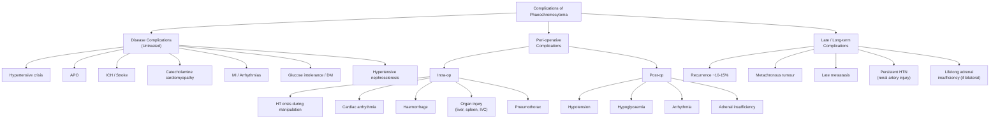

## Complications of Phaeochromocytoma

Complications of phaeochromocytoma can be broadly divided into three categories:

1. **Complications of the disease itself** (untreated catecholamine excess)
2. **Complications of treatment** (peri-operative and post-operative)
3. **Long-term complications** (recurrence, metachronous tumour, malignant transformation)

The unifying concept: almost every complication traces back to **catecholamine toxicity** on the cardiovascular system, metabolism, and end-organs — either from the tumour itself, from haemodynamic swings during surgery, or from the sudden *absence* of catecholamines after tumour removal.

---

### 12.1 Complications of the Disease (Untreated Phaeochromocytoma)

These are the consequences of chronic or acute catecholamine excess. Think of them as "what happens if you don't diagnose and treat this tumour."

#### A. Cardiovascular Complications

| Complication | Pathophysiology | Clinical Significance |
|---|---|---|
| **Hypertensive crisis** | Massive catecholamine surge → α₁ vasoconstriction → TPR ↑↑↑ → BP ↑↑↑ | Can be spontaneous or triggered (drugs, surgery, contrast, stress). BP may exceed 250/150 mmHg. A medical emergency. |
| ***Acute pulmonary oedema (APO)*** [2] | Two mechanisms: (1) **Afterload mismatch** — severe α₁ vasoconstriction → ↑↑ afterload → LV cannot eject against such high resistance → acute LV failure → pulmonary congestion. (2) **Catecholamine cardiomyopathy** — direct catecholamine toxicity → contraction band necrosis → LV systolic dysfunction. | One of the most feared presentations of phaeochromocytoma crisis. A young patient presenting with flash pulmonary oedema should always prompt consideration of phaeochromocytoma. |
| ***Intracranial haemorrhage (ICH)*** [2] | Severe acute hypertension → exceeds the autoregulatory capacity of cerebral vessels → vessel wall rupture → parenchymal haemorrhage. Also, chronic hypertension → lipohyalinosis/microaneurysm formation → predisposes to haemorrhagic stroke. | Can be the presenting event of a previously undiagnosed phaeochromocytoma. Always check metanephrines in young patients with unexplained ICH. |
| **Catecholamine cardiomyopathy** (Takotsubo-like) | Sustained high catecholamine levels are directly cardiotoxic: (1) Calcium overload in cardiomyocytes → contraction band necrosis. (2) Oxygen supply-demand mismatch (↑ HR, ↑ contractility, ↑ afterload). (3) Coronary vasospasm (α₁ on coronary arteries). Result: regional or global LV wall motion abnormalities, ↓ EF. | Reversible in many cases after tumour removal, but can be fatal acutely. Echo shows apical ballooning or diffuse hypokinesis. May mimic acute MI (troponin rise + ST changes + wall motion abnormality). |
| **Myocardial infarction** | (1) Demand ischaemia: ↑ HR + ↑ contractility + ↑ afterload → oxygen demand exceeds supply. (2) Coronary vasospasm: α₁ stimulation of coronary arteries → luminal narrowing. (3) Accelerated atherosclerosis from chronic hypertension. | Can occur even in young patients with "normal" coronaries (Type 2 MI or vasospastic). |
| **Cardiac arrhythmias** | β₁ stimulation → ↑ automaticity + ↑ conduction velocity + shortened refractory period → supraventricular tachycardia, ventricular tachycardia, ventricular fibrillation, atrial fibrillation. Also, direct catecholamine toxicity → myocardial fibrosis → re-entrant circuits. | Can cause sudden cardiac death. VT/VF is the immediate cause of death in many phaeochromocytoma fatalities. |
| **Hypertensive retinopathy** | Chronic hypertension → arteriolar thickening → AV nipping → flame haemorrhages → cotton-wool spots → papilloedema (grade IV). | Fundoscopy should be part of every assessment. Grade III–IV retinopathy indicates end-organ damage. |

<Callout title="Phaeochromocytoma Crisis — The Lethal Triad">
***Pheochromocytoma crisis: APO, ICH*** [2]

The two most feared acute complications are APO and ICH. Together with fatal arrhythmias, these form the **lethal triad** of phaeochromocytoma crisis. This is why pre-operative preparation is non-negotiable — an inadequately prepared patient undergoing any surgery (even unrelated to the tumour) can die from one of these three events.

Crisis triggers to remember: surgical manipulation, anaesthetic induction (intubation), drugs (TCAs, metoclopramide, IV contrast, sympathomimetics), food (tyramine-rich cheese/wine), emotional stress, pregnancy/labour.
</Callout>

#### B. Cerebrovascular Complications

| Complication | Pathophysiology |
|---|---|
| **Hypertensive encephalopathy** | Acute severe hypertension → overwhelms cerebral autoregulation → cerebral oedema → headache, confusion, seizures, visual disturbance |
| **Ischaemic stroke** | Chronic hypertension → accelerated atherosclerosis → carotid/cerebral vessel stenosis → thrombotic or embolic stroke. Also possible during hypotensive episodes (watershed infarcts). |
| **Posterior reversible encephalopathy syndrome (PRES)** | Acute hypertension → endothelial dysfunction → vasogenic oedema predominantly in posterior cerebral regions → headache, visual loss, confusion, seizures. Reversible with BP control. |

#### C. Metabolic Complications

| Complication | Pathophysiology | Clinical Relevance |
|---|---|---|
| **Glucose intolerance / Diabetes mellitus** | α₂ stimulation → ↓ insulin secretion from pancreatic β-cells. β₂ stimulation → ↑ hepatic glycogenolysis + ↑ glucagon release. Result: chronic hyperglycaemia → can meet diagnostic criteria for diabetes. | May resolve after tumour removal ("curable diabetes"). New-onset diabetes in a young hypertensive patient is a clue. |
| **Weight loss** | β₁ stimulation → ↑ lipolysis → ↑ free fatty acid oxidation → ↑ basal metabolic rate. Overall hypermetabolic state. | Patients may present with dramatic weight loss despite adequate caloric intake — mimics malignancy or thyrotoxicosis. |
| **Hypercalcaemia** | (1) Co-existing primary hyperparathyroidism in MEN2A. (2) Paraneoplastic PTHrP secretion by the tumour (rare). (3) Catecholamine-mediated bone resorption (PTH-independent). | If hypercalcaemia found, check PTH and screen for MEN2A. |
| **Lactic acidosis** | Catecholamine-induced vasoconstriction → tissue hypoperfusion → anaerobic metabolism → lactate accumulation. Also, β₂-mediated glycolysis → ↑ pyruvate → ↑ lactate. | Can present during severe crisis; indicates tissue ischaemia. |

#### D. Renal Complications

| Complication | Pathophysiology |
|---|---|
| **Hypertensive nephrosclerosis** | Chronic hypertension → glomerular capillary damage → progressive renal impairment |
| **Acute kidney injury** | During hypertensive crisis → renal artery vasospasm → acute cortical ischaemia. Also: rhabdomyolysis (rare, from extreme sympathetic activation) → myoglobin-induced AKI. |

#### E. Other Organ-Specific Complications

| Complication | Pathophysiology |
|---|---|
| **Paralytic ileus / Intestinal ischaemia** | α₁ stimulation → mesenteric vasoconstriction → gut ischaemia. Also: sympathetic inhibition of peristalsis → ileus. Rare but reported: ischaemic bowel necrosis during phaeochromocytoma crisis. |
| **Acute cholecystitis (acalculous)** | Visceral vasoconstriction → gallbladder ischaemia → acalculous cholecystitis. Part of the spectrum of catecholamine-induced visceral ischaemia. |
| **Disseminated intravascular coagulation (DIC)** | Extreme catecholamine surge → endothelial damage → activation of coagulation cascade → consumptive coagulopathy. Very rare, associated with fulminant crisis. |
| **Multiorgan failure** | The final common pathway of untreated catastrophic phaeochromocytoma crisis: cardiogenic shock + visceral ischaemia + renal failure + metabolic acidosis. |

---

### 12.2 Complications of Treatment (Peri-operative and Post-operative)

These are the complications that arise from the **surgery itself** and the **abrupt haemodynamic shift** when catecholamine supply is suddenly cut off.

#### A. Intra-operative Complications

***Complications*** [1]:

| Complication | Pathophysiology | Prevention / Management |
|---|---|---|
| ***Acute hypertensive crisis*** [1] | Tumour manipulation → bolus catecholamine release → α₁ vasoconstriction + β₁ cardiac stimulation → BP spike to > 200/120 | ***Adequate pre-op alpha-blockade*** [1][2]; ***gentle manipulation of lesion*** [2]; ***dissect and control adrenal vein first*** [2]; IV nitroprusside / phentolamine on standby |
| ***Cardiac arrhythmia*** [1][2] | Catecholamine surge → β₁ stimulation → ↑ automaticity → SVT, VT, VF, AF | Pre-op β-blockade; IV esmolol intra-op; continuous ECG monitoring; correct electrolytes (K⁺, Mg²⁺) |
| ***Intraoperative haemorrhage*** [1] | Rich triple arterial supply (superior, middle, inferior adrenal arteries); fragile tumour capsule; large vascular tumour; proximity to IVC (especially right side) | Meticulous surgical technique; early vascular control; ***A-line, CVP monitoring*** [2]; blood products available |
| ***Liver or spleen injury*** [1] | Anatomical proximity: ***Right adrenalectomy → IVC, right lobe of liver*** [2]; ***Left adrenalectomy → pancreatic tail, spleen*** [2] | Careful dissection; laparoscopic approach reduces risk but does not eliminate it |
| ***Pneumothorax*** [1] | Close proximity of adrenal glands to the diaphragm, especially with retroperitoneal approach; inadvertent diaphragm injury → communication with pleural space | Post-op CXR; chest drain if significant |
| ***Haemodynamic instability (phaeochromocytoma)*** [2] | The two-phase haemodynamic model: Phase 1 (HT during manipulation) → Phase 2 (hypotension after vein ligation). Wide BP swings. | ***Meticulous monitoring: A-line, CVP, Foley*** [2]; ***experienced anaesthetist*** [2]; nitroprusside + vasopressors on standby |

<Callout title="Why Right Adrenalectomy is Particularly Hazardous" type="error">
The **right adrenal vein** is short (1–2 cm) and drains directly into the **IVC**. This means:
- Less room for surgical dissection → higher risk of IVC injury
- Injury to IVC → massive haemorrhage requiring emergent repair
- The **right lobe of liver** sits immediately anterior → risk of hepatic injury

By contrast, the left adrenal vein is longer (drains via the left renal vein), giving more room — but the **pancreatic tail** and **spleen** are the structures at risk on the left side [2].
</Callout>

#### B. Early Post-operative Complications (Hours to Days)

| Complication | Pathophysiology | Management |
|---|---|---|
| ***Hypotension*** [2] | ***Drug effect*** (residual α-blockade, especially phenoxybenzamine which is irreversible with ~24h half-life) + sudden loss of catecholamine drive (vasodilation) + chronic catecholamine-induced volume contraction now unmasked | Aggressive IV fluid resuscitation; vasopressors (noradrenaline infusion) if refractory; wean α-blockers pre-operatively if using reversible agents; adequate pre-op volume expansion reduces risk |
| ***Hypoglycaemia*** [2] | ***Rebound hyperinsulinaemia*** — during chronic catecholamine excess, α₂ stimulation tonically suppresses insulin secretion from β-cells. Once the tumour is removed, this brake is suddenly released → β-cells surge with insulin. Simultaneously, β₂-mediated hepatic glycogenolysis ceases → ↓ hepatic glucose output. The combination causes acute hypoglycaemia. | Monitor blood glucose Q1–2h for 24–48h post-op; IV dextrose infusion (10% dextrose); have 50mL of 50% dextrose available for bolus; gradually normalises over 24–48h as insulin secretion re-equilibrates |
| ***Cardiac arrhythmia*** [2] | Catecholamine-induced myocardial sensitisation persists for hours after tumour removal; electrolyte shifts (K⁺, Mg²⁺) during surgery; residual myocardial damage (contraction band necrosis) | Continuous ECG monitoring in ICU; correct K⁺ and Mg²⁺; anti-arrhythmics as needed |
| ***Adrenal insufficiency*** [2] | If **bilateral adrenalectomy** performed: no remaining adrenal cortical tissue → no cortisol, no aldosterone. Can present as Addisonian crisis (hypotension, hypoglycaemia, hyperkalaemia, hyponatraemia). Also occurs if unilateral adrenalectomy but the contralateral gland was suppressed by chronic catecholamine-mediated cortisol co-secretion (rare). | ***IV hydrocortisone upon removal of adrenal gland*** [2] (100mg bolus → 50mg Q8h → taper to PO hydrocortisone + fludrocortisone); Medic-Alert bracelet; patient education on sick-day rules |
| **Post-operative fever** | Post-operative inflammation; wound infection; atelectasis; DVT/PE. ***Wonky glands*** (phaeochromocytoma, Addisonian crisis) are listed as post-op fever causes [2] | Standard post-op fever workup: Wind (atelectasis), Water (UTI), Wound, Walking (DVT/PE), Wonder drugs, Wonky glands [2] |
| **Wound complications** | Standard surgical: infection, dehiscence, incisional hernia (especially open approach) | Standard wound care; prophylactic antibiotics |

<Callout title="The 6 Ws of Post-operative Fever — Phaeochromocytoma in Context">
***Wonky glands*** — phaeochromocytoma and Addisonian crisis are specifically listed as causes of post-operative fever that are easily missed [2]. In a post-adrenalectomy patient who develops unexplained fever + hypotension + hypoglycaemia, always consider **adrenal crisis** (especially if bilateral surgery was performed or if steroid replacement was not initiated promptly).

Other easily missed causes in this context [2]: infected central line (A-line, CVP line placed for monitoring), C. diff colitis (antibiotics), acute pancreatitis (especially left adrenalectomy with pancreatic tail manipulation), acalculous cholecystitis.
</Callout>

#### C. Late Post-operative Complications

| Complication | Pathophysiology | Management |
|---|---|---|
| ***Hypertension (persistent)*** [2] | ***Renal artery injury*** during surgery → renovascular hypertension [2]. Also: essential hypertension may have been co-existing (especially in older patients); residual tumour tissue; contralateral occult tumour. | Check metanephrines post-op (2–6 weeks) to confirm biochemical cure. Imaging for residual/contralateral disease. Renal artery duplex if renovascular cause suspected. |
| **Recurrence** | ~10–15% recurrence rate. Tumour regrows from residual chromaffin cells (especially after cortical-sparing surgery) or from micrometastases. Hereditary syndromes have higher recurrence (especially SDHB). | ***Lifelong yearly screening: urine catecholamines, chromogranin A, imaging*** [2] |
| **Metachronous tumour** | New primary tumour arising in the contralateral adrenal gland or at a different extra-adrenal site. Particularly relevant in hereditary syndromes (MEN2, VHL, SDHx). | Annual biochemical surveillance + periodic imaging; genetic testing determines surveillance intensity |
| **Metastatic disease** (late) | Malignancy can declare itself years after initial "benign" resection. Metastatic sites: bone (most common), liver, lung, lymph nodes. ***Histologically and biochemically indistinguishable from benign disease, defined by metastasis*** [2]. | Annual surveillance; functional imaging (68Ga-DOTATATE PET-CT) if biochemical recurrence; treatment as per malignant phaeochromocytoma protocol |
| **Adrenal insufficiency** (permanent) | After bilateral adrenalectomy → lifelong dependence on exogenous glucocorticoid (hydrocortisone) and mineralocorticoid (fludrocortisone) | Regular endocrinology follow-up; sick-day rules; stress-dose steroids for illness/surgery; Medic-Alert bracelet |
| **Incisional hernia** | Defect in abdominal wall at surgical site, especially with open approach | Mesh repair if symptomatic |

---

### 12.3 Complications in the Context of Hereditary Syndromes

Patients with hereditary phaeochromocytoma face additional complications related to their **other associated tumours**:

| Syndrome | Associated Complications Beyond Phaeochromocytoma |
|---|---|
| **MEN2A** (RET) | Medullary thyroid carcinoma (aggressive if untreated; calcitonin marker); primary hyperparathyroidism (hypercalcaemia, renal stones, osteoporosis) [1] |
| **MEN2B** (RET) | Medullary thyroid carcinoma (more aggressive, earlier onset); mucosal neuromas (GI symptoms, obstruction); Marfanoid habitus |
| **VHL** | Clear cell RCC (can be bilateral/multifocal); haemangioblastoma (cerebellar → obstructive hydrocephalus; spinal → cord compression); retinal angioma (visual loss); pancreatic NETs/cysts [1] |
| **NF1** | Optic pathway glioma; plexiform neurofibromas (malignant transformation to MPNST); scoliosis; learning difficulties |
| **SDHB** | Highest risk of malignant phaeochromocytoma (~30–40%); head and neck paraganglioma; RCC (rare) |

These associated tumours must be **actively screened for** in patients with hereditary phaeochromocytoma — they are a source of significant morbidity and mortality independent of the phaeochromocytoma itself.

---

### 12.4 Complications of Malignant Phaeochromocytoma

***Malignant phaeochromocytoma — histologically and biochemically indistinguishable from benign disease, defined by metastasis*** [2]:

| Complication | Detail |
|---|---|
| **Skeletal metastases** | Most common metastatic site. Bone pain, pathological fractures, spinal cord compression, hypercalcaemia. Osteolytic or mixed pattern. |
| **Hepatic metastases** | Hepatomegaly, deranged LFTs, liver failure in advanced disease |
| **Pulmonary metastases** | Dyspnoea, haemoptysis, chest X-ray nodules |
| **Persistent catecholamine excess** | Even after primary tumour resection, metastatic deposits continue to secrete catecholamines → ongoing hypertension, arrhythmias, metabolic derangement |
| **Treatment-related** | I-131 MIBG therapy → bone marrow suppression, hypothyroidism; CVD chemotherapy → myelosuppression, neuropathy; temozolomide → nausea, myelosuppression |

5-year survival for malignant phaeochromocytoma: ~50% (variable depending on tumour biology and treatment response). SDHB-mutated malignant disease tends to have worse prognosis.

---

### 12.5 Summary — Complications Organised by Timing

---

<Callout title="High Yield Summary — Complications">

**Disease complications** (untreated catecholamine excess):
- ***Phaeochromocytoma crisis: APO + ICH*** [2] — the two most feared acute complications.
- Catecholamine cardiomyopathy (Takotsubo-like), MI (demand ischaemia + coronary vasospasm), fatal arrhythmias (VT/VF), hypertensive encephalopathy/PRES.
- Metabolic: glucose intolerance/DM (α₂ ↓ insulin + β₂ ↑ glycogenolysis), weight loss (β₁ lipolysis).
- Renal: hypertensive nephrosclerosis, AKI during crisis.

**Intra-operative complications** [1]:
- ***Acute hypertensive crisis, cardiac arrhythmia, intraoperative haemorrhage, liver or spleen injury, pneumothorax.***
- Right adrenalectomy → IVC + right lobe of liver at risk. Left → pancreatic tail + spleen [2].

**Post-operative complications** [2]:
- ***Hypotension*** (residual blockade + loss of catecholamine drive + hypovolaemia).
- ***Hypoglycaemia*** (rebound hyperinsulinaemia — β-cell revenge).
- ***Cardiac arrhythmia.***
- ***Adrenal insufficiency*** (bilateral adrenalectomy → lifelong steroid replacement).

**Late complications**:
- Recurrence (~10–15%), metachronous tumour (hereditary syndromes), late metastasis.
- ***Persistent hypertension from renal artery injury*** [2].
- ***Lifelong surveillance: annual urine catecholamines + chromogranin A + imaging*** [2].

**Malignancy**: Defined by metastasis not histology. Bone most common site. 5-year survival ~50%.

</Callout>

---

<ActiveRecallQuiz
  title="Active Recall - Complications of Phaeochromocytoma"
  items={[
    {
      question: "A 38-year-old woman with undiagnosed phaeochromocytoma undergoes a laparoscopic cholecystectomy. During insufflation and manipulation, she develops BP 260/150, HR 160, and then acute dyspnoea with bilateral crepitations. What two complications have occurred, and what is the pathophysiology of each?",
      markscheme: "1) Hypertensive crisis: Abdominal insufflation and visceral manipulation compressed the tumour causing massive catecholamine release. Alpha-1 vasoconstriction causes severe hypertension, beta-1 stimulation causes tachycardia. 2) Acute pulmonary oedema (APO): Two mechanisms - (a) afterload mismatch: extreme alpha-1 vasoconstriction increases afterload beyond LV capacity causing acute LV failure and pulmonary congestion; (b) catecholamine cardiomyopathy: direct catecholamine toxicity causes myocardial contraction band necrosis and acute systolic dysfunction."
    },
    {
      question: "Explain why hypoglycaemia occurs after successful adrenalectomy for phaeochromocytoma. When does it typically occur and how is it managed?",
      markscheme: "During chronic catecholamine excess, alpha-2 stimulation tonically suppresses insulin secretion from pancreatic beta-cells, and beta-2 stimulation drives hepatic glycogenolysis. When the tumour is removed, the catecholamine brake on beta-cells is suddenly released causing rebound hyperinsulinaemia, while hepatic glucose output simultaneously falls (no more beta-2 drive). Typically occurs within the first 24-48 hours. Management: monitor blood glucose Q1-2 hourly for 24-48h post-op, IV 10% dextrose infusion, have 50mL of 50% dextrose available for bolus treatment of symptomatic hypoglycaemia."
    },
    {
      question: "A patient is 2 weeks post right adrenalectomy for phaeochromocytoma. Metanephrines have normalised. However, they remain hypertensive on three antihypertensives. What should you consider?",
      markscheme: "Consider: 1) Renal artery injury during surgery causing renovascular hypertension (investigate with renal artery duplex ultrasound or CTA). 2) Co-existing essential hypertension (especially in older patients; may have been masked by the phaeochromocytoma presentation). 3) Residual or contralateral occult tumour (check with repeat metanephrines; if elevated, imaging for residual disease). 4) Contralateral phaeochromocytoma in hereditary syndrome (especially MEN2 - bilateral in 50-80%). The persistent hypertension from renal artery injury is a recognised late complication of adrenalectomy."
    },
    {
      question: "Why is lifelong annual surveillance recommended after apparently curative resection of phaeochromocytoma? What does the surveillance include?",
      markscheme: "Lifelong surveillance because: (1) 10-15% recurrence rate even for histologically benign tumours. (2) Hereditary syndromes carry risk of metachronous tumours (new primary in opposite adrenal or extra-adrenal sites). (3) Malignancy can declare itself years later with late metastasis (malignancy defined by metastasis, not histology - cannot predict from initial pathology). Surveillance includes: annual urine catecholamines plus fractionated metanephrines, chromogranin A (useful for monitoring not diagnosis), and periodic imaging (CT or MRI). Genetic testing guides surveillance intensity."
    },
    {
      question: "List the structures at risk during right adrenalectomy versus left adrenalectomy, and explain the anatomical basis.",
      markscheme: "Right adrenalectomy: (1) IVC - right adrenal vein is short (1-2cm) and drains directly into IVC, risk of IVC injury during dissection and ligation. (2) Right lobe of liver - sits immediately anterior to right adrenal gland. Left adrenalectomy: (1) Pancreatic tail - lies in close proximity to left adrenal gland, risk of pancreatic injury causing post-op pancreatitis or pancreatic fistula. (2) Spleen - splenic hilum and lower pole are adjacent to left adrenal, risk of splenic injury requiring splenectomy."
    }
  ]}
/>

## References

[1] Senior notes: felixlai.md (Phaeochromocytoma sections, pages 1034–1035)
[2] Senior notes: maxim.md (Phaeochromocytoma management, Adrenalectomy complications, and post-operative fever sections, pages 204–206, page 64)
