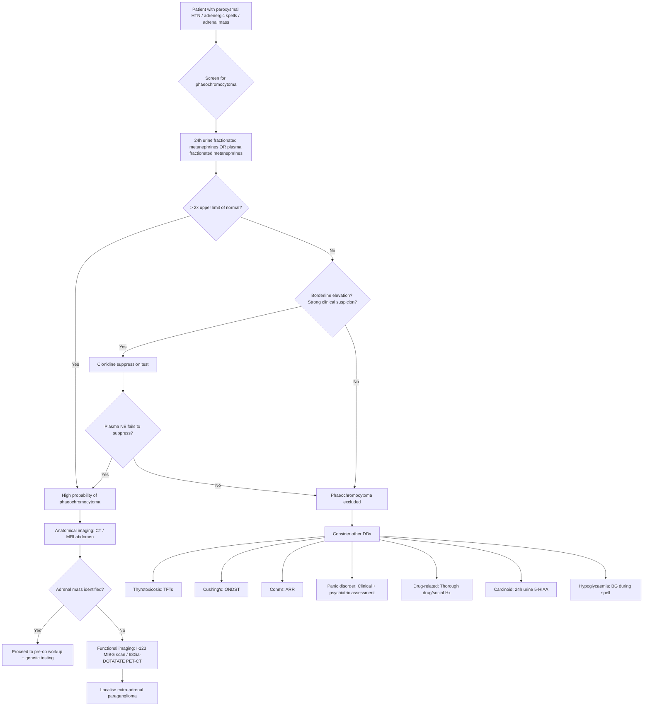

## Differential Diagnosis of Phaeochromocytoma

The differential diagnosis of phaeochromocytoma is really the differential of its **presenting features** — namely paroxysmal or sustained hypertension, adrenergic "spells" (headache, sweating, palpitations, pallor), and adrenal mass. The way to think about this is: "What else could mimic a catecholamine-excess state?" We will systematically work through the differentials by clinical presentation.

---

### 9.1 Conceptual Framework — Why is the DDx Important?

Phaeochromocytoma is **rare** (~0.1–0.6% of hypertensives) but **deadly if missed** [1][2]. The classic triad of headache + sweating + palpitations is non-specific — many conditions can mimic it. Conversely, phaeochromocytoma itself can masquerade as panic disorder, thyrotoxicosis, essential hypertension, or even an acute cardiac event. The differential therefore runs in two directions:

1. **Patient presents with adrenergic "spells"** → What else besides phaeochromocytoma?
2. **Patient presents with an adrenal mass** → What else besides phaeochromocytoma?

We will address both scenarios.

---

### 9.2 Differential Diagnosis of Adrenergic "Spells" (Paroxysmal Hypertension + Sympathetic Symptoms)

This is the core DDx in clinical practice and exams. The conditions below can all produce episodic hypertension, tachycardia, sweating, headache, and anxiety — the hallmarks of phaeochromocytoma.

#### A. Endocrine Causes

| Condition | Key Distinguishing Features | Why It Mimics Phaeochromocytoma |
|---|---|---|
| **Thyrotoxicosis** (hyperthyroidism) | Persistent (not paroxysmal) symptoms; weight loss despite ↑ appetite; heat intolerance; tremor; goitre; lid lag; AF. TFTs: ↑ T4, ↓ TSH | Thyroid hormones are synergistic with catecholamines — they upregulate β-adrenergic receptor expression, amplifying the sympathetic "tone." This causes tachycardia, sweating, tremor, hypermetabolism. But thyrotoxicosis is **continuous**, not paroxysmal. |
| **Carcinoid syndrome** | **Flushing** (NOT pallor), diarrhoea, bronchoconstriction, right-sided valvular heart disease. ↑ 24h urinary 5-HIAA | Serotonin and other vasoactive amines → episodic flushing and haemodynamic instability. Key distinction: **carcinoid = flushing; phaeochromocytoma = pallor** (α₁ vasoconstriction) [1][2] |
| **Primary hyperaldosteronism (Conn's syndrome)** | Sustained hypertension + hypokalaemia; no paroxysms; metabolic alkalosis. ↑ Aldosterone:Renin ratio (ARR) | Both cause hypertension, but Conn's is sustained and associated with **hypokalaemia** (K⁺ wasting). No sympathetic "spells." Differentiated by ARR screening [2] |
| **Cushing's syndrome** | Cushingoid habitus (moon face, buffalo hump, central obesity, striae, proximal myopathy); sustained hypertension; diabetes. ↑ cortisol on ONDST | Cortisol excess causes hypertension (via mineralocorticoid effect and vascular sensitisation to catecholamines) but is **sustained**, not paroxysmal. No classic triad. [2] |
| **Insulinoma / Hypoglycaemia** | Whipple's triad: hypoglycaemic symptoms + documented low BG + relief with glucose. Sweating, tremor, palpitations, anxiety | Hypoglycaemia triggers a **counter-regulatory catecholamine surge** (adrenal medulla releases adrenaline to raise glucose). This produces adrenergic symptoms identical to phaeochromocytoma. Key: check blood glucose during the "spell" — low glucose points to hypoglycaemia, not phaeochromocytoma [2] |
| **Medullary thyroid carcinoma (MTC)** | Thyroid nodule; elevated calcitonin; may have diarrhoea; often in MEN2 context | MTC can co-exist with phaeochromocytoma in MEN2. Calcitonin and prostaglandins from MTC can cause flushing and diarrhoea. If MEN2 is suspected, both must be investigated [1] |

#### B. Cardiovascular Causes

| Condition | Key Distinguishing Features | Why It Mimics |
|---|---|---|
| **Essential hypertension (with anxiety)** | By far the most common cause of "spells" in clinical practice; no biochemical catecholamine excess; responds to standard antihypertensives | "White coat hypertension" or anxiety-related surges can mimic paroxysmal hypertension. Negative metanephrines rule out phaeochromocytoma. |
| **Renovascular hypertension** | Young female (fibromuscular dysplasia) or elderly with atherosclerosis; renal artery bruit; resistant HTN; ↑ renin. MRA/CTA shows renal artery stenosis | Activation of RAAS → sustained hypertension. Not paroxysmal. |
| **Heart failure / Acute pulmonary oedema** | Dyspnoea, orthopnoea, PND, bilateral crepitations, raised JVP, peripheral oedema | Phaeochromocytoma crisis can present AS acute pulmonary oedema (catecholamine cardiomyopathy). If a young patient presents with unexplained APO, always consider phaeochromocytoma [2] |
| **Arrhythmias (e.g. paroxysmal SVT, AF)** | Palpitations, lightheadedness; ECG shows arrhythmia; no hypertension during episodes typically | Paroxysmal arrhythmias cause palpitations and sweating, but no sustained hypertension between episodes. ECG and Holter monitoring differentiate. |
| **Aortic coarctation** | Young patient; upper limb hypertension + radio-femoral delay; rib notching on CXR | Causes secondary hypertension but is structural, not hormonal. |

#### C. Neurological / Psychiatric Causes

| Condition | Key Distinguishing Features | Why It Mimics |
|---|---|---|
| **Panic disorder / Anxiety** | Situational triggers; symptoms occur in specific contexts (social, phobic); normal BP between attacks; normal metanephrines; responds to SSRIs/CBT | Panic attacks activate the sympathetic nervous system → tachycardia, sweating, tremor, chest tightness, feeling of doom. Clinically almost indistinguishable from phaeochromocytoma spells. **Any patient diagnosed with panic disorder should arguably have metanephrines checked at least once to rule out phaeochromocytoma.** |
| **Autonomic epilepsy (diencephalic epilepsy)** | Associated seizure activity; EEG abnormalities | Rare cause of paroxysmal sympathetic hyperactivity. |
| **Baroreflex failure** | Post-neck surgery or radiation; volatile BP; ↓ HR variability | Damage to baroreceptors (e.g. after carotid body tumour resection or neck irradiation) → loss of buffering → extreme BP lability. Normal metanephrines. |
| **Autonomic neuropathy (e.g. in diabetes)** | Known diabetic; postural hypotension predominates; loss of HR variability | Loss of autonomic regulation → fluctuating BP. |

#### D. Drug / Substance-Related Causes

| Substance | Mechanism |
|---|---|
| **Sympathomimetics** (cocaine, amphetamines, ephedrine, pseudoephedrine) | Directly stimulate catecholamine release or block reuptake → mimics catecholamine excess state. Always take a thorough drug and social history. |
| **MAO inhibitors + tyramine-containing foods** | MAOIs block catecholamine breakdown → tyramine in foods (cheese, wine, fermented products) triggers massive NE release → "cheese reaction" → hypertensive crisis |
| **Withdrawal syndromes** (alcohol, clonidine, beta-blockers) | Sudden cessation → rebound sympathetic activation → hypertension, tachycardia, sweating |
| **Tricyclic antidepressants (TCAs)** | Block NE reuptake → potentiate catecholamine effects; can also trigger a crisis in undiagnosed phaeochromocytoma [2] |
| **Caffeine excess** | Adenosine receptor antagonism → sympathetic activation; can cause palpitations, anxiety, tremor |

<Callout title="Common Exam Trap" type="error">
The most common misdiagnosis for phaeochromocytoma is **essential hypertension + panic disorder**. A young hypertensive patient with paroxysmal "anxiety attacks" who is dismissed as having panic disorder, only to later develop a hypertensive crisis intra-operatively — this is a classic exam scenario. The take-home: always check metanephrines in unexplained paroxysmal hypertension, resistant hypertension, or atypical panic disorder.
</Callout>

---

### 9.3 Differential Diagnosis of an Adrenal Mass (Adrenal Incidentaloma Context)

When phaeochromocytoma presents as an incidentally found adrenal mass, the DDx is that of **adrenal incidentaloma** [2]:

#### Benign Adrenal Masses

| Diagnosis | Frequency | Key Features |
|---|---|---|
| ***Non-functional adrenal adenoma*** | ***~80–90% of incidentalomas (MC)*** [2] | Lipid-rich on CT ( < 10 HU unenhanced); no hormonal excess; small ( < 4cm); stable on follow-up |
| **Adrenal cyst** | Uncommon | Well-defined, thin-walled, fluid density on CT |
| **Myelolipoma** | Uncommon | Contains macroscopic fat (negative HU on CT); pathognomonic appearance |
| **Haemangioma** | Rare | Vascular lesion; phleboliths may be seen |
| ***Functional adenoma (Cushing's / Conn's)*** | ~6% subclinical Cushing's; ~1% Conn's [2] | Screen with ONDST and ARR respectively |
| **Phaeochromocytoma** | ~5% of incidentalomas | Must exclude biochemically BEFORE any biopsy/surgery |

#### Malignant Adrenal Masses

| Diagnosis | Key Features |
|---|---|
| ***Adrenocortical carcinoma*** | Large ( > 4cm often > 6cm); irregular; high unenhanced HU ( > 10); may show steroid overproduction; heterogeneous enhancement + slow washout [2] |
| **Malignant phaeochromocytoma** | Defined by metastasis (cannot be distinguished histologically from benign); metastases to bone, liver, lung, lymph nodes [2] |
| ***Adrenal metastasis (secondary — more common than primary malignancy)*** | History of known primary malignancy (lung, breast, melanoma, kidney, colon are common primaries); bilateral in ~50%; often > 3cm; irregular [2] |
| **Neuroblastoma** | Predominantly in children ( < 5 years); elevated urine VMA/HVA; adrenal medulla origin (like phaeochromocytoma but undifferentiated neural crest) [1] |
| **Primary adrenal lymphoma** | Extremely rare; usually bilateral; associated with adrenal insufficiency |

<Callout title="The Three Screening Tests for Any Adrenal Incidentaloma">
For every adrenal incidentaloma, you must answer: **Functional? Malignant?** [2]

***Functional screening: ONDST + spot ARR + 24h urine metanephrines*** [2]

| Condition | Screening Test | Confirmation |
|---|---|---|
| Cushing's syndrome | 1mg ONDST ( > 50 nmol/L) | Low-dose DST |
| Conn's syndrome | Aldosterone:Renin ratio | Salt loading / saline suppression |
| Phaeochromocytoma | 24h urine metanephrines | Clonidine suppression test |

**Malignancy assessment**: Size ( > 4cm suspicious), growth rate ( > 0.5cm in 6 months), imaging characteristics (unenhanced HU > 10, heterogeneous, irregular margins, slow contrast washout).
</Callout>

---

### 9.4 Diagnostic Approach — Mermaid Flowchart

The following diagram summarises the clinical approach to differentiating phaeochromocytoma from its mimics:

---

### 9.5 Key Distinguishing Features — Summary Comparison Table

| Feature | Phaeochromocytoma | Thyrotoxicosis | Panic Disorder | Carcinoid | Cocaine/Amphetamine |
|---|---|---|---|---|---|
| **BP** | Paroxysmal or sustained ↑↑ | Mildly ↑ (systolic, wide pulse pressure) | Normal or mildly ↑ during attack | Normal or ↓ | Acutely ↑↑ |
| **Skin** | **Pallor** | Warm, moist, flushed | Normal / flushed | **Flushing** | Diaphoresis |
| **Weight** | ↓ (hypermetabolic) | ↓ (hypermetabolic) | Normal | ↓ (if metastatic) | Variable |
| **Paroxysmal?** | Yes (classic) | No (continuous) | Yes (situational) | Yes | Yes (related to use) |
| **Screening test** | Fractionated metanephrines | TFTs (TSH, fT4) | Clinical / GAD-7 / negative biochem | 24h urine 5-HIAA | Urine drug screen |
| **Diarrhoea** | Rare (constipation) | Yes (↑ GI motility) | No | Yes (serotonin) | No |
| **Postural hypotension** | Yes (paradoxical) | No | No | Possible | No |

---

### 9.6 Special Consideration — Differentiating Phaeochromocytoma from Other Functional Adrenal Tumours

Within the adrenal incidentaloma framework, the three functional conditions form a common exam comparison:

| Parameter | Phaeochromocytoma | Cushing's Syndrome | Conn's Syndrome |
|---|---|---|---|
| **Origin** | Adrenal medulla (chromaffin cells) | Adrenal cortex (zona fasciculata) | Adrenal cortex (zona glomerulosa) |
| **Hormone** | Catecholamines | Cortisol | Aldosterone |
| **BP pattern** | Paroxysmal ± sustained | Sustained | Sustained |
| **Key metabolic** | Hyperglycaemia, weight loss | Hyperglycaemia, weight gain, proximal myopathy | Hypokalaemia, metabolic alkalosis |
| **Classic clue** | Triad: headache, sweating, palpitations | Moon face, buffalo hump, striae | Hypertension + hypokalaemia |
| **Screen** | 24h urine metanephrines | 1mg ONDST | ARR |
| **Pre-op caution** | α-blockade → β-blockade, volume expansion | Steroid cover (suppressed HPA axis) | Correct K⁺ (spironolactone) |

---

### 9.7 Approach to "False Positives" in Biochemical Testing

An important clinical nuance: mildly elevated metanephrines do not always mean phaeochromocytoma. Understanding **false positives** is critical to avoid unnecessary surgery [2]:

| Cause of False Positive | Mechanism |
|---|---|
| ***Stress, acute illness, OSA*** [2] | Physiological sympathetic activation → increased catecholamine release → elevated metanephrines |
| ***Drugs: TCAs, α-agonists (e.g. clonidine withdrawal), levodopa, MAOIs, methyldopa, labetalol, sotalol*** [1][2] | Interfere with catecholamine metabolism or assay — e.g. TCAs block NE reuptake → higher synaptic NE → higher metanephrine production; labetalol can directly interfere with the HPLC assay |
| ***Caffeine, chocolate, bananas*** [1] | Contain catecholamines or catecholamine precursors that can mildly elevate urinary catecholamines (less of an issue with metanephrine assays) |
| **Chronic renal failure** | Impaired renal clearance → accumulation of metanephrines (plasma metanephrines preferred over 24h urine in CRF) [2] |
| **Sample collection issues** | Stress of venepuncture → sympathetic activation. ***Plasma samples should be drawn after 30 minutes of supine rest via an indwelling cannula*** [2] |

**Management of borderline results**: Stop interfering medications for at least 1 week (if safe) → repeat testing. If still borderline → **clonidine suppression test** [2].

<Callout title="Clonidine Suppression Test — How and Why">
**Clonidine** ("clon" = from Greek for "twig" — named for its structural similarity to certain compounds) is a central α₂-agonist. It activates presynaptic α₂ receptors in the brainstem → ↓ central sympathetic outflow → ↓ peripheral NE release → ↓ plasma catecholamines.

In a **normal person** or in **false positive** elevation: clonidine administration → plasma NE drops significantly (suppresses).

In **phaeochromocytoma**: the tumour autonomously secretes catecholamines independent of central sympathetic regulation → plasma NE **fails to suppress** after clonidine.

**Procedure** [2]: Fast overnight → indwelling cannula 30 min before → baseline bloods for Epi and NE (x2, 5 min apart) → PO clonidine 0.3mg with 250mL water → monitor BP/Pulse Q30min → bloods at 2h and 3h post-clonidine.

**C/I**: Pregnancy.
</Callout>

---

### 9.8 When Phaeochromocytoma Masquerades as Something Else

Just as other conditions mimic phaeochromocytoma, phaeochromocytoma can present atypically:

| Atypical Presentation | How It Mimics Another Condition |
|---|---|
| **Takotsubo-like cardiomyopathy** | Young patient with APO, apical ballooning on echo, normal coronaries — actually catecholamine cardiomyopathy |
| **Acute MI** | Demand ischaemia from severe HTN + coronary vasospasm → troponin rise, ECG changes |
| **Stroke / ICH** | Hypertensive crisis → intracerebral haemorrhage [2] |
| **Diabetes mellitus** | Chronic α₂-mediated insulin suppression + β₂ glycogenolysis → hyperglycaemia |
| **"Resistant" essential hypertension** | Sustained HTN not responding to standard therapy — always check metanephrines |
| **Perioperative crisis** | Undiagnosed phaeochromocytoma → anaesthetic induction → crisis → cardiovascular collapse. This is the #1 reason screening is mandatory before any adrenal surgery. |

---

<Callout title="High Yield Summary — DDx">

1. **The DDx of phaeochromocytoma is the DDx of paroxysmal hypertension + adrenergic spells + adrenal mass.**

2. **Most common mimic in clinical practice**: Essential hypertension + panic disorder. Always check metanephrines in atypical anxiety with hypertension.

3. **Key distinction from carcinoid**: Phaeochromocytoma = **pallor**; Carcinoid = **flushing**.

4. **Key distinction from thyrotoxicosis**: Thyrotoxicosis = **continuous**; Phaeochromocytoma = **paroxysmal**.

5. **Adrenal incidentaloma DDx**: Non-functional adenoma (MC), functional adenoma (Cushing's/Conn's/Phaeo), adrenocortical carcinoma, metastasis (more common than primary malignancy), myelolipoma, cyst. Screening: ***ONDST + ARR + 24h urine metanephrines***.

6. **False positives**: Stress, OSA, drugs (TCAs, labetalol, methyldopa, levodopa), caffeine, chocolate, bananas, CRF. Manage by stopping interfering drugs → repeat testing → clonidine suppression test if borderline.

7. **Clonidine suppression test**: Central α₂-agonist → suppresses NE release from normal sympathetic neurons; autonomous tumour secretion is **not suppressed** → failure to suppress = phaeochromocytoma.

8. **Phaeochromocytoma can masquerade as**: Takotsubo, acute MI, stroke/ICH, resistant HTN, perioperative crisis, diabetes.

</Callout>

---

<ActiveRecallQuiz
  title="Active Recall - Differential Diagnosis of Phaeochromocytoma"
  items={[
    {
      question: "A 42-year-old woman presents with episodic headaches, sweating, and palpitations. Her GP diagnoses panic disorder. What single investigation would you request to rule out phaeochromocytoma, and why is it superior to measuring catecholamines directly?",
      markscheme: "24-hour urinary fractionated metanephrines (or plasma fractionated metanephrines). Superior because chromaffin tumour cells continuously metabolise catecholamines to metanephrines via COMT within the tumour, producing constant elevation even between paroxysms. Parent catecholamines are released episodically and may be normal between attacks, leading to false negatives."
    },
    {
      question: "How do you distinguish phaeochromocytoma from carcinoid syndrome on clinical grounds?",
      markscheme: "Phaeochromocytoma causes PALLOR (alpha-1 cutaneous vasoconstriction), hypertension, and no diarrhoea. Carcinoid syndrome causes FLUSHING (serotonin/histamine-mediated vasodilation), hypotension, diarrhoea, and bronchoconstriction. Screening: metanephrines for phaeochromocytoma vs 24h urine 5-HIAA for carcinoid."
    },
    {
      question: "Name the three mandatory screening tests for a newly discovered adrenal incidentaloma and what each screens for.",
      markscheme: "1) 1mg overnight dexamethasone suppression test (ONDST) - screens for Cushing's syndrome. 2) Aldosterone:Renin ratio (ARR) - screens for Conn's syndrome (primary hyperaldosteronism). 3) 24-hour urine fractionated metanephrines - screens for phaeochromocytoma. Must exclude phaeochromocytoma before any biopsy or surgery."
    },
    {
      question: "A patient's 24h urine metanephrines are mildly elevated (1.5x ULN). They take amitriptyline for chronic pain and drink 6 cups of coffee daily. What is the most appropriate next step?",
      markscheme: "Consider false positive causes. Stop amitriptyline (TCA - blocks NE reuptake, increases metanephrine production) and reduce caffeine for at least 1 week, then repeat 24h urine metanephrines. If still borderline, perform a clonidine suppression test: autonomous tumour secretion will fail to suppress, whereas physiological/drug-related elevation will suppress normally."
    },
    {
      question: "Explain the physiological basis of the clonidine suppression test for phaeochromocytoma.",
      markscheme: "Clonidine is a central alpha-2 agonist that reduces central sympathetic outflow, thereby decreasing peripheral norepinephrine release from normal sympathetic nerve terminals. In healthy individuals or false positive elevations, plasma NE suppresses after clonidine. In phaeochromocytoma, catecholamine secretion is autonomous from the tumour and independent of central sympathetic regulation, so plasma NE fails to suppress. Failure to suppress confirms phaeochromocytoma."
    }
  ]}
/>

## References

[1] Senior notes: felixlai.md (Phaeochromocytoma sections, pages 1031–1034)
[2] Senior notes: maxim.md (Phaeochromocytoma, Adrenal incidentaloma, and Adrenalectomy sections, pages 202–206)
