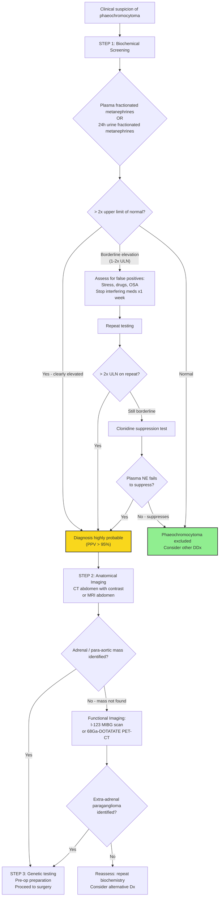
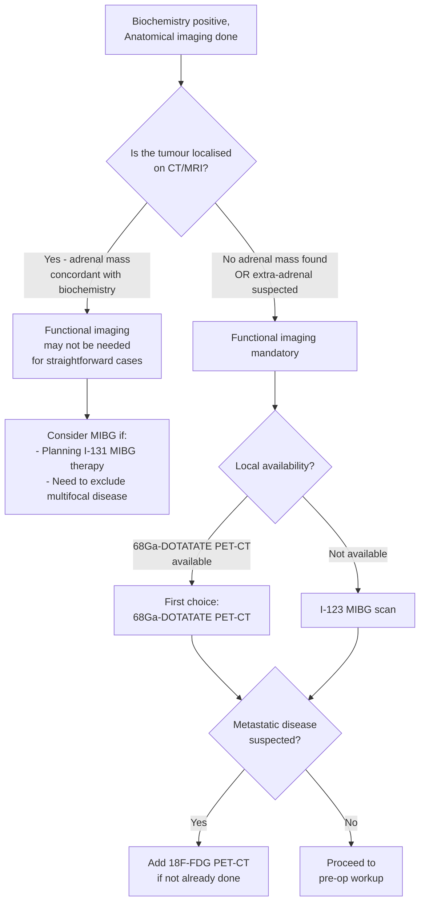

## Diagnosis of Phaeochromocytoma — Criteria, Algorithm & Investigation Modalities

### 10.1 Diagnostic Principles — First Principles Thinking

There is no single "diagnostic criterion" for phaeochromocytoma the way there is for, say, rheumatic fever (Jones criteria) or SLE (ACR criteria). Instead, the diagnosis rests on a **two-step approach**:

1. **Biochemical confirmation** of catecholamine excess (establish that the tumour is secreting)
2. **Anatomical localisation** of the tumour (find out where it is)

This order is deliberate and non-negotiable. You must **biochemically prove** the diagnosis before imaging, because:
- An adrenal mass on CT could be anything (most are non-functional adenomas) [2]
- If you image first and find a mass, you still need biochemistry to prove it is a phaeochromocytoma
- Imaging before biochemistry can lead to unnecessary biopsies — ***biopsy is NOT required and carries a high risk of hypertensive crisis and haematoma*** [2]

A third step is added in the modern era:
3. **Genetic testing** — recommended for all patients (up to 40% harbour germline mutations)

<Callout title="The Cardinal Rule">
**Biochemistry FIRST → Imaging SECOND → Genetics THIRD**

Never biopsy an adrenal mass without first excluding phaeochromocytoma biochemically. Never start a beta-blocker without first establishing alpha-blockade. The order matters and can be life-saving.
</Callout>

---

### 10.2 Indications for Biochemical Testing (Who to Test?)

Test for phaeochromocytoma in [1][2]:

1. **Paroxysmal hypertension** — especially if young ( < 40 years)
2. **Resistant hypertension** — uncontrolled on ≥3 drugs including a diuretic
3. **Adrenal incidentaloma** — any mass > 1cm found incidentally (***screening tests: ONDST + spot ARR + 24h urine metanephrines***) [2]
4. **Classic triad** — episodic headache + sweating + palpitations
5. **Hypertensive crisis** — during anaesthesia, surgery, or contrast administration
6. **Family history** — MEN2, VHL, NF1, SDHx mutation carriers
7. **Known hereditary syndrome** — even if asymptomatic (surveillance)
8. **Unexplained cardiomyopathy** — especially Takotsubo-like in a young patient
9. ***Pressor response during procedures or with certain drugs (e.g. TCA, IV contrast) or food (cheese)*** [2]

---

### 10.3 Diagnostic Algorithm — Master Flowchart

---

### 10.4 STEP 1: Biochemical Investigations (Screening & Confirmation)

#### A. First-Line Screening Tests

There are two equivalent first-line options. The choice depends on local availability and clinical context:

| Test | Sensitivity | Specificity | Key Advantages | Key Limitations |
|---|---|---|---|---|
| ***24-hour urinary fractionated catecholamines and metanephrines*** [1] | ~97% (metanephrines component) | ~91% | Non-invasive; no cannulation needed; integrates secretion over 24h | Requires proper collection; affected by diet/drugs; difficult in CRF |
| ***Plasma fractionated metanephrines*** [1][2] | ~96–99% | ~85–89% | ***Most specific*** [2]; single blood draw; preferred in CRF | Requires ***indwelling catheter > 30 min supine rest*** to avoid false positives; lower specificity than urine |

<Callout title="Why Fractionated Metanephrines Are Superior to VMA">
**Urinary VMA** was historically the classic test but has been superseded because of poor sensitivity (~64%). Why?

VMA is the **end product** of catecholamine metabolism (catecholamines → metanephrines → VMA). By the time VMA is formed, the signal has been "diluted" through multiple metabolic steps and is influenced by dietary vanillin (vanilla-containing foods). Metanephrines are **one step closer** to the source and are produced **continuously within the tumour** by COMT, regardless of episodic catecholamine release [1][2].

**Sensitivity hierarchy**: Fractionated metanephrines ( > 96%) > Fractionated catecholamines (~86%) > VMA (~64%)
</Callout>

#### B. 24-Hour Urinary Fractionated Catecholamines and Metanephrines — Practical Details

***Preparation before urine collection*** [1]:
- ***Avoid dietary intake of caffeine, chocolate and bananas before the test*** — these contain catecholamines or their precursors that can elevate urinary catecholamines
- ***Avoid usage of drugs such as methyldopa, labetalol, sotalol which can create false positive (FP) results*** — stop 1 week before if safe [1][2]
- Other drugs to stop: TCAs, α-agonists, levodopa, MAOIs, decongestants (pseudoephedrine) [2]
- ***Urine specimen should be kept refrigerated during collection till hospital*** — catecholamines are unstable and degrade at room temperature [1]
- Collection: acidified container (pH < 3, usually HCl added) to preserve catecholamines

***Components and abnormal thresholds*** [1]:

| Component | Abnormal Threshold | What It Represents |
|---|---|---|
| Epinephrine | > 35 mcg/24h | Adrenal tumour (has PNMT) |
| Norepinephrine | > 170 mcg/24h | Adrenal or extra-adrenal tumour |
| Dopamine | > 700 mcg/24h | Rare; associated with malignancy |
| ***Metanephrine*** | ***> 400 mcg/24h (most sensitive)*** [1] | COMT metabolite of epinephrine |
| Normetanephrine | > 900 mcg/24h | COMT metabolite of norepinephrine |

***Abnormal if > 2x elevation*** of upper limit of normal — this is the widely accepted cut-off for a "diagnostic" result [2]. Borderline elevations (1–2x ULN) warrant investigation for false positives and repeat testing.

#### C. Plasma Fractionated Metanephrines — Practical Details

***Preferred in chronic renal failure because 24h urine sample is difficult to interpret*** (impaired GFR → catecholamine metabolite accumulation → unreliable urine values) [2].

**Sampling protocol** [2]:
- ***Need indwelling catheter > 30 min*** — insert IV cannula → patient lies supine for **30 minutes** → draw blood
- Why? Venepuncture itself is a sympathetic stimulus → can cause transient catecholamine surge → false positive. The 30-minute rest period allows the stress response to subside.
- Fasting state preferred (catecholamine-containing foods can interfere)

**Interpretation**:
- **Metanephrine** (plasma): > 0.31 nmol/L (varies by lab)
- **Normetanephrine** (plasma): > 0.61 nmol/L (varies by lab)
- **> 4x ULN**: virtually diagnostic (PPV approaches 100%)
- **1–4x ULN**: borderline — repeat testing, clonidine suppression test

#### D. Sources of False Positives and How to Manage Them

| Source | Mechanism | Management |
|---|---|---|
| ***Stress, acute illness, OSA*** [2] | Physiological sympathetic activation → ↑ catecholamine release | Test when patient is stable and rested; treat OSA |
| ***TCAs*** | Block NE reuptake → ↑ synaptic NE → ↑ COMT activity → ↑ metanephrines | Stop 1 week before testing |
| ***α-agonists (e.g. clonidine if recently stopped)*** | Rebound sympathetic activation on withdrawal | Gradual taper before testing |
| ***Levodopa*** [2] | Precursor to dopamine → metabolised to catecholamines | Stop 1 week before testing |
| ***Methyldopa, labetalol, sotalol*** [1] | Methyldopa is structurally similar to catecholamines and interferes with assay; labetalol co-elutes with catecholamines on HPLC | Stop 1 week before testing; switch to alternative antihypertensives |
| ***Caffeine, chocolate, bananas*** [1] | Contain catecholamines/precursors | Dietary restriction during collection |
| **Sympathomimetics** (pseudoephedrine, amphetamines) | Directly stimulate catecholamine release | Drug history; urine drug screen |
| **CRF** | Impaired renal clearance of metanephrines | Use plasma (not urine) metanephrines |

#### E. Confirmatory Test — Clonidine Suppression Test

Used only when there is ***strong clinical suspicion but above tests inconclusive*** (borderline elevations, typically 1–2x ULN) [2].

**Principle**: Clonidine is a central α₂-agonist → stimulates presynaptic α₂ receptors in the brainstem → ↓ central sympathetic outflow → ↓ peripheral NE release. In a **normal subject**, plasma NE falls by > 50% or to < 2.96 nmol/L (500 pg/mL). In **phaeochromocytoma**, the tumour autonomously secretes catecholamines independent of central sympathetic control → **NE fails to suppress**.

***Procedure*** [2]:
1. Fast overnight
2. Insert cannula 30 minutes before test
3. Take bloods for Epi and NE x2 (5 minutes apart) — baseline
4. Give **PO clonidine 0.3mg** with 250mL water
5. Closely monitor **BP/Pulse Q30min** for postural hypotension and bradycardia (side effects of clonidine)
6. Take bloods for Epi and NE at **2h and 3h** after clonidine

**Interpretation**:

| Result | Interpretation |
|---|---|
| Plasma NE decreases by > 50% AND falls below 2.96 nmol/L | **Normal** — phaeochromocytoma excluded |
| Plasma NE fails to decrease by > 50% OR remains above 2.96 nmol/L | **Positive** — phaeochromocytoma confirmed |

***C/I in pregnancy*** [2] (risk of fetal hypotension and bradycardia).

<Callout title="When to Use Which Test" type="idea">

| Clinical Scenario | Preferred Initial Test |
|---|---|
| Standard outpatient screening | 24h urine fractionated metanephrines |
| Chronic renal failure | Plasma fractionated metanephrines |
| High clinical suspicion, need rapid answer | Plasma fractionated metanephrines |
| Borderline results despite drug washout | Clonidine suppression test |
| Adrenal incidentaloma workup | 24h urine fractionated metanephrines (part of triple screen with ONDST + ARR) |

</Callout>

---

### 10.5 STEP 2: Imaging — Anatomical Localisation

Once biochemistry confirms catecholamine excess, the next step is to **find** the tumour. The approach uses anatomical imaging first, then functional imaging if needed.

#### A. CT Abdomen and Pelvis (First-Line Anatomical Imaging)

***CT is preferred over MRI due to the superior spatial resolution of CT in thorax, abdomen and pelvis*** [1].

**Protocol**: Contrast-enhanced CT with adrenal protocol (non-enhanced, arterial, portal venous, and 15-minute delayed phases).

**Key safety note**: ***CT: alpha blockade prior to administration of IV contrast (risk of HT crisis)*** [2]. However, ***low-osmolar contrast is safe even without alpha/beta blockade*** [2] — modern low-osmolar or iso-osmolar contrast agents rarely trigger catecholamine release. The historical concern was with high-osmolar ionic contrast agents.

**CT Findings of Phaeochromocytoma**:

| Feature | Typical Finding | Why |
|---|---|---|
| **Size** | Usually > 3cm at diagnosis (often 3–5cm) | Functional tumour → symptoms lead to detection before it grows too large, but still tends to be larger than non-functional adenomas |
| **Density (unenhanced)** | **> 10 HU** | Phaeochromocytomas are NOT lipid-rich (unlike adrenal adenomas, where 70% have high lipid content → < 10 HU). Chromaffin cells contain catecholamine granules, not lipid droplets [2] |
| **Enhancement** | Avid, heterogeneous enhancement | Rich vascular supply (remember: 3 arterial feeders to the adrenal gland) |
| **Contrast washout** | ***< 40% relative washout or < 60% absolute washout*** [2] | Phaeochromocytomas retain contrast (slow washout), unlike adenomas which wash out quickly. This is because the tumour's vascular architecture traps contrast. |
| **Morphology** | May show central necrosis, cystic change, or calcification if large | Rapid growth → outstrips blood supply → central ischaemia → necrosis |
| **Bilateral** | ~10–20% (more if familial, especially MEN2) | MEN2: ~50–80% bilateral |
| **Extra-adrenal** | Para-aortic mass, bladder wall thickening, thoracic mass | Paragangliomas along sympathetic chain |

**CT Features Suggesting Malignancy (in adrenal incidentaloma context)** [2]:
- ***Size > 4cm*** (25% risk of malignancy)
- ***Growing > 0.5cm over 6 months***
- Irregular shape, heterogeneous, ill-defined border, hypervascularity, central necrosis
- ***Hounsfield unit: > 10 HU***
- ***Contrast wash-out: < 40% relative washout or < 60% absolute washout***
- Local invasion
- Para-aortic lesions (lymphadenopathy)
- Contralateral involvement

> **Key concept**: CT characteristics alone cannot distinguish benign from malignant phaeochromocytoma — ***malignant phaeochromocytoma is defined by metastasis***, not by imaging features [2]. However, CT can identify metastatic deposits (bone, liver, lung, lymph nodes).

#### B. MRI Abdomen (Alternative Anatomical Imaging)

***T2-MRI with gadolinium contrast*** [2] — preferred in:
- **Pregnancy** (no ionising radiation)
- **Children** (minimise radiation exposure)
- **Allergy to iodinated contrast**
- **Surveillance of known hereditary syndromes** (repeated imaging over a lifetime)
- When CT is equivocal

**Classic MRI Findings of Phaeochromocytoma**:

| Sequence | Finding | Why |
|---|---|---|
| **T2-weighted** | **"Light bulb" sign** — markedly hyperintense (bright) | The intracellular water content and vascular nature of phaeochromocytoma cause long T2 relaxation time. This is the classic and most frequently tested MRI feature. |
| **T1-weighted** | Iso- to hypointense | Non-specific |
| **Post-gadolinium** | Avid enhancement | Rich blood supply |
| **Chemical shift imaging** | No signal loss on out-of-phase | Unlike lipid-rich adenomas, phaeochromocytomas lack intracytoplasmic fat, so there is no signal drop on opposed-phase imaging |

<Callout title="The 'Light Bulb' Sign on T2 MRI" type="idea">
The classic exam description: phaeochromocytoma is very bright on T2-weighted MRI, sometimes described as "light bulb bright." This is because the tumour has high water content (cystic/necrotic areas) and is highly vascular. However, this sign is **not pathognomonic** — other adrenal masses (metastases, adrenocortical carcinoma) can also be T2-bright. It is suggestive but must be interpreted alongside biochemistry.
</Callout>

#### C. Comparison: Phaeochromocytoma vs Adrenal Adenoma on Imaging

| Feature | Adrenal Adenoma | Phaeochromocytoma |
|---|---|---|
| Unenhanced CT density | **< 10 HU** (lipid-rich, ~70%) | **> 10 HU** (non-lipid-rich) |
| Contrast washout | **> 60% absolute, > 40% relative** | **< 60% absolute, < 40% relative** |
| T2 MRI | Iso- to mildly hyperintense | **Markedly hyperintense** ("light bulb") |
| Chemical shift MRI | Signal drop on out-of-phase (lipid content) | No signal drop |
| Size | Usually < 3cm | Usually > 3cm |
| Bilateral | Uncommon (unless BIAH) | 10–20% (higher if familial) |

---

### 10.6 STEP 2b: Functional Imaging — When Anatomical Imaging Is Negative or Extra-Adrenal Disease Is Suspected

***Functional imaging is indicated if CT abdomen and pelvis are negative in the presence of clinical and biochemical evidence of phaeochromocytoma*** [1], or to assess for **metastatic disease** or **multifocal disease**.

#### A. I-123 MIBG Scan (Metaiodobenzylguanidine Scintigraphy)

***MIBG (metaiodobenzylguanidine): NE analog, taken up by pheochromocytoma*** [2].

**How it works**: MIBG is structurally similar to norepinephrine. It is taken up by the norepinephrine transporter (NET) on chromaffin cells → stored in catecholamine storage granules (like real NE). Labelled with I-123 (or I-131 for therapy), it allows nuclear medicine imaging of all chromaffin tissue in the body.

**Protocol**: IV injection of I-123 MIBG → imaging at 24h and 48h → look for focal uptake in adrenal or extra-adrenal locations.

**Key features**:

| Parameter | Detail |
|---|---|
| Sensitivity | ~85–90% for adrenal phaeochromocytoma; lower for extra-adrenal/metastatic (~60–70%) |
| Specificity | ~95–100% (very few false positives) |
| Advantages | Whole-body survey; high specificity; can identify extra-adrenal and metastatic disease; also serves as a selection tool for I-131 MIBG therapy |
| Limitations | Lower sensitivity for small tumours, extra-adrenal locations, or SDHx-mutated tumours; requires thyroid blockade (potassium iodide) to prevent thyroid uptake of free iodine |
| Drug interactions | Stop medications that interfere with NET (TCAs, labetalol, reserpine, calcium channel blockers) 1–2 weeks before scan |

#### B. 68Ga-DOTATATE PET-CT

***PET-CT: 68Gallium-DOTATATE — to detect metastatic disease*** [2].

**How it works**: DOTATATE ("DOTA" = chelator; "TATE" = octreotate, a somatostatin analogue) binds to **somatostatin receptor subtype 2 (SSTR2)**, which is expressed on most neuroendocrine tumours including phaeochromocytoma. 68Gallium is a PET isotope → high spatial resolution.

**Key features**:

| Parameter | Detail |
|---|---|
| Sensitivity | **> 95%** for paraganglioma; superior to MIBG especially for extra-adrenal, metastatic, and SDHx-mutated tumours |
| Specificity | ~85–90% |
| Advantages | Highest sensitivity of any functional imaging modality; excellent for SDHx-related disease; PET resolution > scintigraphy |
| Limitations | Availability; cost; non-specific for chromaffin tissue (any SSTR2-expressing tumour will light up) |
| Current role | **Increasingly first-line functional imaging** (replacing MIBG in many centres), especially for metastatic workup and SDHx-mutated disease |

#### C. 18F-FDG PET-CT

***FDG-PET: more sensitive for detection of metastatic diseases*** [1].

**How it works**: FDG (fluorodeoxyglucose) is taken up by metabolically active cells. Phaeochromocytomas (especially malignant) have increased glucose metabolism.

| Parameter | Detail |
|---|---|
| Sensitivity | Variable (70–95%); best for malignant/metastatic disease and SDHB-mutated tumours |
| Specificity | Lower than MIBG or DOTATATE (any metabolically active lesion will light up — infections, other malignancies) |
| Role | Complementary when MIBG is negative and DOTATATE unavailable; useful for aggressive/malignant disease |

#### D. Functional Imaging Selection — Practical Decision-Making

---

### 10.7 STEP 3: Genetic Testing

**Current guidelines (Endocrine Society 2024) recommend genetic testing for ALL patients with phaeochromocytoma/paraganglioma** [3], regardless of family history, because:
- Up to 40% have germline mutations
- Identifies at-risk family members for surveillance
- Guides surgical approach (bilateral risk in MEN2, malignancy risk in SDHB)
- Determines follow-up intensity

**Genes to test** (usually via a multigene panel):

| Gene | Syndrome | Key Implication |
|---|---|---|
| **RET** | MEN2A/2B | Bilateral phaeo; screen for MTC; prophylactic thyroidectomy |
| **VHL** | Von Hippel-Lindau | Screen for RCC, haemangioblastoma, retinal angioma |
| **NF1** | Neurofibromatosis type 1 | Clinical diagnosis usually; café-au-lait, neurofibromas |
| **SDHB** | Hereditary paraganglioma syndrome | Highest malignancy risk (~30–40%); aggressive surveillance |
| **SDHD** | Hereditary paraganglioma syndrome | Head/neck paraganglioma; paternal transmission |
| **SDHA, SDHC, SDHAF2** | Hereditary paraganglioma syndrome | Variable penetrance |
| **TMEM127, MAX, FH** | Rare hereditary syndromes | Emerging importance |

**Approach to genetic testing**:
- Start with a **next-generation sequencing (NGS) multigene panel** covering all known susceptibility genes
- If a specific syndrome is clinically obvious (e.g. NF1 with café-au-lait spots), targeted testing may suffice
- Cascade testing for first-degree relatives if a pathogenic variant is identified

---

### 10.8 Additional Investigations — Assessing End-Organ Damage and Pre-operative Workup

Once the diagnosis is confirmed, additional investigations serve to:
1. Assess cardiovascular complications (target organ damage)
2. Prepare for surgery
3. Exclude co-existing tumours in hereditary syndromes

| Investigation | Purpose | Key Findings |
|---|---|---|
| **ECG** | Arrhythmia screening; LVH; ST changes | Sinus tachycardia, LVH, ST depression (demand ischaemia), T-wave inversion |
| **Echocardiography** | Assess for catecholamine cardiomyopathy | LV dysfunction, wall motion abnormalities (Takotsubo-like), LVH |
| **Fundoscopy** | Hypertensive retinopathy | AV nipping, flame haemorrhages, papilloedema |
| **Fasting glucose / HbA1c** | Glucose intolerance or diabetes | Elevated (α₂ → ↓ insulin; β₂ → ↑ glycogenolysis) |
| **RFT** | Renal function (hypertensive nephropathy) | May show ↑ creatinine if chronic hypertension |
| **Calcium, PTH** | Screen for MEN2A (co-existing PHPT) | ↑ Ca, ↑ PTH if parathyroid hyperplasia |
| **Calcitonin, CEA** | Screen for MTC in MEN2 | Elevated calcitonin if MTC present |
| **Chromogranin A** | Non-specific neuroendocrine marker | Elevated; ***not useful for diagnosis*** but useful for ***disease monitoring*** post-operatively [2] |
| **FBC, coagulation** | Pre-operative baseline | Usually normal |

---

### 10.9 Special Considerations

#### A. Biopsy — When and When NOT

***Biopsy is NOT required: high risk of hypertensive crisis and haematoma*** [2].

***FNA biopsy is NOT indicated: cannot differentiate between benign and malignant mass, risk of tumor seeding*** [2] (this applies to adrenocortical carcinoma as well).

The **only** scenario where FNA of an adrenal mass is useful is ***ruling out metastasis*** in a patient with a **known extra-adrenal primary malignancy** and an adrenal mass — and even then, **phaeochromocytoma must be excluded biochemically first** [2].

#### B. Malignancy Assessment

***Histologically and biochemically indistinguishable from benign disease, defined by metastasis*** [2].

There is no histological feature that reliably predicts malignancy. The **PASS score** (Pheochromocytoma of the Adrenal gland Scaled Score) attempts to risk-stratify using features like vascular invasion, capsular invasion, mitotic figures, and necrosis — PASS ≥ 4 suggests potentially malignant behaviour — but it is imperfect and not universally adopted.

**Clinical features suggesting malignancy**:
- Extra-adrenal location (paraganglioma, especially with SDHB)
- Large size ( > 5cm)
- Dopamine-secreting tumour
- SDHB mutation
- Presence of metastasis at diagnosis (bone, liver, lung, lymph nodes)

---

### 10.10 Summary Table — Investigation Modalities at a Glance

| Modality | Role | Sensitivity | Specificity | Key Interpretation Point |
|---|---|---|---|---|
| **24h urine fractionated metanephrines** | Screening | ~97% | ~91% | ***Abnormal if > 2x ULN***; ***metanephrine most sensitive*** [1] |
| **Plasma fractionated metanephrines** | Screening (preferred in CRF) | ~96–99% | ~85–89% | ***Most specific***; need 30 min supine rest [2] |
| **24h urine catecholamines** | Supplementary | ~86% | ~88% | Episodic secretion → lower sensitivity |
| **Urinary VMA** | Historical, largely superseded | ~64% | ~95% | Too many false negatives |
| **Clonidine suppression test** | Confirmation (borderline cases) | ~97% | ~100% | NE fails to suppress → positive |
| **CT abdomen (contrast, adrenal protocol)** | Anatomical localisation (1st line) | ~90–95% | ~70% | > 10 HU, slow washout, heterogeneous |
| **MRI abdomen** | Anatomical localisation (alternative) | ~90–95% | ~70% | T2 "light bulb" sign; no signal drop on chemical shift |
| **I-123 MIBG scan** | Functional imaging | ~85–90% | ~95–100% | NE analogue; high specificity |
| **68Ga-DOTATATE PET-CT** | Functional imaging (preferred) | > 95% | ~85–90% | Best for paraganglioma, metastatic, SDHx |
| **18F-FDG PET-CT** | Metastatic disease | ~70–95% | Lower | Best for aggressive/malignant disease |
| **Genetic testing (NGS panel)** | Hereditary syndrome identification | N/A | N/A | All patients; guides management and surveillance |

---

<Callout title="High Yield Summary — Diagnosis">

1. **Order**: Biochemistry FIRST → Imaging SECOND → Genetics THIRD. Never biopsy without excluding phaeo first.

2. **Screening**: ***24h urine fractionated metanephrines*** (or plasma fractionated metanephrines). ***Metanephrine is the most sensitive component***. ***Abnormal if > 2x ULN***.

3. **False positives**: Stress, OSA, drugs (TCAs, labetalol, methyldopa, levodopa), caffeine, chocolate, bananas, CRF. Stop interfering drugs 1 week before.

4. **Plasma metanephrines preferred in CRF** (urine unreliable). Require **30 min supine rest with indwelling cannula**.

5. **Clonidine suppression test**: For borderline results. Phaeochromocytoma = NE fails to suppress (autonomous secretion). C/I in pregnancy.

6. **CT first-line imaging**: > 10 HU, < 60% absolute washout, heterogeneous enhancement. ***Low-osmolar contrast safe even without blockade***.

7. **MRI**: T2 "light bulb" sign. Preferred in pregnancy, children, surveillance.

8. **Functional imaging**: MIBG (NE analogue, high specificity) or 68Ga-DOTATATE PET-CT (highest sensitivity, especially for paraganglioma/SDHx). FDG-PET for metastatic disease.

9. ***Biopsy is NOT required*** — risk of hypertensive crisis. Only role: exclude metastasis in known malignancy after phaeo excluded.

10. **Genetic testing for ALL patients** — up to 40% germline mutations. Multigene NGS panel.

11. ***Malignancy defined by metastasis, not histology*** — benign and malignant are histologically indistinguishable.

</Callout>

---

<ActiveRecallQuiz
  title="Active Recall - Diagnosis of Phaeochromocytoma"
  items={[
    {
      question: "A patient has a 4.5cm adrenal mass on CT with an unenhanced density of 35 HU and 30% absolute contrast washout. Their 24h urine metanephrines are 3x ULN. What is the most likely diagnosis, and why do these CT features support it?",
      markscheme: "Phaeochromocytoma. CT features: greater than 10 HU (non-lipid-rich, unlike adenomas which are typically less than 10 HU due to high lipid content), less than 60% absolute washout (phaeochromocytomas retain contrast due to vascular tumour architecture), and 4.5cm size. Biochemistry confirms catecholamine excess at 3x ULN. These features collectively distinguish it from a benign non-functional adenoma."
    },
    {
      question: "Why is plasma fractionated metanephrine testing preferred over 24h urine metanephrines in a patient with chronic renal failure on haemodialysis?",
      markscheme: "In CRF, impaired GFR leads to accumulation and unreliable clearance of catecholamine metabolites in urine, making 24h urine collection difficult to interpret. Plasma fractionated metanephrines are measured directly in blood and are not affected by GFR. Must be drawn via indwelling cannula after 30 minutes supine rest to avoid false positives from venepuncture stress."
    },
    {
      question: "A patient with biochemically confirmed phaeochromocytoma has a normal CT abdomen. What is the next investigation and why?",
      markscheme: "Functional imaging: 68Ga-DOTATATE PET-CT (preferred, sensitivity greater than 95%) or I-123 MIBG scan. Rationale: if biochemistry is positive but CT is negative, the tumour is likely extra-adrenal (paraganglioma). MIBG is a norepinephrine analogue taken up by chromaffin cells anywhere in the body. DOTATATE binds somatostatin receptors on neuroendocrine tumours. These whole-body scans can localise extra-adrenal paragangliomas (para-aortic, bladder, thorax, head and neck)."
    },
    {
      question: "Explain the clonidine suppression test: principle, protocol, interpretation, and one contraindication.",
      markscheme: "Principle: Clonidine is a central alpha-2 agonist that reduces sympathetic outflow, lowering peripheral NE release from normal neurons. Autonomous tumour secretion is unaffected. Protocol: fast overnight, indwelling cannula 30 min before, baseline bloods for Epi and NE x2, PO clonidine 0.3mg with water, monitor BP and pulse Q30min, repeat bloods at 2h and 3h. Interpretation: failure of plasma NE to suppress by greater than 50% or remain above 2.96 nmol/L equals positive for phaeochromocytoma. C/I: pregnancy (risk of fetal hypotension and bradycardia)."
    },
    {
      question: "Why should you NEVER biopsy a suspected phaeochromocytoma? Name the only clinical scenario where adrenal FNA might be appropriate.",
      markscheme: "Biopsy can trigger massive catecholamine release leading to hypertensive crisis (APO, ICH, arrhythmia) which can be fatal. Also cannot distinguish benign from malignant phaeochromocytoma histologically. The only appropriate scenario for adrenal FNA is to rule out adrenal metastasis in a patient with a known extra-adrenal primary malignancy and an adrenal incidentaloma, AFTER phaeochromocytoma has been biochemically excluded."
    }
  ]}
/>

## References

[1] Senior notes: felixlai.md (Phaeochromocytoma sections, pages 1031–1035)
[2] Senior notes: maxim.md (Phaeochromocytoma, Adrenal incidentaloma, and Adrenalectomy sections, pages 202–206)
[3] Endocrine Society Clinical Practice Guideline: Pheochromocytoma and Paraganglioma (2024 update)
