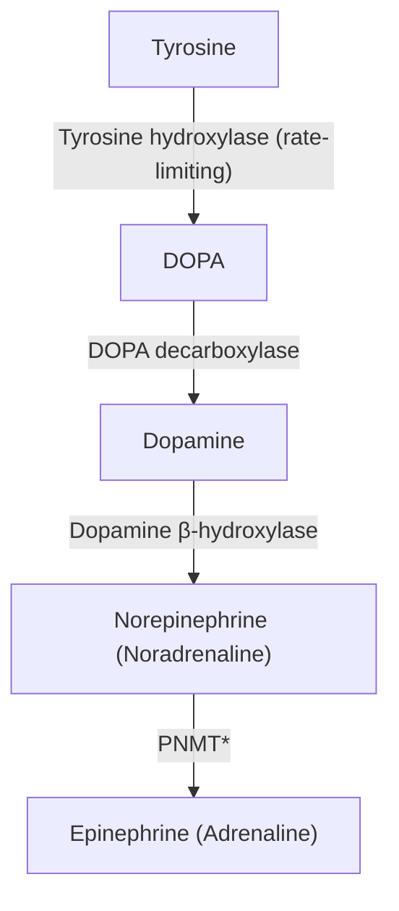
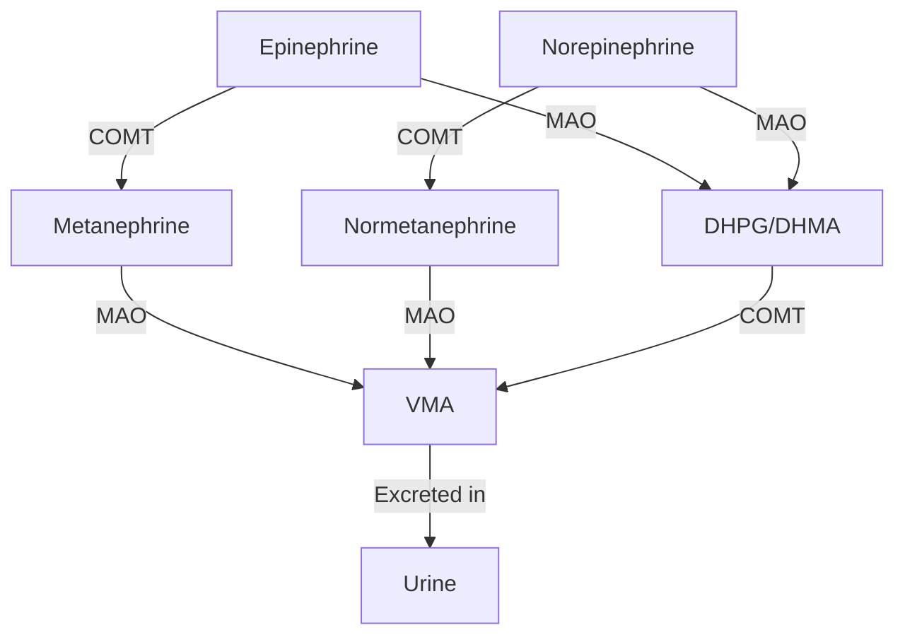

# Phaeochromocytoma

## 1. Definition

**Phaeochromocytoma** — let's break the name down from Greek roots:
- *Phaeo* (φαιός) = dusky/dark
- *Chromo* (χρῶμα) = colour
- *Cyt* (κύτος) = cell
- *-oma* = tumour

So literally: "tumour of dark-coloured cells." This refers to the fact that chromaffin cells turn dark brown when exposed to chromium salts (the **chromaffin reaction**) — a histological hallmark [1][2].

**Phaeochromocytoma** is a catecholamine-secreting neuroendocrine tumour derived from **chromaffin cells of the adrenal medulla** [1][2]. It is a serious and potentially lethal tumour because of the cardiovascular complications caused by excessive catecholamine secretion (hypertensive crises, arrhythmias, stroke, acute pulmonary oedema) [1][2].

A closely related but distinct entity is the **paraganglioma**:
- **Paraganglioma**: tumour arising from chromaffin cells of the **extra-adrenal** sympathetic or parasympathetic nervous system [2].
  - **Sympathetic paraganglioma**: usually catecholamine-secreting (essentially an "extra-adrenal phaeochromocytoma"), located along the sympathetic chain — para-aortic, bladder wall, thorax, pelvis [2].
  - **Parasympathetic paraganglioma**: usually **non-functional** (no catecholamine secretion), located in the **neck/skull base** (e.g. carotid body tumour, glomus jugulare) [2].

> In clinical practice, "phaeochromocytoma" is sometimes used loosely to refer to all catecholamine-secreting chromaffin cell tumours (both adrenal and extra-adrenal), but strictly the term applies only to **adrenal** tumours [2].

<Callout title="Classification of Adrenal Tumours" type="idea">

|  | **Benign** | **Malignant** |
|---|---|---|
| **Adrenal Cortex** | Adrenocortical adenoma | Adrenocortical carcinoma |
| **Adrenal Medulla** | Phaeochromocytoma | Malignant phaeochromocytoma, Neuroblastoma |

— from [1]

</Callout>

---

## 2. Epidemiology

### 2.1 Incidence & Prevalence

- Accounts for **0.1–0.6%** of all hypertensive patients — rare, but important because it is a **surgically curable cause of secondary hypertension** [1][2].
- Annual incidence: approximately **2–8 per million** population per year.
- Peak incidence: **3rd–5th decade of life**, but can occur at any age (including children) [1].
- No strong sex predilection overall (roughly equal), though some series report a slight female predominance.
- In Hong Kong, phaeochromocytoma is uncommon but important in the differential diagnosis of resistant or paroxysmal hypertension, adrenal incidentaloma workup, and familial endocrine tumour syndromes.

### 2.2 The "Rule of 10s"

The classic teaching mnemonic (though now considered an oversimplification as modern data shows higher percentages) [1][2]:

| Rule of 10 | Modern Data |
|---|---|
| 10% in Children | Still ~10% |
| 10% Familial (MEN2/VHL/NF-1) | **Up to 25–40%** (with genetic testing) |
| 10% Extra-adrenal (paraganglioma) | **Up to 15–20%** |
| 10% Bilateral / Multiple | ~10–20% (higher if familial) |
| 10% Malignant (defined by metastasis) | **Up to 10–36%** |
| 10% Not associated with hypertension | ~10% |
| 10% Recurrence | ~10–15% |
| 10% secrete adrenaline/dopamine (c.f. 90% noradrenaline) | ~10% |

<Callout title="Exam Pearl" type="error">
The "Rule of 10" is a favourite exam question. Know it, but also know it is **outdated** — the familial component is much higher than 10% with modern genetic testing (up to 25–40%), and the malignancy rate can be significantly higher for extra-adrenal paragangliomas.
</Callout>

### 2.3 Extra-adrenal Locations of Paraganglioma [2]

- **Para-aortic** (75%) — including the **Organ of Zuckerkandl**
- **Urinary bladder** (10%)
- **Thorax** (10%)
- **Skull base / Neck / Pelvis** (5%)

**Organ of Zuckerkandl** [2]:
- Location: at the **origin of the inferior mesenteric artery (IMA)** or around the **aortic bifurcation**
- Function: secretes catecholamines during early gestational development to regulate fetal BP → normally regresses in the **late 3rd trimester**
- Clinical relevance: the most common site for extra-adrenal sympathetic paraganglioma

---

## 3. Risk Factors & Etiology

### 3.1 Sporadic (Most Common) [1][2]

The majority of phaeochromocytomas (~60–75%) were historically considered sporadic (no identifiable genetic mutation). However, with expanded genetic testing, **up to 40%** are now found to harbour germline mutations.

### 3.2 Familial / Hereditary Syndromes [1][2]

This is extremely high-yield. The key hereditary syndromes associated with phaeochromocytoma are:

#### A. Multiple Endocrine Neoplasia Type 2 (MEN2) — *RET* proto-oncogene

| Subtype | Components | Key Features |
|---|---|---|
| **MEN2A** | **Medullary thyroid carcinoma (MTC)** (>95%), **Phaeochromocytoma** (~50%), **Parathyroid hyperplasia** (~20–30%) | Most common MEN2 subtype |
| **MEN2B** | **Medullary thyroid carcinoma** (virtually 100%), **Phaeochromocytoma** (~50%), **Mucosal neuromas** / intestinal ganglioneuromas, Marfanoid habitus | More aggressive MTC; earlier onset |

- The **RET** proto-oncogene (chromosome 10q11.2) is a receptor tyrosine kinase. Gain-of-function mutations → constitutive activation → uncontrolled cell growth of neuroendocrine tissues.
- In MEN2, phaeochromocytoma is often **bilateral** (~50–80%), tends to be adrenal, and is **almost always benign**.
- ***Prophylactic total thyroidectomy is indicated for all MEN2 patients since virtually all develop clinically apparent MTC*** [1].

#### B. Von Hippel-Lindau Disease (VHL) — *VHL* tumour suppressor gene

- Autosomal dominant, chromosome 3p25.
- VHL protein normally targets HIF (hypoxia-inducible factor) for degradation. Loss of VHL → accumulation of HIF → upregulation of VEGF and other growth factors → tumour angiogenesis and growth.
- **Associated tumours** [1]:
  - **Clear cell renal cell carcinoma (RCC)**
  - **Phaeochromocytoma** / paraganglioma
  - **Haemangioblastoma** of brain, cerebellum, spine
  - **Retinal capillary haemangioblastoma** (retinal angioma)
  - **Endolymphatic sac tumours** of middle ear
  - **Serous cystadenoma** and **neuroendocrine tumours of pancreas**
  - **Papillary cystadenoma** of epididymis and broad ligament
- Phaeochromocytomas in VHL tend to secrete predominantly **noradrenaline** (because they lack PNMT enzyme to convert noradrenaline → adrenaline).

#### C. Neurofibromatosis Type 1 (NF1) — *NF1* gene (neurofibromin)

- Autosomal dominant, chromosome 17q11.2.
- Neurofibromin is a GTPase-activating protein (GAP) that negatively regulates RAS signalling. Loss → uncontrolled RAS-mediated cell proliferation.
- Phaeochromocytoma occurs in **~2%** of NF1 patients (uncommon but important to screen for).
- Clinical clues: café-au-lait spots, neurofibromas, Lisch nodules, axillary/inguinal freckling.

#### D. Succinate Dehydrogenase (SDH) Gene Mutations

- **SDHx** mutations (SDHA, SDHB, SDHC, SDHD, SDHAF2) — increasingly recognised as a major cause of hereditary phaeochromocytoma and paraganglioma.
- SDH is part of mitochondrial complex II in the electron transport chain + a component of the Krebs cycle (catalyses succinate → fumarate).
- Loss of SDH → accumulation of succinate → stabilisation of HIF → pseudohypoxia pathway → tumour formation (similar concept to VHL).
- **SDHB mutations** have the highest risk of **malignancy** (~30–40%).
- **SDHD mutations** → most commonly cause head and neck paragangliomas; paternal transmission (maternal imprinting).

#### E. Carney Triad & Carney-Stratakis Syndrome [2]

- **Carney triad**: GIST + pulmonary chondroma + paragangliomas (SDH gene mutations) — sporadic, predominantly in young females.
- **Carney-Stratakis syndrome**: GIST + paraganglioma — autosomal dominant, SDHx mutations.

#### F. Other Rare Genetic Associations

- **TMEM127**, **MAX**, **FH** (fumarate hydratase), **PHD2/EGLN1** mutations
- **HIF2A** mutations (Pacak-Zhuang syndrome): polycythaemia + paraganglioma + somatostatinoma

<Callout title="MEN Syndromes — Must Know Table">

| Type | Defective Gene | Components |
|---|---|---|
| **MEN1** | *MEN1* encoding **menin** | **P**ancreatic endocrine tumour, **P**ituitary tumour (prolactinoma MC), **P**arathyroid hyperplasia (**"3 Ps"**) |
| **MEN2A** | *RET* | **M**edullary thyroid carcinoma, Phaeochromocytoma, **P**arathyroid hyperplasia |
| **MEN2B** | *RET* | **M**edullary thyroid carcinoma, Phaeochromocytoma, **M**ucosal neuromas / intestinal ganglioneuromas, Marfanoid habitus |

Note: MEN1 does **NOT** cause phaeochromocytoma. Only MEN**2** does.

</Callout>

<Callout title="When to Suspect Hereditary Phaeochromocytoma" type="idea">
- Young age at diagnosis ( < 40 years)
- Bilateral or multifocal disease
- Extra-adrenal location
- Family history of phaeochromocytoma, paraganglioma, or associated syndromes
- Malignant disease (especially suspect SDHB)

**Current guidelines (Endocrine Society 2024) recommend genetic testing for ALL patients with phaeochromocytoma/paraganglioma**, regardless of family history [3].
</Callout>

---

## 4. Anatomy & Function of the Adrenal Medulla

### 4.1 Gross Anatomy

The adrenal (suprarenal) glands sit on top of the kidneys. Each gland has two functionally distinct regions:
- **Cortex** (outer): produces steroids (aldosterone, cortisol, androgens) — mesoderm origin
- **Medulla** (inner): produces catecholamines — **neural crest** origin (essentially a modified sympathetic ganglion)

The **chromaffin cells** of the adrenal medulla are the cells of origin of phaeochromocytoma. They are named because they stain brown with **chromium salts** (potassium dichromate) — due to oxidation and polymerisation of catecholamines within their granules.

### 4.2 Arterial Supply [1]

The adrenal glands have a rich arterial supply (important surgically — very vascular):
- **Superior adrenal artery** → from the inferior phrenic artery
- **Middle adrenal artery** → directly from the aorta
- **Inferior adrenal artery** → from the renal artery

**Mnemonic**: The adrenals sit on the kidneys and are supplied "from above, from the side, and from below."

### 4.3 Venous Drainage [1]

This is **critically important** surgically (the surgeon must control the adrenal vein early during adrenalectomy to prevent catecholamine surge during tumour manipulation):

| Side | Venous Drainage |
|---|---|
| **Left adrenal vein** | Drains into the **left renal vein** |
| **Right adrenal vein** | Drains **directly into the IVC** |

<Callout title="Surgical Pearl — Why Right Adrenalectomy is Technically More Challenging">
The right adrenal vein is short and drains directly into the IVC. This makes it harder to control, with a higher risk of IVC injury. The left adrenal vein is longer (draining via the left renal vein), providing more room for surgical manipulation.
</Callout>

### 4.4 Catecholamine Biosynthesis Pathway

Understanding this pathway is essential for interpreting biochemical tests:

\***PNMT** = Phenylethanolamine N-methyltransferase — the enzyme that converts noradrenaline → adrenaline. This enzyme is **cortisol-induced** and found predominantly in the adrenal medulla [2].

Why is PNMT important? Because:
- **Adrenal** phaeochromocytomas can secrete both noradrenaline AND adrenaline (they have PNMT because they are bathed in cortisol from the adrenal cortex).
- **Extra-adrenal** paragangliomas typically secrete only **noradrenaline** (they lack PNMT because there is no local cortisol).
- Dopamine-secreting tumours are rare and often associated with **malignancy**.

### 4.5 Catecholamine Metabolism [1]

This is important for understanding which biochemical tests to order:

**Catecholamines** (Epinephrine, Norepinephrine, Dopamine) are metabolised by two enzyme systems:

1. **COMT** (Catechol-O-Methyltransferase) — predominantly **extra-neuronal**:
   - Epinephrine → **Metanephrine**
   - Norepinephrine → **Normetanephrine**
   
2. **MAO** (Monoamine Oxidase) — predominantly **intraneuronal**:
   - Further metabolises the methylated catecholamines (and parent catecholamines)
   
3. Both pathways converge on the final metabolite: **Vanillylmandelic Acid (VMA)** → excreted in urine.

<Callout title="Why Metanephrines are the Best Screening Test">
Phaeochromocytoma chromaffin cells **continuously** metabolise catecholamines to metanephrines via COMT **within the tumour** itself (even when catecholamines are not being actively secreted into the bloodstream). This means:
- **Plasma/urinary fractionated metanephrines** are elevated **continuously** and have the **highest sensitivity (~96–99%)** for detecting phaeochromocytoma.
- Parent catecholamines (adrenaline, noradrenaline) are released **episodically** and may be normal between paroxysms → lower sensitivity.
- VMA is the least sensitive marker (many false negatives).

**Sensitivity hierarchy: Fractionated metanephrines > Fractionated catecholamines > VMA**
</Callout>

### 4.6 Actions of Adrenergic Receptors [1]

Understanding receptor pharmacology explains the clinical features and guides treatment:

| Receptor | Location | Action | Clinical Relevance |
|---|---|---|---|
| **α₁** | Vascular smooth muscle, iris dilator, bladder sphincter | ↑ TPR (vasoconstriction), mydriasis, ↑ closure of internal urethral sphincter | **Hypertension**, pallor |
| **α₂** | Presynaptic nerve terminals, pancreatic β-cells | ↓ NE release (negative feedback), ↓ ACh release, **↓ insulin release** | Glucose intolerance |
| **β₁** | Heart, kidney (JGA), adipose tissue | ↑ HR, ↑ myocardial contractility, ↑ renin release, ↑ lipolysis | **Tachycardia, palpitations**, weight loss |
| **β₂** | Bronchial smooth muscle, vascular smooth muscle, liver, uterus | Vasodilation (↓ TPR), bronchodilation, ↑ glycogenolysis, ↑ glucagon release, relaxation of uterine smooth muscle | Tremor, hyperglycaemia |

<Callout title="Understanding Postural Hypotension in Phaeochromocytoma" type="idea">
Seems counterintuitive — why would a catecholamine-secreting tumour cause postural **hypo**tension?

Three mechanisms:
1. **Chronic catecholamine excess → α₁ receptor desensitisation/downregulation** → blunted vasoconstrictor response to standing
2. **Catecholamine-induced volume contraction**: chronic vasoconstriction → reduced plasma volume (pressure natriuresis + third-spacing)
3. **β₂-mediated vasodilation**: adrenaline at β₂ receptors → peripheral vasodilation, which unmasks when α effects wane

This is why patients can present with paradoxical **paroxysmal hypertension + postural hypotension** — a classic exam clue [2].
</Callout>

---

## 5. Pathophysiology — How Does a Phaeochromocytoma Cause Disease?

The pathophysiology is essentially a story of **catecholamine excess** and its downstream effects on the cardiovascular system and metabolism.

### 5.1 Cardiovascular Effects

1. **Hypertension** (the cardinal feature):
   - **α₁ stimulation** → arteriolar vasoconstriction → ↑ systemic vascular resistance (SVR) → ↑ BP
   - **β₁ stimulation** → ↑ heart rate + ↑ cardiac output → ↑ BP
   - **β₁ stimulation on JGA** → ↑ renin release → activation of RAAS → further vasoconstriction + salt/water retention
   - Hypertension may be **sustained** (~50%) or **paroxysmal** (~50%), or superimposed paroxysms on sustained hypertension

2. **Tachycardia and arrhythmias**:
   - β₁ stimulation → ↑ heart rate, ↑ contractility, ↑ automaticity → supraventricular tachycardia, ventricular tachycardia, AF

3. **Catecholamine-induced cardiomyopathy** (also called Takotsubo-like cardiomyopathy):
   - Direct catecholamine toxicity to myocardium → contraction band necrosis → dilated cardiomyopathy → heart failure

4. **Postural hypotension** — as explained above (desensitisation + volume contraction + β₂ vasodilation)

### 5.2 Metabolic Effects

1. **Hyperglycaemia / Glucose intolerance**:
   - α₂ stimulation → ↓ insulin secretion from pancreatic β-cells
   - β₂ stimulation → ↑ hepatic glycogenolysis + ↑ glucagon release
   - Result: impaired glucose tolerance, overt diabetes in some cases

2. **Weight loss / Hypermetabolism**:
   - β₁ stimulation → ↑ lipolysis → ↑ free fatty acid oxidation → ↑ basal metabolic rate → weight loss
   - This mimics thyrotoxicosis clinically

3. **Hypercalcaemia** (uncommon):
   - Via PTHrP secretion by tumour (paraneoplastic) or co-existing MEN2A (primary hyperparathyroidism)

### 5.3 Phaeochromocytoma Crisis [2]

A life-threatening emergency. Massive catecholamine release → severe hypertension → can cause:
- **Acute pulmonary oedema (APO)**: LV failure from catecholamine cardiomyopathy + afterload mismatch
- **Intracranial haemorrhage (ICH)**: hypertensive emergency → vessel rupture
- **Hypertensive encephalopathy**
- **Myocardial infarction**: demand ischaemia + direct catecholamine-induced coronary vasospasm
- **Multiorgan failure**

**Triggers of crisis**:
- **Surgical manipulation** of the tumour (or any abdominal surgery in an undiagnosed patient)
- **Anaesthetic induction** (intubation → sympathetic stimulation)
- **Drugs**: tricyclic antidepressants (TCA), metoclopramide, IV contrast (historically with high-osmolar agents), opioids (morphine → histamine release), sympathomimetics, glucocorticoids, β-blockers **without prior α-blockade**
- **Foods**: tyramine-containing foods (cheese, wine) — tyramine is an indirect sympathomimetic
- **Stress, trauma, pregnancy/labour**

---

## 6. Classification

### 6.1 By Location

| Type | Location | % |
|---|---|---|
| **Phaeochromocytoma** | Adrenal medulla | ~80–85% |
| **Paraganglioma (sympathetic)** | Extra-adrenal sympathetic chain (para-aortic, bladder, thorax, pelvis) | ~15–20% |
| **Paraganglioma (parasympathetic)** | Head/neck (carotid body, glomus jugulare, glomus tympanicum, vagal) | Rare; usually non-functional |

### 6.2 By Behaviour

- **Benign**: ~85–90% — no evidence of metastasis
- **Malignant**: ~10–15% — **defined solely by the presence of metastasis** (chromaffin tissue in non-chromaffin sites, e.g. bone, liver, lung, lymph nodes). There is **no reliable histological marker** to distinguish benign from malignant [2]. This is a key exam concept.

> The **PASS score** (Pheochromocytoma of the Adrenal gland Scaled Score) uses histological criteria (vascular invasion, capsular invasion, mitoses, necrosis, etc.) to risk-stratify, but is imperfect. PASS ≥ 4 suggests potentially malignant behaviour.

### 6.3 By Secretory Pattern

| Type | Primary Catecholamine | Typical Tumour |
|---|---|---|
| Noradrenaline-predominant | Norepinephrine | Most common (~90%); extra-adrenal paragangliomas |
| Adrenaline-predominant | Epinephrine | Adrenal phaeochromocytoma (has PNMT) |
| Dopamine-predominant | Dopamine | Rare; associated with **malignancy** and **SDHB mutations** |

### 6.4 By Genetic Basis

| Cluster | Genes | Pathway | Tumour Characteristics |
|---|---|---|---|
| **Cluster 1 (Pseudohypoxia)** | VHL, SDHx, FH, PHD2, HIF2A | HIF stabilisation → angiogenesis | Higher malignancy risk, NE-secreting, often extra-adrenal |
| **Cluster 2 (Kinase signalling)** | RET, NF1, TMEM127, MAX | RAS/RAF/MAPK and PI3K/AKT/mTOR | Adrenal, often bilateral, Epi-secreting, lower malignancy risk |
| **Cluster 3 (Wnt signalling)** | MAML3 fusions, CSDE1 | Wnt/β-catenin | Cortisol co-secretion possible |

---

## 7. Clinical Features

### 7.1 Overview

- **60% are discovered incidentally** on imaging (adrenal incidentaloma workup) [2]
- The clinical presentation is driven by the **episodic or sustained release of catecholamines** and their effects on α- and β-adrenergic receptors

### 7.2 Symptoms

#### The Classic Triad [1][2]

The **classic triad** of phaeochromocytoma (present in ~40% of patients when all three occur together, but individual symptoms are more common):

1. **Paroxysmal headache** (~80%)
   - *Mechanism*: Acute hypertension → cerebral vasodilation (autoregulatory response to sudden ↑BP) → headache. Also direct catecholamine effects on cerebral vasculature.
   - Character: severe, throbbing, bilateral, often occipital

2. **Sweating (diaphoresis/perspiration)** (~70%)
   - *Mechanism*: Sympathetic cholinergic activation of eccrine sweat glands. Catecholamines also directly stimulate sweat production via α₁ receptors on apocrine glands. Hypermetabolic state → heat generation.
   - Generalised drenching sweats during paroxysms

3. **Palpitations (tachycardia)** (~60%)
   - *Mechanism*: β₁ stimulation → ↑ heart rate and ↑ force of contraction → patient feels the heart pounding

#### The 5 Ps of Phaeochromocytoma [1][2]

A widely used mnemonic:

| P | Feature | Mechanism |
|---|---|---|
| **P**ressure | Hypertension (sustained or paroxysmal) | α₁ → vasoconstriction; β₁ → ↑ CO + ↑ renin |
| **P**ain | Headache, chest pain | Headache: cerebral vasodilation from acute HTN; Chest pain: demand ischaemia + coronary vasospasm |
| **P**alpitation | Tachycardia | β₁ → ↑ HR, ↑ contractility |
| **P**erspiration | Generalised sweating | Sympathetic activation of sweat glands + hypermetabolism |
| **P**allor | Pale skin (NOT flushing) | α₁ → cutaneous vasoconstriction |

<Callout title="Pallor, NOT Flushing!" type="error">
A common mistake: students assume phaeochromocytoma causes flushing (like carcinoid syndrome). It causes **pallor** — because of α₁-mediated cutaneous vasoconstriction. Flushing should make you think of carcinoid, menopause, or medications. Pallor with paroxysmal hypertension = phaeochromocytoma until proven otherwise.
</Callout>

#### Other Symptoms

| Symptom | Mechanism |
|---|---|
| **Anxiety / Panic attacks** | Central and peripheral catecholamine effects → "fight or flight" activation. Often misdiagnosed as panic disorder. |
| **Tremor** | β₂ stimulation of skeletal muscle |
| **Dyspnoea** | Catecholamine cardiomyopathy → heart failure; or acute pulmonary oedema during crisis |
| **Generalised weakness** | Hypokalaemia (β₂ → drives K⁺ intracellularly); chronic catecholamine-induced myopathy |
| **Weight loss** | β₁ → lipolysis; overall hypermetabolic state |
| **Glucose intolerance / Diabetes** | α₂ → ↓ insulin release; β₂ → ↑ glycogenolysis + ↑ glucagon |
| **Constipation** | α₁/α₂ → reduced GI motility (sympathetic inhibition of peristalsis) |
| **Visual disturbance** | Hypertensive retinopathy |
| **Nausea/vomiting** | During paroxysms; probably central effect + visceral vasoconstriction |

#### Characteristic Paroxysmal Attacks ("Spells")

- Last **minutes to hours** (typically 15–60 minutes)
- Occur **spontaneously** or triggered by:
  - Physical exertion, emotional stress, postural change
  - Abdominal palpation / pressure on tumour
  - Micturition (bladder paraganglioma)
  - Certain drugs or foods (see crisis triggers above)
- Frequency: daily to monthly (variable)
- Between attacks, patient may be **completely asymptomatic** or have sustained baseline hypertension

#### Pressor Response [2]

***Pressor response during procedures or with certain drugs (e.g. TCA, IV contrast) or food (cheese)*** — this is a classic exam clue. If a patient develops an unexpected hypertensive crisis during surgery, anaesthesia, or after a contrast study, think phaeochromocytoma.

### 7.3 Signs

| Sign | Mechanism / Explanation |
|---|---|
| **Hypertension** — sustained (~50%), paroxysmal (~30%), both (~20%) | α₁-mediated vasoconstriction + β₁-mediated ↑ CO + RAAS activation |
| **Postural (orthostatic) hypotension** | Volume contraction + α-receptor downregulation + β₂ vasodilation (paradoxical but classic) [2] |
| **Tachycardia** (resting HR often > 100) | β₁ stimulation |
| **Pallor** (during attack) | α₁ → cutaneous vasoconstriction |
| **Diaphoresis** (during attack) | Sympathetic sweat gland activation |
| **Tremor** (fine, postural) | β₂ receptor stimulation |
| **Fever** (during crisis) | Hypermetabolism, ↑ thermogenesis |
| **Hypertensive retinopathy** (fundoscopy) | Chronic or acute severe hypertension |
| **Cafe-au-lait spots, neurofibromas** | Associated NF1 |
| **Thyroid nodule** | Associated MEN2 (medullary thyroid carcinoma) |
| **Abdominal mass** (rare, if tumour is large) | Direct tumour effect |
| **Cardiac signs**: S3 gallop, displaced apex, bilateral crepitations | Catecholamine cardiomyopathy → heart failure |

<Callout title="Adrenal Incidentaloma — Screening Workup" type="idea">
***When an adrenal mass > 1cm is incidentally found on imaging, the two key questions are: Is it functional? Is it malignant?*** [2]

Screening tests for functionality in any adrenal incidentaloma:
1. **1mg overnight dexamethasone suppression test (ONDST)** → screen for Cushing's syndrome
2. **Aldosterone:Renin ratio (ARR)** → screen for Conn's syndrome (if hypertensive)
3. ***24-hour urine metanephrines*** → screen for phaeochromocytoma

**You must screen for phaeochromocytoma BEFORE any biopsy or surgery** — failure to do so can precipitate a lethal crisis.
</Callout>

### 7.4 When to Suspect Phaeochromocytoma (Clinical Scenarios)

High-yield clinical scenarios that should trigger investigation:

1. **Paroxysmal hypertension** (especially young patient < 40 years)
2. **Resistant hypertension** (uncontrolled on ≥3 drugs including a diuretic)
3. **Hypertensive crisis during anaesthesia, surgery, or contrast studies**
4. **Adrenal incidentaloma** (must always exclude phaeochromocytoma)
5. **Family history** of phaeochromocytoma, paraganglioma, MEN2, VHL, NF1, SDHx
6. **Classic triad**: headache + sweating + palpitations (especially if paroxysmal)
7. **Hypertension + diabetes + weight loss** (hypermetabolic state)
8. **Unexplained cardiomyopathy** in a young patient

---

## 8. Important Associations & Exam Pearls

### Association with MEN2 — Approach to Phaeochromocytoma in MEN2

In MEN2, if a patient has both MTC and phaeochromocytoma, the phaeochromocytoma is **operated on FIRST** (before thyroidectomy for MTC). Rationale: anaesthesia for thyroidectomy in an undiagnosed/untreated phaeochromocytoma → catecholamine crisis → death.

### Phaeochromocytoma in Pregnancy

- Extremely dangerous — high maternal and fetal mortality if undiagnosed
- Presents as preeclampsia-like picture but with **paroxysmal features, no proteinuria early on**
- Imaging: MRI preferred (no radiation)
- Treatment: α-blockade (phenoxybenzamine is safe in pregnancy) → delivery → definitive surgery

### Phaeochromocytoma vs Carcinoid Syndrome

| Feature | Phaeochromocytoma | Carcinoid Syndrome |
|---|---|---|
| Flushing | **No** — pallor (α₁ vasoconstriction) | **Yes** — classic flushing |
| Hypertension | Yes (paroxysmal/sustained) | No (hypotension may occur) |
| Diarrhoea | Rare (constipation more common) | Yes (serotonin → ↑ GI motility) |
| Bronchoconstriction | No (β₂ → bronchodilation) | Yes (serotonin/histamine) |
| Urine marker | Metanephrines | 5-HIAA |

---

<Callout title="High Yield Summary">

**Definition**: Catecholamine-secreting neuroendocrine tumour of adrenal medulla chromaffin cells. Extra-adrenal = paraganglioma.

**Rule of 10s**: 10% bilateral, 10% extra-adrenal (up to 20%), 10% malignant (up to 36%), 10% familial (up to 40%), 10% children, 10% recurrence, 10% normotensive.

**Key genetics**: MEN2A/2B (RET), VHL, NF1, SDHx (highest malignancy risk = SDHB). All patients should be offered genetic testing.

**Catecholamine metabolism**: Catecholamines → COMT → Metanephrines → MAO → VMA. Fractionated metanephrines = most sensitive screening test.

**Adrenal anatomy**: Right adrenal vein → IVC directly (short, surgical hazard); Left adrenal vein → left renal vein.

**PNMT** (cortisol-induced enzyme): converts NE → Epi. Present in adrenal medulla. Extra-adrenal tumours = NE only.

**Classic triad**: Headache + Sweating + Palpitations. **5 Ps**: Pressure, Pain, Palpitation, Perspiration, Pallor.

**Postural hypotension** in phaeochromocytoma: α-receptor downregulation + volume contraction + β₂ vasodilation.

**Phaeochromocytoma crisis**: APO, ICH, MI. Triggers: surgery, drugs (TCA, metoclopramide), anaesthesia, contrast.

**Adrenal incidentaloma workup**: ONDST + ARR + 24h urine metanephrines. Always exclude phaeochromocytoma before biopsy/surgery.

**Pallor, NOT flushing** — distinguishes from carcinoid syndrome.

**In MEN2**: Operate phaeochromocytoma FIRST, then thyroidectomy for MTC.

</Callout>

---

<ActiveRecallQuiz
  title="Active Recall - Phaeochromocytoma (Definition to Clinical Features)"
  items={[
    {
      question: "A 35-year-old man is found to have bilateral adrenal masses on CT. He has a family history of medullary thyroid carcinoma. What gene is most likely mutated, and what syndrome does this represent?",
      markscheme: "RET proto-oncogene mutation. MEN2A syndrome (MTC + phaeochromocytoma + parathyroid hyperplasia) or MEN2B (MTC + phaeochromocytoma + mucosal neuromas). Bilateral phaeochromocytoma strongly suggests MEN2."
    },
    {
      question: "Explain why fractionated metanephrines (plasma or urinary) are more sensitive than catecholamines for diagnosing phaeochromocytoma.",
      markscheme: "Chromaffin tumour cells continuously metabolise catecholamines to metanephrines via COMT within the tumour itself, producing a constant output. Parent catecholamines are released episodically (paroxysmal), so levels may be normal between attacks. Metanephrines are therefore elevated more consistently, giving sensitivity of 96-99%."
    },
    {
      question: "Why does phaeochromocytoma cause pallor rather than flushing?",
      markscheme: "Alpha-1 receptor stimulation by noradrenaline causes cutaneous vasoconstriction, leading to pallor. This distinguishes phaeochromocytoma from carcinoid syndrome (which causes flushing via serotonin and histamine release)."
    },
    {
      question: "A patient with phaeochromocytoma has both sustained hypertension and postural hypotension. Explain this apparent paradox with three mechanisms.",
      markscheme: "1) Chronic alpha-1 receptor downregulation or desensitisation from sustained catecholamine excess, blunting vasoconstrictor response on standing. 2) Catecholamine-induced volume contraction (pressure natriuresis, third-spacing from chronic vasoconstriction reducing effective circulating volume). 3) Beta-2 mediated peripheral vasodilation (especially with adrenaline-secreting tumours) that is unmasked when alpha effects wane."
    },
    {
      question: "Why must phaeochromocytoma always be excluded before biopsy of an adrenal incidentaloma?",
      markscheme: "Biopsy of an unsuspected phaeochromocytoma can trigger massive catecholamine release leading to hypertensive crisis, which can be fatal (APO, ICH, arrhythmia, MI). All adrenal incidentalomas must be screened with 24h urine metanephrines (plus ONDST and ARR) before any invasive procedure."
    },
    {
      question: "In a patient with MEN2A who has both medullary thyroid carcinoma and phaeochromocytoma, which tumour should be surgically addressed first, and why?",
      markscheme: "Phaeochromocytoma must be operated FIRST. Rationale: anaesthesia for thyroidectomy in an untreated phaeochromocytoma risks catecholamine crisis during induction, intubation, or surgical manipulation, which can be lethal. Once the phaeochromocytoma is safely resected (with adequate alpha then beta blockade), thyroidectomy for MTC can proceed safely."
    }
  ]}
/>

---

## References

[1] Senior notes: felixlai.md (Phaeochromocytoma sections, pages 1031–1034)
[2] Senior notes: maxim.md (Phaeochromocytoma and Adrenal incidentaloma sections, pages 202–206)
[3] Endocrine Society Clinical Practice Guideline: Pheochromocytoma and Paraganglioma (2024 update)
