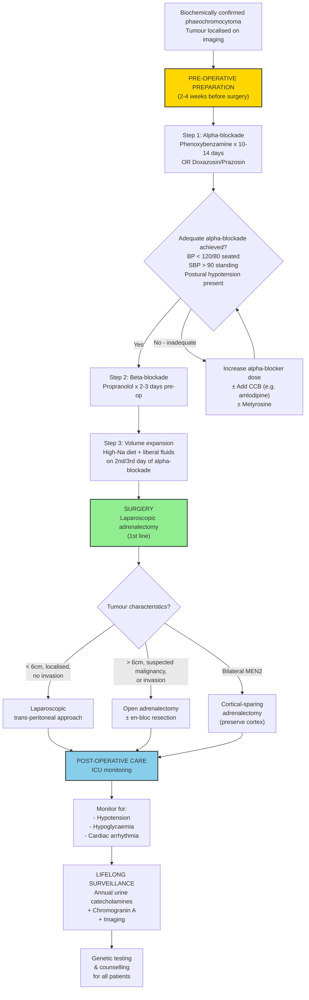
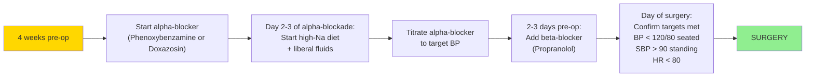

## Management of Phaeochromocytoma — Algorithm & Treatment Modalities

### 11.1 Management Principles — The Big Picture

The management of phaeochromocytoma is essentially a three-act story:

1. **Pre-operative medical preparation** (the most critical phase — "taming the catecholamine storm")
2. **Definitive surgical resection** (the cure)
3. **Post-operative care + lifelong surveillance** (the follow-through)

The entire management strategy revolves around one central problem: this tumour can kill you during surgery if you are not prepared. An unprepared patient undergoing any operation — even a routine cholecystectomy — with an undiagnosed phaeochromocytoma can die from a catecholamine-induced hypertensive crisis, cardiac arrhythmia, or cardiovascular collapse upon tumour devascularisation. The pre-operative preparation transforms a high-risk emergency into a controlled elective procedure.

---

### 11.2 Master Management Algorithm

---

### 11.3 PRE-OPERATIVE PREPARATION — The Most Tested Component

This is the **highest yield** section for exams. The principle: before you cut, you must **neutralise** the catecholamine effects on the cardiovascular system.

#### A. Goals of Pre-operative Preparation [1][2]

***Aim to prevent intra-op pheochromocytoma crisis*** [2]:

1. **Control hypertension** — normalise BP
2. **Control tachycardia** — normalise HR
3. **Volume expansion** — reverse catecholamine-induced volume contraction

#### B. Step 1: Alpha-Blockade (FIRST — Always First)

***Alpha blocker (BP): phenoxybenzamine x 4 weeks*** [2] (or ***10–14 days before operation*** [1] — varies by source; 2–4 weeks is typical practice).

**Why alpha-blockade first?** Because the immediate threat is **α₁-mediated vasoconstriction** causing severe hypertension. The tumour is secreting massive amounts of noradrenaline, which acts on α₁ receptors in blood vessel walls → ↑ total peripheral resistance (TPR) → hypertension. Blocking α₁ receptors:
- ↓ TPR → ↓ BP
- Allows the vasculature to relax → re-expansion of intravascular volume (the chronic vasoconstriction has squeezed plasma volume down)
- Prevents intraoperative hypertensive crisis during tumour manipulation (when the tumour is squeezed, catecholamine release spikes)

**Alpha-blocker options** [1]:

| Drug | Type | Dosing | Advantages | Side Effects |
|---|---|---|---|---|
| ***Phenoxybenzamine*** | **Non-selective, irreversible** (binds covalently to α₁ and α₂) | Start 10mg BD → titrate up to 20–40mg BD | Long-acting; most reliable; traditional "gold standard" | ***Postural hypotension, palpitations (reflex tachycardia), flushing, nasal congestion*** [1]; ***stuffy nose*** [2] |
| ***Doxazosin*** | Selective α₁-antagonist, reversible | Start 2mg OD → titrate up | Fewer side effects than phenoxybenzamine; no α₂ blockade → less reflex tachycardia | Postural hypotension, dizziness |
| ***Terazosin*** | Selective α₁-antagonist, reversible | Start 1mg OD → titrate up | Similar to doxazosin | Postural hypotension |
| ***Prazosin*** | Selective α₁-antagonist, reversible | Start 0.5mg BD → titrate up | Short-acting; useful for dose titration | First-dose hypotension |

<Callout title="Phenoxybenzamine — Deep Dive">
Let's break the name down: "phenoxy" = phenol-ether group; "benzamine" = benzylamine derivative. It is an **irreversible, non-competitive** α-blocker — it binds covalently to α receptors (both α₁ and α₂). This means:
- The receptor is permanently inactivated — new receptors must be synthesised (half-life of blockade ~24h)
- Because it also blocks **α₂ receptors** (presynaptic), it removes the negative feedback on NE release → ↑ NE at the synapse → **reflex tachycardia** (this is why a β-blocker is added later)
- The irreversible nature is both an advantage (reliable blockade even during surges) and a disadvantage (can't quickly reverse if hypotension occurs post-operatively)
</Callout>

**Selective vs non-selective α-blockers — which is better?**

Modern practice is shifting towards **selective α₁-blockers** (doxazosin, prazosin) because:
- Fewer side effects (no α₂ blockade → less reflex tachycardia)
- Reversible → easier to titrate and manage post-operatively
- Similar perioperative outcomes in comparative studies

However, phenoxybenzamine remains widely used and is the traditional agent in many centres including Hong Kong [1][2].

#### C. Assessing Adequacy of Alpha-Blockade

***BP targets: < 120/80 when seated and SBP > 90 mmHg on standing*** [1].
***Target BP 130/80 HR 70 (seated)*** [2].

***Postural hypotension indicates adequate alpha blockade*** [2] — this is the clinical endpoint. If the patient develops symptomatic postural drop (≥ 20 mmHg systolic on standing), the α-receptors are sufficiently blocked.

**Additional criteria for adequate blockade (Endocrine Society)**:
- No ST-T changes on ECG for ≥ 1 week
- No more than one episode of BP > 160/90 in the 24 hours before surgery
- Mild orthostatic hypotension with BP > 80/45 standing

#### D. Step 2: Beta-Blockade (SECOND — Only After Adequate Alpha-Blockade)

***Beta blocker (HR): propranolol x 2-3 days preoperatively*** [2].
***β-blocker should be given 2-3 days before operation after adequate α-blockade has been achieved to relieve the tachycardia caused by α-blocker*** [1].

**Why β-blockade second?**

The tachycardia in phaeochromocytoma comes from two sources:
1. **Direct β₁ stimulation** by catecholamines → ↑ heart rate, ↑ contractility
2. **Reflex tachycardia** from α-blockade (especially with phenoxybenzamine → α₂ blockade removes NE negative feedback → more NE at β₁ receptors in the heart)

β-blockers counteract both mechanisms.

<Callout title="The Cardinal Rule — NEVER Beta-Block Before Alpha-Block" type="error">
***NEVER start β-blocker first since blockade of peripheral vasodilatory β-adrenergic receptors will lead to vasoconstriction with unopposed α-adrenergic activity (when α-blocker is not started) will further elevate the BP*** [1].

***Rationale: β-blocker alone can cause unopposed α-mediated vasoconstriction → HT crisis*** [2].

**Why does this happen from first principles?**

Catecholamines act on both α₁ (vasoconstriction) and β₂ (vasodilation) receptors in blood vessels. In normal physiology, there is a **balance** between α₁-mediated vasoconstriction and β₂-mediated vasodilation. If you give a non-selective β-blocker:
- β₂ vasodilation is blocked → removed
- α₁ vasoconstriction remains **unopposed**
- Result: massive vasoconstriction → acute hypertensive crisis → stroke, MI, death

This is the single most important pharmacological principle in phaeochromocytoma management.
</Callout>

**β-blocker options**:

| Drug | Type | Rationale |
|---|---|---|
| ***Propranolol*** | **Non-selective** (β₁ + β₂) [1] | Traditional choice; blocks both cardiac β₁ (↓ HR, ↓ contractility) and peripheral β₂ |
| **Atenolol** | Selective β₁ | Less bronchospasm risk; cardioselective |
| **Labetalol** | Combined α₁ + non-selective β | Can be used as monotherapy in some settings, but α:β blocking ratio is only 1:3 (IV) to 1:7 (PO) — may not provide sufficient α-blockade. Not recommended as sole agent [2] |

**Note on labetalol**: Although it has α-blocking properties, the β-blockade predominates, so it is **NOT** a substitute for dedicated α-blockade. It is sometimes used **adjunctively** or in **acute crisis** (IV form), but should not replace the α-first-then-β protocol.

#### E. Step 3: Volume Expansion

***Volume expansion: high Na diet on 2nd/3rd day of alpha blockade to reverse catecholamine-induced volume contraction*** [2].

**Why is volume expansion necessary?**

Chronic catecholamine excess causes **vasoconstriction** → the body adapts by reducing plasma volume (pressure natriuresis — the kidneys excrete sodium and water to compensate for high intravascular pressure in a constricted vascular bed). When you then give an α-blocker and the vascular bed relaxes (dilates), the existing plasma volume is **insufficient** to fill the now-expanded vascular space → **hypotension**.

Volume expansion (high-salt diet + liberal oral fluids ± IV normal saline) starting on the 2nd–3rd day of α-blockade:
- Repletes intravascular volume
- Prevents severe postural and post-tumour-removal hypotension
- Typically aim for 1–2L positive fluid balance

#### F. Additional Pre-operative Agents (When Standard α + β Blockade is Insufficient)

| Agent | Mechanism | Indication |
|---|---|---|
| **Calcium channel blockers** (amlodipine, nicardipine, nifedipine) | Blocks L-type Ca²⁺ channels in vascular smooth muscle → vasodilation independent of adrenergic receptors | Adjunctive BP control when α-blockade alone insufficient; useful in patients intolerant to α-blockers |
| **Metyrosine** (α-methylparatyrosine) | Inhibits **tyrosine hydroxylase** (the rate-limiting enzyme in catecholamine synthesis) → ↓ catecholamine production by the tumour | Severe/refractory cases; pre-op in very large or highly secretory tumours; may reduce intra-operative haemodynamic instability |
| **Magnesium sulphate** | Inhibits catecholamine release from adrenal medulla; direct vasodilator; anti-arrhythmic | Can be used intraoperatively as adjunct; some centres use it in pregnancy |

#### G. Pre-operative Timeline Summary

---

### 11.4 SURGICAL TREATMENT — Definitive Cure

#### A. Surgical Approach

***Laparoscopic resection (1st line)*** [2] — ***consider open if large tumor / suspected malignancy*** [2].

| Approach | Indication | Details |
|---|---|---|
| ***Laparoscopic trans-peritoneal approach (lateral decubitus, ipsilateral side up)*** [2] | ***Mass < 6cm***, localised, no invasion | Standard of care; less pain, shorter hospital stay, fewer wound complications |
| **Laparoscopic retroperitoneal approach** [1] | < 6cm; posterior approach preferred in some centres | Avoids peritoneal cavity; useful in patients with previous abdominal surgery |
| ***Open adrenalectomy*** [2] | ***Mass > 6cm or malignant*** | Better visualisation for large tumours; allows en-bloc resection of invaded structures |
| ***Open adrenalectomy ± en-bloc resection of kidney/spleen (if invaded)*** [2] | Locally invasive malignant phaeochromocytoma | Oncological resection with clear margins |

#### B. Cortical-Sparing Adrenalectomy (Partial Adrenalectomy)

A special consideration for **bilateral phaeochromocytoma** (most commonly in **MEN2** where ~50–80% are bilateral):

- **Total bilateral adrenalectomy** → permanent **adrenal insufficiency** → lifelong steroid replacement + risk of Addisonian crisis
- **Cortical-sparing adrenalectomy**: removes the medullary tumour while preserving the adrenal cortex
  - Advantage: preserves cortisol and aldosterone production → avoids lifelong steroid dependence
  - Risk: ~10–15% recurrence rate in the retained cortex (tumour may regrow from residual chromaffin cells)
  - Recommended by Endocrine Society guidelines for bilateral disease when technically feasible

#### C. Intra-operative Management — The Anaesthetic Partnership

This is a **team effort** between surgeon and anaesthetist. The intra-operative period is the most haemodynamically volatile phase [2].

***Meticulous monitoring: risk of unstable haemodynamics → ensure A-line, CVP, Foley*** [2]:

| Monitoring | Rationale |
|---|---|
| **Arterial line (A-line)** | Beat-to-beat BP monitoring — essential because BP can swing wildly (↑↑↑ during tumour manipulation → ↓↓↓ after adrenal vein ligation) |
| **Central venous pressure (CVP)** | Guides fluid management; assess volume status |
| **Foley catheter** | Accurate urine output monitoring → reflects renal perfusion |
| **ECG (continuous)** | Arrhythmia detection (catecholamine-induced VT, AF, SVT) |
| **Temperature monitoring** | Hyperthermia can occur from catecholamine-induced hypermetabolism |

***Communicate with experienced anaesthetist*** [2]:
- ***Inform anaesthetist before mobilisation/ligation of tumour*** — BP will spike during manipulation and crash after vein ligation
- ***Possible HT crisis during intubation*** — intubation is a sympathetic stimulus that can trigger catecholamine release
- ***Medications on stand-by*** [2]:

| Drug | Indication | Mechanism |
|---|---|---|
| ***Sodium nitroprusside*** | Acute hypertensive crisis (intra-op) | Direct NO donor → potent vasodilator; rapid onset, short duration; titratable via infusion |
| **Phentolamine** | Acute hypertensive crisis (intra-op) | Non-selective α-blocker (competitive, reversible); rapid onset IV |
| **Esmolol** | Tachycardia / tachyarrhythmia | Ultra-short-acting β₁-selective blocker; ideal for intra-op titration |
| **Magnesium sulphate** | Adjunct for BP/arrhythmia control | ↓ catecholamine release; direct vasodilator; stabilises myocardium |
| ***Adrenaline/Noradrenaline infusion*** [2] | **Hypotension** after adrenal vein ligation | Once the tumour is devascularised → sudden cessation of catecholamine supply → vasodilation + depleted volume → severe hypotension; vasopressors needed |

**Key surgical principle**: ***Gentle manipulation of lesion*** [2]. Rough handling squeezes catecholamines out of the tumour into the bloodstream → hypertensive crisis.

***Dissect and control adrenal vein first*** [2] — this is a critical step:
- Early ligation of the adrenal vein stops catecholamine efflux from the tumour into the systemic circulation
- Reduces haemodynamic volatility during the remainder of the dissection
- However, be prepared for **hypotension** immediately after vein ligation (catecholamine source suddenly removed)

#### D. Two-Phase Haemodynamic Model During Surgery

Understanding this concept is essential for exams:

| Phase | Timing | Haemodynamic Problem | Mechanism | Treatment |
|---|---|---|---|---|
| **Phase 1: Hypertensive** | During tumour manipulation, before vein ligation | **↑↑↑ BP, ↑ HR** | Tumour squeezed → massive catecholamine bolus → α₁ vasoconstriction + β₁ cardiac stimulation | Nitroprusside, phentolamine, esmolol, deepened anaesthesia |
| **Phase 2: Hypotensive** | After adrenal vein ligation / tumour removal | **↓↓↓ BP** | Sudden loss of catecholamine source → vasodilation (no more α₁ stimulation) + **depleted intravascular volume** (chronic vasoconstriction had masked hypovolaemia) + residual α-blocker effect | **Aggressive IV fluids** + vasopressors (noradrenaline/adrenaline infusion) |

---

### 11.5 POST-OPERATIVE CARE

***Post-operative ICU monitoring for specific complications*** [2]:

#### A. Specific Post-operative Complications

| Complication | Mechanism | Management |
|---|---|---|
| ***Hypotension*** [2] | ***Drug effect*** (residual α-blockade from phenoxybenzamine — long half-life) + sudden loss of catecholamine drive + volume depletion | Aggressive IV fluid resuscitation (crystalloid ± colloid); vasopressors (noradrenaline) if refractory; wean α-blockers pre-op if using reversible agents |
| ***Hypoglycaemia*** [2] | ***Rebound hyperinsulinaemia*** — during the tumour's lifetime, α₂ stimulation suppressed insulin release from pancreatic β-cells. Once catecholamines are gone, β-cells are suddenly unrestrained → insulin surge → hypoglycaemia. Additionally, β₂-mediated glycogenolysis ceases → reduced hepatic glucose output. | Monitor blood glucose Q1–2h for 24–48h post-op; IV dextrose infusion if needed |
| ***Cardiac arrhythmia*** [2] | Catecholamine-induced myocardial sensitisation + electrolyte shifts during surgery | Continuous ECG monitoring; correct electrolytes; anti-arrhythmics as needed |
| **Adrenal insufficiency** | If bilateral adrenalectomy performed → no cortisol or aldosterone production | IV hydrocortisone (100mg bolus then 50mg Q8h) → taper to oral replacement |
| **Haemorrhage** | Rich arterial supply; injury to adjacent structures | Surgical haemostasis; monitor drains and haemoglobin |

<Callout title="Why Does Hypoglycaemia Occur Post-operatively?" type="idea">
Think of it as the **pancreatic β-cell's revenge**. During chronic catecholamine excess:
- α₂ stimulation → **tonic suppression** of insulin secretion
- β₂ stimulation → continuous hepatic glycogenolysis → glucose flooding

The β-cells have been held back for months/years. The moment the catecholamine brake is removed (tumour out), they **rebound** with a burst of insulin secretion. At the same time, hepatic glucose output drops (no more β₂ drive). The result: **acute hypoglycaemia** in the immediate post-operative period.

This typically occurs **within the first 24–48 hours** and can be severe if not anticipated.
</Callout>

#### B. Surgical Complications (General) [1][2]

| Complication | Detail |
|---|---|
| ***Acute hypertensive crisis*** [1] | Despite adequate pre-op prep, can still occur intra-operatively |
| ***Cardiac arrhythmia*** [1] | VT, SVT, AF |
| ***Intraoperative haemorrhage*** [1] | Rich blood supply; 3 arterial feeders; fragile tumour capsule |
| ***Liver or spleen injury*** [1] | Right adrenalectomy → risk to IVC, right lobe of liver [2]; Left adrenalectomy → risk to pancreatic tail, spleen [2] |
| ***Pneumothorax*** [1] | Especially with posterior/retroperitoneal approach; close proximity to diaphragm |
| **Wound infection** | Standard surgical complication |
| **VTE** | Post-operative immobility; standard prophylaxis |

---

### 11.6 MANAGEMENT OF SPECIAL SITUATIONS

#### A. Phaeochromocytoma Crisis (Acute Hypertensive Emergency)

This is an **emergency** that can present as the first manifestation of undiagnosed phaeochromocytoma (e.g. triggered by anaesthesia, drugs, or incidental tumour manipulation) [2]:

**Management**:

| Step | Action | Rationale |
|---|---|---|
| 1 | **IV phentolamine** (α-blocker, 2–5mg bolus, repeat Q5min) | Immediate competitive α-blockade → ↓ BP |
| 2 | **IV sodium nitroprusside infusion** (0.5–5 μg/kg/min) | Direct vasodilator; ultra-rapid onset; titratable |
| 3 | **IV esmolol** (if tachycardia) | Ultra-short-acting β₁-blocker; ONLY after α-blockade established |
| 4 | **IV magnesium sulphate** | ↓ catecholamine release; vasodilation; anti-arrhythmic |
| 5 | Monitor in ICU; arrange urgent definitive imaging and surgery | Once stabilised |

**Drugs to AVOID in phaeochromocytoma crisis**:
- β-blockers without α-blockade (unopposed α → worse crisis)
- Metoclopramide (can trigger catecholamine release)
- Opioids (histamine release from morphine → catecholamine release)
- Droperidol, haloperidol (can worsen hypertension)

#### B. Malignant Phaeochromocytoma

***Histologically and biochemically indistinguishable from benign disease, defined by metastasis*** [2].

***Management*** [2]:

| Modality | Detail |
|---|---|
| ***Surgical excision (tumour debulking)*** | ***To control catecholamine excess*** — even if not curative, reducing tumour burden ↓ catecholamine secretion → ↓ cardiovascular risk |
| ***Symptomatic relief: alpha blockers*** | Chronic α-blockade to control hypertension in unresectable disease |
| ***Mitotane*** | ***Adjuvant/palliative treatment*** [2] — disrupts adrenal steroidogenesis and has direct cytotoxic effects on adrenocortical tissue (also used in adrenocortical carcinoma) |
| **I-131 MIBG therapy** | Targeted radionuclide therapy — MIBG is taken up by chromaffin cells → delivers β-radiation directly to tumour. For MIBG-avid tumours only. |
| **Temozolomide** | Alkylating chemotherapy; particularly effective in **SDHB-mutated** malignant phaeochromocytoma (~33% response rate) |
| **Sunitinib** | Multi-targeted receptor tyrosine kinase inhibitor (anti-VEGF, anti-PDGFR); used in progressive disease |
| **PRRT** (Peptide Receptor Radionuclide Therapy — ¹⁷⁷Lu-DOTATATE) | For SSTR2-positive tumours (identified on 68Ga-DOTATATE PET); delivers β-radiation to somatostatin-receptor-expressing cells |
| **CVD chemotherapy** (cyclophosphamide + vincristine + dacarbazine) | Traditional regimen for malignant phaeochromocytoma; ~40% partial response rate; limited durability |
| **External beam radiotherapy** | For painful bone metastases (palliative) |
| **Belzutifan** (HIF-2α inhibitor) | Approved for VHL-associated tumours (2021); inhibits HIF-2α → disrupts pseudohypoxia pathway |

#### C. Bilateral Phaeochromocytoma (e.g. MEN2)

- **Cortical-sparing adrenalectomy** preferred (see section 11.4B above)
- If total bilateral adrenalectomy required → **lifelong glucocorticoid and mineralocorticoid replacement**
- Medic-Alert bracelet for adrenal insufficiency
- In MEN2: operate phaeochromocytoma **FIRST**, then thyroidectomy for MTC

#### D. Phaeochromocytoma in Pregnancy

- Extremely dangerous — undiagnosed mortality: ~40–50% maternal, ~55% fetal
- **Trimester-dependent management**:
  - **1st/2nd trimester**: α-blockade (phenoxybenzamine is category C but is used; doxazosin increasingly preferred) → surgical resection in 2nd trimester if possible
  - **3rd trimester**: α-blockade → elective Caesarean section → adrenalectomy at same time or later
- **MRI preferred** for imaging (no radiation)
- **Vaginal delivery contraindicated** — bearing down increases intra-abdominal pressure → tumour compression → catecholamine surge

---

### 11.7 LIFELONG SURVEILLANCE

***Disease monitoring: lifelong yearly screening for recurrent/metastatic/metachronous tumour*** [2]:

| Timepoint | Investigation | Rationale |
|---|---|---|
| **2–6 weeks post-op** | Plasma/urine metanephrines | Confirm biochemical cure (should normalise if complete resection) |
| **Annually, lifelong** | ***Urine catecholamines, chromogranin A*** (***not useful for diagnosis*** but useful for monitoring) ***, imaging*** [2] | Detect recurrence (~10–15%), metachronous tumour (especially in hereditary syndromes), or late metastasis |
| **As clinically indicated** | CT/MRI, functional imaging | If biochemical recurrence detected |

**Why lifelong?** Because:
- ~10–15% recurrence rate (even "benign" tumours can recur)
- Hereditary syndromes → risk of metachronous tumours (new primary in the opposite adrenal or extra-adrenal sites)
- Malignancy can declare itself **years** after initial resection (late metastasis)

***Genetic testing and counselling*** — for the patient AND first-degree relatives [2].

---

### 11.8 Management Summary Table — Quick Reference

| Phase | Key Actions | Targets/Details |
|---|---|---|
| **Pre-op (2–4 weeks)** | α-blockade → β-blockade → volume expansion | BP < 120/80 seated, SBP > 90 standing, HR 60–80 |
| **Intra-op** | A-line, CVP, Foley; gentle manipulation; ligate adrenal vein early; nitroprusside/phentolamine on standby | Communication with anaesthetist; anticipate Phase 1 (HT) and Phase 2 (hypotension) |
| **Post-op** | ICU monitoring: BP, HR, glucose Q1–2h | Treat hypotension (fluids ± vasopressors), hypoglycaemia (dextrose), arrhythmias |
| **Long-term** | Annual biochemical surveillance + imaging; genetic testing | Lifelong; detect recurrence/metachronous tumour/metastasis |
| **Malignant** | Debulking surgery + α-blockade + I-131 MIBG / temozolomide / CVD / PRRT | Aim: control catecholamine excess + tumour burden |

---

<Callout title="High Yield Summary — Management">

1. **Alpha-blockade FIRST, ALWAYS.** ***NEVER start β-blocker first*** — causes unopposed α-mediated vasoconstriction → hypertensive crisis [1][2].

2. **Alpha-blocker**: Phenoxybenzamine (non-selective, irreversible) ***x 10–14 days (up to 4 weeks)*** [1][2]. Alternatives: doxazosin, prazosin. **Side effects**: postural hypotension, reflex tachycardia, nasal congestion.

3. **Beta-blocker**: Propranolol ***2–3 days pre-op*** [1][2] — ONLY after adequate α-blockade. ***Postural hypotension indicates adequate alpha-blockade*** [2].

4. **Volume expansion**: High-Na diet + fluids starting on day 2–3 of α-blockade to reverse catecholamine-induced volume contraction.

5. **BP targets**: < 120/80 seated; SBP > 90 standing [1].

6. **Surgery**: ***Laparoscopic adrenalectomy (1st line)*** [2]; open if > 6cm or malignant. ***Dissect and control adrenal vein first*** [2]. Cortical-sparing for bilateral MEN2.

7. **Intra-op**: A-line, CVP, Foley mandatory. Two-phase haemodynamic model: HT during manipulation → hypotension after vein ligation. Nitroprusside and vasopressors on standby.

8. **Post-op complications**: ***Hypotension*** (residual blockade + loss of catecholamines + hypovolaemia), ***hypoglycaemia*** (rebound hyperinsulinaemia from β-cell release), ***cardiac arrhythmia*** [2].

9. **Malignant disease**: Surgical debulking + α-blockers + I-131 MIBG / temozolomide / CVD chemo / PRRT / mitotane.

10. **Lifelong annual surveillance**: Urine catecholamines + chromogranin A + imaging. Genetic testing for ALL patients.

</Callout>

---

<ActiveRecallQuiz
  title="Active Recall - Management of Phaeochromocytoma"
  items={[
    {
      question: "A colleague starts propranolol for a phaeochromocytoma patient who is hypertensive and tachycardic, without any prior alpha-blockade. What happens, and why?",
      markscheme: "Propranolol blocks beta-2 receptors in peripheral blood vessels, which normally cause vasodilation. With beta-2 blocked, alpha-1 mediated vasoconstriction is UNOPPOSED. The catecholamines from the tumour now act solely on alpha-1 receptors causing massive vasoconstriction and worsening hypertensive crisis. This can lead to stroke, MI, APO, or death. Alpha-blockade must ALWAYS be established first."
    },
    {
      question: "Explain why phenoxybenzamine causes reflex tachycardia, and how this is managed.",
      markscheme: "Phenoxybenzamine is a non-selective irreversible alpha-blocker. It blocks both alpha-1 (vascular) and alpha-2 (presynaptic) receptors. Alpha-2 receptors normally provide negative feedback on NE release from sympathetic nerve terminals. With alpha-2 blocked, NE release is uninhibited, leading to increased NE at cardiac beta-1 receptors causing reflex tachycardia. This is managed by adding a beta-blocker (e.g. propranolol) 2-3 days before surgery, AFTER adequate alpha-blockade is achieved."
    },
    {
      question: "A patient is 6 hours post laparoscopic adrenalectomy for phaeochromocytoma. Their blood glucose is 2.1 mmol/L. Explain the pathophysiology and management.",
      markscheme: "During chronic catecholamine excess, alpha-2 stimulation tonically suppresses insulin secretion from pancreatic beta-cells, and beta-2 stimulation drives hepatic glycogenolysis. When the tumour is removed, the catecholamine brake on beta-cells is suddenly released causing rebound hyperinsulinaemia, while hepatic glucose output falls (no more beta-2 drive). The combination causes acute hypoglycaemia. Management: IV dextrose (e.g. 50mL of 50% dextrose bolus), then dextrose infusion. Monitor blood glucose Q1-2h for 24-48 hours."
    },
    {
      question: "Describe the two-phase haemodynamic model during phaeochromocytoma surgery.",
      markscheme: "Phase 1 (Hypertensive): During tumour manipulation, the tumour is squeezed, releasing a massive bolus of catecholamines causing severe hypertension and tachycardia via alpha-1 vasoconstriction and beta-1 cardiac stimulation. Managed with IV nitroprusside, phentolamine, esmolol. Phase 2 (Hypotensive): After adrenal vein ligation and tumour removal, catecholamine source is suddenly eliminated causing vasodilation (loss of alpha-1 tone) combined with depleted intravascular volume (chronic vasoconstriction had masked hypovolaemia) plus residual alpha-blocker effect. Managed with aggressive IV fluids and vasopressor infusion."
    },
    {
      question: "What is the rationale for cortical-sparing adrenalectomy in bilateral phaeochromocytoma, and what is its main risk?",
      markscheme: "Rationale: Bilateral total adrenalectomy causes permanent adrenal insufficiency requiring lifelong glucocorticoid and mineralocorticoid replacement with risk of Addisonian crisis. Cortical-sparing adrenalectomy removes the medullary tumour while preserving adrenal cortex, maintaining endogenous cortisol and aldosterone production. Main risk: 10-15% recurrence rate in retained cortical remnant, as residual chromaffin cells may give rise to new tumour. Recommended by Endocrine Society guidelines for bilateral disease (especially MEN2) when technically feasible."
    },
    {
      question: "List three therapeutic options for metastatic malignant phaeochromocytoma and briefly explain the mechanism of each.",
      markscheme: "1) I-131 MIBG therapy: MIBG is a norepinephrine analogue taken up by chromaffin cells; labelled with I-131, it delivers targeted beta-radiation to tumour cells. For MIBG-avid tumours. 2) Temozolomide: alkylating agent that damages tumour DNA; particularly effective in SDHB-mutated malignant phaeochromocytoma (approximately 33% response rate). 3) 177Lu-DOTATATE (PRRT): somatostatin analogue labelled with Lutetium-177; binds SSTR2 on neuroendocrine tumour cells and delivers targeted beta-radiation. For SSTR2-positive tumours identified on 68Ga-DOTATATE PET."
    }
  ]}
/>

## References

[1] Senior notes: felixlai.md (Phaeochromocytoma sections, pages 1034–1035)
[2] Senior notes: maxim.md (Phaeochromocytoma management and Adrenalectomy sections, pages 204–206)
