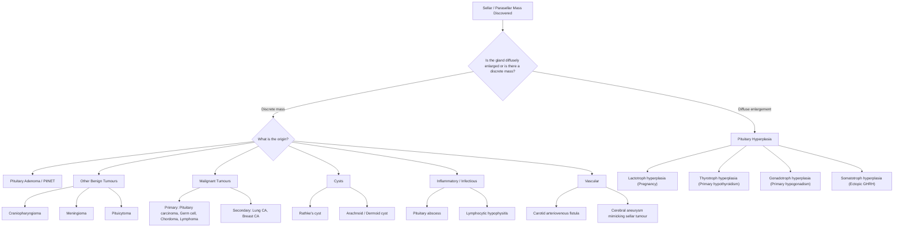

## Differential Diagnosis of a Sellar / Pituitary Mass

### Why Differential Diagnosis Matters Here

When you discover a mass in or around the sella turcica — whether on MRI done for headache, visual complaints, hormonal disturbance, or incidentally — you **cannot assume it is a pituitary adenoma**. The sella and parasellar region is a crossroads of diverse embryological, vascular, and neural structures, each capable of producing its own pathology. Getting the differential right determines whether you give a dopamine agonist (prolactinoma), rush to surgery (apoplexy, craniopharyngioma), or treat an infection (abscess, TB). The clinical approach is to integrate **three axes**: (1) the imaging characteristics, (2) the hormonal profile, and (3) the clinical context (age, sex, tempo of onset, associated features) [2][3].

---

### Systematic Framework: Differential Diagnosis of a Sellar Mass

The way to think about this systematically is to categorise by **pathological process** — exactly as Felix's notes lay it out, but with the "why" for each entity [2]:

---

### Category-by-Category Differential with Distinguishing Features

#### 1. Pituitary Hyperplasia (Not a Tumour — Reactive Process)

***Pituitary hyperplasia*** [2] must be distinguished from a true adenoma because the management is entirely different — you treat the **underlying cause**, not the gland.

| Type | Trigger | Mechanism (First Principles) | Clinical Clue |
|:-----|:--------|:----------------------------|:--------------|
| ***Lactotroph hyperplasia*** | ***Pregnancy*** | Oestrogen stimulates lactotroph proliferation; pituitary can enlarge up to 2× during pregnancy — this is **physiological** | History of pregnancy or postpartum; prolactin mildly elevated but proportional to pregnancy stage |
| ***Thyrotroph hyperplasia*** | ***Longstanding primary hypothyroidism*** | Loss of T4/T3 negative feedback → persistent TRH stimulation → thyrotroph proliferation. The gland enlarges diffusely and can mimic a macroadenoma | ↑ TSH with ↓ fT4; may resolve completely with thyroxine replacement — **always check TFTs before operating on a sellar mass** |
| ***Gonadotroph hyperplasia*** | ***Longstanding primary hypogonadism*** | Loss of sex steroid negative feedback → persistent GnRH stimulation → gonadotroph proliferation | History of Turner's, Klinefelter's, or premature ovarian insufficiency; elevated LH/FSH |
| ***Somatotroph hyperplasia*** | ***Ectopic GHRH secretion*** (e.g., bronchial carcinoid, pancreatic NET) | Ectopic tumour secretes GHRH → chronic somatotroph stimulation → hyperplasia (not autonomous) | Acromegaly features **plus** elevated GHRH levels; peripheral tumour on imaging |

<Callout title="Critical Teaching Point" type="error">
**Always measure thyroid function before diagnosing a pituitary macroadenoma!** A patient with longstanding primary hypothyroidism can develop thyrotroph hyperplasia so significant that the pituitary enlarges and mimics a macroadenoma. Starting thyroxine replacement shrinks the gland. Unnecessary surgery would be a disaster.
</Callout>

#### 2. Pituitary Adenoma (PitNET) — The Most Common Sellar Mass

***Pituitary adenomas are the most common cause of sellar masses from the 3rd decade onwards*** [2]. These are **monoclonal neoplasms** of anterior pituitary cells.

How to differentiate **between adenoma subtypes** is essentially a hormonal exercise (covered in diagnostics). The key here is distinguishing adenoma from non-adenoma sellar pathology:

- **MRI features**: Arises **within** the pituitary gland (intrasellar origin). On gadolinium-enhanced MRI, adenomas take up contrast ***to a lesser degree than the normal pituitary but more than surrounding CNS*** [2]. ***If a sellar lesion can be seen as separate from the normal pituitary gland, this indicates the mass is NOT a pituitary adenoma*** [2] — think craniopharyngioma, meningioma, Rathke's cyst.
- **Prolactin level** helps distinguish prolactinoma from stalk effect (see Part 1).

#### 3. Other Benign Tumours of the Sellar/Parasellar Region

##### a. Craniopharyngioma

***Craniopharyngioma*** [2] — derived from embryological remnants of **Rathke's pouch** (the oral ectoderm invagination that forms the anterior pituitary). The name: "cranio-" = skull, "pharynge-" = pharynx (reflecting Rathke's pouch origin from the stomodeum/roof of the mouth), "-oma" = tumour.

| Feature | Detail |
|:--------|:-------|
| Location | **Suprasellar** predominantly (though can be intra/infrasellar) |
| Age | **Bimodal**: 5–14 years and 50–74 years |
| Histology | Two types: **Adamantinomatous** (children, calcification, cystic "machine oil" fluid) and **Papillary** (adults, rarely calcify) |
| Imaging | ***Calcification*** seen in ~90% of paediatric and ~50% of adult cases; ***calcification in a craniopharyngioma or meningioma is seen better by CT scan than by MRI*** [2]. Cystic + solid components; **does not arise from within the pituitary gland** (separate from normal gland on MRI). |
| Clinical | ***Failure to thrive*** (in children) [1]; visual field defects; hypopituitarism; DI (hypothalamic involvement); raised ICP in children (hydrocephalus) |
| Behaviour | ***Histologically benign but aggressive growth*** — tendency to recur [3] |

> ***Craniopharyngioma: Failure to Thrive*** — this is the classic paediatric presentation [1]. Growth failure from GH deficiency plus hypothalamic dysfunction (appetite, temperature dysregulation).

<Callout title="Craniopharyngioma vs Pituitary Adenoma — Key Differentiators" type="idea">

| Feature | Pituitary Adenoma | Craniopharyngioma |
|:--------|:-----------------|:------------------|
| Origin | Within the pituitary gland | Separate from the pituitary (Rathke's pouch remnant) |
| Calcification | Very rare | Common (90% children, 50% adults) |
| Cystic component | Uncommon (unless apoplexy) | Very common ("machine oil") |
| Age | Adults (3rd decade+) | Bimodal (children + older adults) |
| DI | Uncommon pre-operatively | Common (hypothalamic involvement) |
| CT usefulness | Limited (MRI is best) | Calcification seen better on CT |
</Callout>

##### b. Meningioma

***Meningioma*** [1][3] — arises from **arachnoidal cap cells** of the meninges. In the sellar region, it arises from the **tuberculum sellae**, **diaphragma sellae**, or **cavernous sinus**.

- ***Primary extra-axial tumour: meningioma accounts for 80% of extra-axial primary brain tumours*** [3].
- **Imaging**: Dural-based, **dural tail sign** on MRI (thickening of dura extending from the tumour); may calcify (***CT better for calcification*** [2]); homogeneous intense enhancement with gadolinium (brighter than adenomas).
- **Key differentiator from adenoma**: meningioma is **separate from** the pituitary gland and is dural-based. It displaces the gland rather than arising from within it.
- Can cause visual disturbance and CN palsies via similar mechanisms as adenoma (optic chiasm/cavernous sinus compression).

***Middle cranial fossa tumours include: meningioma, schwannoma, pituitary adenoma, craniopharyngioma*** [3].

##### c. Pituicytoma

- Rare tumour arising from **pituicytes** (glial cells of the posterior pituitary/stalk).
- Presents similarly to non-functioning adenoma (mass effect, hypopituitarism).
- Distinguished by location (posterior pituitary/infundibulum) and histology.

#### 4. Malignant Tumours

##### a. Primary Malignancies

| Tumour | Key Features | Why It Enters the Differential |
|:-------|:-------------|:-------------------------------|
| ***Pituitary carcinoma*** | ***Extremely rare***; defined ONLY by the presence of **craniospinal or systemic metastasis** (you cannot diagnose it on histology alone without metastasis) | Any aggressive-looking pituitary mass, especially with documented distant spread |
| ***Germ cell tumours*** | Suprasellar/pineal location; **more common in children and young adults**; secrete β-hCG and/or AFP | Young patient + sellar/suprasellar mass + tumour markers positive |
| ***Chordoma*** | Arises from **notochordal remnants** at the **clivus** (posterior to sella); locally destructive midline tumour | Destructive clival mass eroding into sella; "physaliphorous" cells on histology |
| ***CNS lymphoma*** | ***Associated with EBV, immunosuppression*** [3]; homogeneously enhancing periventricular/sellar mass | Immunocompromised patient (HIV, transplant) with sellar involvement |

##### b. Secondary (Metastatic) Tumours

***Secondary tumours are 6–10× more common than primary brain tumours*** [3].

- ***CA lung in males*** and ***CA breast in females*** are the most common primaries that metastasise to the pituitary [2].
- Metastases to the pituitary are uncommon overall but should be considered in any patient with known malignancy presenting with new sellar symptoms.
- Tend to involve the **posterior pituitary and stalk** (because the posterior pituitary has a direct arterial blood supply, unlike the anterior pituitary which depends on portal venous blood) → **diabetes insipidus** is an early and prominent feature (unlike adenomas where DI is rare pre-operatively).
- ***Metastatic sources*** in decreasing frequency: ***Lung (37–49%), Breast (16–19%), Melanoma (16%), Colorectum (9%), Kidney (8%)*** [3].

<Callout title="DI as a Red Flag for Metastasis">
If a patient presents with a sellar mass AND diabetes insipidus as the **initial presenting feature** (i.e., pre-operatively), think metastatic disease or infiltrative process rather than typical pituitary adenoma. Adenomas very rarely cause DI before surgery because the posterior pituitary has a separate blood supply and is anatomically distinct.
</Callout>

#### 5. Cysts

| Cyst | Origin | Features | Clinical Significance |
|:-----|:-------|:---------|:---------------------|
| ***Rathke's cyst*** | Remnant of **Rathke's pouch** (same embryological origin as craniopharyngioma) | Intrasellar, well-defined, thin-walled; signal varies on MRI depending on mucoid content; usually **does not enhance** (unlike adenoma) | Usually **incidental and asymptomatic**; rarely causes mass effect or hypopituitarism. Can become infected ("Rathke's abscess"). |
| ***Arachnoid cyst*** | Congenital duplication of arachnoid membrane | CSF-signal on all MRI sequences; does not enhance | Rarely symptomatic in sellar location |
| ***Dermoid / Epidermoid cyst*** | Ectoderm inclusion during neural tube closure | Dermoid: fat signal (bright on T1); Epidermoid: restricted diffusion on DWI | Very rare in sellar region |

**Key differentiator**: Cysts are **non-enhancing** on gadolinium MRI, whereas adenomas and most other tumours enhance (though less than normal pituitary). ***If a sellar lesion can be seen as separate from the normal pituitary gland, this indicates the mass is NOT a pituitary adenoma*** [2] — Rathke's cysts are typically separate.

#### 6. Inflammatory / Infectious Lesions

##### a. Lymphocytic Hypophysitis

- **Auto-immune inflammation** of the pituitary gland — lymphocytic infiltration and destruction.
- Classically affects **women in late pregnancy or postpartum** (sometimes associated with other autoimmune conditions or immune checkpoint inhibitor therapy for cancer).
- Mimics a pituitary adenoma on MRI: diffuse gland enlargement with homogeneous enhancement; may show thickened stalk.
- Presents with **headache, hypopituitarism, and often early DI** (involvement of stalk/posterior pituitary).
- **Key distinguishing features from adenoma**: postpartum context, early DI (unusual for adenoma), and sometimes a thickened/enhancing stalk on MRI. May respond to corticosteroid therapy.

##### b. Pituitary Abscess

- **Rare**, but life-threatening if missed.
- Can arise **de novo** or secondarily within a pre-existing adenoma or Rathke's cyst.
- Presents with **fever, headache, meningism, and rapid-onset hypopituitarism** — tempo is much faster than a typical adenoma.
- MRI: ring-enhancing sellar mass (similar to brain abscess elsewhere).
- Requires **surgical drainage + antibiotics**.

##### c. Granulomatous / Infiltrative Diseases

- **Sarcoidosis**, **Langerhans cell histiocytosis (LCH)**, **tuberculosis**, **IgG4-related disease** — all can involve the pituitary/stalk.
- Often cause **stalk thickening** + **DI** (stalk/posterior pituitary preference).
- Systemic features (lung disease in sarcoidosis/TB, bone lesions in LCH) provide clues.

#### 7. Vascular Lesions

##### a. Internal Carotid Artery Aneurysm

***Cerebral aneurysm mimicking a sellar tumour!*** [1]

- A **cavernous or supraclinoid ICA aneurysm** can project medially into the sella and mimic a pituitary adenoma on imaging.
- **Why this matters**: If you biopsy or attempt transsphenoidal surgery on what you think is an adenoma but is actually an aneurysm, you get **catastrophic, potentially fatal haemorrhage**.
- **MRI clue**: "flow void" (dark signal within the lesion on T2-weighted sequences due to flowing blood), and on MRA/CTA the aneurysm is clearly vascular.
- **Rule**: Always look at the vascular flow patterns on MRI before planning surgery on any sellar mass.

##### b. Carotid-Cavernous Fistula

***Carotid arteriovenous fistula*** [2] — abnormal communication between the ICA and the cavernous sinus. Can cause pulsatile exophthalmos, chemosis, CN palsies, and a bruit. The venous engorgement can expand the cavernous sinus and mimic a sellar mass.

#### 8. Other Important Mimics

##### a. Empty Sella Syndrome
- The sella appears "empty" on imaging because the arachnoid herniates through a deficient diaphragma sellae, filling the sella with CSF and flattening the pituitary against the sellar floor.
- **Primary empty sella**: Idiopathic; associated with obesity, hypertension, middle-aged women. Usually benign — pituitary function is often normal.
- **Secondary empty sella**: Follows surgery, radiation, apoplexy, or involution of an adenoma.
- Enters the differential when MRI shows a "sellar abnormality" but there is no true mass.

##### b. Hypothalamic Hamartoma
- Ectopic focus of hypothalamic tissue; located in the tuber cinereum.
- Can cause ***gelastic seizures*** (laughing seizures) [1] and **precocious puberty** (ectopic GnRH secretion).
- Distinguished by its characteristic location at the tuber cinereum and non-enhancing isointense signal on MRI.

---

### Approach to Differentiating Based on Clinical Presentation

The differential can also be framed by how the patient **presents**, which is often the exam stem:

#### Presentation 1: Visual Field Defect + Sellar Mass

| Diagnosis | Key Distinguishing Features |
|:----------|:---------------------------|
| **Pituitary macroadenoma** | Intrasellar origin; hormonal abnormality (excess or deficiency); prolactin < 200 suggests non-functioning with stalk effect |
| **Craniopharyngioma** | Calcification on CT; cystic; suprasellar; bimodal age |
| **Tuberculum sellae meningioma** | Dural-based; dural tail; intense homogeneous enhancement |
| **ICA aneurysm** | Flow void on MRI; pulsatile; MRA/CTA confirms |

#### Presentation 2: Hyperprolactinaemia + Sellar Mass

This is a critical differential because the management is completely different:

| Diagnosis | Prolactin Level | Mass Size | Mechanism |
|:----------|:---------------|:----------|:----------|
| **Microprolactinoma** | 50–200 ng/mL | < 1 cm | Autonomous PRL secretion |
| **Macroprolactinoma** | > 200 ng/mL (often > 1,000) | > 1 cm | Autonomous PRL secretion proportional to tumour mass |
| **Stalk effect** (non-functioning adenoma, craniopharyngioma, meningioma, etc.) | 30–150 ng/mL (usually < 100) | Any size | Loss of dopamine inhibition from stalk compression |
| **Drug-induced** | Usually < 100 ng/mL | Normal pituitary on MRI | Dopamine receptor blockade (antipsychotics, metoclopramide, domperidone) |
| **Other causes** | Variable | Normal pituitary | Hypothyroidism (↓ PRL clearance), CKD (↓ PRL clearance), pregnancy, stress |

> ***Causes of hyperprolactinaemia producing galactorrhoea*** include [5]: ***prolactinoma, craniopharyngioma/metastatic cancer, infiltrative disease (sarcoidosis), head trauma/surgery, drug-induced (antipsychotics — haloperidol/risperidone; antidepressants — amitriptyline/clomipramine; antiemetics — metoclopramide/domperidone), stress, hypothyroidism (↓ clearance), CKD (↓ clearance)***.

<Callout title="The Hook Effect — A Trap for the Unwary" type="error">
In very large macroprolactinomas (prolactin > 10,000 ng/mL), standard immunoassays can paradoxically report a **falsely low/normal** prolactin level due to **antibody saturation** ("hook effect"). The clinician sees a giant sellar mass with a "normal" prolactin and concludes it is non-functioning → proceeds to surgery instead of giving cabergoline. **Solution**: Request serial **dilutions** of the serum sample. If the diluted sample yields a much higher prolactin, you've caught the hook effect. This is why any large sellar mass should have a diluted prolactin measured.
</Callout>

#### Presentation 3: Diabetes Insipidus + Sellar Mass

DI as an **early/presenting feature** is a red flag that the mass is **not a typical pituitary adenoma**:

| Diagnosis | Why DI Occurs |
|:----------|:-------------|
| **Pituitary metastasis** | Metastases preferentially involve the posterior pituitary/stalk (direct arterial supply → haematogenous seeding) |
| **Lymphocytic hypophysitis** | Autoimmune inflammation targets the stalk and posterior pituitary |
| **Granulomatous disease** (sarcoidosis, LCH, TB) | Stalk/hypothalamic infiltration |
| **Craniopharyngioma** | Suprasellar origin with hypothalamic/stalk involvement |
| **Germ cell tumour** | Suprasellar germinomas commonly cause DI in young patients |
| Pituitary adenoma | DI is **rare** pre-operatively (posterior pituitary has separate blood supply and is typically displaced, not destroyed) |

#### Presentation 4: Acute Onset Headache + Visual Loss + Sellar Mass

| Diagnosis | Key Features |
|:----------|:-------------|
| ***Pituitary apoplexy*** | ***Acute haemorrhagic infarction ± SAH; headache, visual loss, coma; acute cortisol insufficiency*** [1] |
| **SAH from ICA aneurysm** | ***Cerebral aneurysm mimicking a sellar tumour*** [1]; thunderclap headache; CTA/MRA shows aneurysm |
| **Bleeding into craniopharyngioma** | Rare; calcified cystic mass |

#### Presentation 5: Child with Sellar/Suprasellar Mass

| Diagnosis | Typical Age | Distinguishing Features |
|:----------|:-----------|:----------------------|
| **Craniopharyngioma** | 5–14 years | ***Failure to thrive*** [1]; calcification; cystic |
| **Germ cell tumour** | Adolescence | ↑ β-hCG, ↑ AFP; pineal or suprasellar |
| **Optic pathway glioma** | < 5 years | Associated with **NF1**; fusiform enlargement of optic nerve/chiasm |
| **Langerhans cell histiocytosis** | Childhood | DI; stalk thickening; bone lesions |
| **Pituitary adenoma** | Uncommon in children | If present, usually prolactinoma or corticotroph |
| **Hypothalamic hamartoma** | Any age (congenital) | ***Gelastic seizures*** [1]; precocious puberty |

---

### Summary Table: Key Differentiators of Common Sellar Masses

| Feature | Pituitary Adenoma | Craniopharyngioma | Meningioma | Rathke's Cyst | Metastasis | Hypophysitis |
|:--------|:-----------------|:------------------|:-----------|:-------------|:-----------|:-------------|
| Age | Adults (30–60) | Bimodal (5–14, 50–74) | Adults | Any | Known cancer | Postpartum |
| Origin | Within gland | Separate (suprasellar) | Dural-based | Within/above gland | Posterior pit/stalk | Diffuse gland |
| Calcification | Rare | Common | Possible | No | No | No |
| Enhancement | Less than normal pit | Peripheral/rim | Intense, homogeneous | No | Variable | Homogeneous |
| Cystic | Rare | Common | Rare | Yes | No | No |
| DI pre-op | Rare | Common | Rare | Very rare | Common | Common |
| Hormonal | Excess or deficiency | Deficiency | Deficiency | Usually normal | Deficiency (esp. DI) | Deficiency |
| Key imaging clue | Intrasellar origin | Calcification + cyst | Dural tail | Non-enhancing cyst | Posterior pit/stalk | Stalk thickening |

---

<Callout title="High Yield Summary — Differential Diagnosis of Sellar Mass">

1. **Most common sellar mass in adults**: Pituitary adenoma.
2. **Pituitary hyperplasia mimics**: Always check TFTs (thyrotroph hyperplasia from primary hypothyroidism) and pregnancy status (lactotroph hyperplasia) before diagnosing an adenoma.
3. **Craniopharyngioma**: Calcification (CT > MRI), cystic "machine oil," bimodal age, failure to thrive in children.
4. **Meningioma**: Dural tail, intense enhancement, calcification possible, separate from pituitary.
5. **ICA aneurysm**: Flow void on MRI — must exclude before surgery to avoid fatal haemorrhage.
6. **Stalk effect vs prolactinoma**: Stalk compression from any mass → mild PRL elevation (< 100–150 ng/mL); true macroprolactinoma → PRL proportional to size (> 200, often > 1000). Watch for **hook effect** in giant prolactinomas.
7. **DI as presenting feature**: Think metastasis, hypophysitis, granulomatous disease, germ cell tumour, craniopharyngioma — NOT typical adenoma.
8. **Pituitary apoplexy vs ICA aneurysm**: Both can present acutely with headache + visual loss. MRA/CTA is essential.
9. **MRI is the single best imaging procedure; CT is better for calcification (craniopharyngioma, meningioma).**
10. **"If a sellar lesion can be seen as separate from the normal pituitary, it is NOT a pituitary adenoma."**
</Callout>

---

<ActiveRecallQuiz
  title="Active Recall - Differential Diagnosis of Sellar Mass"
  items={[
    {
      question: "A 35-year-old woman with longstanding primary hypothyroidism is found to have a 1.8 cm sellar mass on MRI. TSH is markedly elevated and fT4 is low. What is the most likely diagnosis and what should you do before considering surgery?",
      markscheme: "Most likely diagnosis is thyrotroph hyperplasia secondary to longstanding primary hypothyroidism. The loss of T4 negative feedback causes persistent TRH stimulation and thyrotroph proliferation, enlarging the gland. Start levothyroxine replacement and repeat MRI in 3-6 months - the gland should shrink. Do NOT proceed to surgery without a trial of thyroxine first."
    },
    {
      question: "How do you distinguish stalk effect hyperprolactinaemia from a true macroprolactinoma? What is the hook effect and why does it matter?",
      markscheme: "Stalk effect: any sellar mass compressing the stalk disrupts tonic dopamine inhibition, causing mild PRL elevation typically 30-150 ng/mL. True macroprolactinoma: PRL is proportional to tumour size, typically greater than 200 ng/mL, often greater than 1000 ng/mL. Hook effect: in very large prolactinomas (PRL greater than 10,000), standard immunoassay reports falsely low PRL due to antibody saturation. Request serial dilutions to unmask the true level. Misdiagnosis as non-functioning adenoma leads to unnecessary surgery instead of dopamine agonist therapy."
    },
    {
      question: "A child presents with growth failure, visual field defect, and a calcified suprasellar cystic mass on CT. What is the most likely diagnosis and why is CT useful here?",
      markscheme: "Most likely diagnosis is craniopharyngioma. It arises from Rathke's pouch remnants, is suprasellar, cystic with machine oil fluid, and calcifies in approximately 90% of paediatric cases. CT is useful because calcification in craniopharyngioma and meningioma is seen better by CT than by MRI."
    },
    {
      question: "Why is diabetes insipidus as a presenting feature of a sellar mass a red flag against typical pituitary adenoma? Name three diagnoses that commonly cause DI with a sellar mass.",
      markscheme: "DI is rare in pituitary adenomas pre-operatively because the posterior pituitary has a separate direct arterial blood supply (inferior hypophyseal arteries) and is anatomically distinct - adenomas typically displace rather than destroy it. Three diagnoses causing early DI: (1) pituitary metastasis (haematogenous seeding to posterior pituitary via direct arterial supply), (2) lymphocytic hypophysitis (autoimmune inflammation targeting stalk/posterior pituitary), (3) craniopharyngioma (suprasellar with hypothalamic/stalk involvement). Also accept: germ cell tumour, granulomatous disease (sarcoidosis, LCH, TB)."
    },
    {
      question: "Why must you exclude an ICA aneurysm before performing transsphenoidal surgery for a sellar mass? What MRI feature suggests an aneurysm?",
      markscheme: "An internal carotid artery aneurysm can project medially into the sella and mimic a pituitary adenoma. If mistaken for an adenoma and biopsied or operated on transsphenoidally, catastrophic fatal haemorrhage can result. MRI clue: a flow void (dark signal on T2-weighted sequences due to flowing blood within the aneurysm). MRA or CTA confirms the vascular nature."
    }
  ]}
/>

## References

[1] Lecture slides: GC 108. A mass in the brain brain tumours.pdf (Pituitary Adenoma slide, Pituitary Apoplexy, Tumour Haemorrhage — cerebral aneurysm mimicking sellar tumour, Other Presentations — craniopharyngioma failure to thrive, gelastic seizure)
[2] Senior notes: felixlai.md (Pituitary adenoma: Etiology — differential diagnosis of sellar mass, Diagnosis — MRI features, CT for calcification)
[3] Senior notes: maxim.md (Brain tumours section 5.5: Epidemiology, Pathology table — primary extra-axial tumours, metastatic sources; Skull base tumours — middle cranial fossa pathologies)
[5] Senior notes: felixlai.md (Nipple discharge — causes of galactorrhoea/hyperprolactinaemia)
