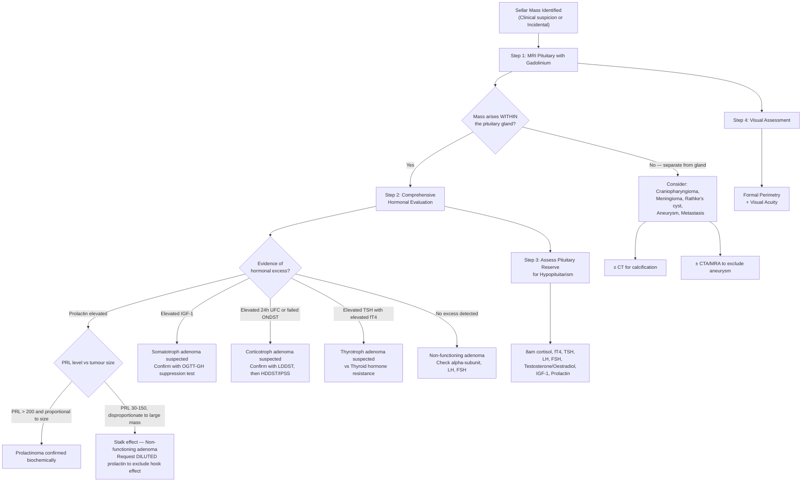

## Diagnostic Approach to Pituitary Adenoma

### The Diagnostic Philosophy — Why We Investigate

When you encounter a sellar mass, you need to answer **three fundamental questions** before you can manage the patient. Every single investigation you order serves one of these three goals [2]:

1. **What is it?** → Imaging (MRI, ± CT) to characterise the mass.
2. **Is it hormonally active?** → Biochemical hormonal panel to identify excess and/or deficiency.
3. **What is the functional impact on surrounding structures?** → Visual field testing, assessment of pituitary reserve.

There are no formal "diagnostic criteria" for pituitary adenoma in the way that, say, rheumatoid arthritis has ACR/EULAR criteria. Instead, the diagnosis is established by **integrating imaging appearance + hormonal profile + clinical context**, and confirmed definitively by **histopathology** after surgical resection (when performed). Let me walk you through this systematically.

---

### Master Diagnostic Algorithm

---

### Step 1: Imaging — Defining the Anatomy

#### A. MRI Pituitary with Gadolinium Enhancement — The Gold Standard

***MRI pituitary is the single best imaging procedure for most sellar masses and there is usually no need to perform any other imaging study*** [2].

**Why MRI and not CT?**
- MRI provides superior **soft-tissue contrast** — you can distinguish the normal pituitary (bright with gadolinium) from adenoma tissue (enhances less), and delineate the relationship with the optic chiasm, cavernous sinuses, and ICA.
- CT cannot adequately visualise soft tissue in the sella (bony artefact from the skull base degrades the image).

**Protocol**: Dedicated thin-cut (2–3 mm) coronal and sagittal T1-weighted sequences **before and after gadolinium**, plus T2-weighted sequences.

| Sequence | What It Shows | Key Findings in Pituitary Adenoma |
|:---------|:-------------|:----------------------------------|
| **T1 pre-contrast** | Native tissue signal | Adenoma is isointense to grey matter; haemorrhagic areas bright (T1 shortening from methaemoglobin in apoplexy) |
| **T1 post-gadolinium** | Enhancement pattern | ***Normal pituitary tissue takes up gadolinium to a greater degree than CNS tissue*** → higher-intensity signal. ***Pituitary adenomas take up gadolinium to a lesser degree than normal pituitary but more than CNS*** [2]. Delayed images may show "catch-up" enhancement of the adenoma. |
| **T2-weighted** | Fluid and tissue characterisation | Adenomas variable; cysts are bright; **flow voids** (dark signal) in vessels — critical to identify ICA aneurysm |
| **Coronal thin-cut** | Relationship to optic chiasm and cavernous sinus | Suprasellar extension, optic chiasm compression, cavernous sinus invasion |
| **Dynamic contrast-enhanced** | Early vs late enhancement | Microadenomas enhance later than normal pituitary on early dynamic sequences (within 30–60 seconds post-gadolinium) — this is the **most sensitive technique for microadenomas** |

**Key MRI Interpretation Principles** [2]:

- ***If a sellar lesion can be seen as separate from the normal pituitary gland, this indicates the mass is NOT a pituitary adenoma*** [2] — it is something else (craniopharyngioma, meningioma, Rathke's cyst, aneurysm).
- **Microadenomas** (< 1 cm): appear as a focal area of **hypoenhancement** within the normally brightly enhancing gland on early dynamic sequences. The normal gland enhances avidly because it has a rich portal blood supply; the adenoma has its own disorganised vasculature that enhances more slowly.
- **Macroadenomas** (> 1 cm): obvious sellar mass, often with **suprasellar extension** (snowman/figure-of-8 shape), **cavernous sinus invasion** (encasing the ICA), and/or **infrasellar extension** into the sphenoid sinus.

<Callout title="Gadolinium Safety" type="error">
***AVOID gadolinium in patients with moderate to advanced renal failure (eGFR < 30) since it has been associated with nephrogenic systemic fibrosis*** [2] — a devastating fibrotic condition of skin and internal organs. Always check renal function before ordering gadolinium-enhanced MRI. In such patients, non-contrast MRI still provides useful information, or consider macrocyclic gadolinium agents (lower risk).
</Callout>

#### Knosp Classification — Cavernous Sinus Invasion

The **Knosp classification** grades the degree of cavernous sinus invasion on coronal MRI, which predicts surgical resectability:

| Knosp Grade | Description | Surgical Implication |
|:------------|:-----------|:--------------------|
| **0** | Adenoma does not reach the medial wall of cavernous sinus | Complete resection likely |
| **1** | Adenoma passes medial wall but does not reach the intercarotid line (a line between the medial tangents of the intracavernous ICA) | Complete resection possible |
| **2** | Adenoma reaches but does not pass the intercarotid line | Complete resection more difficult |
| **3** | Adenoma passes beyond the lateral intercarotid line | Complete resection unlikely; cavernous sinus invaded |
| **4** | Adenoma completely encases the intracavernous ICA | Complete resection not possible; surgery is for debulking only |

> Knosp grade 3–4 = high probability of cavernous sinus invasion → incomplete surgical resection → likely need adjuvant radiotherapy.

#### B. CT Scan — When and Why

***Calcification in a craniopharyngioma or meningioma is seen better by CT scan than by MRI*** [2].

CT is **not** routinely needed for pituitary adenoma evaluation but is useful when:
- You suspect **craniopharyngioma** (calcification in ~90% paediatric, ~50% adult) or **meningioma** (psammomatous calcification).
- You need to assess **bony anatomy** of the sella (floor erosion, sphenoid sinus pneumatisation) for **pre-operative surgical planning** of transsphenoidal approach.
- MRI is contraindicated (e.g., non-MRI-compatible pacemaker).

#### C. CTA / MRA — To Exclude Aneurysm

***Cerebral aneurysm mimicking a sellar tumour*** [1] — whenever a sellar mass has **flow voids** on T2 MRI or an unusual appearance, order CTA or MRA to exclude an ICA aneurysm before any surgical intervention. Operating on an unsuspected aneurysm transsphenoidally = catastrophic haemorrhage.

#### D. ***Gadolinium Contrast-Enhanced MRI*** — The Investigation of Choice for Brain Tumours [3]

***Gadolinium contrast-enhanced MRI*** is the standard imaging for all brain tumours, including pituitary adenomas [3]. Other MRI sequences that may be helpful:
- ***FLAIR***: shows perilesional oedema (vasogenic edema, most apparent on FLAIR) [3]
- ***DWI***: differentiates cystic tumour (facilitated diffusion) from abscess (restricted diffusion) [3]
- ***Spectroscopy (MRS)***: can help characterise tumour biochemistry (less relevant for adenomas, more for gliomas)

---

### Step 2: Biochemical Hormonal Evaluation — Identifying Excess

This is the step that **classifies** the adenoma by functional subtype and directly determines management (e.g., prolactinoma → medical; others → surgical).

***Hormonal evaluation*** [2]:

#### A. Every Patient with a Sellar Mass — Baseline Panel

**Every** patient with a sellar mass should have a **complete anterior pituitary hormone panel**, regardless of whether the mass is suspected to be functioning or non-functioning. This is because:
1. You need to identify unsuspected hypersecretion (e.g., mild acromegaly, subclinical Cushing's).
2. You need to assess for hypopituitarism (which affects anaesthetic and surgical safety — cortisol deficiency can kill).

| Hormone Axis | Test | What You're Looking For |
|:-------------|:-----|:----------------------|
| **Prolactin** | ***Serum prolactin level*** | Elevated → prolactinoma vs stalk effect vs drugs |
| **GH/IGF-1** | ***Serum IGF-1*** | Elevated IGF-1 → somatotroph adenoma (acromegaly) |
| **ACTH-Cortisol** | ***24-hour urinary cortisol excretion*** (or 1 mg overnight dexamethasone suppression test, late-night salivary cortisol) | Elevated → corticotroph adenoma (Cushing's disease) |
| **TSH-Thyroid** | ***TSH, fT3, fT4*** | Elevated TSH + elevated fT4 → thyrotroph adenoma (or thyroid hormone resistance) |
| **Gonadotropins** | ***Serum LH, FSH, and α-subunit*** | Usually normal or low (gonadotroph adenomas are inefficient); elevated α-subunit suggests gonadotroph origin |
| **Sex steroids** | Testosterone (males), Oestradiol (females) | Low → hypogonadism from gonadotropin deficiency or hyperprolactinaemia |

#### B. Subtype-Specific Confirmatory Tests

##### 1. Prolactinoma — Serum Prolactin

The **diagnosis of prolactinoma is essentially biochemical** — you do NOT need biopsy. The principle is: ***serum prolactin level is proportional to tumour mass*** in true prolactinomas.

| Scenario | Prolactin Level | Interpretation |
|:---------|:---------------|:--------------|
| Normal | < 25 ng/mL (varies by lab) | Normal |
| **Stalk effect** | 30–150 ng/mL (usually < 100) | Non-functioning mass compressing stalk → loss of dopamine inhibition |
| **Microprolactinoma** | 50–200 ng/mL | Small tumour, moderate PRL elevation |
| **Macroprolactinoma** | > 200 ng/mL (often > 1,000) | Large tumour with proportionally high PRL |
| **Giant prolactinoma** | > 10,000 ng/mL | May show **hook effect** on immunoassay |

<Callout title="Hook Effect — Always Request Dilutions for Large Sellar Masses" type="error">
In giant prolactinomas with extremely high PRL ( > 10,000 ng/mL), the antibody in the two-site immunoassay becomes **saturated** — excess antigen prevents sandwich formation → **falsely low/normal reported PRL**. The clinician sees a 4 cm mass with "normal" prolactin and concludes it's non-functioning → unnecessary surgery. **Always request serial dilutions (1:100)** for any large sellar mass. If the diluted sample reveals a much higher prolactin, you've caught the hook effect.
</Callout>

Also check for **macroprolactinaemia** — prolactin bound to IgG forming large complexes ("big-big prolactin") that are immunoreactive but biologically inactive. Detected by **polyethylene glycol (PEG) precipitation**: if > 60% of total PRL is precipitated, macroprolactinaemia is present. These patients have elevated PRL on assay but **no clinical symptoms** — no treatment needed.

##### 2. Somatotroph Adenoma (Acromegaly) — IGF-1 + OGTT

***Somatotroph adenoma = Serum insulin-like growth factor-1 (IGF-1)*** [2].

**Why IGF-1 and not just GH?**
- GH is secreted in **pulsatile fashion** — a single random GH level is unreliable (it can be undetectable even in acromegaly between pulses, and transiently elevated in normals during stress, exercise, or sleep).
- **IGF-1** (produced by the liver in response to GH) has a **long half-life (~18 hours)** and reflects **integrated GH exposure** over days. It is the ideal screening test.

| Test | Method | Interpretation |
|:-----|:-------|:--------------|
| **Serum IGF-1** (screening) | Single fasting blood sample; compare to **age- and sex-matched reference range** (IGF-1 declines with age) | Elevated IGF-1 → acromegaly suspected |
| **Oral Glucose Tolerance Test (OGTT) with GH measurement** (confirmatory) | 75 g oral glucose load; measure GH at 0, 30, 60, 90, 120 minutes | **Normal**: GH suppresses to < 0.4 μg/L (by ultrasensitive assay) or < 1 μg/L (by conventional assay) after glucose load. **Acromegaly**: GH **fails to suppress** (remains > 1 μg/L). Some patients show paradoxical GH **rise**. |

**Why does glucose suppress GH?** Glucose is the primary metabolic fuel; when glucose is abundant, the body doesn't need GH (which is counter-regulatory and mobilises fat/glucose). Somatostatin release from the hypothalamus is augmented by hyperglycaemia → suppresses GH. In somatotroph adenomas, the tumour cells are **autonomous** and don't respond to this physiological inhibition.

##### 3. Corticotroph Adenoma (Cushing's Disease) — The Three-Step Approach

***Corticotroph adenoma = 24-hour urinary cortisol excretion*** [2].

Diagnosing Cushing's disease is the most complex of all adenoma subtypes because you must navigate three sequential questions:

**Step A: Is there cortisol excess? (Screening)**

| Screening Test | Method | Positive Result | Why It Works |
|:---------------|:-------|:---------------|:-------------|
| **24-hour urinary free cortisol (UFC)** × 2–3 | Collect all urine for 24 hours; measures unbound (free) cortisol excreted by kidneys | > 3–4× ULN is highly specific; mild elevations need repeat | Reflects integrated daily cortisol production; not affected by CBG fluctuations |
| **1 mg overnight dexamethasone suppression test (ONDST)** | Give 1 mg dexamethasone at 11 PM; measure 8 AM cortisol next morning | Cortisol > 50 nmol/L (1.8 μg/dL) = non-suppressed | Dexamethasone (potent synthetic glucocorticoid) should suppress ACTH → cortisol in normal HPA axis. Autonomous cortisol production (Cushing's) is NOT suppressed. |
| **Late-night salivary cortisol** × 2 | Salivary sample at 11 PM – midnight | Elevated above lab cut-off | Normal cortisol nadir is at midnight (circadian rhythm). Loss of diurnal variation is an early feature of Cushing's syndrome. |

> **2 out of 3 screening tests positive ± high clinical pre-test probability** → proceed to confirmation [6].

**Step B: Is it ACTH-dependent or ACTH-independent?**

| Measurement | ACTH-Dependent (Pituitary or Ectopic) | ACTH-Independent (Adrenal) |
|:-----------|:-------------------------------------|:--------------------------|
| **Plasma ACTH** | Normal or elevated ( > 10 pg/mL) | Suppressed ( < 5 pg/mL) |
| **Mechanism** | ACTH-secreting source drives adrenal cortisol production | Autonomous adrenal cortisol production suppresses CRH and ACTH via negative feedback |

**Step C: Is the ACTH coming from the pituitary or ectopic source?**

| Test | Method | Pituitary (Cushing's Disease) | Ectopic ACTH |
|:-----|:-------|:-----------------------------|:-------------|
| **High-dose dexamethasone suppression test (HDDST)** | 2 mg dexamethasone Q6H × 48 hours (total 8 mg/day); measure cortisol | Cortisol suppresses > 50% from baseline | No suppression (ectopic tumours are fully autonomous) |
| **CRH stimulation test** | IV CRH 100 μg; measure ACTH and cortisol | ACTH/cortisol rise > 35–50% (pituitary corticotrophs retain some CRH responsiveness) | No rise (ectopic ACTH source doesn't have CRH receptors) |
| **Inferior petrosal sinus sampling (IPSS)** — Gold standard | Catheterise both inferior petrosal sinuses (which drain the pituitary); measure ACTH centrally vs peripherally, before and after CRH stimulation | Central:peripheral ACTH ratio > 2 (basal) or > 3 (post-CRH) | Ratio < 2 (ACTH is not concentrated in the pituitary outflow) |

> IPSS is the **gold standard** for distinguishing pituitary from ectopic ACTH. It is invasive and requires an experienced interventional radiologist, but it has ~95% sensitivity and specificity. It also lateralises the adenoma within the pituitary (useful for the surgeon when MRI is equivocal — many corticotroph adenomas are microadenomas too small to see on MRI).

##### 4. Thyrotroph Adenoma — TSH + fT4/fT3

***Thyrotroph adenoma: TSH, fT3 and fT4 level*** [2].

| Pattern | Interpretation | Mechanism |
|:--------|:--------------|:----------|
| ↑ TSH + ↑ fT4/fT3 | **TSH-secreting adenoma** OR **thyroid hormone resistance** | Adenoma autonomously produces TSH despite high T4/T3 (no negative feedback); alternatively, resistance at the receptor level means the hypothalamus/pituitary cannot "see" the high T4/T3 |
| ↑ TSH + ↓ fT4 | **Primary hypothyroidism** (NOT an adenoma) | Loss of T4 → loss of negative feedback → TSH rises appropriately |

***If TSH is normal or increased AND fT4 is high → consider TSH-secreting pituitary adenoma or thyroid hormone resistance syndrome*** [7].

**How to differentiate TSH-oma from thyroid hormone resistance:**

| Feature | TSH-Secreting Adenoma | Thyroid Hormone Resistance |
|:--------|:---------------------|:--------------------------|
| Mass on MRI | Usually a visible macroadenoma | No mass (normal pituitary) |
| Alpha-subunit | Often elevated (co-secreted) | Normal |
| T3 suppression test | TSH does NOT suppress with exogenous T3 | TSH suppresses normally |
| Family history | Sporadic | Often familial (TRβ mutation) |
| SHBG, ferritin | Elevated (reflect peripheral thyroid hormone action) | Normal (peripheral tissues also resistant) |

##### 5. Gonadotroph Adenoma — LH, FSH, α-subunit

***Gonadotroph adenoma = Serum LH, FSH level and α-subunits*** [2].

- Most gonadotroph adenomas are ***non-functioning*** and diagnosed as such after exclusion of all other secretory subtypes.
- ***α-subunit is not biologically active and does not result in clinical symptoms due to its secretion but is measured to evaluate patients with sellar masses to determine if the mass is pituitary in origin*** [2].
- Mildly elevated FSH in a postmenopausal woman does NOT confirm a gonadotroph adenoma — you expect elevated gonadotropins physiologically. In premenopausal women or men, elevated FSH with a sellar mass is more suggestive.
- **TRH stimulation test** (rarely used now): in gonadotroph adenomas, TRH paradoxically stimulates LH/FSH release (normal gonadotrophs do not respond to TRH). This can help confirm gonadotroph origin.

---

### Step 3: Assessment of Pituitary Reserve (Hypopituitarism Screen)

For every patient with a sellar mass — especially macroadenomas — you must assess **all pituitary axes** for deficiency, because hypopituitarism affects anaesthetic safety, surgical planning, and long-term care [2]:

| Axis | Screening Test | What Indicates Deficiency | Clinical Consequence |
|:-----|:--------------|:------------------------|:--------------------|
| **ACTH-Cortisol** | **8 AM serum cortisol** | < 100 nmol/L = deficient; > 400 nmol/L = sufficient; 100–400 = indeterminate → proceed to dynamic testing | Adrenal crisis if not replaced peri-operatively |
| **TSH-Thyroid** | **fT4, TSH** | Low fT4 with low/normal TSH (inappropriate) | Secondary hypothyroidism |
| **LH/FSH-Gonadal** | **LH, FSH, Testosterone (M) / Oestradiol (F)** | Low sex steroids with low/normal gonadotropins | Hypogonadism, infertility, osteoporosis |
| **GH** | **IGF-1** (screening); **Insulin tolerance test (ITT)** or **GHRH-arginine test** (confirmatory) | Low IGF-1 + GH fails to rise > 3–5 μg/L on ITT | GH deficiency (fatigue, ↑ body fat, ↓ lean mass, ↓ QoL) |
| **Prolactin** | **Serum prolactin** | Very low prolactin (rare clinical significance) | Inability to lactate |
| **ADH (posterior pit)** | **Serum and urine osmolality, serum sodium** | High serum osmolality + dilute urine + hypernatraemia → DI | Diabetes insipidus (mainly post-operative or if stalk involved) |

#### Dynamic Tests for Cortisol Reserve — When Basal Cortisol Is Indeterminate

| Test | Protocol | Normal Response | When to Use |
|:-----|:---------|:---------------|:-----------|
| **Insulin Tolerance Test (ITT)** — Gold standard | IV insulin → induce hypoglycaemia (glucose < 2.2 mmol/L) → maximal stress → cortisol should rise | Peak cortisol > 500–550 nmol/L | Contraindicated in elderly, epilepsy, IHD. Must have doctor present with IV glucose/hydrocortisone at bedside. |
| **Short Synacthen Test (SST)** | IM/IV 250 μg Synacthen (synthetic ACTH1-24); measure cortisol at 0 and 30 minutes | 30-min cortisol > 500–550 nmol/L | More commonly used in practice; tests adrenal reserve. In **acute** secondary adrenal insufficiency, the adrenals may still respond (haven't atrophied yet), so SST can be falsely normal. Only reliable in **chronic** (> 4–6 weeks) ACTH deficiency. |
| **Metyrapone test** | Metyrapone blocks 11β-hydroxylase → ↓ cortisol → should ↑ ACTH and 11-deoxycortisol | 11-deoxycortisol > 200 nmol/L | Alternative to ITT; tests entire HPA axis |

<Callout title="Pre-operative Cortisol Assessment Is Non-Negotiable" type="error">
**Before any pituitary surgery, you MUST assess cortisol reserve.** If the patient has secondary adrenal insufficiency and you don't give peri-operative hydrocortisone cover, they can develop hypotensive shock during surgery. ***Hypopituitarism can cause shock (cortisol)*** [1]. ***Give cortisol before T4*** [1] — this applies both to apoplexy and to any situation where you're replacing pituitary hormones.
</Callout>

---

### Step 4: Visual Assessment

#### A. Formal Visual Field Perimetry (Goldmann or Humphrey)

***Visual (bitemporal hemianopia)*** [1] — this is the classic visual field defect from optic chiasm compression.

- **Goldmann perimetry** (kinetic): a light target is moved from periphery to centre; the patient indicates when they see it. Useful for detecting peripheral field loss.
- **Humphrey perimetry** (static, automated): tests multiple fixed points; more reproducible and standardised. This is the more commonly used modality in modern practice.
- **Why formal perimetry?** Confrontation testing at the bedside is insensitive for early chiasmal compression. Formal perimetry can detect subtle superior temporal quadrantanopia (the earliest sign) that confrontation misses.
- Must be performed **pre-operatively** (baseline) and **post-operatively** (to document improvement or detect deterioration). ***Visual loss — close monitoring post-op*** [1].

#### B. Visual Acuity

- Best corrected visual acuity (BCVA) using Snellen or LogMAR chart.
- Decreased VA indicates **more severe compression** of the optic chiasm or nerves.

#### C. Optical Coherence Tomography (OCT)

- Non-invasive measurement of **retinal nerve fibre layer (RNFL) thickness**.
- Thinned RNFL indicates **chronic axonal loss** from prolonged chiasmal compression → poorer prognosis for visual recovery after surgery.
- Increasingly used as an adjunct to perimetry.

#### D. Fundoscopy

- Look for **optic disc pallor** (optic atrophy from chronic compression) — this is a poor prognostic sign for visual recovery.
- In rare cases with very large adenomas causing raised ICP, you may see **papilloedema** (but this is unusual because most adenomas don't raise global ICP significantly).

---

### Step 5: Additional Investigations for Special Scenarios

| Scenario | Investigation | Rationale |
|:---------|:-------------|:---------|
| **Suspected MEN1** | Serum calcium, PTH, fasting glucose/insulin, pancreatic hormones, genetic testing for MEN1 | Pituitary adenoma + parathyroid hyperplasia + pancreatic NET |
| **Suspected ectopic GHRH** | Serum GHRH level | If acromegaly with diffuse pituitary enlargement (hyperplasia rather than adenoma) |
| **Suspected metastasis** | Staging CT (chest/abdomen/pelvis), tumour markers, PET-CT | Posterior pituitary/stalk mass + known malignancy or high-risk features |
| **Post-operative CSF leak** | ***Beta-2-transferrin*** [1] in nasal fluid; ***Pneumocephalus*** on CT [1] | ***CSF leakage and meningitis*** [1] — beta-2-transferrin is unique to CSF (not present in nasal secretions or tears); pneumocephalus (air within the cranium on CT) confirms intracranial-nasal communication |
| ***Pituitary apoplexy*** | **Urgent MRI** (or CT if MRI unavailable); 8 AM cortisol/random cortisol; electrolytes (Na for DI) | ***Acute haemorrhagic infarction ± SAH; headache, visual loss; acute cortisol insufficiency*** [1]. T1 hyperintensity = subacute blood (methaemoglobin); T2 variable. |

---

### Putting It All Together — Summary of Investigation Modalities

| Investigation | What It Tells You | Key Findings | Pitfalls |
|:-------------|:-----------------|:-------------|:---------|
| ***MRI Pituitary with gadolinium*** | Anatomy, size, extension, invasion | Adenoma: hypoenhancing relative to normal gland; separate mass = NOT adenoma | Gadolinium contraindicated if eGFR < 30; may miss microadenomas without dynamic sequences |
| ***CT scan*** | Calcification, bony anatomy | ***Calcification → craniopharyngioma or meningioma*** [2] | Poor soft tissue contrast for sella |
| **CTA / MRA** | Vascular anatomy | Flow voids → ***aneurysm mimicking sellar tumour*** [1] | Invasive (CTA); gadolinium concern (MRA) |
| ***Serum prolactin*** | Prolactinoma vs stalk effect vs drugs | Proportional to tumour size in prolactinoma; mild elevation = stalk effect | Hook effect in giant tumours; macroprolactinaemia |
| ***Serum IGF-1*** | GH excess screening | Elevated for age → acromegaly | Must use age/sex-matched ranges; falsely low in malnutrition, liver disease |
| ***OGTT with GH*** | Confirm acromegaly | Failure of GH suppression < 1 μg/L | Diabetes mellitus can confound interpretation |
| ***24h urinary free cortisol*** | Cortisol excess screening | > 3–4× ULN highly specific | Stress, depression, alcohol can elevate UFC (pseudo-Cushing's) |
| **1 mg ONDST** | Cortisol excess screening | 8 AM cortisol > 50 nmol/L = non-suppressed | False positives: CYP3A4 inducers (phenytoin, rifampicin) accelerate dex metabolism |
| **Plasma ACTH** | Dependent vs independent Cushing's | > 10 pg/mL = ACTH-dependent | Must be processed on ice immediately (ACTH degrades rapidly at room temperature) |
| **IPSS** | Pituitary vs ectopic ACTH | Central:peripheral > 2 (basal) or > 3 (post-CRH) | Anatomical variants in venous drainage can cause lateralisation errors |
| ***TSH, fT4, fT3*** | Thyrotroph adenoma / thyroid status | ↑ TSH + ↑ fT4 = TSH-oma or resistance | Must exclude assay interference (heterophilic antibodies) |
| ***LH, FSH, α-subunit*** | Gonadotroph classification | Elevated α-subunit suggests pituitary origin | Postmenopausal women normally have elevated gonadotropins |
| **Formal perimetry** | Visual field defect | ***Bitemporal hemianopia*** | Requires patient cooperation; unreliable if VA very poor |
| **8 AM cortisol** | Pituitary reserve | < 100 = deficient; > 400 = sufficient | Single value; 100–400 indeterminate → need dynamic test |
| **ITT / SST** | Dynamic cortisol reserve | Peak cortisol > 500–550 nmol/L = adequate | SST may be falsely normal in acute ACTH deficiency |

---

<Callout title="High Yield Summary — Diagnosis of Pituitary Adenoma">

1. **MRI pituitary with gadolinium** is the single best imaging study. Normal pituitary enhances more than adenoma. If the lesion is separate from the gland, it is NOT an adenoma.
2. **CT** only for calcification (craniopharyngioma, meningioma) and bony anatomy pre-operatively.
3. **Every sellar mass** gets a complete hormonal panel: prolactin, IGF-1, 24h UFC (or ONDST), TSH/fT4, LH/FSH, testosterone or oestradiol, 8 AM cortisol.
4. **Prolactinoma**: diagnosed biochemically (PRL proportional to size). Always request dilutions for large masses (hook effect). Check for macroprolactinaemia (PEG precipitation).
5. **Acromegaly**: Screen with IGF-1; confirm with OGTT (GH should suppress < 1 μg/L; failure to suppress = acromegaly).
6. **Cushing's disease**: 3-step approach — (a) Confirm excess (UFC/ONDST/late-night salivary cortisol), (b) ACTH level (dependent vs independent), (c) HDDST/CRH/IPSS (pituitary vs ectopic). IPSS is gold standard.
7. **TSH-oma**: ↑ TSH + ↑ fT4; differentiate from thyroid hormone resistance (MRI mass, elevated α-subunit, T3 non-suppression → TSH-oma).
8. **Pituitary reserve**: Assess all axes pre-operatively. 8 AM cortisol is critical. Give cortisol before T4.
9. **Visual assessment**: Formal perimetry (Humphrey/Goldmann) pre- and post-operatively. OCT for RNFL thickness (prognostic).
10. **CSF leak**: Beta-2-transferrin positive; pneumocephalus on CT.
</Callout>

---

<ActiveRecallQuiz
  title="Active Recall - Diagnosis of Pituitary Adenoma"
  items={[
    {
      question: "Why is IGF-1 a better screening test for acromegaly than a random GH level? What is the confirmatory test and what constitutes a normal result?",
      markscheme: "GH is secreted in a pulsatile fashion so a single random level is unreliable - it can be undetectable between pulses even in acromegaly. IGF-1 has a long half-life of approximately 18 hours and reflects integrated GH exposure. Confirmatory test is the oral glucose tolerance test (75g glucose load) with GH measurement. Normal response: GH suppresses to less than 1 mcg/L (or less than 0.4 by ultrasensitive assay). In acromegaly, GH fails to suppress."
    },
    {
      question: "A patient has a 3 cm sellar mass and serum prolactin of 45 ng/mL. The clinician suspects a prolactinoma. What should you consider and what test should you request?",
      markscheme: "A 3 cm mass with only mildly elevated prolactin of 45 ng/mL is disproportionate - a true macroprolactinoma of this size should have prolactin greater than 200, often greater than 1000 ng/mL. Two possibilities: (1) This is a non-functioning adenoma causing stalk effect (loss of dopamine inhibition, PRL typically 30-150), or (2) This is a giant prolactinoma with the hook effect (antibody saturation in the immunoassay giving falsely low PRL). Request serial dilutions (1:100) of the serum sample to unmask the true prolactin level."
    },
    {
      question: "Describe the three-step approach to diagnosing Cushing's disease from a corticotroph adenoma. Name the gold standard test for step 3.",
      markscheme: "Step 1: Confirm cortisol excess with screening tests - 24h urinary free cortisol, 1mg overnight dexamethasone suppression test (cortisol greater than 50 nmol/L = non-suppressed), or late-night salivary cortisol. Need 2 out of 3 positive. Step 2: Determine if ACTH-dependent or independent by measuring plasma ACTH (greater than 10 pg/mL = dependent). Step 3: Localise the ACTH source as pituitary vs ectopic using high-dose dexamethasone suppression test, CRH stimulation test, and/or inferior petrosal sinus sampling (IPSS). IPSS is the gold standard - central to peripheral ACTH ratio greater than 2 basal or greater than 3 post-CRH confirms pituitary source."
    },
    {
      question: "On MRI pituitary with gadolinium, how does a pituitary adenoma enhance relative to normal pituitary tissue and to surrounding CNS? What does it mean if the lesion is seen as separate from the normal gland?",
      markscheme: "Normal pituitary tissue takes up gadolinium to a greater degree than CNS tissue, appearing as a higher-intensity signal. Pituitary adenomas take up gadolinium to a lesser degree than normal pituitary but more than surrounding CNS. If a sellar lesion can be seen as separate from the normal pituitary gland, this indicates the mass is NOT a pituitary adenoma - consider craniopharyngioma, meningioma, Rathke's cyst, or aneurysm."
    },
    {
      question: "Why must you assess cortisol reserve before pituitary surgery, and what are the two key rules about hormone replacement in acute pituitary insufficiency?",
      markscheme: "Cortisol deficiency from ACTH loss can cause life-threatening adrenal crisis (hypotension, shock) during the stress of surgery. Must check 8 AM cortisol pre-operatively and give peri-operative hydrocortisone cover if deficient or indeterminate. Two key rules: (1) Always give cortisol replacement before T4 replacement - T4 increases metabolic rate and cortisol demand, precipitating adrenal crisis in the cortisol-deficient patient. (2) Hypopituitarism can cause shock from cortisol deficiency - always replace cortisol first in any acute pituitary insufficiency."
    },
    {
      question: "How do you confirm a CSF leak after transsphenoidal surgery? Name two positive findings.",
      markscheme: "CSF leak is confirmed by testing nasal fluid for beta-2-transferrin, which is unique to CSF and not present in nasal secretions or tears. A positive beta-2-transferrin test confirms CSF origin. Additionally, CT brain may show pneumocephalus (air within the cranial cavity), which confirms communication between the nasal cavity and intracranial space."
    }
  ]}
/>

## References

[1] Lecture slides: GC 108. A mass in the brain brain tumours.pdf (Pituitary Adenoma — common presentations; Pituitary Apoplexy — give cortisol before T4; Complications of Transsphenoidal Surgery — beta-2-transferrin, pneumocephalus, hypopituitarism can cause shock; Cerebral aneurysm mimicking sellar tumour; Other Presentations — bitemporal hemianopia)
[2] Senior notes: felixlai.md (Pituitary adenoma: Diagnosis — hormonal evaluation, MRI pituitary, gadolinium-enhanced imaging, CT for calcification, classification by cell of origin, α-subunit interpretation)
[3] Senior notes: maxim.md (Brain tumours: Investigations — gadolinium contrast-enhanced MRI, FLAIR, DWI; Skull base tumours)
[6] Senior notes: maxim.md (Cushing syndrome diagnosis — 2 out of 3 screening tests; ONDST, 24h UFC, LDDST/late night salivary cortisol)
[7] Senior notes: felixlai.md (Evaluation of thyrotoxicosis flowchart — TSH normal or increased with high unbound T4 → TSH-secreting pituitary adenoma or thyroid hormone resistance syndrome)
