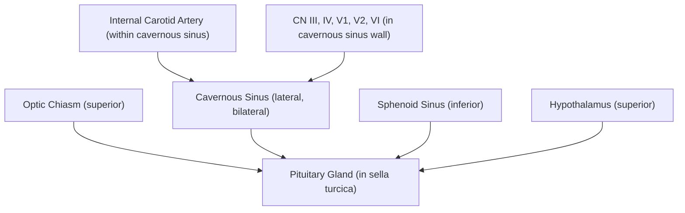
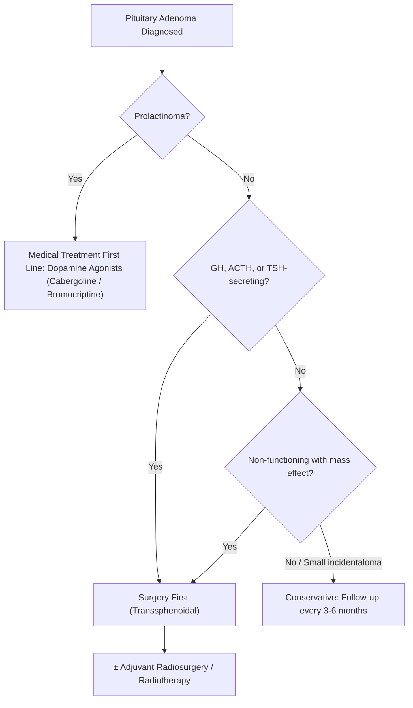

## Definition

**Pituitary adenoma** — the name tells you exactly what it is: "pituitary" = the pituitary gland, "adeno-" (Greek *adēn*) = gland, "-oma" = tumour. So a pituitary adenoma is a **benign neoplasm arising from the epithelial cells of the anterior pituitary gland (adenohypophysis)** [1][2].

> ***Pituitary adenomas are benign tumours of the anterior pituitary*** [2]. They do **not** arise from the posterior pituitary (neurohypophysis), which is neural tissue — tumours there are called pituicytomas.

Key conceptual points right from the start:

- Despite being histologically **benign**, pituitary adenomas can cause devastating clinical consequences through **two mechanisms**: (1) **mass effect** — compressing surrounding structures (optic chiasm, cavernous sinus, hypothalamus, normal pituitary), and (2) **hormonal dysregulation** — either hypersecretion of one or more anterior pituitary hormones, or hypopituitarism from compression of normal glandular tissue [1][2].
- ***The distinction between "benign" vs "malignant" is less important for brain tumours*** — what matters clinically is the **anatomical location**, **possibility of surgical removal**, and **risk of neurological consequences** [1].

<Callout title="Why 'benign' doesn't mean 'harmless'">
A 2 cm pituitary macroadenoma sitting on the optic chiasm can blind a patient. A functioning microadenoma can cause Cushing's syndrome with all its metabolic devastation. "Benign" here means it doesn't metastasise — but it can absolutely destroy quality of life and even be life-threatening (pituitary apoplexy).
</Callout>

---

## Epidemiology

### Prevalence and Incidence

- ***Pituitary adenomas are the most common cause of sellar masses from the 3rd decade onwards***, accounting for ***up to 10% of intracranial neoplasms*** [2].
- ***Found in 20–25% of pituitary glands at autopsy*** — the vast majority are clinically silent "incidentalomas" [1].
- Among ***primary extra-axial brain tumours***, pituitary adenomas account for approximately ***7%*** [3].
- Clinically significant pituitary adenomas have an estimated prevalence of ~80–100 per 100,000 population.
- ***Brain tumours overall represent 1–2% of all malignancies, 13% of all malignancy-related deaths*** [3].

### Age and Sex Distribution

- Peak incidence: **30–60 years** (reproductive and middle age), though they can occur at any age.
- **Prolactinomas** have a female predominance (F:M ≈ 10:1 for microprolactinomas) — largely because symptoms in women (amenorrhoea, galactorrhoea) prompt earlier diagnosis.
- **Non-functioning adenomas** and **somatotroph adenomas** have roughly equal sex distribution, but men tend to present later with macroadenomas (less obvious early hormonal symptoms).
- In children: pituitary adenomas are uncommon (~2–6% of paediatric intracranial tumours); corticotroph and prolactin-secreting adenomas are the most frequent subtypes in this group.

### Prevalence by Subtype (Descending Order)

***Prevalence of different types of pituitary adenoma (descending order of frequency)*** [2]:

| Rank | Adenoma Subtype | Approximate Frequency |
|:-----|:----------------|:---------------------|
| 1 | ***Lactotroph (prolactinoma)*** | ~40–45% |
| 2 | ***Non-functioning adenoma*** | ~25–35% |
| 3 | ***Somatotroph adenoma*** | ~10–15% |
| 4 | ***Corticotroph adenoma*** | ~5–10% |
| 5 | Thyrotroph adenoma | < 1–2% (rarest) |

> Note: ***70–90% of non-functioning adenomas are gonadotroph adenomas, making them the most common type of pituitary macroadenoma*** [2]. They are "non-functioning" because gonadotroph adenomas are typically ***poorly differentiated and inefficient secretors*** — by the time they produce supranormal levels, they are already macroadenomas presenting with mass effect rather than hormonal syndromes [2].

### Hong Kong Context

- In Hong Kong, the pattern follows international data closely. Prolactinomas remain the most common functioning adenoma.
- With widespread availability of MRI, **pituitary incidentalomas** are increasingly common — up to 10–38% of MRIs performed for unrelated reasons may show a pituitary abnormality.
- Relevant familial syndromes (MEN1, MEN2) exist in local populations but are uncommon.

---

## Risk Factors

### Sporadic (Vast Majority ~95%)
Most pituitary adenomas are **sporadic** with no identifiable cause. They arise from **monoclonal expansion** of a single mutated anterior pituitary cell.

### Genetic/Familial Syndromes (~5%)

| Syndrome | Gene | Pituitary Manifestation | Other Features |
|:---------|:-----|:----------------------|:---------------|
| ***MEN1*** | ***MEN1 encoding MENIN*** (tumour suppressor, chromosome 11q13) | ***Pituitary tumour (Prolactinoma*** most common, ~60%; also GH/ACTH-secreting) | ***Pancreatic endocrine tumour, Parathyroid hyperplasia*** |
| ***MEN2A*** | ***RET*** oncogene | Not typically pituitary | ***Medullary thyroid carcinoma, Phaeochromocytoma, Parathyroid hyperplasia*** |
| ***MEN4*** | CDKN1B (p27) | Pituitary adenomas | Parathyroid adenomas + other endocrine tumours |
| **Carney complex** | PRKAR1A | GH-secreting adenomas | Cardiac myxomas, skin pigmentation, adrenal nodular disease |
| **Familial Isolated Pituitary Adenomas (FIPA)** | AIP (aryl hydrocarbon receptor interacting protein) | Somatotroph/prolactinomas (young onset, often aggressive) | No other endocrine tumours |
| **McCune-Albright syndrome** | GNAS1 (somatic activating) | GH excess | Polyostotic fibrous dysplasia, café-au-lait spots, precocious puberty |

<Callout title="MEN1 Mnemonic: 3 P's">
**P**ituitary + **P**arathyroid + **P**ancreas — "PPP" for MEN1. The pituitary tumour is most commonly a **prolactinoma**. [2][4]
</Callout>

### Environmental Risk Factors
- ***High-dose ionizing radiation*** is ***the only proven environmental factor*** for brain tumours (meningiomas and gliomas primarily) [3], though it is not a major established risk factor specifically for pituitary adenomas.
- ***Head and neck irradiation*** (e.g. ***brain irradiation for childhood leukaemia, total body irradiation for bone marrow transplant, environmental radiation exposure***) may increase risk of sellar region tumours [4].

### Somatic Mutations in Sporadic Adenomas
- **GNAS mutations** (activating mutations of Gsα): found in ~40% of somatotroph adenomas → constitutive activation of adenylyl cyclase → excess cAMP → uncontrolled GH secretion and cell proliferation.
- **USP8 mutations**: found in ~30–60% of corticotroph adenomas → increased EGFR signalling → ACTH hypersecretion.
- Loss of tumour suppressors (e.g., Rb, p27) and gain-of-function in cell cycle regulators contribute to adenoma initiation.

---

## Anatomy and Function

Understanding pituitary anatomy is **essential** — it explains virtually every clinical feature and surgical complication of pituitary adenomas.

### Gross Anatomy of the Pituitary Gland

The pituitary gland (hypophysis) sits in the **sella turcica** ("Turkish saddle") of the sphenoid bone, a bony fossa at the base of the skull.

- **Size**: ~12 mm transverse × 8 mm AP × 6 mm vertical; weight ~0.5–0.9 g.
- **Two lobes**:
  - **Anterior pituitary (adenohypophysis)**: glandular epithelial tissue, derived from **Rathke's pouch** (oral ectoderm). This is where adenomas arise.
  - **Posterior pituitary (neurohypophysis)**: neural tissue, a downgrowth of the hypothalamus. Stores and releases oxytocin and ADH (vasopressin) made in the hypothalamic nuclei (supraoptic → ADH, paraventricular → oxytocin).

### Critical Surrounding Structures

| Structure | Relation to Pituitary | Clinical Significance of Compression |
|:----------|:---------------------|:-------------------------------------|
| **Optic chiasm** | Directly superior (separated by diaphragma sellae) | ***Bitemporal hemianopia*** — nasal retinal fibres (crossing fibres) compressed first |
| **Cavernous sinus** | Lateral (bilateral) | ***Cranial nerve palsies (III, IV, V1, V2, VI)***, ICA encasement |
| **CN III (oculomotor)** | In lateral wall of cavernous sinus | ***Diplopia*** from lateral extension [2] |
| **CN VI (abducens)** | Within cavernous sinus (most medial CN) | Lateral rectus palsy → medial deviation of eye |
| **Sphenoid sinus** | Directly inferior | ***Transsphenoidal surgical approach***; inferior erosion → ***CSF rhinorrhoea*** [2] |
| **Hypothalamus** | Superior | Large suprasellar extension → hypothalamic dysfunction (temperature, appetite, sleep dysregulation) |
| **Third ventricle** | Superior | ***Hydrocephalus at III ventricle*** from superior extension [1] |
| **Internal carotid artery** | Within cavernous sinus | Risk of vascular injury during surgery; rarely compressed by adenoma |

<Callout title="Why Bitemporal Hemianopia?" type="idea">
The optic chiasm sits directly above the pituitary. In the chiasm, the **nasal retinal fibres** (which carry the **temporal visual field**) from each eye **cross** to the opposite side. A pituitary adenoma growing upward compresses these crossing fibres from below, knocking out the temporal fields bilaterally → **bitemporal hemianopia**. The temporal retinal fibres (carrying nasal visual field) stay lateral and are spared until late. This is a classic "chiasmal" pattern.
</Callout>

### Anterior Pituitary Cell Types and Hormones

The anterior pituitary contains **five** main cell types, each regulated by hypothalamic hormones via the **hypothalamic-hypophyseal portal system** — a dedicated venous plexus that carries releasing/inhibiting hormones from the hypothalamus directly to the anterior pituitary:

| Cell Type | Hormone Produced | Hypothalamic Regulator | Target | % of Anterior Pituitary Cells |
|:----------|:----------------|:----------------------|:-------|:------------------------------|
| **Lactotroph** | **Prolactin (PRL)** | **Dopamine** (tonic INHIBITION) | Breast (lactation) | ~15–25% |
| **Somatotroph** | **Growth Hormone (GH)** | GHRH (+) / Somatostatin (−) | Liver (IGF-1), bones, soft tissues | ~50% |
| **Corticotroph** | **ACTH** | ***CRH*** (+) | Adrenal cortex (cortisol) | ~15–20% |
| **Thyrotroph** | **TSH** | TRH (+) / Somatostatin (−) | Thyroid (T3/T4) | ~5% |
| **Gonadotroph** | **LH, FSH** | GnRH (+) | Gonads (testosterone/oestradiol) | ~10–15% |

<Callout title="The Stalk Effect — Why Prolactin is Special" type="idea">
Prolactin is the **only** anterior pituitary hormone under predominantly **inhibitory** hypothalamic control (via dopamine travelling down the pituitary stalk). If you compress or sever the pituitary stalk (e.g., by a large non-functioning macroadenoma or craniopharyngioma), you lose the tonic dopamine inhibition → **prolactin rises** (usually to 30–150 ng/mL, i.e. mild-to-moderate elevation). This is the **"stalk effect"** or **"disconnection hyperprolactinaemia."** This is NOT the same as a prolactinoma. A true prolactinoma produces prolactin levels typically proportional to tumour size (microprolactinoma: 50–200 ng/mL; macroprolactinoma: > 200 ng/mL, often > 1,000 ng/mL).
</Callout>

### Posterior Pituitary and Pituitary Stalk

- The **pituitary stalk (infundibulum)** connects the hypothalamus to the pituitary. It carries:
  - Portal vessels (for anterior pituitary regulation)
  - Axons of supraoptic and paraventricular neurons (for posterior pituitary hormone delivery)
- **ADH (vasopressin)** and **oxytocin** are stored in the posterior pituitary. Damage to the stalk or posterior pituitary (e.g., surgery, apoplexy) → **diabetes insipidus** (loss of ADH → inability to concentrate urine → massive dilute polyuria).

### Blood Supply
- **Superior hypophyseal arteries** (from ICA) → supply the hypothalamus and upper stalk → form the **portal system** that drains to the anterior pituitary.
- **Inferior hypophyseal arteries** (from ICA) → supply the posterior pituitary directly.
- The anterior pituitary receives **no direct arterial supply** — it is entirely dependent on portal venous blood. This makes it vulnerable to ischaemia (e.g., Sheehan's syndrome in postpartum haemorrhage).

---

## Aetiology

### Differential Diagnosis of a Sellar Mass

Not every mass in the sella is a pituitary adenoma. The differential is important clinically [2]:

***Differential diagnosis of sellar mass*** [2]:

| Category | Lesion | Key Features |
|:---------|:-------|:-------------|
| **Pituitary hyperplasia** | ***Lactotroph hyperplasia (pregnancy)***, ***Thyrotroph hyperplasia (longstanding primary hypothyroidism)***, ***Gonadotroph hyperplasia (longstanding primary hypogonadism)***, ***Somatotroph hyperplasia (ectopic GHRH)*** | Diffuse gland enlargement rather than a discrete mass; physiological or reactive |
| **Benign tumours** | ***Craniopharyngioma*** | Calcified (seen better on CT than MRI); suprasellar; bimodal age (5–14 & 50–74 yrs) |
| | ***Meningioma*** | Dural-based; may calcify; arise from tuberculum sellae or cavernous sinus |
| | ***Pituicytoma*** | Rare; arises from posterior pituitary |
| **Malignant tumours** | ***Pituitary carcinoma (rare)*** | Defined by craniospinal or systemic metastasis; extremely rare |
| | ***Germ cell tumours*** | More common in children; suprasellar/pineal |
| | ***Chordomas*** | Arise from clivus (notochordal remnants); locally destructive |
| | ***CNS lymphoma*** | Associated with immunosuppression, EBV |
| | ***Secondary tumours — CA lung (males), CA breast (females)*** | Metastatic deposits to pituitary are uncommon but important to consider |
| **Cysts** | ***Rathke's cysts*** | Remnant of Rathke's pouch; intrasellar, well-defined, usually incidental |
| | ***Arachnoid cysts, Dermoid cysts*** | Rare sellar location |
| **Inflammatory/Infectious** | ***Pituitary abscess*** | Rare; fever, headache, hypopituitarism |
| | ***Lymphocytic hypophysitis*** | Autoimmune; classically in postpartum women; mimics adenoma on MRI |
| **Vascular** | ***Carotid arteriovenous fistula*** | Pulsatile mass; can mimic sellar lesion |

<Callout title="Exam Tip: Craniopharyngioma vs Pituitary Adenoma" type="error">
Both are common sellar region tumours. Key distinguishing features:
- **Craniopharyngioma**: calcification (90% in children, 50% in adults), cystic with "machine oil" fluid, suprasellar predominance, bimodal age, arises from Rathke's pouch remnants.
- **Pituitary adenoma**: usually enhances with gadolinium (less than normal pituitary), rarely calcifies, intrasellar origin with variable extension.
**Calcification in a craniopharyngioma or meningioma is seen better by CT scan than by MRI** [2].
</Callout>

### Pathogenesis of Pituitary Adenomas

Pituitary adenomas arise from **monoclonal expansion** of a single anterior pituitary cell that has acquired growth advantage through somatic mutations:

1. **Initiating mutations** → cell autonomous proliferation:
   - **GNAS1 activating mutations** (Gsα protein): ~40% of somatotroph adenomas → constitutive cAMP elevation → GH hypersecretion + proliferation.
   - **USP8 mutations**: ~30–60% of corticotroph adenomas → stabilisation of EGFR → ACTH excess.
   - **PIK3CA, HMGA2, cyclin E overexpression**: found in various subtypes.

2. **Loss of tumour suppressors**:
   - **MEN1/Menin** loss → derepression of cell cycle (MEN1 syndrome tumours and some sporadic adenomas).
   - **CDKN1B (p27)** loss → loss of cell cycle inhibition (MEN4 syndrome).
   - **Rb** pathway disruption, **p53** mutations (rare; more common in aggressive adenomas/carcinomas).

3. **Microenvironment and hypothalamic factors**:
   - Chronic stimulation by hypothalamic releasing hormones can promote hyperplasia → potential adenoma progression:
     - Longstanding primary hypothyroidism → loss of T4 negative feedback → persistent TRH → thyrotroph hyperplasia (can mimic adenoma).
     - Ectopic GHRH secretion (e.g., from carcinoid) → somatotroph hyperplasia.

4. **Epigenetic alterations**: DNA methylation changes, miRNA dysregulation contribute to tumourigenesis.

> The key concept: pituitary adenomas are **monoclonal** (true neoplasms), unlike pituitary hyperplasia which is polyclonal and driven by chronic stimulation. Once a tumour forms, it grows autonomously.

---

## Classification

### By Size [1][2]

| Classification | Size | Clinical Notes |
|:---------------|:-----|:---------------|
| ***Microadenoma*** | ***< 1 cm*** | Usually functional (hormonal symptoms prompt early detection); rarely causes mass effect |
| ***Macroadenoma*** | ***> 1 cm*** | May be functioning or non-functioning; mass effect common |
| ***Giant adenoma*** | ***> 4 cm*** | Significant mass effect; surgical challenge [1] |

### By Functionality [1][2]

| Type | Mechanism | Examples |
|:-----|:----------|:---------|
| ***Functioning (secretory)*** | Autonomous hypersecretion of one or more anterior pituitary hormones | Prolactinoma, somatotroph adenoma, corticotroph adenoma, thyrotroph adenoma |
| ***Non-functioning (clinically silent)*** | ***Present with mass effect/hypopituitarism rather than hormonal excess*** | ***70–90% are gonadotroph adenomas***; some silent corticotroph/somatotroph |

### By Cell of Origin (WHO 2022 Classification) [2]

| Cell of Origin | Hormone(s) | Clinical Syndrome | Notes |
|:---------------|:-----------|:-------------------|:------|
| ***Lactotroph*** | ***Prolactin*** | ***Hypogonadism (males & females)***, galactorrhoea, infertility, amenorrhoea | Most common functioning type |
| ***Somatotroph*** | ***GH*** | ***Acromegaly*** (adults) / Gigantism (children) | Diagnose by elevated IGF-1, confirm with OGTT |
| ***Corticotroph*** | ***ACTH*** | ***Cushing's disease*** | Most common cause of ACTH-dependent Cushing's syndrome |
| ***Thyrotroph*** | ***TSH*** (or only α/β subunits) | ***Hyperthyroidism*** (if intact TSH); ***non-functioning*** (if only subunits) | Rarest type; causes secondary hyperthyroidism |
| ***Gonadotroph*** | ***FSH, LH*** (or subunits: FSH-β, LH-β, α-subunit) | Usually ***non-functioning*** | ***α-subunit is not biologically active***; measured to determine pituitary origin of sellar mass [2] |
| ***Lactotroph/Somatotroph (plurihormonal)*** | ***PRL + GH*** | Features of both | ~10% of adenomas [2] |

<Callout title="Gonadotroph Adenoma Paradox">
***Gonadotroph adenomas are the most common type of pituitary macroadenoma*** [2], yet they are called "non-functioning." Why? Because they are ***poorly differentiated and inefficient secretors*** — they produce hormones (FSH, LH, subunits) in descending order: ***FSH > FSH-β > α-subunit > LH > LH-β*** [2], but these rarely reach supranormal levels or cause clinical syndromes. In the ***~35% that do raise gonadotropin levels***, they ***typically do NOT result in a clinical syndrome except in rare cases causing precocious puberty or ovarian hyperstimulation*** [2].
</Callout>

### WHO 2022 Update — Pituitary Neuroendocrine Tumours (PitNET)
The WHO 2022 classification has renamed "pituitary adenomas" as **pituitary neuroendocrine tumours (PitNETs)** to acknowledge that:
- Some tumours behave aggressively despite "benign" histology.
- The term aligns with neuroendocrine tumour nomenclature elsewhere in the body.
- **High-risk PitNETs** (previously "atypical adenomas") show elevated Ki-67, mitoses, p53 expression, and invasion.

However, the term "pituitary adenoma" remains widely used clinically and in exams.

---

## Clinical Features

Pituitary adenomas present via **three main mechanisms** [1][2]:

1. **Mass effect** (neurological symptoms)
2. **Hormonal excess** (specific to adenoma subtype)
3. **Hormonal deficiency** (hypopituitarism from compression of normal pituitary)
4. **Incidental finding** on MRI [2]
5. **Acute presentation** (***pituitary apoplexy***) [1]

### A. Symptoms and Signs from Mass Effect

#### 1. Visual Defects

***Visual defects are the most common symptoms in patients with non-functioning adenoma*** [2].

| Visual Feature | Mechanism |
|:---------------|:----------|
| ***Bitemporal hemianopia*** | ***Most common visual complaint*** [1][2]. Suprasellar extension compresses the optic chiasm from below. The **crossing nasal retinal fibres** (which detect the **temporal visual field**) are compressed first → loss of temporal fields bilaterally. This is the classic "chiasmal syndrome." |
| Diminished visual acuity (VA) | ***Occurs when optic chiasm is more severely compressed*** [2] — indicating more advanced/longstanding compression with axonal damage. |
| Superior bitemporal quadrantanopia | Early/incomplete compression may affect inferior chiasmal fibres (which cross more anteriorly) → upper temporal field loss first |
| Unilateral visual loss | Asymmetric compression or if chiasm is pre-fixed (sitting forward over the tuberculum sellae), the optic nerve itself is compressed |
| Optic atrophy | Chronic compression → Wallerian degeneration of optic nerve fibres → pale optic disc on fundoscopy |

<Callout title="Clinical Pearl: Visual Field Testing">
***Bitemporal hemianopia*** is classically demonstrated on **formal perimetry** (Goldmann or Humphrey visual field testing). On the ward, you can screen with **confrontation testing** — but formal perimetry is much more sensitive for early chiasmal compression and is mandatory pre- and post-operatively.
</Callout>

#### 2. Headache

- ***Headache is presumably caused by expansion of the sella*** [2].
- ***No distinguishing characteristics although usually diffuse*** [2].
- Mechanism: stretching of the **dura** of the diaphragma sellae (the dura covering the sella turcica), which is innervated by the trigeminal nerve (V1). The brain parenchyma itself is insensate.
- Can occur even with microadenomas (the sella is a confined space — even small volume changes raise local pressure).

#### 3. Cranial Nerve Palsies

- ***Cranial nerve palsy*** results from **lateral extension** into the **cavernous sinus** [1][2].
- ***Diplopia results from compression of the oculomotor nerve (CN III)*** from lateral extension [2].
- **CN VI (abducens)** is the most medial nerve within the cavernous sinus and therefore theoretically the most vulnerable, but CN III palsy is more commonly reported clinically.
- CN IV (trochlear) and CN V1/V2 (trigeminal) can also be involved → facial numbness, corneal reflex loss.

| Cranial Nerve | Function | Deficit from Compression |
|:-------------|:---------|:------------------------|
| CN III | Eye movement (superior, inferior, medial rectus; inferior oblique; levator palpebrae); pupil constriction | Ptosis, "down and out" eye, fixed dilated pupil |
| CN IV | Superior oblique (intorsion, depression when adducted) | Vertical diplopia; head tilt |
| CN VI | Lateral rectus (abduction) | Medial deviation of eye; horizontal diplopia |
| CN V1 | Sensation to forehead, corneal reflex | Forehead numbness, loss of corneal reflex |
| CN V2 | Sensation to midface | Midface numbness |

#### 4. CSF Rhinorrhoea

- ***Caused by inferior extension of pituitary adenoma***, which is ***an extremely uncommon presentation*** [2].
- The adenoma erodes through the floor of the sella into the **sphenoid sinus** → breach of the dura and arachnoid → CSF drains through the nose.
- Identification: **Beta-2 transferrin** in the nasal fluid is diagnostic of CSF leak (beta-2 transferrin is unique to CSF) [1].
- Risk: ascending **meningitis** through the defect.

#### 5. Hydrocephalus

- ***Hydrocephalus (at III ventricle)*** [1] — large suprasellar extension can obstruct the third ventricle → **obstructive hydrocephalus** with raised ICP (headache, nausea/vomiting, papilloedema, altered consciousness).
- This is uncommon and indicates a very large/giant adenoma.

#### 6. Hypothalamic Dysfunction

- Very large adenomas extending superiorly can compress the hypothalamus → dysregulation of temperature, appetite (obesity), sleep-wake cycle, and autonomic function.

### B. Symptoms and Signs from Hormonal Excess

Each functioning adenoma subtype has a specific clinical syndrome. Here is a summary of each (these will be covered in more depth in their respective topics):

#### 1. Prolactinoma (Lactotroph Adenoma) — Most Common

**Mechanism**: Autonomous prolactin secretion → hyperprolactinaemia.

**In females**:
- **Galactorrhoea** (inappropriate milk discharge) — prolactin stimulates mammary gland lactation.
- **Oligomenorrhoea / Amenorrhoea** — hyperprolactinaemia suppresses GnRH pulsatility → ↓ LH/FSH → ↓ oestrogen → anovulation.
- **Infertility** — due to anovulation.
- **Decreased libido** — from hypo-oestrogenism.
- **Osteoporosis** — chronic oestrogen deficiency → accelerated bone resorption.

**In males**:
- ***Gynecomastia / Galactorrhoea*** — prolactin effect on breast tissue.
- ***Decreased libido / Erectile dysfunction / Impotence*** — GnRH suppression → ↓ testosterone.
- ***Infertility*** — impaired spermatogenesis.
- ***Decreased muscle mass*** — testosterone deficiency.
- Men tend to present **late** with **macroadenomas** because the initial symptoms (sexual dysfunction, subtle fatigue) are often overlooked or attributed to ageing.

#### 2. Somatotroph Adenoma — Acromegaly/Gigantism

**Mechanism**: Autonomous GH secretion → ↑ hepatic IGF-1 production → tissue growth and metabolic effects.

- **Acromegaly** (in adults — epiphyses fused):
  - Enlarged hands and feet (patient notes rings no longer fit, shoe size increases)
  - Coarsened facial features: frontal bossing, prognathism (protruding jaw), widened nose, thick lips, macroglossia
  - Skin thickening, excessive sweating (sweat gland hypertrophy)
  - Carpal tunnel syndrome (soft tissue swelling)
  - OSA (obstructive sleep apnoea) — macroglossia + pharyngeal soft tissue hypertrophy
  - Arthropathy — cartilage and synovial overgrowth
  - Organomegaly (cardiomegaly, hepatomegaly, thyroid enlargement)
  - Metabolic: glucose intolerance / diabetes mellitus (GH is counter-regulatory to insulin), hypertension, hyperlipidaemia
  - Increased risk of colonic polyps and colorectal cancer
- **Gigantism** (in children — before epiphyseal closure): excessive linear growth

#### 3. Corticotroph Adenoma — Cushing's Disease

**Mechanism**: Autonomous ACTH secretion → bilateral adrenal cortical hyperplasia → cortisol excess.

- **Cushing's disease** is the specific term for ACTH-dependent Cushing's syndrome caused by a pituitary corticotroph adenoma (most common cause of endogenous Cushing's syndrome, ~70%).
- Features of cortisol excess:
  - Central (truncal) obesity, buffalo hump, moon face — cortisol promotes visceral fat deposition
  - Proximal myopathy — cortisol is catabolic on muscle
  - Skin thinning, easy bruising, striae (purple/violaceous) — cortisol inhibits collagen synthesis
  - Hypertension — cortisol potentiates catecholamine sensitivity + mineralocorticoid activity at high levels
  - Hyperglycaemia / diabetes — cortisol is counter-regulatory
  - Osteoporosis — cortisol inhibits osteoblasts
  - Immunosuppression → opportunistic infections
  - Psychiatric disturbance (depression, psychosis)
  - Hirsutism, acne — adrenal androgen excess (ACTH stimulates all zones)

#### 4. Thyrotroph Adenoma — Secondary Hyperthyroidism

**Mechanism**: Autonomous TSH secretion → thyroid stimulation → T3/T4 excess.

- Clinical features of **hyperthyroidism**: weight loss, heat intolerance, tremor, palpitations, tachycardia, anxiety, diarrhoea, sweating.
- **Key distinguishing feature**: TSH is **elevated or inappropriately normal** in the setting of high T3/T4 (unlike Graves' disease where TSH is suppressed).
- ***If the thyrotroph adenoma only secretes α or β subunits*** → ***non-functioning sellar mass*** (no thyrotoxicosis) [2].

#### 5. Gonadotroph Adenoma — Usually Non-functioning

- As discussed, ***gonadotroph adenomas are typically non-functioning*** and present with **mass effect** and/or **hypopituitarism** [2].
- Rarely: precocious puberty (children), ovarian hyperstimulation syndrome (women).

#### 6. Mixed/Plurihormonal Adenomas

- ***Lactotroph/Somatotroph adenomas (~10%)*** produce both prolactin and GH → clinical features of both hyperprolactinaemia and acromegaly [2].

### C. Symptoms and Signs from Hormonal Deficiency (Hypopituitarism)

***Hormonal deficiency is due to compression of normal (non-adenomatous) pituitary cells by macroadenoma leading to hypopituitarism*** [2].

The order of pituitary hormone loss in progressive compression follows a roughly predictable pattern (think: "**Go Look For The Adenoma**"):

| Order | Hormone Lost | Clinical Consequence | Mnemonic |
|:------|:------------|:--------------------|:---------|
| 1st | **GH** | Growth failure (children); ↓ lean mass, ↑ fat, fatigue, ↓ well-being (adults) | **G**o |
| 2nd | **LH/FSH (Gonadotropins)** | ***Most common pituitary hormone deficiency*** [2] → **hypogonadism** | **L**ook |
| 3rd | **TSH** | Secondary hypothyroidism (↓ T4 with low/normal TSH) | **F**or |
| 4th | **ACTH** | Secondary adrenal insufficiency (cortisol deficiency; aldosterone preserved as RAAS-dependent) | **T**he |
| 5th | **Prolactin** | Failure of lactation (very rarely clinically significant) | **A**denoma |

<Callout title="Clinical Pearl: ACTH Deficiency is Life-Threatening" type="error">
Loss of ACTH → cortisol deficiency → adrenal crisis risk (hypotension, shock, hyponatraemia, hypoglycaemia). Unlike primary adrenal insufficiency (Addison's), aldosterone is **preserved** (regulated by RAAS, not ACTH), so severe hyperkalaemia is less common.

***In pituitary apoplexy or post-operatively: give cortisol BEFORE T4*** [1]. Why? Because giving T4 increases metabolic rate → increases cortisol demand. If the patient is already cortisol-deficient, T4 replacement without cortisol cover can precipitate adrenal crisis.
</Callout>

#### Features of Hypogonadism (from gonadotropin deficiency or hyperprolactinaemia)

***Features in males (Testicular hypofunction → ↓ Testosterone)*** [2]:
- ***Gynecomastia / Galactorrhoea***
- ***Decreased size of penis, testis and scrotum***
- ***Decreased libido / Impotence / Infertility***
- ***Decreased muscle mass***
- ***Decreased axillary, pubic and body hair***
- ***Osteoporosis***

***Features in females (Ovarian hypofunction → ↓ Estradiol)*** [2]:
- ***Galactorrhoea***
- ***Impaired breast development***
- ***Infertility***
- ***Oligomenorrhoea / Amenorrhoea***
- ***Osteoporosis***

### D. Pituitary Apoplexy

***An emergency!!*** [1]

**Definition**: Acute haemorrhagic infarction of a pituitary adenoma, with or without subarachnoid haemorrhage [1].

**Pathophysiology**: Pituitary adenomas outgrow their blood supply → ischaemic necrosis → haemorrhage into the tumour → sudden expansion within the confined sella.

**Risk factors**: Large macroadenomas, anticoagulation, surgery, pregnancy, pituitary function testing (TRH/GnRH stimulation), hypertension.

**Clinical features** [1]:
- ***Severe sudden headache*** (thunderclap-like; differential includes SAH)
- ***Acute visual loss*** (compression of optic apparatus by the expanding haemorrhagic mass)
- ***Ophthalmoplegia / CN palsies*** (cavernous sinus compression)
- ***Altered consciousness / coma*** (raised ICP, hypothalamic compression)
- ***Acute cortisol insufficiency requiring replacement*** → can cause hypotension, shock
- ***Which can predispose to DI*** (if stalk/posterior pituitary involved)

**Management**:
- ***Give cortisol before T4*** [1]
- ***Urgent surgery for decompression*** (transsphenoidal) if visual deterioration or declining consciousness [1]
- IV hydrocortisone (stress dose 100 mg bolus then 50 mg Q8H)
- Close visual and neurological monitoring

<Callout title="Pituitary Apoplexy vs SAH">
Both present with thunderclap headache. Pituitary apoplexy additionally has **visual loss**, **ophthalmoplegia**, and **endocrine crisis** (cortisol deficiency). CT may show sellar haemorrhage; MRI is the definitive imaging. If SAH is suspected, CT brain + LP (if CT negative) is the standard approach.
</Callout>

### E. Summary Table: Presentations by Adenoma Type

| Adenoma Type | Typical Size at Presentation | Primary Presentation | Key Hormonal Feature |
|:-------------|:---------------------------|:--------------------|:--------------------|
| Prolactinoma | Micro (F) / Macro (M) | Amenorrhoea, galactorrhoea (F); sexual dysfunction (M) | ↑ Prolactin |
| Somatotroph | Macro | Acromegaly features; mass effect | ↑ GH, ↑ IGF-1 |
| Corticotroph | Micro (usually) | Cushing's features | ↑ ACTH → ↑ cortisol |
| Thyrotroph | Macro | Hyperthyroidism with unsuppressed TSH | ↑ TSH, ↑ fT4/fT3 |
| Gonadotroph | Macro | Mass effect, hypopituitarism | Usually clinically non-functioning |
| Non-functioning | Macro | ***Visual (bitemporal hemianopia), hormonal (hyposecretion), CN palsy, bleeding (apoplexy), hydrocephalus*** [1] | None (hypopituitarism) |

---

## Treatment Paradigm — Overview

***Treatment depends on the adenoma subtype*** [1]:

***For prolactinoma: bromocriptine / cabergoline (dopamine agonists) are first line*** [1].
***For GH, ACTH, TSH-secreting adenomas: surgery first, or radiosurgery*** [1].

<Callout title="Why is prolactinoma the only adenoma treated medically first?">
Because prolactin secretion is under tonic **dopamine inhibition**. Giving a dopamine agonist (cabergoline) both **suppresses prolactin secretion** AND **shrinks the tumour** (induces perivascular fibrosis and cell death). No other adenoma type responds this dramatically to medical therapy. ***Cabergoline is preferred due to its efficacy (70–100% success rate) and favourable side effect profile (causes less nausea than bromocriptine)*** [2].
</Callout>

<Callout title="Surgical Complications — Must Know for Exams" type="error">

***Complications of Transsphenoidal Surgery*** [1][2]:
- ***Mortality – very rare***
- ***Hypopituitarism — can cause shock (cortisol)***
- ***Diabetes insipidus — polyuria, haemoconcentration***
- ***CSF leakage & meningitis*** (***Beta-2-transferrin positive, Pneumocephalus***) — ***occurs in 0.5–4%*** [2]; ***if lumbar subarachnoid diversion is unsuccessful, reoperation required; failure to stop CSF leakage increases risk of meningitis*** [2]
- ***Visual loss — close monitoring post-op***
- ***ENT symptoms — epistaxis, anosmia, sinusitis***
- ***Vascular injury*** (***Internal carotid artery***) [2]
- ***Intracranial haemorrhage***
- ***Damage to parasellar structures*** (***optic chiasm or optic nerves***) [2]
</Callout>

---

<Callout title="High Yield Summary">

1. **Definition**: Benign neoplasm of the anterior pituitary (adenohypophysis); WHO 2022 now calls them PitNETs.

2. **Epidemiology**: Most common sellar mass from 3rd decade; 10% of intracranial neoplasms; 20–25% at autopsy. Prolactinoma > Non-functioning > Somatotroph > Corticotroph > Thyrotroph.

3. **Classification**: By size (micro < 1 cm, macro > 1 cm, giant > 4 cm); by functionality (functioning vs non-functioning); by cell of origin. 70–90% of non-functioning adenomas are gonadotroph type.

4. **Anatomy**: Pituitary sits in the sella turcica. Critical relations: optic chiasm (superior), cavernous sinus (lateral — CN III, IV, V1, V2, VI + ICA), sphenoid sinus (inferior), third ventricle (superior), hypothalamus.

5. **The Stalk Effect**: Any mass compressing the stalk → loss of dopamine inhibition → mild hyperprolactinaemia (30–150 ng/mL). TRUE prolactinoma: prolactin proportional to size (> 200 ng/mL for macro).

6. **Clinical Features**:
   - **Mass effect**: Bitemporal hemianopia (most common), headache, CN palsies (diplopia), CSF rhinorrhoea, hydrocephalus.
   - **Hormonal excess**: Depends on subtype — prolactinoma (hypogonadism, galactorrhoea), somatotroph (acromegaly), corticotroph (Cushing's), thyrotroph (hyperthyroidism with unsuppressed TSH).
   - **Hypopituitarism**: Order of loss: GH → LH/FSH → TSH → ACTH. Gonadotropin deficiency is the most common.
   - **Apoplexy**: Emergency! Haemorrhagic infarction → sudden headache, visual loss, cortisol crisis. Give cortisol before T4. Urgent surgery.

7. **Treatment Paradigm**: Prolactinoma → dopamine agonist (cabergoline) first. All others → surgery first ± radiotherapy. Conservative follow-up for incidental microadenomas without mass/hormonal effect.

8. **Key Genetic Syndromes**: MEN1 (Pituitary + Parathyroid + Pancreas), Carney complex, FIPA (AIP), McCune-Albright (GNAS1).

9. **Surgical Complications**: Hypopituitarism (cortisol → shock), DI, CSF leak (beta-2-transferrin), meningitis, visual loss, vascular injury to ICA.
</Callout>

---

<ActiveRecallQuiz
  title="Active Recall - Pituitary Adenoma"
  items={[
    {
      question: "A 45-year-old woman with a 2.5 cm pituitary macroadenoma presents with bitemporal hemianopia. Explain the anatomical basis for this visual field defect.",
      markscheme: "The pituitary gland sits in the sella turcica, directly below the optic chiasm. A macroadenoma growing suprasellarly compresses the optic chiasm from below. The crossing nasal retinal fibres (which carry temporal visual field information) are compressed preferentially, causing bitemporal hemianopia."
    },
    {
      question: "What is the 'stalk effect' and how do you distinguish it from a true prolactinoma biochemically?",
      markscheme: "The stalk effect occurs when any sellar mass compresses the pituitary stalk, disrupting tonic dopamine inhibition of lactotrophs, causing mild hyperprolactinaemia (typically 30-150 ng/mL). A true prolactinoma produces prolactin levels proportional to tumour size: microprolactinoma 50-200 ng/mL, macroprolactinoma typically greater than 200 ng/mL, often greater than 1000 ng/mL."
    },
    {
      question: "Why is prolactinoma the only pituitary adenoma type treated with medical therapy (dopamine agonists) as first line rather than surgery?",
      markscheme: "Prolactin secretion is uniquely under tonic inhibitory control by dopamine from the hypothalamus. Dopamine agonists (cabergoline, bromocriptine) both suppress prolactin secretion and cause tumour shrinkage (perivascular fibrosis and cell death). No other adenoma subtype shows this degree of response to medical therapy. Cabergoline has 70-100% success rate."
    },
    {
      question: "In pituitary apoplexy, why must you give cortisol replacement before thyroid hormone (T4)?",
      markscheme: "Pituitary apoplexy causes acute panhypopituitarism including ACTH deficiency and hence cortisol deficiency. Giving T4 increases metabolic rate, which increases cortisol demand. If the patient is already cortisol-deficient, T4 replacement without prior cortisol cover can precipitate a life-threatening adrenal crisis. Therefore, always give hydrocortisone first."
    },
    {
      question: "List the typical order of pituitary hormone loss in progressive compression by a macroadenoma and name the most common pituitary hormone deficiency.",
      markscheme: "Order of loss: GH first, then LH/FSH (gonadotropins), then TSH, then ACTH, and lastly prolactin. The most common pituitary hormone deficiency is gonadotropin (LH/FSH) deficiency, resulting in hypogonadism in both sexes."
    },
    {
      question: "Name five complications of transsphenoidal surgery for pituitary adenoma.",
      markscheme: "1. Hypopituitarism (may require lifelong hormone replacement; cortisol deficiency can cause shock). 2. Diabetes insipidus (ADH deficiency causing dilute polyuria). 3. CSF leakage and meningitis (diagnosed by beta-2-transferrin). 4. Visual loss (damage to optic chiasm or nerves). 5. Vascular injury (internal carotid artery). Also acceptable: intracranial haemorrhage, ENT symptoms (epistaxis, anosmia, sinusitis)."
    }
  ]}
/>

## References

[1] Lecture slides: GC 108. A mass in the brain brain tumours.pdf (pages on Pituitary Adenoma, Treatment Paradigm, Complications of Transsphenoidal Surgery, Pituitary Apoplexy)
[2] Senior notes: felixlai.md (Pituitary adenoma sections: Overview, Epidemiology, Etiology, Pathogenesis, Clinical manifestation, Diagnosis, Treatment)
[3] Senior notes: maxim.md (Brain tumours section 5.5: Epidemiology, Classifications, Pathology table, Skull base tumours)
[4] Senior notes: felixlai.md (MEN table in Etiology section); maxim.md (Phaeochromocytoma: MEN table)
