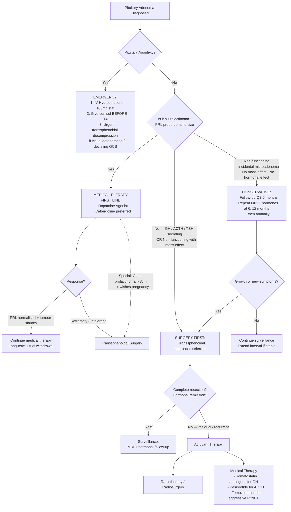
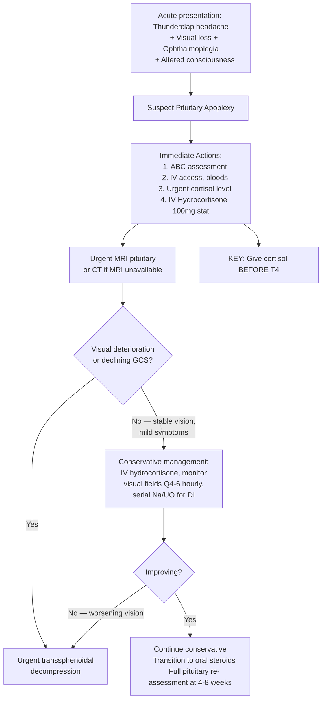

## Management of Pituitary Adenoma

### The Management Philosophy — First Principles

Before diving into specifics, let's think about what we're trying to achieve. The management of pituitary adenomas is guided by ***five principles*** [1]:

1. ***Aim at cure if feasible***
2. ***Preserve life***
3. ***Preserve function***
4. ***Preserve personhood***
5. ***Maximise quality of life***

And a critical sixth principle from the lecture: ***Do not treat the scan*** [1] — meaning not every pituitary adenoma needs intervention. An incidental microadenoma in an asymptomatic patient with normal hormones should be observed, not operated on.

The management decision hinges on **three questions**:
1. **Is this a prolactinoma?** → If yes, **medical therapy first** (the only adenoma subtype where drugs are first line).
2. **Is there mass effect or non-prolactin hormonal excess?** → If yes, **surgery first**.
3. **Is this an incidental, asymptomatic, non-functioning microadenoma?** → **Conservative observation**.

---

### Master Management Algorithm

---

### 1. Conservative Management (Observation)

***Indicated in patients with pituitary adenoma < 1 cm without mass or hormonal effect*** [2].
***Managed with follow-up every 3–6 months*** [2].

**Why observe?** Most pituitary microadenomas are **indolent** — they grow slowly or not at all. Autopsy studies show that ***20–25% of pituitaries harbour adenomas at autopsy*** [1], the vast majority of which never caused any problems during life. Treating every incidental microadenoma with surgery would cause more harm than good.

**Who qualifies for observation:**
- **Incidental microadenoma** (< 1 cm) discovered on MRI done for other reasons.
- **No hormonal excess** on full biochemical panel.
- **No hypopituitarism**.
- **No visual field defect** on formal perimetry.
- **No symptoms** (headache may warrant monitoring but alone is not an indication for surgery if microadenoma).

**Surveillance protocol:**
| Timepoint | MRI Pituitary | Hormonal Panel | Visual Fields |
|:----------|:-------------|:---------------|:-------------|
| **6 months** | Repeat | Repeat full panel | Only if close to chiasm |
| **12 months** | Repeat | Repeat | As indicated |
| **Annually × 3 years** | Repeat | Repeat | As indicated |
| **If stable at 3 years** | Extend to every 2–3 years | As indicated | As indicated |

**Triggers to escalate from observation to intervention:**
- Tumour growth on serial MRI (especially approaching the optic chiasm).
- New hormonal excess or deficiency.
- New visual symptoms.

<Callout title="Non-functioning Macroadenomas — Watch Carefully">
Even non-functioning **macroadenomas** that are not causing symptoms can sometimes be observed if surgery carries high risk (elderly, comorbid patient) — but this requires very close monitoring. The threshold for intervention is lower with macroadenomas because of proximity to the optic chiasm.
</Callout>

---

### 2. Medical Therapy

#### A. Dopamine Agonists — First-Line for Prolactinoma

***Dopamine agonists are the 1st line treatment for patients with hyperprolactinaemia of any cause including lactotroph adenoma of any size*** [2].

**Why dopamine agonists work for prolactinoma (and not other adenomas):**
Prolactin is the **only** anterior pituitary hormone under predominantly **tonic inhibitory control** by dopamine from the hypothalamus. Dopamine acts on **D2 receptors** on lactotroph cells to:
1. **Suppress prolactin gene transcription and secretion** → PRL levels normalise.
2. **Induce tumour shrinkage** → perivascular fibrosis, cellular necrosis, and reduction in cell volume → tumour regresses, often dramatically (macroprolactinomas can shrink by > 50% within weeks to months).

No other adenoma subtype has this kind of exquisite pharmacological target, which is why prolactinoma is uniquely managed medically.

| Drug | Dose | Frequency | Efficacy | Side Effects |
|:-----|:-----|:----------|:---------|:-------------|
| ***Cabergoline*** | 0.25–1 mg (titrate up) | **Twice weekly** (long half-life ~65 hours) | ***70–100% success rate*** [2]; PRL normalises in ~85–90%; tumour shrinkage in ~80% | ***Less nausea than bromocriptine*** [2]; may cause dizziness, constipation, headache. At high doses (Parkinson's): cardiac valvular fibrosis — generally not an issue at prolactinoma doses, but consider baseline echocardiogram if high doses needed. |
| ***Bromocriptine*** | 2.5–15 mg daily | **Daily** (shorter half-life) | ~70–80% normalise PRL | ***Nausea, orthostatic hypotension, nasal congestion*** [2]; less well tolerated than cabergoline |

***Cabergoline is preferred due to its efficacy (70–100% success rate) and favourable side effect profile (as it causes less nausea than bromocriptine)*** [2].

**Monitoring on dopamine agonist therapy:**
- **Serum prolactin**: Check at 1 month, then every 3–6 months. Target: normalisation.
- **MRI pituitary**: Repeat at 3–6 months (macroprolactinoma) to assess tumour shrinkage. Then annually.
- **Visual fields**: Repeat if macroadenoma was compressing the chiasm — improvement often rapid (days to weeks as tumour shrinks).

**Duration and withdrawal:**
- Treat for at least **2 years** with normalised PRL and significant tumour shrinkage.
- Then consider **trial withdrawal** (gradual taper, not abrupt). ~30–40% of patients can successfully discontinue; the rest relapse and need lifelong therapy.
- If PRL re-elevates or tumour regrows, restart the dopamine agonist.

**When surgery is needed despite dopamine agonist response in prolactinoma:**

***Indications for surgery in prolactinoma*** [2]:
- ***Patients refractory or intolerable to medical treatment*** — ~10–15% of prolactinomas are **cabergoline-resistant** (usually aggressive, may have lower D2 receptor expression).
- ***Women with giant lactotroph adenoma > 3 cm who wish to become pregnant, even if responding to dopamine agonist*** — because ***discontinuation of dopamine agonist during pregnancy may lead to increase in size of adenoma to be clinically important before delivery*** [2]. During pregnancy, oestrogen stimulates lactotroph growth; without the protective effect of the dopamine agonist, a giant prolactinoma can expand rapidly and compress the chiasm.

<Callout title="Prolactinoma in Pregnancy" type="error">
**Microprolactinomas** in pregnancy: Low risk of clinically significant growth (< 5%). Can safely discontinue the dopamine agonist during pregnancy and monitor clinically.

**Macroprolactinomas** in pregnancy: Higher risk of growth (~30% without prior debulking). Options: (1) continue cabergoline through pregnancy (limited safety data, but generally reassuring), or (2) debulk surgically before conception (especially giant adenomas > 3 cm), or (3) monitor very closely with visual fields monthly.
</Callout>

#### B. Somatostatin Analogues — For Somatotroph Adenomas (Acromegaly)

These are **second-line/adjuvant** medical therapy for acromegaly (surgery is first line):

| Drug | Mechanism | Dose | Efficacy | Side Effects |
|:-----|:----------|:-----|:---------|:-------------|
| **Octreotide LAR** | Somatostatin receptor (SSTR2, SSTR5) agonist → suppresses GH secretion + mild tumour shrinkage | 10–40 mg IM every 4 weeks | Normalises IGF-1 in ~50–65% | Gallstones (inhibits gallbladder contraction), GI upset (diarrhoea, steatorrhoea), hyperglycaemia |
| **Lanreotide Autogel** | Same mechanism (SSTR2 > SSTR5) | 60–120 mg SC every 4 weeks | Similar to octreotide | Similar |
| **Pasireotide LAR** | Multi-receptor somatostatin analogue (SSTR1, 2, 3, 5) | 10–60 mg IM every 4 weeks | More effective for octreotide-resistant tumours | **More hyperglycaemia** (higher SSTR5 affinity → suppresses insulin) |

**Why somatostatin analogues?** Somatostatin is the physiological inhibitor of GH from the hypothalamus. These analogues mimic somatostatin but are long-acting. Somatotroph adenomas retain somatostatin receptors (especially SSTR2), allowing pharmacological GH suppression.

**Indications:**
- Pre-operative (to reduce tumour size and improve surgical outcomes, especially in large invasive adenomas).
- Post-operative persistent acromegaly (incomplete resection).
- Primary medical therapy if surgery is contraindicated or refused.

**Other acromegaly-specific drugs:**
- **Pegvisomant** (GH receptor antagonist) — blocks GH action at the peripheral receptor → normalises IGF-1 in ~90%. Does **not** shrink the tumour (so must monitor MRI). Used when somatostatin analogues fail.
- **Cabergoline** — can be added in mild residual acromegaly (some somatotroph adenomas co-express D2 receptors, especially mammosomatotroph tumours).

#### C. Medical Therapy for Corticotroph Adenomas (Cushing's Disease)

Medical therapy is generally **adjuvant or temporising** — ***definitive treatment for pituitary Cushing's is transsphenoidal surgery*** [6]:

| Drug | Target | Mechanism | Role |
|:-----|:-------|:----------|:-----|
| **Ketoconazole** | Adrenal steroidogenesis | Inhibits CYP11A1, CYP17 → ↓ cortisol synthesis | Bridging therapy pre-surgery or if surgery fails |
| **Metyrapone** | 11β-hydroxylase | Blocks final step of cortisol synthesis | Rapid cortisol reduction; pre-operative preparation |
| **Osilodrostat** | 11β-hydroxylase | Same as metyrapone but oral, more potent | Newer option for persistent Cushing's |
| **Pasireotide** | Pituitary SSTR5 | Suppresses ACTH secretion from corticotroph tumour cells (which express SSTR5 > SSTR2) | Post-surgical persistent disease; normalises UFC in ~25% |
| **Mifepristone** | Glucocorticoid receptor | Blocks cortisol action peripherally (competitive antagonist) | Controls hyperglycaemia in Cushing's; does NOT lower cortisol levels (cannot monitor by cortisol — use clinical response) |
| **Cabergoline** | D2 receptors on corticotroph cells | Some corticotroph adenomas express D2 → ACTH suppression | Adjunctive; moderate efficacy (~25–30%) |

***Bilateral adrenalectomy*** — last resort for refractory Cushing's disease. Risk: ***Nelson's syndrome*** (unopposed ACTH-secreting tumour grows rapidly without cortisol negative feedback → hyperpigmentation, mass effect) [6].

#### D. Temozolomide — For Aggressive PitNETs / Pituitary Carcinoma

- **Temozolomide** ("temo-" = related to its imidazotetrazine structure, "-zolomide" = alkylating) — an alkylating chemotherapy agent.
- Indicated for **aggressive pituitary neuroendocrine tumours** (high Ki-67, rapid recurrence despite surgery + radiotherapy) and the rare **pituitary carcinoma** (with metastasis).
- Mechanism: methylates DNA at O6-guanine → DNA damage → apoptosis. Response correlates with **low MGMT expression** (MGMT is a repair enzyme that removes the methyl group — if MGMT is low, the tumour can't repair the damage → better response).
- ~30–40% response rate in aggressive PitNETs.

---

### 3. Surgical Treatment

***For GH, ACTH, TSH-secreting adenomas: surgery first*** [1].
***Or radiosurgery*** [1].

#### A. Transsphenoidal Surgery — The Workhorse

***Transsphenoidal surgery*** [2] is the primary surgical approach for the vast majority of pituitary adenomas. The name: "trans-" = through, "sphenoidal" = sphenoid bone/sinus — the surgeon goes through the nose, through the sphenoid sinus, and into the sella from below.

***Surgical approaches*** [1]:
- ***Microscopic or Endoscopic — Less invasive but depends on tumour size and morphology*** [1].
- ***Endoscopic transsphenoidal surgery — probably better than microscopic transsphenoidal surgery*** [1] — better visualisation, wider panoramic view, lower complication rates in experienced centres.

**Why transsphenoidal?**
- The sphenoid sinus sits **directly below** the sella turcica. By going through the nose → sphenoid sinus → floor of sella, you access the pituitary without touching the brain. This is a **minimally invasive** extracranial route.
- Avoids brain retraction, craniotomy, and frontal lobe manipulation.
- The sphenoid sinus is an air-filled cavity — there is nothing vital to traverse (unlike opening the skull).

**Endoscopic technique (modern standard):**
1. Binostril or mononostril approach using a rigid 0° or 30° endoscope.
2. Middle turbinate lateralised; posterior nasal septum removed.
3. Sphenoidotomy → expose the anterior face of the sella.
4. Open the sellar floor with a drill/osteotome.
5. Incise the dura → identify and resect the adenoma under direct endoscopic vision.
6. Reconstruct the sellar floor (fat graft, fascia lata, nasoseptal flap for large defects).

#### B. Craniotomy — For Large Suprasellar Extension

***Craniotomy — mainly when significant suprasellar extension*** [1].

When the adenoma has a large suprasellar component with a narrow "waist" at the diaphragma sellae (hourglass shape), the transsphenoidal approach may not reach the suprasellar portion. In these cases, a **subfrontal or pterional craniotomy** allows access from above.

- In some centres, a **combined approach** (transsphenoidal + transcranial) may be used for giant adenomas.

#### C. Indications for Surgery

***Indications for transsphenoidal/transfrontal surgery*** [2]:

| Indication | Explanation |
|:-----------|:-----------|
| ***Macroadenoma > 1 cm in size*** | Risk of mass effect (chiasmal compression, hypopituitarism) increases with size |
| ***Symptomatic patients, especially with visual disturbances*** | Visual field loss is a strong indication — the longer the compression, the worse the recovery |
| ***Hemorrhage in pituitary adenoma*** (apoplexy) | ***Urgent surgery for decompression*** [1] if visual deterioration or declining consciousness |
| ***GH-secreting adenoma (acromegaly)*** | ***Surgery first*** [1] — medical therapy is adjuvant |
| ***ACTH-secreting adenoma (Cushing's disease)*** | ***Surgery first*** [1] — ***trans-sphenoidal surgery ± pituitary radiotherapy/radiosurgery*** [6] |
| ***TSH-secreting adenoma*** | ***Surgery first*** [1] — very rare; somatostatin analogues can be used pre-operatively |
| ***Patients refractory or intolerable to medical treatment*** | Prolactinomas resistant to dopamine agonists (~10–15%) |
| ***Women with giant lactotroph adenoma > 3 cm who wish to become pregnant*** | ***Even if responding to dopamine agonist*** — risk of rapid tumour expansion when agonist is discontinued in pregnancy [2] |

#### D. Pre-operative Preparation

| Action | Rationale |
|:-------|:---------|
| **Assess cortisol reserve** (8 AM cortisol ± SST/ITT) | ***Hypopituitarism can cause shock (cortisol)*** [1] — must give peri-operative hydrocortisone if deficient |
| **Peri-operative steroid cover** (IV hydrocortisone 50–100 mg at induction, then Q8H for 24–48 hours) | Covers surgical stress; prevents adrenal crisis even if ACTH axis is intact (may be damaged intra-operatively) |
| ***Steroid cover: normal HPA axis usually suppressed*** in Cushing's patients [6] | Post-operatively, the normal corticotrophs have been suppressed by chronic cortisol excess → need glucocorticoid replacement until HPA axis recovers (~6–12 months) |
| **Assess thyroid function** | Correct hypothyroidism pre-operatively (but ***give cortisol before T4*** [1]) |
| **Formal visual field testing** | Baseline for post-operative comparison |
| **ENT assessment** | Evaluate nasal anatomy, septal deviation, prior nasal surgery |
| ***Prophylactic antibiotics*** [6] | Especially Cushing's patients (immunosuppressed by chronic cortisol excess) |

#### E. Surgical Outcomes

| Adenoma Type | Remission Rate (Microadenoma) | Remission Rate (Macroadenoma) | Comments |
|:-------------|:-----------------------------|:------------------------------|:---------|
| **Prolactinoma** (when surgery is indicated) | 80–90% | 30–50% | Usually medical first; surgery reserved for special indications |
| **Somatotroph** | 80–90% | 40–60% | Defined by normalised IGF-1 and GH nadir < 1 μg/L on OGTT |
| **Corticotroph** | 70–90% | 50–60% | Defined by low/undetectable morning cortisol post-operatively (remission); need steroid cover as HPA recovers |
| **Thyrotroph** | 70–80% | 40–50% | Rare; limited data |
| **Non-functioning** | N/A (usually macroadenomas) | Complete resection: 50–70% | ***NOT all adenoma tissue can be excised particularly those with macroadenoma*** [2] — ***tends to be conservative during surgery and minimize damage to surrounding structures including the non-adenomatous pituitary*** [2] |

#### F. Complications of Transsphenoidal Surgery

***Complications of Transsphenoidal Surgery*** [1]:

| Complication | Mechanism | Incidence | Key Points |
|:-------------|:----------|:----------|:-----------|
| ***Mortality*** | Very rare in modern series | ***Very rare*** [1] | < 0.5% in experienced centres |
| ***Hypopituitarism*** | Damage to normal pituitary tissue during tumour removal | 5–15% (new deficits) | ***Can cause shock (cortisol)*** [1]; may require lifelong hormonal replacement [2] |
| ***Diabetes insipidus*** | Damage to posterior pituitary or pituitary stalk → loss of ADH | Transient: 10–20%; Permanent: 1–3% | ***Polyuria, haemoconcentration*** [1]; monitor UO, serum Na, urine SG. Treat with DDAVP if persistent. |
| ***CSF leakage*** | Breach of arachnoid/dura not adequately sealed during closure | ***0.5–4%*** [2] | ***CSF leakage and meningitis*** [1]; ***Beta-2-transferrin positive; Pneumocephalus*** [1]; ***if lumbar subarachnoid diversion is unsuccessful, reoperation for repacking required; failure to stop CSF leakage increases risk of meningitis*** [2] |
| ***Visual loss*** | Inadvertent damage to optic nerves or chiasm | Rare ( < 1–2%) | ***Close monitoring post-op*** [1] |
| ***ENT symptoms*** | Surgical approach through nasal cavity | Variable | ***Epistaxis, anosmia, sinusitis*** [1] |
| ***Vascular injury*** | Damage to ***internal carotid artery*** [2] or cavernous sinus vessels | Rare but catastrophic | Can cause life-threatening haemorrhage, pseudoaneurysm, or carotid-cavernous fistula |
| ***Intracranial haemorrhage*** | Bleeding into surgical cavity or intracranial structures | Rare | ***Intracranial haemorrhage*** [1] |
| **SIADH** | Transient inappropriate ADH release (triphasic response: DI → SIADH → DI or recovery) | 5–10% | Hyponatraemia 5–10 days post-operatively; restrict fluids; monitor Na closely |
| **Meningitis** | Ascending infection through CSF leak defect | Rare if CSF leak sealed | Prophylactic antibiotics peri-operatively; urgent treatment if it occurs |

<Callout title="The Triphasic Response — Post-operative Sodium Swings" type="idea">
After transsphenoidal surgery, patients can develop a characteristic **triphasic pattern** of water/sodium disturbance:

**Phase 1 (Days 1–3): Diabetes insipidus** — Surgical trauma causes acute loss of ADH → dilute polyuria → hypernatraemia.

**Phase 2 (Days 5–10): SIADH** — Degenerating posterior pituitary neurons release stored ADH in an uncontrolled burst → water retention → hyponatraemia. This is the **most dangerous phase** because severe hyponatraemia can cause seizures.

**Phase 3 (Days 10–14+): Recovery or Permanent DI** — ADH stores are now depleted. If the stalk/posterior pituitary has recovered, normal water balance returns. If permanently damaged, permanent DI requiring lifelong DDAVP.

Not all patients go through all three phases. Many have only transient DI (Phase 1 alone). The key is to **monitor serum sodium and urine output daily for at least 10–14 days post-operatively**.
</Callout>

---

### 4. Radiation Therapy / Radiosurgery

***Or radiosurgery*** [1] — radiotherapy is the **third-line** treatment modality, used as adjuvant to surgery or when surgery is not feasible.

#### A. Types of Radiation

***Radiation therapy for brain tumours: aim to deliver high treatment dose to tumour bed, minimise radiation to normal tissue, balance between treatment efficacy and side effects*** [1].

| Modality | Technique | Dose/Fractions | Best For | Key Features |
|:---------|:----------|:-------------|:---------|:-------------|
| **Stereotactic Radiosurgery (SRS)** — single fraction | ***Focused radiation beams converge onto tumour*** [1]; ***X-knife uses X-ray; Gamma knife uses gamma ray; Cyberknife uses real-time imaging and moves to adjust to movement*** [1] | Single fraction 12–25 Gy | Small, well-defined residual/recurrent adenomas ( < 3 cm, > 2–3 mm from optic chiasm) | Highly precise; single session; lower risk of hypopituitarism compared to conventional RT; requires clear margin from optic apparatus |
| **Fractionated Stereotactic Radiotherapy (FSRT)** | Multiple small daily doses | 45–54 Gy in 25–30 fractions | Larger residuals or tumours close to optic chiasm | Better tolerance by optic nerves (fractionation allows normal tissue recovery between doses) |
| **Conventional Radiotherapy** | Broader field, less precision | 45–50 Gy in 25–30 fractions | Historically used; largely replaced by SRS/FSRT | Higher rates of hypopituitarism, radiation necrosis, second tumour risk |

#### B. Indications for Radiotherapy

***Postoperative radiation*** [2]:
- ***NOT all adenoma tissue can be excised, particularly those with macroadenoma*** [2].
- ***Primarily used to prevent regrowth of residual tumour in patients with large macroadenoma after transsphenoidal debulking*** [2].
- Also used for recurrent adenomas after re-operation, and for aggressive PitNETs.

Specific indications:
1. **Residual non-functioning macroadenoma** with documented growth on post-operative surveillance MRI.
2. **Persistent hormonal excess** after surgery (especially acromegaly, Cushing's disease) and medical therapy.
3. **Aggressive PitNETs** (high Ki-67, rapid recurrence, invasion).
4. Patients **unfit for surgery** or who **refuse surgery**.
5. **Residual prolactinoma** resistant to dopamine agonists AND surgery.

#### C. Complications of Radiotherapy

| Complication | Timeframe | Mechanism |
|:-------------|:---------|:----------|
| **Hypopituitarism** | Months to years (most common long-term complication: 30–80% at 10 years for conventional RT; lower for SRS) | Radiation damage to normal pituitary cells and hypothalamus → progressive hormone loss |
| **Optic neuropathy** | Months to years | Direct radiation injury to optic nerves/chiasm (risk minimised by keeping dose to chiasm < 8–10 Gy single fraction or < 54 Gy fractionated) |
| **Cerebrovascular disease** | Years to decades | Radiation-induced vasculopathy of ICA and cerebral vessels → increased stroke risk |
| **Secondary malignancy** | Decades | Radiation-induced gliomas, meningiomas, sarcomas (rare, ~2% at 20 years) |
| **Cognitive dysfunction** | Years | Radiation damage to temporal lobes and hippocampi |
| **Temporal lobe necrosis** | Months to years | Direct parenchymal radiation injury |

---

### 5. Subtype-Specific Management Summary

| Adenoma Subtype | First-Line Treatment | Second-Line / Adjuvant | Key Points |
|:----------------|:--------------------|:----------------------|:-----------|
| ***Prolactinoma*** | ***Dopamine agonist (cabergoline / bromocriptine)*** [1][2] | Surgery (if refractory/intolerant/giant + pregnancy wish); then radiosurgery | Only adenoma where medical Rx is first line. ***Cabergoline preferred.*** |
| ***Somatotroph (Acromegaly)*** | ***Surgery first*** [1] | Somatostatin analogues (octreotide/lanreotide), pegvisomant, radiosurgery | Pre-operative octreotide may improve surgical outcomes. Target: normal IGF-1, GH < 1 μg/L on OGTT. |
| ***Corticotroph (Cushing's)*** | ***Surgery first*** [1] — ***trans-sphenoidal surgery ± pituitary radiotherapy/radiosurgery*** [6] | Adrenal-directed drugs (ketoconazole, metyrapone, osilodrostat), pasireotide, bilateral adrenalectomy (last resort) | Post-op steroid cover until HPA recovers (~1 year). Risk of ***Nelson's syndrome if bilateral adrenalectomy*** [6]. |
| ***Thyrotroph*** | ***Surgery first*** [1] | Somatostatin analogues (octreotide — thyrotroph adenomas express SSTR2); ± anti-thyroid drugs pre-operatively to control thyrotoxicosis | Rarest adenoma type. Must distinguish from thyroid hormone resistance. |
| ***Non-functioning*** | ***Surgery if symptomatic (mass effect)*** | Radiotherapy for residual/recurrent; conservative if incidental micro | ***Non-functioning incidentaloma — observe*** [1] |
| ***Aggressive PitNET / Pituitary carcinoma*** | Surgery + radiotherapy | **Temozolomide** (alkylating agent; ~30–40% response) | Check MGMT status (low expression → better response) |

---

### 6. Management of Pituitary Apoplexy

***Pituitary apoplexy — an emergency!!*** [1]

***Give cortisol before T4*** [1] — because T4 increases metabolic rate → increases cortisol demand → precipitates adrenal crisis if the patient is already ACTH-deficient from the apoplexy.

***Urgent surgery for decompression*** [1] — indicated when there is **progressive visual loss** or **declining consciousness**. If vision is stable and symptoms are mild, conservative management with IV steroids and close monitoring is acceptable — many patients improve spontaneously as the haemorrhagic swelling resolves.

---

### 7. General Medication Therapy for Brain Tumours (Relevant to Pituitary Adenomas)

***Treatment options: General medication therapy, surgical biopsy and resection, radiation therapy, chemotherapy, target therapy, immunotherapy*** [1].

| Medication | Indication | Key Details |
|:-----------|:-----------|:-----------|
| ***Steroids (e.g., dexamethasone)*** | ***Decrease cerebral oedema and relieve symptoms; peri-operative use or palliation*** [1] | ***Exclude infection first*** [1]; ***S/E: DM, immunosuppression, peptic ulcer*** [1]. For pituitary adenomas, dexamethasone is primarily used peri-operatively (though hydrocortisone is preferred for adrenal replacement as it has mineralocorticoid activity). |
| ***Anticonvulsants (e.g., phenytoin, levetiracetam)*** | ***Prophylaxis or treatment if already seizure; not for infratentorial lesion*** [1] | Pituitary adenomas are infratentorial/sellar, NOT typically associated with seizures (unlike cortical tumours). Anticonvulsant prophylaxis is generally **not indicated** for pituitary adenomas. |
| ***Tranexamic acid*** | ***Perioperatively to reduce bleeding*** [1] | May be used in transsphenoidal surgery |

---

### 8. Long-Term Follow-Up

All patients with pituitary adenomas require **lifelong or long-term follow-up** because of the risk of:
- **Tumour recurrence** (even after apparent complete resection).
- **Progressive hypopituitarism** (especially after radiotherapy).
- **Consequences of hormonal excess** if remission is not achieved (cardiovascular disease in acromegaly, osteoporosis in Cushing's/prolactinoma, etc.).

**Follow-up protocol:**

| Component | Frequency | Purpose |
|:----------|:---------|:--------|
| **MRI pituitary** | 3 months post-op, then 6 monthly × 2 years, then annually | Detect residual/recurrent tumour |
| **Hormonal panel** | 6–12 weekly initially, then 6-monthly, then annually | Assess for hormonal remission and detect new deficiencies |
| **Visual fields** | Pre- and post-op; then as clinically indicated | Document recovery from chiasmal compression |
| **Pituitary reserve testing** | Post-operatively and annually post-radiotherapy | Detect evolving hypopituitarism (can develop years after RT) |
| **Hormone replacement adjustment** | Ongoing | Titrate hydrocortisone, levothyroxine, sex steroids, GH as needed |

---

<Callout title="High Yield Summary — Management of Pituitary Adenoma">

1. **Prolactinoma = Medical therapy first.** Dopamine agonists (***cabergoline preferred, 70–100% success***). Surgery only if refractory, intolerant, or giant adenoma + pregnancy planned.

2. **GH / ACTH / TSH-secreting = Surgery first** (transsphenoidal) ***± radiosurgery*** as adjuvant.

3. **Non-functioning microadenoma without mass/hormonal effect = Conservative.** Follow-up every 3–6 months.

4. **Transsphenoidal approach** is the standard; ***endoscopic probably better than microscopic***. ***Craniotomy mainly when significant suprasellar extension.***

5. **Pituitary apoplexy = Emergency.** IV hydrocortisone immediately. ***Give cortisol before T4.*** ***Urgent surgery if visual deterioration.***

6. **Key surgical complications**: Hypopituitarism (shock from cortisol loss), DI (monitor Na/UO), CSF leak (beta-2-transferrin, risk of meningitis), visual loss, ICA injury.

7. **Radiotherapy/Radiosurgery**: Adjuvant for residual/recurrent tumour. Gamma knife/CyberKnife for small well-defined residuals. Main long-term risk: progressive hypopituitarism (30–80% at 10 years).

8. **Cushing's disease**: Surgery first → peri-op steroid cover → HPA recovery ~1 year → bilateral adrenalectomy as last resort (risk of Nelson's syndrome).

9. **Temozolomide** for aggressive PitNETs and pituitary carcinoma. Check MGMT expression.

10. **Lifelong follow-up** is essential — recurrence, progressive hypopituitarism, and consequences of hormonal excess require ongoing monitoring.
</Callout>

---

<ActiveRecallQuiz
  title="Active Recall - Management of Pituitary Adenoma"
  items={[
    {
      question: "Why is prolactinoma the only pituitary adenoma subtype where medical therapy is first line? Name the preferred drug and its success rate.",
      markscheme: "Prolactin is the only anterior pituitary hormone under tonic inhibitory control by dopamine. Dopamine agonists (D2 receptor agonists) both suppress prolactin secretion AND induce tumour shrinkage through perivascular fibrosis and cell death. No other adenoma subtype responds this dramatically to medical therapy. Cabergoline is preferred due to its efficacy (70-100% success rate) and favourable side effect profile (less nausea than bromocriptine)."
    },
    {
      question: "A woman with a 3.5 cm prolactinoma responding well to cabergoline wishes to become pregnant. What is the recommended management and why?",
      markscheme: "Surgery (transsphenoidal debulking) is recommended before conception despite good response to cabergoline. Discontinuation of dopamine agonist during pregnancy may lead to rapid tumour expansion (oestrogen stimulates lactotroph growth) to a clinically important size before delivery. With a giant adenoma greater than 3 cm, the risk of significant growth and chiasmal compression during pregnancy is high enough to warrant surgical debulking first."
    },
    {
      question: "List the key peri-operative preparations for transsphenoidal surgery and explain why cortisol assessment is mandatory.",
      markscheme: "Key preparations: (1) Assess cortisol reserve - 8 AM cortisol with or without dynamic testing. (2) Peri-operative IV hydrocortisone cover at induction. (3) Thyroid function assessment (give cortisol before T4). (4) Baseline formal visual field testing. (5) ENT assessment of nasal anatomy. (6) Prophylactic antibiotics especially in Cushing's patients. Cortisol assessment is mandatory because unrecognised ACTH deficiency causes cortisol deficiency, and surgical stress without cortisol cover causes hypotensive shock (adrenal crisis)."
    },
    {
      question: "Describe the triphasic response pattern after transsphenoidal surgery and explain which phase is most dangerous.",
      markscheme: "Phase 1 (Days 1-3): Diabetes insipidus - surgical trauma causes acute ADH loss leading to dilute polyuria and hypernatraemia. Phase 2 (Days 5-10): SIADH - degenerating posterior pituitary neurons release stored ADH in an uncontrolled burst causing water retention and hyponatraemia. Phase 3 (Days 10-14+): Recovery or permanent DI - ADH stores depleted, either normal function recovers or permanent DI develops. Phase 2 (SIADH) is most dangerous because severe hyponatraemia can cause seizures and cerebral oedema."
    },
    {
      question: "What are the indications for radiotherapy or radiosurgery in pituitary adenoma management? Name two types of stereotactic radiosurgery.",
      markscheme: "Indications: (1) Residual tumour after surgery, particularly with documented growth. (2) Persistent hormonal excess after surgery and medical therapy. (3) Aggressive PitNETs with rapid recurrence. (4) Patients unfit for or refusing surgery. (5) Residual prolactinoma resistant to both dopamine agonists and surgery. Types of radiosurgery: Gamma Knife (uses gamma rays), X-Knife (uses X-rays), and CyberKnife (uses real-time imaging and adjusts to patient movement)."
    },
    {
      question: "For Cushing's disease that persists after transsphenoidal surgery, outline the management escalation pathway and explain the risk of bilateral adrenalectomy.",
      markscheme: "Escalation pathway: (1) Repeat transsphenoidal surgery if residual tumour visible on MRI. (2) Pituitary radiotherapy or radiosurgery. (3) Medical therapy to control cortisol - adrenal steroidogenesis inhibitors (ketoconazole, metyrapone, osilodrostat) or pituitary-directed (pasireotide, cabergoline). (4) Bilateral adrenalectomy as last resort. Risk of bilateral adrenalectomy: Nelson's syndrome - removal of cortisol negative feedback allows the ACTH-secreting tumour to grow unopposed, causing aggressive tumour expansion, mass effect, and severe hyperpigmentation from very high ACTH and MSH levels."
    }
  ]}
/>

## References

[1] Lecture slides: GC 108. A mass in the brain brain tumours.pdf (Treatment Paradigm — bromocriptine/cabergoline for prolactinoma, surgery first for GH/ACTH/TSH; Surgical Approaches — microscopic/endoscopic, craniotomy for suprasellar extension; Endoscopic transsphenoidal surgery; Complications of Transsphenoidal Surgery; Pituitary Apoplexy — give cortisol before T4, urgent surgery; Principles and Options — treatment principles, medication therapy including steroids/anticonvulsants/TXA; Radiation Therapy — aim, radiosurgery types; Principles of Brain Tumour Surgery — do not treat scan, non-functioning incidentaloma observe)
[2] Senior notes: felixlai.md (Pituitary adenoma: Conservative treatment — indications and follow-up; Medical treatment — dopamine agonists, cabergoline preferred; Surgical treatment — indications, post-operative radiation, complications)
[6] Senior notes: maxim.md (Cushing syndrome management — trans-sphenoidal surgery ± radiotherapy, peri-operative cautions, steroid cover, Nelson's syndrome risk; Adrenalectomy)
