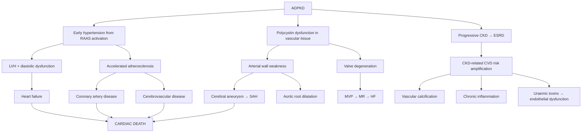

## Complications of ADPKD

### Overview: Why ADPKD Kills

Before diving into individual complications, let's be clear about what ultimately happens to ADPKD patients. ***Most patients die from cardiac causes — cardiac hypertrophy and coronary disease accounts for the majority of cases.*** [1] This is critical to internalise: ADPKD is not just a kidney disease — it is a **systemic cardiovascular disease** driven by decades of hypertension, CKD-related atherogenesis, and the direct effects of polycystin dysfunction on vascular tissue.

The complications can be organised into three categories:
1. **Renal complications** — direct consequences of cyst growth within the kidneys
2. **Extrarenal complications** — consequences of polycystin dysfunction in non-renal tissues
3. **Cyst-specific complications** — acute events related to individual cysts

***The second most common cause of death in patients with ADPKD is infected renal cysts and pyelonephritis.*** [1]

---

### A. Renal Complications

#### A1. End-Stage Renal Disease (ESRD)

| Aspect | Detail |
|---|---|
| **Prevalence** | ~50% of ADPKD patients reach ESRD by age 60 (PKD1) or ~75 years (PKD2) |
| **Mechanism** | Progressive cyst enlargement → compression + ischaemia of normal nephrons → tubular atrophy + interstitial fibrosis → compensatory hyperfiltration of remaining nephrons → secondary glomerulosclerosis → further nephron loss → eventual failure of all compensatory mechanisms → GFR < 10–15 → uraemia [14] |
| **Why GFR is preserved for so long** | Only 1–5% of nephrons develop cysts (two-hit hypothesis). The remaining 95–99% of nephrons compensate through hyperfiltration. GFR remains normal until TKV exceeds ~1500 mL (normal ~300 mL total). Once the compensatory reserve is exhausted, GFR drops relatively rapidly at ~4.4–5.9 mL/min/year. |
| ***Management*** | ***Requires renal replacement therapy such as haemodialysis or renal transplantation*** [1] |
| **Clinical features of ESRD** | Standard uraemic symptoms: fatigue, anorexia, nausea, pruritus, cognitive impairment, peripheral neuropathy, pericarditis, bleeding diathesis. Fluid overload: oedema, dyspnoea, pulmonary oedema. Electrolyte disturbances: hyperkalaemia, metabolic acidosis. [14] |

> **High Yield**: The natural history of ADPKD follows a predictable trajectory — years of preserved GFR with rising TKV, then a relatively rapid decline phase. The inflection point typically occurs in the 4th–5th decade for PKD1.

#### A2. Nephrolithiasis (Kidney Stones)

| Aspect | Detail |
|---|---|
| ***Prevalence*** | ***Occurs in up to 25% of patients*** [1] |
| ***Stone composition*** | ***Most stones are composed of uric acid, and the remaining are calcium oxalate*** [1] |
| **Mechanism (from first principles)** | Three factors conspire to create stones in ADPKD: (1) **Urinary stasis** — distorted, compressed collecting system and calyces create pockets of static urine where crystals nucleate; (2) **Low urinary citrate** (hypocitraturia) — tubular dysfunction impairs citrate reabsorption/secretion; citrate normally inhibits calcium stone formation by chelating calcium; (3) **Low urinary pH** — tubular dysfunction impairs ammonia excretion, leading to relatively acidic urine → favours uric acid crystal precipitation |
| **Clinical features** | Renal colic (flank pain radiating to groin), haematuria. However, stones are often difficult to detect on imaging because they may be obscured by surrounding cysts. |
| **Diagnosis** | NCCT is the investigation of choice, but stones within cysts may be missed. MRI can distinguish stones from cyst wall calcification. |
| **Management** | Prevention: ↑fluid intake, potassium citrate supplementation (↑pH dissolves uric acid stones, ↑citrate chelates calcium). Treatment: ESWL has reduced efficacy in ADPKD (cysts obscure targeting, fragments trapped in distorted collecting system); ureteroscopy or PCNL may be preferred. |

#### A3. Urinary Tract Infection and Cyst Infection

This deserves special emphasis because it is both common and uniquely difficult to manage in ADPKD.

| Aspect | Detail |
|---|---|
| ***Significance*** | ***Second most common cause of death in patients with ADPKD*** [1] |
| ***Pathophysiology*** | ***Correlates with the structural abnormality of the renal parenchyma*** [1] — distorted collecting system → urinary stasis → ascending infection. Cyst fluid is protein-rich and glucose-rich → excellent growth medium for bacteria. |
| **Typical organisms** | Gram-negative enterics: E. coli (most common), Klebsiella, Proteus, Enterobacter |
| **Clinical features** | Fever, flank pain localised to one area, systemic sepsis. Important: urine culture may be NEGATIVE if the infected cyst does not communicate with the collecting system. Blood cultures are more sensitive. |
| **Diagnosis** | CT (rim-enhancing cyst, wall thickening, intracystic debris); FDG-PET CT is the most sensitive for localising the infected cyst (infected cysts show high FDG uptake due to metabolically active neutrophils) |
| **Treatment** | Lipid-soluble antibiotics (fluoroquinolones, cotrimoxazole) for 4–6 weeks [1]. If refractory: CT-guided percutaneous drainage. If recurrent/refractory: consider nephrectomy. |
| **Risk factors** | Female sex (shorter urethra → ascending infection), urinary stasis, instrumentation (catheterisation, cystoscopy), immunosuppression (post-transplant) |
| ***Imaging indication*** | ***Polycystic kidney disease with poor renal function*** is listed as an indication for imaging in the setting of pyelonephritis [16] |

<Callout title="Cyst Infection vs Simple UTI" type="error">
A common exam trap: in ADPKD, standard UTI treatment with beta-lactams (amoxicillin, cephalosporins) often fails because these water-soluble drugs cannot penetrate the cyst wall. Always use lipid-soluble antibiotics for suspected cyst infection. If a patient with ADPKD has persistent fever despite "appropriate" antibiotics, consider that they have a cyst infection rather than simple pyelonephritis, and switch to fluoroquinolones or cotrimoxazole for a prolonged course.
</Callout>

#### A4. Cyst Haemorrhage and Rupture

| Aspect | Detail |
|---|---|
| ***Presentation*** | ***Presents with haematuria*** [1] — gross haematuria occurs in 35–50% of ADPKD patients. Also causes acute severe flank pain from sudden cyst distension or rupture with perinephric blood. |
| **Mechanism** | Cyst walls contain fragile, thin-walled blood vessels (neovascularisation). Stretching of the cyst wall as it expands → vessel rupture → bleeding into the cyst lumen. If the cyst communicates with the collecting system → gross haematuria. If the cyst ruptures → perinephric haematoma → severe flank/back pain. |
| **Triggers** | Physical trauma (especially contact sports), heavy lifting, anticoagulation therapy, hypertension |
| **Natural history** | Most episodes are self-limiting (2–7 days). Haematuria that persists > 1 week or is associated with haemodynamic instability requires further evaluation. |
| **Management** | Conservative (bedrest, hydration, analgesia with paracetamol — avoid NSAIDs). Avoid anticoagulants and antiplatelet agents during the acute episode. If persistent and severe: angiographic embolisation. Nephrectomy as last resort for life-threatening haemorrhage. |

---

### B. Extrarenal Complications

This is where ADPKD shows its true nature as a **systemic ciliopathy**. Polycystin-1 and polycystin-2 are expressed in many tissues beyond the kidney.

#### B1. Hypertension

| Aspect | Detail |
|---|---|
| ***Epidemiology*** | ***Present in the majority of patients who have normal renal function and have reached the 40s*** [1] |
| ***Timing*** | ***Occurs early prior to loss of kidney function (reduction in GFR)*** [1] — this is a hallmark that distinguishes ADPKD from most other causes of CKD where hypertension is a late consequence. |
| ***Mechanism*** | ***Result from increased activation of RAAS or increased sympathetic nerve activity*** [1]. Expanding cysts compress intrarenal vasculature → regional ischaemia → juxtaglomerular cells secrete renin → angiotensin II → vasoconstriction + aldosterone → Na/water retention → ↑BP. Additionally, sympathetic nervous system overactivation contributes (mechanism less clear, likely related to renal afferent signalling). |
| ***Significance*** | ***Risk factor for both cardiovascular and kidney disease progression in ADPKD*** [1]. Chronic hypertension → LVH → diastolic dysfunction → heart failure. Also accelerates atherosclerosis → coronary artery disease, stroke. Contributes to faster GFR decline via glomerular injury. |
| **Target organ damage from HTN** | LVH, coronary artery disease, cerebrovascular disease, hypertensive retinopathy, aortic disease. [3] |
| **Management** | ACEI/ARB first-line, BP targets as discussed in management section |

> **High Yield**: ***Hypertension in ADPKD is RAAS-driven***, which is why ACEI/ARB are the first-line agents — they directly target the pathophysiology. However, the hypertension also has a volume-expansion component, which is why sodium restriction is equally important.

#### B2. Cerebral (Intracranial) Aneurysms — The Most Serious Complication

| Aspect | Detail |
|---|---|
| **Prevalence** | ~8–12% in ADPKD (vs 2–5% in the general population) [17] |
| ***Significance*** | ***Ruptured cerebral aneurysm resulting in subarachnoid or intracerebral haemorrhage is the MOST serious complication of PKD*** [1] |
| ***Location*** | ***Commonly Circle of Willis*** [17]; ***90% anterior circulation*** [17] — particularly anterior communicating artery, posterior communicating artery, and middle cerebral artery bifurcation |
| **Mechanism** | Polycystin-1 and polycystin-2 are expressed in vascular smooth muscle cells and endothelium. Their dysfunction leads to **weakening of the arterial wall**, especially at bifurcation points where haemodynamic stress is maximal → saccular (berry) aneurysm formation. Co-existing hypertension further increases haemodynamic wall stress. |
| ***Predisposing factors for aneurysm*** | ***Smoking, hypertension, age > 40, family history, female sex, CTD: Ehlers-Danlos syndrome, AD polycystic kidney disease, Marfan syndrome, fibromuscular dysplasia*** [17] |
| ***Natural history*** | ***Can be forever asymptomatic*** with ***unpredictable spontaneous rupture*** [17] |

##### Presentation of Ruptured Aneurysm (SAH)

| Feature | Detail |
|---|---|
| **Thunderclap headache** | "Worst headache of my life," sudden onset, maximal at onset. Due to blood irritating meninges. |
| **Meningism** | Neck stiffness, photophobia, Kernig's sign — due to blood in subarachnoid space irritating meninges |
| **Loss of consciousness** | From sudden ↑ICP; may be transient or persistent depending on severity |
| ***"Surgical" CN III palsy*** | ***Non-pupil-sparing CN III palsy*** (ptosis, "down and out" eye, fixed dilated pupil) — classical for posterior communicating artery aneurysm compressing CN III [17] |
| **Focal neurological deficits** | Depend on location of aneurysm and any associated intracerebral haemorrhage or vasospasm |

##### Presentation of Unruptured Aneurysm

| Feature | Detail |
|---|---|
| **Asymptomatic** | Most unruptured aneurysms — detected incidentally or on screening |
| **Mass effect** | Large aneurysms may compress adjacent structures: CN III palsy (PComA), visual loss (ophthalmic artery) [17] |
| **Thromboembolism** | Aneurysm predisposes to intraluminal thrombus formation → distal embolisation [17] |

##### Screening and Intervention Thresholds

| Scenario | Approach |
|---|---|
| ***Screening offered to high-risk patients*** | ***Those with previous rupture, positive family history of aneurysm, high occupational risk, and patients requiring chronic anticoagulation*** [1] |
| **Screening modality** | MRA (preferred) or CTA. ***CTA or MRA is offered*** [1] |
| ***Asymptomatic small aneurysm < 7 mm (Asian < 5 mm)*** | ***Generally requires observation only without intervention due to low risk of haemorrhage*** [1] |
| ***Asymptomatic aneurysm ≥ 7–10 mm (Asian ≥ 5 mm)*** | ***Warrants strong consideration for treatment, taking into account patient's age, existing medical and neurological conditions, and risks of treatment*** [1] |
| ***Large symptomatic aneurysm*** | ***Requires treatment and is cost-effective*** [1] |
| **Treatment options** | ***Microsurgical clipping*** (apply clip at neck of aneurysm) or ***endovascular coiling/stenting*** (detachable coil or flow diverter placed via catheter) [17] |

<Callout title="Asian-Specific Threshold" type="idea">
Note the lower intervention threshold for Asian patients (≥ 5 mm vs ≥ 7 mm for non-Asians). This is based on data showing that Asian populations have a higher rupture rate for small aneurysms compared to Western populations. This is highly relevant for Hong Kong practice. [1]
</Callout>

#### B3. Cardiac Valve Disease

| Aspect | Detail |
|---|---|
| ***Most common abnormalities*** | ***MVP (mitral valve prolapse) and AR (aortic regurgitation)*** [1] |
| ***Less frequent lesions*** | ***Tricuspid valve prolapse (TVP), MR (mitral regurgitation), and TR (tricuspid regurgitation)*** [1] |
| **Prevalence** | MVP occurs in ~25% of ADPKD patients (vs ~2–3% general population) |
| **Mechanism** | Polycystin dysfunction in cardiac valve connective tissue → myxomatous degeneration → redundant, prolapsing valve leaflets. Similar to how polycystin dysfunction weakens arterial walls (aneurysms) and colonic walls (diverticula). |
| ***Detection*** | ***Murmurs may not be audible but only demonstrated on echocardiogram*** [1] |
| ***Natural history*** | ***Majority of patients are asymptomatic but some may progress and require valve replacement*** [1] |
| **Clinical significance** | Most cases are benign. However, MVP with significant MR can lead to heart failure, atrial fibrillation, and rarely, sudden cardiac death. AR can progress if aortic root dilates. |

#### B4. Polycystic Liver Disease (PLD)

| Aspect | Detail |
|---|---|
| ***Status*** | ***Liver cyst derived from biliary epithelium is the MOST common extrarenal complication*** [1] |
| **Prevalence** | ~83% by age 30–40; nearly universal in older patients |
| ***Gender difference*** | ***Massive cysts occur almost exclusively in women, particularly those who have had several pregnancies*** [1] — because hepatic cysts express oestrogen and progesterone receptors; oestrogen stimulates cyst epithelial proliferation and fluid secretion |
| **Mechanism** | Same ciliopathy mechanism in biliary epithelial cells. Defective polycystin → ↑cAMP → ↑fluid secretion via CFTR + cell proliferation → biliary cyst formation and expansion. |
| **Key clinical distinction** | Liver **function** is typically PRESERVED even with massive hepatomegaly — this is fundamentally different from ARPKD (where congenital hepatic fibrosis causes portal hypertension and synthetic dysfunction). The cysts replace liver volume but do not destroy hepatocytes. |

***Important distinction from ADPLD:*** [1]
- ***Polycystic liver disease associated with ADPKD is different from autosomal dominant polycystic liver disease (ADPLD)***
- ***ADPLD has no or only a few renal cysts and does not progress to renal failure***
- ***ADPLD is caused by mutation in at least 2 distinct genes (PRKCSH and SEC63)*** [1]

| Complication of PLD | Mechanism |
|---|---|
| **Abdominal distension and early satiety** | Mass effect from massive hepatomegaly |
| **Pain** | Capsular stretching, cyst haemorrhage, cyst infection |
| **Hepatic venous outflow obstruction** (rare) | Very large cysts compress hepatic veins → Budd-Chiari-like picture |
| **Bile duct compression** (rare) | Large cysts compress intrahepatic bile ducts → obstructive jaundice |
| **Cyst infection** | Ascending from biliary tree; presents with fever and RUQ pain |
| **Malnutrition** | Chronic early satiety from massive hepatomegaly |

#### B5. Pancreatic Cysts

***Occurs in 7–10% of patients with ADPKD.*** [1]

- Usually asymptomatic and clinically insignificant
- Same ciliopathy mechanism in pancreatic duct epithelium
- Rarely cause pancreatitis
- Important to distinguish from pancreatic cystic neoplasms (mucinous cystic neoplasm, IPMN) on imaging — ADPKD cysts are simple and benign

#### B6. Colonic Diverticula

***Colonic diverticula are found in many ADPKD patients on maintenance dialysis but may not occur in those without ESRD.*** [1]

| Aspect | Detail |
|---|---|
| **Mechanism** | Connective tissue weakness in the colonic wall from polycystin dysfunction + chronic constipation in CKD/dialysis patients + increased intra-abdominal pressure from massive kidneys |
| **Significance** | Increased risk of **diverticulitis** and, critically, **colonic perforation** — especially in immunosuppressed post-transplant patients. Colonic perforation carries extremely high mortality in dialysis/transplant patients. |
| **Management** | High-fibre diet (prevention), prompt treatment of diverticulitis, low threshold for surgical consultation if perforation suspected in immunosuppressed patients |

#### B7. Abdominal Wall and Inguinal Hernias

***Both abdominal wall and inguinal hernias are found with increased frequency in ADPKD patients.*** [1]

**Mechanism**: Two factors combine:
1. **Connective tissue weakness** from polycystin dysfunction (same mechanism as diverticula, valve prolapse, and aneurysms)
2. **Chronic increased intra-abdominal pressure** from massively enlarged kidneys and liver

---

### C. Complications of the Cysts Themselves

These are acute events that can occur at any time during the disease course:

#### C1. Infected Renal Cysts and Pyelonephritis

Already discussed in detail above (Section A3). Key points reiterated:
- ***Second most common cause of death in patients with ADPKD*** [1]
- Lipid-soluble antibiotics essential (fluoroquinolones, cotrimoxazole)
- 4–6 weeks treatment duration
- May need percutaneous drainage or nephrectomy if refractory

#### C2. Cyst Rupture and Haemorrhage

***Presents with haematuria.*** [1]

Already discussed in Section A4. Usually self-limiting but can be dramatic and frightening for patients.

---

### D. Cardiovascular Death — The Ultimate Outcome

Let me tie this all together. Why do ADPKD patients die of cardiovascular disease?

---

### E. Prognosis Summary

| Factor | Detail |
|---|---|
| ***Most common cause of death*** | ***Cardiac causes — cardiac hypertrophy and coronary disease*** [1] |
| ***Second most common cause of death*** | ***Infected renal cysts and pyelonephritis*** [1] |
| ***Most serious complication*** | ***Ruptured cerebral aneurysm*** [1] |
| **Median age at ESRD** | PKD1: ~54 years; PKD2: ~74 years |
| **Factors predicting worse prognosis** | PKD1 truncating mutation, male sex, early-onset hypertension (< 35y), gross haematuria before 30, large TKV (Mayo 1D–1E), early-onset symptoms |
| **10-year survival on dialysis** | Similar to other CKD causes; better outcomes post-transplant |
| **Post-transplant outcomes** | Excellent — similar or slightly better than non-ADPKD transplant recipients (because ADPKD patients tend to be younger and have fewer comorbidities than diabetic CKD patients) |

---

### F. Complications at a Glance — Summary Table

| Complication | Prevalence | Mechanism | Management |
|---|---|---|---|
| **ESRD** | ~50% by age 60 (PKD1) | Cyst compression → nephron loss → fibrosis | RRT (HD, transplant) |
| **Nephrolithiasis** | ~25% | Stasis, ↓citrate, ↓pH | ↑fluids, K-citrate, ureteroscopy |
| **Cyst infection** | Common, esp. females | Stasis + ascending infection | Lipid-soluble Abx × 4–6 weeks |
| **Cyst haemorrhage** | 35–50% (gross haematuria) | Fragile cyst wall vessels rupture | Conservative; embolisation if severe |
| **Hypertension** | ~60% before GFR decline | RAAS activation from cyst compression | ACEI/ARB |
| **Cerebral aneurysm** | 8–12% | Polycystin defect in vessel wall | Screen high-risk; clip/coil if indicated |
| **MVP/AR** | ~25% / ~8% | Myxomatous valve degeneration | Echo surveillance; surgery if severe |
| **Liver cysts** | ~83% by age 40 | Ciliopathy in biliary epithelium | Observation; aspiration/surgery if severe |
| **Pancreatic cysts** | 7–10% | Ciliopathy in pancreatic ducts | Usually observation |
| **Colonic diverticula** | ↑ in dialysis pts | Connective tissue weakness + ↑IAP | High fibre; prompt Mx of diverticulitis |
| **Hernias** | Increased frequency | CT weakness + ↑IAP | Surgical repair if symptomatic |

---

<Callout title="High Yield Summary — Complications of ADPKD">

1. **Most patients die from cardiac causes** — LVH and coronary disease from decades of hypertension and CKD-related CVD risk.
2. ***Infected renal cysts/pyelonephritis is the second most common cause of death*** — must use lipid-soluble antibiotics for 4–6 weeks.
3. ***Ruptured cerebral aneurysm (SAH) is the MOST serious complication*** — prevalence 8–12%; screen high-risk patients with MRA; Asian threshold for intervention ≥ 5 mm.
4. ***Hypertension occurs EARLY (before GFR decline)*** due to RAAS activation from cyst compression of renal vasculature.
5. **Nephrolithiasis** in ~25% — predominantly uric acid and calcium oxalate; driven by stasis, low citrate, low pH.
6. ***Liver cysts are the most common extrarenal complication*** — oestrogen-dependent (worse in multiparous women); liver function preserved.
7. ***Cardiac valve disease***: MVP and AR most common; usually asymptomatic; murmurs may only be detected on echocardiography.
8. **Colonic diverticula and hernias**: connective tissue weakness + increased intra-abdominal pressure; risk of perforation post-transplant under immunosuppression.
9. ***ADPLD (autosomal dominant polycystic liver disease) is a different condition from PLD associated with ADPKD*** — different genes, no renal failure.

</Callout>

---

<ActiveRecallQuiz
  title="Active Recall - Complications of ADPKD"
  items={[
    {
      question: "What is the most common cause of death in ADPKD, the most serious complication, and the second most common cause of death?",
      markscheme: "Most common cause of death: cardiac causes (cardiac hypertrophy and coronary disease from chronic hypertension and CKD-related CVD). Most serious complication: ruptured cerebral aneurysm causing SAH. Second most common cause of death: infected renal cysts and pyelonephritis.",
    },
    {
      question: "Explain why nephrolithiasis is common in ADPKD. What are the predominant stone types and why?",
      markscheme: "Three mechanisms: (1) Urinary stasis from distorted collecting system creates pockets where crystals nucleate; (2) Hypocitraturia from tubular dysfunction reduces citrate inhibition of calcium stone formation; (3) Low urinary pH from impaired ammonia excretion favours uric acid precipitation. Predominant stones: uric acid (most common) and calcium oxalate.",
    },
    {
      question: "Why do cerebral aneurysms occur more frequently in ADPKD, and what is the intervention threshold for Asian patients?",
      markscheme: "Polycystin-1 and polycystin-2 are expressed in vascular smooth muscle and endothelium. Their dysfunction weakens the arterial wall, especially at Circle of Willis bifurcations where haemodynamic stress is maximal. Co-existing hypertension compounds this. Intervention threshold for Asian patients: asymptomatic aneurysm 5 mm or greater warrants strong consideration for treatment (vs 7 mm for non-Asians) due to higher rupture rates in Asian populations.",
    },
    {
      question: "Liver cysts are the most common extrarenal complication of ADPKD. Why are they more severe in women, and how does liver involvement differ between ADPKD and ARPKD?",
      markscheme: "Hepatic cysts express oestrogen receptors; oestrogen stimulates cyst epithelial proliferation and fluid secretion, so cysts are larger and more numerous in women, especially those who are multiparous or have used OCP/HRT. In ADPKD, liver cysts replace volume but liver FUNCTION is preserved. In ARPKD, the liver has congenital hepatic fibrosis from ductal plate malformation, leading to portal hypertension and synthetic dysfunction.",
    },
    {
      question: "Why is colonic perforation a particular concern in ADPKD patients who have undergone renal transplantation?",
      markscheme: "ADPKD patients have increased colonic diverticula due to connective tissue weakness from polycystin dysfunction and chronically raised intra-abdominal pressure from enlarged kidneys. Post-transplant patients are on immunosuppression, which both masks signs of peritonitis (attenuated inflammatory response) and predisposes to poor wound healing. Colonic perforation in immunosuppressed transplant patients carries extremely high mortality.",
    },
  ]}
/>

## References

[1] Senior notes: felixlai.md (Polycystic kidney disease — Complications and Prognosis sections)
[3] Senior notes: Ryan Ho Cardiology.pdf (p.177–178 — Secondary hypertension and target organ damage)
[5] Senior notes: maxim.md (RCC risk factors including PKD; Polycystic liver disease section)
[14] Senior notes: Ryan Ho Urogenital.pdf (p.99–100, 105, 109, 111 — CKD complications, cardiovascular morbidity, RRT)
[16] Senior notes: Ryan Ho Urogenital.pdf (p.127 — Indications for imaging in pyelonephritis including PKD)
[17] Lecture slides: GC 109. Headache and loss of consciousness Acute stroke, subarachnoid haemorrhage and vascular malformation.pdf (p.14, slides 27–28 — Cerebral aneurysm predisposing factors, SAH)
