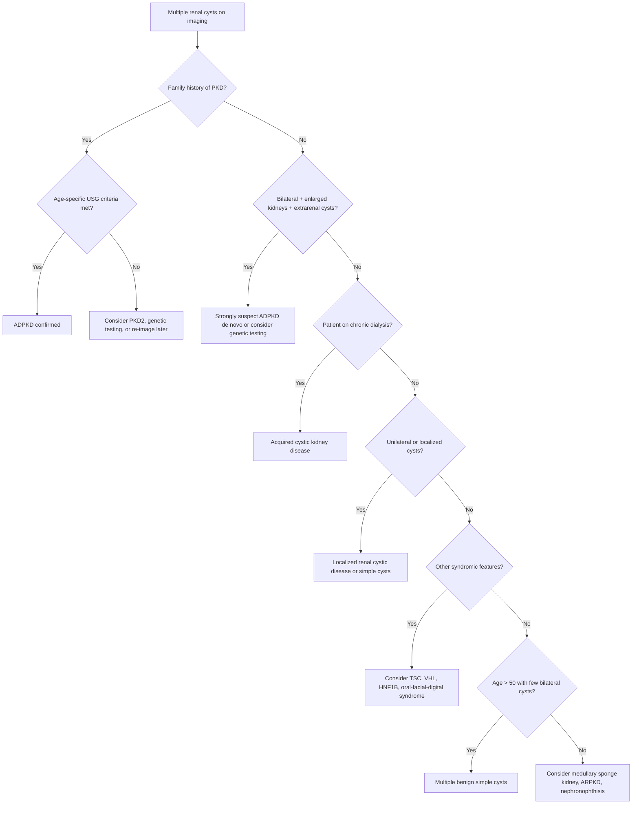

## Differential Diagnosis of Polycystic Kidney Disease

### Overview: What Are We Differentiating?

When a patient presents with **multiple renal cysts** — discovered on imaging or suspected from clinical features (bilateral palpable kidneys, haematuria, hypertension in a young patient, family history) — you need a systematic framework to distinguish **ADPKD** from the many other conditions that can produce renal cysts. This is not just an academic exercise: the prognosis, surveillance requirements, and management differ dramatically between these conditions.

The differential diagnosis can be framed around **two clinical scenarios**:

1. **"I see multiple renal cysts on imaging — is this ADPKD or something else?"** (the cystic kidney DDx)
2. **"I have a patient with bilateral palpable/enlarged kidneys — what's causing this?"** (the bilateral renal mass DDx)

We will address both systematically.

---

### A. Differential Diagnosis of Multiple Renal Cysts

This is the primary DDx when you encounter cystic kidneys. The key distinguishing features are: **number of cysts, laterality (bilateral vs unilateral), kidney size, family history, extrarenal features, and the patient's age and CKD status.**

#### Mermaid Diagnostic Approach

---

#### 1. Multiple Benign Simple Cysts

| Feature | Detail |
|---|---|
| **What it is** | Acquired, non-hereditary cysts that develop with ageing. The most common cystic "lesion" of the kidney. |
| **Prevalence** | ~5% at age 40, rising to ~35% by age 60+. Rare in patients < 30 years old. [1] |
| **Key distinguishing features** | Simple cysts are **uncommon in patients < 30**, are **rarely multiple and bilateral** in younger patients, do not cause kidney enlargement, and have **no extrarenal manifestations** (no liver cysts, no cerebral aneurysms, no family history). [1] |
| **Why it matters** | This is the condition most commonly confused with early/mild ADPKD, especially in older patients. In a 60-year-old with a few bilateral cysts and no family history, the distinction can be tricky. |
| **Imaging** | Thin-walled, anechoic on USG; homogeneous fluid content < 20 Hounsfield units on CT; no enhancement, no septations, smooth walls. [7] |
| **How to tell apart from ADPKD** | No family history, kidneys are **normal size**, no extrarenal cysts, cysts meet Bosniak Class I criteria (simple). If in doubt and there is a positive family history, apply the **Ravine/Pei age-specific ultrasound criteria**. |

<Callout title="The Age Rule">
Simple renal cysts are uncommon below age 30. If a patient under 30 has multiple bilateral renal cysts, you should think ADPKD (or another genetic cystic disease) rather than "just simple cysts" — especially if there is a family history or if kidneys are enlarged.
</Callout>

---

#### 2. Acquired Renal Cystic Disease (ARCD / ACKD)

| Feature | Detail |
|---|---|
| **What it is** | Development of multiple bilateral renal cysts in the setting of **chronic kidney disease**, particularly in patients on **long-term haemodialysis (HD) or peritoneal dialysis (PD)**. [1] |
| **Prevalence** | ~40% of patients on dialysis for 3 years; ~90% after 5–10 years |
| **Pathophysiology** | Chronic uraemia and dialysis → tubular obstruction by oxalate crystals and interstitial fibrosis → cystic dilatation of tubules. The hyperplastic epithelium in these cysts is premalignant. |
| **Key distinguishing features** | **No family history of PKD**; kidneys are **small to normal in size** (or small and shrunken, reflecting the underlying CKD) with a **smooth contour**; **no extrarenal features of ADPKD** (no liver cysts, no cerebral aneurysms). [1] |
| **Why it matters** | ***Acquired polycystic kidney disease carries a 30× increased risk of developing renal cell carcinoma (RCC)*** — these patients require **yearly USG surveillance** for early detection. [4][5][8] |
| ***Associated malignancy risk*** | ***Chronic kidney disease and acquired cystic kidney disease are risk factors for RCC*** [4] |

<Callout title="Critical Distinction" type="error">
A common exam pitfall: confusing ARCD with ADPKD. The key differentiators are: (1) ARCD kidneys are **small or normal** (ADPKD kidneys are **massively enlarged**); (2) ARCD has **no family history**; (3) ARCD has **no extrarenal cysts**; (4) ARCD develops in the context of **pre-existing CKD/dialysis** (the CKD came first, then the cysts appeared), whereas in ADPKD the cysts cause the CKD. [1]
</Callout>

---

#### 3. Localized (Unilateral) Renal Cystic Disease

| Feature | Detail |
|---|---|
| **What it is** | A benign condition with multiple cysts confined to **one kidney** (or even one part of one kidney). [1] |
| **Key distinguishing features** | **Neither bilateral nor progressive**. The contralateral kidney is normal. No family history. No extrarenal features. |
| **Why it matters** | It is benign and non-progressive — once identified, it requires only periodic surveillance, not the comprehensive management of ADPKD. Must be distinguished from early/asymmetric ADPKD and from multilocular cystic nephroma (a benign neoplasm). |

---

#### 4. Medullary Sponge Kidney (MSK)

| Feature | Detail |
|---|---|
| **What it is** | A congenital disorder characterised by **tubular dilatation of the collecting ducts confined to the medullary pyramids**, with **sparing of the renal cortex**. [1] |
| **Name breakdown** | "Medullary" = medulla of kidney, "sponge" = the sponge-like appearance of the dilated collecting ducts on imaging |
| **Pathophysiology** | Dilated collecting ducts → urinary stasis in these ectatic ducts → predisposition to **nephrocalcinosis** (calcium deposits in the renal medulla) and **recurrent nephrolithiasis** |
| **Key distinguishing features** | Kidney size is **normal** (not enlarged). Cysts are **tiny** and confined to the **medulla only** (cortex is spared). Classic imaging finding: "paintbrush" or "bouquet of flowers" appearance on IVU/CTU due to contrast pooling in dilated collecting ducts. **No extrarenal manifestations.** Usually benign renal function. |
| **Why it matters** | MSK is often discovered incidentally during workup for recurrent kidney stones or nephrocalcinosis. It does NOT cause progressive CKD (unlike ADPKD). |

---

#### 5. Genetic Syndromic Conditions with Renal Cysts

These are the other **inherited** conditions that can mimic PKD. Each has distinctive extrarenal features that help you differentiate them. [1]

##### a) Tuberous Sclerosis Complex (TSC)

| Feature | Detail |
|---|---|
| **Inheritance** | Autosomal dominant (TSC1 on chromosome 9, TSC2 on chromosome 16) |
| **Renal manifestations** | **Angiomyolipomas (AMLs)** (most common, ~80%), renal cysts (~50%), and rarely **RCC** (< 5%) [8] |
| **Key distinguishing features** | The classic triad: **seizures, intellectual disability, facial angiofibromas (adenoma sebaceum)**. Also: ash-leaf macules, shagreen patches, subungual fibromas, cortical tubers, subependymal giant cell astrocytomas (SEGA), cardiac rhabdomyomas, retinal hamartomas, lymphangioleiomyomatosis (LAM) in women. |
| **Why the confusion** | TSC2 is on chromosome 16, **adjacent to PKD1**. There is a recognized **TSC2/PKD1 contiguous gene deletion syndrome** where patients have both TSC and severe, very early-onset ADPKD. This is rare but extremely severe. |
| **How to distinguish** | Look for the dermatological and neurological stigmata of TSC. AMLs (which contain fat, visible on CT) are the signature renal finding, not pure cysts. |

##### b) Von Hippel-Lindau Disease (VHL)

| Feature | Detail |
|---|---|
| **Inheritance** | Autosomal dominant (VHL gene on chromosome 3p25) |
| **Renal manifestations** | ***Renal cysts (75%), clear cell RCC (40%)*** — bilateral and multifocal [8] |
| **Key distinguishing features** | ***Cerebellar haemangioblastomas***, ***retinal angiomas (retinal capillary haemangioblastomas)***, ***phaeochromocytomas (14%)***, pancreatic cysts, endolymphatic sac tumours, epididymal cystadenomas [8] |
| ***RCC association*** | ***Genetic predisposition: Family history and inherited syndromes such as von Hippel-Lindau...*** [4] |
| **How to distinguish** | The extrarenal features are completely different from ADPKD. VHL patients get **CNS haemangioblastomas and retinal angiomas** — ADPKD patients get **cerebral aneurysms and liver cysts**. Also, VHL-associated renal lesions include both cysts AND solid tumours (RCC), whereas ADPKD cysts are benign. |

##### c) HNF1B-Associated Kidney Disease (Formerly RCAD — Renal Cysts and Diabetes)

| Feature | Detail |
|---|---|
| **Inheritance** | Autosomal dominant (HNF1B gene on chromosome 17) |
| **Renal manifestations** | Renal cysts (often bilateral), renal hypoplasia, single kidney, other renal developmental anomalies |
| **Key distinguishing features** | MODY5 (maturity-onset diabetes of the young type 5), pancreatic hypoplasia, genital tract malformations, hyperuricaemia, hypomagnesaemia, abnormal LFTs |
| **How to distinguish** | Young-onset diabetes + renal cysts + genital anomalies → think HNF1B. Kidneys are NOT massively enlarged. |

##### d) Oral-Facial-Digital Syndrome Type 1 (OFD1)

| Feature | Detail |
|---|---|
| **Inheritance** | X-linked dominant (lethal in males) |
| **Renal manifestations** | Bilateral renal cysts resembling ADPKD |
| **Key distinguishing features** | Oral findings (cleft lip/palate, lobulated tongue, oral frenulae), facial findings (facial asymmetry, milia), digital findings (brachydactyly, syndactyly) |

---

#### 6. Autosomal Recessive Polycystic Kidney Disease (ARPKD)

While this is a form of PKD itself (not strictly a "differential" of PKD broadly), it is a critical differential for ADPKD specifically:

| Feature | ADPKD | ARPKD |
|---|---|---|
| Age at presentation | Adults (30–50y) | Perinatal/neonatal/childhood |
| Inheritance | AD | AR |
| Kidney appearance on USG | Large, macrocysts, variable size | Large, hyperechoic, loss of corticomedullary differentiation; tiny cysts in radial pattern |
| Liver | Hepatic cysts | ***Congenital hepatic fibrosis → portal hypertension, cholangitis, biliary dysgenesis*** [1] |
| Family history | Parent affected (50% chance) | Parents are carriers (both unaffected); sibling recurrence risk 25% |

---

#### 7. Nephronophthisis (NPHP) and Medullary Cystic Kidney Disease (MCKD)

| Feature | Detail |
|---|---|
| **What they are** | A group of tubulointerstitial ciliopathies causing **corticomedullary cysts** (small, at the corticomedullary junction) with progressive CKD |
| **Inheritance** | NPHP: autosomal recessive (children/adolescents); MCKD: autosomal dominant (adults) |
| **Key distinguishing features** | Kidneys are **normal or small** (NOT enlarged — this is the key). Cysts are small and concentrated at the corticomedullary junction. Prominent tubulointerstitial fibrosis with **salt-wasting** and **concentrating defect** (polyuria, polydipsia). NPHP is a leading genetic cause of ESRD in children. |
| **How to distinguish** | The kidneys are NOT enlarged (in fact, often shrunken). No extrarenal cysts (liver, pancreas). NPHP may be associated with **retinitis pigmentosa** (Senior-Løken syndrome), **cerebellar vermis hypoplasia** (Joubert syndrome), or **hepatic fibrosis**. |

---

### B. Differential Diagnosis of Bilateral Palpable Kidneys

When you find bilateral renal masses on examination, the DDx extends beyond cystic diseases to include any cause of **bilateral renal enlargement**: [6]

| Category | Condition | Key Distinguishing Feature |
|---|---|---|
| **Congenital/Genetic** | **ADPKD** | Bilateral bosselated kidneys, FHx, hepatomegaly from polycystic liver, hypertension |
| **Endocrine** | **Diabetic nephropathy (early)** | Long-standing DM, kidneys enlarged from hyperfiltration in early DMN (NOT shrunken initially); nephromegaly is common in early DMN [9] |
| **Endocrine** | **Acromegaly** | Visceromegaly affecting all organs; coarsened facial features, large hands/feet |
| **Infiltrative** | **Amyloidosis** | Nephrotic syndrome, macroglossia, carpal tunnel, cardiac involvement (restrictive cardiomyopathy) |
| **Infiltrative** | **Lymphoma** | Constitutional symptoms (B symptoms), lymphadenopathy, splenomegaly |
| **Vascular** | **Bilateral renal vein thrombosis** | Acute flank pain, haematuria; seen in nephrotic syndrome (hypercoagulable state) |
| **Obstructive** | **Bilateral hydronephrosis** | Obstruction must be at bladder outlet or bilateral ureteric level; palpable bladder, BPH, pelvic malignancy |
| **Infection** | **Bilateral pyelonephritis/abscess** | Fever, rigors, bilateral loin tenderness, pyuria |
| **Bilateral causes of unilateral masses** | **Bilateral RCC** (extremely rare) | Constitutional symptoms, haematuria, paraneoplastic features |

[6]

<Callout title="Exam Approach to Bilateral Palpable Kidneys" type="idea">
When asked for a DDx of bilateral palpable kidneys, use this structured approach: **Congenital** (ADPKD — most common), **Endocrine** (diabetic nephropathy, acromegaly), **Infiltrative** (amyloid, lymphoma), **Obstructive** (bilateral hydronephrosis), **Others** (bilateral RCC, bilateral renal vein thrombosis). The unilateral causes occurring bilaterally should also be mentioned. [6]
</Callout>

---

### C. Differential Diagnosis by Presenting Feature

ADPKD can present in several ways, and each presentation has its own DDx:

#### Presenting with Haematuria

Haematuria is a common presentation of ADPKD (cyst haemorrhage into collecting system). The broader DDx of haematuria relevant here [7][10]:

| Source | Condition | Distinguishing Feature |
|---|---|---|
| **Renal — cystic** | ADPKD | Bilateral flank masses, FHx, insidious onset HTN [10] |
| **Renal — glomerular** | IgA nephropathy | Synpharyngitic haematuria (concurrent with URTI), dysmorphic RBCs/RBC casts on urine microscopy |
| **Renal — glomerular** | Alport syndrome | X-linked, sensorineural hearing loss, anterior lenticonus |
| **Renal — neoplastic** | RCC | Painless haematuria + flank pain + palpable mass (classic triad, uncommon); constitutional symptoms, paraneoplastic syndrome [10] |
| **Ureteric** | Urolithiasis | Unilateral flank colic radiating to groin, isomorphic RBCs |
| **Bladder** | CA bladder | Painless haematuria in older smoker, irritative LUTS |
| **Prostate** | CA prostate/BPH | Obstructive LUTS, abnormal DRE |
| **Infection** | UTI/Pyelonephritis | Fever, dysuria, frequency, pyuria, positive culture |

[10]

#### Presenting with Hypertension in a Young Patient

ADPKD is an important cause of **secondary hypertension** via renal parenchymal disease. When a young patient (< 30–40) presents with hypertension, the DDx includes [3]:

| Category | Condition | Key Feature |
|---|---|---|
| ***Renal parenchymal disease*** | ***ADPKD*** | ***Haematuria, proteinuria, recurrent UTI, frequency, nocturia, FHx of polycystic kidney disease*** [3] |
| **Renal vascular** | Renal artery stenosis | Abrupt onset, renal bruit, flash pulmonary oedema |
| **Endocrine** | Primary aldosteronism | Hypokalaemia, metabolic alkalosis, muscle weakness |
| **Endocrine** | Phaeochromocytoma | Paroxysmal HTN, headache, sweating, palpitations |
| **Endocrine** | Cushing's syndrome | Central obesity, striae, proximal myopathy |
| **Cardiovascular** | Coarctation of aorta | Radiofemoral delay, UL > LL BP |
| **Other** | OSA | Obesity, snoring, daytime sleepiness |

> **High Yield**: When screening for secondary hypertension, **renal USG** is the initial investigation for renal parenchymal disease, including ADPKD [3]. The clinical clues for ADPKD as a cause of secondary HTN are: family history, bilateral flank masses, haematuria, and features of extrarenal disease.

---

### D. Summary: Key Differentiating Features at a Glance

| Condition | Kidney Size | Laterality | Cyst Size | FHx | Extrarenal Features | Age |
|---|---|---|---|---|---|---|
| **ADPKD** | **Massively enlarged** | Bilateral | Variable, large | + (AD) | Liver cysts, cerebral aneurysm, MVP | Adult |
| **ARPKD** | Enlarged | Bilateral | Small, fusiform | + (AR) | Congenital hepatic fibrosis | Perinatal/child |
| **Simple cysts** | Normal | Uni- or bilateral | Variable | – | None | > 40–50 |
| **ARCD** | Small/normal | Bilateral | Small | – | None; but ↑RCC risk | On dialysis |
| **MSK** | Normal | Bilateral | Tiny (medullary) | – | None; nephrocalcinosis | Any |
| **TSC** | Normal/slightly enlarged | Bilateral | Variable; + AMLs | + (AD) | Skin lesions, seizures, CNS tubers | Any |
| **VHL** | Normal | Bilateral | Variable; + RCC | + (AD) | Haemangioblastomas, phaeochromocytoma | Any |
| **NPHP/MCKD** | Normal/small | Bilateral | Small (CMJ) | + | Retinitis pigmentosa, Joubert | Child/adult |
| **Localized cystic ds** | Normal | **Unilateral** | Variable | – | None | Any |

---

<Callout title="High Yield Summary — Differential Diagnosis of PKD">

1. The most common DDx for ADPKD is **multiple benign simple cysts** — distinguished by age (simple cysts rare < 30y), kidney size (normal in simple cysts), and absence of FHx/extrarenal features.
2. **Acquired cystic kidney disease** occurs in chronic dialysis patients — kidneys are small/normal (not enlarged), no FHx, no extrarenal cysts, but carries **30× RCC risk** requiring yearly USG surveillance.
3. Key genetic DDx: **TSC** (AMLs, skin lesions, seizures), **VHL** (haemangioblastomas, RCC, phaeochromocytoma), **HNF1B** (MODY5 + cysts).
4. **Medullary sponge kidney**: medullary-only cysts, normal-sized kidneys, presents with stones/nephrocalcinosis.
5. **ARPKD**: collecting duct cysts + congenital hepatic fibrosis, presents perinatally.
6. For **bilateral palpable kidneys**: most common cause is ADPKD; also consider diabetic nephropathy (early), amyloidosis, lymphoma, bilateral hydronephrosis.
7. ADPKD is an important cause of **secondary hypertension** in young patients — screen with renal USG.

</Callout>

---

<ActiveRecallQuiz
  title="Active Recall - Differential Diagnosis of PKD"
  items={[
    {
      question: "A 65-year-old patient on haemodialysis for 8 years is found to have multiple bilateral small renal cysts. Kidneys are small. What is the most likely diagnosis, and what cancer surveillance is required?",
      markscheme: "Acquired renal cystic disease (ARCD). Distinguished from ADPKD by small/normal kidney size, no family history, no extrarenal features, and the context of chronic dialysis. Requires yearly renal ultrasound surveillance for RCC (30x increased risk).",
    },
    {
      question: "Name three key features that distinguish multiple benign simple cysts from ADPKD.",
      markscheme: "(1) Simple cysts are uncommon in patients under 30 (ADPKD cysts can appear in 20s-30s); (2) Simple cysts do not cause kidney enlargement (ADPKD kidneys are massively enlarged); (3) No family history and no extrarenal features (no liver cysts, no cerebral aneurysms) in simple cysts.",
    },
    {
      question: "A patient has bilateral renal cysts plus cerebellar haemangioblastoma and retinal angioma. What is the diagnosis, and how does the renal phenotype differ from ADPKD?",
      markscheme: "Von Hippel-Lindau disease (VHL). Renal cysts in VHL are associated with clear cell RCC (40% develop RCC), which is bilateral and multifocal. ADPKD cysts are benign without malignant transformation. VHL has CNS haemangioblastomas and retinal angiomas; ADPKD has cerebral aneurysms and liver cysts.",
    },
    {
      question: "A child presents with bilateral enlarged hyperechoic kidneys and hepatosplenomegaly from portal hypertension. What is the most likely diagnosis and the responsible gene?",
      markscheme: "Autosomal recessive polycystic kidney disease (ARPKD). Gene: PKHD1 on chromosome 6p12 encoding fibrocystin. Distinguished from ADPKD by perinatal/childhood onset, collecting duct origin (fusiform cysts), invariable congenital hepatic fibrosis causing portal hypertension (rather than hepatic cysts).",
    },
    {
      question: "List the differential diagnosis of bilateral palpable kidneys using a structured approach.",
      markscheme: "Congenital: ADPKD (most common). Endocrine: diabetic nephropathy (early hyperfiltration), acromegaly. Infiltrative: amyloidosis, lymphoma. Obstructive: bilateral hydronephrosis. Vascular: bilateral renal vein thrombosis. Other: any unilateral cause occurring bilaterally.",
    },
  ]}
/>

## References

[1] Senior notes: felixlai.md (Polycystic kidney disease section — differential diagnosis)
[3] Senior notes: Ryan Ho Cardiology.pdf (p.178 — Secondary hypertension screening table)
[4] Lecture slides: GC 183. Common urological malignancies and their presentations - Nov 7.pdf (p.7 — RCC risk factors)
[5] Senior notes: maxim.md (RCC risk factors section)
[6] Senior notes: Ryan Ho Fundamentals.pdf (p.115 — D/dx of palpable kidneys)
[7] Senior notes: Ryan Ho Urogenital.pdf (p.151 — Simple renal cysts)
[8] Senior notes: Ryan Ho Urogenital.pdf (p.145 — RCC risk factors including VHL, TSC, acquired cystic disease)
[9] Senior notes: Ryan Ho Urogenital.pdf (p.85 — Diabetic nephropathy, nephromegaly)
[10] Senior notes: Ryan Ho Urogenital.pdf (p.130 — Approach to haematuria table)
