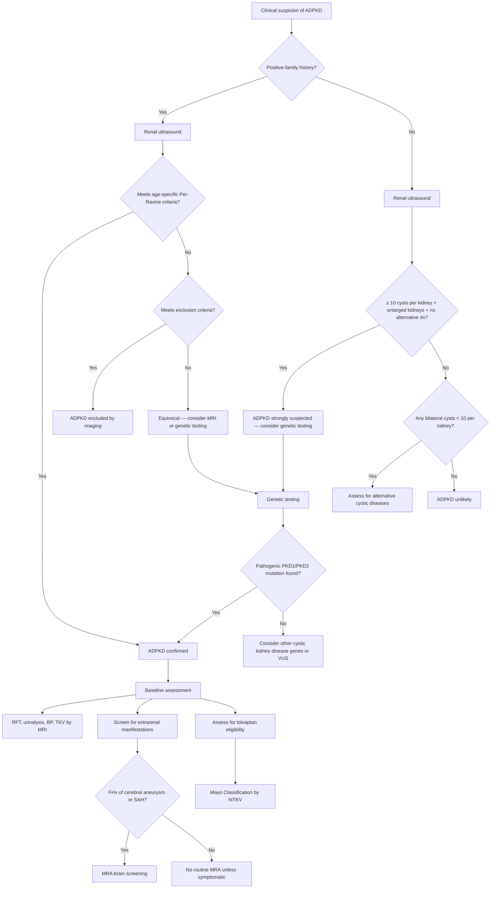

## Diagnostic Criteria, Algorithm, and Investigation Modalities for ADPKD

### Overview: The Diagnostic Philosophy

The diagnosis of ADPKD rests on a deceptively simple foundation: **demonstrating multiple bilateral renal cysts in the appropriate clinical context** (family history, age, extrarenal features). The challenge is that simple renal cysts are extremely common in the general population and increase with age, so you need **age-specific criteria** to distinguish pathological cyst numbers from the background noise of acquired simple cysts.

There are three tiers of diagnosis:
1. **Imaging-based criteria** (ultrasound, CT, or MRI) — the mainstay for most patients
2. **Genetic testing** — reserved for equivocal imaging, very young patients, potential living kidney donors, or when a definitive diagnosis is critical
3. **Clinical diagnosis** — in patients with classic presentation (bilateral massive kidneys, hepatic cysts, positive family history), imaging alone is sufficient; no biopsy is needed

<Callout title="Key Principle">
ADPKD is diagnosed **clinically and radiologically**. Renal biopsy is NOT required and is in fact contraindicated in established PKD (haemorrhage risk from cysts, and the histology is non-specific). The diagnosis is made by counting cysts on imaging in the context of age and family history.
</Callout>

---

### A. Diagnostic Criteria

#### A1. Patients WITH a Positive Family History of ADPKD

These are the **Ravine criteria** (originally 1994) updated by **Pei et al. (2009)** — the most widely used ultrasound-based criteria. The logic: since cysts accumulate with age in ADPKD, the threshold number of cysts required for diagnosis varies by age group. Younger patients need fewer cysts because having ANY bilateral cysts at a young age is abnormal. [1]

##### Unified Pei-Ravine USG Criteria (2009) — For Patients with Known PKD1 Mutation

| Age Group | Criteria for Diagnosis | Criteria to EXCLUDE ADPKD |
|---|---|---|
| **15–29 years** | **≥ 3 cysts** (unilateral or bilateral) | ≤ 1 cyst (excludes PKD1 with near-100% NPV) |
| **30–39 years** | **≥ 3 cysts** (unilateral or bilateral) | ≤ 1 cyst |
| **40–59 years** | **≥ 2 cysts in each kidney** | ≤ 1 cyst in each kidney |
| **≥ 60 years** | **≥ 4 cysts in each kidney** | ≤ 2 cysts in each kidney |

[1]

##### For Patients with Unknown Genotype or Known PKD2 Mutation

***USG criteria are less sensitive for patients with PKD2 mutation because of the late onset*** of cystogenesis — cysts develop later and more slowly in PKD2. [1]

| Age Group | Criteria for Diagnosis |
|---|---|
| **15–39 years** | **≥ 3 cysts** (unilateral or bilateral) |
| **40–59 years** | **≥ 2 cysts in each kidney** |
| **≥ 60 years** | **≥ 4 cysts in each kidney** |

[1]

<Callout title="Why the Numbers Change with Age" type="idea">
In the general population, simple renal cysts are uncommon before age 30 but increasingly common after age 50. Therefore, finding 3 cysts in a 20-year-old is highly significant, but finding 3 cysts in a 70-year-old could just be age-related. This is why the diagnostic threshold increases with age — you need more cysts at older ages to confidently say they are not just incidental simple cysts.
</Callout>

<Callout title="Exam Pitfall: Exclusion Criteria" type="error">
The Pei criteria also provide **exclusion criteria** — the ability to tell an at-risk individual that they do NOT have ADPKD. For a patient aged 15–29 with a PKD1 parent, having ≤ 1 cyst essentially excludes the disease. However, for patients under 15, ultrasound cannot reliably exclude ADPKD because cysts may not have developed yet. ***Direct genetic testing for the known mutation in patients at risk for PKD2 may be more cost-effective than USG*** in younger individuals. [1]
</Callout>

#### A2. Patients WITHOUT a Family History of ADPKD (De Novo or Unknown FHx)

This is trickier because ~10% of ADPKD cases are **de novo mutations** (no affected parent), and sometimes family history is incomplete. [1]

***There is NO definitive number of cysts or cyst location that provides a definite diagnosis*** in this scenario. [1]

**Diagnosis should be strongly suspected if:**
- ***Presence of multiple and bilateral cysts, arbitrarily defined as ≥ 10 cysts in each kidney*** [1]
- ***Presence of renal enlargement*** (total kidney length > 16.5 cm) ***or liver cysts*** [1]
- ***Absence of findings suggestive of a different renal cystic disease*** (no features of TSC, VHL, ACKD, etc.) [1]

In these patients, **genetic testing** becomes more important to confirm the diagnosis.

#### A3. MRI/CT-Based Criteria

MRI and CT are more sensitive than ultrasound and can detect smaller cysts (< 1 cm). The Pei criteria were designed for ultrasound. When MRI is used:
- ***CT/T2-weighted MRI with or without contrast is more sensitive than USG in detecting cysts of smaller size*** [1]
- MRI is the preferred modality for **total kidney volume (TKV)** measurement (used for Mayo classification and tolvaptan eligibility)
- For MRI, a threshold of **≥ 10 total cysts** in a patient aged 15–30 with a positive family history has ~100% sensitivity and specificity for ADPKD

#### A4. Genetic Testing Criteria

***Genetic testing is indicated in patients with equivocal imaging or when a definitive diagnosis is required.*** [1]

Specific indications for genetic testing:
1. **Equivocal ultrasound findings** (borderline cyst counts)
2. **Young patients** (< 15 years) where USG is unreliable
3. **No family history** (de novo suspected)
4. **Potential living related kidney donor** — MUST definitively exclude ADPKD before donation
5. **Distinguishing PKD1 from PKD2** (important for prognosis and tolvaptan eligibility)
6. **Reproductive counselling** / preimplantation genetic diagnosis
7. **Atypical presentations** (early-onset severe disease → consider contiguous gene deletion with TSC2)

Methods:
- **Next-generation sequencing (NGS)** panels covering PKD1, PKD2, and other cystic kidney disease genes (PKHD1, HNF1B, TSC1/2, etc.)
- **Multiplex ligation-dependent probe amplification (MLPA)** — detects large deletions/duplications not picked up by sequencing
- Note: PKD1 gene sequencing is technically challenging because ~75% of the gene has 6 pseudogenes on chromosome 16 with > 97% sequence homology → requires specialised long-range PCR techniques

---

### B. Diagnostic Algorithm

---

### C. Investigation Modalities

#### C1. History and Physical Examination

The clinical assessment is the starting point — not an afterthought. [1]

**History Taking Checklist:** [1]

| Domain | What to Ask | Why |
|---|---|---|
| ***HPI*** | ***Polyuria, nocturia, frequency, thirst*** | ***Earliest manifestation*** — concentrating defect from medullary disruption [1] |
| | Haematuria (gross or microscopic) | Cyst haemorrhage, stones |
| | Flank or back pain | Cyst enlargement, haemorrhage, infection, stones |
| | ***Headache*** | ***Suggests intracranial aneurysm (ICA)*** [1] |
| ***Medical History*** | ***CVS: Hypertension, intracranial aneurysm, stroke, valvular heart disease*** | ***Extrarenal associations*** [1] |
| | ***GI: Liver cyst, pancreatic cyst, colonic diverticulum, abdominal wall hernia*** | ***Extrarenal cysts and connective tissue manifestations*** [1] |
| | ***UG: Renal stones*** | ***20–30% prevalence in ADPKD*** [1] |
| **Family history** | ADPKD, ESRD, dialysis, transplant, cerebral aneurysm, SAH, early stroke | Establishes inheritance pattern and risk |

**Physical Examination:** [1][6]

| Finding | Significance |
|---|---|
| ***BP measurement*** | ***Crucial — present in majority with normal renal function by age 40; occurs early prior to loss of kidney function and is associated with progressive renal disease*** [1] |
| ***Bilateral ballotable kidneys*** | ***Hallmark sign — enlarged, bosselated, bimanually palpable*** [1][6] |
| ***Hepatomegaly*** | ***Polycystic liver — firm, nodular*** [1][6] |
| ***Abdominal wall hernia*** | Connective tissue weakness + chronic increased intra-abdominal pressure [1] |
| Cardiac auscultation | Mid-systolic click (mitral valve prolapse) |

---

#### C2. Biochemical Investigations

| Investigation | Key Findings in ADPKD | Interpretation / Why |
|---|---|---|
| ***CBC with differentials*** | ***Anaemia or erythrocytosis*** | ***Anaemia from chronic haematuria or CKD; erythrocytosis from compensatory increase in EPO production*** by cyst lining cells (ADPKD patients maintain relatively higher Hb than other CKD patients at same GFR) [1] |
| ***RFT*** (urea, creatinine, eGFR, electrolytes) | Elevated creatinine, ↓eGFR (late); hyperkalaemia (late CKD) | ***Renal function usually remains normal until the 40s*** — monitors for development of ESRD [1]. Normal RFT does NOT exclude ADPKD. |
| ***Urinalysis*** | ***Haematuria*** (microscopic or gross); ***proteinuria*** | ***Proteinuria is NOT a major feature of ADPKD and usually reflects a superimposed glomerular disease if present*** [1]. Modest proteinuria (< 1 g/day) is common; heavy proteinuria should prompt consideration of an additional glomerulopathy. |
| Urine microscopy | Isomorphic RBCs (non-glomerular origin from cyst rupture) | Helps distinguish from glomerular haematuria (dysmorphic RBCs, RBC casts) [11][13] |
| Urine culture | Rule out UTI / cyst infection | ADPKD patients are prone to UTI from urinary stasis |
| Serum uric acid | May be elevated | Contributes to uric acid stone formation (low urinary pH + stasis) |
| Lipid profile | Dyslipidaemia | Common in CKD; requires treatment with statins |
| Calcium, phosphate, PTH | HypoCa, hyperPO4, ↑PTH (late CKD) | CKD-MBD (mineral bone disease) — loss of 1α-hydroxylase activity as nephrons are destroyed |

---

#### C3. Radiological Investigations

##### Renal Ultrasound (USG) — First-Line Imaging

| Aspect | Detail |
|---|---|
| **Role** | ***First-line screening and diagnostic tool, indicated in screening of asymptomatic individuals with positive family history*** [1][3][12] |
| **Findings in ADPKD** | ***Enlarged kidneys with extensive cysts scattered throughout both kidneys*** [1]; loss of corticomedullary differentiation; cysts are anechoic, round, with posterior acoustic enhancement; variable size (mm to > 10 cm); kidneys > 15 cm |
| **Findings in ARPKD** | Bilateral enlarged hyperechoic kidneys (innumerable tiny cysts below USG resolution create increased echogenicity); loss of corticomedullary differentiation; "pepper and salt" appearance |
| **Hepatic assessment** | Polycystic liver — multiple hepatic cysts of varying size |
| **Advantages** | No radiation, no contrast, cheap, widely available, bedside, repeatable; excellent for cyst detection ≥ 1 cm |
| **Limitations** | ***Less sensitive for PKD2*** due to fewer/smaller cysts at younger ages [1]; operator-dependent; limited for small cysts (< 0.5–1 cm); cannot accurately measure TKV; limited for detecting complications (cyst haemorrhage vs infection) |
| **When to use it** | Initial screening, diagnosis in patients with positive FHx, follow-up, and when screening for renal parenchymal disease as cause of secondary hypertension [3] |

> **High Yield**: ***Renal USG is the screening investigation for renal parenchymal disease (including polycystic kidney) in the workup of secondary hypertension*** [3]. ***Large kidneys on USG can occur in polycystic kidneys, infiltrative disease, or obstructive uropathy*** [12].

##### CT Scan (With or Without Contrast)

| Aspect | Detail |
|---|---|
| **Role** | ***More sensitive than USG in detecting cysts of smaller size*** [1]; indicated when USG is equivocal, or for evaluating complications |
| **Findings in ADPKD** | Bilateral massively enlarged kidneys with innumerable cysts of varying size replacing normal parenchyma; calcification within cyst walls (chronic haemorrhage); renal stones; complicated cysts (haemorrhagic cysts appear hyperdense > 20 HU) |
| **CT for complications** | Cyst haemorrhage (hyperdense cyst > 50 HU on non-contrast CT); cyst infection (rim enhancement, wall thickening, gas within cyst — rare); renal stones (NCCT is gold standard for stone detection) |
| ***CT with contrast of brain*** | ***Initial diagnostic test for intracranial aneurysm*** [1] — CTA of cerebral vessels for screening/diagnosis of aneurysm in ADPKD patients with FHx of aneurysm or SAH |
| **Limitations** | ***Not usually preferred due to potential contrast nephropathy and allergic reactions in patients with CKD*** [1]; radiation exposure; not ideal for serial TKV monitoring |
| **When to use** | Equivocal USG; evaluation of acute complications (haemorrhage, infection, stones); suspected RCC within a cyst; pre-surgical planning |

<Callout title="Contrast Caution in CKD" type="error">
ADPKD patients often have CKD. Iodinated contrast agents carry a risk of **contrast-induced nephropathy (CIN)**, especially at eGFR < 30. Always weigh the benefits of contrast CT against this risk. For serial monitoring, MRI (without gadolinium if possible) is preferred over repeated CT. If eGFR < 30, avoid gadolinium-based contrast due to risk of **nephrogenic systemic fibrosis (NSF)**.
</Callout>

##### MRI (T1-Weighted and T2-Weighted)

| Aspect | Detail |
|---|---|
| **Role** | Gold standard for **total kidney volume (TKV)** measurement; most sensitive for cyst detection; distinguishes cyst content (haemorrhagic vs serous) |
| **Findings in ADPKD** | T2W: cysts appear bright (high signal) due to fluid content; hemorrhagic cysts appear bright on T1W (due to methemoglobin); accurate delineation of cyst number, size, and total kidney volume |
| **TKV measurement** | Measured using **stereological or ellipsoid methods** on MRI. Height-adjusted TKV (htTKV) is used for **Mayo Imaging Classification** (Classes 1A–1E), which determines eligibility for tolvaptan. |
| **MRA brain** | **Magnetic resonance angiography** — non-invasive screening for intracranial aneurysms in high-risk ADPKD patients |
| **Advantages** | No radiation; no iodinated contrast needed (T2W sequences are diagnostic without contrast); superior soft tissue contrast; accurate volumetry |
| **Limitations** | Expensive; time-consuming; claustrophobia; not available at bedside; gadolinium contraindicated if severe CKD (NSF risk) |
| **When to use** | TKV measurement for risk stratification and tolvaptan eligibility; equivocal USG in young patients; distinguishing haemorrhagic from infected cysts; serial monitoring |

##### Other Imaging

| Modality | Role in ADPKD |
|---|---|
| **KUB plain radiograph** | Initial screening for radio-opaque renal stones; may show bilateral enlarged kidney shadows [13] |
| **IVU** | Largely replaced by CTU; historically showed "Swiss cheese" or "moth-eaten" calyceal pattern from cyst compression. ***No longer first-line.*** [11] |
| **Echocardiography** | Screening for **mitral valve prolapse** and **left ventricular hypertrophy** from chronic hypertension |

---

#### C4. Genetic Testing

| Aspect | Detail |
|---|---|
| **Indication** | ***Indicated in patients with equivocal imaging or when a definite diagnosis is required*** [1] |
| **Methods** | **Next-generation sequencing (NGS)** covering PKD1, PKD2 ± other genes (PKHD1, HNF1B, TSC1/2, etc.); **MLPA** for large deletions; **Long-range PCR** required for PKD1 due to pseudogenes |
| **Detection rate** | ~85–90% in clinically diagnosed ADPKD (pathogenic variant identified) |
| **Specific indications** | (1) Equivocal imaging; (2) Young patients < 15y; (3) No family history; (4) ***Potential living related kidney donor***; (5) Distinguishing PKD1 vs PKD2 for prognosis; (6) Reproductive counselling / PGD; (7) Atypical presentations |
| **Limitation** | ~10% of clinically diagnosed ADPKD patients have no identifiable mutation ("genetically unresolved ADPKD") — likely due to mosaicism, deep intronic variants, or novel genes |

---

#### C5. Screening for Extrarenal Complications

| Screening Test | Indication | What It Detects |
|---|---|---|
| ***MRA brain / CTA brain*** | ***Family history of intracranial aneurysm or SAH; or symptoms (thunderclap headache, CN III palsy)*** [1] | ***Intracranial aneurysm*** (~8–12% prevalence in ADPKD) |
| **Echocardiography** | Baseline screening; clinical suspicion of murmur | Mitral valve prolapse (~25%), aortic root dilatation, LVH |
| **Liver USG/MRI** | Part of initial imaging; symptoms of hepatomegaly | Polycystic liver disease (most common extrarenal manifestation) |
| **Ambulatory BP monitoring** | Early disease, all patients | Hypertension (often presents before GFR decline) |

**Intracranial Aneurysm (ICA) Screening Protocol:**
- **Who to screen**: ADPKD patients with a **family history of intracranial aneurysm, SAH, or unexplained sudden death** [1]
- **How**: MRA (preferred — non-invasive, no radiation, no iodinated contrast) or CTA
- **When**: At diagnosis, then repeat every **5 years** if initial screen is negative; every **1–2 years** if aneurysm < 7 mm is found and managed conservatively
- **Routine screening** in ADPKD patients WITHOUT a family history of aneurysm is **controversial** — not universally recommended due to low absolute risk, though some centres offer it

<Callout title="When NOT to Screen for ICA">
Routine MRA screening for all ADPKD patients without a family history of aneurysm/SAH is NOT currently standard practice. The overall rupture rate of small incidental aneurysms is very low, and the anxiety and potential harm from incidental findings (and subsequent interventions) may outweigh benefits in low-risk patients. Screen ONLY those with positive FHx, symptoms, or high-risk occupations (e.g., airline pilots).
</Callout>

---

#### C6. Prognostic Assessment / Risk Stratification

Once ADPKD is diagnosed, the next step is determining **how fast the disease will progress** — this guides tolvaptan eligibility:

| Tool | What It Measures | Clinical Application |
|---|---|---|
| **Mayo Imaging Classification** | htTKV on MRI → Classes 1A (low risk) to 1E (very high risk) | Identifies patients with rapid progression eligible for tolvaptan (typically 1C–1E) |
| **PROPKD Score** | Genotype (PKD1 truncating > PKD1 non-truncating > PKD2) + clinical variables (hypertension < 35y, urological event < 35y, male sex) | Score 0–9: Low (0–3), Intermediate (4–6), High (7–9) risk of ESRD before 60 |
| **eGFR trajectory** | Serial eGFR measurements over time | Decline > 2.5 mL/min/year suggests rapid progression |
| **Baseline eGFR + TKV** | Combined assessment | KDIGO 2015 recommends using both for prognosis |

---

### D. Summary: Investigation Checklist for a Newly Diagnosed ADPKD Patient

| Category | Investigations |
|---|---|
| **Confirm diagnosis** | Renal USG (apply Pei criteria) ± MRI ± genetic testing |
| **Baseline renal function** | RFT (Cr, eGFR, electrolytes), urinalysis (haematuria, proteinuria), urine culture |
| **Haematological** | CBC (anaemia vs erythrocytosis) |
| **Metabolic / CKD-MBD** | Calcium, phosphate, PTH, vitamin D, uric acid (if stones), lipid profile |
| **Cardiovascular** | BP (ambulatory if needed), ECG, echocardiography |
| **Prognostic** | MRI for TKV → Mayo classification; genetic testing if needed for PROPKD score |
| **Extrarenal screening** | Liver USG/MRI; MRA brain (if FHx of aneurysm/SAH); echocardiography (MVP) |
| **Complication assessment** | NCCT if stones suspected; CT/MRI if cyst haemorrhage/infection suspected |

---

<Callout title="High Yield Summary — Diagnosis of ADPKD">

1. **Diagnosis is clinical + imaging**: Renal USG is first-line. Apply **age-specific Pei-Ravine criteria** in patients with positive FHx. In patients without FHx, ≥ 10 cysts per kidney + enlarged kidneys + no alternative diagnosis strongly suggests ADPKD.
2. **USG is less sensitive for PKD2** due to late-onset cystogenesis → consider MRI or direct genetic testing.
3. ***Genetic testing is indicated for equivocal imaging, very young patients, potential kidney donors, and when definitive diagnosis is required.*** [1]
4. ***Proteinuria is NOT a major feature of ADPKD*** — if heavy proteinuria is present, suspect superimposed glomerulopathy. [1]
5. ***Renal function usually remains normal until the 40s*** — normal RFT does NOT exclude ADPKD. [1]
6. **MRI** is the gold standard for TKV measurement → Mayo classification (1A–1E) → determines tolvaptan eligibility.
7. ***MRA/CTA brain is the initial test for intracranial aneurysm*** screening in high-risk patients (FHx of aneurysm/SAH). [1]
8. **Risk stratification**: Mayo classification (htTKV), PROPKD score (genotype + clinical), eGFR trajectory.
9. ***CBC may show anaemia (CKD or haematuria) or erythrocytosis (compensatory EPO production).*** [1]

</Callout>

---

<ActiveRecallQuiz
  title="Active Recall - Diagnosis of ADPKD"
  items={[
    {
      question: "State the Pei-Ravine ultrasound diagnostic criteria for ADPKD in a 25-year-old with a PKD1-affected parent.",
      markscheme: "Age 15-29 with known PKD1: 3 or more cysts, unilateral or bilateral, confirms diagnosis. 1 or fewer cysts excludes ADPKD with near-100% negative predictive value.",
    },
    {
      question: "Why is ultrasound less sensitive for diagnosing PKD2 than PKD1, and what alternative should be considered?",
      markscheme: "PKD2 mutations cause later-onset cystogenesis with fewer and smaller cysts at younger ages, so USG may miss early disease. Direct genetic testing for the known PKD2 mutation may be more cost-effective than serial USG in young at-risk individuals.",
    },
    {
      question: "In a patient without family history of ADPKD, what imaging and clinical features strongly suggest the diagnosis?",
      markscheme: "At least 10 cysts in each kidney on imaging, bilateral kidney enlargement, presence of hepatic cysts, and absence of findings suggestive of an alternative renal cystic disease (TSC, VHL, ACKD). Genetic testing should be considered for confirmation.",
    },
    {
      question: "Name four specific indications for genetic testing in suspected ADPKD.",
      markscheme: "Any four of: (1) Equivocal imaging findings; (2) Very young patient under 15 where USG is unreliable; (3) No family history (de novo suspected); (4) Potential living related kidney donor; (5) Distinguishing PKD1 vs PKD2 for prognosis; (6) Reproductive counselling/PGD; (7) Atypical presentation.",
    },
    {
      question: "Which imaging modality is the gold standard for measuring total kidney volume, and why is this measurement clinically important?",
      markscheme: "MRI (T2-weighted sequences). TKV is the strongest imaging predictor of future GFR decline. Height-adjusted TKV is used for the Mayo Imaging Classification (1A-1E), which stratifies risk of progression and determines eligibility for tolvaptan therapy.",
    },
    {
      question: "Which ADPKD patients should be screened for intracranial aneurysms, and with what modality?",
      markscheme: "Patients with a family history of intracranial aneurysm, SAH, or unexplained sudden death. Screening is by MRA brain (non-invasive, no radiation, no iodinated contrast). If negative, repeat every 5 years. Routine screening of all ADPKD patients without FHx is not standard practice.",
    },
  ]}
/>

## References

[1] Senior notes: felixlai.md (Polycystic kidney disease — Diagnosis section, Clinical manifestation section)
[3] Senior notes: Ryan Ho Cardiology.pdf (p.177–178 — Secondary hypertension workup, screening for renal parenchymal disease)
[6] Senior notes: Ryan Ho Fundamentals.pdf (p.115 — Abdominal examination, D/dx of palpable kidneys)
[11] Senior notes: Ryan Ho Diagnostic Radiology.pdf (p.17 — Intravenous Urogram)
[12] Senior notes: Ryan Ho Urogenital.pdf (p.102 — Initial evaluation for renal impairment, USG kidney findings)
[13] Senior notes: Ryan Ho Urogenital.pdf (p.133–134 — Investigations for haematuria, KUB, cystoscopy, CT urogram)
