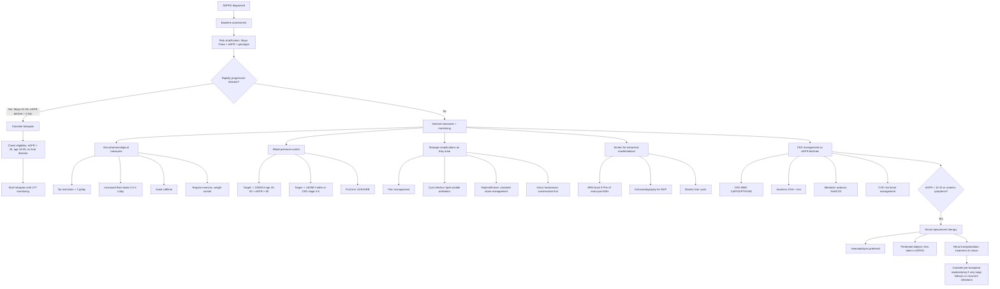

## Management of ADPKD

### Overview: The Management Philosophy

Let me frame this clearly. ADPKD management has **four pillars**:

1. **Slow disease progression** (the holy grail — delay ESRD by years)
2. **Manage complications** (pain, infection, stones, haematuria, hypertension)
3. **Screen for and manage extrarenal manifestations** (cerebral aneurysms, liver cysts, cardiac)
4. **Renal replacement therapy** when ESRD inevitably arrives

Until 2015, we had NO disease-modifying therapy — only supportive measures. The approval of **tolvaptan** changed the landscape. But the reality is that most of the management is still about good CKD care, aggressive BP control, and dealing with complications as they arise.

---

### A. Management Algorithm — Mermaid Diagram

---

### B. Detailed Management

#### B1. Non-Pharmacological Measures (Lifestyle)

These are the foundation of management for ALL ADPKD patients, regardless of disease stage.

| Measure | Detail | Rationale (First Principles) |
|---|---|---|
| ***Dietary sodium restriction < 2 g/day*** | Equivalent to < 5 g NaCl/day | Reduces extracellular volume expansion → ↓BP; high salt intake independently accelerates cyst growth via osmotic mechanisms and volume-mediated RAAS stimulation [1] |
| ***Increased fluid intake*** (2.5–3 L/day) | Water is the preferred fluid; spread throughout the day including before bed | ***Suppresses vasopressin level, which is postulated to be a therapeutic mechanism to inhibit cystic growth in ADPKD*** [1]. The logic: water intake → ↓serum osmolality → ↓ADH release → ↓V2 receptor activation → ↓cAMP in collecting duct cells → ↓cyst growth. This is the same pathway that tolvaptan targets pharmacologically. |
| **Avoid caffeine** | Limit coffee, tea, energy drinks | Caffeine inhibits phosphodiesterase → ↓cAMP breakdown → ↑cAMP accumulation → theoretically accelerates cyst growth |
| **Regular exercise** | 30 min/day, most days of the week; avoid contact sports if kidneys very large | Cardiovascular benefit, weight control, ↓BP. Avoid contact sports/activities with high risk of abdominal trauma (risk of cyst rupture/haemorrhage in very enlarged kidneys). |
| **Moderate protein intake** | 0.8–1.0 g/kg/day if CKD stage 3+; avoid high protein > 1.3 g/kg/day | Reduces hyperfiltration in remaining nephrons; excessive protein → ↑urea generation → ↑uraemic symptoms [14] |
| **Weight control** | Maintain BMI 18.5–25 | Obesity is an independent risk factor for CKD progression and CVD |
| **Smoking cessation** | Absolute | Smoking accelerates CKD progression and is a major CVD risk factor |

---

#### B2. Blood Pressure Control

Hypertension is the **earliest treatable risk factor** in ADPKD and the single most important modifiable factor for slowing CKD progression and reducing cardiovascular morbidity.

##### BP Targets

The HALT-PKD trial (2014) established the evidence base:

| Patient Profile | BP Target | Evidence |
|---|---|---|
| **Age 18–50 with eGFR > 60** | **< 95/60 to 110/75** (i.e. **< 110/75**) for HALT-PKD; practically **≤ 130/80** per KDIGO | HALT-PKD Study A showed that intensive BP control (95–110/60–75) slowed TKV growth and reduced LVH, urinary albumin excretion, and LV mass index |
| **Older patients or eGFR < 60** | ***140/90 mmHg*** | ***Do NOT maintain SBP to 110 mmHg in patients with moderate or advanced disease since it may increase the risk of renal disease progression by reducing renal blood flow*** [1] |

<Callout title="Why Intensive BP Harms in Advanced CKD" type="error">
In advanced CKD (eGFR < 60), the remaining nephrons are already maximally vasodilated to maintain filtration. If you drop systemic BP too low, you reduce perfusion to these nephrons below the autoregulatory threshold → ischaemia → paradoxically accelerate nephron loss. This is why we are MORE aggressive with BP lowering in early disease (where the kidneys can still autoregulate) and MORE cautious in advanced disease. [1]
</Callout>

##### Choice of Antihypertensive

| Drug | Role | Rationale |
|---|---|---|
| ***ACEI (first-line)*** | ***First-line antihypertensive unless contraindicated*** | ***Increased RAAS activity and extracellular volume expansion is involved in the pathogenesis of hypertension in patients with ADPKD*** [1]. ACEI blocks Ang I → Ang II conversion → ↓vasoconstriction, ↓aldosterone, ↓sodium retention. Also has antiproteinuric and antifibrotic effects. |
| ***ARB*** | ***Should be considered in patients intolerant of ACEI due to dry cough or angioedema*** | ARB blocks the Ang II type 1 receptor directly. Same downstream effects as ACEI but without the bradykinin accumulation that causes cough (ACEI inhibits kininase II, which normally degrades bradykinin → ↑bradykinin → cough). [1] |
| **Dual ACEI + ARB** | NOT recommended routinely | HALT-PKD Study A tested ACEI + ARB combination. No additional benefit in TKV or eGFR preservation over ACEI alone, but ↑risk of hyperkalaemia and AKI. |
| **CCB, diuretics, beta-blockers** | Second-line add-on agents | Used when BP not controlled with ACEI/ARB alone. Standard hypertension combination approach: A + C, then A + C + D [3] |

> **High Yield**: ***Control of BP can prevent progression of renal disease and decreases the risk of cardiovascular morbidity*** [1]. ACEI/ARB are preferred in ADPKD even though they do NOT have the same strong anti-proteinuric rationale as in diabetic CKD (because proteinuria is NOT a major feature of ADPKD [1]). The benefit is primarily through RAAS blockade and BP lowering. [14]

---

#### B3. Disease-Modifying Therapy: Tolvaptan

This is the landmark advance in ADPKD management. Tolvaptan ("tolva" = tolvaptan, "ptan" = vasopressin receptor antagonist, member of the "vaptan" class) is a **selective vasopressin V2-receptor antagonist**.

##### Mechanism of Action — From First Principles

1. ADH (vasopressin) binds V2 receptors on the **basolateral membrane of collecting duct principal cells**
2. V2 receptor activation → Gs protein → **adenylyl cyclase activation → ↑cAMP**
3. In ADPKD, the polycystin defect means cAMP is already unopposed (because the Ca²⁺-mediated brake on cAMP is lost)
4. cAMP drives: (a) CFTR Cl⁻ secretion → fluid into cyst; (b) cell proliferation → cyst wall growth
5. **Tolvaptan blocks V2 receptors** → ↓adenylyl cyclase activation → **↓cAMP** → ↓fluid secretion + ↓cell proliferation → **slowed cyst growth**
6. Side effect: blocking V2 receptors also blocks ADH-mediated aquaporin-2 insertion → **aquaresis** (free water excretion) → polyuria + polydipsia + thirst (essentially iatrogenic nephrogenic DI)

##### Evidence Base

| Trial | Design | Key Finding |
|---|---|---|
| **TEMPO 3:4** (2012) | RCT, n=1445, 3 years | Tolvaptan slowed TKV growth by 49% (2.8% vs 5.5%/year) and reduced rate of GFR decline |
| **REPRISE** (2017) | RCT, n=1370, 1 year | Tolvaptan slowed eGFR decline by 1.27 mL/min/year in later-stage CKD (eGFR 25–65). Extended indication to CKD stages 2–4. |

##### Indications and Eligibility

Tolvaptan is indicated for **adults with ADPKD who are at risk of rapid disease progression**:

| Criterion | Detail |
|---|---|
| **Age** | 18–55 years (limited data in older patients) |
| **eGFR** | > 25 mL/min/1.73m² (benefit diminishes below this) |
| **Evidence of rapid progression** | Mayo Class 1C–1E (htTKV growth > 3%/year); OR confirmed eGFR decline > 2.5 mL/min/year over 5 years; OR PROPKD score ≥ 7 |
| **CKD stage** | Typically CKD stages 1–4 (eGFR 25–90+) |

##### Contraindications

| Contraindication | Reason |
|---|---|
| **Liver disease** (hepatic impairment) | Tolvaptan is hepatotoxic — can cause **idiosyncratic drug-induced liver injury (DILI)**. Fatal hepatotoxicity has been reported. Requires monthly LFT monitoring for first 18 months, then every 3 months. |
| **Volume depletion / inability to drink water** | Tolvaptan causes massive aquaresis (up to 6–8 L/day of dilute urine). If the patient cannot freely access water, they will become severely dehydrated and hypernatraemic. |
| **Pregnancy and breastfeeding** | Teratogenic risk; women of childbearing age must use effective contraception. |
| **Hypovolaemia / hypernatraemia** | Will be worsened by aquaresis |
| **Anuria** | No benefit if kidneys are non-functional |
| **Unable to perceive thirst** | Risk of severe dehydration |

##### Monitoring on Tolvaptan

| Parameter | Frequency | Reason |
|---|---|---|
| **LFTs (ALT, AST, bilirubin)** | Monthly for first 18 months, then every 3 months | DILI risk — **stop immediately if ALT or AST > 3× ULN or if any liver symptoms** |
| **Serum sodium** | At initiation and during dose titration | Risk of hypernatraemia from aquaresis |
| **Body weight, I/O** | At initiation | Ensure patient is not becoming dehydrated |
| **RFT** | Every 3–6 months | Monitor ongoing GFR trajectory |
| **TKV by MRI** | Annually or per protocol | Assess treatment response |

##### Practical Side Effects and Counselling

The dominant side effects are all consequences of V2 blockade → aquaresis:
- **Polyuria** (often 4–6 L/day, sometimes more) — patients must have easy access to a toilet
- **Thirst and polydipsia** — patients MUST drink freely; never restrict water
- **Nocturia** — significant impact on quality of life; some patients take split dosing (higher morning dose, lower evening dose)
- **Hypernatraemia** — if not drinking enough
- **Hepatotoxicity** — idiosyncratic, unrelated to dose; monitor LFTs strictly

<Callout title="Tolvaptan Counselling Mnemonic: WATER">
**W** = Water intake must be free and unrestricted
**A** = ALT/AST monitoring monthly (liver injury risk)
**T** = Toilet access must be available (massive polyuria)
**E** = Effective contraception required (women)
**R** = Regular follow-up for Na, RFT, TKV
</Callout>

---

#### B4. Management of Specific Complications

##### Pain Management

Pain is the most common reason ADPKD patients seek medical attention (~60% of patients) [1]. Causes include cyst enlargement (capsular stretching), cyst haemorrhage, cyst infection, and nephrolithiasis.

| Approach | Detail | Rationale |
|---|---|---|
| **Simple analgesia** | Paracetamol (first-line) | Safe in CKD; avoid NSAIDs (nephrotoxic + reduce GFR via prostaglandin inhibition → afferent arteriolar vasoconstriction) |
| **Avoid NSAIDs** | Contraindicated | ↓prostaglandins → ↓afferent arteriolar dilatation → ↓GFR; also ↑risk of AKI and GI bleeding; interfere with antihypertensive effect of ACEI/ARB |
| **Weak opioids** | Codeine, tramadol (short-term) | For moderate pain; avoid long-term use due to dependence and constipation |
| **Cyst aspiration ± sclerotherapy** | CT/USG-guided aspiration; inject sclerosant (ethanol/povidone-iodine) | For dominant symptomatic cysts causing focal pain. Aspiration alone has high recurrence (~80%); sclerotherapy reduces recurrence. |
| **Laparoscopic cyst decortication (fenestration/deroofing)** | Laparoscopic or open surgical unroofing of superficial cysts | For multiple symptomatic cysts; removes cyst wall to decompress. Provides temporary relief but cysts recur. |
| ***Nephrectomy*** | ***Should be avoided whenever possible in ADPKD*** [1] | Reserved as last resort. ***Most often considered for pain that is constant and requires narcotic medications or is associated with reduced QOL extending over prolonged periods of time.*** [1] |

***Indications for nephrectomy:*** [1]
- ***Chronic pain***
- ***Chronic haematuria requiring transfusion***
- ***Recurrent cyst infections or UTI***
- ***Renal cell carcinoma (RCC)***
- ***Uncontrolled renal haemorrhage in patients contraindicated to or failure with intra-arterial embolization***
- ***Marked limitation of daily activities such as fatigue, anorexia and other signs of malnutrition***

##### Cyst Infection

This is a particularly challenging complication because most antibiotics cannot penetrate the cyst wall effectively.

| Aspect | Detail |
|---|---|
| **Organisms** | Usually **Gram-negative enteric organisms** (E. coli, Klebsiella, Proteus) from ascending UTI |
| **Clinical features** | Fever, flank pain/tenderness localized to a cyst; may not have LUTS; blood cultures often positive; urine culture may be NEGATIVE (if cyst does not communicate with collecting system) |
| **Diagnosis** | CT or MRI (thickened cyst wall, rim enhancement, gas within cyst); PET-CT or gallium scan for localization if needed; FDG-PET is the most sensitive for localizing infected cysts |
| ***Antibiotic choice*** | ***Lipid-soluble antibiotics against Gram-negative enteric organisms are preferred for cyst infection*** [1] |
| ***Duration*** | ***Requires 4–6 weeks of treatment*** [1] |
| ***Specific agents*** | ***Cotrimoxazole / Fluoroquinolones*** [1] |
| **Why lipid-soluble?** | Cyst walls are lined by epithelium with tight junctions → water-soluble antibiotics (e.g., aminoglycosides, beta-lactams) penetrate poorly into the cyst fluid. Lipid-soluble agents (fluoroquinolones, trimethoprim-sulfamethoxazole, chloramphenicol, metronidazole) cross the lipid bilayer of cyst epithelial cells and achieve adequate intracystic concentrations. |
| **If medical therapy fails** | CT-guided percutaneous cyst aspiration and drainage ± intracystic antibiotic instillation |

<Callout title="Cyst Infection Pearl" type="idea">
If a patient with ADPKD has fever and flank pain but a NEGATIVE urine culture, think **cyst infection** — the infected cyst may not communicate with the collecting system. Blood cultures are more likely to be positive. CT or PET-CT can help localize the infected cyst.
</Callout>

##### Gross Haematuria

| Approach | Detail |
|---|---|
| **Conservative (first-line)** | ***Bedrest, hydration, and analgesics*** [1]. Most episodes are self-limiting (2–7 days). Avoid anticoagulants and antiplatelet agents during acute episode. |
| **If persistent and severe** | ***Percutaneous arterial embolization or nephrectomy*** [1] — these are last resorts for life-threatening haemorrhage that does not settle with conservative measures. |
| **Avoid vigorous physical activity** | During and for 2 weeks after episode to prevent recurrence |

##### Nephrolithiasis

~20–30% of ADPKD patients develop stones, predominantly **uric acid** (due to low urinary pH and stasis) and **calcium oxalate** (due to low urinary citrate). [1]

| Approach | Detail |
|---|---|
| **Prevention** | ↑fluid intake (≥ 3 L/day), ↓sodium intake (< 2 g/day), potassium citrate supplementation (↑urinary citrate + ↑urinary pH for uric acid stones) |
| **Acute management** | Standard: analgesia (paracetamol, avoid NSAIDs), α-blocker (tamsulosin for MET if distal ureteric stone 5–10 mm) [15] |
| **Definitive treatment** | ESWL has ↓success rate in ADPKD (stones obscured by cysts on imaging; fragments trapped in distorted collecting system). Ureteroscopy or PCNL may be preferred depending on stone size and location. [15] |

---

#### B5. CKD-Specific Management (As eGFR Declines)

As ADPKD progresses, standard CKD management applies — this is identical to CKD from any cause:

| Complication | Management | Detail |
|---|---|---|
| **Anaemia** | ESA (erythropoiesis-stimulating agents, e.g., Mircera) + IV iron | Start when Hb < 10 g/dL; target Hb 10–11.5 g/dL; ADPKD patients tend to have less severe anaemia than other CKD patients (cyst lining retains some EPO capacity) [14] |
| **CKD-MBD** | Phosphate binders, vitamin D analogues, calcimimetics | ↓PO4 retention + ↓PTH + correct hypoCa; phosphate binders taken with meals [14] |
| **Metabolic acidosis** | Oral NaHCO₃ or citrate supplements | Target serum HCO₃⁻ 23–29 mmol/L; ↓bone resorption, ↓protein catabolism [14] |
| **Hyperkalaemia** | Dietary K restriction, sodium polystyrene sulfonate (Resonium), patiromer or SZC if recurrent | ↓K excretion in CKD; monitor closely on ACEI/ARB [14] |
| **Dyslipidaemia** | ***Statins*** | ***Treatment of hyperlipidaemia in patients with ADPKD who have reduced renal function*** [1]; CKD is independent CVD risk factor [14] |
| **CVD risk** | Lifestyle + statins + BP control + aspirin (if indicated) | CKD confers significantly ↑CVD mortality [14] |
| **Fluid overload** | Salt restriction + loop diuretics (furosemide) ± thiazide (metolazone) | Only in later CKD when fluid retention occurs [14] |

---

#### B6. Renal Replacement Therapy (RRT)

When ADPKD progresses to ESRD (eGFR < 10–15 or symptomatic uraemia), RRT is required. [1][14]

| Modality | Suitability in ADPKD | Key Considerations |
|---|---|---|
| ***Haemodialysis (HD)*** | Generally preferred over PD in ADPKD | Standard vascular access (AV fistula preferred). Allow more control over dialysis parameters [14] |
| ***Peritoneal dialysis (PD)*** | ***Less commonly performed in ADPKD*** | ***Difficult for patients to accommodate large volumes of dialysate fluid in the setting of enlarged kidneys; increased risk of peritonitis secondary to cyst infection; and risk of abdominal hernia*** [1]. However, PD is still feasible in many ADPKD patients, especially if kidney size is moderate. In HK, the "PD-first" policy means PD is often tried first. [14] |
| ***Renal transplantation*** | ***Treatment of choice*** — offers best quality of life, survival, and is most cost-effective [1][14] | ***Patients with very large polycystic kidneys and recurrent renal cyst infection may require pre-transplant nephrectomy or bilateral nephrectomy to accommodate the allograft and reduce pain*** [1]. ***Patients should be screened for presence of intracranial aneurysm before surgery due to possible haemodynamic instability*** [1]. |

**Timing of RRT initiation:** [14]
- Begin discussions at eGFR ~20–30 mL/min → allow preparation
- Consider living donor pre-emptive transplantation if eGFR < 20 with evidence of progressive irreversible CKD over 6–12 months
- Initiate RRT when symptomatic: uraemic serositis, uncontrollable volume/BP, progressive malnutrition, cognitive impairment

**Indications for RRT in AKI (AEIOU):** [14]
- **A** = Acidosis (refractory metabolic acidosis pH < 7.1, HCO₃ < 10)
- **E** = Electrolyte (hyperkalaemia > 6.5 refractory to medical Rx)
- **I** = Intoxication
- **O** = Overload (fluid overload refractory to diuretics)
- **U** = Uraemia (pericarditis, encephalopathy)

---

#### B7. Management of Extrarenal Manifestations

##### Intracranial Aneurysm (ICA)

***Ruptured cerebral aneurysm resulting in subarachnoid or intracerebral haemorrhage is the MOST serious complication of PKD.*** [1]

| Aspect | Detail |
|---|---|
| **Screening** | ***CTA or MRA is offered to high-risk patients: those with previous rupture, positive family history of aneurysm, high occupational risk, and patients requiring chronic anticoagulation*** [1] |
| ***Small asymptomatic aneurysm < 7 mm (Asian < 5 mm)*** | ***Generally requires observation only without intervention due to low risk of haemorrhage*** [1] |
| ***Asymptomatic aneurysm ≥ 7–10 mm (Asian ≥ 5 mm)*** | ***Warrants strong consideration for treatment taking into account patient's age, existing medical and neurological conditions, and risks of treatment*** [1] |
| ***Large symptomatic aneurysm*** | ***Requires treatment and is cost-effective*** [1] |
| **Treatment options** | Microsurgical clipping or endovascular coiling/stenting (same as for aneurysms in non-ADPKD patients) |

##### Polycystic Liver Disease

| Approach | Indication |
|---|---|
| **Observation** | Asymptomatic (most patients) — liver function is typically preserved even with massive cysts |
| **Cyst aspiration + sclerotherapy** | Dominant symptomatic cyst |
| **Fenestration (laparoscopic or open)** | Multiple symptomatic superficial cysts |
| **Hepatic resection** | Massive cystic disease confined to one lobe with preserved contralateral liver |
| **Liver transplantation** | Severe PLD with incapacitating symptoms, malnutrition, or combined liver-kidney transplant in ESRD |
| **Somatostatin analogues (octreotide/lanreotide)** | Reduces hepatic cyst growth in RCTs; reduces liver volume by 3–6% over 6–12 months; considered for patients with severe PLD not amenable to surgery |
| **Avoid oestrogens** | OCP and HRT exacerbate hepatic cyst growth (hepatic cysts have oestrogen receptors) |

##### Cardiac Valve Disease

***MOST common abnormalities include MVP and aortic regurgitation (AR).*** ***Less frequent lesions include tricuspid valve prolapse (TVP), MR and TR.*** [1]

| Approach | Detail |
|---|---|
| **Echocardiographic surveillance** | Baseline + as clinically indicated |
| **Endocarditis prophylaxis** | Standard indications (generally NOT required for MVP without regurgitation in current guidelines) |
| **Valve surgery** | Only if haemodynamically significant (severe MR, severe AR with LV dilatation) |

---

### C. Summary Table: Management by Disease Stage

| Stage | eGFR | Key Interventions |
|---|---|---|
| **At-risk (pre-symptomatic)** | Normal | Genetic counselling, screening USG, lifestyle advice, avoid nephrotoxins |
| **Early ADPKD** | > 60 | Intensive BP control (< 110/75 if young), ACEI/ARB, lifestyle, assess for tolvaptan eligibility (Mayo 1C–1E), ICA screening if FHx |
| **Moderate CKD** | 30–60 | Tolvaptan if eligible, ACEI/ARB, manage CKD complications (anaemia, CKD-MBD), statin, less aggressive BP target (< 140/90) |
| **Advanced CKD** | 15–30 | Continue above, begin RRT planning, referral to nephrologist, consider pre-emptive transplant evaluation |
| **ESRD** | < 10–15 | RRT: HD (preferred over PD in ADPKD), transplantation (treatment of choice). Pre-transplant nephrectomy if indicated. Screen for ICA before transplant. |

---

<Callout title="High Yield Summary — Management of ADPKD">

1. **Non-pharmacological**: Na restriction < 2 g/day, ↑fluid intake (suppresses vasopressin → ↓cAMP → ↓cyst growth), avoid caffeine, exercise, weight control.
2. **BP control**: ACEI first-line (RAAS-driven HTN); target < 110/75 in young patients with eGFR > 60 (HALT-PKD); < 140/90 in moderate-advanced CKD (avoid hypoperfusion).
3. **Tolvaptan**: V2 receptor antagonist, the only disease-modifying therapy. Slows TKV growth and GFR decline. For rapidly progressive disease (Mayo 1C-1E). Main side effects: polyuria, hepatotoxicity. Monitor LFTs monthly × 18 months.
4. **Cyst infection**: lipid-soluble antibiotics (fluoroquinolones/cotrimoxazole) × 4–6 weeks (because water-soluble drugs cannot penetrate cyst wall).
5. **Pain**: paracetamol first; AVOID NSAIDs; cyst aspiration ± sclerotherapy; nephrectomy as last resort.
6. **Nephrolithiasis**: primarily uric acid and calcium oxalate stones; ↑fluids, potassium citrate, standard surgical options.
7. **RRT**: HD preferred over PD (enlarged kidneys limit PD); transplantation is treatment of choice. Pre-transplant nephrectomy may be needed. Screen for ICA before transplant.
8. **ICA**: most serious complication. Screen high-risk patients with MRA. Small < 5 mm (Asian): observe. ≥ 5 mm: consider intervention.
9. **Statins** for dyslipidaemia in CKD; standard CKD-MBD and anaemia management as eGFR declines.

</Callout>

---

<ActiveRecallQuiz
  title="Active Recall - Management of ADPKD"
  items={[
    {
      question: "Explain the mechanism by which tolvaptan slows cyst growth in ADPKD, starting from the V2 receptor.",
      markscheme: "Tolvaptan blocks vasopressin V2 receptors on collecting duct cells. Normally ADH activates V2 receptors, which stimulate adenylyl cyclase, increasing cAMP. In ADPKD, elevated cAMP drives CFTR-mediated chloride/fluid secretion into cysts and Ras/MAPK-mediated cell proliferation. Tolvaptan reduces cAMP by blocking V2, thereby slowing both fluid secretion and cell proliferation, slowing cyst and kidney volume growth.",
    },
    {
      question: "Why are lipid-soluble antibiotics preferred for cyst infection in ADPKD? Give two specific examples.",
      markscheme: "Cyst walls are lined by epithelium with tight junctions that prevent water-soluble antibiotics (e.g., aminoglycosides, beta-lactams) from penetrating into cyst fluid. Lipid-soluble antibiotics cross the lipid bilayer of cyst epithelial cells to achieve adequate intracystic concentrations. Examples: fluoroquinolones (e.g., ciprofloxacin) and cotrimoxazole (trimethoprim-sulfamethoxazole). Treatment duration is 4-6 weeks.",
    },
    {
      question: "Why is the BP target different for young ADPKD patients with preserved GFR compared to those with advanced CKD?",
      markscheme: "In young patients with eGFR > 60, kidneys retain autoregulatory capacity, so intensive BP lowering (less than 110/75 or less than 130/80) slows TKV growth and reduces LVH without causing renal hypoperfusion. In advanced CKD (eGFR less than 60), remaining nephrons are maximally vasodilated; excessive BP lowering reduces perfusion below the autoregulatory threshold, causing ischaemia and paradoxically accelerating nephron loss. Therefore, target is less than 140/90.",
    },
    {
      question: "List four indications for nephrectomy in ADPKD and explain why it should generally be avoided.",
      markscheme: "Indications: (1) chronic pain requiring narcotics; (2) chronic haematuria requiring transfusion; (3) recurrent cyst infections or UTI; (4) RCC; (5) uncontrolled haemorrhage failing embolisation; (6) marked limitation of daily activities. Should be avoided because even a poorly functioning polycystic kidney contributes residual GFR, EPO production, and vitamin D metabolism. Loss of renal mass accelerates progression to ESRD.",
    },
    {
      question: "Why is peritoneal dialysis less ideal than haemodialysis in ADPKD patients?",
      markscheme: "Three reasons: (1) Massively enlarged kidneys occupy significant intra-abdominal space, making it difficult to accommodate adequate dialysate volumes; (2) Increased risk of peritonitis secondary to cyst infection (infected cyst fluid may seed the peritoneum); (3) Increased risk of abdominal wall hernias due to raised intra-abdominal pressure from kidney enlargement plus dialysate volume.",
    },
    {
      question: "Before renal transplantation in an ADPKD patient, what two specific pre-operative assessments should be performed and why?",
      markscheme: "(1) Screen for intracranial aneurysm (MRA brain) because transplant surgery may cause haemodynamic instability that could precipitate aneurysm rupture. (2) Assess need for pre-transplant nephrectomy if kidneys are very large (to create space for allograft in iliac fossa) or if there are recurrent cyst infections (to remove source of sepsis that could flare under post-transplant immunosuppression).",
    },
  ]}
/>

## References

[1] Senior notes: felixlai.md (Polycystic kidney disease — Treatment and Complications sections)
[3] Senior notes: Ryan Ho Cardiology.pdf (p.179–180 — Hypertension management, BP targets, antihypertensive choice)
[14] Senior notes: Ryan Ho Urogenital.pdf (p.99, 104, 106, 109, 111 — CKD management: prevention of progression, BP control, anaemia, metabolic acidosis, CVD risk, RRT)
[15] Senior notes: Ryan Ho Urogenital.pdf (p.141 — Stone management: conservative, MET, definitive)
