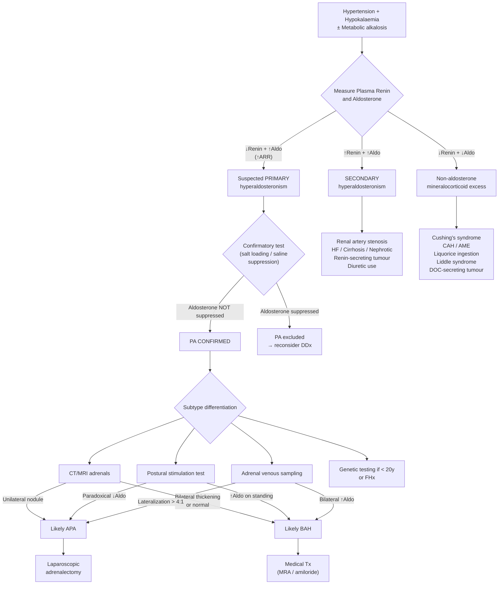

## Differential Diagnosis of Primary Hyperaldosteronism

The differential diagnosis of PA operates on **two levels**:

1. **Level 1 — "Is this really PA, or is something else causing hypertension + hypokalaemia?"** → Differentiating PA from its clinical mimics.
2. **Level 2 — "If it IS PA, what is the specific subtype?"** → Differentiating APA from BAH from rarer causes, because management differs fundamentally (surgery vs. medicine).

Let's work through both systematically.

---

## Level 1: Differential Diagnosis of the PA Clinical Phenotype

The classic presentation that should trigger your differential is: **Hypertension + Hypokalaemia ± Metabolic alkalosis**. But as discussed, many PA patients are normokalaemic, so the broader framing is really **"what are the causes of secondary hypertension that may present with low potassium?"**

### Organising Framework: The Renin–Aldosterone Matrix

This is the single most powerful tool for differential diagnosis. Measure **plasma renin** and **plasma aldosterone** and plot the result:

| | **↑ Aldosterone** | **↓ Aldosterone** |
|:--|:--|:--|
| **↓ Renin** | **Primary hyperaldosteronism** (APA, BAH, FH, carcinoma) | **Non-aldosterone mineralocorticoid excess** (see below) |
| **↑ Renin** | **Secondary hyperaldosteronism** (RAS, HF, cirrhosis, nephrotic, renin-secreting tumour) | Normal physiology or hypoaldosteronism states |

This matrix is derived from first principles:
- **↓Renin + ↑Aldosterone**: The adrenal is autonomously overproducing aldosterone → volume expansion suppresses renin via negative feedback → this IS primary hyperaldosteronism.
- **↑Renin + ↑Aldosterone**: Something upstream is driving renin (e.g., renal hypoperfusion) → renin activates the cascade → aldosterone rises appropriately → this is secondary hyperaldosteronism.
- **↓Renin + ↓Aldosterone**: Volume expansion (suppressing renin) from a NON-aldosterone mineralocorticoid source → aldosterone is also suppressed → this is non-aldosterone mineralocorticoid excess [2][8].

<Callout title="Exam High Yield">
The ARR (aldosterone-to-renin ratio) separates primary from secondary hyperaldosteronism. But to identify non-aldosterone mineralocorticoid excess, you need to look at the ABSOLUTE values — both renin AND aldosterone are LOW. The ARR may be misleadingly elevated or normal depending on the degree of suppression of each.
</Callout>

### Category A: Secondary Hyperaldosteronism (↑Renin, ↑Aldosterone)

These conditions present with hypertension (sometimes) and hypokalaemia but the renin is HIGH — the aldosterone elevation is appropriate and driven by extra-adrenal RAAS activation [1][8].

| Condition | Mechanism | Key Differentiating Features |
|:----------|:----------|:----------------------------|
| ***Renal artery stenosis (RAS)*** [3] | ↓Renal perfusion → ↑renin from juxtaglomerular apparatus → ↑Ang II → ↑aldosterone | Abrupt onset or worsening HTN; renal bruit; flash pulmonary oedema; asymmetric kidneys on USS; young woman (fibromuscular dysplasia) or older male (atherosclerotic); worsening renal function on ACEI/ARB |
| ***Heart failure*** | ↓Cardiac output → ↓renal perfusion → ↑RAAS | Oedema, raised JVP, orthopnoea, PND, S3 gallop — classic HF presentation; hypokalaemia may occur with diuretic use |
| ***Cirrhosis / Nephrotic syndrome*** | 3rd space loss (ascites, oedema) → ↓effective circulating volume → ↑RAAS | Stigmata of chronic liver disease or heavy proteinuria/oedema; hypokalaemia milder |
| **Renin-secreting tumour** (very rare) [1] | Juxtaglomerular cell tumour autonomously secretes renin → ↑Ang II → ↑aldosterone | Very rare; young patient; VERY high renin; renal mass on imaging |

**Why does secondary hyperaldosteronism cause hypokalaemia?** The same mechanism as PA — aldosterone acts on ENaC/Na⁺-K⁺-ATPase. The difference is that the DRIVER is renin (extra-adrenal), not autonomous adrenal production. Clinically, secondary causes usually have **oedema** (because the underlying condition involves true or effective hypovolaemia driving ongoing Na retention WITHOUT aldosterone escape — the kidney "thinks" it needs to retain salt).

### Category B: Non-Aldosterone Mineralocorticoid Excess (↓Renin, ↓Aldosterone)

These are the trickiest mimics. They cause the same clinical picture (HTN + hypokalaemia + metabolic alkalosis) but BOTH renin AND aldosterone are suppressed [2][8].

| Condition | Mechanism | Key Differentiating Features |
|:----------|:----------|:----------------------------|
| **Cushing's syndrome** [3][4] | Cortisol normally has mineralocorticoid activity but is inactivated by 11β-HSD2 in the kidney. In MASSIVE cortisol excess (e.g., ectopic ACTH), 11β-HSD2 is overwhelmed → cortisol activates MR → Na retention, K loss | Cushingoid features (moon face, buffalo hump, striae, proximal myopathy, central obesity); hyperglycaemia; elevated 24h UFC or failed ONDST |
| **Congenital adrenal hyperplasia (CAH)** — 11β-hydroxylase or 17α-hydroxylase deficiency | Blocks cortisol synthesis → ↑ACTH → accumulation of mineralocorticoid precursors (deoxycorticosterone/DOC) → activate MR | Childhood presentation; virilization (11β-hydroxylase) or sexual infantilism (17α-hydroxylase); elevated 11-deoxycortisol or DOC |
| **Apparent mineralocorticoid excess (AME)** | Genetic deficiency of 11β-HSD2 → cortisol cannot be inactivated in the kidney → cortisol activates MR | Rare; childhood-onset severe HTN + hypokalaemia; autosomal recessive; low cortisol-to-cortisone ratio in urine |
| **Liquorice / carbenoxolone ingestion** | Glycyrrhizinic acid in liquorice INHIBITS 11β-HSD2 (same mechanism as AME, but acquired) | Dietary history! Common exam question; reversible on cessation |
| **Liddle syndrome** ("pseudo-hyperaldosteronism") | Gain-of-function mutation in ENaC → constitutively active Na⁺ channel independent of aldosterone | Autosomal dominant; childhood-onset severe HTN; does NOT respond to spironolactone (because the problem is downstream of MR); responds to amiloride (directly blocks ENaC) |
| **Gordon syndrome** (pseudohypoaldosteronism type 2) | Gain-of-function of WNK kinases → ↑NCC activity in DCT → ↑Na reabsorption + ↓K secretion | Autosomal dominant; HTN + HYPERkalaemia (unlike PA which has hypokalaemia); responds to thiazides |
| **Exogenous mineralocorticoids** | Fludrocortisone or other mineralocorticoid administration | Drug history |
| **DOC-producing adrenal tumour** | Rare adrenal tumour secreting deoxycorticosterone (a potent mineralocorticoid) | ↓Renin, ↓aldosterone; elevated DOC; adrenal mass on CT |

<Callout title="Why Does Liquorice Cause Hypertension and Hypokalaemia?">
Glycyrrhizinic acid in liquorice inhibits 11β-HSD2, the enzyme that converts cortisol (active at MR) to cortisone (inactive at MR) in the kidney. Normally, this enzyme "protects" the MR from cortisol. When inhibited, cortisol — which circulates at 100–1000× higher concentrations than aldosterone — floods the MR → massive mineralocorticoid effect → Na retention, K loss, HTN. The same mechanism explains apparent mineralocorticoid excess (AME), except AME is genetic and liquorice is acquired.
</Callout>

### Category C: Other Causes of Hypertension + Hypokalaemia

| Condition | Mechanism | Key Differentiating Features |
|:----------|:----------|:----------------------------|
| ***Phaeochromocytoma*** [3][4] | Catecholamine excess → paroxysmal HTN; can cause hypokalaemia via β₂-mediated transcellular K shift | ***Classic triad: paroxysmal headache, sweating, palpitations*** [4]; ***paroxysmal HTN + postural hypotension*** [4]; ***5 P's: Pressure, Pain, Palpitation, Perspiration, Pallor*** [4]; screened by ***24h urine fractionated metanephrines*** [3] |
| **Diuretic use (thiazides/loops)** | ↑Distal Na delivery → ↑Na/K exchange → K loss; also stimulate RAAS (↑renin, ↑aldosterone) | Drug history! Most common cause of hypokalaemia in hypertensive patients; renin is HIGH (↑ not ↓) — this is secondary, not primary |
| **Chronic vomiting / NG suction** | Loss of H⁺ and Cl⁻ → metabolic alkalosis + volume depletion → secondary hyperaldosteronism → K loss | History of vomiting; low urine Cl⁻ (< 10–20 mmol/L); saline-responsive alkalosis [9] |
| **Bartter / Gitelman syndrome** | Genetic defects in loop of Henle (Bartter) or DCT (Gitelman) transporters → mimics chronic diuretic use → renal salt wasting + ↑RAAS | Young patient; normotensive or hypotensive (unlike PA!); ↑renin, ↑aldosterone; Gitelman also has hypomagnesaemia and hypocalciuria |
| **Renal tubular acidosis type 1 or 2** | Type 1: failure of H⁺ secretion in distal tubule; Type 2: failure of HCO₃⁻ reabsorption in PCT → both cause renal K wasting | Metabolic ACIDOSIS (not alkalosis!) — this is the key distinguishing feature from PA [6] |

<Callout title="Bartter vs Gitelman vs PA" type="idea">
Bartter and Gitelman both cause hypokalaemic metabolic alkalosis like PA, but patients are typically normotensive or hypotensive (salt WASTING), and renin is HIGH. PA causes hypertension and renin is LOW. Think of it this way: Bartter/Gitelman = "the kidney is losing salt" → volume depletion → ↑renin. PA = "the adrenal is retaining salt" → volume expansion → ↓renin.
</Callout>

---

## Level 2: Differentiating PA Subtypes (APA vs BAH vs Others)

Once PA is confirmed (elevated ARR + positive confirmatory test), the critical next step is determining laterality — because this dictates surgery vs. medical management. The key tests are summarized below [1][2][4][8]:

### Postural Stimulation Test (Salt-Loaded Balance Study)

***Differentiated by salt-loaded balance study (9am supine + 1pm erect)*** [4]:

The principle is based on the different regulatory drivers of APA vs BAH:

- **APA** is primarily ***ACTH-dependent*** → aldosterone follows the diurnal cortisol rhythm (peaks in early morning, falls by noon). Moving from supine to erect does NOT raise aldosterone because the adenoma is insensitive to angiotensin II.
  - Result: ***Paradoxical ↓aldosterone*** on standing (because ACTH naturally falls from 8am to 12 noon) [1][2][4]
  
- **BAH** is primarily ***angiotensin II-dependent*** → aldosterone rises briskly with upright posture (standing activates RAAS via reduced venous return → mild ↓renal perfusion → ↑renin → ↑Ang II).
  - Result: ***↑Aldosterone on standing*** (exaggerated response to ↑angiotensin in erect posture) [1][2][4]

| Parameter | APA | BAH |
|:----------|:----|:----|
| **Plasma K** | Very low to normal | Low to normal |
| **Basal aldosterone** | High to very high | High-normal to high |
| **Basal PRA** | Low | Low to low-normal |
| **Salt-loading test** | Failure or inadequate suppression | Failure or inadequate suppression |
| ***Postural test*** | ***↓Ald in 70–90%*** (↓ACTH drive at noon) [1][2] | ***↑Ald in 90%*** (exaggerated ↑Ang response) [1][2] |
| **Adrenal venous sampling** | ↑ ipsilaterally, ↓ contralaterally | ↑ bilaterally |
| **CT/MRI** | Unilateral tumour | Normal or slightly enlarged bilaterally |

### Adrenal Venous Sampling (AVS)

***Adrenal venous sampling from femoral vein*** is the **gold standard** for lateralization [7]. It involves bilateral adrenal venous catheterization via the femoral vein, measuring aldosterone and cortisol levels from each adrenal vein and a peripheral vein.

- **Why is this needed?** CT/MRI can be misleading:
  - A non-functioning "incidentaloma" on one side may be mistaken for an APA
  - Small APAs (< 1 cm) may be missed on CT
  - BAH may cause asymmetric hyperplasia mimicking unilateral disease
- **Interpretation**: Lateralization ratio (aldosterone/cortisol ratio from one side vs the other) > 4:1 typically indicates unilateral disease → adrenalectomy appropriate

### CT/MRI Adrenal Imaging

- **APA**: typically a small (< 2 cm), well-defined, lipid-rich unilateral adrenal nodule; low attenuation on non-contrast CT (< 10 HU)
- **BAH**: bilateral adrenal limb thickening or normal-appearing adrenals
- **Adrenal carcinoma**: large (> 4 cm), irregular, heterogeneous, high attenuation
- **Limitation**: imaging alone cannot reliably distinguish a functioning APA from a non-functioning incidentaloma, hence the need for AVS in patients > 35–40 years [1]

### Genetic Testing

- For suspected **FH Type I (GRA)**: test for the chimeric CYP11B1/CYP11B2 gene
- Indicated if: onset < 20 years, family history of PA, family history of stroke at young age (< 40)

---

## Differential Diagnosis Algorithm

---

## Summary: Key Differentiating Features at a Glance

| Diagnosis | Renin | Aldosterone | Potassium | Unique Clue |
|:----------|:------|:------------|:----------|:------------|
| **Primary hyperaldosteronism** | ↓ | ↑ | ↓ or N | Resistant HTN; ↑ARR |
| **Secondary hyperaldosteronism** | ↑ | ↑ | ↓ or N | Oedema; underlying cause (HF, RAS, cirrhosis) |
| **Cushing's syndrome** | ↓ | ↓ | ↓ | Cushingoid features; failed ONDST |
| **Phaeochromocytoma** | Variable | Variable | ↓ or N | Paroxysmal triad (headache, sweating, palpitations) |
| **Liquorice / AME** | ↓ | ↓ | ↓ | Dietary history; altered cortisol/cortisone ratio |
| **Liddle syndrome** | ↓ | ↓ | ↓ | Young; AD inheritance; responds to amiloride NOT spironolactone |
| **Bartter / Gitelman** | ↑ | ↑ | ↓ | Normotensive / hypotensive; young |
| **Diuretic use** | ↑ | ↑ | ↓ | Drug history! |
| **RTA type 1 or 2** | N/↑ | N/↑ | ↓ | Metabolic ACIDOSIS (not alkalosis) |

<Callout title="The One-Minute Differential">
When you see **HTN + hypokalaemia**: 
1. Check **renin and aldosterone** — this sorts the matrix.
2. **↓Renin + ↑Aldo** = PA → confirm with salt loading → lateralize with postural test / AVS / CT.
3. **↑Renin + ↑Aldo** = Secondary → look for the cause (RAS, HF, diuretics).
4. **↓Renin + ↓Aldo** = Non-aldosterone mineralocorticoid excess → think Cushing's, AME, liquorice, Liddle.
5. Always take a **drug history** (diuretics, liquorice, steroids) and **dietary history** before launching into investigations.
</Callout>

<Callout title="Common Exam Mistake" type="error">
Do not confuse Liddle syndrome with primary hyperaldosteronism. Both have HTN + hypokalaemia + low renin, but in Liddle syndrome aldosterone is ALSO low (the problem is a constitutively active ENaC, downstream of aldosterone). Spironolactone (MR blocker) will NOT work because the channel is active regardless of MR. You need amiloride (direct ENaC blocker).
</Callout>

---

<ActiveRecallQuiz
  title="Active Recall - Differential Diagnosis of Primary Hyperaldosteronism"
  items={[
    {
      question: "A patient has hypertension, hypokalaemia, and metabolic alkalosis. Renin is LOW and aldosterone is LOW. Name three possible diagnoses and explain the shared mechanism.",
      markscheme: "Non-aldosterone mineralocorticoid excess: (1) Cushing's syndrome - cortisol overwhelms 11-beta-HSD2 and activates MR; (2) Apparent mineralocorticoid excess or liquorice ingestion - 11-beta-HSD2 deficiency or inhibition allows cortisol to activate MR; (3) Liddle syndrome - gain-of-function ENaC mutation causes Na retention independent of aldosterone. All cause volume expansion suppressing both renin and aldosterone."
    },
    {
      question: "How does the postural stimulation test differentiate APA from BAH? Explain the physiological basis.",
      markscheme: "APA is ACTH-dependent: aldosterone follows cortisol diurnal rhythm, falling from morning to noon, so aldosterone paradoxically DECREASES on standing. BAH is angiotensin II-dependent: upright posture activates RAAS, so aldosterone INCREASES on standing."
    },
    {
      question: "Why does Bartter or Gitelman syndrome NOT cause hypertension, despite having elevated renin and aldosterone like secondary hyperaldosteronism from RAS?",
      markscheme: "In Bartter/Gitelman, the primary defect is renal salt WASTING (defective Na/Cl transporters in loop of Henle or DCT). Despite compensatory RAAS activation, the kidney cannot retain enough sodium to expand volume. Patients are normotensive or hypotensive. In RAS, the kidney retains salt effectively once perfusion pressure rises, causing HTN."
    },
    {
      question: "Why is adrenal venous sampling considered the gold standard for lateralization in PA, rather than CT alone?",
      markscheme: "CT can be misleading: (1) non-functioning incidentalomas may be mistaken for APA; (2) small APAs less than 1 cm may be missed; (3) asymmetric BAH may mimic unilateral disease. AVS directly measures aldosterone output from each adrenal vein, providing functional lateralization data."
    },
    {
      question: "A patient with suspected PA is taking amlodipine, bisoprolol, and hydrochlorothiazide. Which drugs must be stopped before ARR testing, what effect does each have, and what can be substituted?",
      markscheme: "Hydrochlorothiazide (diuretic) increases renin causing false-low ARR - must stop 2 weeks before. Bisoprolol (beta-blocker) decreases renin causing false-high ARR - must stop 2 weeks before. Amlodipine (DHP CCB) has minimal effect and may be continued, though alpha-blockers (doxazosin) or non-DHP CCBs (verapamil SR) are preferred substitutes."
    }
  ]}
/>

## References

[1] Senior notes: Ryan Ho Endocrine.pdf, Section 3.2.1 (Primary Hyperaldosteronism, pp. 57–59)
[2] Senior notes: Ryan Ho Fundamentals.pdf, Section 3.8.3A (Primary Hyperaldosteronism, pp. 433–434)
[3] Senior notes: Ryan Ho Cardiology.pdf, Section 3.6 (Hypertension – secondary causes, pp. 175–178)
[4] Senior notes: maxim.md, Section on Conn's syndrome and phaeochromocytoma
[6] Senior notes: Ryan Ho Chemical Path.pdf, Section on hypokalaemia workup (p. 18)
[7] Senior notes: Ryan Ho Diagnostic Radiology.pdf, Section 7.1 (Interventional Radiology – adrenal venous sampling, p. 79)
[8] Senior notes: Ryan Ho Urogenital.pdf, Sections on Type IV RTA and metabolic alkalosis (pp. 45, 50–51)
[9] Senior notes: Ryan Ho Urogenital.pdf, Section 2.4.3 (Metabolic Alkalosis, p. 50)
