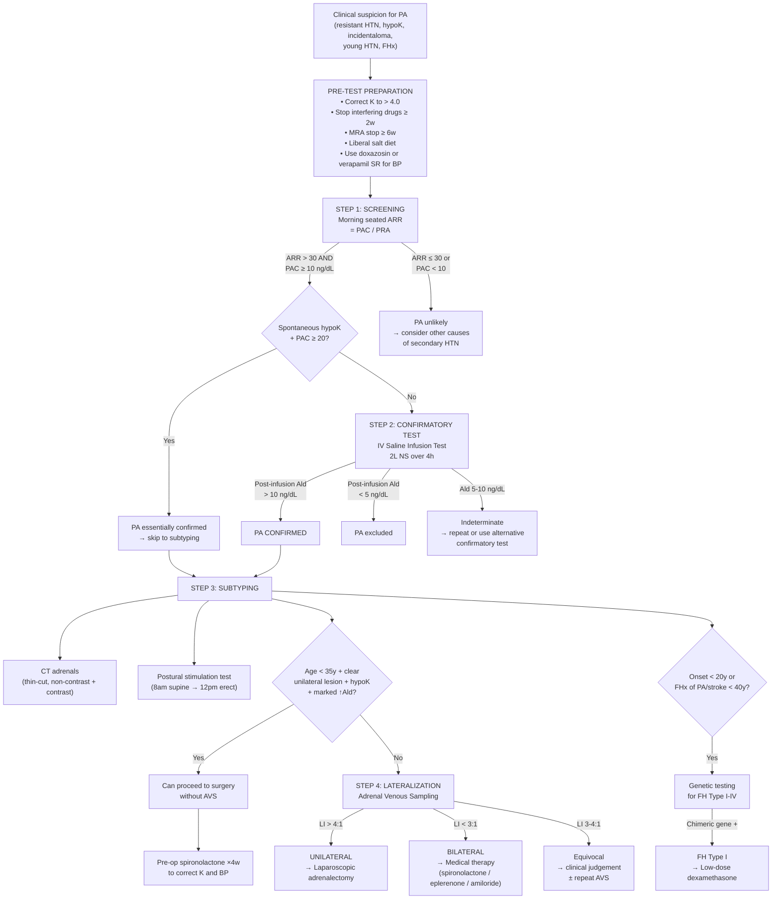

## Diagnostic Approach to Primary Hyperaldosteronism

The diagnostic workup for PA follows a logical, stepwise approach that mirrors clinical thinking: **Screen → Confirm → Subtype → Lateralize → Treat**. Each step has a clear rationale rooted in physiology, and understanding *why* each test is done (rather than memorizing a flowchart) will serve you far better in clinical practice and exams.

---

## Step 0: Pre-Test Precautions (Critical — Gets the Biochemistry Right)

Before ANY hormonal testing, you must optimize conditions to avoid false positives and false negatives. This step is frequently examined.

### A. Correct Hypokalaemia First

**Why?** Hypokalaemia itself **suppresses aldosterone secretion** from the zona glomerulosa (K⁺ is a direct stimulus for aldosterone release). If K⁺ is low, aldosterone may be misleadingly low → **false-negative ARR** → you miss the diagnosis.

- Supplement K⁺ to > 4.0 mmol/L before testing
- Use oral KCl (slow-release preferred)

### B. Stop Interfering Medications

***Stop antihypertensives for ≥2 weeks before dynamic testing (MRA for ≥6 weeks)*** [1]:

| Drug Class | Effect on Renin | Effect on Aldosterone | Net Effect on ARR | Wash-out Period |
|:-----------|:---------------|:---------------------|:-----------------|:----------------|
| **Diuretics** (thiazide, loop) | ↑↑ (volume depletion) | ↑ (secondary) | ↓↓ ARR → false negative | ≥2 weeks |
| **β-blockers, clonidine, methyldopa** | ↓↓ (suppress JGA) | Slight ↓ | ↑↑ ARR → false positive | ≥2 weeks |
| **ACEI / ARB** | ↑ (block Ang II → lose feedback on renin) | ↓ (less Ang II stimulation) | ↓ ARR → false negative | ≥2 weeks |
| **MRA (spironolactone, eplerenone)** | ↑↑ (block Ald action → ↓Na retention → ↑renin) | ↑ (compensatory) | ↓↓ ARR → false negative | ***≥6 weeks*** (canrenone, active metabolite of spironolactone, has long t½) [1] |
| **DHP CCBs** | Variable (mild ↑) | Variable | Variable | Ideally stop; can continue if needed |
| ***α-blockers*** (e.g., doxazosin) | Minimal effect | Minimal effect | ***Minimal effect on ARR*** — safe to continue [1][2] | No wash-out needed |
| **Non-DHP CCBs** (verapamil SR) | Minimal effect | Minimal effect | Safe to continue | No wash-out needed |

**What to use for BP control during wash-out?** ***α-blockers*** (doxazosin) and/or **verapamil SR** — these have minimal effect on the RAAS axis and are the preferred antihypertensives during PA workup [1][2].

### C. Ensure Adequate Sodium Intake

***Ensure reasonable Na intake*** [1][2]: ↓Na intake → ↓tubular Na available for exchange at the collecting duct → protects against K loss → may mask hypokalaemia. Low Na also stimulates RAAS → ↑renin → may lower ARR → false negative.

Advise patients to maintain a **liberal salt diet** (not low-salt) for at least 3 days before testing.

### D. Exclude Other Common Causes of Hypokalaemia

***Exclude other causes of hypokalaemia: diuretics, GI loss, renal tubular acidosis*** [1][2]:
- ***Document excessive urinary K loss*** [2]: spot urine K > 20 mmol/L with concurrent hypokalaemia confirms inappropriate renal K wasting (normal kidneys should conserve K when plasma K is low)

<Callout title="Exam High Yield">
Before interpreting ARR results: (1) Correct K⁺ to > 4.0 mmol/L, (2) Stop interfering drugs (diuretics, β-blockers, ACEI/ARB ≥2w; MRA ≥6w), (3) Ensure liberal Na diet, (4) Use α-blockers or verapamil SR for BP control during workup.
</Callout>

---

## Step 1: Screening — Aldosterone-to-Renin Ratio (ARR)

### What Is the ARR?

The ARR = **Plasma Aldosterone Concentration (PAC)** ÷ **Plasma Renin Activity (PRA)** [or Direct Renin Concentration (DRC)].

This is a ratio test that exploits the fundamental pathophysiology: in PA, aldosterone is HIGH and renin is LOW (suppressed by volume expansion). The ratio amplifies this divergence.

### How to Perform It

- **Timing**: morning (ideally 8–10 am), after the patient has been **seated for 5–15 minutes** (not immediately after lying supine or after vigorous exercise)
- **Conditions**: as per pre-test precautions above (K corrected, interfering drugs stopped, liberal salt)
- **Measure simultaneously**: PAC (in ng/dL or pmol/L) + PRA (in ng/mL/hr) or DRC (in mU/L or ng/L)

### Interpretation — Diagnostic Thresholds [1]

| Parameter | Value | Interpretation |
|:----------|:------|:---------------|
| ***PRA*** | ***< 1 ng/mL/hr*** | Suppressed renin (consistent with PA) [1] |
| ***PAC*** | ***≥ 10 ng/dL (≥ 280 pmol/L)*** | Elevated aldosterone [1] |
| ***ARR*** | ***> 30 (ng/dL per ng/mL/hr)*** | ***~90% sensitivity, ~90% specificity*** for PA [1] |

Per the **2024 Endocrine Society guidelines**, a positive screen requires BOTH:
1. **Elevated ARR** (> 30 if using PAC in ng/dL and PRA in ng/mL/hr)
2. **Elevated PAC** (≥ 10 ng/dL) — this absolute aldosterone threshold prevents false positives in patients with very low renin (e.g., elderly, salt-loaded) where the ratio could be high despite normal aldosterone

### Understanding the ARR From First Principles

**Why use a ratio?** Imagine two scenarios:
- **PA patient**: PAC = 25 ng/dL, PRA = 0.3 ng/mL/hr → ARR = 83 (clearly abnormal)
- **Normal patient on low-salt diet**: PAC = 15 ng/dL, PRA = 3.0 ng/mL/hr → ARR = 5 (normal — both are appropriately elevated)
- **False positive risk**: Elderly patient with low renin: PAC = 8 ng/dL, PRA = 0.2 → ARR = 40 (ratio is high but PAC is < 10, so this is NOT true PA — the absolute PAC threshold catches this)

### Common Pitfalls in ARR Interpretation

| Pitfall | Mechanism | Impact |
|:--------|:----------|:-------|
| **Uncorrected hypokalaemia** | ↓K suppresses Ald → low PAC | False negative (↓ARR) |
| **Active diuretic use** | ↑Renin → low ratio | False negative (↓ARR) |
| **β-blocker use** | ↓Renin → high ratio | False positive (↑ARR) |
| **Renal impairment** | ↓Renin (damaged JGA) | False positive (↑ARR) |
| **Oral contraceptive pills** | ↑Renin substrate (angiotensinogen) | May affect DRC-based calculations |
| **Sample handling** | Renin is labile; sample must be kept on ice and processed promptly | Variable errors |

<Callout title="The ARR Is a Screening Test, Not a Diagnostic Test" type="error">
A positive ARR MUST be followed by a confirmatory test. Do not diagnose PA on ARR alone. The exception is when the clinical picture is overwhelmingly obvious (see below).
</Callout>

---

## Step 2: Confirmatory Testing — Demonstrating Non-Suppressibility

### Principle

The hallmark of PA is that aldosterone production is **autonomous** — it does NOT suppress when you give the body a sodium/volume load (which should normally suppress RAAS and therefore aldosterone). Confirmatory tests exploit this by loading salt/volume and checking whether aldosterone appropriately falls.

### When Can You Skip Confirmation?

***Exception: spontaneous hypokalaemia with Ald ≥ 20 ng/dL → practically diagnostic*** [1] — in this scenario, the pre-test probability is so high that confirmatory testing adds little value and you can proceed directly to subtyping.

### Confirmatory Test Options

| Test | Method | Positive Result (PA confirmed) | Key Considerations |
|:-----|:-------|:------------------------------|:-------------------|
| ***Intravenous saline infusion test (SIT)*** | ***IV 0.9% NaCl 500 mL/hr × 4h*** in sitting/recumbent position [1][2] | ***Post-infusion Ald still > 10 ng/dL (> 280 pmol/L)*** = failure to suppress [1] | ***Monitor BP/P; watch for fluid overload (caution in HF patients)*** [1][2]; most commonly used in HK |
| **Oral sodium loading test (OSL)** | High-Na diet (> 200 mmol/day × 3 days) + KCl supplement → collect 24h urine on day 3 | 24h urine aldosterone > 12 µg/day (> 33 nmol/day) with urinary Na > 200 mmol/day (confirms adequate loading) | Outpatient-friendly; less standardized |
| **Fludrocortisone suppression test (FST)** | Fludrocortisone 0.1 mg q6h × 4 days + NaCl supplements + KCl | Day 4 upright 10 am PAC > 6 ng/dL with PRA < 1 | Most sensitive and specific but cumbersome, requires inpatient monitoring; rarely used now |
| **Captopril challenge test (CCT)** | Captopril 25–50 mg PO → measure PAC, PRA at 0h and 1–2h | PAC remains > 8.5 ng/dL and/or ARR remains > 30 (no aldosterone suppression by ACE inhibition) | Less validated; used when SIT is contraindicated (e.g., severe HF) |

### Understanding the SIT (Most Common Confirmatory Test) From First Principles

1. You infuse **2 litres of normal saline over 4 hours** → massive volume expansion
2. Volume expansion → ↑renal perfusion → ↓renin secretion from JGA + ↑ANP release
3. In a **normal person**: ↓renin → ↓Ang II → ↓aldosterone (aldosterone suppresses appropriately)
4. In **PA**: the adrenal is producing aldosterone autonomously → aldosterone remains elevated despite the volume/salt load → ***failure or inadequate suppression (Ald still > 10 ng/dL)*** [1][2]

```
Normal:     2L NS → ↓renin → ↓Ang II → ↓aldosterone (<5 ng/dL)      ✓ Suppressed
PA:         2L NS → ↓renin → ↓Ang II → aldosterone STILL HIGH (>10)  ✗ Not suppressed
Grey zone:  Ald 5-10 ng/dL → indeterminate → clinical judgement or repeat
```

---

## Step 3: Subtype Differentiation — Determining Laterality

This is the **most critical step** because it directly determines management: **unilateral → surgery; bilateral → medical therapy** [1][2][4].

### A. CT / MRI Adrenals

**Purpose**: Anatomical assessment of adrenal glands — detect mass, determine side, assess malignancy risk.

| Finding | Interpretation |
|:--------|:---------------|
| Unilateral nodule < 2 cm, lipid-rich (< 10 HU on non-contrast CT) | Suggestive of APA |
| Bilateral limb thickening or normal adrenals | Suggestive of BAH |
| Large mass > 4 cm, irregular, heterogeneous, calcified, > 10 HU | Suspect adrenocortical carcinoma — proceed urgently |
| Normal adrenals | Does NOT exclude PA — small adenomas may be invisible on CT |

**Limitations of CT alone** (why you cannot rely on imaging):
- Up to 25% of adults > 40 have non-functioning adrenal incidentalomas → a visible nodule may NOT be the source
- Small APAs (< 1 cm) can be missed
- Unilateral incidentaloma + contralateral BAH → imaging misleading
- Therefore, **CT alone is insufficient for lateralization in most patients**

**When can CT alone suffice without AVS?** Per the 2024 Endocrine Society guidelines:
- **Patient < 35 years** with spontaneous hypokalaemia, marked aldosterone elevation, **AND** a clear unilateral adenoma > 1 cm on CT with a normal contralateral adrenal → can proceed to surgery without AVS (very high pre-test probability; incidentalomas rare in this age group)

### B. Postural Stimulation Test (Posture/Balance Test)

***Differentiated by salt-loaded balance study (9am supine + 1pm erect)*** [4]:

**Protocol** [1][2]:
1. Patient admitted overnight, lying supine from midnight
2. **8 am (supine)**: Draw blood for PRA and aldosterone (and cortisol)
   - At this time: ACTH is HIGH (early morning cortisol peak); Ang II is LOW (supine = no RAAS activation)
3. Patient then ambulates (walks around) for 4 hours
4. **12 noon (erect)**: Draw blood again for PRA and aldosterone (and cortisol)
   - At this time: ACTH is LOWER (natural diurnal decline); Ang II is HIGHER (upright posture activates RAAS)

**Interpretation** [1][2]:

| | 8 am (Supine) | 12 noon (Erect) | Response | Interpretation |
|:--|:--|:--|:--|:--|
| **Normal** | Baseline Ald | ↑Ald | **Rise** | Normal RAAS activation by posture |
| ***APA*** | **High Ald** | ***↓Ald (paradoxical fall in 70–90%)*** | ***Fall*** | ***ACTH-dependent: Ald follows cortisol diurnal decline; insensitive to Ang II*** [1][2] |
| ***BAH*** | Moderate Ald | ***↑Ald (in 90%)*** | ***Rise*** | ***Angiotensin-dependent: exaggerated response to ↑Ang II with upright posture*** [1][2] |

**Why the paradoxical fall in APA?**
- The adenoma's aldosterone production is driven primarily by ACTH (not Ang II, because the adenoma has lost normal Ang II responsiveness)
- ACTH follows a diurnal rhythm: peaks early morning, falls by noon
- When the patient stands up, Ang II rises but the adenoma doesn't respond to it
- Meanwhile, ACTH is falling → aldosterone falls too
- Net result: paradoxical FALL in aldosterone despite upright posture

***Caveat: considered not reliable enough in differentiating between adenoma and hyperplasia*** [1] — the postural test has about 70–85% accuracy and should be supplemented by AVS in equivocal cases.

### C. Adrenal Venous Sampling (AVS) — The Gold Standard for Lateralization

***Adrenal venous sampling: bilateral adrenal venous catheterization → venous sampling to measure aldosterone level*** [2][7]

**Principle**: Directly sample the effluent blood from each adrenal vein (via femoral vein catheterization) and compare the aldosterone concentration from each side. This tells you which adrenal is over-producing.

**Protocol**:
1. Interventional radiologist catheterizes both adrenal veins (via femoral vein approach) [7]
2. Blood is drawn from:
   - Right adrenal vein (drains into IVC directly — technically more difficult to cannulate)
   - Left adrenal vein (drains into left renal vein — easier)
   - Peripheral (IVC) as a reference
3. Measure **aldosterone** and **cortisol** from all three sites
4. **Cortisol is used to confirm successful cannulation** — adrenal venous cortisol should be much higher than peripheral cortisol (selectivity index ≥ 2–3:1 without ACTH stimulation, ≥ 5:1 with ACTH stimulation)

**Interpretation — Lateralization Index (LI)**:

$$\text{LI} = \frac{\text{Aldo/Cortisol ratio (dominant side)}}{\text{Aldo/Cortisol ratio (non-dominant side)}}$$

| LI Value | Interpretation |
|:---------|:---------------|
| **> 4:1** (without ACTH) or **> 4:1** (with ACTH) | **Unilateral** — lateralized → adrenalectomy |
| **< 3:1** | **Bilateral** — non-lateralized → medical therapy |
| 3–4:1 | Equivocal — clinical judgement |

Additionally, the **contralateral suppression index** (non-dominant adrenal Aldo/Cortisol divided by peripheral Aldo/Cortisol < 1) suggests the contralateral gland is suppressed by the dominant adenoma, further supporting unilateral disease.

**Why use the Aldo/Cortisol ratio rather than absolute aldosterone?**
- Cortisol secretion is roughly symmetric from both adrenals
- Using cortisol as a denominator corrects for:
  - Differences in blood flow between the two adrenal veins
  - Dilution effects (e.g., if one catheter tip is further from the gland)
  - Ensures valid comparison between the two sides

**When is AVS indicated?**
- All confirmed PA patients **≥ 35 years** who are potential surgical candidates (to prevent inappropriate surgery on a non-functioning incidentaloma)
- Can be omitted in patients **< 35 years** with classic clinical/biochemical picture + clear unilateral CT lesion

**Complications**: Rare (< 2.5%), but include adrenal vein rupture, adrenal haemorrhage, contrast reactions. Right adrenal vein cannulation is technically challenging (success rate 74–96%).

<Callout title="Why Is AVS So Important?">
Without AVS, up to 37.8% of patients would receive inappropriate management — either unnecessary surgery for bilateral disease or denial of curative surgery for unilateral disease based on misleading CT findings. AVS is the single test that changes management most reliably.
</Callout>

### D. Genetic Testing

| Indication | Test |
|:-----------|:-----|
| PA onset < 20 years | Screen for **FH Type I (GRA)** — chimeric CYP11B1/CYP11B2 gene |
| Family history of PA or stroke < 40 years | Screen for FH Type I |
| Bilateral PA in young patient | Consider FH Types II–IV (CLCN2, KCNJ5, CACNA1H mutations) |

### E. Dexamethasone Suppression (for FH Type I / GRA)

- Administer dexamethasone 0.5 mg q6h × 2–4 days
- In FH Type I: aldosterone suppresses (because production is ACTH-dependent in zona fasciculata)
- In sporadic PA: aldosterone does NOT suppress
- **Confirmatory**: long-range PCR for the chimeric gene (gold standard)

### F. Ancillary Markers (18-Hydroxycortisol)

- **↑↑ 18-hydroxycortisol** (> 100 nmol/day in urine): highly suggestive of APA or FH Type I
- Less specific for BAH
- Not widely available; primarily a research/confirmatory tool

---

## Comprehensive Summary Table: Investigations and Key Findings

| Investigation | Stage | Key Finding in PA | Purpose |
|:-------------|:------|:-----------------|:--------|
| **Serum electrolytes (RFT)** | Baseline | ***Hypokalaemic metabolic alkalosis; Na at upper end of normal; mild hypoMg*** [1] | Initial clue |
| **Spot urine K** | Baseline | > 20 mmol/L with hypokalaemia → inappropriate renal K wasting | Confirm renal K loss |
| **ECG** | Baseline | U waves, flattened T waves, prolonged QT, ST depression (hypokalaemia) | Assess cardiac risk |
| ***ARR (PAC + PRA)*** | **Screening** | ***↓PRA (< 1), ↑PAC (≥ 10), ARR > 30*** [1] | Screen for PA |
| ***Saline infusion test*** | **Confirmation** | ***Post-infusion Ald > 10 ng/dL (failure to suppress)*** [1][2] | Confirm autonomous Ald |
| ***Oral salt loading*** | Confirmation | 24h urine Ald > 12 µg/day with urine Na > 200 mmol/day | Alternative confirmation |
| **Captopril challenge** | Confirmation | PAC remains elevated, ARR remains > 30 at 1–2h | When SIT contraindicated |
| ***CT adrenals*** | **Subtyping** | Unilateral nodule (APA) vs bilateral thickening/normal (BAH) vs large mass (carcinoma) [2][5] | Anatomical assessment |
| ***Postural stimulation test*** | **Subtyping** | ***↓Ald = APA (ACTH-dependent); ↑Ald = BAH (Ang II-dependent)*** [1][2][4] | Functional differentiation |
| ***Adrenal venous sampling*** | **Lateralization** | ***LI > 4:1 = unilateral; < 3:1 = bilateral*** [2][7] | **Gold standard** for lateralization |
| **Genetic testing** | If indicated | Chimeric gene = FH Type I | Young-onset or FHx |
| **18-hydroxycortisol** | Ancillary | ↑↑ in APA or FH Type I | Research/confirmatory |

---

## Master Diagnostic Algorithm



---

## Interpreting Results in Context: APA vs BAH Summary Table

| Investigation | ***APA (Conn's)*** | ***BAH/BIAH*** |
|:-------------|:--|:--|
| **Plasma K** | ***Very low to normal*** [1][2] | ***Low to normal*** [1][2] |
| **Basal Ald** | ***High to very high*** [1][2] | ***High-normal to high*** [1][2] |
| **Basal PRA** | ***Low*** [1][2] | ***Low to low-normal*** [1][2] |
| **Salt-loading test** | ***Failure or inadequate suppression*** [1][2] | ***Failure or inadequate suppression*** [1][2] |
| ***Postural test*** | ***↓Ald in 70–90% (↓ACTH drive at noon)*** [1][2] | ***↑Ald in 90% (exaggerated response to ↑Ang in erect posture)*** [1][2] |
| ***AVS*** | ***↑ ipsilaterally, ↓ contralaterally*** [1][2] | ***↑ bilaterally*** [1][2] |
| ***CT/MRI*** | ***Unilateral tumour*** [1][2] | ***Normal or slightly enlarged*** [1][2] |

---

<Callout title="High Yield Summary">

**Diagnostic Approach — 4 Steps**:

**Step 0: Pre-test preparation** — Correct K⁺ > 4.0; stop diuretics/β-blockers/ACEI/ARB ≥ 2w, MRA ≥ 6w; liberal salt; use α-blockers for BP.

**Step 1: Screen** — ARR (morning, seated). Positive = ARR > 30 AND PAC ≥ 10 ng/dL.

**Step 2: Confirm** — Saline infusion test (2L NS over 4h). Confirmed = post-infusion Ald > 10 ng/dL. Exception: spontaneous hypoK + Ald ≥ 20 → skip confirmation.

**Step 3: Subtype/Lateralize** — CT adrenals + postural test + **AVS (gold standard)**:
- AVS LI > 4:1 → unilateral (APA) → laparoscopic adrenalectomy
- AVS LI < 3:1 → bilateral (BAH) → MRA (spironolactone/eplerenone)
- AVS can be skipped in patients < 35y with classic unilateral CT + spontaneous hypoK + marked ↑Ald

**Key postural test interpretation**: APA = paradoxical ↓Ald (ACTH-dependent); BAH = ↑Ald (Ang II-dependent).

</Callout>

---

<ActiveRecallQuiz
  title="Active Recall - Diagnosis of Primary Hyperaldosteronism"
  items={[
    {
      question: "Why must hypokalaemia be corrected before measuring the ARR, and what direction of error does uncorrected hypokalaemia cause?",
      markscheme: "Hypokalaemia directly suppresses aldosterone secretion from the zona glomerulosa (K+ is a physiological stimulus for aldosterone release). Uncorrected hypoK leads to falsely low PAC, causing a false-negative (low) ARR, potentially missing the diagnosis of PA."
    },
    {
      question: "A patient has ARR of 45 and PAC of 7 ng/dL. Is this a positive screen for PA? Explain your reasoning.",
      markscheme: "No. Although ARR exceeds 30, the absolute PAC is below 10 ng/dL. Per Endocrine Society guidelines, BOTH ARR > 30 AND PAC >= 10 are required for a positive screen. This scenario likely reflects very low renin (e.g., elderly, salt-loaded) rather than true aldosterone excess."
    },
    {
      question: "Explain the physiological principle behind the saline infusion test. What happens in a normal person vs a PA patient?",
      markscheme: "2L NS over 4h causes volume expansion, increasing renal perfusion and ANP release, which suppresses renin and therefore Ang II. In normal subjects, aldosterone falls below 5 ng/dL (appropriate suppression). In PA, aldosterone production is autonomous and remains above 10 ng/dL despite volume loading (failure to suppress)."
    },
    {
      question: "During adrenal venous sampling, why is the aldosterone-to-cortisol ratio used rather than absolute aldosterone values?",
      markscheme: "Cortisol is secreted roughly equally from both adrenals and serves as an internal control. Dividing by cortisol corrects for: (1) differences in blood flow between adrenal veins, (2) catheter tip position (dilution effects), (3) confirms successful cannulation (cortisol should be much higher in adrenal vein than peripheral). This allows valid side-to-side comparison."
    },
    {
      question: "In which specific clinical scenario can you proceed to adrenalectomy without performing AVS?",
      markscheme: "Patient aged under 35 years with spontaneous hypokalaemia, markedly elevated aldosterone, AND a clear unilateral adrenal adenoma (> 1 cm) on CT with a normal contralateral adrenal. In this age group, non-functioning incidentalomas are very rare, so CT alone is reliable for lateralization."
    },
    {
      question: "Name three drugs that can cause a false-positive ARR and three that can cause a false-negative ARR. Explain the mechanism for one of each.",
      markscheme: "False-positive (high ARR): beta-blockers, clonidine, methyldopa - all suppress renin by inhibiting sympathetic drive to JGA, lowering the denominator. False-negative (low ARR): diuretics, ACEI/ARB, MRA (spironolactone) - diuretics cause volume depletion which stimulates renin, raising the denominator and lowering the ratio."
    }
  ]}
/>

## References

[1] Senior notes: Ryan Ho Endocrine.pdf, Section 3.2.1 (Primary Hyperaldosteronism, pp. 57–59)
[2] Senior notes: Ryan Ho Fundamentals.pdf, Section 3.8.3A (Primary Hyperaldosteronism, pp. 433–434)
[4] Senior notes: maxim.md, Section on Conn's syndrome
[5] Senior notes: maxim.md, Section on Adrenal incidentaloma
[7] Senior notes: Ryan Ho Diagnostic Radiology.pdf, Section 7.1 (Interventional Radiology — adrenal venous sampling, p. 79)
[10] Senior notes: Ryan Ho Urogenital.pdf, Section on hypokalaemia diagnostic evaluation (p. 25)
[11] Senior notes: Ryan Ho Chemical Path.pdf, Section on hyperkalaemia workup (pp. 14–15)
