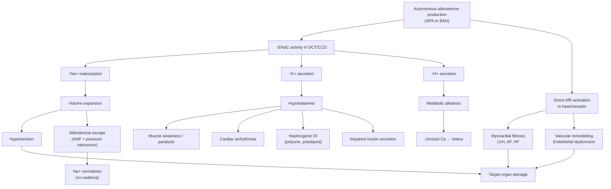

# Primary Hyperaldosteronism (Conn's Syndrome)

## 1. Definition

Primary hyperaldosteronism (PA) refers to a group of conditions in which **aldosterone production is inappropriately elevated, relatively autonomous from the renin-angiotensin system, and non-suppressible by sodium loading** [1][2]. The hallmark biochemical signature is **↑aldosterone with ↓renin** (i.e., a high aldosterone-to-renin ratio, ARR).

The eponym "Conn's syndrome" historically refers specifically to an **aldosterone-producing adenoma (APA)**, first described by Jerome Conn in 1955. However, in modern usage, "primary hyperaldosteronism" is the umbrella term encompassing all causes of autonomous aldosterone excess originating from the adrenal gland itself.

Breaking the name down:
- **Primary** = the problem originates in the adrenal gland (cf. "secondary" = driven by extra-adrenal renin excess)
- **Hyper** = excessive
- **Aldosteron-ism** = relating to aldosterone production/action

This is fundamentally different from **secondary hyperaldosteronism** where aldosterone is high because renin is high (e.g., renal artery stenosis, heart failure, cirrhosis) — in secondary causes, both renin AND aldosterone are elevated. In primary hyperaldosteronism, the adrenal is producing aldosterone autonomously, so **renin is suppressed** by negative feedback (volume expansion suppresses the juxtaglomerular apparatus).

<Callout title="Core Concept">
Primary hyperaldosteronism = ↑Aldosterone + ↓Renin (autonomous adrenal production).
Secondary hyperaldosteronism = ↑Aldosterone + ↑Renin (driven by extra-adrenal RAAS activation).
The ARR (aldosterone-to-renin ratio) is the key screening test that separates these two.
</Callout>

---

## 2. Epidemiology

### Prevalence
- PA is the **most common cause of secondary hypertension**, accounting for approximately **5–13% of all hypertensive patients** and up to **20% of patients with resistant hypertension** (defined as BP uncontrolled on ≥3 antihypertensives including a diuretic) [1][2].
- Previously thought rare (~1%), but with widespread use of ARR screening, prevalence estimates have risen dramatically.
- In a Hong Kong context, PA is an important and underdiagnosed cause of secondary hypertension. Given HK's ageing population and high prevalence of hypertension (~20% of the population [3]), screening for PA in appropriate patients is clinically very relevant.

### Age and Sex
- **Bilateral idiopathic adrenal hyperplasia (BAH)**: more common overall, typically presents in **middle-aged adults (40–60 years)**, slight male predominance.
- **Aldosterone-producing adenoma (APA / Conn's syndrome)**: tends to present at a **younger age** than BAH, with a **female predominance** (F:M ≈ 2:1). Younger patients with more profound hypokalaemia and higher BP should raise suspicion for APA [1].

### Why Does It Matter?
- PA patients have **higher cardiovascular morbidity and mortality** compared to patients with essential hypertension matched for the same degree of BP elevation [1].
- This excess risk is due to the **direct deleterious effects of aldosterone** on the heart, vasculature, and kidneys — independent of blood pressure. Aldosterone causes:
  - Myocardial fibrosis → LVH, diastolic dysfunction, arrhythmias (especially AF)
  - Vascular inflammation and endothelial dysfunction → accelerated atherosclerosis
  - Renal fibrosis and proteinuria
- Therefore, identifying and specifically treating PA (rather than just treating BP with generic antihypertensives) is crucial.

<Callout title="Exam High Yield" type="idea">
PA is not just about blood pressure. Aldosterone causes direct end-organ damage (cardiac fibrosis, renal injury, vascular inflammation) INDEPENDENT of BP. This is why targeted treatment (adrenalectomy or MRA) improves outcomes beyond BP control alone.
</Callout>

---

## 3. Anatomy and Function of the Adrenal Cortex (Relevant to PA)

### Adrenal Cortex Zones
The adrenal cortex has three zones, remembered by the mnemonic **"GFR" (from outside in) = salt, sugar, sex**:

| Zone | Layer | Hormone | Mnemonic |
|:-----|:------|:--------|:---------|
| **Zona Glomerulosa** (outermost) | Thin | **Aldosterone** (mineralocorticoid) | "**Salt**" |
| **Zona Fasciculata** (middle, thickest) | Thick | **Cortisol** (glucocorticoid) | "**Sugar**" |
| **Zona Reticularis** (innermost) | Thin | **DHEA/androgens** | "**Sex**" |

PA arises from pathology in the **zona glomerulosa**.

### Normal Aldosterone Physiology

**Stimuli for aldosterone secretion** [1]:
1. **Angiotensin II** (via RAAS) — the **main stimulant**
   - Triggered by: ↓glomerular perfusion pressure, ↓Na+ at macula densa → ↑renin → angiotensinogen → angiotensin I → (ACE) → angiotensin II → stimulates zona glomerulosa
2. **Hyperkalaemia** — directly stimulates zona glomerulosa (even small changes in K+ are potent stimuli)
3. **ACTH** — has a minor, short-term stimulatory effect (explains diurnal variation in aldosterone and is relevant in APA which may be partially ACTH-responsive)

**Physiological factors modulating secretion** [1]:
- ↑ Secretion: upright posture, exercise, Na deprivation, hypovolaemia, stress, diuretics
- ↓ Secretion: ↑age, Na loading, volume overload, autonomic failure

### Mechanism of Action of Aldosterone [1][2]

Aldosterone acts on the **mineralocorticoid receptor (MR)** in the **principal cells of the distal convoluted tubule (DCT) and cortical collecting duct (CCD)**.

The key downstream effects:
1. **Stimulates the epithelial sodium channel (ENaC)** on the luminal membrane → ↑Na+ reabsorption from tubular lumen into cell
2. **Stimulates the basolateral Na+/K+-ATPase** → pumps Na+ into blood, K+ into cell
3. Net effect: **Na+ retention + K+ secretion** into the tubular lumen
4. The electrical gradient created by Na+ reabsorption also drives **H+ secretion** via H+-ATPase and H+/K+-ATPase in intercalated cells → **metabolic alkalosis**

**Result of aldosterone excess**: **Hypokalaemic metabolic alkalosis ± hypernatraemia** (though Na is often only at the upper end of normal due to "aldosterone escape" — see below) [1][2].

### Aldosterone Escape Phenomenon

In chronic aldosterone excess, you might expect massive sodium retention and severe oedema. However, this does NOT occur because of the **"aldosterone escape"** mechanism:

1. Initial aldosterone excess → Na+ and water retention → volume expansion
2. Volume expansion → ↑renal perfusion pressure → ↑GFR + ↑atrial natriuretic peptide (ANP) release
3. ANP + ↑GFR → **pressure natriuresis** — the kidney excretes the excess sodium despite ongoing aldosterone stimulation
4. **Result**: a new steady state is reached where sodium balance is restored but at a slightly expanded volume. This is why:
   - **Oedema is rare** in PA (unlike secondary hyperaldosteronism where RAAS is activated by true hypovolaemia)
   - **Serum sodium is usually only at the upper end of normal** (not overtly hypernatraemic)
   - **Hypokalaemia persists** because there is no equivalent "escape" for potassium — K+ secretion continues relentlessly

<Callout title="Why No Oedema in Primary Hyperaldosteronism?">
Because of "aldosterone escape" — ANP release and pressure natriuresis counterbalance the Na-retaining effect. Sodium reaches a new steady state. But there is NO escape for potassium — hence persistent hypokalaemia. This also explains why Na+ is usually only mildly elevated or at the upper range of normal.
</Callout>

---

## 4. Aetiology

### Causes of Primary Hyperaldosteronism

| Cause | Frequency | Key Features |
|:------|:----------|:-------------|
| **Bilateral idiopathic adrenal hyperplasia (BAH/BIAH)** | ***60–70%*** | Bilateral zona glomerulosa hyperplasia; aldosterone remains responsive to angiotensin II (i.e., posture-sensitive); milder hypokalaemia; older patients [1][4] |
| **Aldosterone-producing adenoma (APA, "Conn's syndrome")** | ***30–40%*** | Unilateral benign adenoma; younger patients; more severe hypokalaemia and hypertension; often partially ACTH-dependent (paradoxical response to posture) [1][4] |
| **Unilateral (primary) adrenal hyperplasia** | ~2–3% | Unilateral hyperplasia behaving like APA; treated surgically |
| **Familial hyperaldosteronism (FH)** | ~1–5% | Several types (see below); FH type I (glucocorticoid-remediable aldosteronism, GRA) is the most important |
| **Aldosterone-producing adrenocortical carcinoma** | < 1% | Very rare; suspect if large adrenal mass (> 4 cm) with PA biochemistry |

### Familial Hyperaldosteronism Subtypes

| Type | Gene/Mechanism | Key Feature |
|:-----|:---------------|:------------|
| **FH Type I (GRA)** | ***Chimeric CYP11B1/CYP11B2 gene*** — aldosterone synthase placed under ACTH control | Aldosterone secretion is **ACTH-dependent** → **suppressible by dexamethasone** [1][2]; autosomal dominant; onset in childhood/young adults; high risk of haemorrhagic stroke |
| FH Type II | CLCN2 mutations | Familial APA or BAH; NOT dexamethasone-suppressible |
| FH Type III | KCNJ5 mutations | Severe, early-onset; massive bilateral hyperplasia |
| FH Type IV | CACNA1H mutations | Rare; childhood onset |

<Callout title="FH Type I (Glucocorticoid-Remediable Aldosteronism)" type="idea">
In FH Type I, a chimeric gene is created by unequal crossing-over between CYP11B1 (11β-hydroxylase, in zona fasciculata, ACTH-responsive) and CYP11B2 (aldosterone synthase, in zona glomerulosa). The result is aldosterone synthase activity controlled by the ACTH-responsive promoter of 11β-hydroxylase — so aldosterone is produced in the zona fasciculata under ACTH control. Giving dexamethasone suppresses ACTH → suppresses aldosterone. Suspect in young-onset PA with family history (autosomal dominant). Diagnosed by genetic testing for the chimeric gene [1].
</Callout>

### Important Note on Frequency (Discrepancy in Notes)

The relative frequency of APA vs BAH differs between sources [1][2]:
- **Ryan Ho Endocrine notes** [1]: BAH 60–70%, APA 30–40%
- **Ryan Ho Fundamentals notes** [2]: APA 60–70%, BAH 20–40%

Per the 2024 Endocrine Society Clinical Practice Guidelines and current literature, **BAH is the most common cause (~60–70%)** and APA accounts for ~30–40%. The Fundamentals note likely reflects older data when APA was thought to be more common (selection bias from surgical series). **Use BAH > APA for exams** in line with current guidelines.

---

## 5. Pathophysiology

Let us trace the pathophysiology systematically from the autonomous aldosterone production to its clinical consequences:

### Step 1: Autonomous Aldosterone Production
- In APA: a monoclonal adenoma in the zona glomerulosa produces aldosterone independently of the normal RAAS regulatory feedback. Somatic mutations (commonly in **KCNJ5**, encoding the GIRK4 potassium channel) lead to constitutive activation of aldosterone synthesis.
- In BAH: bilateral hyperplasia of zona glomerulosa cells; the mechanism is less well understood, but aldosterone production remains partially responsive to angiotensin II (hence posture-sensitive).

### Step 2: Renal Effects of Aldosterone Excess
1. **↑Na+ reabsorption** → mild volume expansion → hypertension
2. **↑K+ secretion** → hypokalaemia
3. **↑H+ secretion** → metabolic alkalosis
4. Aldosterone escape limits Na+ retention (see above), but K+ and H+ loss continue

### Step 3: Consequences of Hypokalaemia
- **Neuromuscular**: muscle weakness, cramps, flaccid paralysis (K+ is critical for resting membrane potential of muscle cells; hypokalaemia hyperpolarizes cells → harder to depolarize → weakness)
- **Cardiac**: arrhythmias (U waves, prolonged QT, increased risk of VF), especially relevant given concurrent hypertension
- **Renal**: chronic hypokalaemia → **vacuolar nephropathy** of tubular cells → impaired concentrating ability → **nephrogenic diabetes insipidus** → polyuria, polydipsia, nocturia [2]
- **Metabolic**: impaired insulin secretion (K+ needed for pancreatic β-cell function) → glucose intolerance

### Step 4: Consequences of Metabolic Alkalosis
- Alkalosis shifts the albumin-calcium equilibrium: more Ca²+ binds to albumin (albumin becomes more negatively charged in alkalotic pH) → **↓ionized Ca²+** → **latent or overt tetany**, paraesthesiae [2]
- Alkalosis also shifts the oxyhaemoglobin dissociation curve to the LEFT → ↓O₂ delivery to tissues (Bohr effect)

### Step 5: Hypertension and Cardiovascular Damage
- Volume expansion (even modest) + direct vascular effects of aldosterone → **sustained hypertension**
- Aldosterone directly activates MR in cardiomyocytes, vascular smooth muscle, and fibroblasts → **myocardial fibrosis, LVH, vascular remodelling, endothelial dysfunction**
- These contribute to **disproportionate target organ damage** relative to degree of hypertension:
  - ↑LVH, ↑AF, ↑heart failure
  - ↑Stroke
  - ↑Proteinuria, ↑CKD progression
  - ↑Metabolic syndrome

### Pathophysiology Summary Diagram

---

## 6. Classification

### By Aetiology (as above)

| Category | Subtype | Laterality |
|:---------|:--------|:-----------|
| **Sporadic** | APA (Conn's syndrome) | Unilateral |
| | BAH/BIAH | Bilateral |
| | Unilateral adrenal hyperplasia | Unilateral |
| | Adrenocortical carcinoma | Usually unilateral |
| **Familial** | FH Type I (GRA) | Bilateral |
| | FH Type II–IV | Variable |

### By Laterality (Clinically Critical for Management)

This is the most important classification because it determines treatment:

| Unilateral | Bilateral |
|:-----------|:----------|
| APA, unilateral hyperplasia | BAH, FH |
| **Surgical** (laparoscopic adrenalectomy) | **Medical** (mineralocorticoid receptor antagonist) |

> **Key point**: Distinguishing unilateral from bilateral disease is the single most important step after confirming PA, because it dictates surgical vs medical management [1][4].

### By Severity

- **Overt PA**: classic presentation with hypertension + spontaneous hypokalaemia + ↑ARR + positive confirmatory test
- **Normokalemic PA**: increasingly recognized; PA WITHOUT hypokalaemia — this is actually the **majority** of cases! Only ~30–50% of PA patients have hypokalaemia at presentation. Do not rely on hypokalaemia to screen for PA.

<Callout title="Common Exam Mistake" type="error">
A common pitfall is thinking "no hypokalaemia = no primary hyperaldosteronism." In fact, most PA patients are normokalaemic at presentation. Hypokalaemia, when present, makes PA more likely but its absence does NOT exclude it. Always use the ARR for screening, not serum K+ alone.
</Callout>

---

## 7. Clinical Features

### 7.1 Symptoms (with pathophysiological basis)

#### A. Hypertension-Related Symptoms
- **Headache, visual disturbance** — from sustained hypertension; often described as morning headache due to nocturnal BP non-dipping (PA patients frequently have non-dipping or reverse-dipping BP patterns because aldosterone excess causes sustained volume expansion overnight)
- **Often asymptomatic** — many patients are identified on routine BP measurement or investigation of resistant hypertension

#### B. Hypokalaemia-Related Symptoms [2]
- **Muscle weakness and cramps** → hypokalaemia hyperpolarizes skeletal muscle cell membranes (the resting membrane potential becomes more negative, further from threshold), making it harder for action potentials to fire → weakness. In severe cases, **flaccid paralysis** can occur.
- **Polyuria, polydipsia, nocturia** → chronic hypokalaemia damages renal tubular cells (vacuolar nephropathy), impairing the kidney's ability to concentrate urine (downregulation of aquaporin-2 channels and reduced responsiveness to ADH) → **nephrogenic diabetes insipidus** [2]
- **Palpitations** → hypokalaemia predisposes to cardiac arrhythmias (delayed ventricular repolarization → prolonged QT → risk of torsades de pointes, ventricular fibrillation)
- **Constipation** → hypokalaemia impairs smooth muscle contractility in the GI tract (bowel muscle requires adequate K+ for normal peristalsis)

#### C. Metabolic Alkalosis-Related Symptoms [2]
- **Paraesthesiae (tingling)** → metabolic alkalosis ↓ionized calcium (↑albumin binding in alkalosis) → nerve hyperexcitability. May also be partly due to concurrent magnesium loss (Mg²+ is co-excreted with K+ in the distal tubule)
- **Latent or overt tetany** → same mechanism as above (↓ionized Ca²+); carpopedal spasm, Chvostek's sign, Trousseau's sign may be present

#### D. Other Symptoms
- **Glucose intolerance / diabetes** → hypokalaemia impairs insulin secretion from pancreatic β-cells (insulin release is K+-dependent; K+ efflux through KATP channels is needed for β-cell depolarization and insulin granule exocytosis)
- **Mood disturbance, fatigue** → chronic electrolyte imbalance, hypertension-related

<Callout title="Clinical Pearl">
The classic triad of PA = **Hypertension + Hypokalaemia + Metabolic alkalosis**. But remember: most patients do NOT present with this full triad. Many are normokalaemic. The most common presentation is simply resistant or difficult-to-control hypertension.
</Callout>

### 7.2 Signs (with pathophysiological basis)

#### A. Blood Pressure
- **Hypertension** — often moderate-to-severe (Grade 2–3); may be resistant to standard triple therapy (ACEI/ARB + CCB + thiazide)
- **Non-dipping or reverse-dipping pattern on ABPM** — aldosterone excess causes sustained volume expansion that persists overnight; normal nocturnal BP dip (10–20%) is lost
- Hypertension occurs in the vast majority but **~10% of PA patients may be normotensive** (particularly early or mild disease)

#### B. General Examination
- **No Cushingoid features** (helps distinguish from Cushing's syndrome which also causes hypertension and hypokalaemia)
- **No oedema** (due to aldosterone escape — as explained above)
- Unlike phaeochromocytoma, there are **no paroxysmal symptoms** (PA causes sustained, not episodic, hypertension)

#### C. Neuromuscular Signs (if hypokalaemic)
- **Hyporeflexia** → hypokalaemia impairs neuromuscular transmission
- **Proximal muscle weakness** → same mechanism
- **Chvostek's and Trousseau's signs** → if concurrent ↓ionized Ca²+ from alkalosis

#### D. Cardiovascular Signs
- **LVH** (detected on ECG or echo) — disproportionate to degree of hypertension due to direct aldosterone-mediated myocardial fibrosis
- **ECG changes of hypokalaemia**: ST depression, T wave flattening/inversion, U waves, prolonged QT/QU interval
- **Atrial fibrillation** — PA patients have a **12-fold increased risk** of AF compared to essential hypertension patients, likely due to myocardial fibrosis and electrical remodelling

#### E. Fundoscopic Findings
- **Hypertensive retinopathy** — if long-standing hypertension

### 7.3 Summary Table: Clinical Features Mapped to Pathophysiology

| Clinical Feature | Pathophysiological Basis |
|:-----------------|:------------------------|
| Hypertension | Volume expansion (Na+ retention) + direct vascular effects of aldosterone |
| Resistant HTN | Ongoing autonomous aldosterone production not addressed by standard drugs |
| Non-dipping BP | Sustained volume expansion overnight |
| Muscle weakness/paralysis | Hypokalaemia → hyperpolarization of muscle cells |
| Polyuria/polydipsia/nocturia | Hypokalaemia → tubular damage → nephrogenic DI |
| Palpitations/arrhythmias | Hypokalaemia → delayed repolarization → prolonged QT |
| Constipation | Hypokalaemia → ↓GI smooth muscle motility |
| Paraesthesiae/tetany | Metabolic alkalosis → ↓ionized Ca²+ → nerve hyperexcitability |
| LVH (disproportionate) | Direct aldosterone → myocardial fibrosis (MR activation in cardiomyocytes) |
| No oedema | Aldosterone escape (ANP + pressure natriuresis) |
| Glucose intolerance | Hypokalaemia → impaired insulin secretion |

---

## 8. Distinguishing APA from BAH: Key Differences

This is a critical clinical distinction [1][4]:

| Feature | APA (Conn's Syndrome) | BAH/BIAH |
|:--------|:---------------------|:---------|
| **Frequency** | 30–40% | 60–70% |
| **Age** | Younger (< 50) | Older (40–60) |
| **Sex** | F > M | Slight M predominance |
| **Severity of hypokalaemia** | More severe / more often present | Milder / often normokalaemic |
| **Severity of hypertension** | Higher BP | Moderate BP |
| **CT appearance** | Usually visible unilateral nodule (often < 2 cm) | Bilateral adrenal limb thickening or normal |
| ***Posture test (salt-loaded balance study)*** | ***Paradoxical ↓aldosterone*** (ACTH-dependent; aldosterone follows cortisol's diurnal rhythm and falls on standing as ACTH falls from morning to afternoon) [4] | ***↑Aldosterone on standing*** (responsive to angiotensin II, which rises with upright posture) [4] |
| **Treatment** | ***Laparoscopic adrenalectomy*** (with 4-week pre-op spironolactone to correct hypokalaemia) [4] | ***Medical — MRA (spironolactone/eplerenone) or amiloride*** (bilateral adrenalectomy would cause adrenal crisis) [4] |

> ***Differentiated by salt-loaded balance study (9am supine + 1pm erect)*** [4]:
> - ***Aldosterone-producing adenoma: paradoxical ↓aldosterone (ACTH-dependent production)*** [4]
> - ***Bilateral idiopathic adrenal hyperplasia (BIAH): ↑aldosterone (sensitive to postural change)*** [4]

---

## 9. Approach to Suspecting PA (Pre-Diagnostic Considerations)

### When to Screen (Indications for ARR) [1][3]

Per the Endocrine Society 2024 guidelines, screen for PA in:
1. **Sustained BP > 150/100 mmHg** (or > 140/90 on 3 occasions)
2. **Resistant hypertension** (uncontrolled on ≥3 drugs including diuretic)
3. **Hypertension + spontaneous or diuretic-induced hypokalaemia** [3]
4. **Hypertension + adrenal incidentaloma**
5. **Hypertension + sleep apnoea** (high co-prevalence)
6. **Hypertension + family history of early-onset HTN or CVA at young age** (< 40)
7. **All first-degree relatives of PA patients**
8. **Hypertension with onset < 30 years** (especially without obesity/family history)

### Precautions Before Testing [2]

***Stop antihypertensives for ≥2 weeks before dynamic testing*** [2]:
- **Diuretics** → ↑renin (false ↓ARR — may mask PA)
- **β-blockers** → ↓renin (false ↑ARR — may overdiagnose PA)
- **ACEI/ARB** → ↓aldosterone and ↑renin (false ↓ARR)
- **Spironolactone** → must be stopped ≥6 weeks (long-acting metabolites)

Drugs that **can be continued** (minimal effect on ARR):
- **α-blockers** (e.g., doxazosin) — preferred antihypertensive during workup
- **Non-dihydropyridine CCBs** (e.g., verapamil slow-release) — acceptable alternative
- **Hydralazine** — acceptable

***Ensure reasonable sodium intake*** [2]: ↓Na intake → protects against hypokalaemia by reducing tubular Na+ available for exchange → may mask the biochemical phenotype.

***Correct hypokalaemia before testing*** — hypokalaemia suppresses aldosterone secretion, potentially causing a false-negative ARR.

### Initial Screening [1][2][5]

- **Screening tests: ONDST + spot ARR + 24h urine metanephrines** (for adrenal incidentaloma workup) [5]
- For suspected PA specifically: **Plasma aldosterone concentration (PAC) + Plasma renin activity (PRA) or Direct renin concentration (DRC)** → calculate **ARR**

| Test | PA Pattern | Secondary Hyperaldosteronism |
|:-----|:-----------|:----------------------------|
| Plasma renin | **↓ (suppressed)** | ↑ |
| Plasma aldosterone | **↑** | ↑ |
| ARR | **↑↑** | Normal or ↓ |

---

## 10. Risk Factors for Primary Hyperaldosteronism

| Risk Factor | Mechanism/Explanation |
|:------------|:---------------------|
| **Resistant hypertension** | PA is present in ~20% of resistant HTN cases |
| **Spontaneous hypokalaemia** | Direct effect of aldosterone excess |
| **Adrenal incidentaloma** | ~2% of incidentalomas are aldosterone-producing [5] |
| **Family history of PA or early stroke** | FH types I–IV are autosomal dominant |
| **Obstructive sleep apnoea** | Strong epidemiological association; mechanism unclear but may involve sympathetic activation stimulating aldosterone |
| **Atrial fibrillation** | PA patients have markedly increased AF risk |
| **Young-onset hypertension** | Should trigger screening for secondary causes including PA |

---

<Callout title="High Yield Summary">

**Definition**: Primary hyperaldosteronism = autonomous aldosterone excess from the adrenal gland → ↑aldosterone + ↓renin.

**Epidemiology**: Most common cause of secondary HTN (5–13% of all HTN; 20% of resistant HTN). BAH (60–70%) > APA (30–40%).

**Pathophysiology**:
- Aldosterone → ENaC activation → ↑Na⁺ reabsorption, ↑K⁺ secretion, ↑H⁺ secretion
- Results: hypertension + hypokalaemic metabolic alkalosis
- No oedema (aldosterone escape via ANP/pressure natriuresis)
- Direct cardiac/vascular/renal damage via MR activation (independent of BP)

**Clinical Features**:
- Hypertension (often resistant, non-dipping)
- Hypokalaemia → weakness, polyuria/polydipsia (nephrogenic DI), arrhythmias, constipation
- Metabolic alkalosis → paraesthesiae, tetany (↓ionized Ca²⁺)
- Most PA patients are normokalaemic — do NOT rely on K⁺ alone!

**Key Distinction (APA vs BAH)**:
- APA: younger, more severe hypokalaemia/HTN, paradoxical ↓aldosterone on posture test (ACTH-dependent), treated by laparoscopic adrenalectomy
- BAH: older, milder, ↑aldosterone on posture (Ang II-responsive), treated medically with MRA

**Screening**: ARR (aldosterone-to-renin ratio) — stop interfering drugs 2–6 weeks before testing. Correct K⁺ first.

</Callout>

---

<ActiveRecallQuiz
  title="Active Recall - Primary Hyperaldosteronism (Conn's)"
  items={[
    {
      question: "What is the hallmark biochemical pattern of primary hyperaldosteronism, and how does it differ from secondary hyperaldosteronism?",
      markscheme: "Primary: HIGH aldosterone + LOW renin (autonomous adrenal production suppresses RAAS). Secondary: HIGH aldosterone + HIGH renin (driven by extra-adrenal RAAS activation, e.g. RAS, HF, cirrhosis)."
    },
    {
      question: "Why do patients with primary hyperaldosteronism NOT develop oedema despite sodium retention?",
      markscheme: "Aldosterone escape phenomenon: initial volume expansion triggers ANP release and pressure natriuresis, which restores sodium balance at a new (slightly expanded) steady state. No equivalent escape exists for potassium, hence persistent hypokalaemia."
    },
    {
      question: "On a postural stimulation test (salt-loaded balance study), how does aldosterone respond differently in APA vs BAH, and why?",
      markscheme: "APA: paradoxical FALL in aldosterone on standing (ACTH-dependent; aldosterone follows cortisol diurnal decline). BAH: RISE in aldosterone on standing (responsive to angiotensin II, which increases with upright posture)."
    },
    {
      question: "Name three mechanisms by which hypokalaemia in PA leads to specific clinical symptoms.",
      markscheme: "1) Hyperpolarization of skeletal muscle cells causing weakness/paralysis. 2) Tubular cell damage with impaired urinary concentrating ability causing nephrogenic DI (polyuria/polydipsia). 3) Delayed cardiac repolarization causing prolonged QT and arrhythmias."
    },
    {
      question: "Why must certain antihypertensives be stopped before ARR testing, and which drugs can be safely continued?",
      markscheme: "Diuretics increase renin (false low ARR), beta-blockers decrease renin (false high ARR), ACEi/ARB decrease aldosterone and increase renin (false low ARR), spironolactone must stop 6 weeks. Safe to continue: alpha-blockers (doxazosin) and non-DHP CCBs (verapamil SR)."
    },
    {
      question: "What is Familial Hyperaldosteronism Type I (glucocorticoid-remediable aldosteronism), and how is it diagnosed and treated?",
      markscheme: "Chimeric CYP11B1/CYP11B2 gene from unequal crossing-over places aldosterone synthase under ACTH-responsive promoter. Aldosterone produced in zona fasciculata under ACTH control. Autosomal dominant. Diagnosed by genetic testing for chimeric gene. Treated with low-dose dexamethasone to suppress ACTH."
    }
  ]}
/>

---

## References

[1] Senior notes: Ryan Ho Endocrine.pdf, Section 3.2.1 (Primary Hyperaldosteronism)
[2] Senior notes: Ryan Ho Fundamentals.pdf, Section 3.8.3A (Primary Hyperaldosteronism)
[3] Senior notes: Ryan Ho Cardiology.pdf, Section 3.6 (Hypertension and secondary causes)
[4] Senior notes: maxim.md, Section on Conn's syndrome
[5] Senior notes: maxim.md, Section on Adrenal incidentaloma and adrenalectomy
[6] Senior notes: Ryan Ho Chemical Path.pdf, Section on hypokalaemia workup
[7] Senior notes: Ryan Ho Urogenital.pdf, Sections on metabolic alkalosis and Type IV RTA
