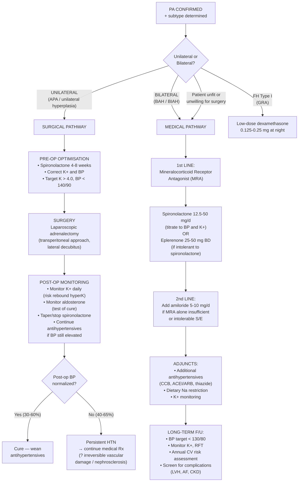

## Management of Primary Hyperaldosteronism

The overarching principle of PA management is straightforward: **the treatment depends entirely on whether disease is unilateral or bilateral**. This is why lateralization (Step 3/4 of the diagnostic workup) is so critical — it directly dictates your management pathway.

| Laterality | Subtype | Treatment |
|:-----------|:--------|:----------|
| ***Unilateral*** | APA, unilateral hyperplasia | ***Laparoscopic adrenalectomy*** [1][2][4][5] |
| ***Bilateral*** | BAH/BIAH, FH types | ***Medical therapy — MRA (spironolactone/eplerenone) ± amiloride*** [1][2][4] |
| FH Type I (GRA) | Bilateral, ACTH-dependent | **Low-dose dexamethasone** |
| Patient unfit/unwilling for surgery | Any unilateral subtype | Medical therapy as for bilateral disease |

---

## Management Algorithm

---

## A. Surgical Management — Unilateral Adrenalectomy

### Indications for Surgery [4][5]

***Adrenalectomy is indicated for:*** [5]
- ***Functional adenoma (Conn's syndrome)*** — confirmed unilateral APA or unilateral hyperplasia on AVS [5]
- ***Adrenal incidentaloma meeting resection criteria*** (functional, > 4 cm, or growing > 0.5 cm in 6 months) [5]
- ***Adrenal malignancy*** (adrenocortical carcinoma — extremely rare in PA) [5]

### Pre-Operative Preparation

This is a critical step that is frequently examined.

***Pre-op preparation for primary aldosteronism: correct electrolyte imbalance, e.g. K+*** [5]

| Pre-Op Goal | Method | Rationale |
|:------------|:-------|:----------|
| **Correct hypokalaemia** | ***4 weeks of pre-op spironolactone*** [4] + oral KCl supplementation | Hypokalaemia predisposes to intra-op arrhythmias; spironolactone blocks MR → stops ongoing K+ loss → allows K+ repletion. Also normalises whole-body K+ stores (intracellular K+ takes weeks to replete, not just plasma K+) |
| **Control BP** | Spironolactone (antihypertensive + K-correcting) ± additional agents (CCB, α-blocker) | Reduce surgical risk from uncontrolled hypertension; intra-op BP lability |
| **Normalise volume status** | Allow aldosterone-escape volume to redistribute | Reduces post-op hypotension risk |
| **Target** | K+ > 4.0 mmol/L, BP < 140/90 mmHg | Safe surgical range |

**Why specifically spironolactone for pre-op?**
- It simultaneously addresses BOTH problems: blocks MR → ↓Na+ reabsorption → ↓volume/BP AND ↓K+ secretion → corrects hypokalaemia
- It also begins to reverse the direct aldosterone-mediated cardiac and vascular damage
- ***Usually a few weeks of medical Tx beforehand to normalize whole-body electrolyte balance*** [1][2]

### Surgical Approach [5]

***Laparoscopic trans-peritoneal approach (lateral decubitus, ipsilateral side up): for mass < 6 cm*** [5]
- This is the standard approach for APA — most adenomas are small (< 2 cm)
- Patient positioned in lateral decubitus with the affected side up
- Advantages: smaller incisions, faster recovery, less post-op pain, shorter hospital stay
- **Open approach**: ***preferred if mass > 6 cm or malignant*** [5] (e.g., suspected adrenocortical carcinoma)

### Intra-Operative Considerations

***Complications — Intra-op:*** [5]
- ***Adrenal insufficiency (Conn's): IV hydrocortisone upon removal of adrenal gland*** [5]
  - **Why?** The contralateral zona glomerulosa has been chronically suppressed by the autonomous aldosterone from the adenoma (negative feedback via volume expansion → ↓renin → ↓Ang II → contralateral atrophy). Upon removal of the adenoma, there is a transient period of **relative hypoaldosteronism** until the contralateral gland recovers.
  - Note: glucocorticoid axis (zona fasciculata) is generally preserved in PA, so unlike Cushing's surgery, you do NOT typically need long-term cortisol replacement. However, IV hydrocortisone at physiological doses also has some mineralocorticoid activity and provides a safety net.
  
- ***Injury to surroundings:*** [5]
  - ***Right adrenalectomy: IVC, right lobe of liver*** [5] (the right adrenal sits between the IVC and right kidney, nestled against the liver)
  - ***Left adrenalectomy: pancreatic tail, spleen*** [5] (the left adrenal sits above the left kidney, near the tail of pancreas and spleen)

- ***Haemodynamic instability*** — less of a concern in PA than in phaeochromocytoma, but can occur with fluid shifts

### Post-Operative Care and Monitoring [1][2]

| Parameter | Monitoring | Rationale |
|:----------|:-----------|:----------|
| ***Serum K+*** | **Daily for several days** | ***Monitor K+ for rebound hyperK due to contralateral suppression*** [1] — the contralateral adrenal's zona glomerulosa is suppressed → transient hypoaldosteronism → ↓K+ excretion → hyperkalaemia risk. Usually self-limited (days to weeks). |
| ***Aldosterone*** | **Check post-op** | ***Monitor Ald for test of cure*** [1] — aldosterone should fall to normal or low levels if the correct adenoma was removed |
| **Renin** | Check post-op | Should begin to rise as the contralateral gland recovers and volume status normalizes |
| **BP** | Regular monitoring | ***HTN can remain in 40–65% due to ?irreversible damage to systemic microcirculation (especially hypertensive nephrosclerosis)*** [1][2] — continue antihypertensives and wean gradually over weeks to months |
| **MRA** | ***Taper and stop*** spironolactone | No longer needed once the source is removed; continuing it risks hyperkalaemia |
| ***Antihypertensives*** | ***Continue treatment of hypertension*** [1] | Do not stop abruptly; wean over months as BP normalizes (if it does) |

### Surgical Outcomes

| Outcome | Percentage | Explanation |
|:--------|:-----------|:-----------|
| **Biochemical cure** (normalization of K+ and Ald) | **95–99%** | Almost all patients achieve biochemical cure after removing the adenoma |
| **Complete BP cure** (off all antihypertensives) | **30–60%** | Only a minority achieve complete BP normalization |
| **Persistent HTN requiring medication** | ***40–65%*** [1][2] | Due to irreversible vascular remodelling, hypertensive nephrosclerosis, coexistent essential HTN, or prolonged duration of PA before surgery |

**Predictors of post-operative BP cure** (i.e., factors favouring complete resolution of HTN):
- Younger age at surgery
- Shorter duration of hypertension pre-operatively
- Fewer antihypertensive medications pre-operatively
- Female sex
- Absence of target organ damage (no LVH, no CKD)
- Higher pre-op responsiveness to spironolactone (if BP normalizes on spironolactone pre-op, it is more likely to normalize post-op)

<Callout title="Why Doesn't Surgery Cure Hypertension in Everyone?">
Because long-standing aldosterone excess causes irreversible changes: hypertensive nephrosclerosis (glomerulosclerosis, arteriolar hyalinosis → impaired pressure-natriuresis curve), vascular remodelling (medial hypertrophy, increased SVR), and myocardial fibrosis. Removing the adenoma stops ongoing damage but cannot reverse established structural injury. Additionally, some patients may have coexistent essential hypertension.
</Callout>

---

## B. Medical Management — For Bilateral Disease or Non-Surgical Candidates

### Indications for Medical Management

- ***Bilateral idiopathic adrenal hyperplasia (BIAH): medical treatment*** [4]
- ***Bilateral adrenalectomy would lead to adrenal crisis*** [4] — this is why you NEVER perform bilateral adrenalectomy for BAH (you would lose ALL adrenal function → Addisonian crisis)
- Unilateral disease in patients who are **unfit for surgery** (e.g., severe comorbidities, advanced age) or who **decline surgery**
- **FH Type I (GRA)** — treated with low-dose dexamethasone rather than MRA

### First-Line: Mineralocorticoid Receptor Antagonists (MRAs)

These are the cornerstone of medical therapy because they directly block the pathological endpoint — the mineralocorticoid receptor.

#### Spironolactone

***Aldosterone antagonist (1st line), e.g. spironolactone*** [1][2]

| Property | Detail |
|:---------|:-------|
| **Mechanism** | Non-selective MR antagonist; also has anti-androgenic activity (binds androgen receptor as antagonist) and weak progestogenic activity |
| **Dose** | Start 12.5–25 mg/day; titrate up to 100–400 mg/day as needed for BP and K+ control. Most patients well-controlled at 25–100 mg/day |
| **Advantages** | Highly effective; directly counteracts aldosterone-mediated cardiac and vascular damage (not just BP lowering); inexpensive; long track record |
| **Side effects** | ***Gynecomastia*** [1][2][4] (due to anti-androgen effect — blocks testosterone at the androgen receptor + increases peripheral conversion to oestradiol); breast tenderness, menstrual irregularities, erectile dysfunction, ↓libido. Dose-dependent: more common at > 50 mg/day. Also risk of **hyperkalaemia** (blocks K+ secretion) — monitor K+ especially if combined with ACEI/ARB or in CKD |
| **Contraindications** | Severe renal impairment (eGFR < 30 — high risk of hyperkalaemia); pregnancy (anti-androgen effect → feminization of male fetus); severe hyperkalaemia |

**Why does spironolactone cause gynecomastia?**
- Spironolactone's steroidal structure allows it to bind multiple steroid receptors. It blocks the androgen receptor → ↓testosterone effect on target tissues. It also inhibits 17α-hydroxylase → ↓testosterone synthesis. And it stimulates aromatase → ↑conversion of testosterone to oestradiol. The combined effect is relative oestrogen excess → breast tissue proliferation → gynecomastia.

#### Eplerenone

***Eplerenone (↑cost)*** [1][2]

| Property | Detail |
|:---------|:-------|
| **Mechanism** | **Selective** MR antagonist — does NOT bind androgen or progesterone receptors |
| **Dose** | 25 mg BD; can increase to 50 mg BD (shorter half-life than spironolactone → requires BD dosing) |
| **Advantages** | No gynecomastia or sexual side effects (because of selectivity); better tolerated in men |
| **Disadvantages** | ***More expensive*** [1][2]; less potent than spironolactone (may need higher doses or combination); shorter half-life requiring BD dosing |
| **Indication** | Preferred in patients who develop intolerable anti-androgenic side effects on spironolactone (especially gynecomastia in males) |
| **Contraindications** | Same as spironolactone: severe CKD, hyperkalaemia, pregnancy |

### Second-Line: ENaC Blockers (Potassium-Sparing Diuretics)

***K-sparing diuretics (2nd line), e.g. amiloride, triamterene*** [1][2]

| Drug | Mechanism | Key Points |
|:-----|:----------|:-----------|
| **Amiloride** | Directly blocks the **epithelial sodium channel (ENaC)** in the collecting duct → ↓Na+ reabsorption, ↓K+ secretion | Effective at correcting hypokalaemia and reducing BP; does NOT block MR directly; ***less preferred as it does not counteract the deleterious cardiovascular effects of aldosterone excess*** [1] |
| **Triamterene** | Same mechanism as amiloride | Less commonly used; similar profile |

**Why are ENaC blockers considered second-line?**
Because they block the downstream EFFECT of aldosterone (the channel) but NOT the receptor itself. Aldosterone's deleterious effects on the heart, vessels, and kidneys are mediated through MR activation in those tissues — ENaC blockers do nothing to prevent this extra-renal damage. MRAs (spironolactone/eplerenone) block the MR everywhere → cardiovascular protection on top of electrolyte/BP correction [1].

<Callout title="MRA vs ENaC Blocker: Why MRA Is First-Line" type="idea">
Spironolactone/eplerenone block the mineralocorticoid receptor in the kidney (correcting K+ and BP) AND in the heart, vessels, and kidneys (preventing fibrosis and remodelling). Amiloride only blocks ENaC in the kidney — it fixes the electrolytes but does NOT protect the cardiovascular system from direct aldosterone-mediated damage. This is why MRA is always first-line.
</Callout>

### Adjunctive Antihypertensives

Many patients on MRA alone will not achieve BP targets. Additional agents can be added:

| Drug Class | Role in PA | Notes |
|:-----------|:-----------|:------|
| **CCBs** (amlodipine, nifedipine) | Effective add-on; no interaction with RAAS | Well tolerated; good choice |
| **ACEI / ARB** | Useful if residual RAAS activation or proteinuria | Additive effect with MRA; monitor K+ closely (both ↑K+) |
| **Thiazide diuretics** | Volume reduction | Use with caution — may worsen hypokalaemia if MRA not yet optimized |
| **α-blockers** (doxazosin) | Useful add-on | Minimal metabolic effects |
| **β-blockers** | If compelling indication (e.g., AF, post-MI) | Not first-choice for PA; ↓renin may mask biochemical monitoring |

### BP Target

- **< 130/80 mmHg** (per 2024 Endocrine Society and ESC/ESH guidelines) — PA patients are at very high cardiovascular risk
- Lifestyle modifications: dietary Na restriction (< 2g/day), weight management, exercise, alcohol moderation [3]

### Medical Monitoring (Long-Term)

| Parameter | Frequency | Target |
|:----------|:----------|:-------|
| **Serum K+** | Q1–3 months initially, then Q6–12 months once stable | 4.0–5.0 mmol/L |
| **RFT (creatinine, eGFR)** | Q3–6 months | Stable or improving |
| **BP** | Every visit | < 130/80 mmHg |
| **ECG / Echo** | Annually or as indicated | Screen for LVH regression, AF |
| **UACR** | Annually | Screen for proteinuria |

---

## C. Management of FH Type I (Glucocorticoid-Remediable Aldosteronism)

| Aspect | Detail |
|:-------|:-------|
| **Principle** | Aldosterone production is ACTH-dependent (chimeric gene) → suppress ACTH with low-dose glucocorticoid → aldosterone falls |
| **Drug** | ***Dexamethasone 0.125–0.25 mg at bedtime*** (given at night to suppress the early-morning ACTH surge) or hydrocortisone |
| **Dose** | Use the LOWEST effective dose — avoid iatrogenic Cushing's syndrome |
| **Monitoring** | Plasma renin activity (should normalize), aldosterone, BP, K+ |
| **Alternative/Add-on** | MRA (spironolactone/eplerenone) if dexamethasone alone insufficient or if glucocorticoid side effects |
| **Screening family** | All first-degree relatives should be screened (autosomal dominant) |
| **Complication awareness** | FH Type I carries high risk of intracranial aneurysms and haemorrhagic stroke — consider screening with MRA/CTA of cerebral vessels |

---

## D. Special Scenarios

### Adrenal Carcinoma with PA

- Extremely rare (< 1% of PA)
- Suspect if: adrenal mass > 4 cm, irregular margins, high attenuation on CT (> 10 HU), heterogeneous enhancement, rapid growth
- Management: ***Open adrenalectomy*** (not laparoscopic — need complete excision with wide margins ± lymph node dissection) [5]
- Often co-secretes cortisol and androgens → mixed biochemical picture
- May require adjuvant mitotane ± chemotherapy

### Pregnancy with PA

- Spironolactone is **contraindicated** in pregnancy (Category D — anti-androgen effect risks feminization of male fetus)
- Eplerenone: limited data; generally avoided
- **Preferred agents**: α-methyldopa, labetalol, nifedipine for BP control; amiloride may be considered (Category B)
- Definitive management (surgery) usually deferred to post-partum unless severe

### PA in the Context of Resistant Hypertension [3]

Per cardiology guidelines, PA should be specifically sought in resistant hypertension. If confirmed:
- Adding spironolactone 25–50 mg/day to existing triple therapy (ACEI/ARB + CCB + thiazide) is the most effective "fourth drug" for resistant HTN
- The PATHWAY-2 trial (2015) demonstrated that spironolactone was superior to bisoprolol, doxazosin, and placebo as add-on therapy for resistant hypertension — this is partly because a significant proportion of "resistant HTN" patients have undiagnosed PA

---

## E. Summary: Medical vs Surgical Management

| Feature | ***Surgical (Adrenalectomy)*** | ***Medical (MRA)*** |
|:--------|:--|:--|
| **Indication** | ***Unilateral APA or unilateral hyperplasia*** [1][2][4][5] | ***Bilateral BAH / BIAH; FH; patient unfit for surgery*** [1][2][4] |
| **Pre-treatment** | ***Spironolactone 4–8 weeks to correct K+ and BP*** [4] | Start spironolactone 12.5–25 mg/d and titrate |
| **Approach** | ***Laparoscopic (< 6 cm); open (> 6 cm or malignant)*** [5] | Lifelong medication |
| **Biochemical cure** | 95–99% | Controlled (not cured) |
| **BP cure** | 30–60% | Controlled in most with adequate dosing |
| **Persistent HTN** | ***40–65%*** [1][2] | Depends on adherence and dose titration |
| **Key complication** | Rebound hyperK; persistent HTN; surgical injury [5] | Gynecomastia (spironolactone); hyperkalaemia |
| **F/U** | Monitor K+, Ald, BP post-op; wean drugs [1] | Lifelong K+, RFT, BP monitoring |

---

<Callout title="High Yield Summary">

**Management of PA depends on laterality:**

**Unilateral (APA)** → ***Laparoscopic adrenalectomy*** after ***4 weeks of pre-op spironolactone to correct K+*** [4]. Post-op: monitor for rebound hyperK (contralateral suppression) and persistent HTN (40–65%). Biochemical cure ~99%, BP cure only 30–60%.

**Bilateral (BAH)** → ***Medical therapy: spironolactone (1st line MRA, S/E gynecomastia) or eplerenone (selective, costly); amiloride 2nd line (blocks ENaC but does NOT prevent direct aldosterone cardiovascular damage)*** [1][2][4]. ***Never bilateral adrenalectomy → adrenal crisis*** [4].

**FH Type I (GRA)** → Low-dose dexamethasone at night (suppresses ACTH → suppresses aldosterone).

**Key surgical complications**: intra-op adrenal insufficiency (IV hydrocortisone), injury to IVC/liver (right) or pancreatic tail/spleen (left), post-op rebound hyperkalaemia [5].

**Why MRA > ENaC blocker**: MRA blocks MR everywhere (kidney + heart + vessels) → cardiovascular protection. ENaC blocker only acts in the kidney → electrolyte correction only, no CV protection [1].

</Callout>

---

<ActiveRecallQuiz
  title="Active Recall - Management of Primary Hyperaldosteronism"
  items={[
    {
      question: "Why is pre-operative spironolactone given for 4 weeks before adrenalectomy for APA, rather than just correcting K+ with IV supplementation?",
      markscheme: "Spironolactone blocks MR, stopping ongoing renal K+ loss and allowing replenishment of TOTAL body K+ stores (including intracellular). IV KCl only replaces plasma K+ transiently while renal losses continue. Spironolactone also controls BP pre-operatively, begins reversing cardiac and vascular aldosterone-mediated damage, and normalizes volume status."
    },
    {
      question: "Why does rebound hyperkalaemia occur after unilateral adrenalectomy for APA, and how long does it typically last?",
      markscheme: "The contralateral adrenal zona glomerulosa has been chronically suppressed by the autonomous aldosterone (via volume expansion suppressing renin and Ang II). After adenoma removal, the contralateral gland cannot immediately produce adequate aldosterone, causing transient hypoaldosteronism with reduced K+ excretion leading to hyperkalaemia. Typically self-limited over days to weeks as the contralateral gland recovers."
    },
    {
      question: "Why is bilateral adrenalectomy contraindicated for bilateral adrenal hyperplasia, and what is the alternative?",
      markscheme: "Bilateral adrenalectomy removes ALL adrenal cortical tissue, leading to complete adrenal insufficiency (loss of cortisol AND aldosterone) requiring lifelong replacement and risk of adrenal crisis. The alternative is medical therapy with MRA (spironolactone or eplerenone) which effectively blocks aldosterone action while preserving adrenal function."
    },
    {
      question: "Why is spironolactone preferred over amiloride as first-line medical therapy for PA? What is the key limitation of amiloride?",
      markscheme: "Spironolactone blocks the mineralocorticoid receptor in the kidney (correcting electrolytes and BP) AND in the heart, vessels, and kidneys (preventing direct aldosterone-mediated fibrosis, LVH, and vascular remodelling). Amiloride only blocks ENaC in the kidney collecting duct, so it corrects K+ and BP but does NOT counteract the deleterious cardiovascular effects of aldosterone excess at the tissue level."
    },
    {
      question: "A male patient on spironolactone 100 mg daily for BAH develops painful bilateral gynecomastia. What do you do?",
      markscheme: "Switch to eplerenone (selective MR antagonist that does NOT bind the androgen receptor, so no anti-androgenic side effects like gynecomastia). Start eplerenone 25-50 mg BD. May also add amiloride if additional K-sparing/BP effect needed. Reduce or stop spironolactone."
    },
    {
      question: "Why does only 30-60% of patients achieve complete BP cure after successful adrenalectomy for APA?",
      markscheme: "Long-standing aldosterone excess causes irreversible structural damage: hypertensive nephrosclerosis (impaired pressure-natriuresis), vascular medial hypertrophy (increased SVR), and myocardial fibrosis. Additionally, some patients have coexistent essential hypertension independent of PA. Predictors of cure include younger age, shorter HTN duration, fewer pre-op medications, and female sex."
    }
  ]}
/>

## References

[1] Senior notes: Ryan Ho Endocrine.pdf, Section 3.2.1 (Primary Hyperaldosteronism, pp. 57–59)
[2] Senior notes: Ryan Ho Fundamentals.pdf, Section 3.8.3A (Primary Hyperaldosteronism, pp. 433–434)
[3] Senior notes: Ryan Ho Cardiology.pdf, Sections 3.6 (Hypertension management, pp. 177–182)
[4] Senior notes: maxim.md, Section on Conn's syndrome management
[5] Senior notes: maxim.md, Section on Adrenalectomy (indications, approach, complications)
[7] Senior notes: Ryan Ho Diagnostic Radiology.pdf, Section 7.1 (Adrenal venous sampling, p. 79)
[8] Senior notes: Ryan Ho Urogenital.pdf, Section on metabolic alkalosis and hypernatraemia management (pp. 21, 51)
