## Differential Diagnosis of Prostate Cancer

### Framing the Problem: What Are We Actually Differentiating?

Before diving into the list, let's think about this from first principles. A patient doesn't walk into clinic saying "I have prostate cancer." They present with one (or more) of the following **clinical scenarios**, and our job is to figure out whether prostate cancer is the cause:

1. **An elevated PSA** (incidental or screening)
2. **An abnormal DRE finding** (hard nodule, asymmetry, loss of midline sulcus)
3. **Lower urinary tract symptoms (LUTS)** — voiding and/or storage symptoms
4. **Haematuria or haemospermia**
5. **Bone pain or pathological fractures** (metastatic presentation)
6. **Obstructive uropathy / renal failure**

Each scenario has a different differential diagnosis. The art is knowing which diagnoses to consider for each presentation and how to distinguish them. Let's work through this systematically.

---

### Overview: The Major Differentials at a Glance

```mermaid
graph TD
    A["Clinical Presentations Mimicking or Overlapping with Prostate Cancer"] --> B["Elevated PSA"]
    A --> C["Abnormal DRE"]
    A --> D["LUTS"]
    A --> E["Haematuria / Haemospermia"]
    A --> F["Bone Pain / Pathological Fracture"]
    
    B --> B1["BPH"]
    B --> B2["Prostatitis / UTI"]
    B --> B3["AROU"]
    B --> B4["Recent ejaculation / cycling / DRE"]
    B --> B5["Prostate cancer"]
    
    C --> C1["BPH"]
    C --> C2["Prostate cancer"]
    C --> C3["Prostatitis / Prostatic abscess"]
    C --> C4["Prostatic calculi"]
    C --> C5["Granulomatous prostatitis"]
    
    D --> D1["BPH"]
    D --> D2["Prostate cancer"]
    D --> D3["Overactive bladder"]
    D --> D4["UTI / Prostatitis"]
    D --> D5["Urethral stricture"]
    D --> D6["Bladder neck contracture"]
    D --> D7["Neurogenic bladder"]
    D --> D8["Bladder cancer"]
    
    E --> E1["BPH"]
    E --> E2["Bladder cancer"]
    E --> E3["Prostate cancer"]
    E --> E4["UTI"]
    E --> E5["Urolithiasis"]
    
    F --> F1["Prostate cancer mets"]
    F --> F2["Lung / Breast / Renal cancer mets"]
    F --> F3["Multiple myeloma"]
    F --> F4["Lymphoma"]
    F --> F5["Primary bone tumour"]
```

---

### Differential Diagnosis by Clinical Scenario

#### Scenario 1: Elevated PSA

PSA is **organ-specific but NOT tumour-specific** [1][2]. This means anything that affects the prostate — benign or malignant — can raise PSA. The differential for an elevated PSA is essentially: "What is happening to the prostate?"

| Condition | Why PSA is Elevated | Distinguishing Features |
|---|---|---|
| **Prostate cancer** | Malignant epithelial cells produce PSA; disrupted glandular architecture allows more PSA to leak into the bloodstream | Often asymptomatic; abnormal DRE (hard, irregular nodule); PSA typically > 10 ng/mL carries ~50% cancer risk [1]; low free/total PSA ratio; PHI > 35 [2] |
| ***BPH*** | Increased prostatic tissue mass → more PSA production proportional to gland volume | Smooth, symmetrically enlarged, firm prostate on DRE with ***intact median groove*** [6]; predominantly voiding LUTS; PSA density < 0.15 (PSA appropriate for gland size) |
| ***UTI / Acute prostatitis*** | Inflammation and infection cause release of intracellular PSA into the bloodstream through disrupted epithelial barriers | Fever, dysuria, frequency, perineal pain; ***irritative symptoms with dysuria, associated with pyuria and significant bacteriuria on urine culture*** [6]; tender, boggy prostate on DRE (do NOT massage vigorously — risk of bacteraemia) |
| ***Acute urinary retention (AROU)*** | Bladder overdistension causes back-pressure on the prostate; prostatic congestion releases PSA | History of sudden inability to void; palpable distended bladder; ***Do NOT take PSA during AROU → can cause false elevation (defer PSA 4–6 weeks)*** [7] |
| **Recent ejaculation ( < 48h)** | Ejaculation causes prostatic secretion release and transient PSA leak | Ask about recent sexual activity before interpreting PSA [2] |
| **Vigorous cycling** | Perineal pressure on the prostate causes microtrauma and PSA release | History of cycling before blood draw [2] |
| **DRE / Prostate biopsy / TURP** | Physical manipulation disrupts prostatic tissue, releasing PSA | Iatrogenic — history of recent procedure [2] |
| **5α-reductase inhibitors** | These ***decrease*** PSA (roughly halve it) — must double the measured value for accurate interpretation | Drug history (finasteride, dutasteride) [2] |

<Callout title="Critical Clinical Point" type="error">
A common exam mistake is to see a PSA of 6 ng/mL and immediately jump to "prostate cancer." Remember: ***PSA 4–10 ng/mL is the "grey zone"*** — only about 20–25% of men in this range actually have cancer [1]. You must consider BPH, prostatitis, AROU, and other causes. Use **PHI**, **free/total PSA ratio**, **MRI**, and **clinical context** to decide whether to biopsy. Conversely, ~15% of men with PSA < 4 ng/mL DO have prostate cancer — PSA alone cannot rule it out.
</Callout>

---

#### Scenario 2: Abnormal DRE (Palpable Prostate Abnormality)

DRE is performed to assess prostate **size, symmetry, consistency, surface, tenderness, and median groove** [4][6]. An abnormality on DRE narrows the differential:

| Finding | Condition | Explanation |
|---|---|---|
| ***Hard, irregular nodule; asymmetric induration; loss of midline sulcus; fixed to pelvic wall*** | **Prostate cancer** | Cancer creates a hard, irregular mass due to desmoplastic reaction and dense cellular proliferation in the peripheral zone [2][4] |
| ***Smooth, symmetrically enlarged ( > 3 finger breadths), firm, intact median groove, no nodules*** | **BPH** | Benign hyperplasia of the transitional zone produces diffuse, symmetric enlargement with preserved architecture [6] |
| **Tender, boggy, warm prostate** | **Acute prostatitis** | Inflammation and oedema make the gland soft/boggy and exquisitely tender; be gentle — vigorous examination risks bacteraemia |
| **Firm, irregular, non-tender** | **Granulomatous prostatitis** | Can mimic cancer on DRE; caused by BCG therapy (intravesical), TB, sarcoidosis, or post-TURP granulomas; PSA may be elevated |
| **Hard, gritty feel** | **Prostatic calculi** | Calcified corpora amylacea within the gland; usually incidental and asymptomatic; detected on imaging |
| ***Asymmetrically enlarged irregular prostate with loss of median sulcus → consistent with CA prostate; symmetrical enlargement and firmness → consistent with BPH*** | Comparison | This distinction is the classic DRE teaching point [1] |

> **High Yield**: An **abnormal DRE is an indication for prostate biopsy regardless of PSA level** [2]. Approximately 25% of men with prostate cancer detected by abnormal DRE have PSA < 4 ng/mL.

---

#### Scenario 3: Lower Urinary Tract Symptoms (LUTS)

***Bladder outlet obstruction typically presents with predominantly voiding symptoms; overactive bladder typically presents with predominantly storage symptoms*** [1].

This is the most common clinical scenario — an older man presenting with LUTS. The differential is broad:

| Condition | Type of LUTS | Key Distinguishing Features | Pathophysiology |
|---|---|---|---|
| ***BPH*** | Predominantly **voiding** (hesitancy, weak stream, intermittency, incomplete emptying) | Most common cause; smooth enlarged prostate on DRE; IPSS symptom score; uroflowmetry Qmax < 15 mL/s [6] | Transitional zone hyperplasia → mechanical compression of prostatic urethra + dynamic smooth muscle tone (α1-mediated) |
| **Prostate cancer** | ***Obstructive LUTS are late findings*** [2] | Often asymptomatic; hard irregular nodule on DRE; elevated PSA; cancer arises in peripheral zone so LUTS occur only when tumour is large | Large peripheral zone cancer compresses the urethra; or cancer invades bladder neck/trigone |
| ***Urethral stricture*** | Voiding symptoms; very weak/spraying stream | ***History of prior instrumentation, trauma, or STDs*** [6]; younger men more common; retrograde urethrogram for diagnosis | Fibrotic narrowing of the urethra reduces luminal diameter |
| ***Bladder neck contracture*** | Voiding symptoms | ***Usually from prior urological surgery or RT for CA prostate*** [6]; history of TURP, radical prostatectomy, or pelvic radiation | Post-surgical/post-radiation scarring at the bladder neck |
| ***UTI / Acute prostatitis*** | ***Usually irritative symptoms with dysuria*** [6] | Fever; pyuria; positive urine culture; tender prostate on DRE in prostatitis | Infection causes mucosal inflammation → detrusor irritation → storage symptoms |
| **Overactive bladder (OAB)** | Predominantly **storage** (frequency, urgency, urge incontinence) | ***Exclude infection/stone/tumour first*** [2]; frequency-volume chart shows frequent voiding of small volumes; ***normal prostate on DRE; good flow rate on uroflowmetry*** [2]; diagnosis of exclusion | Detrusor overactivity — involuntary detrusor contractions during bladder filling |
| **Bladder cancer** | ***Irritative symptoms (in situ) → obstructive symptoms (tumour obstructing ureteric orifice/bladder neck)*** [8] | ***Painless gross haematuria*** is the hallmark [8]; risk factors: smoking, occupational chemical exposure; diagnosed by cystoscopy ± biopsy | Tumour mass within the bladder irritates detrusor (CIS) or mechanically obstructs outflow |
| ***Neurogenic bladder*** | Variable (detrusor overactivity → storage; detrusor underactivity → voiding) | ***Underlying neurological conditions, e.g., multiple sclerosis, spinal cord injury*** [6]; abnormal neurological examination; urodynamics diagnostic | Disruption of neural pathways controlling the detrusor-sphincter coordination |
| **Chronic constipation** | Voiding symptoms (extrinsic compression) | History of constipation; faecal loading on abdominal examination/X-ray | Loaded rectum physically compresses the prostatic urethra |
| ***Drugs*** | Variable | ***Drug history: codeine, beta-blockers, anticholinergics, TCAs*** [6] causing urinary retention; or diuretics causing frequency | Pharmacological effects on detrusor or sphincter function |

<Callout title="The LUTS DDx Approach" type="idea">
When an older man presents with LUTS, think systematically: **(1) Is this obstructive/voiding?** → BPH, stricture, cancer, bladder neck contracture, drugs, constipation. **(2) Is this storage/irritative?** → OAB, UTI, bladder cancer, neurogenic. **(3) Is there an overlap?** → Many conditions cause mixed symptoms; secondary detrusor changes from chronic obstruction can cause storage symptoms on top of voiding symptoms. Always check DRE + PSA + urinalysis as a minimum in any man with LUTS.
</Callout>

---

#### Scenario 4: Haematuria (± Haemospermia)

***Painless gross haematuria in age > 35 = malignancy until proven otherwise*** [9].

The differential depends on whether the haematuria is glomerular or non-glomerular, and where in the urinary tract it originates:

| Condition | Features | Distinguishing Clues |
|---|---|---|
| **Bladder cancer** | ***Painless gross haematuria throughout the stream*** [8]; irritative LUTS; constitutional symptoms | Most important diagnosis to exclude; risk factors: smoking, chemical exposure; flexible cystoscopy is gold standard [8] |
| **Prostate cancer** | ***Haematuria / haemospermia ( < 1%) — uncommon, can also be due to BPH*** [4] | Usually with elevated PSA and abnormal DRE; terminal haematuria (from prostatic urethra) |
| **BPH** | ***Haematuria can occur from BPH*** [4] — diagnosis by exclusion after malignancy excluded | Smooth enlarged prostate; diagnosis of exclusion [9] |
| **UTI / Prostatitis** | Dysuria, frequency, fever; positive urine culture | Pyuria, bacteriuria on urinalysis |
| **Urolithiasis** | ***Unilateral flank colic radiating to groin*** [9]; often with microscopic haematuria | CT KUB diagnostic; irritative symptoms if bladder stone |
| **Renal cell carcinoma** | ***Classic triad: flank pain, painless haematuria, palpable flank mass (rare)*** [9] | Constitutional symptoms; paraneoplastic syndromes (polycythaemia, hypercalcaemia) |
| **Upper tract urothelial carcinoma** | Similar to bladder cancer but originating in renal pelvis/ureter | CT urogram with delayed phase shows filling defect |

For **haemospermia** specifically: most cases are **benign and self-limiting** (idiopathic, post-ejaculatory trauma, seminal vesiculitis). However, ***new-onset haemospermia in a man > 40*** warrants investigation for prostate cancer, seminal vesicle pathology, or infection.

---

#### Scenario 5: Bone Pain / Pathological Fracture (Metastatic Presentation)

When a patient presents with back pain, bone pain, or a pathological fracture, the differential for the underlying malignancy includes:

| Condition | Type of Bone Lesion | Key Features |
|---|---|---|
| **Prostate cancer** | ***Osteoblastic (sclerotic)*** | Elderly male; elevated PSA; axial skeleton predominance (Batson's plexus); often multifocal |
| **Breast cancer** | Mixed (osteoblastic + osteolytic) | Female; known breast cancer history; can also be osteoblastic |
| **Lung cancer** | Osteolytic | Smoking history; CXR/CT chest abnormality; weight loss |
| **Renal cell carcinoma** | Osteolytic (highly vascular) | Haematuria; flank mass; hypervascular mets on imaging |
| **Multiple myeloma** | ***Osteolytic (punched-out lesions); NO blastic response*** | Bone pain, anaemia, renal failure, hypercalcaemia (CRAB) [10]; protein electrophoresis shows M-spike |
| **Lymphoma** | Variable | Lymphadenopathy; B symptoms; variable imaging appearance |
| **Thyroid cancer (follicular)** | Osteolytic | Thyroid mass; thyroglobulin elevated |

<Callout title="Osteoblastic vs Osteolytic — A Quick Rule">
The classic **osteoblastic** bone metastases: **Prostate** and **Breast** (can be either). Remember "**P**rostate = **P**roductive (blastic)" and "**L**ung, **K**idney, **T**hyroid, **M**yeloma = **L**ytic (destructive)." Prostate cancer bone metastases are osteoblastic because cancer cells secrete endothelin-1 and BMPs that stimulate osteoblasts.
</Callout>

---

#### Scenario 6: Obstructive Uropathy / Renal Failure

***Prostate cancer can cause obstructive uropathy and renal failure due to ureteric/trigone invasion*** [4]. The differential for **post-renal AKI** in a male includes [11]:

| Condition | Mechanism |
|---|---|
| ***BPH*** | Bladder outlet obstruction → chronic retention → bilateral hydronephrosis |
| ***CA prostate*** | Local invasion of trigone/ureteric orifices, or bulky pelvic lymphadenopathy compressing ureters [11] |
| **Bladder neck tumour / CA bladder** | Tumour obstructing ureteric orifices or bladder outlet [11] |
| **Urinary stones** | Bilateral ureteric obstruction (or unilateral in a single kidney) |
| **Retroperitoneal fibrosis** | Rare; idiopathic or drug-related (methysergide, ergotamine); encases ureters |
| **Neurogenic bladder** | Detrusor failure → chronic retention → bilateral hydronephrosis |

---

### Differential Diagnosis Table: Summary Comparison of BPH vs Prostate Cancer vs Prostatitis

This is one of the most commonly tested comparisons:

| Feature | BPH | Prostate Cancer | Acute Prostatitis |
|---|---|---|---|
| **Age** | > 50 (50% have LUTS at 50) | > 50 (rare < 40) | Any age (often younger) |
| **Zone** | Transitional (periurethral) | Peripheral | Peripheral / diffuse |
| **Symptoms** | Early voiding LUTS | Late LUTS / asymptomatic / metastatic | Irritative LUTS + dysuria + systemic symptoms |
| **DRE** | ***Smooth, symmetric, firm, intact median groove*** [6] | ***Hard, irregular, asymmetric, nodule, loss of median sulcus, fixed*** [2] | Tender, boggy, warm, swollen |
| **PSA** | Mildly elevated (proportional to gland size); PSA density < 0.15 | Disproportionately elevated; low free/total ratio | Elevated (inflammation-driven); do NOT biopsy acutely |
| **Relationship** | ***Does NOT predispose to prostate cancer*** [1] | Independent disease | Can coexist; must exclude cancer after infection treated |
| **Biopsy** | Not needed (clinical + uroflowmetry diagnosis) | Needed for definitive diagnosis | Contraindicated acutely (risk of sepsis); consider after treatment |

<Callout title="BPH Does NOT Cause Prostate Cancer" type="error">
A very common student misconception. ***BPH does NOT predispose to prostate cancer*** [1]. They arise in **different zones** (transitional vs peripheral) and have **different pathogeneses** (stromal-epithelial growth factor-mediated hyperplasia vs malignant transformation from somatic mutations). They can and often do **coexist** in the same patient (both are common in elderly men), but one does not lead to the other. An elevated PSA in BPH is due to the increased mass of benign tissue, not malignant transformation.
</Callout>

---

### The Diagnostic Thought Process: A Worked Example

Imagine: **72-year-old man, PSA = 7.5 ng/mL, normal DRE, no LUTS.**

How do you think through the differential?

1. **PSA is in the grey zone (4–10 ng/mL)** → only ~20–25% chance of cancer [1]
2. **Normal DRE** → rules out palpable peripheral zone cancer (but does NOT exclude cancer)
3. The elevated PSA could be from: **BPH** (most likely given age), **subclinical prostatitis**, **recent activity** (ejaculation, cycling), or **early prostate cancer**
4. Next steps: **repeat PSA in a few weeks** [4]; check **PHI** (***if PSA 4–10 + normal DRE → PHI; if PHI > 35 → prostate biopsy*** [2]); consider **mpMRI prostate** (PI-RADS scoring); ask about confounders (ejaculation, cycling, UTI)
5. ***The challenge of CA prostate is not to diagnose a case but to correctly risk-stratify them*** [4] — distinguishing those needing treatment from those who can be safely observed

---

<Callout title="High Yield Summary — Differential Diagnosis of Prostate Cancer">

**By presentation:**
- **Elevated PSA**: BPH (most common cause), prostatitis/UTI, AROU, recent ejaculation/cycling, prostate cancer. PSA is organ-specific but NOT tumour-specific.
- **Abnormal DRE**: BPH (smooth, symmetric, firm) vs prostate cancer (hard, irregular, nodule, loss of sulcus) vs prostatitis (tender, boggy) vs granulomatous prostatitis (mimics cancer).
- **LUTS**: BPH (#1 cause in elderly men), OAB, UTI/prostatitis, urethral stricture, bladder neck contracture, neurogenic bladder, bladder cancer, drugs, constipation. Prostate cancer causes LUTS late.
- **Haematuria**: Bladder cancer (#1 to exclude), RCC, BPH, UTI, stones. Painless gross haematuria > 35yo = malignancy until proven otherwise.
- **Bone pain**: Prostate cancer (osteoblastic), lung/breast/renal cancer (usually osteolytic), myeloma (punched-out lytic), lymphoma.
- **Obstructive uropathy**: BPH, prostate cancer (trigone/ureteric invasion), bladder cancer, stones, retroperitoneal fibrosis.

**Key distinction: BPH vs Prostate Cancer** — different zones (transitional vs peripheral), different DRE findings, different PSA profiles. BPH does NOT predispose to cancer. They commonly coexist.
</Callout>

---

<ActiveRecallQuiz
  title="Active Recall - Differential Diagnosis of Prostate Cancer"
  items={[
    {
      question: "A 68-year-old man has a PSA of 8 ng/mL and a normal DRE. What is the most likely cause of his elevated PSA, and what is the next best step?",
      markscheme: "Most likely cause is BPH (most common cause of mildly elevated PSA in this age group). PSA 4-10 is the grey zone with only 20-25% cancer risk. Next steps: repeat PSA in a few weeks to confirm; if confirmed, check Prostate Health Index (PHI) — if PHI > 35, proceed to prostate biopsy. Consider mpMRI prostate. Rule out confounders (UTI, recent ejaculation, cycling, AROU)."
    },
    {
      question: "Compare the DRE findings in BPH versus prostate cancer. Why are they different?",
      markscheme: "BPH: smooth, symmetrically enlarged, firm, intact median groove, no nodules — because benign hyperplasia of the transitional zone produces diffuse, uniform enlargement. Prostate cancer: hard, irregular nodule, asymmetric induration, loss of midline sulcus, may be fixed to pelvic wall — because malignant tissue creates a dense, desmoplastic mass in the peripheral zone that distorts normal architecture."
    },
    {
      question: "List 5 differential diagnoses for LUTS in an elderly man and state one distinguishing feature for each.",
      markscheme: "(1) BPH — smooth enlarged prostate on DRE, intact median groove. (2) Prostate cancer — hard irregular nodule, elevated PSA. (3) Urethral stricture — history of prior instrumentation/trauma/STD. (4) UTI/prostatitis — fever, dysuria, pyuria, positive culture. (5) Overactive bladder — storage symptoms, normal DRE, good uroflowmetry, diagnosis of exclusion. (6) Neurogenic bladder — underlying neurological condition. (7) Bladder cancer — painless haematuria, irritative symptoms. (8) Drugs — anticholinergics, opioids, beta-blockers. Any 5 with distinguishing features acceptable."
    },
    {
      question: "Why does BPH NOT predispose to prostate cancer despite both being common in elderly men?",
      markscheme: "They arise in different anatomical zones (BPH in transitional zone; cancer in peripheral zone), have different pathogeneses (BPH is stromal-epithelial hyperplasia mediated by growth factors with increased proliferation and decreased apoptosis; cancer is malignant transformation from accumulated somatic mutations), and are molecularly distinct diseases. They commonly coexist because both are age-related, but one does not transform into the other."
    },
    {
      question: "A patient with known prostate cancer presents with back pain. What type of bone metastasis would you expect, and why? Name two other cancers that can cause similar bone lesions.",
      markscheme: "Osteoblastic (sclerotic) bone metastases. Prostate cancer cells secrete endothelin-1, BMPs, and Wnt ligands that stimulate osteoblast activity, producing new (but disorganised) bone. PSA may also cleave PTHrP, reducing osteoclast activation. Other cancers that can cause osteoblastic metastases: breast cancer (can be mixed blastic/lytic) and carcinoid tumours. Note: most other solid tumours (lung, kidney, thyroid, myeloma) cause osteolytic metastases."
    }
  ]}
/>

## References

[1] Senior notes: felixlai.md (Prostate cancer section; BPH section)
[2] Senior notes: maxim.md (Section 2.5 Urological neoplasm — Prostate cancer; Overactive bladder; Bladder cancer)
[4] Senior notes: Ryan Ho Urogenital.pdf (p180–182 — Section 8.4.2 Carcinoma of the Prostate: clinical features, evaluation, biopsy)
[6] Senior notes: Ryan Ho Urogenital.pdf (p173 — BPH diagnosis and differential diagnosis)
[7] Senior notes: Ryan Ho Fundamentals.pdf (p352 — Urinary retention workup: do NOT take PSA in AROU)
[8] Senior notes: maxim.md (Bladder cancer — clinical features, investigations)
[9] Senior notes: Ryan Ho Fundamentals.pdf (p340, p342 — Haematuria differential diagnosis and clinical approach)
[10] Senior notes: Ryan Ho Chemical Path.pdf (p23 — Hypercalcaemia in malignancy, multiple myeloma CRAB)
[11] Senior notes: Ryan Ho Critical Care.pdf (p25 — Post-renal AKI causes including BPH, CA prostate, bladder neck tumour)
