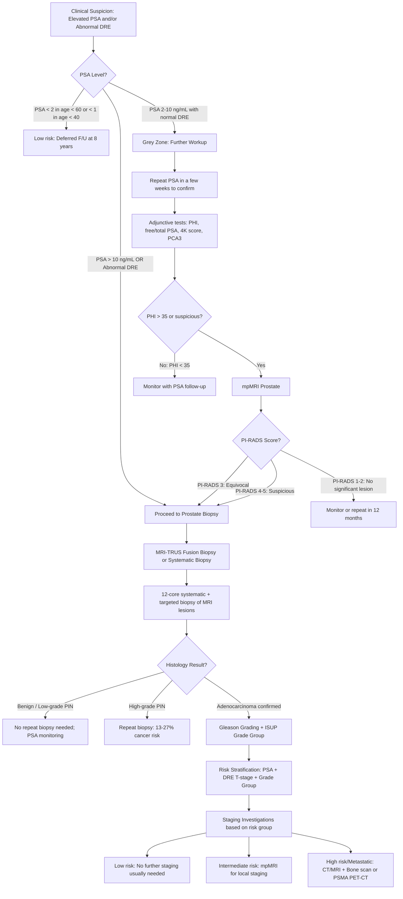

## Diagnosis of Prostate Cancer: Criteria, Algorithm & Investigations

### The Central Diagnostic Philosophy

Before we get into the nuts and bolts, understand the fundamental principle that governs prostate cancer diagnosis. Unlike most cancers where you find it and treat it, prostate cancer has a unique diagnostic challenge:

***The challenge of CA prostate is not to diagnose a case but to correctly risk-stratify them such that those requiring treatment can be offered timely treatment and those who do not can have their treatment deferred to decrease complications*** [4].

This is because prostate cancer spans a vast biological spectrum — from indolent, clinically insignificant tumours (which many men will die *with*, not *of*) to highly aggressive, lethal disease. The entire diagnostic pathway is designed to answer two questions: **(1) Is there cancer?** and **(2) If so, how dangerous is it?**

---

### Diagnostic Criteria

There is no single "diagnostic criterion" for prostate cancer the way there is for, say, diabetes (fasting glucose ≥ 7.0). Instead, diagnosis follows a **stepwise pathway** from clinical suspicion to tissue confirmation:

#### Step 1: Clinical Suspicion — What Triggers Investigation?

Clinical suspicion arises from:
- ***Elevated PSA*** (the most common trigger in the modern era)
- ***Abnormal DRE*** (hard, irregular nodule; loss of midline sulcus; asymmetric induration) [2][4]
- Symptoms suggestive of locally advanced or metastatic disease (bone pain, haematuria, obstructive uropathy)
- Incidental finding on TURP specimen or imaging

#### Step 2: Confirmatory Workup Before Biopsy

Not every elevated PSA leads to a biopsy. The workup depends on the PSA level and DRE findings:

- ***PSA < 1 ng/mL at age 40 or < 2 ng/mL at age 60 → deferred follow-up at 8 years*** [4]
- ***PSA 2–10 ng/mL (equivocal/"grey zone") → further workup before biopsy*** [4]: risk calculators, additional serum/urine tests (PHI, 4K score, PCA3), mpMRI prostate
- ***PSA > 10 ng/mL or palpable DRE nodule → proceed to prostate biopsy*** [4]

#### Step 3: Definitive Diagnosis — Histological Confirmation

***Definitive diagnosis is established by an image-guided needle biopsy*** [1]. There is no substitute — you cannot diagnose prostate cancer on imaging or blood tests alone. The biopsy provides:

1. **Histological confirmation** of adenocarcinoma
2. **Gleason grading** (architectural pattern → Grade Group 1–5)
3. **Extent of disease** (number of positive cores, percentage of core involvement, presence of perineural invasion)

#### Step 4: Staging — Determining Extent of Disease

Once cancer is confirmed, staging investigations are performed based on risk stratification to determine T, N, M status and guide management.

<Callout title="The Diagnostic 'Triad' of Prostate Cancer">
The three pillars that determine diagnosis AND risk stratification are:
1. **PSA level** (biochemical)
2. **DRE findings** (clinical T stage)
3. **Gleason score / ISUP Grade Group** (histological — from biopsy)

All three are needed together. No single element is sufficient alone.
</Callout>

---

### Diagnostic Algorithm

The following algorithm represents the current standard of care, integrating EAU 2024/2025 guidelines with the practical approach used in Hong Kong:

---

### Investigation Modalities — Detailed Breakdown

We will organise investigations into three phases: **(A) Initial workup** (suspicion and confirmation), **(B) Tissue diagnosis** (biopsy), and **(C) Staging investigations** (extent of disease).

---

#### A. Initial Workup Investigations

##### A1. Blood Tests

| Test | Purpose | Key Findings & Interpretation |
|---|---|---|
| ***PSA (total)*** | Trigger for further investigation; correlates with cancer risk and stage | ***PSA < 4 ng/mL = traditionally "normal"*** [1]; ***PSA 4–10 = grey zone, ~20–25% chance of cancer*** [1]; ***PSA ≥ 10 = ~50% chance of cancer*** [1]. Higher PSA = greater chance of cancer AND higher risk of advanced disease [2] |
| **CBC with differentials** | Assess for anaemia (bone marrow infiltration, chronic disease) and infection | Anaemia → metastatic bone marrow infiltration; leukocytosis → UTI/prostatitis (confounder for elevated PSA) [1] |
| **RFT** | Assess renal function | Elevated creatinine → obstructive uropathy from bladder outlet obstruction or ureteric invasion [1][6] |
| ***LFT (including ALP)*** | ***Serum ALP level to evaluate for bone metastasis*** [1] | Elevated ALP (bone isoenzyme) → osteoblastic bone metastases; also elevated in Paget's disease, osteomalacia |
| ***Serum Ca²⁺*** | ***Evaluate for bone metastasis*** [1] | Hypercalcaemia less common in prostate cancer than other bone-metastasising cancers (osteoblastic lesions sequester calcium); if present, consider concurrent PTHrP or other cause [10] |
| **Urinalysis** | Evaluate for haematuria; exclude UTI | Haematuria → further urological workup; pyuria/bacteriuria → UTI causing elevated PSA [1] |

##### A2. PSA Derivatives (for the Grey Zone: PSA 4–10 ng/mL)

These are strategies to **improve PSA accuracy** when the total PSA is in the equivocal range, where the pre-test probability of cancer is only ~20–25%:

| Test | Principle | Threshold | Interpretation |
|---|---|---|---|
| ***PSA density*** | ***PSA ÷ estimated prostate volume (on TRUS/MRI)*** [4] | ***> 0.15 ng/mL/cc suggestive of CA prostate*** [4] | A large BPH prostate will produce PSA proportional to its volume; cancer produces disproportionately more PSA for the same volume |
| ***PSA velocity*** | ***Rise in PSA level per year (requires 3 serial readings over ≥ 12–24 months)*** [1][4] | ***> 0.75 ng/mL/year suggestive of CA prostate*** [1][4] | Cancer causes PSA to rise more rapidly than benign conditions. However, velocity has limited standalone value |
| ***% Free PSA (free/total ratio)*** | ***CA prostate gives increased bound PSA relative to free PSA*** [4] | ***↓ free/total ratio suggests cancer*** [4]; fPSA < 10% → 56% cancer probability; fPSA > 25% → 8% cancer probability [1] | Cancer cells release more complexed (α1-antichymotrypsin-bound) PSA; free PSA is higher in BPH |
| ***Prostate Health Index (PHI)*** | ***Index derived from [-2]proPSA + % free PSA + total PSA*** [4] | ***PHI > 35 → proceed to prostate biopsy*** [2] | [-2]proPSA is a cancer-specific isoform; ***↑ [-2]proPSA + ↓ % fPSA in CA prostate*** [4]. Used at QMH [4] |
| ***PSA doubling time (PSADT)*** | Rate at which PSA doubles | ***≤ 3 years considered pathological*** [4] | Important in monitoring after treatment (post-prostatectomy or post-RT biochemical recurrence) |
| ***PCA3 test*** | ***Gene-based urine test for PCA3/PSA mRNA ratio*** [4] | No universal cutoff | ***PCA3 is highly overexpressed (66×) in almost ALL CA prostate but not in benign disease*** [4]; role in screening/diagnosis still being explored |

<Callout title="Free/Total PSA Ratio — Understanding from First Principles" type="idea">
PSA exists in the blood in two forms: **free PSA** (unbound) and **complexed PSA** (bound to protease inhibitors like α1-antichymotrypsin). In BPH, the glandular architecture is preserved, so PSA is released normally → higher proportion of free PSA. In cancer, the disrupted architecture and altered cellular processing lead to more complexed PSA being released → lower free/total ratio. So a **low free/total ratio ( < 25%)** favours cancer, while a **high ratio ( > 25%)** favours benign disease.
</Callout>

##### A3. Digital Rectal Examination (DRE)

***DRE: insensitive (cannot detect small cancers and cancers in other areas) and non-specific (30% PPV only)*** [4]

| Finding | Interpretation |
|---|---|
| ***Asymmetric induration*** | Suggestive of cancer [4] |
| ***Frank hard irregular nodule fixed to pelvic wall*** | Highly suggestive of cancer, possibly locally advanced (T3–T4) [4] |
| ***Obliteration of median groove*** | Cancer has grown across both lobes [4] |
| Normal: smooth, firm, symmetric, intact median groove | Consistent with BPH or normal prostate [6] |

***DRE can theoretically obtain T staging*** [4]: T1 (impalpable), T2 (palpable, confined), T3 (extracapsular — firm extension beyond gland), T4 (fixed to pelvic wall/invading adjacent structures).

**Limitations** [1]:
- Stage T1 cancers are **by definition** non-palpable
- Only detects tumours in the **posterior and lateral** aspects of the prostate
- Cannot detect anterior zone tumours (20–30% of cancers)
- ***Traditional cutoff for PSA ≥ 4 with DRE: Sensitivity = 59%, Specificity = 94%, PPV = 5–30%*** [1]

---

#### B. Tissue Diagnosis — Prostate Biopsy

***Prostate biopsy indications: only when it changes the plan of management or oncological outcome*** [4]:

| Indication | Rationale |
|---|---|
| ***DRE abnormality suggestive of CA prostate*** | Hard nodule, asymmetric induration → high suspicion [4][3] |
| ***Elevated PSA if it would affect treatment decision (life expectancy > 10 years)*** | Only biopsy if the result will change management [4][1] |
| ***Clinically metastatic disease if diagnosis is doubtful*** | To confirm histology for treatment planning [4] |
| ***Abnormal MRI prostate (PI-RADS 4–5)*** [2] | ***Elevated PSA with suspicious lesion on MRI*** [3] |
| ***PHI > 35*** [2] | In grey zone PSA with normal DRE |

***Non-indications for biopsy*** [4]:
- ***No clinically obvious disease (e.g., asymptomatic + marginal PSA increase)***
- ***Does not prolong survival (e.g., short life expectancy < 10 years)***
- ***Clinically metastatic disease + diagnosis obvious*** — e.g., hard nodule on DRE + sky-high PSA + bone lesions on imaging → can skip biopsy and proceed directly with staging/treatment [4]

##### Biopsy Approach

| Approach | Description | Advantages | Disadvantages |
|---|---|---|---|
| ***Transrectal (TRUS-guided)*** | Needle passes through rectal wall into prostate | Traditional; widely available | ***Increased infection risk (~5%); cannot access anterior prostate*** [2][4]; requires fluoroquinolone prophylaxis |
| ***Transperineal (TPUS/MRI-guided)*** | Needle passes through perineal skin into prostate | ***Allows access to ALL areas of the prostate; better cancer detection rate; lower infection rate ( < 0.5%)*** [2][4]; no need for antibiotic prophylaxis in some centres | Slightly more painful; may need GA/sedation |
| ***MRI-TRUS fusion biopsy*** | ***Combines pre-biopsy MRI images with real-time ultrasound*** [2] | Targeted biopsies of MRI-suspicious lesions + systematic biopsies; better detection of clinically significant cancer | Requires pre-biopsy MRI; operator-dependent; available in specialised centres [4] |

##### Biopsy Process

- ***Check MSU 1 week prior to procedure; treat UTI if positive*** [2]
- ***12-core systematic biopsy with labelling from different areas of the prostate*** [2][4] — this samples all zones systematically
- ***Plus targeted biopsies*** of any MRI-suspicious lesion (PI-RADS 3–5)
- Labelling cores by location is important because it ***guides resection margin planning in subsequent prostatectomy*** [4]

##### Biopsy Results: What Histology Tells You

| Finding | Significance | Action |
|---|---|---|
| Benign prostatic tissue | No cancer | Reassure; continue PSA monitoring |
| ***Low-grade PIN (PIN 1)*** | ***NO clinical significance*** [4] | ***Does NOT require repeat biopsy*** [4] |
| ***High-grade PIN (PIN 2/3)*** | ***13–27% risk of CA prostate on repeat biopsy*** [4] | ***Should re-biopsy*** [4] |
| Atypical small acinar proliferation (ASAP) | ~40% risk of cancer on repeat biopsy | Re-biopsy recommended |
| Adenocarcinoma | Cancer confirmed | Gleason grading → ISUP Grade Group → risk stratification → staging |

##### Biopsy Complications

***Complications (~3% overall)*** [4]:

| Complication | Frequency | Mechanism |
|---|---|---|
| ***Fever*** | ***1 in 4 (common despite prophylactic antibiotics)*** [4] | Transient bacteraemia from rectal flora (transrectal approach) |
| ***Bleeding: PR bleed, haematochezia, haemospermia, haematuria*** | ***~1%*** [4] | Needle traverses vascular prostatic tissue |
| ***Urosepsis*** | ***~1% (uncommon but can be severe)*** [4] | Rectal bacteria seeded into prostate/bloodstream; ***give prophylactic gentamicin beforehand*** [4] |
| ***AROU*** | 1–2% | ***Pain and swelling of the prostate*** causes obstruction [2][4] |

<Callout title="Transperineal vs Transrectal — The Shift in Practice" type="error">
Modern practice is increasingly shifting toward **transperineal biopsy** as the standard approach. The key reason is the dramatically lower infection rate ( < 0.5% vs ~5% for transrectal), because the needle does not traverse the rectal mucosa and its resident flora. The transperineal approach also allows sampling of the **anterior prostate** (which TRUS cannot reach), where 20–30% of cancers reside. The EAU 2024 guidelines recommend transperineal as the preferred approach when available.
</Callout>

---

#### C. Staging Investigations

Once prostate cancer is histologically confirmed, staging investigations are selected based on **risk stratification**. Not every patient needs every test — this is a tiered approach:

##### C1. Local Staging (T Stage)

| Modality | Findings | Role |
|---|---|---|
| ***Multiparametric MRI (mpMRI) prostate*** | ***Typically T2W-hypointense lesion*** [4]; shows tumour location, size, extracapsular extension (T3a), seminal vesicle invasion (T3b) | ***Good sensitivity for detection/localisation of high-grade (GS ≥ 7) tumour*** [4]; ***can be used for detection or guidance for biopsy*** [4]; best modality for local T staging |
| **DRE** | Clinical T staging (T1–T4) | Initial clinical staging; low sensitivity but contributes to staging |
| ***TRUS*** | ***No TRUS finding consistently indicates cancer with certainty; NOT used for staging*** [1]; cancer can be hyperechoic, isoechoic, or hypoechoic | Primarily used for biopsy guidance, NOT for staging; ***low sensitivity and specificity*** [1] |

##### Multiparametric MRI — Key Details

***Multiparametric (mp) MRI*** uses multiple imaging sequences to characterise prostate tissue [1]:

| Sequence | What It Shows | Cancer Appearance |
|---|---|---|
| **T2-weighted (T2W)** | Anatomical detail; zonal anatomy | ***Hypointense lesion*** in the normally hyperintense peripheral zone [4] |
| **Diffusion-weighted imaging (DWI)** | Water molecule diffusion; restricted in dense cellular tissue | **High signal on DWI / low ADC values** → restricted diffusion in cancer (dense cellularity) |
| **Dynamic contrast-enhanced (DCE)** | Vascular permeability and perfusion | **Early, rapid enhancement** → tumour neoangiogenesis |

**PI-RADS (Prostate Imaging — Reporting and Data System) v2.1 Scoring:**

| PI-RADS Score | Interpretation | Action |
|---|---|---|
| 1 | Very low suspicion (clinically significant cancer very unlikely) | No biopsy needed |
| 2 | Low suspicion | No biopsy needed |
| 3 | Equivocal | Consider biopsy based on clinical context (PSA, density, DRE) |
| ***4*** | ***High suspicion (clinically significant cancer likely)*** | ***Proceed to biopsy*** [2] |
| ***5*** | ***Very high suspicion (clinically significant cancer highly likely)*** | ***Proceed to biopsy*** [2] |

<Callout title="mpMRI Before Biopsy — The Modern Paradigm">
The current EAU 2024/2025 guidelines recommend **mpMRI before biopsy** in most cases. This is a major shift from the old practice of "elevated PSA → straight to TRUS biopsy." The rationale: mpMRI can (1) identify men who do NOT need a biopsy (PI-RADS 1–2, avoiding unnecessary biopsies and their complications), (2) identify suspicious lesions for targeted biopsy (improving detection of clinically significant cancer), and (3) reduce detection of clinically insignificant cancer (reducing overdiagnosis). ***Indications for mpMRI include: guide targeted prostate biopsy in patients with elevated PSA but negative TRUS biopsy, which has been shown to result in reduction in number of unnecessary biopsies, higher yield of significant cancer, and fewer biopsy cores*** [1].
</Callout>

##### C2. Nodal Staging (N Stage)

| Modality | Findings | Role |
|---|---|---|
| **CT abdomen + pelvis** | ***Evaluation of regional lymph node enlargement*** [1]; CT-directed biopsy of pathologically enlarged nodes | Standard for nodal staging in intermediate/high-risk; limited sensitivity (relies on size criteria: > 8–10mm short axis) |
| ***68Ga-PSMA PET-CT*** | ***Prostate-specific tracer; newer modality to visualise small metastasis*** [4] | Far superior sensitivity for detecting small nodal and distant metastases compared to conventional CT; increasingly the gold standard for staging intermediate-to-high-risk disease |
| **mpMRI** | Can detect pelvic lymphadenopathy | Primarily for local staging but contributes to nodal assessment |

##### C3. Distant Metastatic Staging (M Stage)

| Modality | Findings | Role |
|---|---|---|
| ***Bone scan (99mTc-MDP)*** | ***Confirms bony metastasis*** [12]; increased uptake at sites of osteoblastic activity (vertebrae, pelvis, ribs, femur); ***superscan = intense symmetric bone activity with diminished renal/soft tissue activity*** [12] | Traditional standard for bone staging; high sensitivity but low specificity (also picks up fractures, arthritis, Paget's) |
| ***68Ga-PSMA PET-CT*** | PSMA (prostate-specific membrane antigen) overexpressed on prostate cancer cells → ***prostate-specific tracer*** [4] | ***Newer modality; visualises small metastases*** [4] missed by bone scan and CT; detects both skeletal and soft-tissue metastases in one scan; becoming first-line staging for high-risk disease (EAU 2024) |
| **CT chest/abdomen/pelvis** | Visceral metastases (lung, liver, adrenal), lymphadenopathy | Standard cross-sectional imaging for staging |
| ***X-ray pelvis and lumbar spine*** | ***Osteosclerotic metastasis*** [1]; ***bone metastasis in CA prostate is predominantly OSTEOBLASTIC*** [1] | Simple initial investigation for bone pain; largely superseded by bone scan/PSMA PET |
| ***11C-acetate or 11C-choline PET*** | ***Alternative PET tracers for CA prostate*** [12] | Used in some centres; choline PET has been largely supplanted by PSMA PET |
| **MRI spine** | Vertebral metastases, cord compression | Used when spinal cord compression suspected; better soft tissue detail than CT |

##### Bone Scan — Important Nuances

***Principle: bone-seeking radiopharmaceuticals (99mTc-MDP) are analogues of calcium/phosphate that are adsorbed onto bone surface. Adsorption rate is affected by osteoblastic activity and vascularity*** [12].

This is why bone scan is excellent for detecting prostate cancer metastases (which are osteoblastic) but may miss purely osteolytic lesions (e.g., multiple myeloma). The ***superscan*** pattern — intense symmetric bone uptake with absent renal activity — indicates **widespread metastatic disease** and should not be confused with a "normal" scan [12].

<Callout title="PSMA PET-CT — The Game Changer" type="idea">
***68Ga-PSMA PET-CT*** is transforming prostate cancer staging and recurrence detection. PSMA (prostate-specific membrane antigen) is a transmembrane protein massively overexpressed on prostate cancer cells (not to be confused with PSA, which is a secreted protease). Gallium-68 labelled PSMA ligand binds to cancer cells with high specificity, allowing detection of tiny metastases (even at PSA levels as low as 0.2–0.5 ng/mL in biochemical recurrence). The EAU 2024/2025 guidelines increasingly recommend PSMA PET-CT over conventional bone scan + CT for staging of intermediate and high-risk localised, as well as metastatic, prostate cancer.
</Callout>

---

#### Staging Workup by Risk Group

***Staging investigation: risk stratification determines treatment and extent of staging workup*** [4]:

| Risk Group | Required Staging Investigations |
|---|---|
| **Low risk** (T1–T2a, GS ≤ 6, PSA < 10) | Usually NO further staging needed (risk of occult metastasis < 5%); mpMRI may be done for active surveillance planning |
| **Intermediate risk** (T2b–T2c, GS 7, PSA 10–20) | mpMRI prostate (local staging); consider bone scan/PSMA PET-CT if PSA > 10 or Grade Group ≥ 3 |
| **High risk** (T3a, GS 8–10, PSA > 20) | mpMRI prostate + CT abdomen/pelvis (or PSMA PET-CT) + bone scan (or PSMA PET-CT) |
| **Very high risk / Metastatic** | PSMA PET-CT (preferred) or CT + bone scan; MRI spine if cord compression suspected |

---

#### Summary: Complete Staging System (AJCC 8th Edition TNM + Prognostic Groups)

***AJCC8 staging of CA prostate*** [4]:

**Prognostic Staging Groups** integrate TNM + PSA + Gleason/ISUP Grade Group:

| ***Stage*** | ***Criteria*** |
|---|---|
| ***I*** | ***cT1N0M0 + PSA < 10 + Grade Group 1; or pT2N0M0 + PSA < 10 + Grade Group 1*** |
| ***IIA*** | ***PSA ≥ 10 but < 20*** |
| ***IIB*** | ***Grade Group 2*** |
| ***IIC*** | ***Grade Group 3*** |
| ***IIIA*** | ***PSA ≥ 20*** |
| ***IIIB*** | ***T3–T4*** |
| ***IIIC*** | ***Grade Group 5*** |
| ***IVA*** | ***N1*** |
| ***IVB*** | ***M1*** |

<Callout title="Clinical vs Pathological Staging" type="error">
***Clinical staging*** is assigned at diagnosis based on DRE, imaging, and biopsy findings — this guides initial treatment decisions. ***Pathological staging*** is assigned only after radical prostatectomy based on histological examination of the surgical specimen. Patients who do NOT undergo prostatectomy (e.g., treated with radiation or ADT) are ***NOT assigned a pathological stage***, and treatment decisions remain based on clinical stage [1]. Note that there is **no pathological T1** — because T1 is by definition "clinically inapparent," and once the prostate is removed, the tumour becomes apparent.
</Callout>

---

### Complete Investigation Checklist — Quick Reference

| Category | Investigation | Purpose |
|---|---|---|
| **Bloods** | PSA (total ± free/total ratio), CBC, RFT, LFT (ALP), Ca²⁺ | Screening, baseline, metastatic workup |
| **PSA derivatives** | PHI, PSA density, PSA velocity, PCA3 | Improve specificity in grey zone |
| **Physical exam** | DRE | Clinical T staging, trigger for biopsy |
| **Imaging — Pre-biopsy** | ***mpMRI prostate*** | Lesion detection, PI-RADS scoring, biopsy guidance |
| **Tissue** | ***Prostate biopsy (transperineal preferred)*** | Definitive diagnosis + Gleason grading |
| **Staging — Local** | mpMRI prostate | T staging (ECE, SVI) |
| **Staging — Nodal** | CT A+P or PSMA PET-CT | N staging |
| **Staging — Metastatic** | Bone scan or PSMA PET-CT, CT chest, XR pelvis/spine | M staging |
| **Special** | MRI spine (cord compression), PSMA PET-CT (biochemical recurrence) | As clinically indicated |

---

<Callout title="High Yield Summary — Diagnosis of Prostate Cancer">

**Diagnostic pathway**: Clinical suspicion (PSA + DRE) → Confirmatory workup (PSA derivatives, mpMRI) → Tissue diagnosis (prostate biopsy) → Risk stratification (PSA + T-stage + Grade Group) → Staging investigations (tiered by risk).

**PSA interpretation**: < 4 normal; 4–10 grey zone (20–25% cancer risk) — use PHI, free/total ratio, mpMRI; > 10 → biopsy; ≥ 10 ng/mL = ~50% cancer risk.

**mpMRI**: T2W-hypointense lesion; PI-RADS 4–5 = biopsy; PI-RADS 1–2 = monitor. Now recommended BEFORE biopsy.

**Biopsy**: Transperineal preferred (lower infection, accesses all zones). 12-core systematic + targeted. Complications: fever, bleeding, urosepsis, AROU.

**Histology**: High-grade PIN → re-biopsy (13–27% cancer risk). Low-grade PIN → no action.

**Staging**: AJCC 8th edition TNM + PSA + Grade Group = Prognostic Stage I–IV. Staging workup extent depends on risk group. PSMA PET-CT is replacing conventional bone scan + CT.

**Key principle**: The challenge is not just finding cancer — it's correctly risk-stratifying it so you treat those who need it and observe those who don't.
</Callout>

---

<ActiveRecallQuiz
  title="Active Recall - Diagnosis of Prostate Cancer"
  items={[
    {
      question: "A 62-year-old man has PSA of 6.5 ng/mL and a normal DRE. Walk through the diagnostic algorithm step by step.",
      markscheme: "PSA is in the grey zone (4-10 ng/mL) with normal DRE. Step 1: Repeat PSA in a few weeks to confirm. Step 2: Adjunctive tests — PHI (if PHI > 35 proceed to biopsy), free/total PSA ratio, PSA density. Step 3: mpMRI prostate — assess PI-RADS score. If PI-RADS 4-5 or PHI > 35, proceed to biopsy. If PI-RADS 1-2, monitor with PSA follow-up. Biopsy: 12-core systematic + targeted to MRI lesion, preferably transperineal."
    },
    {
      question: "What are the three indications for prostate biopsy, and when should you NOT biopsy?",
      markscheme: "Indications: (1) DRE abnormality suggestive of CA prostate, (2) Elevated PSA if would affect treatment decision (life expectancy > 10 years), (3) Clinically metastatic disease if diagnosis doubtful. Non-indications: asymptomatic + marginal PSA rise, short life expectancy (< 10 years), clinically obvious metastatic disease where diagnosis is clear (e.g., hard nodule + sky-high PSA + bone lesions)."
    },
    {
      question: "Explain the PI-RADS scoring system on mpMRI. What scores trigger biopsy?",
      markscheme: "PI-RADS v2.1 scores 1-5 for likelihood of clinically significant cancer. PI-RADS 1-2: low suspicion, no biopsy needed. PI-RADS 3: equivocal, consider biopsy based on clinical context. PI-RADS 4: high suspicion (cancer likely), proceed to biopsy. PI-RADS 5: very high suspicion (cancer highly likely), proceed to biopsy. MRI uses T2W (hypointense lesion), DWI (restricted diffusion), and DCE (early enhancement)."
    },
    {
      question: "What is the difference between a bone scan and PSMA PET-CT in prostate cancer staging? When would you use each?",
      markscheme: "Bone scan (99mTc-MDP): detects areas of increased osteoblastic activity; high sensitivity for osteoblastic mets but low specificity (also detects fractures, arthritis, Paget's); traditional standard. PSMA PET-CT (68Ga-PSMA): binds PSMA on cancer cells; far superior sensitivity for small nodal and distant metastases; detects both bone and soft tissue mets in one scan; increasingly first-line for high-risk disease. Use bone scan if PSMA PET unavailable. PSMA PET-CT preferred for intermediate/high-risk staging and biochemical recurrence detection."
    },
    {
      question: "A biopsy returns high-grade PIN without invasive carcinoma. What do you do and why?",
      markscheme: "High-grade PIN (PIN 2/3) = architecturally benign acini lined by atypical cells. It carries a 13-27% risk of finding cancer on repeat biopsy. Therefore, MUST re-biopsy (usually within 6-12 months). In contrast, low-grade PIN has NO clinical significance and does NOT require repeat biopsy."
    },
    {
      question: "Why is there no pathological T1 stage in the AJCC staging of prostate cancer?",
      markscheme: "T1 is defined as clinically inapparent tumour (not palpable, not visible on imaging). It is a clinical staging category only. Once the prostate is surgically removed and examined histologically (pathological staging), any tumour becomes apparent by definition. Therefore, there is no pT1 — pathological staging begins at pT2 (organ-confined). This also means patients who do not undergo prostatectomy are never assigned a pathological stage."
    }
  ]}
/>

## References

[1] Senior notes: felixlai.md (Prostate cancer section — investigations, PSA, TRUS, mpMRI, staging)
[2] Senior notes: maxim.md (Section 2.5 Urological neoplasm — Prostate cancer: investigations, biopsy, PHI)
[3] Lecture slides: GC 183. Common urological malignancies and their presentations - Nov 7.pdf (p36 — Investigation: mpMRI, biopsy indications)
[4] Senior notes: Ryan Ho Urogenital.pdf (p179–183 — PSA derivatives, clinical features, evaluation, biopsy, AJCC8 staging)
[6] Senior notes: Ryan Ho Urogenital.pdf (p173 — BPH diagnosis, relevant investigations)
[10] Senior notes: Ryan Ho Chemical Path.pdf (p23 — Hypercalcaemia in malignancy)
[12] Senior notes: Ryan Ho Diagnostic Radiology.pdf (p68, p74, p77, p79 — Bone scan, PET/CT, PET/MR, interventional radiology biopsy)
