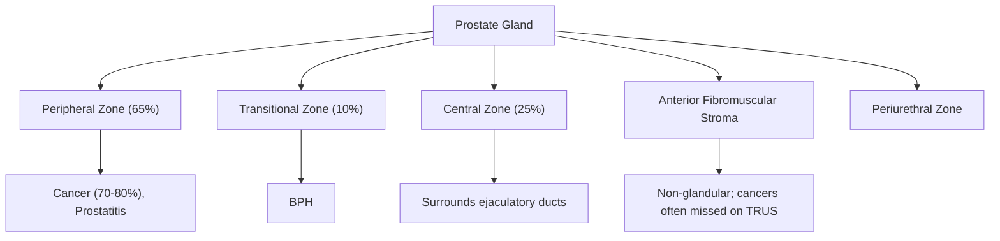

# Prostate Cancer

## 1. Definition

Prostate cancer (PCa) is a malignant neoplasm arising from the epithelial cells of the prostate gland. ***> 95% of prostate cancers are adenocarcinoma*** [1][2]. The name itself is straightforward: "prostate" = the walnut-shaped gland below the bladder; "carcinoma" = cancer of epithelial origin; "adeno-" = glandular. So adenocarcinoma of the prostate = a cancer arising from the glandular epithelial cells of the prostate.

It is a disease of enormous clinical importance because it is extremely common, often indolent (slow-growing), yet can be lethal when advanced. The central clinical challenge is distinguishing clinically significant cancers that need treatment from indolent ones that can be safely observed — this is the core tension in prostate cancer management.

<Callout title="Key Concept">
Prostate cancer overwhelmingly arises in the **peripheral zone** of the prostate. This has two critical clinical implications: (1) it is palpable on DRE (the peripheral zone is posteriorly located, abutting the rectum), and (2) it does **not** cause early obstructive urinary symptoms (unlike BPH, which arises in the transitional zone surrounding the urethra). Therefore, prostate cancer often presents **late** or is found **incidentally**.
</Callout>

---

## 2. Epidemiology

### 2.1 Global Perspective

- Prostate cancer is the **second most common cancer** in men worldwide and the **fifth leading cause of cancer death** in men globally [3].
- There is enormous geographic variation: highest incidence in North America, Northern/Western Europe, Australia, and Caribbean (particularly Afro-Caribbean populations); lowest in Asia.
- This variation is partly genetic (ethnicity) and partly environmental/dietary (westernised diet, screening practices).

### 2.2 Hong Kong Perspective

This is what matters for your exams:

- ***Prostate cancer is the 3rd most common cancer among males in Hong Kong*** [2][3].
- ***Lifetime risk: approximately 1 in 26–30*** [2][4].
- ***Annual incidence: ~2,300 new cases per year*** [2].
- ***Incidence rate: 56.6 per 100,000 males; mortality rate: 12.1 per 100,000 males (4.9% of male cancer deaths, ranking 5th)*** [4].
- ***Used to be rare in HK but now has increasing incidence, probably due to ageing population, westernised lifestyle, and increased health awareness with increased screening PSA tests*** [4].
- ***40–50% are diagnosed at stage I–II in HK (this proportion is higher in the West due to more widespread screening)*** [4].
- ***1/3 of patients present with locally advanced or metastatic disease*** [2].

### 2.3 Age Distribution

- ***More common in advanced age; one of the strongest relationships between age and any human malignancy*** [4].
- ***Rare before age 40*** [4].
- Incidence rises steeply after age 50 and peaks in men aged 70–80.
- Autopsy studies show occult (clinically insignificant) prostate cancer in ~30% of men aged 50 and ~70% of men aged 80 — this underlines the concept that many men die **with** prostate cancer, not **of** it.

> **High Yield**: In HK, prostate cancer is the **3rd most common male cancer** with **rising incidence**. The key drivers are ageing, westernisation, and increased PSA testing.

---

## 3. Anatomy and Function of the Prostate

Understanding prostate anatomy is **essential** for understanding why BPH and prostate cancer behave differently, why DRE can detect prostate cancer, and how cancer spreads.

### 3.1 Basic Anatomy

The prostate is a **walnut-sized exocrine gland** (~20g in young adults) located:
- **Inferior** to the urinary bladder
- **Anterior** to the rectum (hence palpable on DRE)
- **Surrounding** the prostatic urethra (the first segment of the urethra after the bladder neck)
- **Superior** to the external urethral sphincter and pelvic floor

The ejaculatory ducts (formed by the union of the vas deferens and seminal vesicle duct) pass through the prostate to open at the verumontanum (seminal colliculus) on the posterior wall of the prostatic urethra.

### 3.2 McNeal's Zonal Anatomy

This is the modern anatomical classification and is **critical** for exams:

| Zone | % of Glandular Tissue | Clinical Significance |
|---|---|---|
| ***Peripheral zone*** | ***65%*** | ***Common site of prostate cancer*** (70–80% arise here) and prostatitis [1][4][5] |
| ***Transitional zone*** | ***10%*** | ***Common site of BPH*** (median lobe enlargement) [1][5] |
| ***Central zone*** | ***25%*** | Surrounds ejaculatory ducts; ~8% of cancers arise here [4] |
| ***Anterior fibromuscular stroma*** | Non-glandular | No glandular tissue → cancers here are ***often missed by TRUS-guided biopsy*** [4]; 20–30% of cancers may arise in the anterior zone |
| ***Periurethral zone*** | Small | Surrounds prostatic urethra; site of periurethral BPH nodules |

<Callout title="Why does prostate cancer present late?" type="idea">
Because **70–80% of cancers arise in the peripheral zone**, which is located **posteriorly and away from the urethra**. The cancer can grow substantially before it compresses the urethra enough to cause obstructive symptoms. In contrast, BPH arises in the **transitional zone** which **directly surrounds the urethra**, so even small amounts of hyperplasia can cause significant obstruction. This is why BPH causes early LUTS but prostate cancer often does not.
</Callout>

### 3.3 Function

The prostate gland produces **prostatic fluid**, which constitutes about 20–30% of seminal fluid. Key components include:
- **Prostate-Specific Antigen (PSA)**: a serine protease whose function is to **liquefy the semen coagulum** after ejaculation, facilitating sperm motility [2]. PSA is organ-specific but NOT cancer-specific — this is crucial for understanding PSA's limitations as a tumour marker.
- **Citric acid, zinc, fibrinolysin, acid phosphatase**
- **Prostatic secretions are slightly acidic** (pH ~6.5)

### 3.4 Hormonal Dependence

- The prostate is an **androgen-dependent organ**.
- Testosterone (from the testes, and a small amount from the adrenals) is converted to ***dihydrotestosterone (DHT)*** within the prostate by the enzyme ***5α-reductase*** [1].
- DHT is the **primary intraprostatic androgen** and is ~5× more potent than testosterone at binding the androgen receptor (AR).
- Both prostatic **epithelial cells** and **stromal cells** express androgen receptors and depend on DHT for growth and survival [1].
- This androgen dependence is the basis for **androgen deprivation therapy (ADT)** in prostate cancer — remove the androgen signal, and prostate cancer cells undergo apoptosis (at least initially).

> **High Yield**: The prostate depends on DHT (converted from testosterone by 5α-reductase). This is the basis for ADT in prostate cancer AND 5α-reductase inhibitors (finasteride/dutasteride) in BPH.

### 3.5 Vascular and Lymphatic Drainage (Relevant to Metastatic Spread)

- **Arterial supply**: Branches of the internal iliac artery (inferior vesical artery)
- **Venous drainage**: The **prostatic venous plexus** (of Santorini) drains into the **internal iliac veins** and, critically, communicates with the ***vertebral venous plexus (Batson's plexus)*** [1][2].
  - Batson's plexus is a **valveless venous system** that runs along the vertebral column. Because it lacks valves, blood can flow in either direction depending on intra-abdominal pressure. This provides a direct route for haematogenous spread of prostate cancer to the **vertebral bodies and axial skeleton** — explaining the classic pattern of **osteoblastic bone metastases** in the spine, pelvis, and ribs.
- **Lymphatic drainage**: Obturator and internal iliac nodes → external iliac → common iliac → para-aortic nodes

<Callout title="Batson's Plexus — Why Prostate Cancer Loves Bone">
The prostatic venous plexus communicates with the valveless vertebral venous plexus (Batson's plexus). When intra-abdominal pressure increases (e.g., straining, coughing), venous blood is shunted retrograde into the vertebral venous system, carrying tumour cells with it. This is why prostate cancer preferentially metastasises to the **axial skeleton** (vertebrae, pelvis, ribs, skull) rather than the appendicular skeleton.
</Callout>

---

## 4. Etiology and Risk Factors

### 4.1 Non-Modifiable Risk Factors

#### 4.1.1 Advanced Age
- ***One of the strongest relationships between age and any human malignancy*** [4].
- ***Aging is the MOST important risk factor*** [1].
- ***Rare before age 40*** [4].
- The mechanism: with ageing, there is cumulative exposure to androgens, accumulation of somatic mutations, epigenetic changes, chronic inflammation, and telomere shortening in prostatic epithelial cells.

#### 4.1.2 Ethnicity/Race
- ***Blacks > Caucasians > Asians*** [4].
- African-American men have the highest incidence and mortality worldwide — they develop cancer earlier, present with higher-grade disease, and have worse outcomes even after adjusting for socioeconomic factors. This is thought to reflect both genetic susceptibility and differences in androgen metabolism.
- Asian men (including Hong Kong Chinese) historically have lower rates, but this gap is **narrowing** with westernisation [4].

#### 4.1.3 Family History
- ***2× risk if 1 first-degree relative affected; 4.5× risk if 2 first-degree relatives affected*** [4].
- Risk is higher if the affected relative was diagnosed at a young age.
- ***5–10% of prostate cancers are hereditary*** [4].

#### 4.1.4 Heritable Genetic Mutations
- ***BRCA1 and BRCA2 mutations*** [1][4]:
  - BRCA2 is a stronger risk factor for prostate cancer than BRCA1 [1].
  - BRCA2 carriers have ~3–8× increased risk and tend to develop **more aggressive, higher-grade** disease.
  - These are **tumour suppressor genes** involved in **homologous recombination DNA repair**. When both alleles are lost (germline mutation + somatic "second hit"), DNA damage accumulates → malignant transformation.
  - BRCA mutations also confer sensitivity to **PARP inhibitors** (e.g., olaparib) — a therapeutic target in metastatic castration-resistant prostate cancer (mCRPC).
- ***Other heritable mutations: ATM, CHEK2, Lynch syndrome (HNPCC = hereditary non-polyposis colorectal cancer)*** [4].
- ***TMPRSS2-ETS fusion gene: present in ~50% of prostate cancers*** [2]. TMPRSS2 is an androgen-regulated gene; when fused with ETS family transcription factors (e.g., ERG), it drives androgen-dependent overexpression of oncogenic transcription factors.

### 4.2 Modifiable/Potentially Modifiable Risk Factors

#### 4.2.1 Hormonal Factors
- ***Growth of prostate cancer is stimulated by androgens*** [4].
- The role of 5α-reductase inhibitors (finasteride, dutasteride) is debated — they reduce overall prostate cancer incidence but there was concern about increasing high-grade cancer detection (likely a detection bias rather than a true increase) [4].

#### 4.2.2 Obesity and Exercise
- ***Obesity: small increased risk*** [4] — likely through altered hormonal milieu (higher oestrogen from aromatisation, insulin resistance, IGF-1 signalling).
- ***Regular physical exercise decreases risk*** [4].

#### 4.2.3 Dietary Factors
- ***Evidence is generally weak*** [4].
- ***Potentially protective: selenium, lycopene (tomatoes), vitamin E, green tea, possibly coffee*** [4].
- ***Potentially harmful: dietary fat (linked to obesity), isoflavonoids (soybean products — note: this is debated)*** [4].
- High animal fat intake may increase risk; high vegetable intake may be protective [1].

#### 4.2.4 Smoking
- ***Smoking*** is listed as a risk factor [1][2] — associated with higher-grade disease and worse prognosis rather than significantly increased incidence.

#### 4.2.5 Other
- Chronic prostatitis/inflammation: may contribute to carcinogenesis through oxidative stress and proliferative inflammatory atrophy (PIA) → prostatic intraepithelial neoplasia (PIN) → carcinoma sequence.

<Callout title="Risk Factors Summary Mnemonic: 'AGE BRCA FAT'" type="idea">
- **A**ge (most important)
- **G**enetics (BRCA2 > BRCA1, TMPRSS2-ETS, ATM, CHEK2, Lynch)
- **E**thnicity (Black > White > Asian)
- **B**RCA2 (aggressive disease, PARP inhibitor target)
- **R**elatives (FHx — number and age of affected first-degree relatives)
- **C**ancer history (Lynch syndrome association)
- **A**ndrogens (hormonal stimulation)
- **F**at (dietary fat, obesity)
- **A**ctivity (lack of exercise)
- **T**obacco (smoking — worse prognosis)
</Callout>

---

## 5. Pathophysiology

### 5.1 Carcinogenesis Pathway

The current model of prostate carcinogenesis involves a stepwise progression:

1. **Normal epithelium** → chronic inflammation and oxidative stress
2. **Proliferative Inflammatory Atrophy (PIA)** → a regenerative lesion in response to chronic injury; increased cell proliferation with incomplete differentiation
3. ***Prostatic Intraepithelial Neoplasia (PIN)*** → the recognised pre-malignant lesion
   - ***High-grade PIN (PIN 2/3): architecturally benign prostatic acini and ducts lined by atypical cells*** [4]
   - ***High-grade PIN carries a 13–27% risk of finding cancer on repeat biopsy → should re-biopsy*** [4]
   - ***Low-grade PIN (PIN 1): NO clinical significance, does NOT require repeat biopsy*** [4]
4. **Invasive adenocarcinoma** → localised → locally advanced → metastatic

Other pre-malignant/atypical findings:
- ***Atypical adenomatous hyperplasia*** [4]
- ***Intraductal carcinoma of the prostate*** [4] — this is actually a marker of aggressive disease and is often found alongside high-grade invasive cancer.

### 5.2 Androgen Signalling in Prostate Cancer

- Prostate cancer cells initially depend on androgen receptor (AR) signalling for survival and proliferation → this is **androgen-sensitive** (castration-sensitive) disease.
- Testosterone → DHT (by 5α-reductase) → DHT binds AR → AR translocates to nucleus → activates transcription of genes promoting proliferation (e.g., PSA gene, TMPRSS2).
- **Androgen deprivation therapy (ADT)** works by removing this signal → cancer cells undergo apoptosis.
- However, over time (months to years), cancer cells develop mechanisms to **bypass** androgen dependence:
  - AR gene amplification or mutation (can be activated by low androgen levels or even anti-androgens)
  - Intracrine androgen synthesis (tumour cells produce their own androgens)
  - AR splice variants (e.g., AR-V7) that are constitutively active without ligand binding
  - Activation of alternative signalling pathways (PI3K/AKT, Wnt, glucocorticoid receptor)
- This leads to **castration-resistant prostate cancer (CRPC)**, which is the lethal form of the disease.

### 5.3 Molecular Subtypes and Key Genetic Alterations

| Alteration | Frequency | Significance |
|---|---|---|
| ***TMPRSS2-ERG fusion*** | ***~50%*** | Androgen-driven oncogene expression [2] |
| PTEN loss | ~40% | Loss of tumour suppressor → PI3K/AKT activation |
| TP53 mutation | ~20% (higher in CRPC) | Loss of cell cycle checkpoint |
| RB1 loss | ~10–20% in CRPC | Neuroendocrine differentiation |
| BRCA2/ATM/DNA repair defects | ~20–25% of mCRPC | Sensitivity to PARP inhibitors and platinum chemotherapy |
| AR amplification/mutation | Common in CRPC | Drives castration resistance |
| SPOP mutation | ~10% | Mutually exclusive with TMPRSS2-ERG; distinct molecular subtype |

### 5.4 Modes of Spread

This is critical for understanding staging and clinical presentation:

| Mode | Route | Common Sites |
|---|---|---|
| ***Direct extension*** | Local invasion | ***Bladder, seminal vesicles*** [1]; rectum (rare due to Denonvilliers' fascia) |
| ***Lymphatic spread*** | Regional lymphatics | ***Obturator nodes → internal iliac → external iliac → common iliac → pelvic and para-aortic lymph nodes*** [1] |
| ***Haematogenous spread*** | ***Prostatic venous plexus → vertebral venous plexus (Batson's plexus)*** | ***Bone (most common: vertebrae, pelvis, ribs, long bones), liver, lung, adrenal*** [1][2] |

<Callout title="Why are prostate cancer bone metastases osteoBLASTIC?">
Most bone metastases from solid tumours are osteolytic (e.g., breast, lung, kidney). Prostate cancer is a classic exception — it typically produces **osteoblastic** (sclerotic) metastases. The mechanism: prostate cancer cells secrete factors such as **endothelin-1, BMPs (bone morphogenetic proteins), and Wnt ligands** that stimulate osteoblast activity and new (but disorganised) bone formation. This results in dense, sclerotic lesions on imaging. PSA itself may also play a role by cleaving parathyroid hormone-related protein (PTHrP), reducing osteoclast activation. Note that in practice, there is often a **mixed** osteoblastic-osteolytic pattern, but the osteoblastic component predominates.
</Callout>

---

## 6. Classification

### 6.1 Histological Classification

- ***Adenocarcinoma (95%)*** [1][4] — the overwhelmingly dominant type
- ***Other histological variants*** [4]:
  - ***Ductal adenocarcinoma***
  - ***Mucinous adenocarcinoma***
  - ***Signet ring cell carcinoma***
  - ***Small cell carcinoma*** (neuroendocrine) — highly aggressive, may not produce PSA, treated with platinum-based chemotherapy
  - Sarcomatoid carcinoma
  - Squamous cell carcinoma (very rare)
  - Transitional cell carcinoma (extension from bladder)

### 6.2 Gleason Grading System

This is one of the most important concepts in prostate cancer and is **extremely high yield**.

#### Background
- ***Commonly used system for classifying histologic characteristics of prostate cancer*** [1].
- Developed by Donald Gleason in the 1960s–70s, based entirely on **architectural pattern** (how glands are arranged), NOT nuclear features.
- The pathologist identifies the **primary (most prevalent) pattern** and the **secondary (second most prevalent) pattern**, each graded 1–5.
- ***Gleason score = primary pattern + secondary pattern*** (range: 2–10) [1].
- ***Gleason 8–10 is considered high-grade*** [1].

#### Gleason Patterns (from well to poorly differentiated)

| Pattern | Description | Differentiation |
|---|---|---|
| ***1*** | ***Small, uniform glands, closely packed*** | ***Well differentiated*** |
| ***2*** | ***More stroma between glands; still fairly uniform*** | ***Moderately differentiated*** |
| ***3*** | ***Distinctly infiltrative margins; variable gland size*** | Moderate |
| ***4*** | ***Irregular masses of neoplastic glands; fused/cribriform glands*** | ***Poorly differentiated*** |
| ***5*** | ***Only occasional gland formation; sheets/cords of cells, comedonecrosis*** | ***Poorly differentiated / Anaplastic*** |

In modern practice (2014 ISUP modified Gleason), patterns 1 and 2 are essentially never assigned on needle biopsy — the minimum Gleason score on biopsy is **3+3 = 6**.

#### ISUP Grade Groups (2014 Revision) — **Must Know**

The ISUP (International Society of Urological Pathology) introduced **Grade Groups** to simplify Gleason scoring and better stratify prognosis:

| ***Grade Group*** | ***Gleason Score*** | ***Gleason Pattern*** | Prognosis |
|---|---|---|---|
| ***1*** | ***≤ 6*** | ***≤ 3+3*** | Excellent (most indolent) |
| ***2*** | ***7*** | ***3+4*** | Good (predominantly well-formed glands with some fused) |
| ***3*** | ***7*** | ***4+3*** | Intermediate (predominantly poorly formed/fused glands) |
| ***4*** | ***8*** | ***4+4, 3+5, 5+3*** | Poor |
| ***5*** | ***9–10*** | ***4+5, 5+4, 5+5*** | Very poor (most aggressive) |

[2][4]

<Callout title="Why does Gleason 3+4 ≠ 4+3?" type="error">
Students often assume Gleason 7 is Gleason 7. **This is wrong.** A Gleason 3+4 = 7 (Grade Group 2) has a **significantly better prognosis** than Gleason 4+3 = 7 (Grade Group 3). The primary (dominant) pattern matters more — if the majority of the tumour is pattern 4 (poorly formed/fused glands), the biology is more aggressive. This distinction changes management: 3+4 may be suitable for active surveillance in select cases, while 4+3 generally warrants definitive treatment.
</Callout>

### 6.3 TNM Staging (AJCC 8th Edition, 2017)

#### T — Primary Tumour

| Stage | Description |
|---|---|
| T1 | Clinically inapparent (not palpable, not visible on imaging) |
| T1a | Incidental finding in ≤ 5% of resected tissue (e.g., TURP specimen) |
| T1b | Incidental finding in > 5% of resected tissue |
| T1c | Identified by needle biopsy (e.g., due to elevated PSA) |
| T2 | Organ-confined, palpable |
| T2a | Involves ≤ half of one lobe |
| T2b | Involves > half of one lobe |
| T2c | Involves both lobes |
| T3 | Extracapsular extension |
| T3a | Extracapsular extension (unilateral or bilateral) or microscopic bladder neck invasion |
| T3b | Invasion of seminal vesicle(s) |
| T4 | Fixed or invades adjacent structures other than seminal vesicles (e.g., external sphincter, rectum, levator muscles, pelvic wall) |

#### N — Regional Lymph Nodes

| Stage | Description |
|---|---|
| N0 | No regional lymph node metastasis |
| N1 | Regional lymph node metastasis (obturator, internal/external iliac, presacral) |

#### M — Distant Metastasis

| Stage | Description |
|---|---|
| M0 | No distant metastasis |
| M1a | Non-regional lymph node metastasis (e.g., para-aortic, inguinal) |
| M1b | Bone metastasis |
| M1c | Other sites (lung, liver, adrenal, brain) with or without bone disease |

### 6.4 Risk Stratification (D'Amico / NCCN)

Localised prostate cancer is stratified into risk groups to guide management:

| Risk Group | Criteria (any of the following) |
|---|---|
| **Low** | T1–T2a AND Gleason ≤ 6 (Grade Group 1) AND PSA < 10 |
| **Intermediate** | T2b–T2c OR Gleason 7 (Grade Group 2–3) OR PSA 10–20 |
| **High** | T3a OR Gleason 8–10 (Grade Group 4–5) OR PSA > 20 |
| **Very High** | T3b–T4, primary Gleason pattern 5, > 4 cores with Gleason 8–10, or ≥ 2 high-risk features |

---

## 7. Clinical Features

### 7.1 Key Principle: Why Prostate Cancer is Often Asymptomatic Early

As discussed above, **70–80% of cancers arise in the peripheral zone**, away from the urethra. The cancer can grow silently for years without compressing the urethra. Many prostate cancers are discovered **incidentally** through PSA testing or DRE screening before any symptoms develop. When symptoms do occur, they often indicate **locally advanced or metastatic disease**.

### 7.2 Symptoms

#### 7.2.1 Asymptomatic / Incidental Discovery (Most Common Presentation in the PSA Era)
- ***Incidental findings: abnormal DRE, elevated PSA*** [2]
- Increasingly, prostate cancer is detected before symptoms develop because of routine or opportunistic PSA testing.

#### 7.2.2 Lower Urinary Tract Symptoms (LUTS) — Late Finding

***Obstructive LUTS are late findings because cancer arises in the peripheral zone*** [2].

LUTS occur when the cancer grows large enough to compress the urethra or invade the bladder neck/trigone:

**Voiding (Obstructive) Symptoms:**
- Hesitancy (difficulty initiating micturition) — the enlarged prostate compresses the prostatic urethra, increasing urethral resistance
- Weak stream / decreased force — same mechanism
- Intermittency (stop-start stream) — detrusor struggles against obstruction
- Straining to void
- Terminal dribbling
- Incomplete emptying
- Urinary retention (acute or chronic) — complete obstruction

**Storage (Irritative) Symptoms:**
- Frequency and urgency — secondary detrusor overactivity from chronic obstruction, or direct tumour invasion of the bladder wall/trigone irritating detrusor muscle
- Nocturia — same mechanism
- Urge incontinence

> Note: These symptoms are **indistinguishable** from BPH on history alone. You cannot differentiate BPH from prostate cancer based on LUTS pattern — that's why DRE and PSA are essential.

#### 7.2.3 Haematuria and Haemospermia
- ***Haematuria / haemospermia*** [2] — cancer eroding into the prostatic urethra or ejaculatory ducts, disrupting blood vessels.
- Haemospermia (blood in the semen) is usually benign, but **new-onset haemospermia** in an older man should raise suspicion for prostate cancer.

#### 7.2.4 Erectile Dysfunction
- ***New-onset erectile dysfunction*** [2] — may indicate local invasion of the neurovascular bundles (of Walsh) that run posterolateral to the prostate and are responsible for cavernous nerve-mediated erection.

#### 7.2.5 Symptoms of Locally Advanced Disease
- **Perineal/pelvic pain** — perineural invasion (prostate cancer has a particular tropism for perineural invasion) or direct extension into pelvic floor muscles
- **Rectal symptoms** (tenesmus, rectal bleeding — rare because Denonvilliers' fascia acts as a barrier between the prostate and rectum)
- **Ureteric obstruction** → hydronephrosis → flank pain, renal impairment — from local extension into the trigone/ureteric orifices or bulky pelvic lymphadenopathy compressing ureters
- **Lower limb oedema** — bulky pelvic lymphadenopathy compressing iliac veins or lymphatics

#### 7.2.6 Symptoms of Metastatic Disease

***Metastatic sites: bone (vertebra via Batson's venous plexus), liver, adrenal*** [2]

- **Bone pain** (most common symptom of metastatic prostate cancer):
  - Persistent, dull, deep ache, often in the **lower back, pelvis, hips**
  - Worse at night (unlike mechanical back pain)
  - Pathophysiology: osteoblastic metastases stimulate periosteal nerve stretching and local inflammation
- **Pathological fractures** — weakened bone (despite being osteoblastic, the new bone is structurally disorganised and weak)
- **Spinal cord compression** (oncological emergency):
  - Back pain → progressive lower limb weakness → sensory level → urinary retention/incontinence
  - From vertebral body collapse or epidural tumour extension compressing the spinal cord
- **Bone marrow failure** (pancytopenia) — extensive marrow infiltration by metastatic disease (leukoerythroblastic blood film)
- **Constitutional symptoms**: weight loss, fatigue, anorexia — cytokine-mediated cancer cachexia
- **Hypercalcaemia** — less common in prostate cancer than in other bone-metastasising cancers because osteoblastic lesions tend to **sequester** calcium rather than release it (in fact, prostate cancer patients may even be hypocalcaemic from avid bone uptake)

### 7.3 Signs

#### 7.3.1 Digital Rectal Examination (DRE)

DRE is the single most important physical examination for prostate cancer.

***DRE findings in prostate cancer (only 25% of cancers are palpable)*** [2]:
- ***Asymmetrically enlarged*** prostate
- ***Hard, irregular nodule*** (in contrast to BPH, which is smooth, firm, and rubbery with a symmetrically enlarged gland)
- ***Loss of the midline sulcus*** (the normal median groove between the two lobes is obliterated by tumour)
- ***Fixed*** (cannot be moved — suggests extracapsular extension)
- Surface may be **nodular** or **craggy**

Why only 25% palpable? Because:
1. Many cancers are small (T1c — detected by PSA, not palpable)
2. Anterior tumours (20–30%) are beyond the reach of the examining finger
3. DRE can only assess the posterior and lateral aspects of the prostate

<Callout title="DRE Pearl" type="idea">
A **normal DRE does NOT exclude prostate cancer**. Up to 75% of prostate cancers are impalpable at diagnosis. Conversely, an abnormal DRE warrants further investigation regardless of the PSA level — approximately 25% of men with prostate cancer have a PSA in the "normal" range ( < 4 ng/mL).
</Callout>

#### 7.3.2 Other Physical Signs
- **Palpable bladder** — if urinary retention has developed from obstruction
- **Lower limb lymphoedema** — bulky pelvic lymphadenopathy
- **Bony tenderness** — metastatic bone disease (percussion tenderness over spine)
- **Neurological signs** — if spinal cord compression (upper motor neuron signs below the level of compression: hyperreflexia, upgoing plantars, sensory level, urinary retention)
- **Cachexia** — advanced/metastatic disease
- **Pallor** — anaemia from bone marrow infiltration or chronic disease

---

## 8. PSA — Prostate-Specific Antigen (Detailed Discussion)

PSA is so central to prostate cancer that it deserves its own section.

### 8.1 What is PSA?

- PSA is a **serine protease** (kallikrein-3) produced by prostatic epithelial cells.
- ***Function: to liquefy the semen coagulum*** after ejaculation [2].
- It is **organ-specific** (produced only by prostatic tissue) but ***NOT tumour-specific*** [2] — it is elevated in many non-malignant conditions.

### 8.2 Normal Values and Interpretation

- ***Arbitrary cutoff: PSA < 4 ng/mL*** [2] is traditionally considered "normal."
- ***Higher PSA levels = greater chance of prostate cancer AND higher risk of advanced disease*** [2].
- The ***upper normal limit should be age-related*** [2]:

| Age | Suggested Upper Limit of PSA |
|---|---|
| 40–49 | 2.5 ng/mL |
| 50–59 | 3.5 ng/mL |
| 60–69 | 4.5 ng/mL |
| 70–79 | 6.5 ng/mL |

### 8.3 Factors Affecting PSA

***Factors that INCREASE PSA*** [2]:
- ***Prostate cancer***
- ***BPH***
- ***Acute urinary retention (AROU)***
- ***UTI / prostatitis***
- ***Vigorous cycling***
- ***Recent ejaculation ( < 48 hours)***
- ***DRE*** (modest transient rise — debated whether clinically significant)
- Prostate biopsy, TURP (significant rise)

***Factors that DECREASE PSA*** [2]:
- ***Castration (surgical or medical)***
- ***5α-reductase inhibitors*** (finasteride, dutasteride) — approximately halve PSA levels; must double the measured PSA for true estimate
- ***Prostate radiotherapy***

### 8.4 PSA Derivatives

Because PSA alone has limited specificity (especially in the "grey zone" of 4–10 ng/mL, where only ~25% of men actually have cancer), several PSA derivatives have been developed:

| Derivative | Concept |
|---|---|
| **Free-to-Total PSA ratio** | Cancer cells produce more complexed (bound) PSA; **low free/total ratio ( < 25%)** suggests cancer |
| **PSA density** | PSA ÷ prostate volume (on TRUS/MRI); **> 0.15** suggests cancer (BPH produces PSA proportional to gland size, cancer produces disproportionately more) |
| **PSA velocity** | Rate of PSA rise over time; **> 0.75 ng/mL/year** is suspicious |
| ***Prostate Health Index (PHI)*** | ***Combines total PSA, free PSA, and [-2]proPSA (p2PSA, a cancer-specific PSA isoform); PHI > 35 → proceed to prostate biopsy*** [2] |

### 8.5 PSA Screening Controversy

***Benefits of PSA screening*** [3]:
- ***May reduce prostate cancer mortality*** (ERSPC trial showed 20% relative reduction in prostate cancer mortality at 16 years in the screened group)

***Harms of PSA screening*** [3]:
- ***False positives leading to anxiety and unnecessary biopsies***
- ***Overdiagnosis and overtreatment of indolent cancers*** (many low-grade cancers detected by screening would never have caused symptoms or death)
- ***Complications from biopsy and treatment (incontinence, erectile dysfunction)***

***EAU Guideline 2025: Screening targets men aged 55–69 primarily, with risk stratification including family history, ethnicity, and genetic predispositions (e.g., BRCA mutations). Men at higher risk are screened earlier and more intensively.*** [3]

***PSA screening recommendations*** [2][4]:
- ***Not recommended for age < 40 or > 77 (with life expectancy < 10 years)***
- ***May be considered for age 55–77***
- ***May be considered for age 40–55 with family history***
- ***Deferred follow-up of 8 years for those with normal PSA ( < 1 ng/mL at age 40 and < 2 ng/mL at age 60)*** [4]
- ***Further workup (risk calculator, additional serum/urine tests, imaging) before biopsy if equivocal PSA (2–10 ng/mL)*** [4]
- ***Proceed to prostate biopsy if elevated PSA ( > 10 ng/mL) or palpable DRE nodule*** [4]

> **High Yield**: PSA is organ-specific but NOT tumour-specific. The "grey zone" is PSA 4–10 ng/mL. Use PHI, free/total PSA ratio, MRI, and clinical context to decide on biopsy. Screening is controversial — shared decision-making is key.

---

## 9. Prostate Biopsy — Key Details

***Indications for prostate biopsy*** [2]:
- ***Elevated PSA > 10 ng/mL***
- ***Abnormal DRE***
- ***PHI > 35***
- ***Early prostate cancer on active surveillance (for re-staging)***
- ***Abnormal MRI prostate (PI-RADS 4–5)***

***Approach*** [2]:
- ***Transrectal (with TRUS or MRI guidance)***
- ***Transperineal (with TPUS or MRI guidance)*** — increasingly preferred due to lower infection risk
- ***"Fusion biopsy": combines pre-biopsy MRI images with real-time ultrasound*** for targeted biopsies of suspicious lesions [2]

***Preparation***: ***Check MSU 1 week prior; treat UTI if positive*** [2]

***Technique***: ***Take 12–18 random systematic biopsies*** (sampling all zones) ***plus targeted biopsies*** of MRI-suspicious lesions [2]

***Complications*** [2]:
- ***Bleeding: haematuria, PR bleeding, haemospermia***
- ***Infection: < 0.5% for transperineal; ~5% for transrectal (antibiotic prophylaxis with fluoroquinolone required for transrectal approach)***
- ***Acute urinary retention (1–2%): from pain and swelling of the prostate***

---

<Callout title="High Yield Summary">

**Definition**: Adenocarcinoma (95%) arising predominantly from the **peripheral zone** of the prostate.

**Epidemiology (HK)**: 3rd most common male cancer; rising incidence; lifetime risk ~1/26–30; 1/3 present with locally advanced/metastatic disease.

**Risk Factors**: Age (most important) > ethnicity (Black > White > Asian) > family history (2× if 1 FDR, 4.5× if 2 FDR) > genetics (BRCA2, TMPRSS2-ERG, ATM, Lynch) > androgens > obesity/diet > smoking.

**Anatomy**: Peripheral zone (65%, cancer), Transitional zone (10%, BPH), Central zone (25%), Anterior fibromuscular stroma. Cancer in peripheral zone → late symptoms, palpable on DRE.

**Spread**: Direct (bladder, seminal vesicles) → Lymphatic (pelvic → para-aortic LN) → Haematogenous (Batson's plexus → axial skeleton: osteoblastic bone mets).

**Gleason/Grade Groups**: Gleason score = primary + secondary pattern (1–5). Grade Groups 1–5 (ISUP 2014). Gleason 3+4 ≠ 4+3 (different grade groups, different prognosis!).

**Clinical Features**: Often asymptomatic early. LUTS are **late** (peripheral zone origin). DRE: hard, irregular, nodule, loss of midline sulcus (only 25% palpable). Metastatic: bone pain (axial skeleton), cord compression, pathological fractures.

**PSA**: Organ-specific, NOT tumour-specific. Cutoff 4 ng/mL (age-adjusted). Grey zone 4–10 → PHI, free/total ratio, MRI. Factors ↑PSA: cancer, BPH, UTI, AROU, ejaculation, cycling. Factors ↓PSA: castration, 5ARI, RT.

**Screening (EAU 2025)**: Risk-stratified, primarily age 55–69; earlier for high-risk (FHx, BRCA). Shared decision-making. Not for < 40 or > 77 with life expectancy < 10 years.
</Callout>

---

<ActiveRecallQuiz
  title="Active Recall - Prostate Cancer (Definition, Epidemiology, Risk Factors, Anatomy, Pathophysiology, Classification, Clinical Features)"
  items={[
    {
      question: "What zone of the prostate does prostate cancer most commonly arise from, and why does this matter clinically?",
      markscheme: "Peripheral zone (70-80%). Clinically important because: (1) it is posteriorly located so palpable on DRE, (2) it is away from the urethra so does NOT cause early obstructive LUTS — cancer presents late or incidentally on PSA/DRE. Contrast with BPH which arises in transitional zone around the urethra causing early LUTS."
    },
    {
      question: "What is the Gleason grading system? Why is Gleason 3+4 different from 4+3?",
      markscheme: "Gleason score = sum of the two most prevalent architectural patterns (each graded 1-5). 3+4=7 is Grade Group 2 (good prognosis; predominantly well-formed glands), while 4+3=7 is Grade Group 3 (intermediate prognosis; predominantly poorly formed/fused glands). The primary (dominant) pattern determines biological behaviour."
    },
    {
      question: "Explain why prostate cancer preferentially metastasises to the axial skeleton. What type of bone metastasis does it produce and why?",
      markscheme: "Haematogenous spread via the prostatic venous plexus communicating with Batson's (vertebral) venous plexus, which is valveless — allows retrograde tumour cell dissemination to vertebrae, pelvis, ribs. Produces osteoBLASTIC metastases because cancer cells secrete endothelin-1, BMPs, and Wnt ligands that stimulate osteoblast activity. PSA may also cleave PTHrP reducing osteoclast activity."
    },
    {
      question: "List 4 factors that can increase PSA and 3 factors that decrease PSA. Why is PSA not a perfect tumour marker?",
      markscheme: "Increase: CA prostate, BPH, UTI/prostatitis, AROU, vigorous cycling, recent ejaculation less than 48h, DRE, biopsy. Decrease: castration, 5-alpha-reductase inhibitors (halve PSA), prostate RT. PSA is organ-specific but NOT tumour-specific — elevated in many benign conditions. In PSA grey zone (4-10), only approx 25% actually have cancer."
    },
    {
      question: "What is the Prostate Health Index (PHI)? When is it used and what threshold prompts biopsy?",
      markscheme: "PHI combines total PSA, free PSA, and [-2]proPSA (p2PSA, a cancer-specific isoform). Used when PSA is 4-10 ng/mL with normal DRE (grey zone) to better risk-stratify. PHI greater than 35 prompts proceeding to prostate biopsy."
    },
    {
      question: "What are the EAU 2025 recommendations for PSA screening? Who should and should not be screened?",
      markscheme: "Screening primarily targets men aged 55-69 with risk stratification (FHx, ethnicity, BRCA mutations). Higher-risk men screened earlier and more intensively. NOT recommended for age less than 40 or greater than 77 with life expectancy less than 10 years. May consider age 40-55 with family history. Shared decision-making due to risks of overdiagnosis, overtreatment, biopsy complications."
    }
  ]}
/>

## References

[1] Senior notes: felixlai.md (Prostate cancer section)
[2] Senior notes: maxim.md (Section 2.5 Urological neoplasm — Prostate cancer)
[3] Lecture slides: GC 183. Common urological malignancies and their presentations - Nov 7.pdf (p35 — Benefits and Harms of PSA Screening, EAU 2025 guidelines)
[4] Senior notes: Ryan Ho Urogenital.pdf (p180 — Section 8.4.2 Carcinoma of the Prostate)
[5] Lecture slides: Benign Prostatic Hyperplasia.pdf (p3 — McNeal's zonal anatomy; p5 — Etiology and risk factors; p6 — Pathophysiology)
