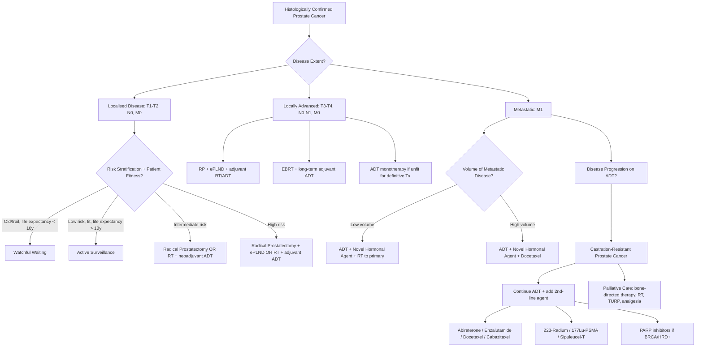

## Management of Prostate Cancer

### The Guiding Philosophy

Management of prostate cancer is arguably the most nuanced in all of oncology. Unlike most cancers where "find it and treat it aggressively" is the default, prostate cancer management is governed by a fundamental tension:

> Many men die **with** prostate cancer, not **of** it. The challenge is to treat aggressively enough to cure those who will die of their cancer, while avoiding over-treatment (and its devastating side effects) in those whose cancer would never have caused harm.

This means management decisions hinge on three things:
1. **Disease risk** (PSA + T-stage + Gleason/Grade Group)
2. **Patient fitness and life expectancy** (age, comorbidities)
3. **Patient preference** (quality of life vs quantity of life)

---

### Management Algorithm — Overview

---

### Treatment by Stage and Risk Group

#### Summary Table (EAU 2024/2025 Recommendations)

| ***Risk / Stage*** | ***Treatment Options*** | ***Key Details*** |
|---|---|---|
| ***Old / frail patients*** | ***Watchful waiting*** [3] | ***Palliative intent; start hormonal treatment (ADT) when symptomatic or high PSA*** [3] |
| ***Low risk (cT1–T2a, GS ≤ 6, PSA < 10)*** | ***Active surveillance*** [3][4] | ***Curative intent; defer radical treatment and treatment-related morbidities; stringent protocol with regular DRE, PSA, MRI and biopsy*** [3] |
| ***Intermediate risk*** | ***Radical prostatectomy (robotic) OR radiotherapy with adjuvant LHRHa*** [3] | RP ± extended PLND; EBRT + neoadjuvant/concomitant ADT [4] |
| ***High risk*** | ***Radical prostatectomy (robotic) OR radiotherapy with adjuvant LHRHa*** [3] | RP + ePLND; EBRT + long-term adjuvant ADT (2–3 years) [4] |
| ***Locally advanced (T3–T4)*** | RP + ePLND + adjuvant EBRT/ADT; or EBRT + adjuvant ADT; or ADT monotherapy if unfit [4] | Prior RT renders subsequent surgery difficult → ***usually prefer initial radical prostatectomy*** [4] |
| ***Metastatic: Low volume*** | ***ADT + Novel hormonal agent + Radiotherapy*** [3] | Novel hormonal agents: ***Enzalutamide / Apalutamide / Abiraterone*** [3] |
| ***Metastatic: High volume*** | ***ADT + Novel hormonal agent + Chemotherapy (docetaxel)*** [3] | ***High volume metastasis: ≥ 4 bone mets including 1 outside axial skeleton or visceral mets*** [3] |
| ***Castration-resistant (CRPC)*** | Continue ADT + add 2nd-line agents [4] | Abiraterone, enzalutamide, docetaxel, cabazitaxel, 223Ra, 177Lu-PSMA, sipuleucel-T [4] |

[3][4]

---

### Detailed Treatment Modalities

#### 1. Deferred Treatment (Conservative)

The rationale for deferred treatment is that ***CA prostate is a slow-growing disease; there is little difference in survival between active treatment or watchful waiting within 5 years*** [4].

##### 1A. Active Surveillance (AS)

| Feature | Detail |
|---|---|
| ***Intent*** | ***Curative — to individualise and defer radical treatment until progression*** [4] |
| ***Patient selection*** | ***Surgically fit, life expectancy > 10 years*** [4] |
| ***Tumour criteria*** | ***Low risk: cT1–T2a, GS < 7 (Grade Group 1), PSA < 10*** [4] |
| ***Monitoring protocol*** | ***DRE, PSA, re-biopsy, mpMRI*** [3][4]; ***stringent protocol with regular DRE, PSA, MRI and biopsy*** [3] |
| ***Triggers for treatment*** | ***Disease progression evident as short PSA doubling time, high-grade or more extensive cancer on biopsy*** [4] |
| ***Outcomes*** | ***90% overall survival, 99.7% cancer-specific survival*** [4] |

**Why does this work?** Grade Group 1 (Gleason ≤ 6) prostate cancer has an extremely low risk of metastasis or cancer-specific death within 10–15 years. The "cost" of radical treatment (incontinence, erectile dysfunction) outweighs the marginal survival benefit in this group. AS allows intervention only when the biology declares itself as more aggressive.

<Callout title="Active Surveillance vs Watchful Waiting" type="error">
Students frequently confuse these two. They are fundamentally different:
- **Active surveillance** = **curative intent**. You monitor closely and treat radically (surgery/RT) at the first sign of progression. The patient is fit for treatment. Think of it as "holding your sword ready."
- **Watchful waiting** = **palliative intent**. You do NOT monitor as stringently. You treat symptoms when they arise (usually with ADT). The patient is NOT fit for curative treatment or has limited life expectancy. Think of it as "putting your sword away."
</Callout>

| ***Feature*** | ***Active Surveillance*** | ***Watchful Waiting*** |
|---|---|---|
| ***Intent*** | ***Curative*** | ***Palliative*** |
| ***Patients*** | ***Surgically fit, > 10y life expectancy*** | ***Surgically unfit, < 10y life expectancy*** |
| ***Tumour*** | ***Low risk (cT1–2a, GS < 7, PSA < 10)*** | ***Any asymptomatic tumour*** |
| ***Monitoring*** | ***DRE, PSA, re-biopsy, mpMRI*** | ***NOT required*** |
| ***Treatment trigger*** | ***Disease progression*** | ***Symptomatic → offer palliative Tx*** |

[4]

##### 1B. Watchful Waiting (WW)

- ***Palliative intent for old fragile patients*** [3]
- ***Start hormonal treatment (ADT) when symptomatic or high PSA*** [3]
- ***No survival benefit of treatment in 12–13 years in newer studies*** [4] — i.e., for older men with limited life expectancy, aggressive treatment does not prolong life compared to managing symptoms as they arise
- Risk of disease ***progression to require palliative intervention is approximately 40–50% over 10 years***, but many will die of other causes first

---

#### 2. Radical Prostatectomy (RP)

***"Robotic-assisted resection of prostate gland + seminal vesicles + ampulla of vas deferens ± pelvic LN dissection"*** [2]

##### Indications

- ***Mainly for localised disease (≤ T3), only highly selected if locally advanced (T3 or N1)*** [4]
- ***Confirmed histological diagnosis*** [1]
- ***Life expectancy > 10 years*** [1]
- ***Patients fully counselled and aware of possible complications and alternative treatment options*** [1]
- ***PSA level < 20 ng/mL (> 20 is much more likely to have spread)*** [1]
- ***Gleason grade < 8 (≥ 8 is much more likely to have spread, often at a micrometastatic level)*** [1]
- ***Negative bone scan ± Negative MRI scan*** [1]

##### Contraindications / Relative Contraindications

- Life expectancy < 10 years (no survival benefit from surgery)
- Unfit for general anaesthesia
- T4 disease (fixed tumour invading rectum, levators, pelvic wall — technically not resectable)
- Extensive nodal or distant metastatic disease (surgery alone will not be curative)
- Patient preference against surgery

##### Approach

***Open (retropubic/perineal), laparoscopic, or robotic — none has clearly shown superiority over others*** [4], though ***robotic-assisted laparoscopic prostatectomy*** is now the most widely used approach worldwide due to improved ergonomics, 3D visualisation, and possibly lower blood loss.

***Open approaches including retropubic or perineal have become largely extinct; laparoscopic and robotic-assisted approach is the preferred treatment*** [1].

##### What Is Removed?

- ***Resection of: prostate, prostatic urethra, seminal vesicles, part of vas deferens*** [4]
- ***± Extended pelvic lymph node dissection (ePLND)***: ***obturator fossa, external iliac up to aortic bifurcation*** [4]
  - ***ePLND proven beneficial over traditional PLND in external iliac nodes only*** [4]
  - ***Pelvic LN dissection only for staging in high risk; no benefit in overall survival*** [2] — it tells you the N stage and guides adjuvant therapy, but removing nodes alone does not cure

##### Aims of Surgery

***Three surgical goals*** [1]:
1. ***Excise cancer completely with a clear margin***
2. ***Maintain continence by preserving the external sphincter*** — the external urethral sphincter sits at the prostatic apex and must be carefully preserved during apical dissection
3. ***Maintain potency by sparing autonomic nerves in the neurovascular bundles*** — ***cavernous nerves lie immediately posterolateral to the prostatic capsule*** [1]

***Nerve-sparing technique*** may be used in most patients to ***↓ risk of erectile dysfunction, but is contraindicated if there is high risk of extracapsular extension*** [4] — because the neurovascular bundles abut the prostatic capsule, and preserving them in the setting of T3a disease risks leaving cancer behind.

##### Adjuvant Therapy After RP

***Adjuvant EBRT if pT3N0 margin-positive or pT3b; adjuvant ADT if N1*** [4]

Why? Positive surgical margins or seminal vesicle invasion (pT3b) indicate that microscopic cancer may remain in the surgical bed → adjuvant radiotherapy reduces local recurrence. N1 disease means systemic micrometastases are likely → adjuvant ADT addresses occult systemic disease.

##### Complications of RP

| Complication | Frequency | Mechanism |
|---|---|---|
| ***Erectile dysfunction*** | ***30% even with good nerve sparing*** [4]; ***50% overall*** [2] | Damage to cavernous nerves in neurovascular bundles; even "nerve-sparing" causes neuropraxia (stretching/bruising of nerves) that may take 6–24 months to recover |
| ***Urinary incontinence*** | ***50% early (immediate post-op), 5–10% long-term*** [4]; ***stress urinary incontinence 10%*** [2] | Damage to the external urethral sphincter during apical dissection; ***managed with pelvic floor muscle exercises or artificial sphincter*** [1] |
| ***Anastomotic stricture*** | ***5–10%*** [4] | Scarring at the vesicourethral anastomosis (bladder neck-to-urethral stump junction) — ***bladder neck contracture*** [1] |
| ***Bleeding*** | ***5–10%*** [4] | The dorsal venous complex (plexus of Santorini) overlies the prostate apex; division during surgery risks haemorrhage |
| ***Rectal injury*** | ***< 5%*** [4] | Prostate is immediately anterior to the rectum; Denonvilliers' fascia is the plane of dissection |
| General perioperative | Mortality < 0.3% [4] | ***MI, DVT*** [1], infection |
| ***Urine leaks*** | Uncommon | Anastomotic leak in the early post-op period |

> **Post-op care**: ***Foley catheter should be placed for ≥ 7 days post-op*** [4] to allow the vesicourethral anastomosis to heal.

<Callout title="Why Does RP Cause Incontinence and Erectile Dysfunction?">
The prostate sits at the crossroads of continence and potency:
- **Continence**: The prostatic urethra is supported by the internal sphincter (bladder neck) above and the external sphincter (rhabdosphincter) below. RP removes the prostate AND bladder neck → the patient relies entirely on the external sphincter for continence. Any damage to this during apical dissection → **stress urinary incontinence**.
- **Potency**: The cavernous nerves (parasympathetic fibres from S2–S4 that mediate erection) run in the **neurovascular bundles** immediately posterolateral to the prostatic capsule. Even with nerve-sparing technique, traction and neuropraxia are inevitable → **erectile dysfunction**. Recovery depends on age, baseline function, and nerve preservation quality.
</Callout>

---

#### 3. Radiotherapy (RT)

***Avoids the risk of surgery and general anaesthesia, but provides equivalent oncological control*** [2].

##### Forms

| Type | Description | Indications |
|---|---|---|
| ***External beam radiotherapy (EBRT) / Intensity-modulated RT (IMRT)*** | High-energy photon beams delivered from outside the body; IMRT allows precise dose shaping to conform to the prostate while sparing surrounding tissues | Localised or locally advanced disease; primary treatment or adjuvant after RP |
| ***Interstitial brachytherapy*** | Radioactive seeds (e.g., I-125 or Pd-103) permanently implanted into the prostate, delivering radiation from within | Low-to-intermediate risk localised disease; ***rarely done in HK*** [4] |

##### Indications

- ***Localised or locally advanced disease*** [4]
- ***Older patients*** [2] — avoids surgical risks
- Alternative to RP for any localised disease (patient preference)
- Adjuvant after RP for positive margins or pT3 disease
- Salvage after biochemical recurrence post-RP

##### ADT in Combination with RT

- ***Neoadjuvant + concomitant ADT if intermediate risk*** [4] — typically 4–6 months of ADT before and during RT
- ***Adjuvant ADT × 2–3 years if high-risk localised or locally advanced*** [4]

Why combine ADT with RT? ADT causes tumour shrinkage (cytoreduction) → smaller radiation target; it also induces apoptosis in cancer cells, making them more radiosensitive; and it controls micrometastatic disease systemically. Randomised trials (e.g., EORTC 22863, RTOG 9202) have shown significant survival benefit from adding long-term ADT to RT in high-risk disease.

##### Complications of Radiotherapy

| Complication | Mechanism |
|---|---|
| ***Erectile dysfunction: up to 30%*** [4] | Radiation damage to the neurovascular bundles and penile vasculature; onset is gradual (6–36 months post-RT), unlike RP where ED is immediate |
| ***Radiation cystitis: up to 10%*** [4] | Radiation injury to the bladder mucosa → frequency, urgency, dysuria, haematuria |
| ***Radiation proctitis: up to 10%*** [4] | Radiation injury to the anterior rectal wall → diarrhoea, tenesmus, PR bleeding |
| ***GI symptoms*** [1] | ***Proctitis, enteritis, diarrhoea, frequency, urgency, tenesmus*** |
| ***UG symptoms*** [1] | ***Cystitis, urethritis, frequency, urgency, dysuria*** |
| ***↓ Stress urinary incontinence compared to RP, but similar ED rates*** [2] | RT preserves the sphincter mechanism (no dissection near the sphincter) |
| ***↑ Irritative symptoms (FUN: frequency, urgency, nocturia)*** [2] | Radiation-induced detrusor overactivity and mucosal inflammation |

<Callout title="RP vs RT — How to Counsel Patients" type="idea">
***Oncological outcomes between radiotherapy and radical surgery are equally favourable and the choice of treatment is up to the patient*** [1]. But the **side effect profiles differ**:
- **RP**: Higher risk of incontinence and immediate ED, but these improve over time; no radiation exposure; provides pathological staging
- **RT**: Lower risk of incontinence; ED develops gradually; higher risk of long-term cystitis/proctitis; no pathological staging; ***prior RT renders subsequent operation difficult*** [4] (complicates salvage surgery if cancer recurs)

In general: **younger, fitter patients** tend to prefer RP (definitive removal, pathological staging, preserves RT as a salvage option); **older patients** or those prioritising continence may prefer RT.
</Callout>

---

#### 4. Androgen Deprivation Therapy (ADT)

##### Why Does ADT Work?

Prostate cancer cells depend on androgen receptor (AR) signalling for survival and proliferation. Testosterone (mainly from testes) is converted to DHT (by 5α-reductase) in the prostate → DHT binds AR → activates transcription of pro-survival genes. **Remove the androgen signal → cancer cells undergo apoptosis.** This is the basis of ADT, first demonstrated by Charles Huggins (Nobel Prize, 1966).

##### ADT Modalities

| Modality | Mechanism | Key Details |
|---|---|---|
| ***Bilateral orchiectomy (surgical castration)*** | Removes the testes → eliminates > 90% of testosterone production | ***GOLD STANDARD but rarely done nowadays due to effective medical therapy*** [1]; irreversible; psychological impact; immediate castrate testosterone levels |
| ***GnRH agonists (e.g., Goserelin, Leuprolide)*** | ***Initially ↑↑ LH and FSH (stimulates testes to produce testosterone) → "flare" → then downregulation of GnRH receptors in the pituitary → ↓ LH and FSH → ↓ testosterone*** [1] | Most widely used form of ADT; requires anti-androgen cover for first 2–4 weeks to prevent flare; depot injections (monthly or 3-monthly) |
| ***GnRH antagonists (e.g., Degarelix, Relugolix)*** | ***Directly blocks GnRH receptors → ↓ testosterone without initial rise*** [1] | No flare phenomenon → preferred when flare is dangerous (e.g., impending cord compression, severe bone pain); Relugolix is an oral GnRH antagonist (newer) |

***> 90% of male hormones (testosterone) originate from the testes; < 10% (DHEA, DHEA-S, androstenedione) originate from the adrenals*** [1]

<Callout title="GnRH Agonist Flare — Why It Happens and Why It Matters" type="error">
GnRH agonists (like goserelin) initially **stimulate** the pituitary because they are agonists — they cause a surge of LH/FSH release, which in turn causes a **testosterone surge ("flare")** lasting 1–2 weeks. In a patient with widespread bone metastases or impending cord compression, this flare can cause **catastrophic worsening** — increased bone pain, cord compression, or ureteric obstruction. 

**Solution**: Either (1) use a **GnRH antagonist** (no flare) or (2) **cover with an anti-androgen** (e.g., bicalutamide) for the first 2–4 weeks to block the testosterone flare at the receptor level.
</Callout>

##### Anti-Androgens (Androgen Receptor Blockers)

| Agent | Generation | Mechanism | Role |
|---|---|---|---|
| ***Flutamide / Nilutamide / Bicalutamide*** | 1st generation | ***Block ligand binding to androgen receptor*** [1] | ***Block disease flare that may occur with the rise of serum testosterone associated with GnRH agonist therapy*** [1]; also used in combined androgen blockade (CAB) |
| ***Enzalutamide / Apalutamide / Darolutamide*** | 2nd generation (next-generation anti-androgens) | Block AR signalling at multiple steps: inhibit AR nuclear translocation, DNA binding, and coactivator recruitment | Used in mCRPC and now upfront in mHSPC; much more potent than 1st-generation agents |

##### Novel Hormonal Agents (NHA)

| Agent | Mechanism | Indication |
|---|---|---|
| ***Abiraterone + Prednisolone*** | ***CYP17 inhibitor*** [4] — blocks CYP17A1 enzyme in the adrenal glands, testes, and tumour cells, preventing synthesis of androgens (and cortisol, hence need for prednisolone to prevent adrenal insufficiency and mineralocorticoid excess) | mHSPC (upfront with ADT); mCRPC [4] |
| ***Enzalutamide*** | ***Inhibitor of androgen receptor signalling*** [4] — potent AR antagonist; blocks AR nuclear translocation and DNA binding | mHSPC (upfront with ADT); mCRPC [3][4] |
| ***Apalutamide*** | Similar to enzalutamide; potent AR antagonist | mHSPC; nmCRPC (non-metastatic CRPC) [3] |

##### Side Effects of ADT (Androgen Deprivation)

***Side effects of testosterone-lowering agents*** [1]:

| Side Effect | Mechanism |
|---|---|
| ***Hot flushes*** | Loss of testosterone disrupts hypothalamic thermoregulation (similar to menopausal hot flashes) |
| ***Fatigue*** | Multifactorial: anaemia, loss of muscle mass, metabolic changes |
| ***Erectile dysfunction*** | Loss of androgen-mediated libido and penile vascular function |
| ***Loss of libido*** | Testosterone is the primary driver of male sexual desire |
| ***Anaemia*** | Androgens stimulate erythropoiesis; their removal → ↓ RBC production |
| ***Gynecomastia*** | Altered androgen/oestrogen ratio → oestrogen-mediated breast tissue proliferation; ***also a side effect of anti-androgens*** [1] |
| ***↓ Lean body mass, ↑ body fat, ↓ muscle strength*** [4] | Androgens are anabolic; their loss causes sarcopenia and fat redistribution |
| ***↑ Risk of cardiovascular disease and ↑ insulin resistance*** [4] | Metabolic syndrome from androgen deprivation |
| ***Osteoporosis → pathological fractures*** | Androgens maintain bone density; their loss → accelerated bone resorption |
| ***Cognitive changes, depression*** | Androgens have neuroprotective and mood-regulating effects |

---

#### 5. Systemic Therapy for Metastatic Prostate Cancer

##### 5A. Metastatic Hormone-Sensitive Prostate Cancer (mHSPC)

This is newly diagnosed metastatic disease that has NOT yet been treated with ADT (or is still responding to ADT).

***The modern approach*** [3][4]:

- ***Traditional approach: ADT monotherapy first → add others if CRPC*** [2] — this is **outdated**
- ***New approach: upfront combination therapy*** [2][3] — multiple landmark trials (CHAARTED, LATITUDE, STAMPEDE, ENZAMET, TITAN, ARASENS) have proven that **upfront intensification** dramatically improves survival

***Treatment by metastatic volume*** [3]:

| ***Volume*** | ***Definition*** | ***Treatment*** |
|---|---|---|
| ***Low volume*** | < 4 bone metastases AND no visceral mets AND all within axial skeleton | ***ADT + Novel hormonal agent (Enzalutamide / Apalutamide / Abiraterone) + Radiotherapy to the primary tumour*** [3] |
| ***High volume*** | ***≥ 4 bone metastases including ≥ 1 outside the axial skeleton, OR visceral metastases*** [3] | ***ADT + Novel hormonal agent + Chemotherapy (docetaxel)*** [3] |

Why treat the primary tumour with RT in low-volume disease? The STAMPEDE trial showed that in patients with low metastatic burden, adding radiotherapy to the prostate (while on systemic ADT) improved overall survival — likely because the primary tumour is a source of ongoing seeding of metastatic clones.

##### 5B. Castration-Resistant Prostate Cancer (CRPC)

***Definition of CRPC*** [4]:
- ***Castrate level of testosterone ( < 50 ng/dL)*** — i.e., the patient IS on ADT
- PLUS ***disease progression*** defined as:
  - ***Biochemical progression: 3 consecutive rises in PSA 1 week apart with 2 × 50% increase over nadir and one PSA > 2 ng/mL***
  - ***Radiological progression: ≥ 2 new bone lesions on bone scan or enlarging soft tissue lesion***
  - ***Symptomatic progression alone is NOT sufficient to diagnose CRPC*** [4]

***Mechanism: either tumour cells becoming testosterone-independent or autonomous androgen secretion*** [4] — through AR gene amplification, AR splice variants (AR-V7), intracrine androgen synthesis, or activation of alternative growth pathways.

***Treatment of CRPC*** [4]: ***Usually continue ADT + add 2nd-line treatment***:

| Agent | Mechanism | Key Points |
|---|---|---|
| ***Abiraterone + prednisone*** | ***CYP17 inhibitor*** [4] | Blocks adrenal and intratumoral androgen synthesis |
| ***Enzalutamide / Apalutamide*** | ***Inhibitor of androgen receptor signalling*** [4] | Blocks AR at multiple levels even in CRPC |
| ***Docetaxel*** | Taxane chemotherapy; stabilises microtubules → prevents mitotic spindle disassembly → cell cycle arrest and apoptosis | ***First-line chemotherapy for mCRPC*** [4]; also used upfront in high-volume mHSPC |
| ***Cabazitaxel*** | Semi-synthetic taxane | Second-line chemotherapy after docetaxel failure; active against docetaxel-resistant cells |
| ***223-Radium (Alpharadin)*** | ***Localises to bone → emits α-particles to relieve skeletal symptoms*** [4] | Calcium mimetic taken up by bone → delivers high-energy, short-range alpha radiation to bone metastases; improves OS in symptomatic bone-predominant mCRPC |
| ***177Lu-PSMA*** | ***Newer treatment that localises to CaP cells*** [4] | Lutetium-177 labelled PSMA ligand → binds PSMA on cancer cells → delivers beta radiation to tumour; VISION trial showed OS benefit in PSMA-positive mCRPC |
| ***Sipuleucel-T*** | ***Dendritic cell vaccine programmed to target prostatic acid phosphatase*** [4] | Immunotherapy; autologous dendritic cells activated ex vivo with PAP-GM-CSF fusion protein; modest survival benefit (~4 months); mainly used in US |
| **PARP inhibitors (Olaparib, Rucaparib)** | Synthetic lethality in tumours with homologous recombination repair defects (BRCA1/2, ATM) | Indicated in mCRPC with BRCA/HRD mutations; cancer cells with BRCA loss cannot repair double-strand DNA breaks → PARP inhibition blocks the backup repair pathway → cell death |

---

#### 6. Bone-Directed Therapy

Prostate cancer has a particular tropism for bone, and skeletal complications (pain, fractures, cord compression) are a major source of morbidity. Bone-directed therapies are used alongside systemic treatment:

##### Bisphosphonates and RANK-Ligand Inhibitors

| Agent | Mechanism | Indication |
|---|---|---|
| ***Bisphosphonates (e.g., zoledronic acid)*** | Bind to hydroxyapatite on bone surfaces → inhibit osteoclast-mediated bone resorption | Prevent skeletal-related events (SREs) in mCRPC with bone metastases; also prevent ADT-related osteoporosis |
| ***Denosumab (RANK-ligand inhibitor)*** | Monoclonal antibody against RANKL → prevents RANKL from activating RANK on osteoclast precursors → inhibits osteoclast differentiation and function | Superior to zoledronic acid in preventing SREs in mCRPC; does not require renal dose adjustment |

**Side effects**: osteonecrosis of the jaw (ONJ — hence dental review before starting), hypocalcaemia (supplement calcium and vitamin D), atypical femoral fractures.

---

#### 7. Palliative Management

***Palliative treatment options*** [4]:

| Symptom | Management |
|---|---|
| ***Bone symptoms*** | ***Osteoclast inhibition (bisphosphonate, denosumab), palliative RT, analgesics*** [4] |
| ***Spinal cord compression*** | ***High-dose steroids (dexamethasone), decompressive surgery, palliative RT*** [4] — oncological emergency |
| ***Urinary symptoms (obstruction)*** | ***May consider TURP to relieve obstruction*** [4]; catheterisation; ureteric stenting for ureteric obstruction |
| **Pain** | WHO analgesic ladder; palliative RT for focal bone pain; radionuclides (223Ra) for diffuse bone pain |
| **Anaemia** | Transfusion; erythropoiesis-stimulating agents if appropriate |

---

#### 8. Orchiectomy (Surgical Castration)

***Depletion of androgens by surgical means*** [1]:
- ***> 90% of male hormones (testosterone) originate from the testes; < 10% (DHEA, DHEA-S, androstenedione) originate from the adrenals*** [1]
- ***GOLD STANDARD but rarely done nowadays due to effective medical therapy and more widespread use of hormones*** [1]
- Advantages: immediate castrate levels, 100% compliance, one-time procedure, low cost
- Disadvantages: irreversible, psychological impact, visible loss (though subcapsular orchiectomy preserves the testicular shell)

---

### Prognosis

***Prognosis*** [4]:

| Stage | 5-Year Survival |
|---|---|
| ***Localised*** | ***Almost 100%*** |
| ***Locally advanced*** | ***Almost 100%*** |
| ***Metastatic*** | ***~29%*** |

This stark difference between localised/locally advanced (~100%) and metastatic (~29%) underlines why **early detection** and **correct risk stratification** matter — but also why **over-treating** indolent localised disease with its attendant morbidity must be avoided.

---

<Callout title="High Yield Summary — Management of Prostate Cancer">

**Conservative:**
- **Active surveillance**: Curative intent; low-risk disease; fit patient > 10y life expectancy; monitor with DRE/PSA/MRI/re-biopsy; treat on progression. 90% OS, 99.7% CSS.
- **Watchful waiting**: Palliative intent; unfit/elderly patient < 10y life expectancy; treat symptoms with ADT when they arise.

**Localised disease (curative):**
- **Low risk**: Active surveillance (preferred); RP or RT as alternatives
- **Intermediate risk**: RP (robotic) ± ePLND; or EBRT + neoadjuvant/concomitant ADT
- **High risk**: RP + ePLND; or EBRT + long-term adjuvant ADT (2–3y)

**Locally advanced**: RP + ePLND + adjuvant RT/ADT; or EBRT + ADT; or ADT alone if unfit.

**Metastatic (mHSPC)**:
- Low volume: ADT + novel hormonal agent + RT to primary
- High volume (≥ 4 bone mets incl. 1 outside axial skeleton, or visceral mets): ADT + novel hormonal agent + docetaxel

**CRPC** (castrate testosterone + progression): Continue ADT + add abiraterone/enzalutamide/docetaxel/cabazitaxel/223Ra/177Lu-PSMA/PARP inhibitors.

**ADT**: GnRH agonist (cover flare with anti-androgen) or GnRH antagonist (no flare). Side effects: hot flushes, ED, osteoporosis, metabolic syndrome, CVD risk, gynecomastia.

**RP complications**: ED (30–50%), incontinence (5–10% long-term), anastomotic stricture, bleeding, rectal injury.

**RT complications**: ED (30%), cystitis/proctitis (10%), less incontinence than RP.

**Prognosis**: Localised ~100% 5y survival; metastatic ~29%.
</Callout>

---

<ActiveRecallQuiz
  title="Active Recall - Management of Prostate Cancer"
  items={[
    {
      question: "A 62-year-old fit man is diagnosed with prostate cancer: cT1c, Gleason 3+3=6 (Grade Group 1), PSA 5 ng/mL. What is the recommended management and why?",
      markscheme: "Active surveillance. This is low-risk disease (cT1-T2a, GS 6 or less, PSA less than 10). Active surveillance has curative intent with 90% OS and 99.7% cancer-specific survival. It defers radical treatment and its morbidities (incontinence, ED) until evidence of progression (short PSA doubling time, upgrading on re-biopsy). Monitor with regular DRE, PSA, mpMRI, and re-biopsy. Treat radically if the disease progresses."
    },
    {
      question: "Explain the difference between a GnRH agonist and a GnRH antagonist. Why does a GnRH agonist cause a 'flare' and how do you manage it?",
      markscheme: "GnRH agonist (e.g., goserelin) initially stimulates pituitary GnRH receptors causing LH/FSH surge and testosterone flare for 1-2 weeks, then causes receptor downregulation leading to castrate testosterone levels. GnRH antagonist (e.g., degarelix) directly blocks GnRH receptors causing immediate LH/FSH suppression with NO initial testosterone rise. Flare management: cover with first-generation anti-androgen (e.g., bicalutamide) for 2-4 weeks before and after starting GnRH agonist; OR use GnRH antagonist instead (preferred if impending cord compression or severe bone pain)."
    },
    {
      question: "What is the current treatment approach for high-volume metastatic hormone-sensitive prostate cancer? Define high volume.",
      markscheme: "High volume metastasis: 4 or more bone metastases including at least 1 outside the axial skeleton, OR visceral metastases. Treatment: ADT + novel hormonal agent (enzalutamide, apalutamide, or abiraterone) + docetaxel chemotherapy. This upfront combination (triplet therapy) is based on landmark trials showing significant survival benefit over ADT monotherapy. For low-volume disease: ADT + novel hormonal agent + radiotherapy to the primary tumour."
    },
    {
      question: "Define castration-resistant prostate cancer. What biochemical and radiological criteria must be met?",
      markscheme: "CRPC requires: (1) castrate level of testosterone (less than 50 ng/dL, i.e., patient is on ADT), PLUS (2) disease progression defined as: biochemical progression (3 consecutive PSA rises 1 week apart with 2x 50% increase over nadir and PSA greater than 2 ng/mL) OR radiological progression (2 or more new bone lesions on bone scan or enlarging soft tissue lesion). Symptomatic progression alone is NOT sufficient to diagnose CRPC."
    },
    {
      question: "Compare the complication profiles of radical prostatectomy versus radiotherapy for localised prostate cancer.",
      markscheme: "RP: higher incontinence (5-10% long-term stress UI), immediate ED (30-50%), anastomotic stricture (5-10%), bleeding (5-10%), rectal injury (less than 5%). RT: lower incontinence, gradual-onset ED (up to 30%), radiation cystitis/proctitis (up to 10%), increased irritative LUTS. Oncological outcomes are equivalent. RP provides pathological staging and preserves RT as a salvage option. Prior RT makes salvage surgery very difficult."
    },
    {
      question: "What is 177Lu-PSMA therapy and what is 223-Radium? Explain their mechanisms and indications.",
      markscheme: "177Lu-PSMA: Lutetium-177 labelled PSMA ligand that binds to prostate-specific membrane antigen on cancer cells, delivering targeted beta radiation. Indicated in PSMA-positive mCRPC (VISION trial showed OS benefit). 223-Radium (Alpharadin): calcium mimetic that localises to areas of active bone formation (osteoblastic metastases), emitting short-range alpha particles that destroy adjacent cancer cells. Indicated in symptomatic bone-predominant mCRPC without visceral metastases. Both are used in CRPC setting when other therapies have failed."
    }
  ]}
/>

## References

[1] Senior notes: felixlai.md (Prostate cancer — treatment section: conservative, medical, surgical, radiotherapy, orchiectomy)
[2] Senior notes: maxim.md (Section 2.5 — Prostate cancer management: localised and advanced disease)
[3] Lecture slides: GC 183. Common urological malignancies and their presentations - Nov 7.pdf (p41–43 — Prostate cancer treatment: localised, watchful waiting, active surveillance, metastatic)
[4] Senior notes: Ryan Ho Urogenital.pdf (p184–186 — Approach to treatment, deferred treatment, locoregional treatment, systemic therapy, CRPC, prognosis)
