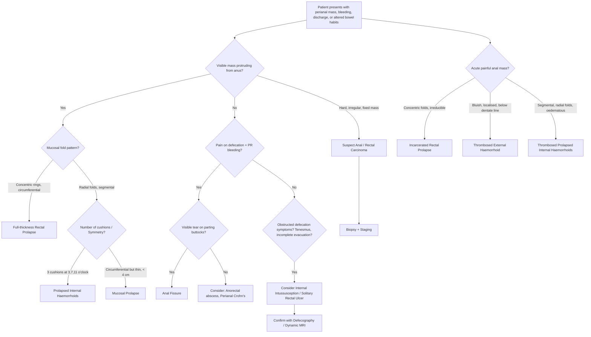

## Differential Diagnosis of Rectal Prolapse

> The differential diagnosis of rectal prolapse centres on one core clinical question: **"There is something protruding from or visible at the anus — what is it?"** The key differentials all present with a perianal mass, bleeding, discharge, or altered bowel habits. Your job is to distinguish them systematically using history, inspection, and examination.

---

### Overview of Key Differentials

The senior notes [2] list the following primary differentials for rectal prolapse:

- ***Prolapsed internal haemorrhoids***
- ***Rectal mucosal prolapse*** (including ***occult rectal prolapse involving intussusception*** — telescoping of bowel on itself internally without protruding through the anal verge, and thus not a true rectal prolapse)
- ***Solitary rectal ulcer***

Beyond these, a complete differential for "something protruding from/at the anus" or "anorectal mass with bleeding and altered bowel habits" also includes:

- **Anal carcinoma**
- **Rectal carcinoma (low rectal polyp/tumour)**
- **Perianal Crohn's disease**
- **Anal fissure** (shares the symptom of pain and PR bleeding)
- **Incarcerated rectal prolapse vs thrombosed prolapsed haemorrhoids** (acute painful anal mass differential) [3]

---

### Detailed Differential Diagnosis

#### 1. ***Prolapsed Internal Haemorrhoids*** [2][3]

This is the **most important differential** and the most commonly confused condition.

**What are haemorrhoids?** Dilated submucosal arteriovenous vascular cushions in the anal canal. Internal haemorrhoids arise **above the dentate line** from the superior rectal venous plexus (portal drainage). They classically sit at **3, 7, and 11 o'clock** positions in lithotomy (corresponding to the terminal branches of the superior rectal artery) [4].

**Why can they be confused with rectal prolapse?** Grade III and IV internal haemorrhoids prolapse through the anus and present as a protruding perianal mass — just like rectal prolapse.

**How to distinguish:**

| Feature | Full-thickness Rectal Prolapse | Prolapsed Haemorrhoids |
|---|---|---|
| **Mucosal fold pattern** | ***Concentric rings*** (circumferential, like a target) | ***Radial folds*** (spoke-like grooves between cushions) [3] |
| **Sulcus between mass and anal canal** | Present (a groove between prolapsing rectum and anal verge) | Absent (haemorrhoids are in continuity with perianal skin) |
| **Symmetry** | Circumferential, symmetric | Segmental — classically 3 separate cushions at 3, 7, 11 o'clock |
| **Layers involved** | All layers (mucosa, submucosa, muscularis, serosa) | Mucosa and submucosal vascular plexus only |
| **Bleeding pattern** | Usually minor, may have associated solitary rectal ulcer | ***Painless bright red outlet-type PR bleeding*** — blood drips into bowl, on paper [4] |
| **Faecal incontinence** | Very common (~75%) — due to chronic sphincter stretch/neuropathy | Rare |
| **Pain** | Usually painless unless incarcerated/strangulated | Usually painless unless thrombosed or incarcerated |
| **Sphincter tone** | Reduced (patulous anus) | Usually normal |

<Callout title="Exam Classic — Concentric vs Radial" type="error">
The single most tested bedside distinction: **concentric rings = rectal prolapse; radial folds = haemorrhoids**. If you see circumferential concentric mucosal rings, it is full-thickness rectal prolapse regardless of what the patient calls it.
</Callout>

#### 2. ***Rectal Mucosal Prolapse (Partial Prolapse)*** [2]

**What is it?** Only the **mucosal layer** of the rectum protrudes through the anus (unlike full-thickness prolapse where all layers protrude). The protrusion is typically < 4 cm.

**Why does it happen?** The mucosa becomes loosely attached to the underlying submucosa (lax submucosal attachments), often in the context of chronic straining. The muscularis propria stays in place — only the superficial layers slide out.

**How to distinguish from full-thickness prolapse:**

| Feature | Full-thickness Prolapse | Mucosal Prolapse |
|---|---|---|
| **Length of protrusion** | Often > 5 cm | Usually < 4 cm |
| **Folds** | Concentric rings | Radial folds (similar to haemorrhoids) |
| **Thickness on palpation** | Thick — you can feel the muscular wall between two fingers | Thin — no palpable muscular layer |
| **Sulcus** | Present between prolapse and anal verge | Absent |
| **Digital examination** | Can insert finger between prolapse and anal canal wall | Cannot — mucosa arises directly from anal canal |

**Why this matters clinically:** Mucosal prolapse is managed differently — it may respond to rubber band ligation or injection sclerotherapy (like haemorrhoids), whereas full-thickness prolapse requires surgical repair (rectopexy or perineal procedures).

#### 3. ***Occult Rectal Prolapse (Internal Intussusception)*** [2]

**What is it?** ***Telescoping of bowel on itself internally without protruding through the anal verge and thus not a true rectal prolapse*** [2]. The rectum intussuscepts into itself but the leading point does not emerge externally.

**Why does it matter?** It causes obstructed defecation symptoms (incomplete evacuation, tenesmus, straining, need for digital manoeuvres) that mimic other causes of outlet obstruction. There is **no visible external prolapse**, so it is easily missed.

**How to diagnose:** Defecography (fluoroscopic or dynamic MRI) — this is the only reliable way to identify it. On defecography, you see the rectal wall telescoping during straining.

**Clinical significance:** Internal intussusception is thought to be the **precursor** to full-thickness external prolapse — it represents an earlier point on the same disease spectrum.

#### 4. ***Solitary Rectal Ulcer (Syndrome)*** [2][5]

**What is it?** An ulcer (or sometimes a polypoid lesion) on the anterior rectal wall, typically 6–10 cm from the anal verge. Despite the name "solitary," there may be multiple ulcers.

**Why does it occur?** The leading point of the internal intussusception is subjected to repeated ischaemic pressure against the anal canal → mucosal ischaemia → ulceration. It is therefore strongly associated with internal rectal prolapse and rectal prolapse.

**Clinical features:**
- Rectal bleeding (fresh blood)
- Mucus discharge
- Straining and incomplete evacuation
- Perineal and rectal pain/pressure

**Histology** (characteristic): Fibromuscular obliteration of the lamina propria with smooth muscle fibres extending from the muscularis mucosae into the lamina propria, distorted crypt architecture [5].

**Why it's a differential for rectal prolapse:** It shares symptoms (bleeding, discharge, altered bowel habits) and is often found *in association with* rectal prolapse/internal intussusception. Importantly, it can mimic a rectal tumour on endoscopy — biopsy is essential.

#### 5. ***Acute Painful Anal Mass — The "Big Three"*** [3]

When a patient presents with an **acute painful anal mass**, the differential is [3]:

- ***Thrombosed prolapsed internal haemorrhoids***
- ***Thrombosed external haemorrhoids*** (a.k.a. perianal haematoma — ***present as painful bluish mass, form skin tag after 48 hours***) [3]
- ***Incarcerated rectal prolapse (with circular folds)*** [3]

This is a critical distinction because management differs:

| Condition | Key distinguishing feature | Acute management |
|---|---|---|
| Thrombosed prolapsed internal haemorrhoids | Segmental, radial folds, usually 3 cushions visible | Hyperosmolar solution / sitz bath → urgent haemorrhoidectomy if < 72 h [3] |
| Thrombosed external haemorrhoid | Bluish, tender, localised perianal mass BELOW dentate line | Incision and evacuation if < 72 h; conservative if > 72 h [3] |
| ***Incarcerated rectal prolapse*** | ***Circumferential concentric folds*** | ***Sugar application + manual reduction + surgery*** [3] |

#### 6. Anal / Low Rectal Carcinoma [6]

**Why is it in the differential?** A low rectal or anal tumour can present as a palpable/visible mass at the anus with bleeding, discharge, and altered bowel habits — similar to rectal prolapse.

***Colorectal neoplasm needs to be excluded*** [1] in any patient presenting with anorectal symptoms.

**Key distinguishing features:**
- Hard, irregular, fixed mass (vs. soft, reducible prolapse)
- Constitutional symptoms (weight loss, anorexia, night sweats)
- ***Change in stool calibre, tenesmus*** [4]
- ***Palpable inguinal lymph nodes*** (if anal carcinoma below dentate line — drains to superficial inguinal nodes) [6]
- ***Risk factors: HPV infection (90%, especially HPV-16 & 18), HIV, smoking, immunocompromised*** [6]

**Key investigation:** ***Digital rectal examination to exclude other rectal lesions*** [1][7], proctoscopy, ***rigid or flexible sigmoidoscopy to exclude proximal bowel lesion*** [1][7], biopsy for histology.

#### 7. Perianal Crohn's Disease [3][5]

**Why is it a differential?** Crohn's disease can cause perianal masses (skin tags, abscesses, fistulae), bleeding, discharge, and pain — mimicking prolapse-associated symptoms.

***Always suspect perianal Crohn's disease if: non-midline fissures, recurring, multiple, unusually deep or wide, perianal hypertrophic skin tags*** [3].

**Key distinguishing features:**
- Associated systemic features (weight loss, diarrhoea, abdominal pain, oral ulcers, extraintestinal manifestations)
- Atypical fissures (off-midline, multiple)
- Complex fistulae
- Characteristic "violaceous" oedematous skin tags

#### 8. Anal Fissure [3]

**Why is it a differential?** Shares the symptoms of pain on defecation and fresh PR bleeding.

***Anal fissure = tear in the mucosal lining below the dentate line*** [3]. Most at ***6 o'clock (posterior midline) — the least perfused area*** [3].

**How to distinguish:** Fissure causes sharp, tearing pain during and after defecation with a visible linear tear on inspection. There is no protruding mass. ***Diagnosis is by spreading the buttocks to reveal the fissure — DRE and proctoscopy are painful and not indicated*** [1].

---

### Diagnostic Approach — Mermaid Flowchart

---

### Summary Table of Key Differentials

| Condition | Key Feature | Folds | Pain | Bleeding | Sphincter Tone | Distinguishing Investigation |
|---|---|---|---|---|---|---|
| **Full-thickness rectal prolapse** | All layers protrude circumferentially | Concentric | Usually painless (unless incarcerated) | Mild, mucosal trauma | Reduced (patulous) | Clinical inspection; defecography if occult |
| **Prolapsed haemorrhoids** | Submucosal vascular cushions prolapse | Radial | Painless (unless thrombosed) | Bright red, outlet-type | Normal | Proctoscopy |
| **Mucosal prolapse** | Only mucosa protrudes (< 4 cm) | Radial | Minimal | Mild | Normal | Clinical; thickness on palpation |
| **Internal intussusception** | Telescoping without external protrusion | Not visible | No | Variable | Variable | Defecography / dynamic MRI |
| **Solitary rectal ulcer** | Anterior wall ulcer 6–10 cm from verge | N/A | Rectal discomfort | Yes | Normal | Endoscopy + biopsy (fibromuscular obliteration) |
| **Anal carcinoma** | Hard, irregular, fixed mass | N/A | Yes | Yes | May be normal | Biopsy |
| **Anal fissure** | Linear mucosal tear, posterior midline | N/A | Sharp, on defecation | Bright red, small amount | IAS spasm (hypertonic) | Inspection (parting buttocks) |
| **Perianal Crohn's** | Atypical fissures, oedematous tags, fistulae | N/A | Variable | Variable | Variable | Colonoscopy + biopsy |

---

<Callout title="High Yield Summary">

1. **The three named differentials from senior notes**: prolapsed internal haemorrhoids, rectal mucosal prolapse (including occult internal intussusception), and solitary rectal ulcer.
2. **Concentric rings = rectal prolapse; radial folds = haemorrhoids/mucosal prolapse** — the single most important bedside distinction.
3. **Acute painful anal mass "Big Three"**: thrombosed prolapsed internal haemorrhoids, thrombosed external haemorrhoid, incarcerated rectal prolapse (circular folds). Management differs for each.
4. **Incarcerated rectal prolapse**: sugar application → manual reduction → surgery.
5. **Internal intussusception** is occult — no visible external prolapse — diagnosed by defecography. It is the precursor to full-thickness prolapse.
6. **Solitary rectal ulcer**: associated with internal intussusception; histology shows fibromuscular obliteration of lamina propria; can mimic tumour on endoscopy.
7. **Always exclude colorectal neoplasm** — DRE + proctoscopy + sigmoidoscopy/colonoscopy.
8. **Atypical anal features** (off-midline, multiple, deep fissures, hypertrophic skin tags) → suspect perianal Crohn's disease.

</Callout>

---

<ActiveRecallQuiz
  title="Active Recall - Differential Diagnosis of Rectal Prolapse"
  items={[
    {
      question: "Name the three key differentials for rectal prolapse listed in the senior notes, and explain how each is distinguished from full-thickness rectal prolapse.",
      markscheme: "1. Prolapsed internal haemorrhoids - radial folds, segmental (3/7/11 o'clock), no sulcus, mucosa+submucosa only. 2. Rectal mucosal prolapse / occult internal intussusception - mucosa only, thin, less than 4 cm, radial folds; internal intussusception has no external protrusion. 3. Solitary rectal ulcer - ulcer on anterior rectal wall associated with internal intussusception, histology shows fibromuscular obliteration.",
    },
    {
      question: "A patient presents with an acute painful irreducible perianal mass with circumferential concentric folds. What is the diagnosis and immediate bedside management?",
      markscheme: "Incarcerated rectal prolapse. Immediate management: apply granulated sugar to the oedematous prolapsed mucosa (osmotic effect draws out oedema fluid), then attempt gentle manual reduction. Definitive management is surgical repair.",
    },
    {
      question: "Why is solitary rectal ulcer syndrome associated with rectal prolapse, and what is the characteristic histological finding?",
      markscheme: "The leading point of the intussuscepting rectum is compressed against the anal canal during straining, causing ischaemic pressure on the anterior rectal wall mucosa leading to ulceration. Histology: fibromuscular obliteration of the lamina propria with smooth muscle fibres extending from muscularis mucosae into the lamina propria, and distorted crypt architecture.",
    },
    {
      question: "List the three causes of an acute painful anal mass and one key distinguishing feature for each.",
      markscheme: "1. Thrombosed prolapsed internal haemorrhoids - segmental with radial folds. 2. Thrombosed external haemorrhoid - localised bluish mass below dentate line, forms skin tag after 48 hours. 3. Incarcerated rectal prolapse - circumferential with concentric (circular) folds.",
    },
    {
      question: "What clinical features should make you suspect perianal Crohn's disease rather than a simple anal fissure?",
      markscheme: "Non-midline fissures, recurring fissures, multiple fissures, unusually deep or wide fissures, perianal hypertrophic skin tags. Also consider if associated with systemic symptoms of Crohn's (abdominal pain, diarrhoea, weight loss, oral ulcers, extraintestinal manifestations).",
    },
  ]}
/>

---

## References

[1] Lecture slides: GC 179. Anal pain perianal lesions and sepsis.pdf (p28, p65–68, p77)
[2] Senior notes: felixlai.md (Rectal prolapse section, pp. 761–763)
[3] Senior notes: maxim.md (Acute painful anal mass differential; Rectal prolapse vs prolapsed haemorrhoid; Anal fissure section)
[4] Senior notes: maxim.md (Haemorrhoids section — types, examination, DDx of LGIB)
[5] Senior notes: felixlai.md (Ulcerative colitis differential diagnosis — solitary rectal ulcer syndrome; Anal fissure section)
[6] Senior notes: maxim.md (Anal carcinoma section)
[7] Senior notes: felixlai.md (Haemorrhoids — diagnosis: DRE, proctoscopy, sigmoidoscopy)
